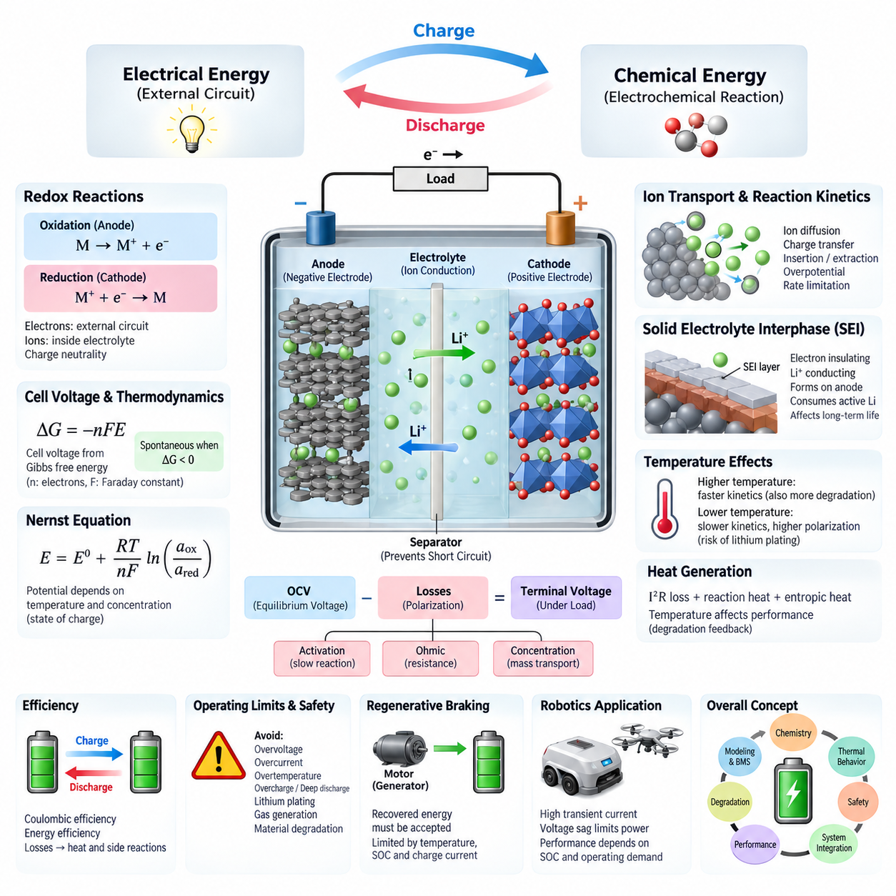
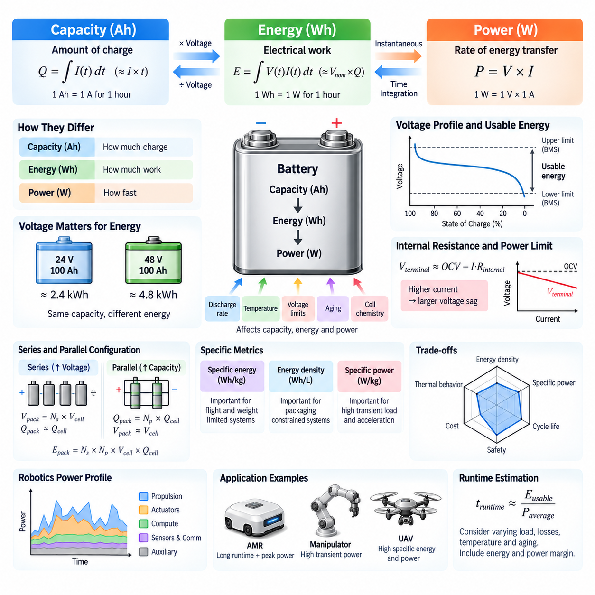
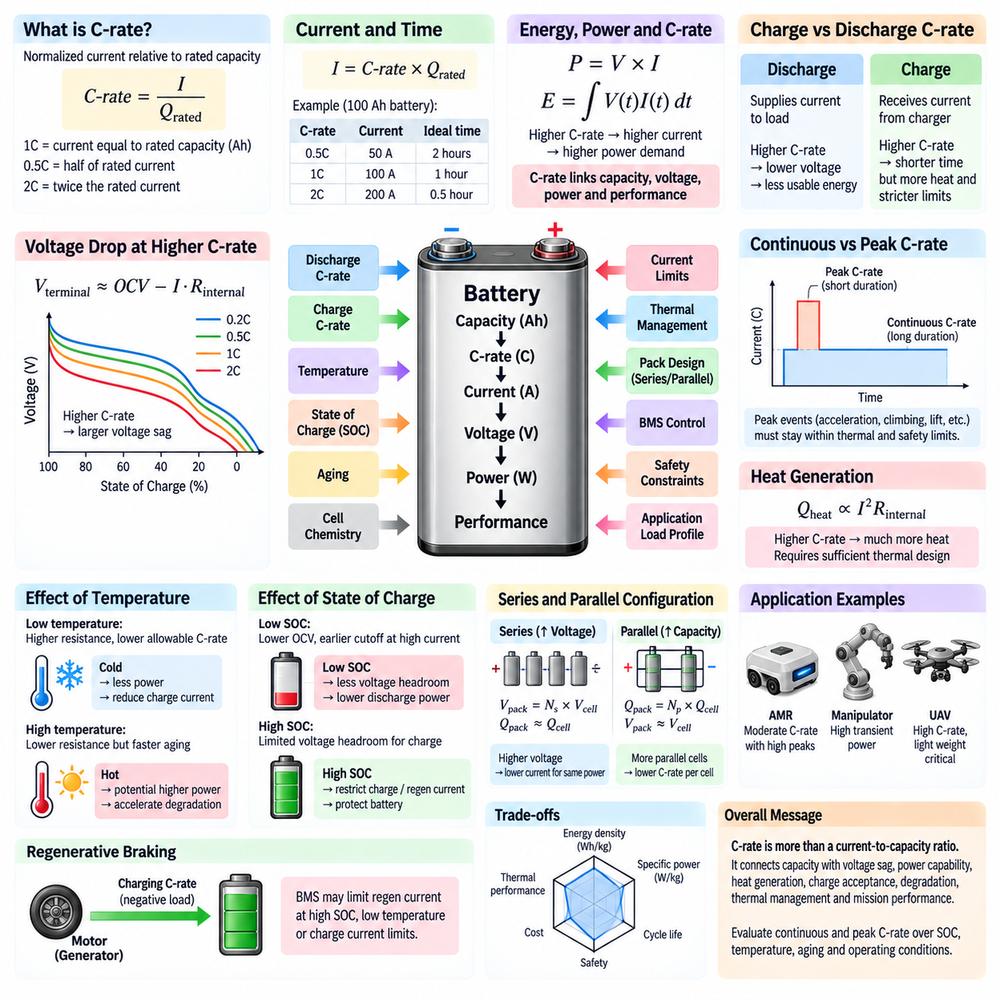
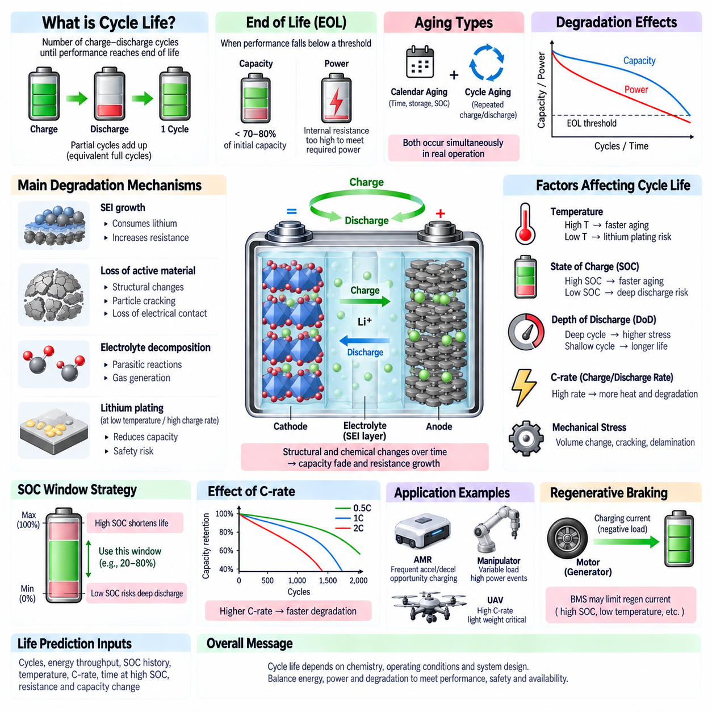
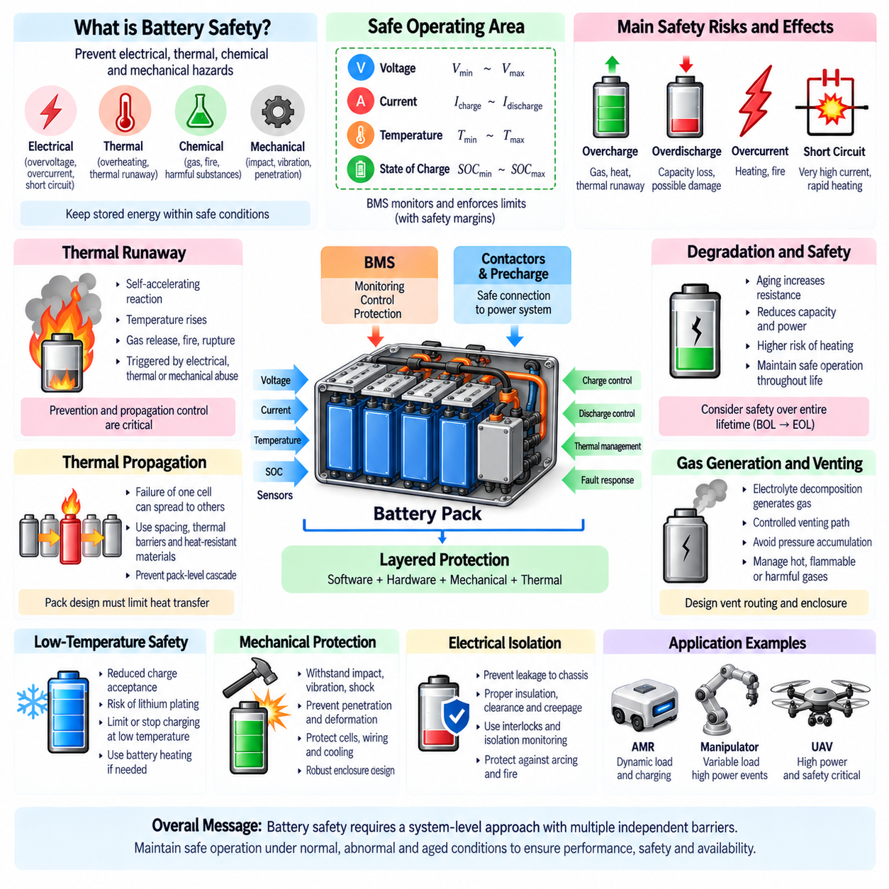

**Volume 11. Battery and Powertrain**


# Chapter 01. Battery Fundamentals

##  

## 01.01. Electrochemical Principles

{width="7.268055555555556in" height="7.268055555555556in"}

Electrochemical energy storage is based on the controlled conversion between chemical energy and electrical energy through oxidation and reduction reactions. A battery cell contains two electrodes separated by an ionically conductive electrolyte. During operation, electrons travel through the external circuit while ions move internally through the electrolyte, allowing electrical work to be delivered without direct electronic conduction between the electrodes.

An electrochemical cell operates through two coupled half-reactions. Oxidation releases electrons at one electrode, while reduction consumes electrons at the other. These reactions must occur simultaneously because charge cannot accumulate indefinitely within either electrode. The external electron flow and internal ionic flow therefore form complementary paths that maintain charge neutrality and sustain continuous electrochemical conversion.

During discharge, the negative electrode functions as the anode, where oxidation supplies electrons to the external circuit. The electrons pass through the connected electrical load and reach the positive electrode, or cathode, where reduction occurs. Inside the cell, ions migrate through the electrolyte to balance the electronic charge transfer. Charging applies an external voltage that drives these processes in the reverse direction.

The tendency of an electrode to participate in oxidation or reduction is represented by its electrode potential. A practical cell voltage results from the difference between the electrochemical potentials of its positive and negative electrodes. Selecting electrode materials with an appropriate potential difference enables useful operating voltage, while their chemical stability determines whether the reactions can be repeated reversibly over many charge-discharge cycles.

Under equilibrium conditions, cell voltage is related to the change in Gibbs free energy of the electrochemical reaction. The fundamental relationship ΔG = −nFE connects chemical driving force with electrical potential, where n is the number of electrons transferred and F is the Faraday constant. A negative Gibbs free-energy change for the discharge reaction corresponds to the ability of the cell to deliver electrical energy spontaneously.

Electrode potential is not constant under all operating conditions. The Nernst equation describes how equilibrium potential varies with temperature and the activities or effective concentrations of participating chemical species. Consequently, battery voltage depends not only on electrode chemistry but also on composition and state of charge. This relationship provides an important thermodynamic foundation for interpreting open-circuit voltage and electrochemical state.

The electrolyte provides the ionic conduction path required to complete the internal electrochemical circuit while ideally blocking electronic conduction. Depending on battery chemistry, charge may be transported by lithium ions or other ionic species. The separator physically prevents direct contact between positive and negative electrodes while remaining permeable to ions, thereby reducing the possibility of an internal short circuit while permitting normal cell operation.

At each electrode-electrolyte interface, electrochemical reactions involve charge transfer between electronic states in the electrode and ionic species in the electrolyte. Reaction kinetics determine how rapidly this transfer can occur. When current increases, the actual electrode potential departs from its equilibrium value. This deviation, commonly described as overpotential, represents additional electrochemical driving force required to sustain the desired reaction rate.

Battery voltage under load therefore differs from equilibrium open-circuit voltage. Activation polarization arises from finite charge-transfer kinetics, ohmic polarization results from resistance in electrodes, electrolyte, current collectors, tabs, and connections, and concentration polarization develops when reactants cannot be transported rapidly enough. These effects collectively produce voltage loss during discharge and additional required voltage during charging.

Ion transport inside electrodes and electrolyte is another fundamental limitation on battery performance. Ions must migrate or diffuse through electrolyte pathways and, in many rechargeable cells, enter or leave active electrode materials. At high current, transport may become unable to maintain uniform concentration distributions. Resulting concentration gradients increase polarization, reduce accessible capacity, generate additional heat, and can accelerate degradation under demanding operating conditions.

Rechargeable lithium-ion cells commonly store charge through reversible insertion and extraction of lithium ions within host electrode structures. During discharge, lithium ions move through the electrolyte from the negative side toward the positive side while electrons follow the external circuit. During charging, an external power source reverses these flows. Maintaining structural and chemical reversibility is essential for achieving acceptable efficiency and cycle life.

The solid-electrolyte interphase, commonly called the SEI, illustrates the importance of interface chemistry. It forms primarily through electrolyte reduction at the negative electrode and can become electronically insulating while remaining conductive to lithium ions. A stable SEI suppresses continuous electrolyte decomposition, but its formation consumes active lithium. Continued growth or repeated damage can increase impedance and contribute to long-term capacity loss.

Electrochemical reactions are strongly influenced by temperature. Increasing temperature generally accelerates reaction kinetics and ionic transport, potentially reducing internal resistance, but it also accelerates undesirable side reactions and material degradation. Low temperature slows charge transfer and diffusion, increasing polarization and reducing available power. Charging under unsuitable low-temperature conditions may also create damaging deposition mechanisms instead of normal reversible ion insertion.

Electrical current and heat generation are closely coupled within a working cell. Resistive losses approximately increase with the square of current through I²R heating, while electrochemical polarization and reversible entropic effects can contribute additional thermal behavior. Because temperature subsequently changes resistance, kinetics, transport, and degradation rates, battery operation forms an electrochemical-thermal feedback system rather than an isolated electrical energy source.

The observable terminal voltage of a battery can consequently be interpreted as an equilibrium electrochemical voltage modified by dynamic losses. A simplified engineering representation expresses terminal behavior through open-circuit voltage, internal resistance, and polarization components. Although real cells require more sophisticated models, this viewpoint connects fundamental electrochemistry with equivalent-circuit models used by battery management systems for state estimation, prediction, protection, and power limitation.

Energy efficiency depends on how closely charging and discharging occur to their reversible electrochemical potentials. Internal resistance, activation losses, transport limitations, and parasitic reactions convert part of the supplied or stored energy into heat or irreversible chemical change. Coulombic efficiency describes charge recovery, while energy efficiency additionally accounts for voltage differences between charging and discharging. Small persistent inefficiencies can become significant over many cycles.

Electrochemical stability defines practical operating boundaries. Excessive voltage, current, temperature, overcharge, or deep discharge can push electrode and electrolyte potentials outside stable regions, promoting electrolyte decomposition, gas generation, metal dissolution, lithium plating, structural damage, or other unwanted reactions. Battery protection therefore depends on controlling not only terminal voltage but also the internal electrochemical conditions that terminal measurements indirectly represent.

For robotics, electrochemical behavior directly affects available propulsion and computing performance. Motors can impose large transient currents during acceleration, climbing, steering, manipulation, or recovery from obstacles, while processors and sensors create persistent auxiliary loads. Voltage sag caused by internal resistance and polarization can therefore constrain peak power even when considerable stored energy remains, making battery capability dependent on both state of charge and instantaneous operating demand.

Regenerative operation introduces the opposite power flow. When motors act as generators, recovered electrical energy must be accepted by the battery through electrochemical charging reactions. Charge acceptance depends on temperature, state of charge, cell chemistry, internal resistance, and allowable charging current. A nearly full or cold battery may accept considerably less regenerative power, requiring the powertrain controller and battery management system to restrict recovery.

These electrochemical principles form the foundation for understanding battery capacity, energy, power, C-rate, degradation, safety, charging, and battery management. They also explain why battery design cannot be reduced to nominal voltage and ampere-hour ratings. Effective robotic powertrain engineering requires coordinated consideration of thermodynamics, reaction kinetics, ion transport, electrical resistance, thermal behavior, operating limits, and the time-varying power demands of the complete system.

전기화학적 에너지 저장(Electrochemical Energy Storage)은 산화 반응(Oxidation Reaction)과 환원 반응(Reduction Reaction)을 통해 화학 에너지(Chemical Energy)와 전기 에너지(Electrical Energy)를 제어된 방식으로 상호 변환하는 원리에 기반한다. 배터리 셀(Battery Cell)은 이온 전도성 전해질(Electrolyte)에 의해 분리된 두 개의 전극(Electrode)으로 구성된다. 작동 중 전자는 외부 회로(External Circuit)를 통해 이동하고 이온은 전해질 내부를 이동함으로써 두 전극 사이의 직접적인 전자 전도 없이 전기적 일을 수행할 수 있게 한다.

전기화학 셀(Electrochemical Cell)은 서로 연계된 두 개의 반쪽 반응(Half-Reaction)을 통해 작동한다. 산화 반응(Oxidation)은 한 전극에서 전자를 방출하고, 환원 반응(Reduction)은 다른 전극에서 전자를 받아들인다. 어느 한 전극에도 전하가 무한정 축적될 수 없으므로 두 반응은 동시에 발생해야 한다. 따라서 외부의 전자 흐름(Electron Flow)과 내부의 이온 흐름(Ionic Flow)은 전하 중성(Charge Neutrality)을 유지하고 지속적인 전기화학적 변환을 가능하게 하는 상호 보완적인 경로를 형성한다.

방전(Discharge) 중에는 음극(Negative Electrode)이 산화 반응을 통해 외부 회로로 전자를 공급하는 애노드(Anode) 역할을 한다. 전자는 연결된 전기 부하(Electrical Load)를 통과하여 양극(Positive Electrode), 즉 캐소드(Cathode)에 도달하고 여기에서 환원 반응이 일어난다. 셀 내부에서는 이온이 전해질을 통해 이동하여 전자의 전하 이동을 보상한다. 충전(Charging)에서는 외부 전압(External Voltage)을 인가하여 이러한 과정을 반대 방향으로 진행시킨다.

전극이 산화 또는 환원 반응에 참여하려는 경향은 전극 전위(Electrode Potential)로 표현된다. 실제 셀 전압(Cell Voltage)은 양극과 음극의 전기화학 퍼텐셜(Electrochemical Potential) 차이에 의해 형성된다. 적절한 전위 차이를 갖는 전극 재료를 선택하면 유용한 동작 전압(Operating Voltage)을 확보할 수 있으며, 전극 재료의 화학적 안정성(Chemical Stability)은 충전과 방전 반응을 여러 사이클 동안 가역적으로 반복할 수 있는지를 결정한다.

평형 조건(Equilibrium Condition)에서 셀 전압은 전기화학 반응의 깁스 자유 에너지(Gibbs Free Energy) 변화와 관련된다. 기본 관계식 ΔG = −nFE는 화학적 구동력(Chemical Driving Force)과 전기적 전위(Electrical Potential)를 연결하며, 여기서 n은 이동하는 전자의 수이고 F는 패러데이 상수(Faraday Constant)이다. 방전 반응에서 깁스 자유 에너지 변화가 음수라는 것은 셀이 자발적으로 전기 에너지를 공급할 수 있음을 의미한다.

전극 전위(Electrode Potential)는 모든 동작 조건에서 일정하지 않다. 네른스트 방정식(Nernst Equation)은 평형 전위(Equilibrium Potential)가 온도와 반응에 참여하는 화학종의 활성도(Activity) 또는 유효 농도(Effective Concentration)에 따라 어떻게 변화하는지를 설명한다. 따라서 배터리 전압은 전극 화학뿐만 아니라 조성과 충전 상태(State of Charge, SOC)의 영향을 받는다. 이러한 관계는 개방 회로 전압(Open-Circuit Voltage, OCV)과 전기화학적 상태를 해석하는 중요한 열역학적 기반을 제공한다.

전해질(Electrolyte)은 내부 전기화학 회로를 완성하는 데 필요한 이온 전도 경로(Ionic Conduction Path)를 제공하면서 이상적으로는 전자 전도를 차단한다. 배터리 화학 특성에 따라 전하는 리튬 이온(Lithium Ion) 또는 다른 이온종(Ionic Species)에 의해 운반될 수 있다. 분리막(Separator)은 양극과 음극의 직접 접촉을 물리적으로 방지하면서 이온은 통과시켜 정상적인 셀 작동을 가능하게 하고 내부 단락(Internal Short Circuit)의 가능성을 감소시킨다.

각 전극-전해질 계면(Electrode-Electrolyte Interface)에서 전기화학 반응은 전극의 전자 상태와 전해질 내 이온종 사이의 전하 전달(Charge Transfer)을 포함한다. 반응 속도론(Reaction Kinetics)은 이러한 전달이 얼마나 빠르게 진행될 수 있는지를 결정한다. 전류가 증가하면 실제 전극 전위는 평형값에서 벗어나게 된다. 일반적으로 과전압(Overpotential)이라고 하는 이러한 편차는 요구되는 반응 속도를 유지하기 위해 필요한 추가적인 전기화학적 구동력을 나타낸다.

따라서 부하가 연결된 상태에서의 배터리 전압은 평형 개방 회로 전압과 다르게 나타난다. 활성화 분극(Activation Polarization)은 유한한 전하 전달 속도 때문에 발생하고, 옴 분극(Ohmic Polarization)은 전극, 전해질, 집전체(Current Collector), 탭(Tab), 연결부의 저항 때문에 발생한다. 농도 분극(Concentration Polarization)은 반응 물질이 충분히 빠르게 이동하지 못할 때 발생한다. 이러한 효과들은 방전 중 전압 손실을 만들고 충전 중에는 추가적인 전압을 요구한다.

전극과 전해질 내부의 이온 수송(Ion Transport) 역시 배터리 성능을 결정하는 근본적인 제한 요소이다. 이온은 전해질 경로를 따라 이동하거나 확산해야 하며, 많은 충전식 셀에서는 활성 전극 재료 내부로 삽입되거나 빠져나와야 한다. 높은 전류에서는 수송 과정이 균일한 농도 분포를 유지하지 못할 수 있다. 그 결과 발생하는 농도 구배(Concentration Gradient)는 분극을 증가시키고 사용 가능한 용량을 감소시키며 추가적인 열을 발생시키고 가혹한 운전 조건에서 열화(Degradation)를 가속할 수 있다.

충전식 리튬이온 셀(Rechargeable Lithium-Ion Cell)은 일반적으로 호스트 전극 구조(Host Electrode Structure) 내부에서 리튬 이온이 가역적으로 삽입되고 추출되는 과정을 통해 전하를 저장한다. 방전 중에는 리튬 이온이 전해질을 통해 음극 측에서 양극 측으로 이동하는 반면 전자는 외부 회로를 따라 이동한다. 충전 중에는 외부 전원이 이러한 흐름을 반대로 만든다. 구조적 및 화학적 가역성(Reversibility)을 유지하는 것은 적절한 효율과 사이클 수명(Cycle Life)을 확보하는 데 필수적이다.

고체 전해질 계면막(Solid-Electrolyte Interphase, SEI)은 계면 화학(Interface Chemistry)의 중요성을 보여주는 대표적인 사례이다. SEI는 주로 음극에서 전해질의 환원으로 형성되며, 전자에 대해서는 절연성을 가지면서 리튬 이온에 대해서는 전도성을 가질 수 있다. 안정적인 SEI는 지속적인 전해질 분해를 억제하지만 형성 과정에서 활성 리튬(Active Lithium)을 소비한다. 지속적인 성장이나 반복적인 손상은 임피던스(Impedance)를 증가시키고 장기적인 용량 감소에 기여할 수 있다.

전기화학 반응은 온도(Temperature)의 영향을 강하게 받는다. 온도가 증가하면 일반적으로 반응 속도와 이온 수송이 빨라져 내부 저항(Internal Resistance)이 감소할 수 있지만, 동시에 원하지 않는 부반응(Side Reaction)과 재료 열화도 가속된다. 저온에서는 전하 전달과 확산이 느려져 분극이 증가하고 사용 가능한 출력이 감소한다. 부적절한 저온 조건에서 충전하면 정상적인 가역적 이온 삽입 대신 손상을 유발하는 석출 메커니즘(Deposition Mechanism)이 발생할 수도 있다.

작동 중인 셀에서는 전류와 열 발생(Heat Generation)이 밀접하게 결합되어 있다. 저항 손실(Resistive Loss)은 대략 I²R 발열에 따라 전류의 제곱에 비례하여 증가하며, 전기화학적 분극과 가역적 엔트로피 효과(Reversible Entropic Effect)도 추가적인 열적 거동에 영향을 줄 수 있다. 온도는 다시 저항, 반응 속도, 수송 특성 및 열화 속도를 변화시키므로 배터리 작동은 독립적인 전기 에너지원이 아니라 전기화학-열 피드백 시스템(Electrochemical-Thermal Feedback System)을 형성한다.

따라서 배터리의 관측 가능한 단자 전압(Terminal Voltage)은 동적 손실에 의해 수정된 평형 전기화학 전압으로 해석할 수 있다. 단순화된 공학적 표현에서는 단자 거동을 개방 회로 전압, 내부 저항 및 분극 성분을 통해 나타낸다. 실제 셀에는 더욱 정교한 모델이 필요하지만, 이러한 관점은 기본 전기화학과 배터리 관리 시스템(Battery Management System, BMS)에서 상태 추정, 예측, 보호 및 출력 제한에 사용하는 등가 회로 모델(Equivalent-Circuit Model)을 연결한다.

에너지 효율(Energy Efficiency)은 충전과 방전이 가역적인 전기화학 전위에 얼마나 근접하여 이루어지는지에 따라 달라진다. 내부 저항, 활성화 손실, 수송 제한 및 기생 반응(Parasitic Reaction)은 공급되거나 저장된 에너지의 일부를 열 또는 비가역적인 화학적 변화로 전환한다. 쿨롱 효율(Coulombic Efficiency)은 회수 가능한 전하를 나타내며, 에너지 효율은 충전과 방전 사이의 전압 차이까지 추가로 고려한다. 작고 지속적인 비효율도 많은 사이클이 누적되면 상당한 영향을 미칠 수 있다.

전기화학적 안정성(Electrochemical Stability)은 실제 사용 가능한 동작 경계를 정의한다. 과도한 전압, 전류, 온도, 과충전(Overcharge) 또는 과방전(Deep Discharge)은 전극과 전해질 전위를 안정 영역 밖으로 밀어내어 전해질 분해, 가스 발생, 금속 용출(Metal Dissolution), 리튬 도금(Lithium Plating), 구조적 손상 또는 기타 원하지 않는 반응을 촉진할 수 있다. 따라서 배터리 보호는 단자 전압뿐만 아니라 단자 측정값이 간접적으로 나타내는 내부 전기화학 상태까지 제어해야 한다.

로보틱스(Robotics)에서 전기화학적 거동은 사용 가능한 추진 및 컴퓨팅 성능에 직접적인 영향을 미친다. 모터는 가속, 등판, 조향, 매니퓰레이션(Manipulation) 또는 장애물 탈출 과정에서 큰 과도 전류(Transient Current)를 요구할 수 있으며, 프로세서와 센서는 지속적인 보조 부하(Auxiliary Load)를 형성한다. 따라서 내부 저항과 분극으로 발생하는 전압 강하(Voltage Sag)는 상당한 저장 에너지가 남아 있더라도 최대 출력을 제한할 수 있으며, 배터리 성능은 충전 상태와 순간적인 운전 요구 조건 모두에 영향을 받는다.

회생 운전(Regenerative Operation)에서는 전력 흐름이 반대 방향으로 발생한다. 모터가 발전기(Generator)로 작동하면 회수된 전기 에너지는 전기화학적 충전 반응을 통해 배터리에 수용되어야 한다. 충전 수용 능력(Charge Acceptance)은 온도, 충전 상태, 셀 화학, 내부 저항 및 허용 충전 전류에 따라 달라진다. 거의 완전히 충전되었거나 온도가 낮은 배터리는 회생 전력을 훨씬 적게 수용할 수 있으므로 파워트레인 제어기(Powertrain Controller)와 배터리 관리 시스템이 에너지 회수를 제한해야 한다.

이러한 전기화학 원리(Electrochemical Principles)는 배터리 용량(Capacity), 에너지(Energy), 출력(Power), C-레이트(C-Rate), 열화, 안전, 충전 및 배터리 관리에 대한 이해의 기초를 형성한다. 또한 배터리 설계를 단순히 공칭 전압(Nominal Voltage)과 암페어시(Ampere-Hour, Ah) 정격만으로 설명할 수 없는 이유를 보여준다. 효과적인 로봇 파워트레인(Robot Powertrain) 엔지니어링을 위해서는 열역학, 반응 속도론, 이온 수송, 전기 저항, 열적 거동, 동작 한계 및 전체 시스템의 시간에 따라 변화하는 전력 요구를 통합적으로 고려해야 한다.

##  

## 01.02. Capacity/Energy/Power

{width="7.268055555555556in" height="7.268055555555556in"}

Battery capacity describes the quantity of electrical charge that a battery can deliver under specified operating conditions. It is commonly expressed in ampere-hours (Ah), where one ampere-hour represents a current of one ampere flowing for one hour. Capacity is fundamentally associated with the amount of electrochemically active material available for reversible reaction, but the usable value depends strongly on discharge rate, temperature, voltage limits, aging, and cell chemistry.

The basic relationship between current and capacity can be expressed as Q = ∫I(t)dt. For approximately constant current, this becomes Q = I × t, making capacity a convenient indicator of how long a battery can support a given electrical load. A 100 Ah battery could theoretically provide 10 A for 10 hours, but practical runtime differs because voltage changes, internal losses, protection limits, temperature, and rate-dependent electrochemical effects reduce accessible capacity.

Rated capacity is measured according to defined test conditions rather than representing an unconditional property of the cell. Manufacturers specify discharge current, temperature, initial state of charge, and cutoff voltage when reporting capacity. Changing any of these conditions can alter the measured result. Consequently, engineering comparisons between battery cells or packs should use equivalent test conditions instead of comparing nominal ampere-hour values without considering their measurement basis.

Battery energy represents the electrical work that can be delivered and is measured in watt-hours (Wh) or kilowatt-hours (kWh). Energy depends on both transferred charge and cell voltage, so it provides information that capacity alone cannot provide. The general relationship is E = ∫V(t)I(t)dt. When voltage can be approximated by a representative value, stored energy is often estimated using E ≈ Vnom × Q, where Vnom is nominal voltage.

This distinction becomes important when comparing batteries operating at different voltages. A 100 Ah battery at 24 V stores approximately half the nominal energy of a 100 Ah battery at 48 V, despite having identical ampere-hour capacity. For robotic systems, energy therefore provides a more meaningful first-order measure of potential operating duration, while ampere-hour capacity remains useful for analyzing cell charge, current loading, battery management, and configuration.

Nominal energy is not identical to usable energy. Battery voltage varies with state of charge, current, temperature, and electrochemical polarization, while the battery management system normally prevents operation beyond defined upper and lower voltage limits. Additional reserve margins may be introduced to improve cycle life or safety. Usable energy therefore represents the portion of nominal stored energy that can actually be accessed within the permitted operating window.

Power describes the instantaneous rate at which electrical energy is transferred and is expressed in watts or kilowatts. Electrical power is calculated as P = V × I. A battery may contain substantial energy yet be unable to supply a required peak power if its allowable current is insufficient. Conversely, a high-power battery can support intense short-duration loads while having relatively modest total energy and therefore limited operating duration.

The distinction between energy and power is especially important in robotic powertrain design. Energy determines how long an AMR, mobile manipulator, quadruped, or UAV can continue operating, whereas power determines whether the system can perform demanding actions at a particular moment. Acceleration, climbing, lifting, steering, rapid joint motion, and high-compute operation can produce transient power requirements significantly above the average mission load.

Battery power capability is constrained by cell voltage, internal resistance, reaction kinetics, ion transport, thermal limits, and manufacturer-defined current limits. When high current is drawn, internal resistance and polarization cause terminal voltage to fall. A simplified representation is Vterminal ≈ OCV − I·Rinternal. The corresponding voltage sag can prevent the powertrain from obtaining its requested power even though considerable electrochemical energy remains stored in the battery.

Maximum battery output power therefore cannot be inferred from capacity alone. A large-capacity cell optimized for energy density may have lower permissible current than a smaller high-power cell designed with lower internal resistance and faster electrochemical transport. Cell selection requires consideration of both energy capability and power capability, particularly when motors, actuators, pumps, heaters, computing systems, or other loads create large transient demands.

Specific energy expresses stored energy relative to battery mass, typically in Wh/kg, while energy density may describe energy relative to volume in Wh/L. These metrics are important where mass or packaging volume is constrained. UAVs are particularly sensitive to specific energy because additional battery mass directly influences flight performance, while AMRs may tolerate greater battery mass but face constraints involving payload, chassis space, floor loading, and runtime.

Specific power, typically expressed in W/kg, describes the ability to deliver power relative to battery mass. High specific power is important for systems requiring rapid acceleration, high actuator output, or repeated transient loads. Battery chemistry and cell construction often involve tradeoffs between specific energy, specific power, cycle life, thermal behavior, safety, and cost, so the highest value of a single metric rarely identifies the most suitable battery.

Series and parallel cell configurations influence voltage, capacity, energy, and current capability differently. Connecting cells in series increases pack voltage while maintaining approximately the same ampere-hour capacity as one series string. Connecting identical strings in parallel increases ampere-hour capacity and available current while maintaining voltage. Total pack energy increases when additional cells are added in either configuration because the total amount of stored electrochemical energy increases.

For a pack containing Ns cells in series and Np parallel strings, nominal pack voltage is approximately Ns times cell voltage, while pack capacity is approximately Np times cell capacity. Pack energy can therefore be approximated as Vcell × Qcell × Ns × Np. Real pack performance is lower than ideal calculations because interconnections, contactors, fuses, conductors, balancing circuits, and thermal conditions introduce additional losses and constraints.

Battery sizing begins with the system power profile rather than only the average electrical load. Engineers estimate propulsion, actuator, compute, sensor, communication, cooling, control, and auxiliary consumption across the expected mission. Integrating this time-dependent power demand provides required mission energy, while examining the highest short-duration demands establishes peak power and current requirements. Both conditions must be satisfied by the selected battery architecture.

For an autonomous mobile robot, steady travel may require moderate propulsion power while acceleration, turning, climbing, or overcoming rolling resistance can temporarily increase motor demand. Simultaneously, edge computers, GPUs, LiDARs, cameras, communication devices, and controllers continue consuming power. The battery must therefore support the combined load without excessive voltage sag, overcurrent protection activation, or thermal stress that could interrupt autonomous operation.

UAV power sizing places even stronger emphasis on the relationship between energy and power. Hovering requires continuous propulsion power, while takeoff, climbing, maneuvering, wind compensation, and payload changes can create higher demands. Increasing battery capacity extends available energy but also adds mass, which increases propulsion power consumption. Battery sizing therefore becomes a coupled optimization problem rather than a simple process of maximizing stored energy.

Usable runtime can be estimated from usable battery energy divided by average system power, but this calculation should be treated as a first-order approximation. Real missions contain varying loads, idle periods, acceleration events, thermal-management consumption, conversion losses, and changing battery voltage. Aging further reduces usable capacity and increases internal resistance, meaning that both mission energy margin and peak-power margin should be evaluated throughout the intended service life.

Energy and power margins are essential because a battery designed exactly for nominal requirements may become inadequate under cold temperatures, aging, manufacturing variation, payload changes, or unexpected mission conditions. Engineering designs therefore reserve additional capacity and power capability while respecting battery mass, volume, cost, and charging constraints. The appropriate margin depends on system reliability requirements and the consequences of power interruption.

Capacity, energy, and power consequently describe different but interconnected dimensions of battery performance. Capacity quantifies transferable electrical charge, energy represents the total electrical work available across the operating voltage range, and power describes the instantaneous rate at which that energy can be delivered or absorbed. Understanding all three is fundamental to battery selection, BMS design, charging strategy, regenerative operation, and powertrain integration for robotic systems.

배터리 용량(Battery Capacity)은 배터리가 지정된 운전 조건에서 공급할 수 있는 전하량(Electrical Charge)을 나타낸다. 일반적으로 암페어시(Ampere-Hour, Ah)로 표현하며, 1암페어시(1 Ah)는 1암페어의 전류가 1시간 동안 흐르는 전하량을 의미한다. 용량은 기본적으로 가역적 반응에 참여할 수 있는 전기화학적 활성 물질(Electrochemically Active Material)의 양과 관련되지만, 실제 사용 가능한 값은 방전율, 온도, 전압 한계, 노화 및 셀 화학 특성에 크게 영향을 받는다.

전류와 용량 사이의 기본 관계는 Q = ∫I(t)dt로 표현할 수 있다. 전류가 거의 일정한 경우에는 Q = I × t가 되므로 용량은 배터리가 특정 전기 부하를 얼마나 오랫동안 지원할 수 있는지를 나타내는 편리한 지표가 된다. 예를 들어 100 Ah 배터리는 이론적으로 10 A를 10시간 동안 공급할 수 있지만, 실제 운전 시간은 전압 변화, 내부 손실, 보호 한계, 온도 및 방전율에 따른 전기화학적 영향으로 인해 달라진다.

정격 용량(Rated Capacity)은 셀의 무조건적인 고유 특성을 나타내는 것이 아니라 정의된 시험 조건에 따라 측정된다. 제조업체는 용량을 표시할 때 방전 전류, 온도, 초기 충전 상태(State of Charge, SOC), 차단 전압(Cutoff Voltage) 등을 규정한다. 이러한 조건 중 하나라도 변경되면 측정 결과가 달라질 수 있다. 따라서 배터리 셀이나 팩을 공학적으로 비교할 때는 단순한 공칭 암페어시 값만 비교하지 말고 동일한 시험 조건을 기준으로 평가해야 한다.

배터리 에너지(Battery Energy)는 공급할 수 있는 전기적 일(Electrical Work)을 의미하며 와트시(Watt-Hour, Wh) 또는 킬로와트시(Kilowatt-Hour, kWh)로 측정한다. 에너지는 전달된 전하와 셀 전압 모두에 의해 결정되므로 용량만으로는 알 수 없는 정보를 제공한다. 일반적인 관계는 E = ∫V(t)I(t)dt이며, 전압을 대표값으로 근사할 수 있는 경우 저장 에너지는 E ≈ Vnom × Q로 추정할 수 있다. 여기서 Vnom은 공칭 전압(Nominal Voltage)이다.

이러한 차이는 서로 다른 전압에서 작동하는 배터리를 비교할 때 특히 중요하다. 24 V의 100 Ah 배터리는 동일한 암페어시 용량을 가지더라도 48 V의 100 Ah 배터리에 비해 공칭 에너지가 약 절반이다. 따라서 로봇 시스템(Robotic System)에서는 에너지가 예상 운전 시간을 평가하는 보다 의미 있는 일차 지표가 되며, 암페어시 용량은 셀의 전하, 전류 부하, 배터리 관리 및 구성 방식을 분석하는 데 유용하다.

공칭 에너지(Nominal Energy)는 사용 가능 에너지(Usable Energy)와 동일하지 않다. 배터리 전압은 충전 상태, 전류, 온도 및 전기화학적 분극(Electrochemical Polarization)에 따라 변화하며, 배터리 관리 시스템(Battery Management System, BMS)은 일반적으로 정의된 상한 및 하한 전압을 벗어난 운전을 방지한다. 사이클 수명이나 안전성을 향상하기 위해 추가적인 예비 여유를 설정할 수도 있다. 따라서 사용 가능 에너지는 허용된 운전 범위 내에서 실제로 사용할 수 있는 공칭 저장 에너지의 일부를 의미한다.

전력(Power)은 전기 에너지가 순간적으로 전달되는 비율을 나타내며 와트(Watt, W) 또는 킬로와트(Kilowatt, kW)로 표현한다. 전기 전력은 P = V × I로 계산한다. 배터리에 상당한 에너지가 저장되어 있더라도 허용 전류가 충분하지 않으면 필요한 최대 전력(Peak Power)을 공급하지 못할 수 있다. 반대로 고출력 배터리는 강한 단시간 부하를 지원할 수 있지만 총에너지가 상대적으로 작으면 운전 시간이 제한될 수 있다.

에너지와 전력의 차이는 로봇 파워트레인(Robotic Powertrain) 설계에서 특히 중요하다. 에너지는 자율이동로봇(Autonomous Mobile Robot, AMR), 모바일 매니퓰레이터(Mobile Manipulator), 사족보행 로봇(Quadruped) 또는 무인항공기(Unmanned Aerial Vehicle, UAV)가 얼마나 오랫동안 작동할 수 있는지를 결정한다. 반면 전력은 특정 순간에 시스템이 얼마나 높은 부하의 동작을 수행할 수 있는지를 결정한다. 가속, 등판, 리프팅, 조향, 빠른 관절 운동 및 고성능 컴퓨팅은 평균 임무 부하보다 훨씬 큰 순간 전력을 요구할 수 있다.

배터리의 전력 공급 능력(Power Capability)은 셀 전압, 내부 저항(Internal Resistance), 반응 속도론(Reaction Kinetics), 이온 수송(Ion Transport), 열적 한계(Thermal Limit) 및 제조업체가 정의한 전류 한계에 의해 제한된다. 높은 전류를 인출하면 내부 저항과 분극으로 인해 단자 전압이 감소한다. 이를 단순화하면 Vterminal ≈ OCV − I·Rinternal로 표현할 수 있다. 이러한 전압 강하(Voltage Sag)는 상당한 전기화학적 에너지가 남아 있어도 파워트레인이 요구하는 전력을 공급받지 못하게 할 수 있다.

따라서 배터리의 최대 출력 전력(Maximum Output Power)은 용량만으로 판단할 수 없다. 에너지 밀도(Energy Density)를 중심으로 설계된 대용량 셀은 내부 저항이 낮고 전기화학적 수송이 빠르도록 설계된 소형 고출력 셀보다 허용 전류가 낮을 수 있다. 셀을 선정할 때는 에너지 공급 능력과 전력 공급 능력을 모두 고려해야 하며, 특히 모터, 액추에이터, 펌프, 히터, 컴퓨팅 시스템 또는 기타 부하에서 큰 과도 요구가 발생하는 경우 이러한 고려가 중요하다.

비에너지(Specific Energy)는 배터리 질량 대비 저장 에너지를 나타내며 일반적으로 Wh/kg으로 표현한다. 에너지 밀도(Energy Density)는 부피 대비 에너지를 Wh/L로 나타낼 수 있다. 이러한 지표는 질량이나 패키징 공간이 제한되는 시스템에서 중요하다. UAV는 추가 배터리 질량이 비행 성능에 직접 영향을 미치기 때문에 비에너지에 특히 민감하며, AMR은 상대적으로 더 큰 배터리 질량을 허용할 수 있지만 페이로드, 섀시 공간, 바닥 하중 및 운전 시간과 관련된 제약을 고려해야 한다.

비출력(Specific Power)은 일반적으로 W/kg으로 표현되며 배터리 질량 대비 전력을 공급할 수 있는 능력을 나타낸다. 높은 비출력은 빠른 가속, 높은 액추에이터 출력 또는 반복적인 과도 부하가 필요한 시스템에서 중요하다. 배터리 화학 및 셀 구조에는 일반적으로 비에너지, 비출력, 사이클 수명(Cycle Life), 열적 거동(Thermal Behavior), 안전성 및 비용 사이의 절충 관계(Trade-Off)가 존재하므로 단일 지표의 최대값만으로 가장 적합한 배터리를 결정하기는 어렵다.

셀의 직렬 및 병렬 구성(Series and Parallel Configuration)은 전압, 용량, 에너지 및 전류 공급 능력에 서로 다른 영향을 준다. 셀을 직렬(Series)로 연결하면 팩 전압은 증가하지만 하나의 직렬 스트링(Series String)과 비교한 암페어시 용량은 거의 동일하게 유지된다. 동일한 스트링을 병렬(Parallel)로 연결하면 전압은 유지하면서 암페어시 용량과 사용 가능한 전류가 증가한다. 어느 방식이든 셀 수가 증가하면 전체 저장 전기화학 에너지가 증가하므로 총 팩 에너지도 증가한다.

직렬 셀 수가 Ns이고 병렬 스트링 수가 Np인 배터리 팩의 경우 공칭 팩 전압은 대략 셀 전압의 Ns배이며, 팩 용량은 셀 용량의 Np배이다. 따라서 팩 에너지는 Vcell × Qcell × Ns × Np로 근사할 수 있다. 실제 팩 성능은 이상적인 계산값보다 낮은데, 인터커넥션(Interconnection), 접촉기(Contactor), 퓨즈(Fuse), 도체(Conductor), 밸런싱 회로(Balancing Circuit) 및 열적 조건으로 인해 추가적인 손실과 제약이 발생하기 때문이다.

배터리 사이징(Battery Sizing)은 단순히 평균 전기 부하만을 기준으로 하는 것이 아니라 시스템 전력 프로파일(System Power Profile)에서 시작한다. 엔지니어는 예상 임무 전체에 걸쳐 추진, 액추에이터, 컴퓨팅, 센서, 통신, 냉각, 제어 및 보조 시스템의 전력 소비를 추정한다. 시간에 따라 변화하는 전력 요구를 적분하면 필요한 임무 에너지(Mission Energy)를 얻을 수 있으며, 가장 높은 단시간 요구를 분석하면 최대 전력과 전류 요구 조건을 결정할 수 있다. 선택된 배터리 아키텍처는 두 조건을 모두 만족해야 한다.

자율이동로봇(AMR)의 경우 일정한 속도로 주행할 때는 비교적 중간 수준의 추진 전력이 필요하지만, 가속, 회전, 등판 또는 구름 저항(Rolling Resistance)을 극복할 때는 모터의 전력 요구가 일시적으로 증가할 수 있다. 동시에 엣지 컴퓨터(Edge Computer), 그래픽 처리 장치(Graphics Processing Unit, GPU), 라이다(LiDAR), 카메라, 통신 장치 및 제어기는 지속적으로 전력을 소비한다. 따라서 배터리는 과도한 전압 강하, 과전류 보호 작동 또는 자율 운전을 중단시킬 수 있는 열적 스트레스 없이 이러한 복합 부하를 지원해야 한다.

UAV의 전력 사이징(Power Sizing)은 에너지와 전력의 관계를 더욱 중요하게 고려해야 한다. 호버링(Hovering)은 지속적인 추진 전력을 요구하며, 이륙, 상승, 기동, 바람 보상 및 페이로드 변화는 더 높은 전력을 요구할 수 있다. 배터리 용량을 증가시키면 사용 가능한 에너지는 증가하지만 질량도 증가하며, 이는 다시 추진 전력 소비를 증가시킨다. 따라서 배터리 사이징은 단순히 저장 에너지를 최대화하는 과정이 아니라 서로 영향을 주는 변수들을 고려하는 결합 최적화 문제(Coupled Optimization Problem)가 된다.

사용 가능 운전 시간(Usable Runtime)은 사용 가능 배터리 에너지를 시스템 평균 전력으로 나누어 추정할 수 있지만, 이러한 계산은 일차적인 근사값으로 사용해야 한다. 실제 임무에는 변화하는 부하, 유휴 시간, 가속 이벤트, 열관리 전력 소비, 전력 변환 손실 및 배터리 전압 변화가 포함된다. 또한 노화(Aging)는 사용 가능 용량을 감소시키고 내부 저항을 증가시키므로 계획된 전체 사용 수명 동안 임무 에너지 여유와 최대 전력 여유를 모두 평가해야 한다.

에너지 여유(Energy Margin)와 전력 여유(Power Margin)는 매우 중요하다. 공칭 요구 조건에 정확하게 맞춰 설계된 배터리는 저온, 노화, 제조 편차, 페이로드 변화 또는 예상하지 못한 임무 조건에서 충분한 성능을 제공하지 못할 수 있다. 따라서 공학적 설계에서는 배터리 질량, 부피, 비용 및 충전 제약을 고려하면서 추가적인 용량과 전력 공급 능력을 확보한다. 적절한 여유 수준은 시스템의 신뢰성 요구 조건과 전력 중단으로 발생하는 결과에 따라 결정된다.

결과적으로 용량(Capacity), 에너지(Energy), 전력(Power)은 배터리 성능의 서로 다르지만 밀접하게 연결된 특성을 나타낸다. 용량은 전달 가능한 전하량을 정량화하고, 에너지는 동작 전압 범위에서 사용할 수 있는 전체 전기적 일을 나타내며, 전력은 해당 에너지를 순간적으로 공급하거나 흡수할 수 있는 속도를 의미한다. 이 세 가지 개념을 함께 이해하는 것은 로봇 시스템의 배터리 선정, 배터리 관리 시스템 설계, 충전 전략, 회생 운전(Regenerative Operation) 및 파워트레인 통합(Powertrain Integration)의 기본이 된다.

##  

## 01.03. C-Rate and Performance

{width="7.268055555555556in" height="7.268055555555556in"}

C-rate is a normalized measure of battery current relative to the rated capacity of a cell or battery pack. It provides a convenient way to compare charging and discharging intensity across batteries of different sizes. A rate of 1C corresponds to a current numerically equal to the rated capacity in ampere-hours, while 0.5C represents half that current and 2C represents twice the rated-capacity value.

For a battery with rated capacity Qrated in ampere-hours, the current associated with a specified C-rate can be approximated by I = C-rate × Qrated. A 100 Ah battery discharged at 1C therefore carries approximately 100 A, while 0.5C corresponds to 50 A and 2C corresponds to 200 A. Under ideal conditions, a 1C discharge would require about one hour and a 0.5C discharge about two hours.

C-rate provides a normalized description of current loading, but it does not mean that a battery can safely operate at any selected rate. Every cell has manufacturer-defined continuous and peak charge and discharge current limits determined by chemistry, electrode construction, internal resistance, thermal capability, and safety considerations. Battery pack design must therefore translate the desired C-rate into actual current and verify it against cell, interconnection, BMS, and thermal limits.

Discharge C-rate strongly influences usable battery performance. As discharge current increases, internal ohmic losses and electrochemical polarization become larger, causing greater terminal-voltage reduction. The battery may consequently reach its lower cutoff voltage before all theoretically available charge has been extracted. High-rate discharge can therefore reduce usable energy and operating time even when the nominal ampere-hour capacity remains unchanged.

The relationship between current and voltage can be approximated using Vterminal ≈ OCV − I·Rinternal, although real batteries include additional dynamic polarization effects. At higher C-rates, the I·R voltage drop becomes larger and terminal voltage decreases more rapidly under load. This voltage sag is particularly important in robotic systems because motor drives, DC-DC converters, computers, and other electrical equipment require minimum operating voltages.

Power demand and C-rate are closely connected through P = V × I. When a robot requests greater propulsion or actuator power, battery current normally increases and therefore raises the effective discharge C-rate. Acceleration, climbing, lifting, rapid manipulation, and recovery from obstacles can produce short high-C-rate events. The battery must tolerate these transients without excessive voltage sag, overheating, protection activation, or accelerated degradation.

Continuous C-rate and peak C-rate describe different operating capabilities. Continuous rating indicates the current that a battery can sustain for an extended period while remaining within specified electrical and thermal limits. Peak rating permits a higher current for a limited duration, often to support acceleration or other transient loads. The permitted duration and recovery conditions are essential because repeated peak events can accumulate heat and exceed safe operating limits.

Charging also has a C-rate. A 100 Ah battery charged at 0.5C receives approximately 50 A, while charging at 1C corresponds to approximately 100 A before other charging constraints are considered. Increasing charge rate can shorten charging time, but electrochemical reactions and ion transport must accept the incoming current. Excessive charging current increases polarization, heat generation, side reactions, and the possibility of damaging deposition mechanisms.

Charge C-rate is particularly sensitive to state of charge and temperature. A battery may accept relatively high current over part of its charging range but require progressively reduced current as it approaches its upper voltage limit. At low temperature, ion diffusion and charge-transfer processes become slower, reducing safe charge acceptance. The BMS and charger therefore need to adjust charging current according to voltage, temperature, SOC, and cell-specific limits.

Heat generation becomes increasingly important as C-rate rises. The resistive component of battery heating is approximately proportional to I²R, meaning that doubling current can produce roughly four times the resistive heating when resistance is treated as constant. Real internal resistance also changes with temperature, SOC, and aging. High-rate operation therefore requires sufficient thermal paths to prevent cell temperature from exceeding allowable limits.

Temperature and C-rate interact dynamically. Low temperature generally increases internal resistance and polarization, producing greater voltage sag for the same current. High temperature may temporarily improve transport and reduce resistance but accelerates undesirable chemical reactions and aging. Consequently, allowable C-rate is often temperature-dependent, and battery control systems may apply current derating when cells become too cold or too hot.

State of charge also affects power capability. Near the lower SOC region, reduced open-circuit voltage combined with voltage sag can cause the terminal voltage to reach the discharge cutoff earlier during high-current operation. Near the upper SOC region, charging and regenerative current may need to be restricted because the cells have limited voltage headroom. Available discharge and charge C-rates therefore vary throughout the battery operating window.

Battery aging changes C-rate performance even if the nominal system architecture remains unchanged. Capacity loss reduces available charge and energy, while increasing internal resistance produces greater voltage sag and heat at a given current. An aged battery may therefore satisfy low-power operation but fail during acceleration or other peak-power events. Battery sizing should consider end-of-life power capability as well as beginning-of-life capacity.

Cell chemistry strongly influences practical C-rate capability. Cells optimized for high energy density may emphasize stored energy per unit mass or volume, whereas high-power cells may use electrode structures and materials that support faster ion and electron transport. These design choices create tradeoffs among energy density, power capability, cycle life, thermal performance, safety, mass, volume, and cost rather than allowing all characteristics to be maximized simultaneously.

Parallel cell configuration can reduce the C-rate experienced by individual cells when load current is shared appropriately. If identical parallel strings divide current uniformly, increasing the number of parallel paths reduces current per cell while increasing total pack capacity. In practice, current sharing depends on cell matching, temperature, resistance, interconnections, and aging, so pack design must prevent individual cells or strings from carrying disproportionate current.

Series configuration increases pack voltage without directly increasing the ampere-hour capacity of a series string. For a given system power, increasing operating voltage can reduce required current because I = P/V. Lower current can decrease conductor losses, voltage drop, and current stress elsewhere in the powertrain. However, higher voltage introduces different insulation, switching, protection, connector, and safety requirements that must be considered at system level.

For an AMR, average operation may occur at a moderate C-rate while acceleration, turning, climbing ramps, crossing obstacles, or carrying heavy payloads creates temporary high-rate discharge. Compute platforms, sensors, communication equipment, cooling systems, and auxiliary loads add a relatively persistent electrical demand. Battery performance must therefore be evaluated against the complete mission current profile rather than a single average C-rate.

UAV applications impose particularly demanding C-rate requirements because propulsion power can change rapidly with takeoff, climb, maneuvering, wind, and payload. High discharge current produces voltage sag and heat, while increasing battery size to reduce C-rate also adds mass and can increase propulsion demand. Battery selection for UAVs must therefore balance specific energy, specific power, allowable C-rate, thermal capability, and mission duration.

Regenerative braking creates a temporary charging C-rate rather than a discharge C-rate. During deceleration, motor drives return electrical energy to the DC bus, and the battery must absorb the resulting current. If SOC is high, temperature is low, or allowable charge current is limited, the BMS may restrict regenerative power. Powertrain control must then coordinate regenerative braking with other braking mechanisms or energy-management strategies.

C-rate is therefore more than a simple current-to-capacity ratio. It links battery capacity with voltage sag, power capability, heat generation, charge acceptance, degradation, thermal management, and mission performance. Effective robotic battery engineering evaluates continuous and peak C-rate over SOC, temperature, aging, and operating conditions so that the battery can provide both required energy and instantaneous power throughout its intended service life.

C-레이트(C-Rate)는 셀 또는 배터리 팩의 정격 용량(Rated Capacity)에 대한 배터리 전류의 상대적인 크기를 나타내는 정규화된 지표이다. 서로 다른 크기의 배터리에서도 충전 및 방전 강도를 편리하게 비교할 수 있도록 해준다. 1C는 암페어시(Ampere-Hour, Ah)로 표시된 정격 용량과 수치적으로 동일한 전류를 의미하며, 0.5C는 그 절반의 전류, 2C는 정격 용량 값의 두 배에 해당하는 전류를 의미한다.

정격 용량이 Qrated 암페어시인 배터리에서 특정 C-레이트에 해당하는 전류는 I = C-rate × Qrated로 근사할 수 있다. 따라서 100 Ah 배터리를 1C로 방전하면 약 100 A의 전류가 흐르며, 0.5C는 50 A, 2C는 200 A에 해당한다. 이상적인 조건에서 1C 방전에는 약 1시간이 필요하고, 0.5C 방전에는 약 2시간이 필요하다.

C-레이트는 전류 부하(Current Loading)를 정규화하여 표현하지만, 배터리가 임의로 선택한 모든 C-레이트에서 안전하게 작동할 수 있다는 의미는 아니다. 각 셀에는 화학 특성, 전극 구조, 내부 저항(Internal Resistance), 열적 성능(Thermal Capability), 안전성을 기반으로 제조업체가 정의한 연속 및 최대 충방전 전류 한계가 존재한다. 따라서 배터리 팩 설계에서는 요구 C-레이트를 실제 전류로 변환하고 셀, 인터커넥션(Interconnection), 배터리 관리 시스템(Battery Management System, BMS), 열적 한계와 비교하여 검증해야 한다.

방전 C-레이트(Discharge C-Rate)는 실제 사용할 수 있는 배터리 성능에 큰 영향을 미친다. 방전 전류가 증가하면 내부 옴 손실(Ohmic Loss)과 전기화학적 분극(Electrochemical Polarization)이 증가하여 단자 전압(Terminal Voltage)이 더 크게 감소한다. 결과적으로 이론적으로 사용 가능한 전하를 모두 방출하기 전에 배터리가 하한 차단 전압(Lower Cutoff Voltage)에 도달할 수 있다. 따라서 높은 방전율에서는 공칭 암페어시 용량이 동일하더라도 사용 가능 에너지와 운전 시간이 감소할 수 있다.

전류와 전압 사이의 관계는 Vterminal ≈ OCV − I·Rinternal을 사용하여 근사할 수 있지만, 실제 배터리에는 추가적인 동적 분극(Dynamic Polarization) 효과가 존재한다. 높은 C-레이트에서는 I·R 전압 강하가 커지고 부하가 걸린 상태에서 단자 전압이 더욱 빠르게 감소한다. 이러한 전압 강하(Voltage Sag)는 모터 드라이브(Motor Drive), DC-DC 컨버터(DC-DC Converter), 컴퓨터 및 기타 전기 장치가 최소 동작 전압을 요구하는 로봇 시스템에서 특히 중요하다.

전력 요구와 C-레이트는 P = V × I 관계를 통해 밀접하게 연결된다. 로봇이 더 높은 추진 또는 액추에이터 전력을 요구하면 일반적으로 배터리 전류가 증가하고 이에 따라 유효 방전 C-레이트도 상승한다. 가속, 등판, 리프팅, 빠른 매니퓰레이션(Manipulation), 장애물 탈출은 단시간의 높은 C-레이트를 발생시킬 수 있다. 배터리는 과도한 전압 강하, 과열, 보호 기능 작동 또는 가속된 열화 없이 이러한 과도 부하를 견딜 수 있어야 한다.

연속 C-레이트(Continuous C-Rate)와 최대 C-레이트(Peak C-Rate)는 서로 다른 운전 능력을 나타낸다. 연속 정격은 배터리가 규정된 전기적 및 열적 한계 내에서 장시간 유지할 수 있는 전류를 의미한다. 최대 정격은 가속이나 기타 과도 부하를 지원하기 위해 제한된 시간 동안 더 높은 전류를 허용한다. 반복적인 최대 전류 이벤트는 열을 누적시키고 안전 운전 한계를 초과할 수 있으므로 허용 지속 시간과 회복 조건(Recovery Condition)을 함께 고려해야 한다.

충전에도 C-레이트(Charge C-Rate)가 적용된다. 100 Ah 배터리를 0.5C로 충전하면 약 50 A가 공급되며, 1C 충전은 다른 충전 제약을 고려하기 전에 약 100 A에 해당한다. 충전율을 높이면 충전 시간을 단축할 수 있지만 전기화학 반응과 이온 수송이 유입되는 전류를 수용할 수 있어야 한다. 과도한 충전 전류는 분극, 열 발생, 부반응(Side Reaction) 및 손상을 유발하는 석출 메커니즘(Deposition Mechanism)의 가능성을 증가시킨다.

충전 C-레이트는 특히 충전 상태(State of Charge, SOC)와 온도에 민감하다. 배터리는 충전 범위의 일부에서는 비교적 높은 전류를 받아들일 수 있지만 상한 전압에 가까워질수록 전류를 점진적으로 감소시켜야 할 수 있다. 저온에서는 이온 확산(Ion Diffusion)과 전하 전달(Charge Transfer) 과정이 느려져 안전한 충전 수용 능력(Charge Acceptance)이 감소한다. 따라서 BMS와 충전기는 전압, 온도, SOC 및 셀별 한계에 따라 충전 전류를 조절해야 한다.

C-레이트가 증가할수록 열 발생(Heat Generation)은 더욱 중요해진다. 배터리의 저항성 발열 성분은 대략 I²R에 비례하므로 저항이 일정하다고 가정하면 전류가 두 배로 증가할 때 저항성 발열은 약 네 배까지 증가할 수 있다. 실제 내부 저항은 온도, SOC 및 노화에 따라서도 변화한다. 따라서 고율 운전(High-Rate Operation)에서는 셀 온도가 허용 한계를 초과하지 않도록 충분한 열전달 경로(Thermal Path)를 확보해야 한다.

온도와 C-레이트는 동적으로 상호작용한다. 저온에서는 일반적으로 내부 저항과 분극이 증가하여 동일한 전류에서도 더 큰 전압 강하가 발생한다. 고온에서는 일시적으로 수송 특성이 향상되고 저항이 감소할 수 있지만 원하지 않는 화학 반응과 노화가 가속된다. 따라서 허용 C-레이트는 온도에 따라 달라지는 경우가 많으며, 셀이 지나치게 차갑거나 뜨거워지면 배터리 제어 시스템이 전류 디레이팅(Current Derating)을 적용할 수 있다.

충전 상태 역시 전력 공급 능력(Power Capability)에 영향을 미친다. 낮은 SOC 영역에서는 감소한 개방 회로 전압(Open-Circuit Voltage, OCV)에 전압 강하가 더해져 높은 전류 운전 시 단자 전압이 방전 차단 전압에 더 빨리 도달할 수 있다. 높은 SOC 영역에서는 셀의 전압 여유가 제한되기 때문에 충전 전류와 회생 전류(Regenerative Current)를 제한해야 할 수 있다. 따라서 사용 가능한 방전 및 충전 C-레이트는 배터리의 전체 운전 범위에서 변화한다.

배터리 노화(Battery Aging)는 공칭 시스템 아키텍처가 변하지 않더라도 C-레이트 성능을 변화시킨다. 용량 감소는 사용 가능한 전하와 에너지를 줄이며, 내부 저항 증가는 동일한 전류에서 더 큰 전압 강하와 열 발생을 유발한다. 노화된 배터리는 저전력 운전에서는 요구 조건을 충족할 수 있지만 가속이나 기타 최대 전력 이벤트에서는 성능 요구를 만족하지 못할 수 있다. 따라서 배터리 사이징(Battery Sizing)에서는 수명 초기(Beginning of Life, BOL)의 용량뿐만 아니라 수명 말기(End of Life, EOL)의 전력 공급 능력도 고려해야 한다.

셀 화학(Cell Chemistry)은 실제 C-레이트 성능에 큰 영향을 미친다. 높은 에너지 밀도(Energy Density)에 최적화된 셀은 단위 질량이나 부피당 저장 에너지를 중시하는 반면, 고출력 셀(High-Power Cell)은 더 빠른 이온 및 전자 수송을 지원하는 전극 구조와 재료를 사용할 수 있다. 이러한 설계 선택은 에너지 밀도, 전력 공급 능력, 사이클 수명(Cycle Life), 열적 성능, 안전성, 질량, 부피 및 비용 사이의 절충 관계(Trade-Off)를 형성하며 모든 특성을 동시에 최대화할 수는 없다.

병렬 셀 구성(Parallel Cell Configuration)은 부하 전류가 적절하게 분배될 경우 개별 셀이 경험하는 C-레이트를 낮출 수 있다. 동일한 병렬 스트링(Parallel String)이 전류를 균등하게 분담한다면 병렬 경로 수를 늘릴수록 개별 셀의 전류는 감소하고 전체 팩 용량은 증가한다. 실제 전류 분배는 셀 매칭(Cell Matching), 온도, 저항, 인터커넥션 및 노화 상태의 영향을 받으므로 팩 설계에서는 특정 셀이나 스트링에 불균형한 전류가 집중되지 않도록 해야 한다.

직렬 구성(Series Configuration)은 직렬 스트링의 암페어시 용량을 직접 증가시키지 않으면서 팩 전압을 높인다. 동일한 시스템 전력을 기준으로 동작 전압을 높이면 I = P/V 관계에 따라 필요한 전류를 감소시킬 수 있다. 낮은 전류는 파워트레인의 도체 손실(Conductor Loss), 전압 강하 및 전류 스트레스를 감소시킬 수 있다. 그러나 높은 전압은 절연, 스위칭, 보호, 커넥터 및 안전과 관련하여 서로 다른 요구 조건을 발생시키므로 시스템 수준에서 함께 고려해야 한다.

자율이동로봇(Autonomous Mobile Robot, AMR)의 평균 운전은 중간 수준의 C-레이트에서 이루어질 수 있지만 가속, 회전, 경사로 등판, 장애물 통과 또는 무거운 페이로드 운반은 일시적인 고율 방전을 발생시킨다. 컴퓨팅 플랫폼, 센서, 통신 장비, 냉각 시스템 및 보조 부하는 비교적 지속적인 전기적 부하를 추가한다. 따라서 배터리 성능은 하나의 평균 C-레이트가 아니라 전체 임무 전류 프로파일(Mission Current Profile)을 기준으로 평가해야 한다.

무인항공기(Unmanned Aerial Vehicle, UAV)는 이륙, 상승, 기동, 바람 및 페이로드에 따라 추진 전력이 빠르게 변화할 수 있으므로 특히 높은 C-레이트 성능을 요구한다. 높은 방전 전류는 전압 강하와 열을 발생시키지만 C-레이트를 낮추기 위해 배터리 크기를 증가시키면 질량이 증가하여 추진 전력 요구가 다시 커질 수 있다. 따라서 UAV의 배터리 선정에서는 비에너지(Specific Energy), 비출력(Specific Power), 허용 C-레이트, 열적 성능 및 임무 지속 시간을 균형 있게 고려해야 한다.

회생 제동(Regenerative Braking)은 방전 C-레이트가 아니라 일시적인 충전 C-레이트를 발생시킨다. 감속 중 모터 드라이브가 전기 에너지를 직류 버스(DC Bus)로 반환하면 배터리는 발생한 전류를 흡수해야 한다. SOC가 높거나 온도가 낮거나 허용 충전 전류가 제한되는 경우 BMS가 회생 전력을 제한할 수 있다. 따라서 파워트레인 제어는 회생 제동과 다른 제동 메커니즘 또는 에너지 관리 전략(Energy-Management Strategy)을 조정해야 한다.

따라서 C-레이트(C-Rate)는 단순한 전류 대 용량 비율 이상의 의미를 가진다. C-레이트는 배터리 용량을 전압 강하, 전력 공급 능력, 열 발생, 충전 수용 능력, 열화, 열관리 및 임무 성능과 연결한다. 효과적인 로봇 배터리 엔지니어링(Robotic Battery Engineering)을 위해서는 SOC, 온도, 노화 및 운전 조건에 따른 연속 및 최대 C-레이트를 종합적으로 평가하여 배터리가 계획된 전체 사용 수명 동안 필요한 에너지와 순간 전력을 모두 안정적으로 공급할 수 있도록 해야 한다.

##  

## 01.04. Cycle Life and Degradation

{width="7.268055555555556in" height="7.268055555555556in"}

Battery cycle life describes how many charge-discharge cycles a battery can complete before its performance declines to a defined end-of-life threshold. A cycle does not necessarily mean one uninterrupted discharge from 100% to 0% and recharge to 100%. Partial charge and discharge events accumulate as equivalent full cycles, allowing cycle life to represent the cumulative electrochemical usage experienced during practical operation.

End of life is commonly defined by remaining capacity relative to the battery's beginning-of-life value. A battery may, for example, be considered to have reached its application-specific end of life when available capacity falls below a specified percentage of initial capacity or when internal resistance becomes too high to satisfy required power. Capacity retention and power capability must therefore be evaluated together.

Battery degradation is the gradual and generally irreversible change of electrochemical, electrical, mechanical, and thermal properties during storage and operation. Degradation reduces available capacity, increases internal resistance, changes voltage behavior, and can reduce charge acceptance and peak-power capability. These changes accumulate through multiple mechanisms rather than through a single aging process, making battery life dependent on both chemistry and operating history.

Two broad forms of battery aging are calendar aging and cycle aging. Calendar aging occurs while the battery is stored or remains at a particular state of charge, even when little cycling occurs. Cycle aging results from repeated charging and discharging. Real robotic systems experience both simultaneously because batteries spend time operating, charging, waiting, docked, transported, and stored under different temperature and SOC conditions.

Capacity fade occurs when the amount of charge that can be reversibly stored and recovered decreases. One important cause is loss of cyclable lithium through parasitic reactions and continued formation or growth of interfacial layers such as the solid-electrolyte interphase. Active electrode material can also become electrically or ionically inaccessible, reducing the amount of material that participates effectively in normal charge-discharge reactions.

Resistance growth is another major form of degradation. Changes at electrode interfaces, electrolyte decomposition, loss of conductive pathways, contact deterioration, and structural changes can increase cell impedance. Higher resistance produces greater voltage sag during discharge and greater voltage rise during charging. It also increases I²R heating, which can further accelerate aging and reduce the battery's usable power capability.

The solid-electrolyte interphase, or SEI, is necessary for stable operation in many lithium-ion cells but also contributes to aging. Initial SEI formation consumes lithium, while continued growth over time can consume additional cyclable lithium and increase impedance. Mechanical expansion and contraction of electrode materials may damage the layer, causing repeated repair reactions that consume electrolyte and lithium throughout the battery's life.

High state of charge can accelerate degradation because electrode potentials remain in regions where undesirable side reactions may proceed more rapidly. Keeping a battery continuously near its maximum voltage can therefore shorten life even when little energy is being cycled. For many applications, restricting the upper SOC limit provides a practical method of improving longevity at the cost of reducing immediately available energy.

Very low state of charge can also create undesirable conditions, particularly if cells remain deeply discharged for extended periods. Excessive discharge may push electrode potentials beyond their intended operating range and can promote irreversible chemical changes. Battery management systems therefore enforce lower voltage and SOC boundaries to prevent damaging deep discharge and preserve a controlled electrochemical operating window.

Depth of discharge, commonly abbreviated DoD, describes how much of the available capacity is removed during a discharge event. Repeated deep cycling generally imposes greater electrochemical and mechanical stress than shallower cycling under otherwise similar conditions. Partial cycling within a controlled SOC window can therefore extend cycle life, although the exact relationship between DoD and degradation depends strongly on cell chemistry and design.

Temperature is one of the strongest factors affecting battery life. Elevated temperature accelerates reaction kinetics, including unwanted side reactions that consume active lithium and electrolyte. It can increase SEI growth, gas generation, and structural degradation. Even if high temperature temporarily improves power performance by lowering resistance, prolonged exposure can significantly accelerate calendar and cycle aging.

Low temperature creates a different degradation environment. Ion transport and charge-transfer processes become slower, increasing polarization and limiting charge acceptance. Charging too rapidly under cold conditions can cause lithium to deposit on the negative electrode rather than being properly inserted into its host structure. Repeated lithium plating can reduce capacity, increase resistance, and create additional safety concerns.

C-rate influences degradation through current density, polarization, and heat generation. High discharge rates produce larger voltage losses and thermal stress, while high charging rates can create severe concentration gradients and increase the risk of undesirable reactions. Short high-current events may be acceptable within specified limits, but repeated or sustained high-C-rate operation can shorten life unless the battery and thermal system are designed accordingly.

Mechanical effects also contribute to electrochemical aging. Electrode materials can expand and contract as ions are inserted and removed during cycling. Repeated dimensional changes may generate stress, particle cracking, delamination, or loss of electrical contact. These mechanisms can expose fresh surfaces to electrolyte, promote additional interfacial reactions, and progressively isolate active material from the electrochemical network.

Battery degradation is frequently represented through state of health, or SOH. Capacity-based SOH compares present usable capacity with initial capacity, while resistance- or power-based indicators describe the ability to support electrical loads. A battery may retain substantial energy capacity while no longer supplying required peak power because resistance has increased. Robotics applications therefore benefit from multidimensional SOH assessment.

The operating mission strongly determines degradation in robotic systems. An AMR performing frequent acceleration, climbing, payload transport, and opportunity charging experiences a different aging profile from a robot operating continuously at low power. Charging strategy, docking frequency, idle SOC, ambient temperature, regenerative braking, compute load, and thermal-management behavior collectively determine the stress accumulated by the battery.

Opportunity charging can improve robot availability by replenishing energy during short idle periods, but frequent charging changes the battery's cycling pattern and average SOC. If managed appropriately, shallow cycling may reduce depth-of-discharge stress. However, repeatedly holding the battery near high SOC or applying excessive charging current can offset this benefit. Charging strategy should therefore optimize both operational availability and long-term battery health.

Regenerative braking also contributes to the battery's lifetime operating profile. Recovered energy creates repeated charging pulses whose magnitude depends on vehicle mass, speed, deceleration, SOC, and battery temperature. When charge acceptance is limited, regenerative current should be reduced to prevent excessive voltage and electrochemical stress. Coordinated control between the BMS and powertrain helps preserve both energy recovery and battery life.

Battery life prediction requires tracking more than the number of cycles. Useful information includes cumulative energy throughput, equivalent full cycles, SOC history, depth of discharge, temperature exposure, charge and discharge C-rates, time spent at high SOC, and changes in resistance and capacity. These variables allow aging models and BMS algorithms to estimate degradation trends and adapt operating limits as the battery ages.

Designing for cycle life therefore requires a system-level approach. Cell chemistry, pack configuration, thermal management, charging control, SOC operating window, power limits, regenerative strategy, and mission scheduling all influence degradation. For AMRs, manipulators, UAVs, and other robotic platforms, maximizing battery life means balancing usable energy and performance against electrochemical stress so that required capacity, power, safety, and availability remain acceptable throughout the intended service life.

배터리 사이클 수명(Battery Cycle Life)은 배터리 성능이 정의된 수명 종료 기준(End-of-Life Threshold)까지 감소하기 전에 완료할 수 있는 충방전 사이클(Charge-Discharge Cycle)의 횟수를 나타낸다. 하나의 사이클이 반드시 100%에서 0%까지 연속적으로 방전한 후 다시 100%까지 충전하는 것을 의미하지는 않는다. 부분적인 충전과 방전은 등가 완전 사이클(Equivalent Full Cycle)로 누적되므로 실제 운전 과정에서 경험한 누적 전기화학적 사용량을 사이클 수명으로 나타낼 수 있다.

수명 종료(End of Life, EOL)는 일반적으로 수명 초기(Beginning of Life, BOL)의 배터리 용량 대비 잔존 용량을 기준으로 정의한다. 예를 들어 사용 가능 용량이 초기 용량의 특정 비율 이하로 감소하거나 내부 저항(Internal Resistance)이 지나치게 증가하여 요구 전력을 만족하지 못하는 경우 해당 애플리케이션의 수명 종료에 도달한 것으로 판단할 수 있다. 따라서 용량 유지율(Capacity Retention)과 전력 공급 능력(Power Capability)을 함께 평가해야 한다.

배터리 열화(Battery Degradation)는 저장 및 운전 과정에서 전기화학적, 전기적, 기계적 및 열적 특성이 점진적이고 일반적으로 비가역적으로 변화하는 현상이다. 열화는 사용 가능한 용량을 감소시키고 내부 저항을 증가시키며 전압 특성을 변화시키고 충전 수용 능력(Charge Acceptance)과 최대 전력 공급 능력을 저하시킬 수 있다. 이러한 변화는 하나의 노화 과정이 아니라 여러 메커니즘을 통해 누적되므로 배터리 수명은 셀 화학과 운전 이력 모두에 의해 결정된다.

배터리 노화(Battery Aging)는 크게 캘린더 노화(Calendar Aging)와 사이클 노화(Cycle Aging)로 구분할 수 있다. 캘린더 노화는 배터리가 저장되거나 특정 충전 상태(State of Charge, SOC)를 유지하는 동안 발생하며 실제 충방전이 거의 없어도 진행된다. 사이클 노화는 반복적인 충전과 방전으로 발생한다. 실제 로봇 시스템에서는 배터리가 서로 다른 온도와 SOC 조건에서 운전, 충전, 대기, 도킹, 운송 및 보관되므로 두 가지 노화가 동시에 발생한다.

용량 감소(Capacity Fade)는 가역적으로 저장하고 회수할 수 있는 전하량이 감소하는 현상이다. 주요 원인 중 하나는 기생 반응(Parasitic Reaction)과 고체 전해질 계면막(Solid-Electrolyte Interphase, SEI)과 같은 계면층의 지속적인 형성 또는 성장으로 인한 순환 가능 리튬(Cyclable Lithium)의 손실이다. 활성 전극 물질(Active Electrode Material)이 전기적 또는 이온적으로 접근할 수 없는 상태가 되면서 정상적인 충방전 반응에 효과적으로 참여하는 물질의 양이 감소할 수도 있다.

저항 증가(Resistance Growth) 역시 중요한 열화 형태이다. 전극 계면의 변화, 전해질 분해, 전도 경로 손실, 접촉 상태 악화 및 구조적 변화는 셀 임피던스(Cell Impedance)를 증가시킬 수 있다. 저항이 증가하면 방전 중 전압 강하(Voltage Sag)가 커지고 충전 중 전압 상승도 증가한다. 또한 I²R 발열이 증가하여 노화를 더욱 가속하고 배터리가 실제로 사용할 수 있는 전력 공급 능력을 감소시킬 수 있다.

고체 전해질 계면막(Solid-Electrolyte Interphase, SEI)은 많은 리튬이온 셀(Lithium-Ion Cell)의 안정적인 작동에 필수적이지만 동시에 노화에도 영향을 준다. 초기 SEI 형성 과정에서 리튬이 소비되며, 시간이 지남에 따라 SEI가 계속 성장하면 추가적인 순환 가능 리튬이 소모되고 임피던스가 증가할 수 있다. 전극 재료의 기계적 팽창과 수축은 SEI를 손상시킬 수 있으며, 반복적인 복구 반응은 배터리 수명 전체에 걸쳐 전해질과 리튬을 지속적으로 소비한다.

높은 충전 상태(High State of Charge)는 전극 전위가 원하지 않는 부반응이 더 빠르게 진행될 수 있는 영역에 유지되기 때문에 열화를 가속할 수 있다. 따라서 실제 에너지 순환이 많지 않더라도 배터리를 지속적으로 최대 전압에 가까운 상태로 유지하면 수명이 단축될 수 있다. 많은 애플리케이션에서는 상한 SOC(Upper SOC Limit)를 제한하는 것이 즉시 사용할 수 있는 에너지를 일부 희생하는 대신 장기 수명을 향상시키는 실용적인 방법이 된다.

매우 낮은 충전 상태(Low State of Charge) 역시 바람직하지 않은 조건을 만들 수 있으며, 특히 셀이 장시간 깊게 방전된 상태로 유지될 경우 문제가 될 수 있다. 과도한 방전은 전극 전위를 의도된 운전 범위 밖으로 이동시키고 비가역적인 화학 변화를 촉진할 수 있다. 따라서 배터리 관리 시스템(Battery Management System, BMS)은 손상을 유발하는 과방전(Deep Discharge)을 방지하고 제어된 전기화학적 운전 범위를 유지하기 위해 하한 전압과 SOC 경계를 적용한다.

방전 깊이(Depth of Discharge, DoD)는 한 번의 방전 과정에서 사용 가능한 용량 중 얼마나 많은 부분이 제거되었는지를 나타낸다. 다른 조건이 동일하다면 반복적인 깊은 충방전은 일반적으로 얕은 충방전보다 더 큰 전기화학적 및 기계적 스트레스를 발생시킨다. 따라서 제어된 SOC 범위 내에서 부분 충방전(Partial Cycling)을 수행하면 사이클 수명을 연장할 수 있지만, DoD와 열화 사이의 정확한 관계는 셀 화학과 설계에 크게 좌우된다.

온도(Temperature)는 배터리 수명에 영향을 미치는 가장 강력한 요인 중 하나이다. 높은 온도는 반응 속도론(Reaction Kinetics)을 가속하며 활성 리튬과 전해질을 소비하는 원하지 않는 부반응도 함께 증가시킨다. 또한 SEI 성장, 가스 발생 및 구조적 열화를 촉진할 수 있다. 높은 온도가 저항을 낮춰 일시적으로 출력 성능을 향상시킬 수 있더라도 장기간의 고온 노출은 캘린더 노화와 사이클 노화를 크게 가속할 수 있다.

저온(Low Temperature)은 다른 형태의 열화 환경을 형성한다. 이온 수송(Ion Transport)과 전하 전달(Charge Transfer) 과정이 느려지면서 분극(Polarization)이 증가하고 충전 수용 능력이 제한된다. 저온에서 지나치게 빠르게 충전하면 리튬이 정상적으로 호스트 구조 내부에 삽입되지 못하고 음극 표면에 석출되는 리튬 도금(Lithium Plating)이 발생할 수 있다. 반복적인 리튬 도금은 용량을 감소시키고 저항을 증가시키며 추가적인 안전 문제를 발생시킬 수 있다.

C-레이트(C-Rate)는 전류 밀도(Current Density), 분극 및 열 발생을 통해 배터리 열화에 영향을 미친다. 높은 방전율은 더 큰 전압 손실과 열적 스트레스를 발생시키며, 높은 충전율은 심각한 농도 구배(Concentration Gradient)를 형성하고 원하지 않는 반응의 위험을 증가시킬 수 있다. 규정된 한계 내의 짧은 고전류 이벤트는 허용될 수 있지만 반복적이거나 지속적인 고율 운전은 배터리와 열관리 시스템이 이에 적합하게 설계되지 않은 경우 수명을 단축할 수 있다.

기계적 영향(Mechanical Effect)도 전기화학적 노화에 기여한다. 충방전 과정에서 이온이 삽입되고 제거됨에 따라 전극 재료는 팽창과 수축을 반복할 수 있다. 반복적인 치수 변화는 응력, 입자 균열(Particle Cracking), 박리(Delamination) 또는 전기적 접촉 손실을 발생시킬 수 있다. 이러한 메커니즘은 새로운 표면을 전해질에 노출시켜 추가적인 계면 반응을 촉진하고 활성 물질을 전기화학 네트워크에서 점진적으로 고립시킬 수 있다.

배터리 열화는 일반적으로 건전 상태(State of Health, SOH)를 통해 표현된다. 용량 기반 SOH(Capacity-Based SOH)는 현재 사용 가능한 용량과 초기 용량을 비교하며, 저항 또는 전력 기반 지표는 전기 부하를 지원할 수 있는 능력을 나타낸다. 배터리가 상당한 에너지 용량을 유지하고 있더라도 내부 저항 증가로 필요한 최대 전력을 공급하지 못할 수 있다. 따라서 로봇 애플리케이션에서는 다차원적인 SOH 평가(Multidimensional SOH Assessment)가 유용하다.

로봇 시스템에서는 운용 임무(Operating Mission)가 배터리 열화를 크게 결정한다. 빈번한 가속, 등판, 페이로드 운송 및 기회 충전(Opportunity Charging)을 수행하는 자율이동로봇(Autonomous Mobile Robot, AMR)은 지속적으로 낮은 전력에서 작동하는 로봇과 다른 노화 특성을 보인다. 충전 전략, 도킹 빈도, 대기 상태의 SOC, 주변 온도, 회생 제동(Regenerative Braking), 컴퓨팅 부하 및 열관리 동작이 함께 배터리에 누적되는 스트레스를 결정한다.

기회 충전(Opportunity Charging)은 짧은 유휴 시간 동안 에너지를 보충하여 로봇의 가용성(Availability)을 향상시킬 수 있지만, 빈번한 충전은 배터리의 사이클 패턴과 평균 SOC를 변화시킨다. 적절하게 관리하면 얕은 충방전을 통해 방전 깊이에 따른 스트레스를 감소시킬 수 있다. 그러나 배터리를 높은 SOC에 반복적으로 유지하거나 과도한 충전 전류를 적용하면 이러한 장점이 상쇄될 수 있으므로 충전 전략은 운용 가용성과 장기적인 배터리 건전성을 함께 최적화해야 한다.

회생 제동(Regenerative Braking) 역시 배터리의 수명 운전 프로파일(Lifetime Operating Profile)에 영향을 준다. 회수된 에너지는 차량 질량, 속도, 감속도, SOC 및 배터리 온도에 따라 크기가 달라지는 반복적인 충전 펄스(Charging Pulse)를 발생시킨다. 충전 수용 능력이 제한된 경우 과도한 전압과 전기화학적 스트레스를 방지하기 위해 회생 전류를 감소시켜야 한다. BMS와 파워트레인의 협조 제어(Coordinated Control)는 에너지 회수와 배터리 수명을 동시에 유지하는 데 도움이 된다.

배터리 수명 예측(Battery Life Prediction)에서는 단순한 사이클 횟수 이상의 정보를 추적해야 한다. 유용한 정보에는 누적 에너지 처리량(Cumulative Energy Throughput), 등가 완전 사이클, SOC 이력, 방전 깊이, 온도 노출, 충전 및 방전 C-레이트, 높은 SOC에서 머문 시간, 저항과 용량의 변화가 포함된다. 이러한 변수는 노화 모델(Aging Model)과 BMS 알고리즘이 열화 추세를 추정하고 배터리가 노화됨에 따라 운전 한계를 조정할 수 있도록 한다.

따라서 사이클 수명(Cycle Life)을 고려한 설계에는 시스템 수준 접근(System-Level Approach)이 필요하다. 셀 화학, 팩 구성, 열관리(Thermal Management), 충전 제어, SOC 운전 범위, 전력 제한, 회생 전략 및 임무 스케줄링이 모두 열화에 영향을 미친다. AMR, 매니퓰레이터(Manipulator), UAV 및 기타 로봇 플랫폼에서 배터리 수명을 최대화한다는 것은 사용 가능한 에너지와 성능을 전기화학적 스트레스와 균형 있게 조정하여 계획된 전체 사용 수명 동안 요구되는 용량, 전력, 안전성 및 가용성을 적절하게 유지하는 것을 의미한다.

##  

## 01.05. Battery Safety Overview

{width="7.268055555555556in" height="7.268055555555556in"}

Battery safety is the discipline of maintaining electrochemical energy storage within conditions that prevent unacceptable electrical, thermal, chemical, and mechanical hazards. A battery contains substantial stored energy in a compact volume, so abnormal operation can release energy rapidly. Safe design therefore requires coordinated control of cell chemistry, electrical protection, thermal management, mechanical packaging, charging, monitoring, and system-level fault response.

A battery normally operates within a defined safe operating area bounded by voltage, current, temperature, and state-of-charge limits. Exceeding these boundaries can accelerate degradation or initiate hazardous reactions. The battery management system monitors operating conditions and restricts charging or discharging when limits are approached. Safety margins are typically included because sensor uncertainty, cell variation, aging, environmental conditions, and transient loads can alter actual cell behavior.

Overcharge occurs when charging continues beyond the permitted upper voltage or state-of-charge region. Excessive electrode potentials can promote electrolyte decomposition, gas generation, unwanted chemical reactions, and rapid heat production. Severe overcharge can destabilize electrode materials and initiate thermal failure. Charging systems therefore combine voltage regulation, current control, BMS supervision, cell monitoring, and independent protection mechanisms to prevent uncontrolled energy input.

Overdischarge occurs when a cell is driven below its allowable lower voltage. Deep discharge can produce irreversible electrochemical changes and may damage electrode materials or current collectors. A severely overdischarged cell can become unsafe when subsequently recharged. The BMS therefore disconnects or limits loads before critical undervoltage conditions occur, while system design should minimize parasitic consumption during long storage or shutdown periods.

Overcurrent can result from excessive load demand, motor faults, wiring faults, inverter failures, internal defects, or short circuits. Because battery packs can deliver very large currents, an uncontrolled fault may rapidly heat cells, conductors, busbars, connectors, or switching devices. Current sensors, fuses, circuit breakers, contactors, semiconductor protection, and BMS logic provide complementary layers for detecting and interrupting abnormal current paths.

An external short circuit creates a low-resistance path across battery terminals and can produce extremely high current limited primarily by cell and interconnection impedance. Rapid I²R heating may damage conductors and cells before software control can respond. For this reason, battery safety cannot depend exclusively on software. Properly coordinated hardware protection, including appropriately rated fuses and contactors, provides essential fault isolation when severe electrical failures occur.

Internal short circuits are particularly serious because they occur within a cell and may bypass pack-level electrical protection. They can originate from manufacturing defects, separator damage, metallic contamination, dendritic growth, deformation, or mechanical penetration. Localized internal current produces concentrated heating that may trigger further separator failure and exothermic reactions. Cell quality, mechanical protection, monitoring, and thermal containment are therefore critical.

Thermal runaway is a self-accelerating condition in which internal heat generation exceeds the ability of the cell and surrounding system to remove heat. Rising temperature accelerates exothermic reactions, which generate additional heat and further increase temperature. Depending on cell chemistry and construction, thermal runaway can involve gas release, venting, smoke, fire, or rupture, making prevention and propagation control central objectives of battery safety engineering.

Thermal runaway can be initiated by electrical abuse, thermal abuse, mechanical damage, internal defects, or combinations of these conditions. Overcharge, short circuit, excessive current, external heating, crushing, penetration, and severe cell degradation can all contribute to failure. Effective safety architecture therefore uses multiple independent barriers so that a single sensor failure, control error, or damaged component does not immediately escalate into a hazardous pack-level event.

Thermal propagation occurs when failure of one cell transfers enough heat to neighboring cells to initiate additional failures. Pack safety must therefore consider not only whether an individual cell can fail, but also whether that failure can spread. Cell spacing, thermal barriers, heat-resistant materials, vent routing, cooling architecture, module segmentation, and structural design can reduce heat transfer and help prevent a single-cell event from becoming a cascading pack failure.

Gas generation and venting are important considerations during abnormal battery conditions. Electrolyte decomposition and other reactions can produce gases that increase internal cell pressure. Cells may incorporate controlled venting mechanisms, while modules and enclosures require pathways that avoid dangerous pressure accumulation. Vent products can be hot, flammable, or chemically hazardous, so their direction and interaction with electronics, occupants, equipment, and ignition sources must be considered.

Temperature monitoring provides an essential indication of battery condition, but sensor placement is critical because local hotspots may develop before the average pack temperature changes significantly. Multiple sensors may be distributed across modules, cells, cooling interfaces, and high-current connections. Thermal control can reduce current, modify charging, activate cooling, or shut down the battery when abnormal temperature rise or excessive temperature gradients are detected.

Low-temperature safety is primarily associated with restricted electrochemical kinetics and charge acceptance. Charging a lithium-ion battery too rapidly when cold can promote lithium plating on the negative electrode, potentially causing permanent capacity loss and increasing future safety risk. The BMS should therefore reduce or prohibit charging below defined temperature thresholds and may coordinate battery heating before high-rate charging or regenerative energy recovery is permitted.

Mechanical protection is essential for batteries installed in mobile robots, vehicles, manipulators, and UAVs. Impact, vibration, shock, compression, penetration, or enclosure deformation can damage cells, insulation, busbars, cooling structures, and electrical connections. Battery enclosures should provide structural support while preventing conductive debris, moisture, sharp components, or external loads from compromising cell isolation and creating internal or external short circuits.

Electrical isolation and insulation prevent hazardous current from reaching the chassis, electronics, or accessible conductive structures. Higher-voltage battery systems require appropriate creepage and clearance distances, insulation materials, connector designs, interlocks, and isolation monitoring. Even lower-voltage robotic systems require careful grounding and protection because high battery current can produce severe heating, arcing, connector damage, or fire without necessarily presenting a high-voltage shock hazard.

The BMS is a central supervisory element of battery safety. It measures cell and pack voltage, current, and temperature while estimating states such as SOC and SOH. Protection logic identifies overvoltage, undervoltage, overcurrent, short-circuit, and abnormal-temperature conditions and can command contactors or power limits. However, safe architecture combines BMS software with independent hardware mechanisms rather than relying on a single control layer.

Contactors and precharge circuits support controlled connection of a battery to high-capacitance power electronics. Closing a main contactor directly into an uncharged DC-link capacitor can create damaging inrush current, contact welding, or electrical arcing. A precharge path limits initial current until the DC bus approaches battery voltage, after which the main contactor can close. Fault detection should prevent connection when expected precharge behavior is not observed.

Charging safety requires coordination between the battery, BMS, charger, electrical interface, and thermal system. Charging current and voltage must remain within cell-specific limits over temperature and SOC. Communication faults, incorrect charger settings, damaged connectors, poor contact resistance, or cooling failures must be considered. Automated docking robots additionally require reliable alignment, connection verification, and safe interruption before movement away from the charging station.

Robotic applications introduce dynamic safety conditions because battery loading changes with propulsion, payload, terrain, manipulation, computation, and regenerative operation. An AMR may encounter sudden motor current during obstacle recovery or ramp climbing, while a UAV can experience rapidly changing propulsion demand. Battery protection must distinguish acceptable short-duration transients from genuine faults without allowing repeated high-power events to exceed electrical or thermal limits.

Battery safety is ultimately achieved through layered risk reduction rather than a single protective device. Appropriate cell chemistry and qualification provide the foundation, while BMS supervision, fuses, contactors, insulation, thermal management, mechanical containment, charging control, diagnostics, and system-level fault handling create additional barriers. Robust robotic battery design maintains these protections throughout aging, environmental exposure, maintenance, abnormal operation, and the complete intended service life.

배터리 안전(Battery Safety)은 허용할 수 없는 전기적, 열적, 화학적 및 기계적 위험을 방지할 수 있는 조건 내에서 전기화학적 에너지 저장(Electrochemical Energy Storage)을 유지하는 기술 분야이다. 배터리는 작은 부피에 상당한 에너지를 저장하므로 비정상적인 운전 상태에서는 에너지가 매우 빠르게 방출될 수 있다. 따라서 안전한 설계를 위해서는 셀 화학(Cell Chemistry), 전기적 보호, 열관리, 기계적 패키징, 충전, 모니터링 및 시스템 수준의 고장 대응을 통합적으로 제어해야 한다.

배터리는 일반적으로 전압, 전류, 온도 및 충전 상태(State of Charge, SOC)의 한계로 정의되는 안전 운전 영역(Safe Operating Area) 내에서 작동한다. 이러한 경계를 초과하면 열화가 가속되거나 위험한 반응이 시작될 수 있다. 배터리 관리 시스템(Battery Management System, BMS)은 운전 상태를 감시하고 한계에 접근하면 충전이나 방전을 제한한다. 센서 불확실성, 셀 편차, 노화, 환경 조건 및 과도 부하가 실제 셀 거동을 변화시킬 수 있으므로 일반적으로 안전 여유(Safety Margin)를 적용한다.

과충전(Overcharge)은 허용된 상한 전압 또는 SOC 영역을 넘어 충전이 계속될 때 발생한다. 과도한 전극 전위는 전해질 분해(Electrolyte Decomposition), 가스 발생, 원하지 않는 화학 반응 및 급격한 열 발생을 촉진할 수 있다. 심각한 과충전은 전극 재료를 불안정하게 만들고 열적 고장(Thermal Failure)을 유발할 수 있다. 따라서 충전 시스템은 전압 조절, 전류 제어, BMS 감시, 셀 모니터링 및 독립적인 보호 메커니즘을 결합하여 제어되지 않는 에너지 유입을 방지한다.

과방전(Overdischarge)은 셀이 허용된 하한 전압보다 낮은 상태까지 방전될 때 발생한다. 깊은 방전(Deep Discharge)은 비가역적인 전기화학적 변화를 일으키고 전극 재료 또는 집전체(Current Collector)를 손상시킬 수 있다. 심각하게 과방전된 셀은 이후 다시 충전할 때 안전 문제가 발생할 수 있다. 따라서 BMS는 임계 저전압 상태에 도달하기 전에 부하를 차단하거나 제한하며, 시스템 설계에서는 장기간 보관 또는 정지 상태에서 기생 전력 소비(Parasitic Consumption)를 최소화해야 한다.

과전류(Overcurrent)는 과도한 부하 요구, 모터 고장, 배선 고장, 인버터 고장, 내부 결함 또는 단락(Short Circuit)으로 인해 발생할 수 있다. 배터리 팩은 매우 큰 전류를 공급할 수 있으므로 제어되지 않는 고장은 셀, 도체, 버스바(Busbar), 커넥터 또는 스위칭 장치를 빠르게 가열할 수 있다. 전류 센서, 퓨즈(Fuse), 회로 차단기(Circuit Breaker), 접촉기(Contactor), 반도체 보호 및 BMS 로직은 비정상적인 전류 경로를 감지하고 차단하기 위한 상호 보완적인 보호 계층을 제공한다.

외부 단락(External Short Circuit)은 배터리 단자 사이에 낮은 저항의 경로를 형성하며 셀과 인터커넥션(Interconnection)의 임피던스에 의해 주로 제한되는 매우 큰 전류를 발생시킬 수 있다. 급격한 I²R 발열은 소프트웨어 제어가 대응하기 전에 도체와 셀을 손상시킬 수 있다. 따라서 배터리 안전은 소프트웨어에만 의존해서는 안 된다. 적절한 정격의 퓨즈와 접촉기를 포함하여 올바르게 협조된 하드웨어 보호(Hardware Protection)는 심각한 전기적 고장 발생 시 필수적인 고장 격리(Fault Isolation)를 제공한다.

내부 단락(Internal Short Circuit)은 셀 내부에서 발생하여 팩 수준의 전기적 보호를 우회할 수 있기 때문에 특히 심각하다. 제조 결함, 분리막(Separator) 손상, 금속 오염, 수지상 성장(Dendritic Growth), 변형 또는 기계적 관통으로 인해 발생할 수 있다. 국부적인 내부 전류는 집중적인 발열을 일으키며 추가적인 분리막 손상과 발열 반응(Exothermic Reaction)을 유발할 수 있다. 따라서 셀 품질, 기계적 보호, 모니터링 및 열적 격리(Thermal Containment)가 중요하다.

열폭주(Thermal Runaway)는 내부의 열 발생이 셀과 주변 시스템의 방열 능력을 초과하면서 스스로 가속되는 상태이다. 온도가 상승하면 발열 반응이 빨라지고, 이러한 반응은 추가적인 열을 발생시켜 온도를 더욱 상승시킨다. 셀 화학과 구조에 따라 열폭주는 가스 방출, 벤팅(Venting), 연기, 화재 또는 파열을 동반할 수 있으므로 열폭주의 예방과 전파 억제(Propagation Control)는 배터리 안전 공학의 핵심 목표가 된다.

열폭주는 전기적 가혹 조건(Electrical Abuse), 열적 가혹 조건(Thermal Abuse), 기계적 손상, 내부 결함 또는 이들이 복합적으로 작용하여 시작될 수 있다. 과충전, 단락, 과도한 전류, 외부 가열, 압착, 관통 및 심각한 셀 열화가 모두 고장의 원인이 될 수 있다. 따라서 효과적인 안전 아키텍처(Safety Architecture)는 하나의 센서 고장, 제어 오류 또는 부품 손상이 즉시 위험한 팩 수준의 사고로 확대되지 않도록 여러 개의 독립적인 보호 장벽을 사용한다.

열전파(Thermal Propagation)는 하나의 셀에서 발생한 고장이 주변 셀에 충분한 열을 전달하여 추가적인 셀 고장을 유발하는 현상이다. 따라서 팩 안전에서는 개별 셀이 고장날 수 있는지뿐만 아니라 해당 고장이 다른 셀로 확산될 수 있는지도 고려해야 한다. 셀 간격, 열 차단재(Thermal Barrier), 내열 재료, 벤트 경로(Vent Routing), 냉각 아키텍처, 모듈 분할 및 구조 설계는 열전달을 감소시키고 단일 셀 고장이 연쇄적인 팩 고장(Cascading Pack Failure)으로 확대되는 것을 방지하는 데 도움을 준다.

가스 발생(Gas Generation)과 벤팅(Venting)은 비정상적인 배터리 상태에서 중요한 고려 사항이다. 전해질 분해와 기타 반응은 가스를 생성하여 셀 내부 압력을 증가시킬 수 있다. 셀에는 제어된 벤팅 메커니즘이 포함될 수 있으며, 모듈과 인클로저(Enclosure)에는 위험한 압력 축적을 방지하기 위한 배출 경로가 필요하다. 벤트 배출물은 고온이거나 가연성 또는 화학적 위험성을 가질 수 있으므로 전자 장치, 사용자, 주변 설비 및 점화원과의 관계를 고려하여 배출 방향을 설계해야 한다.

온도 모니터링(Temperature Monitoring)은 배터리 상태를 판단하는 핵심 수단이지만, 팩의 평균 온도가 크게 변하기 전에 국부적인 고온점(Hotspot)이 발생할 수 있으므로 센서 배치가 중요하다. 여러 개의 센서를 모듈, 셀, 냉각 인터페이스 및 고전류 연결부에 분산 배치할 수 있다. 비정상적인 온도 상승이나 과도한 온도 구배(Temperature Gradient)가 감지되면 열 제어 시스템은 전류를 감소시키고 충전 조건을 변경하거나 냉각을 활성화하고 배터리를 차단할 수 있다.

저온 안전(Low-Temperature Safety)은 주로 제한된 전기화학 반응 속도와 충전 수용 능력(Charge Acceptance)에 관련된다. 저온에서 리튬이온 배터리를 지나치게 빠르게 충전하면 음극에서 리튬 도금(Lithium Plating)이 발생하여 영구적인 용량 감소와 향후 안전 위험 증가로 이어질 수 있다. 따라서 BMS는 정의된 온도 임계값 이하에서 충전을 감소시키거나 금지해야 하며, 고율 충전이나 회생 에너지 회수(Regenerative Energy Recovery)를 허용하기 전에 배터리 가열을 제어할 수도 있다.

기계적 보호(Mechanical Protection)는 이동 로봇, 차량, 매니퓰레이터(Manipulator) 및 무인항공기(Unmanned Aerial Vehicle, UAV)에 설치되는 배터리에서 필수적이다. 충격, 진동, 쇼크, 압축, 관통 또는 인클로저 변형은 셀, 절연체, 버스바, 냉각 구조 및 전기적 연결부를 손상시킬 수 있다. 배터리 인클로저는 구조적 지지를 제공하는 동시에 전도성 이물질, 수분, 날카로운 부품 또는 외부 하중이 셀 절연을 손상시켜 내부 또는 외부 단락을 발생시키지 않도록 설계해야 한다.

전기적 절연(Electrical Isolation)과 절연재(Insulation)는 위험한 전류가 섀시, 전자 장치 또는 사람이 접촉할 수 있는 전도성 구조물로 전달되는 것을 방지한다. 고전압 배터리 시스템은 적절한 연면 거리(Creepage Distance)와 공간 거리(Clearance Distance), 절연 재료, 커넥터 설계, 인터록(Interlock) 및 절연 감시(Isolation Monitoring)를 필요로 한다. 저전압 로봇 시스템에서도 높은 배터리 전류가 반드시 고전압 감전 위험을 발생시키지 않더라도 심각한 발열, 아크(Arcing), 커넥터 손상 또는 화재를 일으킬 수 있으므로 세심한 접지와 보호가 필요하다.

배터리 관리 시스템(BMS)은 배터리 안전을 감독하는 핵심 요소이다. BMS는 셀 및 팩 전압, 전류, 온도를 측정하면서 SOC와 건전 상태(State of Health, SOH) 등의 상태를 추정한다. 보호 로직은 과전압, 저전압, 과전류, 단락 및 비정상 온도 조건을 식별하고 접촉기 동작이나 전력 제한을 명령할 수 있다. 그러나 안전한 아키텍처는 하나의 제어 계층에만 의존하지 않고 BMS 소프트웨어와 독립적인 하드웨어 보호 메커니즘을 결합한다.

접촉기(Contactor)와 프리차지 회로(Precharge Circuit)는 배터리를 대용량 커패시턴스를 갖는 전력전자 장치에 제어된 방식으로 연결하도록 지원한다. 충전되지 않은 직류 링크 커패시터(DC-Link Capacitor)에 메인 접촉기를 직접 연결하면 손상을 유발하는 돌입 전류(Inrush Current), 접점 용착(Contact Welding) 또는 전기 아크가 발생할 수 있다. 프리차지 경로는 직류 버스 전압이 배터리 전압에 가까워질 때까지 초기 전류를 제한하고 이후 메인 접촉기를 닫도록 한다. 예상된 프리차지 동작이 확인되지 않으면 고장 감지를 통해 연결을 방지해야 한다.

충전 안전(Charging Safety)을 위해서는 배터리, BMS, 충전기, 전기적 인터페이스 및 열관리 시스템 사이의 협조가 필요하다. 충전 전류와 전압은 온도와 SOC에 따른 셀별 한계 내에서 유지되어야 한다. 통신 고장, 잘못된 충전기 설정, 손상된 커넥터, 높은 접촉 저항 또는 냉각 고장도 고려해야 한다. 자동 도킹 로봇(Automated Docking Robot)은 추가적으로 정확한 정렬, 연결 상태 확인 및 충전 스테이션에서 이동하기 전의 안전한 전원 차단 기능을 필요로 한다.

로봇 애플리케이션(Robotic Application)은 추진, 페이로드, 지형, 매니퓰레이션, 컴퓨팅 및 회생 운전에 따라 배터리 부하가 변화하기 때문에 동적인 안전 조건을 갖는다. 자율이동로봇(Autonomous Mobile Robot, AMR)은 장애물 탈출이나 경사로 등판 중 갑작스러운 모터 전류를 요구할 수 있으며, UAV는 추진 전력이 빠르게 변화할 수 있다. 배터리 보호 시스템은 허용 가능한 단시간 과도 부하와 실제 고장을 구별하면서 반복적인 고출력 이벤트가 전기적 또는 열적 한계를 초과하지 않도록 해야 한다.

궁극적으로 배터리 안전(Battery Safety)은 하나의 보호 장치가 아니라 다중 계층 위험 저감(Layered Risk Reduction)을 통해 달성된다. 적절한 셀 화학과 검증(Cell Qualification)이 기반을 제공하고, BMS 감시, 퓨즈, 접촉기, 절연, 열관리, 기계적 격리, 충전 제어, 진단 및 시스템 수준의 고장 대응이 추가적인 보호 장벽을 형성한다. 견고한 로봇 배터리 설계는 노화, 환경 노출, 유지보수, 비정상 운전 및 계획된 전체 사용 수명에 걸쳐 이러한 보호 기능이 지속적으로 유지되도록 해야 한다.
