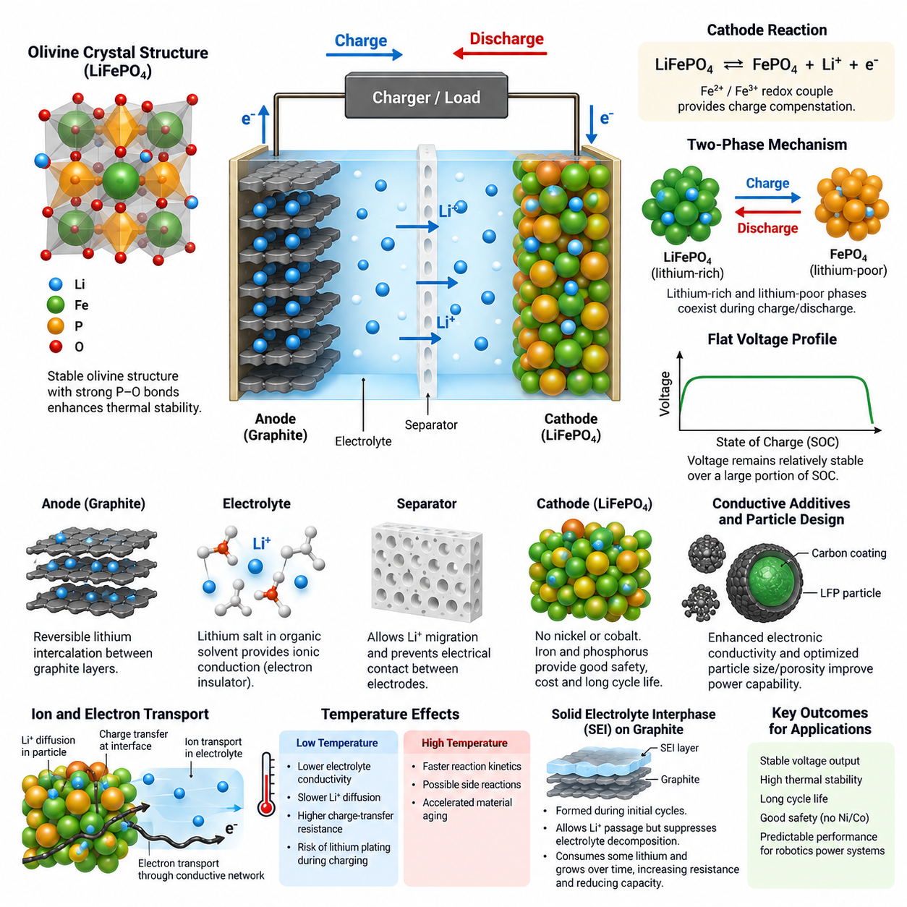
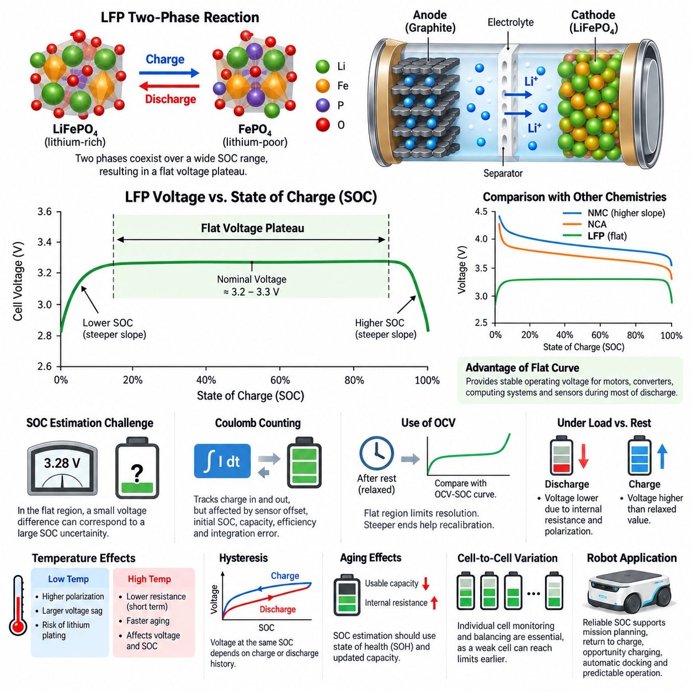
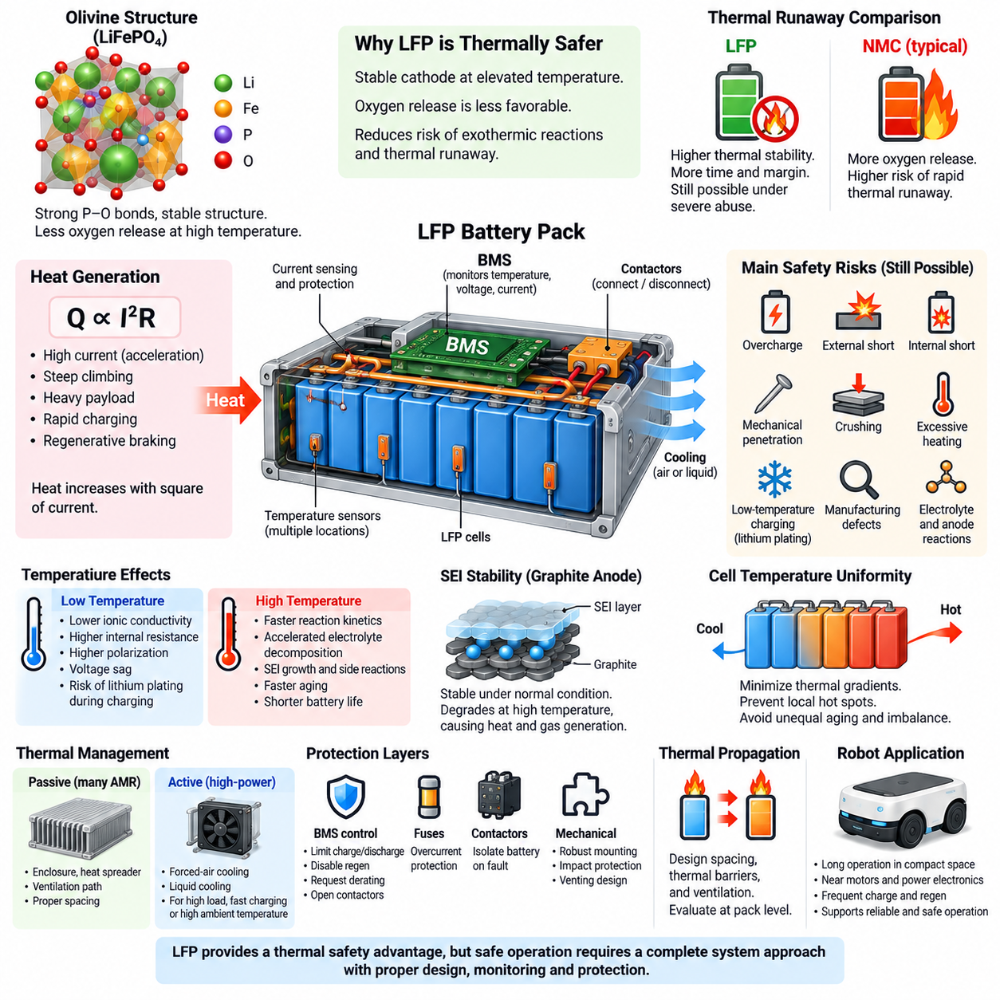
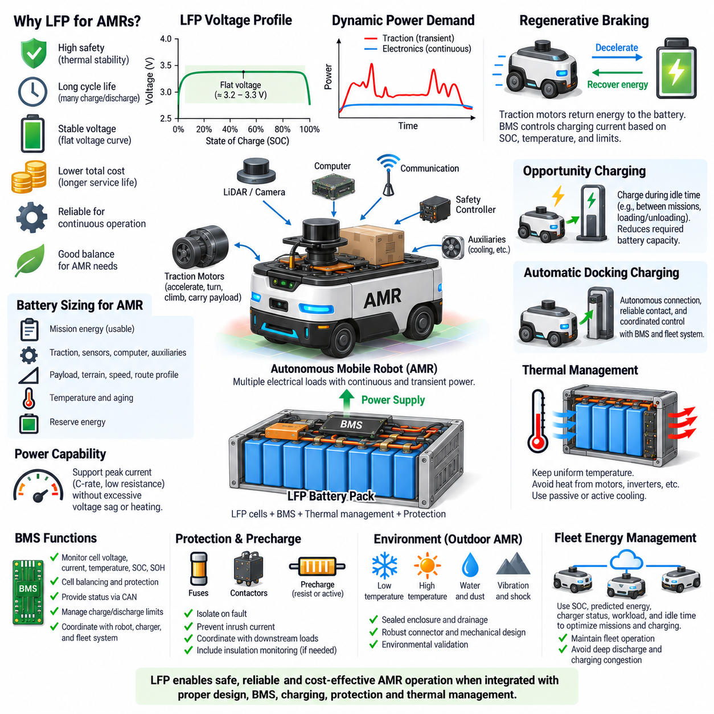
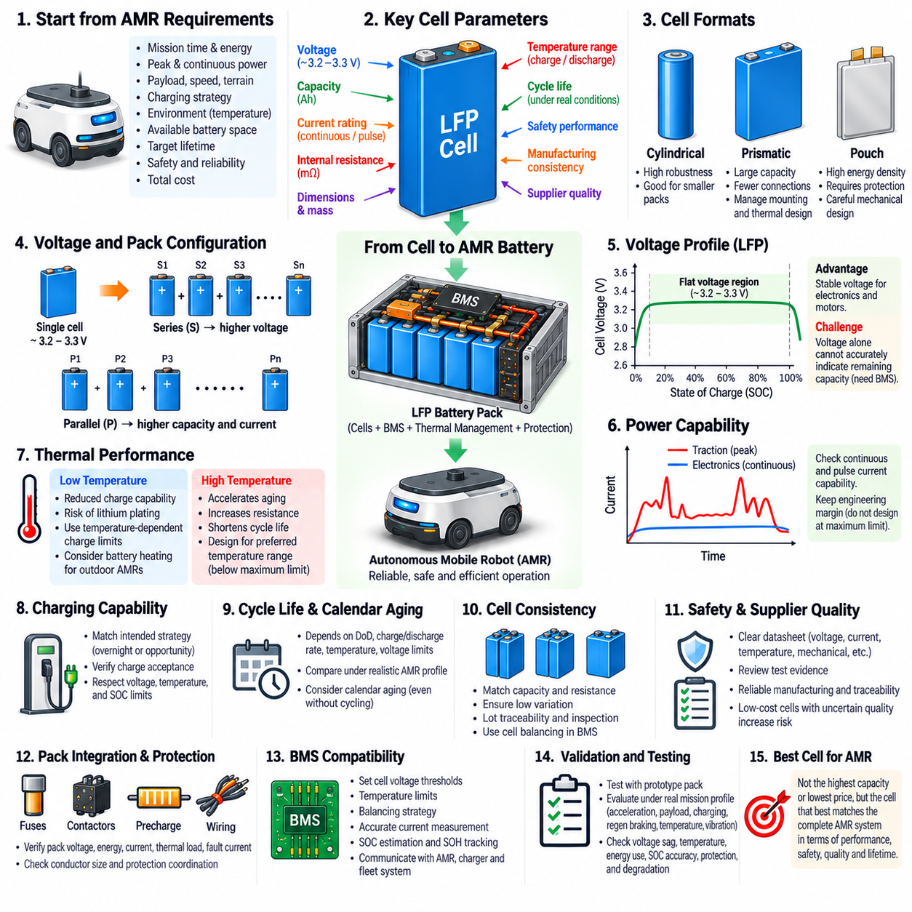

**Volume 11. Battery and Powertrain**

# Chapter 02. LFP Battery

## 02.01. LFP Electrochemistry

{width="7.268055555555556in" height="7.268055555555556in"}

리튬인산철(Lithium Iron Phosphate)은 일반적으로 LFP로 약칭되며, 리튬인산철(LiFePO4)을 양극(positive electrode)의 활물질(active material)로 사용하는 리튬이온전지(lithium-ion battery) 화학계이다. LFP의 전기화학적 거동(electrochemical behavior)은 안정적인 올리빈형 결정구조(olivine-type crystal structure) 내부에서 리튬이온(lithium ion)이 가역적으로 삽입(intercalation)되고 탈리(extraction)되는 과정에서 발생한다. 이러한 화학적 특성은 LFP를 NMC와 같은 층상 산화물 양극(layered oxide cathode)과 구별한다.

충전(charging) 과정에서는 리튬이온이 LiFePO4 양극(cathode)에서 빠져나오고, 전자(electron)는 외부 전기회로(external electrical circuit)를 통해 양극을 떠난다. 이에 따라 양극은 점진적으로 인산철(iron phosphate), 즉 FePO4 상태로 변환된다. 리튬이온은 전해질(electrolyte)과 분리막(separator)을 통과하여 음극(negative electrode)으로 이동하고, 전체적인 전하 중성(charge neutrality)을 유지하면서 흑연(graphite) 또는 다른 호환 가능한 음극재에 삽입된다.

양극에서 일어나는 주요 반응은 LiFePO4 ⇌ FePO4 + Li+ + e−로 표현할 수 있다. 철(iron)은 Fe2+/Fe3+ 산화환원쌍(redox couple)을 통해 반응에 참여하며, 리튬이 제거되거나 삽입될 때 필요한 전자적 전하 보상(electronic charge compensation)을 제공한다. 방전(discharge) 시에는 반응이 반대 방향으로 진행되어 리튬이온이 양극으로 돌아오고 Fe3+가 Fe2+ 방향으로 환원(reduction)되면서 외부 부하(external load)에 전기에너지를 공급한다.

일반적인 흑연 기반 LFP 셀(graphite-based LFP cell)에서 음극은 주로 흑연층(graphite layer) 사이의 가역적인 삽입(intercalation)을 통해 리튬을 저장한다. 충전 시 전해질을 통해 이동해 온 리튬이온은 외부 회로를 통해 공급된 전자와 전기화학적으로 결합하여 리튬이 삽입된 흑연(lithium-intercalated graphite)을 형성한다. 방전 시에는 리튬이 흑연에서 빠져나와 전해질을 통과한 후 다시 LFP 양극 방향으로 이동한다.

전해질(electrolyte)은 전극 사이에서 이온전도(ionic conduction)를 제공하면서 전자에 대해서는 절연체(electronic insulator)로 작용한다. 일반적인 리튬이온전지 전해질은 유기용매(organic solvent)에 용해된 리튬염(lithium salt)을 포함하며, 다공성 전극(porous electrode)과 분리막을 통한 Li+ 이동을 가능하게 한다. 분리막은 양극과 음극의 전기적 접촉을 물리적으로 차단하면서 이온 이동은 허용하여 내부 단락(internal electrical short circuit) 없이 전기화학적 반응이 지속되도록 한다.

LFP 전기화학(electrochemistry)의 핵심적인 특징은 사용 가능한 충전상태(State of Charge, SOC) 범위의 상당 부분에서 LiFePO4와 FePO4 사이에 나타나는 2상 변환(two-phase transformation)이다. 조성이 하나의 균질한 상(homogeneous phase)으로 연속적으로 변화하기보다는 양극 입자 내부에 리튬이 풍부한 영역(lithium-rich region)과 리튬이 부족한 영역(lithium-poor region)이 공존할 수 있다. 충전 또는 방전이 진행되면서 두 영역의 상대적인 비율이 변화하여 LFP 셀 특유의 전기화학적 거동을 형성한다.

이러한 2상 메커니즘(two-phase mechanism)은 LFP 배터리에서 나타나는 비교적 평탄한 전압 특성(flat voltage profile)에 직접적으로 기여한다. LiFePO4와 FePO4 두 상이 공존하는 동안 전기화학적 전위(electrochemical potential)의 변화가 상대적으로 작기 때문에 방전 구간의 상당 부분에서 셀 전압(cell voltage)이 비교적 일정하게 유지된다. 이러한 특성은 안정적인 동작 전압(operating voltage)을 제공하는 데 유리하지만, 전압을 기반으로 충전상태(SOC)를 추정하는 작업은 더욱 어렵게 만든다.

올리빈 결정구조(olivine crystal structure)는 LFP 화학계가 높은 안정성을 갖는 가장 중요한 원인 중 하나이다. 인산염기(phosphate group)는 강한 인-산소 결합(phosphorus-oxygen bond)을 형성하여 양극 결정격자(cathode lattice) 내부의 산소를 안정적으로 유지한다. 따라서 LFP는 여러 층상 전이금속 산화물(layered transition-metal oxide)과 비교하여 심각한 열적 또는 전기적 오용 조건에서 산소를 방출하는 경향이 낮으며, 이는 우수한 열적 안정성(thermal stability)과 열폭주(thermal runaway)에 대한 저항성에 기여한다.

LFP는 또한 양극 활물질에서 니켈(nickel)과 코발트(cobalt)를 사용하지 않는다. 철(iron)과 인(phosphorus)이 각각 주요 전이금속(transition metal)과 폴리아니온(polyanion) 구성요소를 형성하며, 리튬은 이동 가능한 전하 운반체(mobile charge carrier)로 작용한다. 이러한 소재 구성은 비용, 자원 가용성(resource availability), 열적 거동, 에너지밀도(energy density), 수명 특성(lifecycle characteristics)에 영향을 주며, 최대 중량 에너지밀도(gravimetric energy density)보다 내구성과 안전성이 중요한 응용 분야에서 LFP를 특히 매력적인 선택으로 만든다.

그러나 실제 전기화학적 성능(electrochemical performance)은 셀 내부의 수송 과정(transport process)에 의해 제한될 수 있다. 리튬이온은 전해질을 통과하고 전극-전해질 계면(electrode-electrolyte interface)을 지나 활물질 입자 내부로 확산(diffusion)되어야 하며, 전자는 전도성 네트워크(conductive network)와 집전체(current collector)를 통해 이동해야 한다. LFP 자체의 고유 전자전도도(intrinsic electronic conductivity)는 비교적 낮기 때문에 실제 전극에는 일반적으로 전도성 탄소(conductive carbon)와 최적화된 입자구조가 적용된다.

입자 크기(particle size), 탄소 코팅(carbon coating), 전극 기공률(electrode porosity), 전해질 침투(electrolyte penetration), 전도성 첨가제 분포(conductive-additive distribution)는 실제 LFP 성능에 큰 영향을 미친다. 작은 입자는 리튬의 확산 경로(diffusion path)를 단축할 수 있으며, 전도성 코팅은 활물질 입자 주변의 전자 이동을 향상시킨다. 따라서 전극공학(electrode engineering)은 기본적인 Fe2+/Fe3+ 산화환원 메커니즘을 변화시키지 않으면서 LiFePO4의 유리한 열역학적 특성(thermodynamic properties)을 실용적인 출력 성능으로 전환하는 역할을 한다.

온도(temperature)는 이러한 전기화학적 과정에 강한 영향을 미친다. 저온에서는 전해질 전도도(electrolyte conductivity)가 감소하고 리튬 확산이 느려지며 계면 전하전달 저항(interfacial charge-transfer resistance)이 증가한다. 특히 충전 과정은 저온에 민감하며, 과도한 충전전류는 음극 분극(anode polarization)을 증가시켜 리튬 도금(lithium plating)이 발생하기 쉬운 조건을 만들 수 있다. 반대로 고온에서는 반응속도론(reaction kinetics)이 개선되지만 불필요한 부반응(side reaction)과 소재 열화(material aging)가 가속될 수 있다.

주로 흑연 음극에서 형성되는 고체전해질계면(Solid Electrolyte Interphase, SEI)은 LFP 셀 동작에서 또 하나의 핵심 요소이다. 초기 충방전 과정에서 전해질 성분이 음극 표면에서 반응하여 부동태층(passivating layer)을 형성한다. 안정적인 SEI는 리튬이온의 통과를 허용하면서 지속적인 전해질 분해(electrolyte decomposition)를 억제하지만, 형성 과정에서 일부 리튬을 소비하며 시간이 지나면서 발생하는 SEI의 변화는 내부저항 증가(resistance growth)와 용량 감소(capacity loss)의 원인이 된다.

따라서 LFP 전기화학은 열역학(thermodynamics), 반응속도론(reaction kinetics), 이온수송(ionic transport), 전자전도(electronic conduction), 계면화학(interfacial chemistry), 열적 조건(thermal conditions)이 상호작용하는 시스템으로 이해할 수 있다. LiFePO4/FePO4 상변환(phase transition)은 안정적인 양극 반응을 제공하며, 음극, 전해질, 분리막 및 전극 미세구조(electrode microstructure)는 실제 전류와 온도 조건에서 이러한 반응을 얼마나 효율적으로 활용할 수 있는지를 결정한다.

로봇 전력 시스템(robotic power system)의 관점에서 이러한 전기화학적 특성은 이후 다루게 될 충전상태 추정(SOC estimation), 열 보호(thermal protection), 충전 제어(charging control), 셀 선정(cell selection), 파워트레인 통합(powertrain integration)과 같은 공학적 설계의 기반을 제공한다. 배터리 체계에서 LFP 화학을 이러한 응용 주제보다 먼저 다루는 이유는 셀 수준의 반응 메커니즘(cell-level reaction mechanism)이 궁극적으로 전압 거동, 전류 공급 능력, 안전 여유(safety margin), 열화(degradation), 사용 가능 에너지(usable energy)를 결정하기 때문이다.

## 02.02. LFP Flat SOC Curve

{width="7.268055555555556in" height="7.268055555555556in"}

리튬인산철(Lithium Iron Phosphate, LFP) 배터리는 사용 가능한 충전상태(State of Charge, SOC) 범위의 상당 부분에서 셀 전압(cell voltage)이 거의 일정하게 유지되는 독특한 전압 특성을 나타낸다. 일반적으로 평탄한 SOC 곡선(flat SOC curve) 또는 평탄한 전압 평탄부(flat voltage plateau)라고 하는 이러한 특성은 LiFePO4 양극(cathode)의 전기화학적 특성에서 비롯되며, LFP를 다른 많은 리튬이온전지(lithium-ion battery) 화학계와 구별하는 대표적인 특징 중 하나이다.

충전상태(State of Charge, SOC)는 배터리의 사용 가능한 용량(available capacity)에 비해 현재 남아 있는 사용 가능 전하량(usable charge)을 나타낸다. SOC 100%는 대략 완전히 충전된 상태를 의미하며, 0%는 정의된 방전 하한(discharge limit)을 의미한다. 단자전압(terminal voltage)은 SOC에 대한 유용한 정보를 제공할 수 있지만, 전압과 SOC의 관계는 배터리 화학계, 온도, 전류, 열화(aging), 안정화 조건(relaxation conditions)에 따라 크게 달라진다.

LFP 셀에서 양극은 리튬이 풍부한 LiFePO4와 리튬이 부족한 FePO4 사이에서 가역적인 변환(reversible transformation)을 수행한다. 동작 범위의 상당 부분에서 두 상(phase)은 연속적으로 변화하는 하나의 균질한 조성(homogeneous composition)을 형성하기보다 서로 공존한다. 따라서 두 상의 비율이 변화하는 동안 전기화학적 전위(electrochemical potential)는 상대적으로 적게 변화하며, 충전과 방전 과정에서 넓고 특징적인 평탄 전압 구간(voltage plateau)을 형성한다.

일반적인 LFP 셀은 약 3.2\~3.3 V의 공칭전압(nominal voltage)을 가지지만 실제 단자전압은 SOC와 동작 조건에 따라 달라진다. SOC 범위의 중간 영역에서는 저장된 전하량이 상당히 변화하더라도 개방회로전압(Open-Circuit Voltage, OCV)의 변화는 매우 작을 수 있다. 그러나 SOC의 상한과 하한 부근에서는 전압 곡선의 기울기가 상당히 커지며, 완전 충전 또는 심방전(deep discharge) 상태에 얼마나 가까운지를 보다 명확하게 나타낸다.

평탄한 전압 평탄부(flat voltage plateau)는 LFP 배터리에서 중요한 운용상의 장점을 제공한다. LFP 배터리로부터 전력을 공급받는 장비는 방전 주기의 상당 부분에서 비교적 안정적인 배터리 전압을 사용할 수 있다. 따라서 모터 드라이브(motor drive), DC-DC 컨버터(DC-DC converter), 컴퓨팅 시스템(computing system), 센서(sensor), 보조 전자장치(auxiliary electronics)는 에너지가 소비되더라도 전압 변화가 상대적으로 느린 전원에서 동작할 수 있으며, 이는 전력 시스템 설계를 단순화하고 로봇의 임무 수행 중 동작 일관성을 향상시킬 수 있다.

그러나 동일한 특성은 SOC 추정(SOC estimation)에 상당한 어려움을 발생시킨다. 개방회로전압 곡선(open-circuit-voltage curve)의 기울기가 큰 배터리 화학계에서는 측정된 전압 차이가 비교적 명확한 SOC 차이를 나타낼 수 있다. 반면 LFP에서는 평탄 구간 내의 작은 전압 측정 오차(voltage measurement error)가 훨씬 큰 SOC 불확실성(SOC uncertainty)에 대응할 수 있는데, 이는 서로 다른 여러 충전상태가 매우 유사한 평형전압(equilibrium voltage)을 나타낼 수 있기 때문이다.

따라서 단순한 전압 기반 SOC 추정(voltage-based SOC estimation)은 일반적으로 정확한 LFP 배터리 관리에 충분하지 않다. 대신 배터리 관리 시스템(Battery Management System, BMS)은 시간에 따라 측정된 전류를 적분하는 쿨롱 카운팅(coulomb counting)을 사용하여 배터리로 유입되고 유출되는 전하량을 추적할 수 있다. 이 추정 과정에서는 센서 오프셋(sensor offset), 초기 SOC 불확실성, 사용 가능 용량, 충전 효율(charging efficiency), 누적 적분 오차(integration error)를 고려해야 한다. 작은 전류 측정 편차라도 지속되면 시간이 지나면서 상당한 SOC 드리프트(SOC drift)가 발생할 수 있기 때문이다.

개방회로전압(Open-Circuit Voltage, OCV)은 배터리가 충분한 시간 동안 휴지(rest)하여 일시적인 분극 효과(polarization effect)가 감소한 경우 여전히 유용한 정보를 제공할 수 있다. 이때 측정된 전압을 실험적으로 특성화된 OCV-SOC 관계와 비교할 수 있다. 그러나 LFP에서는 중앙의 평탄한 영역이 이러한 보정 방법의 분해능(resolution)을 제한하며, 높은 SOC와 낮은 SOC 부근의 기울기가 큰 영역이 추정된 배터리 상태를 재보정(recalibration)하는 데 일반적으로 더 유용하다.

부하가 걸린 상태의 단자전압(terminal voltage)은 평형상태의 SOC 전압으로 해석해서는 안 된다. 내부저항(internal resistance), 전기화학적 분극(electrochemical polarization), 전하전달 과정(charge-transfer process), 확산 제한(diffusion limitation), 배선저항(wiring resistance), 접속 손실(connection loss)은 전류에 따라 달라지는 전압 차이를 발생시킨다. 고전류 방전 시 측정 전압은 낮아지고 충전 시에는 단자전압이 안정화된 전압보다 높아진다. 이러한 동적 효과는 LFP 평탄 구간에서 나타나는 작은 SOC 의존 전압 변화보다 훨씬 클 수 있다.

온도(temperature)는 SOC와 전압 관계의 해석을 더욱 복잡하게 만든다. 온도 변화는 반응속도론(reaction kinetics), 이온전도도(ionic conductivity), 확산(diffusion), 내부저항, 평형전위(equilibrium potential)에 영향을 준다. 저온 동작에서는 더 강한 분극과 큰 부하 전압강하(voltage sag)가 발생할 수 있으며, 고온에서는 일부 단기적인 저항 효과가 감소할 수 있지만 배터리 열화(degradation)가 가속될 수 있다. 따라서 SOC 추정기는 전압을 독립적으로 해석하기보다 전류 및 온도와 함께 해석해야 한다.

LFP 전압 곡선에는 또한 이력현상(hysteresis)이 나타난다. 이는 특정 SOC에서 관측되는 전압이 해당 상태에 충전 과정을 통해 도달했는지 또는 방전 과정을 통해 도달했는지에 따라 달라질 수 있음을 의미한다. 안정화 이력(relaxation history)과 이전의 전류 조건도 측정 전압에 영향을 줄 수 있다. 따라서 단자전압에서 SOC로 변환하는 하나의 고정된 관계만으로는 실제 LFP의 거동을 완전히 표현할 수 없으며, 특히 이동형 로봇 플랫폼(mobile robotic platform)의 동적 운용 환경에서는 이러한 한계가 더욱 중요하다.

배터리 노화(battery aging)는 또 다른 불확실성의 원인이 된다. 셀의 충방전 사이클과 달력수명(calendar time)이 증가하면서 사용 가능 용량은 감소하고 내부저항은 증가할 수 있다. 초기 정격용량(rated capacity)을 기준으로 수행하는 쿨롱 카운팅은 실제 사용 가능한 에너지를 과대평가할 수 있다. 따라서 신뢰성 높은 SOC 추정을 위해서는 건강상태(State of Health, SOH) 정보를 활용하여 유효 용량(effective capacity)을 갱신하고 충전상태 변화와 장기적인 배터리 열화를 구분하는 것이 유리하다.

보다 발전된 배터리 관리 시스템은 하나의 측정값에 의존하지 않고 여러 정보원을 결합한다. 전류 적분(current integration)은 단기적인 SOC 추적을 제공하고, 전압은 전기화학적 상태 정보를 제공하며, 온도는 운전 조건에 대한 보정을 지원하고, 배터리 모델(battery model)은 동적인 전압 응답을 설명한다. 모델 기반 관측기(model-based observer) 또는 필터링 알고리즘(filtering algorithm)은 이러한 신호를 결합하여 추정 오차를 지속적으로 보정하고 보다 강건한 SOC 추정값을 유지할 수 있다.

여러 개의 LFP 셀을 직렬로 연결하여 로봇용 배터리 팩(robotic battery pack)을 구성하는 경우 셀 간 편차(cell-to-cell variation)는 특히 중요해진다. 팩 전압(pack voltage)이 정상적으로 보이더라도 개별 셀은 용량, 내부저항, 온도 또는 SOC에서 약간의 차이를 가질 수 있다. 따라서 성능이 낮거나 불균형한 셀이 평균적인 팩 상태에서 예상되는 시점보다 먼저 상한 또는 하한 전압에 도달할 수 있으며, 개별 셀 전압 모니터링(individual cell-voltage monitoring)과 셀 밸런싱(cell balancing)이 중요한 BMS 기능이 된다.

자율이동로봇(Autonomous Mobile Robot, AMR)에서 평탄한 SOC 곡선은 단순히 배터리 잔량 표시만의 문제가 아니다. 임무 계획(mission planning), 충전 복귀 결정(return-to-charge decision), 기회 충전(opportunity charging), 자동 도킹(automatic docking), 출력 디레이팅(power derating), 잔여 운용시간 예측(remaining-runtime prediction)은 모두 신뢰할 수 있는 가용 에너지 추정에 의존한다. 지나치게 낙관적인 SOC 추정은 로봇이 임무를 완료하지 못하게 할 수 있으며, 지나치게 보수적인 추정은 생산적인 운용시간을 감소시키고 불필요한 충전 중단을 발생시킨다.

따라서 LFP의 평탄한 SOC 곡선은 전기화학적 장점과 배터리 관리상의 과제를 동시에 갖는 특성으로 이해해야 한다. 안정적인 전압은 예측 가능한 전기 시스템 동작을 지원하지만, 중앙 운전 영역에서 전압에 대한 SOC 민감도(SOC sensitivity)가 낮기 때문에 정교한 상태 추정이 필요하다. 정확한 LFP 배터리 관리는 궁극적으로 셀 전압, 전류, 온도, 용량, 노화 정보, 운전 이력(operating history)을 결합하여 배터리의 실제 사용 가능 상태를 일관성 있게 추정하는 것에 달려 있다.

## 02.03. LFP Thermal Safety

{width="7.268055555555556in" height="7.268055555555556in"}

리튬인산철(Lithium Iron Phosphate, LFP) 배터리는 많은 고에너지 리튬이온전지(high-energy lithium-ion battery) 화학계와 비교하여 우수한 열 안전성(thermal safety)을 갖는 것으로 널리 알려져 있다. 이러한 특성은 주로 LiFePO4의 안정적인 올리빈 결정구조(olivine crystal structure)와 인산염 골격(phosphate framework) 내부의 강한 인-산소 결합(phosphorus-oxygen bond)에서 비롯된다. 이러한 구조적 특성은 높은 온도나 비정상적인 전기적 조건에 노출되었을 때 양극(cathode)이 반응성이 높은 산소를 방출하려는 경향을 감소시킨다.

배터리의 열 안전성(thermal safety)이란 정상 동작, 충전, 방전, 고장 및 외부적인 비정상 조건에서 허용 가능한 온도 범위를 유지하고 위험한 반응에 저항할 수 있는 능력을 의미한다. 내부저항(internal resistance), 전기화학적 분극(electrochemical polarization), 기타 비가역적 과정(irreversible process)에 의해 열은 지속적으로 발생한다. 정상적인 조건에서는 이러한 열이 셀 케이스(cell casing), 배터리 구조물, 냉각 매체(cooling medium), 주변 환경으로 전달되어 위험한 온도 상승을 일으키지 않는다.

배터리 동작 중 발생하는 열은 전류와 밀접한 관계가 있다. 저항 발열(resistive heating)은 I²R 관계로 근사할 수 있으며, 이는 내부저항이 일정할 경우 열 발생량이 전류의 제곱에 비례하여 증가한다는 것을 의미한다. 따라서 높은 가속 요구, 급경사 주행, 고중량 페이로드(heavy payload) 운용, 급속 충전(rapid charging), 회생제동(regenerative braking)은 평균 배터리 출력이 보통 수준이더라도 상당한 단시간 열부하(thermal load)를 발생시킬 수 있다.

LFP 화학계는 LiFePO4 양극이 높은 온도에서도 비교적 안정적으로 유지되기 때문에 중요한 안전상의 장점을 제공한다. 인산염 골격은 산소를 강하게 결합하므로 많은 층상 산화물 양극(layered oxide cathode)에 비해 산소 방출이 어렵다. 방출된 산소는 전극 물질과 전해질(electrolyte) 사이의 반응을 더욱 격렬하게 만들 수 있으므로, 이러한 메커니즘을 억제하면 자기 발열(self-heating)과 열폭주(thermal runaway)를 가속할 수 있는 주요 경로 중 하나를 감소시킬 수 있다.

열폭주(thermal runaway)는 내부에서 발생하는 열이 외부로 제거되는 열보다 많아지면서 온도가 상승하고, 그 결과 추가적인 발열반응(exothermic reaction)이 더욱 가속되는 상태를 의미한다. 이러한 과정은 양의 피드백(positive feedback)을 형성하여 결국 가스 배출(venting), 화재 또는 셀 파열(cell rupture)로 이어질 수 있다. LFP는 이러한 과정에 대해 비교적 높은 저항성을 가지지만, 충분히 심각한 비정상 조건에서는 열폭주가 발생할 가능성을 완전히 배제할 수 없다.

따라서 배터리 안전성을 양극 화학계(cathode chemistry)에만 의존해서는 안 된다. 과충전(overcharge), 외부 단락(external short circuit), 내부 단락(internal short circuit), 기계적 관통(mechanical penetration), 압착(crushing), 과도한 가열, 제조 결함(manufacturing defect), 저온에서의 부적절한 충전은 LFP 셀에도 손상을 줄 수 있다. 전해질과 음극 물질은 여전히 화학적으로 활성 상태이며, 충분히 높은 온도에서는 보호 계면(protective interface)이 불안정해지고 양극 자체가 비교적 안정적이더라도 발열반응이 시작될 수 있다.

흑연 음극(graphite anode)에 형성되는 고체전해질계면(Solid Electrolyte Interphase, SEI)은 열적 거동에서 중요한 역할을 한다. 정상적인 조건에서 SEI는 전극-전해질 계면(electrode-electrolyte interface)을 안정화하지만, 과도한 온도에서는 이러한 보호층이 열화될 수 있다. 계면이 불안정해지면 리튬이 삽입된 음극(lithiated anode)과 전해질 사이에서 추가적인 반응이 발생하여 열과 가스를 생성하고 추가적인 온도 상승에 기여할 수 있다.

온도는 전기저항(electrical resistance)과 사용 가능한 출력에도 영향을 준다. 저온에서는 이온전도도(ionic conductivity)와 리튬 확산(lithium diffusion)이 감소하는 반면 내부저항과 분극은 증가한다. 그 결과 발생하는 전압강하(voltage drop)와 저항 발열은 사용 가능한 출력을 제한할 수 있다. 특히 저온 충전에서는 불리한 음극 조건으로 인해 리튬 도금(lithium plating)이 발생할 수 있으며, 이는 용량을 감소시키고 열화가 진행될 경우 내부 단락 위험을 증가시킬 가능성이 있다.

고온에서는 이와 다른 문제가 발생한다. 반응속도론(reaction kinetics)이 향상되고 단기적으로 내부저항이 감소할 수 있지만, 높은 온도는 전해질 분해(electrolyte decomposition), SEI 성장, 부반응(side reaction), 소재 노화(material aging)를 가속한다. 따라서 즉각적인 안전 한계에 도달하지 않더라도 불필요하게 높은 온도에서 지속적으로 운용하면 배터리 수명이 단축된다. 그러므로 열관리(thermal management)는 급격한 안전 문제뿐만 아니라 장기적인 내구성까지 고려해야 한다.

셀 온도의 균일성(cell temperature uniformity)은 최대 온도만큼이나 중요하다. 모터, 인버터(inverter), DC-DC 컨버터(DC-DC converter), 충전기 또는 환기가 원활하지 않은 영역 주변에 위치한 셀은 인접 셀보다 높은 온도에서 동작할 수 있다. 지속적인 온도 차이는 셀별 노화 속도와 내부저항의 차이를 발생시키고 점차 전기적 불균형(electrical imbalance)을 증가시킨다. 따라서 배터리 팩 설계에서는 개별 셀이 허용 온도를 초과하지 않도록 하는 동시에 열 구배(thermal gradient)를 최소화해야 한다.

배터리 관리 시스템(Battery Management System, BMS)은 열 상태를 감시하는 주요 전자적 보호 계층을 제공한다. 팩 내부에 분산 배치된 온도센서(temperature sensor)를 이용하여 BMS는 비정상적인 온도 상승을 감지하고 시스템의 동작을 변경할 수 있다. 이상 상태의 심각도에 따라 충전전류를 감소시키거나 방전 출력을 제한하고, 회생 충전(regenerative charging)을 비활성화하거나 파워트레인 출력 디레이팅(powertrain derating)을 요청하며, 충전을 중단하거나 접촉기(contactor)를 개방하여 배터리를 로봇으로부터 전기적으로 분리할 수 있다.

제한된 수의 온도 측정값으로 모든 셀의 온도를 완벽하게 나타낼 수 없기 때문에 센서 배치(sensor placement)는 매우 중요하다. 센서는 열해석(thermal analysis)과 시험을 통해 예상되는 고온 지점(hot spot)에 배치해야 하며, 여기에는 공기 흐름이 제한되는 영역, 고전류 경로(high-current path), 셀이 조밀하게 배치된 영역, 발열 전자장치 주변 등이 포함된다. 팩 검증(pack validation)을 통해 실제 운용 조건에서 측정 온도가 열적으로 가장 큰 부하를 받는 셀을 적절히 대표하는지 확인해야 한다.

중간 수준의 출력을 사용하는 많은 LFP 로봇 응용 분야에서는 수동 열관리(passive thermal management)만으로도 충분할 수 있다. 팩 인클로저(pack enclosure), 열전도성 셀 홀더(conductive cell holder), 열확산판(heat spreader), 환기 경로, 적절한 셀 간격을 이용하면 펌프나 냉각 시스템 없이도 열을 분산하고 외부로 방출할 수 있다. 그러나 연속적인 견인 부하, 급속 충전, 높은 주변온도, 고밀도 패키징으로 인해 수동 냉각 능력을 초과하는 열이 발생하는 고출력 플랫폼에서는 강제공랭(forced-air cooling)이나 액체냉각(liquid cooling)이 필요할 수 있다.

기계적 보호(mechanical protection)와 전기적 보호(electrical protection)는 열관리와 함께 적용되어야 한다. 퓨즈(fuse), 접촉기, 전류센싱(current sensing), 절연(insulation), 적절한 용량의 도체, 견고한 셀 고정, 충격 및 관통에 대한 보호는 전기적 또는 기계적 고장이 열적 사고로 발전할 가능성을 감소시킨다. 또한 팩 인클로저 설계에서는 고장난 셀에서 방출되는 가스가 과도한 내부압력을 발생시키거나 인접 셀로 직접 열을 전달하지 않도록 가스 배출 거동(venting behavior)을 고려해야 한다.

열전파(thermal propagation)는 하나의 셀에서 발생한 고장이 인접 셀을 충분히 가열하여 추가적인 셀 고장을 유발할 가능성을 의미한다. LFP의 높은 열적 안정성은 일반적으로 이러한 과정을 제어할 수 있는 더 많은 시간과 안전 여유(safety margin)를 제공하지만, 팩 수준의 열전파 특성은 셀 간격, 인클로저 형상, 열 차단재(thermal barrier), 열전달 경로, 셀 용량, 환기 조건에 크게 영향을 받는다. 따라서 안전성 평가는 개별 셀의 화학적 특성만을 보호수단으로 간주하지 않고 전체 배터리 팩 수준에서 수행해야 한다.

자율이동로봇(Autonomous Mobile Robot, AMR)에서 LFP의 열 안전성은 배터리가 모터, 전력전자장치(power electronics), 컴퓨터 및 페이로드 장비(payload equipment)와 가까운 소형 플랫폼 내부에서 장시간 동작할 수 있기 때문에 특히 유리하다. 로봇은 하루 동안 반복적인 가속, 회생제동, 자동 충전(automatic charging), 기회 충전(opportunity charging)을 수행할 수 있다. 열적으로 강건한 배터리 아키텍처(thermally robust battery architecture)는 예측 가능한 운용을 지원하면서 비정상적인 전기 상태가 위험한 사고로 확대될 가능성을 감소시킨다.

따라서 LFP의 실질적인 안전상 장점은 보호 요구사항을 줄여도 된다는 의미가 아니라 추가적인 공학적 안전 여유(engineering margin)를 제공하는 것으로 이해해야 한다. 신뢰성 높은 로봇 배터리 시스템은 안정적인 LFP 전기화학(stable LFP electrochemistry)에 적절한 셀 선정, 열 설계, BMS 모니터링, 전기적 보호, 기계적 격납(mechanical containment), 고장 감지(fault detection), 검증된 운용 한계(validated operating limits)를 결합해야 한다. 이러한 다계층 접근법(layered approach)을 통해 LFP가 본질적으로 가진 열적 안정성을 로봇의 전체 사용수명에 걸친 신뢰성 높은 팩 수준 안전성(pack-level safety)으로 구현할 수 있다.

## 02.04. LFP for AMR Application

{width="7.268055555555556in" height="7.268055555555556in"}

리튬인산철(Lithium Iron Phosphate, LFP) 배터리는 전기적, 열적, 수명 특성이 이동형 로봇 플랫폼의 운용 요구사항과 밀접하게 부합하기 때문에 자율이동로봇(Autonomous Mobile Robot, AMR) 응용에 특히 적합하다. AMR은 일반적으로 반복적인 가속, 장시간 운용, 빈번한 충전, 예측 가능한 전압, 높은 안전 여유(safety margin)를 요구한다. LFP는 최대 에너지밀도(energy density)보다 신뢰성과 사용수명(service life)이 중요한 환경에서 균형 잡힌 해결책을 제공한다.

AMR 배터리는 연속 출력(continuous power)과 과도 출력(transient power)을 모두 공급해야 한다. 연속 부하에는 온보드 컴퓨터(onboard computer), 라이다(LiDAR), 카메라, 통신장치, 안전 제어기(safety controller), 냉각 시스템, 보조 전자장치가 포함되며, 견인 모터(traction motor)는 가속, 회전, 등판 또는 페이로드 운송 시 훨씬 큰 단시간 전류를 요구할 수 있다. 셀 용량, 허용 C-rate, 팩 저항(pack resistance), 열적 한계가 차량에 적절히 매칭되면 LFP 셀은 이러한 동적 부하를 지원할 수 있다.

LFP의 비교적 안정적인 동작 전압은 AMR 전기 아키텍처(electrical architecture)에 유리하다. 사용 가능한 충전상태(State of Charge, SOC) 범위의 상당 부분에서 전압이 비교적 평탄하게 유지되므로 모터 드라이브(motor drive), DC-DC 컨버터(DC-DC converter), 센서, 컴퓨터, 제어 전자장치가 정상 운용 중 경험하는 공급전압 변화가 감소한다. 이는 배터리가 높은 SOC에서 중간 또는 비교적 낮은 SOC로 변화하는 동안에도 하위 시스템의 일관된 동작을 유지하는 데 도움이 된다.

평탄한 전압 특성(flat voltage characteristic)은 동시에 중요한 AMR 공학적 과제를 발생시키는데, 단자전압(terminal voltage)만으로는 잔여 배터리 용량에 대한 정보가 제한적이기 때문이다. 따라서 신뢰성 높은 임무 계획(mission planning)을 위해서는 전류 적분(current integration), 셀 전압, 온도, 용량 정보, 운용 이력을 이용하여 강건한 SOC 추정을 수행하는 배터리 관리 시스템(Battery Management System, BMS)이 필요하다. 정확한 SOC 정보는 로봇이 추가 임무를 수행할 수 있는지 또는 충전소로 복귀해야 하는지를 결정하는 데 활용된다.

긴 사이클 수명(cycle life)은 AMR이 많은 횟수의 부분 충방전 사이클(partial charge and discharge cycle)을 누적할 수 있다는 점에서 또 하나의 중요한 장점이다. 공장, 창고, 병원, 물류센터 또는 실외 현장에서 지속적으로 운용되는 로봇 플릿(robot fleet)은 하루에도 여러 차례 충전할 수 있다. 배터리 교체 비용에는 셀 자체뿐만 아니라 유지보수 인건비, 차량 가동중단시간(downtime), 플릿 가용성(fleet availability), 운영 중단까지 포함되므로 수명 성능은 중요한 경제적 설계 변수이다.

기회 충전(opportunity charging)은 자연스럽게 발생하는 로봇의 유휴시간(idle period)을 이용하여 충전함으로써 이러한 수명 특성을 활용할 수 있다. AMR은 한 번의 긴 충전 세션에만 의존하는 대신 작업장에서 대기하거나 화물을 적재 또는 하역하는 동안, 또는 임무 사이에 충전기에 연결될 수 있다. 이러한 전략은 연속 운용에 필요한 배터리 용량을 줄일 수 있지만 충전 출력, 열적 거동, 충전기 가용성, 플릿 스케줄링(fleet scheduling)을 함께 고려해야 한다.

자동 도킹 충전(automatic docking charging)은 수동 배터리 연결이 무인 플릿 운용(unattended fleet operation)의 목적과 맞지 않기 때문에 자율 운용에서 특히 중요하다. 로봇은 충전 스테이션에 정확하게 접근하고 신뢰성 있는 전기적 접속을 형성하며 충전 조건을 확인한 후 BMS 및 플릿 관리 시스템(fleet-management system)과 협조해야 한다. 충전기 전압, 전류 제한, 접점 설계(contact design), 충전 제어가 적절하게 설계된다면 LFP 팩은 반복적인 자동 충전을 지원할 수 있다.

배터리 용량 산정(battery sizing)은 단순한 공칭용량(nominal capacity)이 아니라 실제 사용 가능한 임무 에너지(usable mission energy)를 기준으로 수행해야 한다. 설계자는 견인 에너지, 컴퓨팅 및 센서 부하, 보조장치, 전력변환 손실, 온도 영향, 노화, 예비 에너지(reserve energy), 예상 경로 조건을 고려해야 한다. 페이로드 질량, 바닥 저항, 경사도, 가속 빈도, 주행속도는 견인 에너지 요구량을 크게 변화시킬 수 있으므로 필요한 LFP 팩 용량을 정의할 때 실제적인 임무 프로파일(mission profile)이 필요하다.

출력 성능(power capability)은 에너지 용량과 별도로 평가해야 한다. 배터리가 임무를 완료하기에 충분한 와트시(watt-hour)를 가지고 있더라도 가속, 조향 액추에이터(steering actuator), 리프트, 매니퓰레이터(manipulator) 또는 여러 보조 부하의 동시 작동에 필요한 순간 전류를 공급하지 못할 수 있다. 따라서 셀의 C-rate 성능, 내부저항, 버스바(busbar), 커넥터, 퓨즈, 접촉기(contactor), 배선은 과도한 전압강하(voltage sag)나 열적 스트레스 없이 최대 전류를 지원해야 한다.

회생제동(regenerative braking)은 AMR 배터리 시스템에 양방향 전력 흐름(bidirectional power flow)을 발생시킨다. 감속 중 견인 모터는 발전기로 동작하여 전기에너지를 DC 버스와 배터리로 반환할 수 있다. BMS는 LFP 팩이 이러한 충전전류를 수용할 수 있는지 확인해야 한다. SOC가 높거나 온도가 허용 범위를 벗어나거나 셀 전압이 상한에 접근하는 경우에는 회생전류(regenerative current)를 줄이거나 대체 제동 전략(alternative braking strategy)을 통해 처리해야 할 수 있다.

LFP가 비교적 높은 열적 안정성(thermal stability)을 제공하더라도 열적 거동은 여전히 중요하다. 반복적인 가속, 높은 페이로드, 충전, 회생제동, 조밀한 배터리 패키징은 국부적인 발열(localized heating)을 발생시킬 수 있다. 배터리는 모터, 인버터(inverter), DC-DC 컨버터, 컴퓨팅 하드웨어에서 발생하는 열에 불필요하게 노출되지 않도록 배치해야 한다. 온도센싱(temperature sensing)과 적절한 수동 또는 능동 냉각(passive or active cooling)은 균일한 셀 상태를 유지하고 가속 열화를 방지하는 데 도움이 된다.

BMS는 LFP 팩과 AMR 파워트레인(powertrain) 사이의 상위 감시 인터페이스(supervisory interface) 역할을 한다. BMS는 개별 셀 전압, 팩 전류, 온도, SOC, 필요에 따라 건강상태(State of Health, SOH)를 모니터링하며 셀 밸런싱(cell balancing)과 보호 기능을 관리한다. CAN 또는 다른 차량 통신 인터페이스를 통해 BMS는 배터리 상태와 허용 가능한 충방전 출력을 로봇 제어기, 충전기, 모터 시스템, 플릿 관리 기능에 제공할 수 있다.

AMR에는 서로 다른 전류 및 고장 특성을 가진 여러 전기 부하가 존재하기 때문에 보호 협조(protection coordination)가 필수적이다. 배터리 팩에는 셀 수준 보호, 메인 퓨즈(main fuse), 접촉기, 프리차지 회로(precharge circuit), 전류센싱, 필요한 경우 절연 감시(insulation monitoring), 서비스 차단(service disconnect) 기능이 포함될 수 있다. 하위 전력분배 시스템은 국부적인 하위 시스템 고장으로 전체 로봇이 불필요하게 정지하지 않으면서 심각한 배터리 고장에서는 신속하게 전원을 차단하도록 보호 기능을 협조시켜야 한다.

LFP 팩이 모터 인버터 또는 대용량 DC 링크 커패시터(DC-link capacitor)를 포함하는 장비에 전력을 공급하는 경우 프리차지(precharge)가 중요해진다. 충전된 배터리를 충전되지 않은 커패시터에 직접 연결하면 접촉기, 커넥터, 퓨즈, 커패시터에 스트레스를 가하는 높은 돌입전류(inrush current)가 발생할 수 있다. 제어된 프리차지 경로는 메인 접촉기가 닫히기 전에 DC 버스 전압을 상승시켜 AMR 전력 시스템이 분리 상태에서 정상 운전 상태로 안전하게 전환되도록 한다.

팩 아키텍처(pack architecture)는 정비성(serviceability)과 플릿 유지보수도 고려해야 한다. 모듈형 배터리 어셈블리(modular battery assembly)는 관련 AMR 플랫폼 간의 교체, 진단, 용량 확장을 단순화할 수 있다. 커넥터는 필요한 전류를 지원하면서 진동, 오염, 반복적인 유지보수 작업을 견뎌야 한다. 기계적 장착 구조는 충격으로부터 셀을 보호하는 동시에 정비 작업자가 불필요한 전기적 또는 기계적 위험에 노출되지 않고 배터리를 안전하게 제거할 수 있도록 설계해야 한다.

실외 자율이동로봇(outdoor AMR)에서는 환경 조건으로 인해 배터리 설계 범위가 더욱 확대된다. 낮은 주변온도는 사용 가능한 출력과 충전 성능을 감소시킬 수 있으며, 높은 주변온도는 노화를 가속할 수 있다. 물, 먼지, 진동, 충격, 태양 복사열(solar heating), 불규칙한 지형도 팩 설계에 영향을 줄 수 있다. 따라서 인클로저 밀봉(enclosure sealing), 배수, 기계적 절연(mechanical isolation), 열 설계, 커넥터 선정, 환경 검증(environmental validation)은 LFP 배터리 아키텍처의 필수적인 요소가 된다.

플릿 수준 에너지 관리(fleet-level energy management)는 배터리 정보를 활용하여 전체 AMR의 활용도를 향상시킬 수 있다. 모든 로봇이 고정된 저 SOC 임계값에 도달할 때까지 기다리는 대신 플릿 소프트웨어는 현재 SOC, 예상 임무 에너지, 충전기 점유 상태(charger occupancy), 이동 거리, 작업 우선순위, 예상 유휴시간을 함께 고려할 수 있다. 이를 통해 불필요한 심방전(deep discharge)이나 충전 혼잡(charging congestion)을 피하면서 운용 범위를 유지하도록 로봇의 임무와 충전 기회를 배정할 수 있다.

따라서 AMR에서 LFP의 가치는 개별 셀의 화학적 특성에만 한정되지 않는다. 안정적인 전압, 우수한 열적 거동, 사이클 내구성(cycle durability), 실용적인 출력 성능은 장시간 로봇 운용을 지원하지만, 성공적인 적용을 위해서는 팩 용량 산정, BMS 설계, 충전, 보호, 열관리, 회생제동, 전력분배(power distribution), 플릿 에너지 관리가 서로 협조되어야 한다. LFP는 배터리가 전체 AMR 파워트레인의 통합된 구성요소로 설계될 때 가장 효과적으로 활용될 수 있다.

## 02.05. LFP Cell Selection

{width="7.268055555555556in" height="7.268055555555556in"}

자율이동로봇(Autonomous Mobile Robot, AMR)을 위한 LFP 셀(LFP cell)을 선정하는 것은 단순히 충분한 공칭용량(nominal capacity)을 가진 셀을 선택하는 것 이상의 과정이다. 셀은 전체 배터리 팩(battery pack)을 구성하는 기본적인 전기적, 열적, 기계적, 수명 설계 단위가 된다. 셀의 전압, 용량, 전류 공급 능력, 내부저항, 크기, 질량, 온도 한계, 사이클 수명(cycle life), 안전 특성은 궁극적으로 AMR 파워트레인(powertrain)의 성능과 신뢰성을 제한하는 요소가 된다.

셀 선정 과정은 특정 셀 사양을 먼저 선택하는 것이 아니라 시스템 수준 요구사항(system-level requirements)에서 시작해야 한다. 필요한 팩 전압, 사용 가능 에너지(usable energy), 연속 출력, 최대 출력, 충전 전략, 운용시간, 페이로드(payload), 차량 질량, 환경 조건, 사용 가능한 배터리 공간, 예상 사용수명을 먼저 정의해야 한다. 이후 이러한 요구사항을 셀 수준의 전압, 용량, 전류, 열적 특성, 패키징 목표로 변환할 수 있다.

공칭 셀 전압(nominal cell voltage)은 직렬로 연결해야 하는 셀의 개수를 결정한다. LFP 셀은 일반적으로 약 3.2\~3.3 V의 공칭전압에서 동작하지만, 팩 설계에서는 공칭전압만이 아니라 전체 동작 전압 범위(operating voltage range)를 고려해야 한다. 직렬 셀 수(series count)는 최대 충전전압부터 허용되는 최소 방전전압까지 배터리가 모터 인버터(motor inverter), DC-DC 컨버터(DC-DC converter), 충전기, 접촉기(contactor), 기타 고출력 부품과 호환되도록 결정해야 한다.

암페어시(ampere-hour, Ah)로 표시되는 셀 용량(cell capacity)은 각 병렬 그룹(parallel group)이 저장할 수 있는 전하량을 결정한다. 필요한 용량은 이론적인 운용시간만이 아니라 실제적인 임무 에너지(mission energy)를 기준으로 산정해야 한다. 견인 부하, 온보드 컴퓨팅(onboard computing), 센서, 통신장비, 보조 부하, 전력변환 손실, 예비 에너지(reserve energy), 온도 영향, 노화 여유(aging margin)를 포함하여 상당한 사용기간이 지난 이후에도 선정된 셀이 의도된 AMR 임무를 지원할 수 있도록 해야 한다.

에너지 용량(energy capacity)과 출력 성능(power capability)은 별도로 평가해야 한다. 고용량 셀이 충분한 운용시간을 제공하더라도 가속, 등판, 조향, 리프트 장치 또는 매니퓰레이터(manipulator)에 필요한 최대 전류를 공급하는 데 적합하지 않을 수 있다. 따라서 연속 방전 정격(continuous discharge rating)과 펄스 방전 정격(pulse discharge rating)을 예상 전류 프로파일(current profile)과 비교해야 하며, 제조사가 제시한 최대 한계에서 직접 팩을 설계하기보다는 적절한 공학적 여유(engineering margin)를 확보해야 한다.

내부저항(internal resistance)은 전압강하(voltage sag), 전력손실(power loss), 발열에 영향을 미치기 때문에 핵심적인 변수이다. 높은 전류가 흐를 때 내부저항이 큰 셀은 더 많은 I²R 손실을 발생시키며 단자전압(terminal voltage)의 감소도 커진다. 또한 내부저항은 일반적으로 노화와 저온 조건에서 증가하는 경향이 있다. 따라서 셀 선정에서는 초기 내부저항뿐만 아니라 실제 온도 및 수명 종료조건(end-of-life condition)에서 팩이 어떠한 성능을 나타낼 것인지도 평가해야 한다.

충전 성능(charging capability)은 의도된 운용 전략과 일치해야 한다. 야간 충전(overnight charging)을 사용하는 AMR은 비교적 낮은 충전율을 허용할 수 있지만, 자동 도킹(automatic docking)과 기회 충전(opportunity charging)에 의존하는 플릿(fleet)은 더 높은 충전 수용 능력(charge acceptance)을 요구할 수 있다. 선정된 셀은 과도한 발열이나 가속 열화 없이 필요한 충전전류를 지원해야 하며, 충전 전략은 셀 전압, 온도, 충전상태(State of Charge, SOC), 제조사가 정의한 운용 한계를 준수해야 한다.

실외 또는 온도 조절이 되지 않는 환경에서는 저온 충전 성능(low-temperature charging performance)에 특히 주의해야 한다. LFP 셀은 낮은 온도에서도 일정 수준의 방전 성능을 제공할 수 있지만 충전 능력은 훨씬 더 크게 제한될 수 있다. 저온에서 과도한 충전전류가 흐르면 흑연 음극(graphite anode)에서 리튬 도금(lithium plating)의 위험이 증가할 수 있다. 따라서 셀 사양과 BMS 전략에는 적절한 온도 의존형 충전전류 제한(temperature-dependent charge-current limit)이 포함되어야 하며 필요한 경우 배터리 가열 기능을 적용해야 한다.

고온 성능(high-temperature performance)은 즉각적인 안전성 문제와 별도로 평가해야 한다. LFP 화학계는 우수한 열적 안정성(thermal stability)을 제공하지만 지속적인 고온 운용은 전해질 열화(electrolyte degradation), 고체전해질계면(Solid Electrolyte Interphase, SEI) 성장, 내부저항 증가, 용량 감소를 가속한다. 기술적으로 높은 최대 온도를 허용하는 셀이라도 해당 온도 근처에서 반복적으로 운용하면 요구되는 수명 성능을 제공하지 못할 수 있다. 따라서 열 설계는 절대적인 안전 한계보다 낮은 권장 운용 온도 범위를 목표로 해야 한다.

사이클 수명 사양(cycle-life specification)은 시험 조건에 따라 결과가 달라지므로 주의해서 해석해야 한다. 방전심도(Depth of Discharge, DoD), 충전율, 방전율, 온도, 전압 한계, 휴지시간(rest period), 용량 유지율 기준(capacity-retention criterion)은 측정된 사이클 수명을 크게 변화시킬 수 있다. AMR에서는 단순히 광고된 최대 사이클 횟수를 비교하기보다 실제 일일 충전 및 임무 프로파일과 유사한 조건에서의 성능을 비교하는 것이 더 유용하다.

달력 노화(calendar aging)도 고려해야 하는데, 로봇이 충방전 사이클을 수행하지 않는 동안에도 배터리 열화가 발생하기 때문이다. 높은 온도나 극단적인 SOC 상태에서 장시간 유지되면 사용 가능한 용량이 감소하고 내부저항이 증가할 수 있다. 이는 예비 로봇(spare robot), 계절적으로 운용되는 실외 플랫폼, 장시간 완전 충전 상태로 대기하는 플릿에서 특히 중요하다. 따라서 셀 선정과 운용 정책에서는 예상 사용수명 동안의 사이클 열화(cycling degradation)와 보관 특성을 모두 고려해야 한다.

셀 형상(cell format)은 기계적 및 열적 통합에 큰 영향을 미친다. LFP 셀은 원통형(cylindrical), 각형(prismatic), 파우치형(pouch) 등으로 제공되며 각각 패키징 밀도(packaging density), 구조적 지지, 냉각, 전기적 연결, 제조 복잡성, 정비성(serviceability) 측면에서 서로 다른 절충관계(tradeoff)를 가진다. 선정된 형상은 AMR 섀시에 적합하면서 견고한 장착, 예측 가능한 열전달, 필요한 경우 적절한 압축, 실용적인 검사 및 교체가 가능해야 한다.

각형 LFP 셀(prismatic LFP cell)은 비교적 큰 셀 용량을 이용하여 병렬 전기 연결의 수를 줄이고 팩 구조를 단순화할 수 있기 때문에 많은 중대형 AMR에서 매력적인 선택이 될 수 있다. 그러나 기계적 장착, 단자 하중(terminal loading), 치수 공차(dimensional tolerance), 팽창 거동(swelling behavior), 열 구배(thermal gradient)를 주의해서 관리해야 한다. 셀 홀더(cell holder)와 압축 구조(compression structure)는 일반적인 기계 설계 가정이 아니라 해당 셀에 적용되는 구체적인 요구사항을 따라야 한다.

셀을 직렬로 연결하는 경우 셀 간 일관성(cell consistency)이 매우 중요하다. 용량, 내부저항, 자기방전(self-discharge), 초기 SOC의 차이로 인해 개별 셀이 서로 다른 시점에 전압 한계에 도달할 수 있다. 팩의 성능은 평균적인 팩 용량만으로 결정되는 것이 아니라 궁극적으로 가장 취약한 셀(weakest cell)에 의해 제한된다. 따라서 구매 사양(procurement specification)에는 제조 일관성, 생산 로트 추적성(lot traceability), 입고검사(incoming inspection), 용량 매칭(capacity matching), 내부저항 측정, 적절한 셀 밸런싱(cell balancing)을 고려해야 한다.

안전 적합성(safety qualification)과 공급업체 품질(supplier quality)은 전기적 성능만큼 중요하다. 데이터시트(datasheet)에는 전압, 전류, 온도, 기계적 조건, 보관, 충전 한계가 명확하게 정의되어야 하며 의도된 응용에 적합한 시험 근거(test evidence)를 검토해야 한다. 제조 관리 수준이 불확실하거나 문서의 일관성이 부족한 저가 셀은 안정적인 생산, 추적성, 기술자료를 제공하는 더 비싼 셀보다 장기적인 수명 및 안전 위험을 크게 만들 수 있다.

팩 구성(pack configuration)은 선정된 셀과 시스템 요구사항을 기반으로 결정된다. 직렬 연결(series connection)은 전압을 결정하고 병렬 연결(parallel connection)은 용량과 전류 공급 능력을 증가시킨다. 최종 아키텍처를 확정하기 전에 구성된 팩의 최대 및 최소 전압, 사용 가능 에너지, 연속 및 최대 전류, 충전전류, 열부하(thermal load), 고장전류(fault current), 도체 용량, 퓨즈 보호 협조(fuse coordination), 접촉기 정격, BMS 측정 능력을 검토해야 한다.

BMS는 선정된 셀 화학계와 팩 구성에 적합해야 한다. 셀 전압 임계값(cell-voltage threshold), 온도 한계, 밸런싱 전략, SOC 추정, 허용 충전 출력(allowable charge power), 허용 방전 출력(allowable discharge power)은 실제 선정된 LFP 셀의 특성을 반영해야 한다. LFP는 비교적 평탄한 SOC-전압 곡선을 가지므로 신뢰성 높은 AMR 에너지 관리를 위해 전류 측정 정확도, 용량 추정, 셀 일관성, 건강상태(State of Health, SOH) 추적이 특히 중요해진다.

셀 선정은 데이터시트 검토만으로 종료하지 않고 최종적으로 팩 및 차량 수준(pack and vehicle level)에서 검증해야 한다. 대표 셀과 시제품 팩(prototype pack)을 실제적인 가속, 페이로드, 충전, 회생제동(regenerative braking), 온도, 진동, 임무 사이클 조건에서 시험해야 한다. 이후 전압강하, 온도 분포, 에너지 소비, SOC 정확도, 보호 기능의 동작, 열화 추세(degradation trend)를 설계 가정과 비교하여 양산 승인(production release) 전에 적합성을 확인할 수 있다.

따라서 AMR에 가장 적합한 LFP 셀은 반드시 가장 높은 용량, 가장 높은 전류 정격, 가장 낮은 가격 또는 가장 긴 광고상의 사이클 수명을 가진 셀은 아니다. 최적의 셀은 전기적, 열적, 기계적, 안전, 품질, 수명 특성이 전체 로봇 시스템과 가장 잘 부합하는 셀이다. 효과적인 셀 선정은 셀 사양을 팩 아키텍처, BMS 제어, 충전 인프라(charging infrastructure), 파워트레인 요구량, 환경 조건, 유지보수 전략, 플릿 운용과 직접적으로 연결하는 과정이다.
