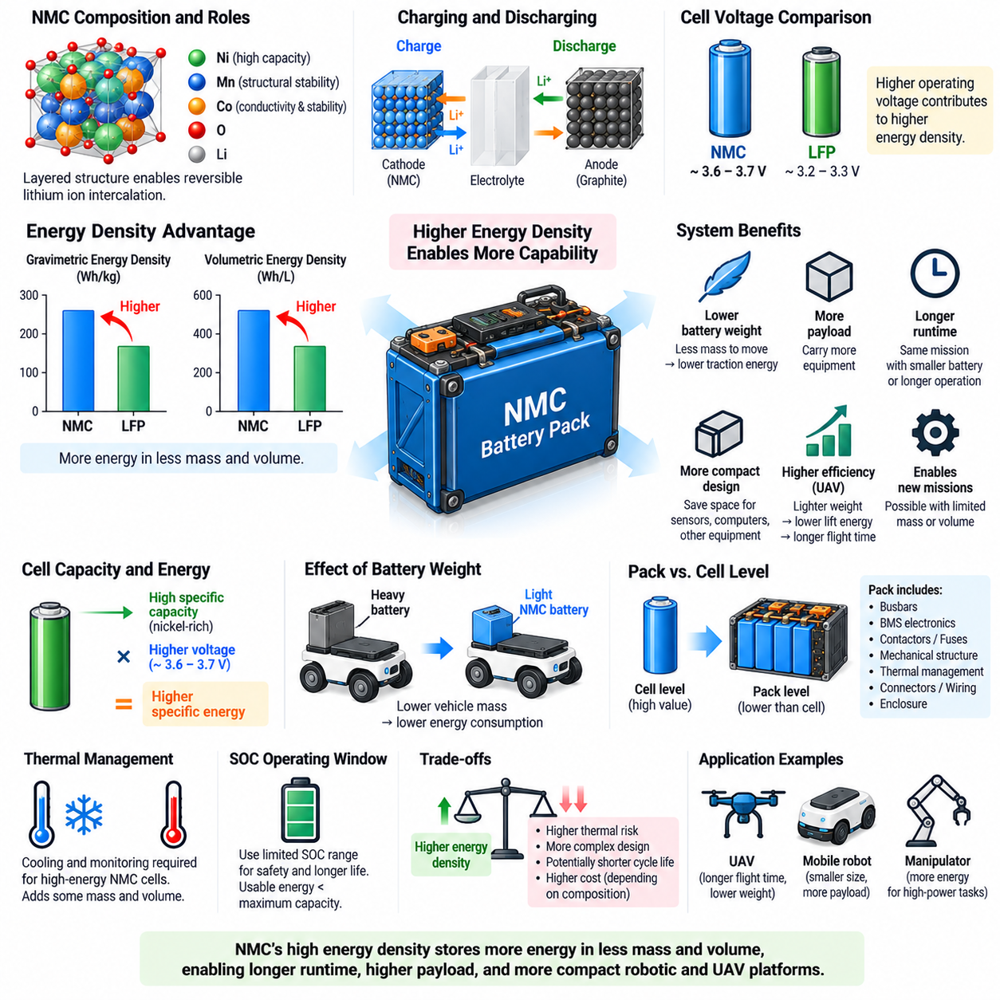
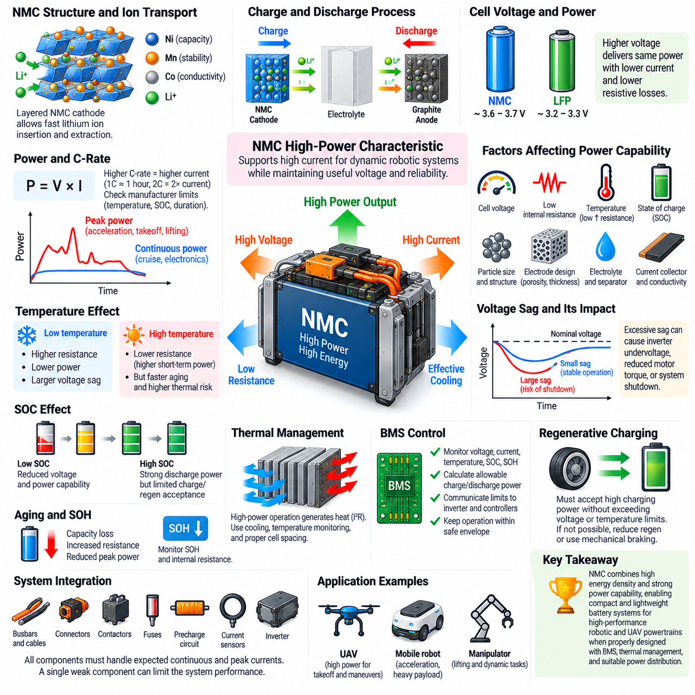
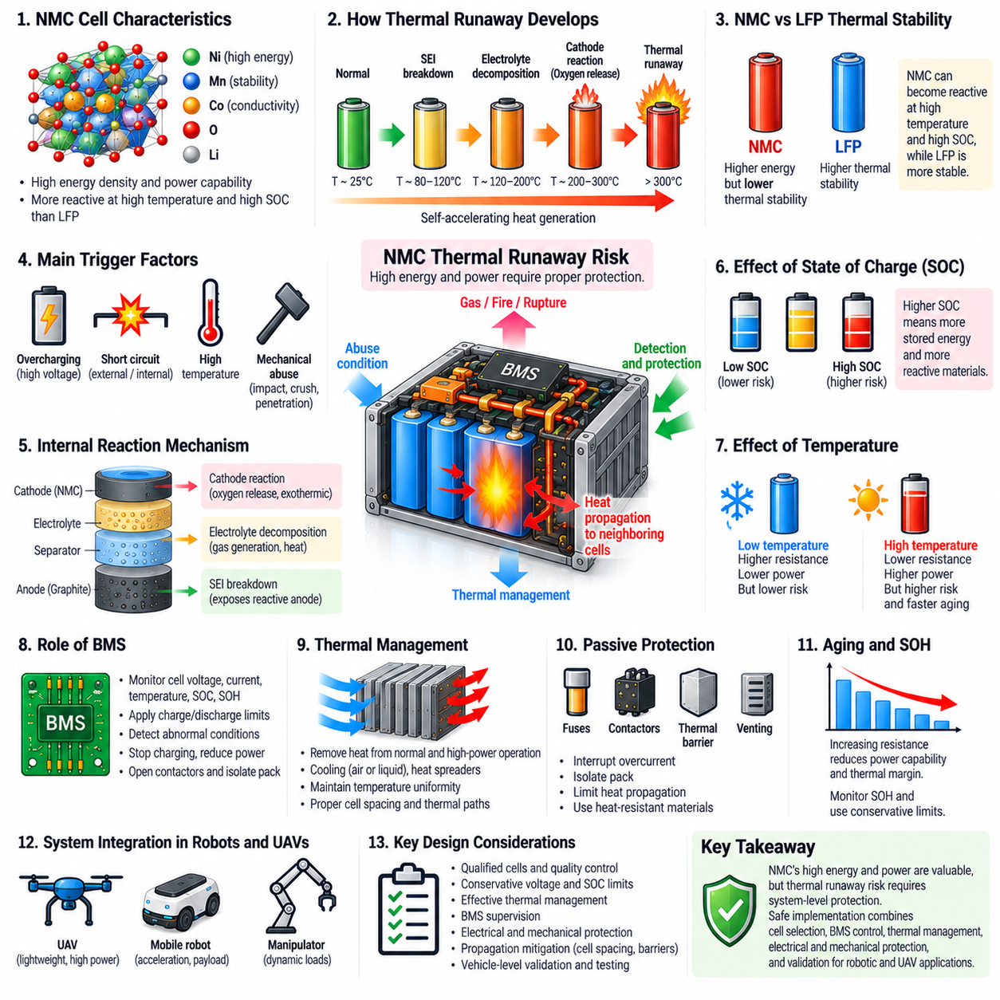
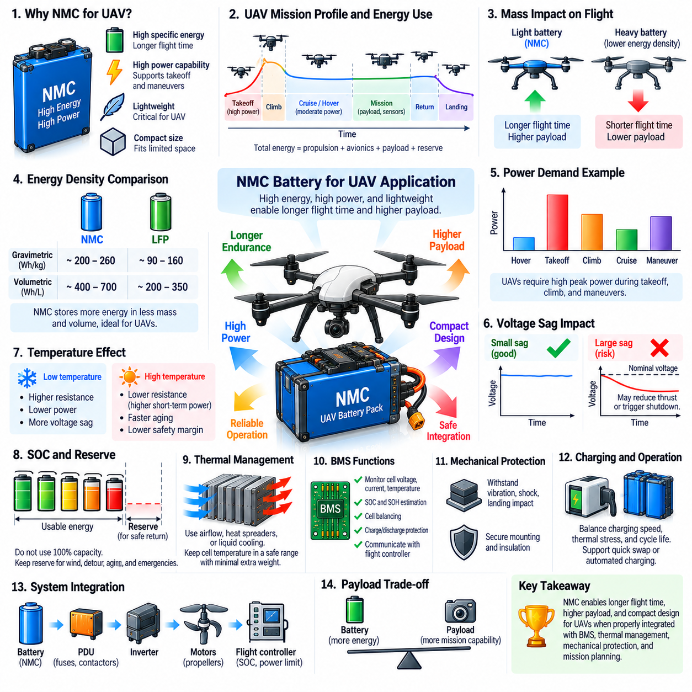
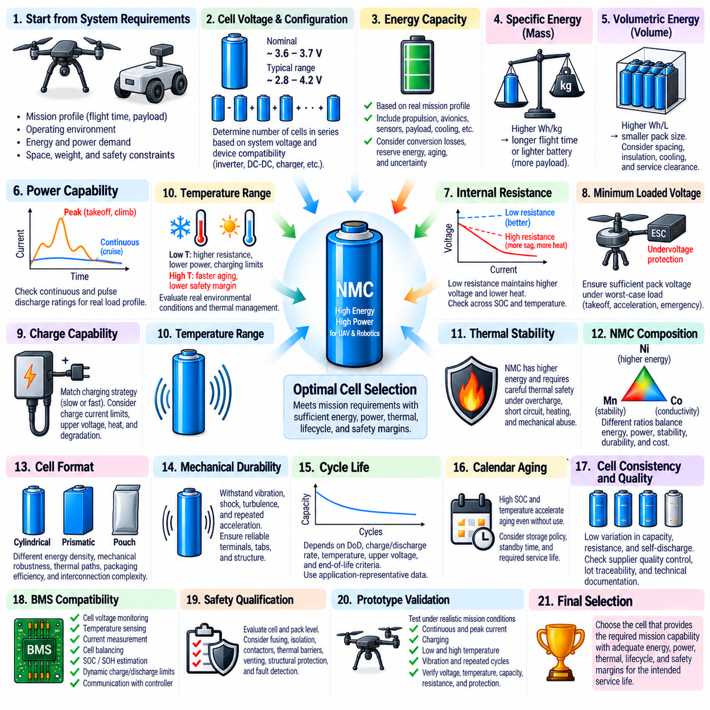

**Volume 11. Battery and Powertrain**

# Chapter 03. NMC Battery

## 03.01. NMC Energy Density Advantage

{width="7.268055555555556in" height="7.268055555555556in"}

니켈망간코발트(Nickel Manganese Cobalt, NMC)는 높은 에너지 저장 능력과 실용적인 출력 성능 및 사이클 수명(cycle life)을 결합하도록 설계된 리튬이온전지(lithium-ion battery) 양극 화학계(cathode chemistry)이다. 이 볼륨의 배터리 구조에서 NMC는 LFP와 별도로 다루어지는데, NMC의 재료 특성이 에너지밀도(energy density), 출력 성능, 열적 거동, 응용 적합성 사이에서 서로 다른 균형을 형성하기 때문이다.

NMC 화학계의 주요 장점은 높은 에너지밀도(energy density)이다. 에너지밀도는 배터리의 질량 또는 부피에 비해 얼마나 많은 전기에너지를 저장할 수 있는지를 나타낸다. 중량 에너지밀도(gravimetric energy density)는 킬로그램당 와트시(watt-hours per kilogram)로 표현되고, 체적 에너지밀도(volumetric energy density)는 리터당 와트시(watt-hours per liter)로 표현된다. 값이 높을수록 차량의 질량이나 패키징 부피를 비례적으로 증가시키지 않고 더 많은 사용 가능 에너지를 저장할 수 있다.

NMC 양극(cathode)은 니켈(nickel), 망간(manganese), 코발트(cobalt)를 서로 다른 비율로 사용하여 상호 보완적인 전기화학적 특성을 구현한다. 니켈은 용량 증가에 크게 기여하여 높은 에너지밀도를 지원하고, 망간은 구조적 안정성(structural stability)을 높이는 데 도움을 주며, 코발트는 전도성과 전기화학적 안정성(electrochemical stability)에 기여한다. 이러한 원소의 상대적인 비율을 변경함으로써 제조사는 에너지, 출력, 내구성, 비용, 안전 요구사항에 맞게 셀을 최적화할 수 있다.

NMC 양극재의 층상 결정구조(layered crystal structure)는 배터리 동작 중 리튬이온의 가역적인 삽입과 탈리(reversible insertion and extraction)를 가능하게 한다. 충전 시 리튬이온은 양극에서 빠져나와 전해질(electrolyte)을 통과하여 흑연 기반 음극(graphite-based anode)으로 이동하고, 전자는 외부 회로(external circuit)를 통해 흐른다. 방전 시 리튬이온은 다시 NMC 양극 방향으로 이동하면서 차량이나 로봇 시스템에 공급할 수 있는 전기에너지를 방출한다.

NMC 셀은 일반적으로 LFP 셀보다 높은 공칭전압(nominal voltage)에서 동작한다. 구체적인 조성과 셀 설계에 따라 달라지지만 공칭전압은 일반적으로 셀당 약 3.6\~3.7 V이며, LFP의 약 3.2\~3.3 V와 비교된다. 배터리 에너지는 전압과 전하 용량(charge capacity) 모두와 관련되기 때문에 이러한 높은 동작 전압은 NMC 배터리 시스템의 에너지밀도 장점에 직접적으로 기여한다.

양극의 높은 비용량(specific capacity)은 또 다른 주요 기여 요소이다. 최신 니켈 고함량 NMC 조성(nickel-rich NMC formulation)은 활물질(active material)의 단위 질량당 상당한 전하를 저장할 수 있다. 이러한 특성이 비교적 높은 동작 전압과 결합되면 셀 수준의 비에너지(specific energy)가 증가한다. 따라서 상대적으로 에너지밀도가 낮은 화학계와 비교하여 일정한 에너지를 저장하는 데 필요한 배터리 질량을 줄일 수 있다.

배터리 질량이 플랫폼 자체를 이동시키는 데 필요한 에너지에 영향을 주는 경우 이러한 실질적인 장점은 더욱 중요해진다. 무거운 배터리는 차량 질량을 증가시키며, 이는 견인 에너지(traction energy), 구조적 요구사항, 추진 시스템의 출력 요구를 증가시킬 수 있다. 따라서 저장 에너지를 유지하면서 배터리 질량을 줄이면 가속, 등판 또는 지속적인 이동 운용에 필요한 에너지를 감소시키는 2차적인 시스템 이점도 얻을 수 있다.

설치 공간이 제한된 경우에는 체적 에너지밀도(volumetric energy density)도 동일하게 중요하다. 로봇, 이동형 매니퓰레이터(mobile manipulator), 자율주행차량(autonomous vehicle), 무인항공기(Unmanned Aerial Vehicle, UAV)는 배터리, 모터, 전자장치, 센서, 컴퓨터, 구조물, 냉각장치, 페이로드(payload)에 내부 공간을 분배해야 한다. 높은 에너지밀도의 배터리는 에너지 저장에 필요한 부피를 줄여 임무 장비(mission equipment)를 위한 더 많은 패키징 공간을 확보할 수 있다.

이러한 관계는 모든 킬로그램의 질량이 양력 요구량(lift requirement)과 비행 효율에 직접적인 영향을 미치는 항공기 및 무인항공기(UAV) 응용에서 특히 중요하다. 비에너지(specific energy)가 높은 배터리는 동일한 배터리 질량에서 더 긴 비행 지속시간(endurance)을 제공하거나, 정해진 임무시간에서 배터리 질량을 줄일 수 있다. 이러한 이유로 이 볼륨의 배터리 아키텍처는 NMC의 특성을 이후 다루게 될 UAV용 NMC 응용과 연결한다.

그러나 에너지밀도는 셀 수준(cell level)과 팩 수준(pack level) 모두에서 평가해야 한다. 공개된 셀 수준의 값에는 실제로 동작하는 배터리 시스템을 구성하는 데 필요한 모든 부품이 포함되지 않는다. 버스바(busbar), 전기 절연(electrical insulation), BMS 전자장치, 접촉기(contactor), 퓨즈, 기계 구조물, 열관리 부품(thermal-management component), 커넥터, 배선, 인클로저(enclosure)는 에너지를 직접 저장하지 않으면서 질량과 부피를 증가시킨다. 따라서 팩 수준의 에너지밀도는 개별 셀에 표시된 값보다 낮다.

열관리 요구사항(thermal-management requirements)은 실제 시스템에서 구현되는 에너지밀도 장점에 추가적인 영향을 줄 수 있다. 고에너지 NMC 셀에는 세심하게 설계된 냉각, 온도 모니터링, 셀 간격, 열전파 완화(propagation mitigation), 기계적 보호가 필요할 수 있다. 이러한 구성요소는 셀 수준에서 확보한 이론적인 질량 및 부피상의 장점을 일부 감소시킨다. 따라서 배터리 화학계를 의미 있게 비교하려면 동등한 안전성과 신뢰성 요구사항으로 설계된 완전한 팩을 평가해야 한다.

에너지밀도의 장점은 충전상태(State of Charge, SOC)의 운용 한계와 독립적으로 고려할 수도 없다. 셀이 큰 이론적 에너지 용량을 가지고 있더라도 실제 시스템에서는 안전성과 수명 성능을 향상시키기 위해 SOC의 상한과 하한을 제한하는 경우가 많다. 따라서 공학적으로 중요한 값은 셀 사양에 표시된 최대 전기화학적 용량(maximum electrochemical capacity)이 아니라 허용된 운용 구간 내에서 실제로 사용할 수 있는 에너지(usable energy)이다.

니켈 함량(nickel content)은 최신 NMC 화학계의 중요한 설계 변수이다. 일반적으로 니켈 함량을 높이면 용량이 증가하고 코발트 의존도를 줄일 수 있어 비에너지를 향상시키고 잠재적으로 소재 경제성(material economics)을 개선할 수 있다. 그러나 니켈 고함량 조성은 구조적 안정성, 계면 열화(interface degradation), 열적 거동, 제조 관리, 장기 내구성 측면에서 더 큰 과제를 발생시킬 수 있으므로 더욱 정교한 셀 및 배터리 시스템 엔지니어링이 필요하다.

에너지밀도는 사이클 수명과도 상호작용한다. 전압과 SOC의 극한 영역까지 사용하여 저장 에너지를 최대화하면 전극재와 전해질 계면(electrolyte interface)에 가해지는 스트레스가 증가할 수 있다. 따라서 최대 에너지 활용을 목적으로 설계된 배터리는 더 좁은 SOC 범위에서 운용되는 배터리와 서로 다른 노화 특성을 나타낼 수 있다. 시스템 설계자는 요구되는 사용수명 목표를 충족하면서 이론적인 NMC 에너지 장점 중 어느 정도를 실제로 사용할 것인지 결정해야 한다.

이동형 로봇(mobile robot)에서는 패키징 공간이나 차량 질량이 크게 제한되는 경우 NMC가 매력적인 선택이 될 수 있다. 소형 검사 로봇(compact inspection robot), 이동형 매니퓰레이터, 고속 플랫폼 또는 에너지 소비가 큰 컴퓨팅 및 센싱 시스템을 탑재한 로봇은 제한된 배터리 공간에서 더 많은 에너지를 저장함으로써 이점을 얻을 수 있다. 임무시간이 길어지고 배터리 교체 또는 중간 충전이 운영상 어려워질수록 이러한 장점은 더욱 커진다.

충분한 배터리 공간과 빈번한 충전 기회를 가진 일반적인 자율이동로봇(Autonomous Mobile Robot, AMR)에서는 최대 에너지밀도보다 사이클 내구성(cycle durability), 열적 안전 여유(thermal margin), 비용 또는 운용 단순성이 더 중요할 수 있다. 이러한 시스템에서는 LFP가 여전히 매우 매력적인 선택이 될 수 있다. 추가적인 저장 에너지가 과도한 배터리 질량이나 부피, 페이로드 감소, 허용하기 어려운 운용시간 문제를 직접 해결할 수 있는 경우 NMC의 장점은 더욱 커진다.

따라서 배터리 화학계 선정(battery chemistry selection)은 에너지밀도만을 기준으로 하는 것이 아니라 시스템 최적화(system optimization)의 관점에서 수행해야 한다. 설계자는 사용 가능한 팩 에너지, 질량, 부피, 최대 및 연속 출력, 충전 성능, 열관리 요구사항, 안전 아키텍처(safety architecture), 사이클 수명, 환경 조건, 비용, 임무 요구사항을 함께 비교해야 한다. 최적의 화학계는 적절한 공학적 여유를 유지하면서 요구되는 차량 성능을 제공할 수 있는 화학계이다.

궁극적으로 NMC의 에너지밀도 장점은 단순한 하나의 성능 수치가 아니라 중요한 설계 자원(design resource)으로 이해해야 한다. 높은 동작 전압과 높은 양극 용량을 통해 제한된 질량과 부피 안에 상당한 에너지를 저장할 수 있으며, 이를 통해 더 긴 운용시간, 더 낮은 배터리 질량, 증가된 페이로드 또는 더욱 소형화된 플랫폼을 구현할 수 있다. 이러한 장점이 완전한 로봇 또는 UAV 시스템의 측정 가능한 성능 향상으로 전환될 때 NMC의 높은 에너지밀도는 가장 큰 가치를 제공한다.

## 03.02. NMC High Power Characteristic

{width="7.268055555555556in" height="7.268055555555556in"}

니켈망간코발트(Nickel Manganese Cobalt, NMC) 배터리는 높은 에너지밀도(energy density)뿐만 아니라 비교적 작고 가벼운 셀에서 상당한 전력을 공급할 수 있는 능력으로도 높은 가치를 가진다. 로봇 파워트레인(robotic powertrain)에서는 추진 모터와 액추에이터(actuator)가 짧은 시간 동안 평균 수준보다 훨씬 높은 전류를 요구하는 경우가 많기 때문에 이러한 특성이 중요하다. 따라서 NMC는 저장 에너지와 강력한 동적 출력 성능(dynamic power capability)을 동시에 요구하는 시스템을 지원할 수 있다.

배터리 출력(battery power)은 전기에너지가 공급되는 속도를 나타내며 기본적으로 P = V × I 관계를 통해 전압과 전류에 의해 결정된다. 고출력 배터리(high-power battery)는 큰 전류를 공급하면서도 과도한 전압강하(voltage sag), 발열 또는 열화(degradation) 없이 충분한 단자전압(terminal voltage)을 유지해야 한다. 따라서 실제 출력 성능은 셀 전압, 내부저항, 전기화학적 반응속도(electrochemical kinetics), 열적 조건, 충전상태(State of Charge, SOC), 셀 구조, 허용 방전율에 의해 결정된다.

NMC 셀은 구체적인 조성과 설계에 따라 차이가 있지만 일반적으로 약 3.6\~3.7 V의 비교적 높은 공칭전압(nominal voltage)에서 동작한다. 이러한 전압은 시스템 전압이 높을수록 동일한 전력을 더 낮은 전류로 공급할 수 있기 때문에 출력 성능에 기여한다. 동일한 전력에서 전류를 낮추면 셀, 버스바(busbar), 케이블, 커넥터, 접촉기(contactor), 기타 배터리 전력분배 경로(power-distribution path)의 저항 손실을 감소시킬 수 있다.

내부저항(internal resistance)은 고출력 성능을 결정하는 가장 중요한 요소 중 하나이다. 셀에 전류가 흐르면 내부저항에 의해 대략 I × R에 비례하는 전압강하와 I²R에 비례하는 발열이 발생한다. 따라서 출력에 최적화된 셀은 낮은 내부저항과 효율적인 이온 및 전자 수송(ionic and electronic transport)을 구현하여 높은 전류를 공급하면서도 유효한 단자전압을 유지하고 내부 발열을 제한하도록 설계된다.

NMC 양극재(cathode material)의 층상 구조(layered structure)는 리튬이온의 가역적인 삽입과 탈리(reversible insertion and extraction)를 가능하게 하며, 실제 전극공학(electrode engineering)은 이러한 반응이 얼마나 빠르게 진행될 수 있는지를 결정한다. 입자 크기, 전도성 첨가제(conductive additive), 전극 두께, 기공률(porosity), 전해질 침투(electrolyte penetration), 분리막 특성, 집전체(current collector) 설계는 이온과 전자의 수송에 영향을 준다. 고출력 셀은 급속 충방전 시 수송 제한을 줄이도록 이러한 요소를 최적화한다.

C-rate는 셀 용량에 대한 배터리 전류의 상대적인 크기를 표현하는 편리한 방법이다. 1C 방전은 이론적으로 약 1시간 동안 정격용량(rated capacity)을 방전하는 것을 의미하며, 더 높은 C-rate는 더 큰 전류와 더 짧은 방전시간에 해당한다. 그러나 제조사가 제시하는 연속 및 펄스 전류 한계(continuous and pulse current limits)는 제한 없이 사용할 수 있는 성능값으로 해석해서는 안 되며, 지정된 온도, SOC, 전압, 냉각 및 지속시간 조건과 함께 해석해야 한다.

연속 출력(continuous power)과 최대 출력(peak power)은 서로 다른 요구사항을 의미한다. 연속 출력은 허용 가능한 전압과 온도를 유지하면서 지속적으로 공급할 수 있는 출력을 의미하며, 최대 출력은 짧은 시간 동안 사용할 수 있는 출력이다. 로봇 시스템은 일반적으로 가속, 이륙, 급격한 기동, 등판, 리프팅 또는 여러 액추에이터의 동시 작동에서 최대 출력을 요구하며, 순항 주행과 온보드 전자장치는 상대적으로 낮지만 장시간 지속되는 연속 부하를 형성한다.

이러한 고전류 상황에서는 전압강하(voltage sag)가 특히 중요해진다. 모터가 갑자기 큰 전류를 요구하면 내부저항과 전기화학적 분극(electrochemical polarization)으로 인해 배터리 단자전압이 감소한다. 과도한 전압강하는 인버터 저전압 보호(inverter undervoltage protection), 모터 토크 감소, 불안정한 DC 버스(DC bus) 동작 또는 민감한 장비의 정지를 발생시킬 수 있다. 따라서 배터리 선정에서는 공칭전압이나 개방회로전압(open-circuit voltage)만이 아니라 부하 상태에서의 최소 전압(minimum loaded voltage)을 확인해야 한다.

온도는 NMC의 출력 성능에 큰 영향을 미친다. 저온에서는 이온전도도(ionic conductivity)와 리튬 확산(lithium diffusion)이 감소하고 내부저항과 분극이 증가하여 사용 가능한 방전 출력이 감소하고 전압강하가 커진다. 고온에서는 내부저항이 감소하면서 단기적인 출력 성능이 향상될 수 있지만 배터리 노화가 가속되고 열적 위험이 증가할 수 있다. 따라서 출력 제한(power limit)은 하나의 고정된 전류 정격이 아니라 온도에 따라 달라지도록 설정해야 한다.

충전상태(State of Charge, SOC)도 사용 가능한 출력에 영향을 준다. SOC 하한에 가까워지면 일부 에너지가 남아 있더라도 셀 전압 감소와 분극 증가로 인해 방전 성능이 제한될 수 있다. SOC 상한 부근에서는 강한 방전 출력을 제공할 수 있지만 최대 셀 전압으로 인해 충전 또는 회생에너지(regenerative energy) 수용 능력이 제한될 수 있다. 따라서 BMS는 SOC, 전압, 온도, 셀 상태를 함께 이용하여 허용 가능한 충전 및 방전 출력을 계산해야 한다.

고출력 운전은 전류 의존적인 손실이 전류 증가에 따라 빠르게 커지기 때문에 상당한 열적 스트레스(thermal stress)를 발생시킨다. 반복적인 가속, 고속 운전, 무거운 페이로드 이동 또는 공격적인 비행 기동은 평균 임무 출력이 허용 가능한 수준으로 보이더라도 국부적인 발열(localized heating)을 발생시킬 수 있다. 따라서 열 설계(thermal design)는 과도 출력 프로파일(transient power profile), 셀 온도 구배(cell temperature gradient), 냉각 경로, 반복적인 고부하 상황에서 누적되는 열을 함께 고려해야 한다.

배터리 관리 시스템(Battery Management System, BMS)은 이론적인 NMC 셀 성능을 안전하게 사용할 수 있는 실제 출력으로 변환하는 핵심적인 역할을 한다. BMS는 셀 전압, 팩 전류, 온도, SOC 및 필요한 경우 건강상태(State of Health, SOH)를 모니터링하고 허용 가능한 방전 및 충전 한계를 결정한다. 이러한 한계는 모터 제어기, 인버터, 차량 제어기 또는 비행제어 시스템(flight-control system)에 전달되어 요구되는 출력이 배터리의 순간적인 운용 가능 영역(operating envelope)을 벗어나지 않도록 할 수 있다.

배터리가 노화됨에 따라 건강상태(State of Health, SOH)는 더욱 중요해진다. 용량 감소는 사용 가능한 에너지를 줄이며, 내부저항 증가는 최대 출력 성능을 직접적으로 감소시키고 발열을 증가시킨다. 따라서 배터리에 임무를 수행하기에 충분한 용량이 남아 있더라도 필요한 가속 또는 이륙 출력을 더 이상 제공하지 못할 수 있다. 출력 중심의 배터리 진단(power-oriented battery diagnostics)에서는 일반적인 용량 유지율뿐만 아니라 내부저항 증가도 추적해야 한다.

회생제동(regenerative braking) 또는 회생 하강(regenerative descent)은 전류를 배터리로 다시 유입시키기 때문에 반대 방향의 고출력 조건을 발생시킨다. 팩은 셀 전압이나 온도 한계를 초과하지 않으면서 이러한 순간적인 충전 출력을 수용할 수 있어야 한다. 높은 SOC, 낮은 온도 또는 셀 열화로 인해 충전 수용 능력(charge acceptance)이 부족한 경우 파워트레인은 회생 수준을 낮추거나 다른 제동 메커니즘을 통해 초과 에너지를 소모해야 한다.

고출력 성능은 배터리만이 아니라 전체 전기 아키텍처(electrical architecture)에 영향을 준다. 버스바, 케이블, 커넥터, 퓨즈, 접촉기, 프리차지 회로(precharge circuit), 전류센서, 인버터 인터페이스는 모두 예상되는 연속 및 순간 전류를 견딜 수 있어야 한다. 매우 높은 전류를 공급할 수 있는 셀을 사용하더라도 다른 구성요소에서 과도한 저항, 발열, 전압강하 또는 더 낮은 전류 제한이 발생한다면 시스템 수준에서는 그 성능을 충분히 활용할 수 없다.

NMC의 높은 비에너지(specific energy)와 강력한 출력 성능의 조합은 특히 무인항공기(Unmanned Aerial Vehicle, UAV)에 매력적이다. 이륙, 수직 상승, 급격한 기동, 바람 보상, 페이로드 안정화는 큰 출력을 요구할 수 있는 반면 항공기의 질량은 낮게 유지해야 한다. 제한된 질량 안에서 에너지와 출력을 동시에 제공할 수 있는 배터리는 비행 지속시간(flight endurance)과 안정적인 항공 운용에 필요한 순간적인 추진 출력을 함께 지원할 수 있다.

동적 부하가 큰 이동형 로봇(mobile robot)과 매니퓰레이터(manipulator)도 이러한 특성의 이점을 얻을 수 있다. 급가속, 급경사, 고중량 페이로드 운송, 리프팅 메커니즘, 로봇팔, 고성능 컴퓨팅(high-performance computing)이 동시에 큰 전력을 요구할 수 있다. 그러나 중간 수준의 출력과 빈번한 충방전이 중심인 응용에서는 최대 비출력(specific power)보다 열적 안전 여유, 사이클 수명, 비용, 운용 단순성과 같은 다른 특성을 우선할 수 있다.

따라서 고출력 성능은 하나의 최대 전류 수치만으로 평가해서는 안 된다. 의미 있는 셀 선정에는 펄스 지속시간(pulse duration), 반복 빈도, 부하 상태의 최소 전압, SOC 범위, 온도, 냉각, 내부저항 증가, 노화, 팩 수준의 전기적 손실을 함께 검토해야 한다. 실제적인 출력 프로파일을 이용한 차량 수준 시험(vehicle-level testing)을 통해 이론적인 셀 성능이 완전한 배터리 및 파워트레인 시스템에 통합된 이후에도 실제로 제공되는지 검증해야 한다.

궁극적으로 NMC의 고출력 특성(high-power characteristic)은 비교적 높은 셀 전압, 낮은 내부저항, 효과적인 리튬이온 수송, 최적화된 전극 구조, 적절한 열관리(thermal management)의 상호작용을 통해 구현된다. 이러한 특성을 BMS의 출력 제한과 적절한 정격의 전력분배 하드웨어(power-distribution hardware)와 통합하면, 소형 배터리 시스템에서도 고성능 로봇 및 UAV 파워트레인이 요구하는 빠르고 높은 수준의 에너지 흐름을 안정적으로 지원할 수 있다.

## 03.03. NMC Thermal Runaway Risk

{width="7.268055555555556in" height="7.268055555555556in"}

니켈망간코발트(Nickel Manganese Cobalt, NMC) 배터리는 높은 에너지밀도(energy density)와 강력한 출력 성능을 제공하지만, 이러한 장점에는 LFP와 같이 열적으로 더욱 안정적인 화학계보다 높은 열폭주(thermal runaway) 위험이 수반된다. NMC 양극(cathode)의 전이금속 산화물(transition-metal oxide)은 온도와 충전상태(State of Charge, SOC)가 증가할수록 반응성이 높아질 수 있으므로, 열 안전성(thermal safety)은 셀 선정, 팩 설계, BMS 제어 및 로봇 파워트레인 통합에서 핵심적인 고려사항이 된다.

열폭주(thermal runaway)는 셀 내부에서 발생하는 열이 외부로 제거할 수 있는 열보다 많아지는 자기 가속 과정(self-accelerating process)이다. 온도가 상승하면 추가적인 발열반응(exothermic reaction)이 활성화되고, 이 반응은 더 많은 열을 발생시켜 온도를 다시 상승시킨다. 이러한 양의 피드백(positive feedback)이 중단되지 않으면 셀에서 급격한 온도 상승, 가스 생성, 가스 배출(venting), 화재 또는 파열이 발생할 수 있으며, 발생한 열이 인접 셀로 전달될 가능성도 있다.

이 과정은 일반적으로 하나의 단일 양극 반응(cathode reaction)으로 시작되는 것이 아니다. 전기적, 열적 또는 기계적 비정상 조건에 노출된 배터리는 여러 단계의 열화 과정을 거칠 수 있다. 과도한 온도는 전극 보호 계면(protective electrode interface)을 불안정하게 만들고, 전해질 분해(electrolyte decomposition)와 가스 생성을 가속하며, 충전된 전극재와 전해질 사이의 반응을 촉진할 수 있다. 이러한 메커니즘이 상호작용하면 결국 셀과 팩이 방출할 수 있는 것보다 더 빠르게 열이 발생할 수 있다.

흑연 음극(graphite anode)에 형성되는 고체전해질계면(Solid Electrolyte Interphase, SEI)은 중요한 초기 보호층이다. 정상 동작에서는 리튬이온 수송을 허용하면서 지속적인 전해질 분해를 제한한다. 그러나 셀 온도가 과도하게 상승하면 SEI가 열화되어 반응성이 높은 리튬화 음극재(lithiated anode material)가 전해질에 노출될 수 있다. 이후 발생하는 반응은 추가적인 열을 생성하고 더욱 심각한 열적 불안정성으로 진행되는 데 기여할 수 있다.

온도가 계속 상승하면 NMC 양극의 거동이 더욱 중요해진다. 강하게 결합된 LFP의 인산염 구조(phosphate structure)와 비교할 때 층상 NMC 소재(layered NMC material)는 심각한 조건에서 상대적으로 낮은 열적 안정성(thermal stability)을 나타낼 수 있다. 양극 결정격자(cathode lattice)와 관련된 산소는 전해질 및 다른 셀 물질과의 고에너지 반응에 참여할 수 있으며, 이는 심각한 내부 고장이 발생한 이후 열 발생을 증가시키고 상황을 제어하기 어렵게 만들 수 있다.

충전상태(State of Charge, SOC)는 이러한 위험에 큰 영향을 미친다. 높은 SOC의 NMC 셀은 부분 충전된 셀보다 더 많은 전기화학적 에너지를 저장하고 있으며, 전극재도 더 높은 반응성을 갖는 상태에 놓일 수 있다. 따라서 상한 전압 근처에서의 운용은 특히 높은 온도나 셀 열화와 결합될 경우 열적 안전 여유(thermal safety margin)를 감소시킬 수 있다. 사용 가능한 최대 에너지를 확보하는 것보다 수명 내구성과 안전성이 중요한 경우 배터리 시스템은 보수적인 SOC 상한을 적용할 수 있다.

니켈 함량(nickel content) 역시 에너지밀도와 열적 안정성 사이의 균형에 영향을 준다. 니켈 함량을 높이면 양극 용량과 비에너지(specific energy)를 향상시킬 수 있으므로 질량에 민감한 무인항공기(Unmanned Aerial Vehicle, UAV)와 같은 응용에서 매력적이다. 그러나 니켈 고함량 NMC 조성(nickel-rich NMC composition)은 에너지밀도를 극대화하는 과정에서 셀의 본질적인 열적 안전 여유가 일부 감소할 수 있기 때문에 계면, 충전전압, 온도, 제조 품질 및 열화를 더욱 세심하게 관리해야 한다.

과충전(overcharging)은 셀 전압을 의도된 운용 영역 이상으로 상승시킬 수 있기 때문에 중요한 전기적 유발 요인(electrical trigger)이다. 과도한 전압은 바람직하지 않은 전극 및 전해질 반응을 촉진하고 발열을 증가시킬 수 있다. 따라서 적절하게 설계된 배터리 관리 시스템(Battery Management System, BMS)은 전체 팩 전압에만 의존하지 않고 직렬 연결된 모든 셀을 개별적으로 모니터링해야 한다. 셀 불균형이 존재하면 평균적인 팩 전압이 정상적으로 보이더라도 특정 셀이 먼저 상한 전압에 도달할 수 있기 때문이다.

외부 단락(external short circuit)과 과도한 방전전류는 매우 높은 전류와 I²R 발열을 통해 또 다른 열적 위험 경로를 형성한다. 내부 단락(internal short circuit)은 분리막(separator) 손상, 제조 결함, 오염, 기계적 변형 또는 수지상 구조(dendritic structure) 등에서 발생할 수 있기 때문에 감지하기가 더욱 어려울 수 있다. 국부적인 내부 발열은 팩 수준의 전류 측정에서 고장의 심각성이 명확하게 나타나기 전에 발생할 수 있으므로 셀 품질과 기계적 보호가 중요하다.

기계적 손상(mechanical damage)은 이동형 로봇 시스템에서 특히 중요하다. 충돌, 압착, 관통, 진동, 충격 또는 변형은 전극이나 분리막을 손상시키고 내부 전기적 접촉을 발생시킬 수 있다. 따라서 배터리 인클로저(battery enclosure)는 단순히 셀을 고정하는 역할에 그쳐서는 안 된다. 차량 운용, 운송, 유지보수 및 예측 가능한 사고 상황에서 발생할 수 있는 기계적 하중에 대응하도록 구조적 보호, 견고한 장착, 제어된 간극(clearance), 절연 기능을 제공해야 한다.

온도 모니터링(temperature monitoring)은 비정상 상태를 감지하는 중요한 수단이지만 물리적인 한계가 존재한다. 센서는 모든 셀 내부의 모든 위치를 측정하는 것이 아니라 선택된 위치의 온도를 측정한다. 따라서 빠르게 발생하는 내부 고온점(internal hot spot)은 외부 센서가 그 심각성을 완전히 감지하기 전에 위험한 수준으로 발전할 수 있다. 센서 배치는 열해석(thermal analysis)과 시험을 기반으로 결정해야 하며, 특히 셀이 조밀하게 배치된 영역, 고전류 경로, 냉각이 제한되는 영역 및 예상 고온점(hot spot)을 중요하게 고려해야 한다.

따라서 열관리(thermal management)는 NMC 팩 안전성의 기본적인 구성요소이다. 정상 방전, 급속 충전, 반복적인 최대 출력 동작, 회생에너지(regenerative energy)로 발생하는 열을 셀에서 효과적으로 제거해야 한다. 출력 수준과 패키징 밀도에 따라 열확산판(heat spreader), 강제공랭(forced-air cooling), 액체냉각(liquid cooling) 또는 기타 제어된 열전달 경로가 필요할 수 있다. 셀 간 온도 균일성을 유지하면 불균일한 노화와 내부저항 증가도 감소시킬 수 있다.

BMS는 시스템이 위험한 상태로 진행되는 것을 방지하는 주요 능동 제어 계층(active control layer)을 제공한다. BMS는 셀 전압, 전류, 온도, SOC 및 진단 정보를 모니터링하고 이에 따라 충전 및 방전 한계를 적용한다. 비정상 상태가 감지되면 출력을 감소시키거나 충전을 중단하고, 회생제동(regeneration)을 비활성화하며, 차량 출력 디레이팅(vehicle derating)을 요청하거나 접촉기(contactor)를 개방하여 전기적 또는 열적 스트레스가 임계 수준에 도달하기 전에 팩을 격리할 수 있다.

전자제어만으로 모든 고장을 방지할 수는 없기 때문에 수동 보호(passive protection)도 필요하다. 퓨즈(fuse)는 심각한 과전류를 차단할 수 있고, 접촉기는 팩을 전기적으로 격리할 수 있으며, 적절한 절연은 의도하지 않은 전도 경로를 감소시킨다. 기계적 차단벽(mechanical barrier), 제어된 셀 간격, 내열 소재(heat-resistant material), 가스 배출 구조(venting provision)는 셀 고장의 영향을 제한할 수 있다. 이러한 수단은 하나의 BMS 기능이나 센서에 의존하지 않는 독립적인 보호 계층을 형성한다.

열전파(thermal propagation)는 가장 중요한 팩 수준 위험 중 하나이다. 고장난 셀이 인접 셀에 충분한 열을 전달하면 주변 셀도 열폭주에 진입하여 연쇄적인 고장(cascading event)이 발생할 수 있다. 열전파 저항성은 셀 에너지, 셀 간격, 배치 방향, 열 차단재(thermal barrier), 인클로저 형상, 냉각 경로, 배출가스 관리(vent-gas management)에 따라 달라진다. 따라서 셀 수준의 적합성만으로 팩 안전성을 보장한다고 가정해서는 안 되며, 하나의 셀 고장이 국부적으로 제한되는지를 팩 검증을 통해 평가해야 한다.

명확한 고장이 발생하지 않더라도 노화(aging)는 점진적으로 열적 안전 여유를 감소시킬 수 있다. 반복적인 충방전, 고온 노출, 높은 SOC에서의 보관, 공격적인 충전은 내부저항을 증가시키고 전극 계면을 변화시킬 수 있다. 높은 내부저항은 동일한 전류에서 더 많은 열을 발생시키며, 열화된 소재는 전기적 스트레스에 다르게 반응할 수 있다. 따라서 배터리가 수명 종료(end of life)에 가까워질수록 건강상태(State of Health, SOH) 모니터링과 보수적인 출력 제한이 더욱 중요해질 수 있다.

UAV 응용에서는 높은 에너지밀도가 NMC를 선택하는 주요 이유 중 하나이기 때문에 NMC의 열 안전성을 특히 세심하게 시스템 최적화해야 한다. 지나치게 많은 구조적 보호와 냉각 질량을 추가하면 NMC의 중량상 장점이 감소하는 반면, 보호가 부족하면 위험이 증가한다. 따라서 셀 선정, 팩 레이아웃(pack layout), 열전달 경로, BMS 제한, 비행 출력 요구사항, 인클로저 설계, 비상 동작(emergency behavior)을 개별적으로가 아니라 하나의 시스템으로 함께 설계해야 한다.

지상 로봇 플랫폼(robotic ground platform)은 일반적으로 보호와 냉각에 더 많은 질량을 할당할 수 있지만, 급속 충전, 고전류 가속, 밀폐된 배터리 공간, 충격, 사람이나 기반시설 주변에서의 운용과 같은 까다로운 조건에 여전히 노출될 수 있다. 따라서 차량의 양력 문제가 존재하지 않더라도 배터리 사고의 결과는 운용상 심각할 수 있으며, 의도적인 팩 수준 격납(pack-level containment)과 고장 관리 전략(fault-management strategy)이 필요하다.

궁극적으로 NMC의 열폭주 위험은 이 화학계를 무조건 배제해야 하는 이유가 아니라 시스템 엔지니어링(system engineering)의 문제로 다루어야 한다. 질량과 부피가 제한된 환경에서는 높은 에너지 및 출력 성능이 상당한 장점을 제공할 수 있지만, 이러한 장점을 활용하려면 그에 상응하는 보호가 필요하다. 안전한 NMC 적용은 검증된 셀, 보수적인 운용 한계, 열관리, BMS 감시, 전기적 보호, 기계적 격납(mechanical containment), 열전파 완화(propagation mitigation), 차량 수준 검증(vehicle-level validation)을 통합함으로써 구현된다.

## 03.04. NMC for UAV Application

{width="7.268055555555556in" height="7.268055555555556in"}

니켈망간코발트(Nickel Manganese Cobalt, NMC) 배터리는 무인항공기(Unmanned Aerial Vehicle, UAV)의 성능이 질량, 부피, 사용 가능한 전기에너지에 크게 제한되기 때문에 UAV 응용에 특히 적합하다. 배터리는 유용한 비행 지속시간(flight endurance)을 확보할 수 있는 충분한 에너지를 제공하는 동시에 이륙, 상승, 기동, 자세 안정화(stabilization), 페이로드(payload) 운용에 필요한 높은 출력을 공급해야 한다. NMC는 높은 비에너지(specific energy)와 상당한 출력 성능을 결합하여 질량에 민감한 항공 파워트레인(aerial powertrain)에 적합하다.

UAV에서는 배터리 질량이 비행 상태를 유지하는 데 필요한 추진 에너지(propulsion energy)에 직접적인 영향을 미친다. 지상 로봇과 달리 항공기는 자체 중량을 상쇄할 수 있는 충분한 공기역학적 양력(aerodynamic lift) 또는 로터 추력(rotor thrust)을 지속적으로 생성해야 한다. 따라서 배터리 용량을 증가시키면 저장 에너지는 늘어나지만 차량 질량도 증가하는 절충관계(tradeoff)가 발생한다. 높은 비에너지의 NMC 셀은 배터리 질량당 더 많은 에너지를 저장함으로써 이러한 불이익을 줄이는 데 도움이 된다.

동일한 장점은 체적 에너지밀도(volumetric energy density)에도 적용된다. UAV 동체(fuselage)와 기체 구조(airframe)의 내부 공간은 제한되어 있으며, 이 공간에는 추진 전자장치, 비행 컴퓨터(flight computer), 센서, 통신장비, 착륙 시스템, 열관리 구성요소, 페이로드, 구조부재가 함께 배치되어야 한다. 소형화된 NMC 배터리 팩은 제한된 설치 공간 안에서 상당한 에너지를 제공하여 임무 핵심 장비(mission-critical equipment)를 위한 더 많은 공간을 확보할 수 있다.

비행 지속시간은 배터리 용량만이 아니라 전체 항공기의 에너지 균형(energy balance)에 의해 결정된다. 호버링(hovering), 전진 비행, 상승, 하강, 기동, 바람 보상(wind compensation), 항공전자장비(avionics), 센서, 통신, 컴퓨팅, 페이로드 시스템은 모두 에너지를 소비한다. 따라서 배터리 용량 산정(battery sizing)은 일정한 평균 출력만을 가정하지 않고 이륙, 순항 또는 호버링, 임무 수행, 복귀 비행, 착륙, 적절한 예비 에너지(reserve energy)를 포함하는 대표적인 임무 프로파일(mission profile)을 사용해야 한다.

출력 성능(power capability)은 특히 이륙과 상승 과정에서 중요하다. 멀티로터 UAV(multirotor UAV)는 모든 추진 모터가 동시에 높은 추력을 발생시킬 때 상당한 전류를 요구할 수 있으며, 고정익(fixed-wing) 또는 하이브리드 수직이착륙(Hybrid Vertical Take-Off and Landing, VTOL) 항공기는 수직 이륙이나 비행 모드 전환 과정에서 큰 과도 부하(transient load)를 경험할 수 있다. 적절한 방전 성능을 가진 NMC 셀은 유효한 단자전압(terminal voltage)을 유지하고 과도한 전압강하(voltage sag)를 제한하면서 이러한 최대 출력 상황을 지원할 수 있다.

추진 시스템은 배터리 전압 변화에 크게 영향을 받을 수 있으므로 전압강하(voltage sag)를 고려해야 한다. 높은 전류는 셀 내부저항뿐만 아니라 버스바(busbar), 케이블, 커넥터, 보호장치의 저항을 통해 전압강하를 발생시킨다. 부하 상태의 전압이 과도하게 낮아지면 모터 회전속도 또는 사용 가능한 추력이 감소하고 인버터(inverter)나 비행 시스템의 저전압 보호(undervoltage protection)가 작동할 수 있다. 따라서 팩 설계에서는 최악의 비행 부하 조건에서 최소 전압을 검증해야 한다.

UAV 배터리 아키텍처(battery architecture)에서는 예비 에너지와 즉시 사용 가능한 에너지를 구분해야 한다. 차량은 착륙 전에 전체 공칭 배터리 용량을 모두 사용할 수 있다고 가정하여 임무를 계획해서는 안 된다. 바람, 경로 변경, 항법 오차, 대기시간, 예상하지 못한 페이로드 전력 요구, 배터리 노화, 비상 기동에 대응하기 위한 예비 에너지가 필요하다. 에너지 관리 소프트웨어(energy-management software)는 안전한 복귀 또는 착륙에 충분한 에너지가 남아 있는지를 지속적으로 갱신해야 한다.

따라서 충전상태(State of Charge, SOC) 추정은 단순한 배터리 잔량 표시 기능이 아니라 비행 안전 기능(flight-safety function)이 된다. 배터리 관리 시스템(Battery Management System, BMS)과 비행제어기(flight controller)는 측정된 전류, 셀 전압, 온도, 추정 용량, 운용 이력을 이용하여 잔여 에너지를 추정해야 한다. 이후 임무 계획 시스템은 예상 에너지 요구량과 사용 가능한 배터리 에너지를 비교하여 예비 에너지가 부족해지기 전에 자동 복귀(return-to-home), 경로 단축, 페이로드 우선순위 조정 또는 제어된 착륙(controlled landing)을 수행할 수 있다.

온도는 항공용 배터리 성능에 큰 영향을 미친다. 저온에서는 셀 내부저항이 증가하고 사용 가능한 출력이 감소하여 이륙이나 고추력 운용 중 더 큰 전압강하가 발생할 수 있다. 고온에서는 단기적인 출력 성능이 향상될 수 있지만 노화가 가속되고 열적 안전 여유(thermal safety margin)가 감소한다. 따라서 UAV의 출력 제한과 임무 계획에서는 모든 환경에서 일정한 배터리 성능을 가정하지 않고 SOC와 함께 배터리 온도를 고려해야 한다.

냉각(cooling)은 열관리 하드웨어를 추가할수록 항공기 질량이 증가하기 때문에 UAV에서 독특한 통합 문제를 발생시킨다. 비행 중 생성되는 공기 흐름(airflow)을 이용하여 열 방출을 지원할 수 있지만 냉각 효과는 비행속도, 호버링 조건, 인클로저 설계(enclosure design), 주변온도, 배터리 위치에 따라 달라진다. 따라서 팩 설계에서는 사용 가능한 공기 흐름을 효율적으로 이용하면서 외부 비행 공기 흐름이 자동으로 모든 셀을 균일하게 냉각한다고 가정해서는 안 된다.

NMC는 높은 에너지밀도를 통해 작고 가벼운 패키지 안에 상당한 저장 에너지를 집중시키기 때문에 UAV에서는 열 안전성(thermal safety)에 특히 주의해야 한다. 기계적 보호, 전기적 절연(electrical isolation), 셀 모니터링, 온도센싱(thermal sensing), 전류 보호, 보수적인 운용 한계를 NMC를 선택한 근본적인 이유인 질량상의 장점을 지나치게 감소시키지 않으면서 통합해야 한다. 따라서 설계 목표는 단순한 배터리 에너지 극대화가 아니라 최적화된 보호(optimized protection)를 구현하는 것이다.

기계적 하중(mechanical load)은 고정형 배터리 시스템과 상당히 다르다. UAV 팩은 진동, 착륙 충격, 난기류(turbulence), 반복적인 가속, 구조적 변형(structural flexing), 일부 응용에서는 심각한 충격 하중에 노출될 수 있다. 셀, 버스바, 커넥터, BMS 보드, 배선은 이러한 조건에서도 기계적으로 견고하게 유지되어야 한다. 또한 장시간 운용 중 절연이나 전기적 연결을 손상시킬 수 있는 상대적인 움직임(relative motion)이 발생하지 않도록 배터리를 장착해야 한다.

직렬로 연결된 셀은 시간이 지나면서 불균형해질 수 있으므로 BMS는 개별 셀 전압을 감시해야 한다. 하나의 취약한 셀(weak cell) 또는 과도하게 충전된 셀은 전체 팩이 정상적으로 보이는 상황에서도 먼저 전압 한계에 도달할 수 있다. 셀 수준 모니터링, 온도 감시, 전류 측정, 셀 밸런싱(cell balancing), 보호 로직은 과충전 및 과도한 방전을 방지하는 동시에 비행제어기에 실제 사용 가능한 배터리 성능에 대한 정보를 제공한다.

배터리 건강상태(State of Health, SOH)는 열화가 에너지와 출력 모두에 영향을 미치기 때문에 항공기에서 더욱 중요해진다. 용량 감소는 비행 지속시간을 단축시키고 내부저항 증가는 고추력 상황에서 더 큰 전압강하와 발열을 발생시킨다. 따라서 팩에 상당한 에너지가 남아 있더라도 필요한 이륙 출력이나 비상 출력을 충분한 전압 여유(voltage margin)와 함께 제공할 수 없다면 더 이상 비행용으로 적합하지 않을 수 있다.

따라서 임무 계획에서는 배터리 노화(battery aging)를 명시적으로 고려해야 한다. 새 배터리를 기준으로 한 비행시간 예측은 에너지 모델이 측정된 용량과 내부저항 변화에 적응하지 않는다면 반복적인 충방전 이후 안전하지 않을 수 있다. 과거 비행 데이터(historical flight data)를 활용하여 특정 항공기, 페이로드, 경로, 온도, 기상 조건에 대한 에너지 소비 모델을 개선하면 잔여 비행 지속시간과 복귀 에너지 요구량을 더욱 정확하게 예측할 수 있다.

UAV 설계에서는 페이로드 질량과 배터리 질량이 직접적으로 연결된다. 최대이륙중량(Maximum Take-Off Mass, MTOM)이 고정된 상태에서 페이로드가 증가하면 배터리에 할당할 수 있는 질량이 감소하고, 반대로 배터리 질량을 증가시키면 페이로드 탑재 능력이 감소할 수 있다. 높은 에너지의 NMC 셀은 제한된 배터리 질량 안에서 더 많은 에너지를 제공하여 이러한 절충관계를 개선할 수 있다. 이는 검사 센서, 통신장비, 배송 화물 또는 기타 임무 장비를 탑재하는 경우 특히 중요하다.

화물용 무인항공기(cargo UAV)에서는 페이로드 질량과 비행 프로파일에 따라 추진 에너지가 크게 변화하므로 이러한 고려사항이 더욱 중요해진다. 무거운 페이로드는 이륙 및 상승 출력을 증가시키고, 장거리 운송은 전체 에너지 요구량을 증가시킨다. 따라서 배터리를 독립적으로 용량 산정하기보다 배터리 아키텍처를 추진 시스템 용량, 최대이륙중량, 페이로드 목표, 비행거리, 예비 에너지 정책(reserve policy), 필요에 따라 하이브리드 파워트레인(hybrid powertrain) 개념과 함께 조정해야 한다.

충전 전략(charging strategy)은 플릿 가용성(fleet availability)에도 영향을 미친다. UAV 플릿은 임무 사이에 배터리를 충전하거나 신속하게 교체하거나 자동화된 지상 인프라(automated ground infrastructure)를 통해 관리해야 할 수 있다. 높은 충전율은 임무 간 준비시간(turnaround time)을 단축할 수 있지만 열적 스트레스와 열화를 증가시킨다. 따라서 운용 계획에서는 요구되는 플릿 활용률을 달성하기 위해 충전속도, 배터리 온도, 사이클 수명, 사용 가능한 충전기, 예비 팩(spare pack), 필요한 출격 빈도(sortie frequency)를 균형 있게 고려해야 한다.

전기 아키텍처(electrical architecture)는 배터리의 고출력 성능을 기준으로 설계해야 한다. 도체, 커넥터, 퓨즈, 접촉기 또는 스위칭 장치, 전류센서, 전력분배장치(Power Distribution Unit, PDU), 모터 인버터, DC-DC 컨버터는 예상되는 최대 및 연속 전류를 허용 가능한 손실 범위 내에서 지원해야 한다. 불필요한 저항을 최소화하면 발열과 전압강하를 줄이는 동시에 저장된 배터리 에너지 중 실제 추진 및 임무 시스템에 전달되는 비율을 향상시킬 수 있다.

따라서 NMC가 UAV에 유용한 이유는 단순히 여러 대체 화학계보다 더 많은 에너지를 저장할 수 있기 때문만은 아니다. NMC의 에너지밀도와 출력 성능의 조합은 항공기 수준의 설계 자유도(design freedom)를 직접적으로 향상시킬 수 있다. 정확한 에너지 추정, 열관리, BMS 보호, 구조 설계, 추진 시스템 요구사항, 임무 예비 에너지와 통합하면 NMC는 더 긴 비행 지속시간, 더 높은 페이로드 탑재 능력, 소형 패키징(compact packaging), 높은 출력을 요구하는 비행 프로파일을 지원할 수 있다.

## 03.05. NMC Cell Selection

{width="7.268055555555556in" height="7.268055555555556in"}

로봇 또는 무인항공기(Unmanned Aerial Vehicle, UAV) 배터리 시스템을 위한 NMC 셀(NMC cell)을 선정하려면 에너지밀도(energy density), 출력 성능(power capability), 열적 거동(thermal behavior), 수명 성능(lifecycle performance), 안전성, 시스템 통합 제약조건을 균형 있게 고려해야 한다. 광고상 가장 높은 용량을 가진 셀이 자동으로 최적의 선택이 되는 것은 아니다. 셀 선정은 차량 수준 요구사항(vehicle-level requirements)에서 시작하여 의도된 운용 환경과 사용수명 전체에 걸쳐 필요한 사용 가능 에너지와 출력을 제공할 수 있는 셀을 결정하는 과정이어야 한다.

첫 번째 요구사항은 배터리 시스템 전압(battery system voltage)이다. NMC 셀은 일반적으로 약 3.6\~3.7 V의 공칭전압(nominal voltage)을 가지지만 정확한 동작 범위는 셀 화학계와 제조사 사양에 따라 달라진다. 필요한 직렬 연결 셀 수는 최대 충전전압, 최소 허용 방전전압, 모터 인버터(motor inverter), DC-DC 컨버터(DC-DC converter), 충전기, 전력분배장치(power-distribution equipment), 보호장치와의 호환성을 기준으로 결정해야 한다.

에너지 용량(energy capacity)은 단순한 공칭 차량 운용시간이 아니라 실제 임무 프로파일(mission profile)을 기준으로 결정해야 한다. 추진 시스템, 항공전자장비(avionics), 컴퓨터, 센서, 통신장비, 냉각 시스템, 액추에이터(actuator), 페이로드 장치는 모두 에너지 소비에 기여한다. 또한 차량 에너지 요구사항을 필요한 셀 용량과 팩 구성으로 변환할 때 전력변환 손실, 예비 에너지(reserve energy), 환경 조건, 배터리 노화, 운용 불확실성을 포함해야 한다.

비에너지(specific energy)는 UAV 및 기타 질량 제약이 큰 플랫폼에서 특히 중요하다. 킬로그램당 더 많은 와트시(watt-hours per kilogram)를 저장할 수 있는 셀은 배터리 질량을 비례적으로 증가시키지 않으면서 비행 지속시간(endurance)을 증가시킬 수 있다. 또는 동일한 임무 에너지를 더 가벼운 배터리로 제공하여 페이로드(payload), 구조부품, 센서 또는 기타 장비에 추가적인 질량을 할당할 수 있다. 따라서 셀 수준의 비에너지는 최종 팩 수준의 질량과 함께 평가해야 한다.

체적 에너지밀도(volumetric energy density)는 사용 가능한 설치 공간이 질량보다 더 큰 제약조건이 될 수 있으므로 별도로 고려해야 한다. 배터리 공간은 추진 하드웨어, 전자장치, 열관리 장비(thermal-management equipment), 배선, 구조요소, 페이로드 시스템과 함께 사용되어야 한다. 우수한 체적 에너지밀도를 가진 셀은 필요한 배터리 부피를 줄일 수 있지만, 실제 패키징상의 장점을 평가하기 전에 셀 간격, 절연(insulation), 기계적 지지구조, 냉각 경로, 정비를 위한 간극(service clearance)을 포함해야 한다.

출력 성능(power capability)은 또 하나의 기본적인 선정 기준이다. UAV의 이륙, 수직 상승, 급격한 기동 및 로봇의 가속에서는 평균적인 임무 요구량보다 상당히 높은 전류가 필요할 수 있다. 따라서 연속 및 펄스 방전 정격(continuous and pulse discharge rating)을 실제적인 부하 프로파일(load profile)과 비교해야 한다. 선정된 셀은 단순히 에너지 용량 요구사항을 만족하는 것을 넘어 허용 가능한 전압, 온도, 열화 여유(degradation margin)를 유지하면서 충분한 최대 전류를 공급할 수 있어야 한다.

내부저항(internal resistance)은 이론적인 전류 공급 능력을 실제로 효과적으로 사용할 수 있는지를 결정하는 중요한 요소이다. 높은 전류는 셀 내부에서 대략 I × R에 해당하는 전압강하와 I²R에 해당하는 발열을 발생시킨다. 따라서 내부저항이 낮은 셀은 높은 출력이 필요한 상황에서 더 높은 부하전압(loaded voltage)을 유지하면서 발열을 줄일 수 있다. 유리한 실험실 조건에서 측정된 값이 저온이나 노화된 셀의 성능을 대표하지 못할 수 있으므로 내부저항은 SOC와 온도 범위 전체에서 평가해야 한다.

부하 상태의 최소 전압(minimum loaded voltage)은 추진 시스템 응용에서 특히 중요하다. 개방회로전압(open-circuit voltage)이 충분하더라도 고전류 상황에서 발생하는 전압강하는 모터 성능을 감소시키거나 인버터 저전압 보호(inverter undervoltage protection)를 작동시킬 수 있다. 따라서 셀 선정에서는 전체 직렬 구성을 고려하고 최악 조건의 가속, 이륙, 상승 또는 비상 출력 요구 시 팩 전압을 추정해야 하며, 여기에는 셀과 외부 전력분배 네트워크(power-distribution network)의 저항도 포함해야 한다.

충전 성능(charge capability)은 의도된 운용 전략과 일치해야 한다. 일부 시스템은 운용 사이에 느린 충전을 허용할 수 있지만, 높은 가동률을 요구하는 로봇 또는 UAV 플릿(fleet)은 빠른 임무 전환이나 자동 충전(automated charging)을 필요로 할 수 있다. 높은 충전전류는 충전시간을 줄이는 반면 발열과 전기화학적 스트레스(electrochemical stress)를 증가시킨다. 따라서 셀 사양에서는 연속 충전 성능, 온도에 따른 제한, 상한 전압 요구사항, 반복 충전에 따른 예상 열화를 검토해야 한다.

온도 범위(temperature range)는 핵심적인 선정 변수이다. 저온에서는 내부저항과 전압강하가 증가하고 충전 성능이 제한되는 반면, 고온에서는 노화가 가속되고 열적 안전 여유(thermal safety margin)가 감소할 수 있다. 실외 운용을 목적으로 하는 셀은 실온 조건만이 아니라 실제적인 환경 온도의 극한 조건에서도 평가해야 한다. 또한 열관리 하드웨어가 질량, 부피, 소비전력, 시스템 복잡성을 증가시키므로 필요한 가열 또는 냉각 조건도 함께 고려해야 한다.

열적 안정성(thermal stability)은 LFP와 같이 열적 허용도가 더 높은 화학계보다 NMC에서 더욱 중요하게 다루어야 한다. 높은 에너지밀도는 제한된 질량과 부피 안에 상당한 전기화학적 에너지를 집중시키므로 셀 선정 시 과충전(overcharge), 단락(short circuit), 외부 가열(external heating), 기계적 비정상 조건에서의 열적 거동을 고려해야 한다. 목표는 정상 운전 온도가 과도하게 상승하지 않도록 하는 것뿐만 아니라 비정상적인 상황이 발생했을 때 그 결과를 제한하는 것이다.

NMC 조성(NMC composition) 자체도 셀 선정의 절충관계에 영향을 준다. 니켈(nickel), 망간(manganese), 코발트(cobalt)의 서로 다른 비율은 용량, 출력, 열적 안정성, 내구성, 비용 사이에서 서로 다른 균형을 제공한다. 니켈 고함량 조성(nickel-rich formulation)은 높은 비에너지를 제공할 수 있어 UAV에 매력적이지만 더욱 세심한 열관리와 전압관리가 필요할 수 있다. 따라서 단순한 화학계 명칭만으로는 충분하지 않으며 특정 셀의 조성과 구조적 특성을 평가해야 한다.

셀 형상(cell format)도 시스템 설계에 영향을 미친다. 원통형(cylindrical), 각형(prismatic), 파우치형(pouch) 셀은 에너지밀도, 기계적 강건성(mechanical robustness), 열전달 경로, 패키징 효율, 전기적 연결 복잡성, 제조 요구사항 측면에서 서로 다른 특성을 제공한다. 고성능 파우치 셀은 우수한 질량 효율을 제공할 수 있지만 세심하게 제어된 기계적 지지가 필요할 수 있으며, 원통형 셀은 구조적으로 일관된 특성을 제공하지만 대형 팩에서는 더 많은 전기적 연결이 필요할 수 있다.

기계적 내구성(mechanical durability)은 차량의 운용 환경과 일치해야 한다. UAV 배터리는 진동, 난기류(turbulence), 착륙 충격, 반복적인 가속에 노출될 수 있으며 이동형 로봇은 충격, 거친 지형, 섀시 진동(chassis vibration)을 경험할 수 있다. 단자, 탭(tab), 분리막(separator), 인클로저(enclosure), 전기적 연결부는 이러한 하중에서도 신뢰성을 유지해야 한다. 따라서 셀 선정에서는 팩 지지구조, 압축 구조(compression structure), 절연, 진동 절연(vibration isolation) 설계와 함께 기계적 적합성을 고려해야 한다.

사이클 수명(cycle life)은 해당 수명이 측정된 시험 조건을 기준으로 해석해야 한다. 공개된 사이클 횟수는 방전심도(Depth of Discharge, DoD), 충전율, 방전율, 온도, 상한 전압, 수명 종료 기준(end-of-life criterion)에 따라 크게 달라질 수 있다. 뛰어난 에너지밀도를 제공하는 셀이라도 실제 임무 프로파일에서 용량이나 내부저항이 빠르게 열화된다면 최적의 수명주기 경제성(lifetime economics)을 제공하지 못할 수 있다. 따라서 하나의 대표적인 사이클 수명 수치보다 실제 응용 조건을 반영한 사이클 시험 데이터가 더 중요하다.

달력 노화(calendar aging)는 임무 사이에 장시간 보관되거나 대기하는 시스템에서 동일하게 중요하다. 높은 SOC와 높은 온도는 실제 충방전 사이클이 없어도 열화를 가속할 수 있다. 따라서 완전 충전 상태로 출격을 대기하는 UAV 배터리는 지속적으로 충방전되는 배터리와 다른 방식으로 노화될 수 있다. 후보 NMC 셀을 비교할 때 보관 정책(storage policy), 예상 대기시간, 운용 온도, 요구되는 사용수명을 함께 고려해야 한다.

많은 셀을 하나의 팩으로 구성할 때는 셀 일관성(cell consistency)과 제조 품질(manufacturing quality)이 매우 중요해진다. 용량, 내부저항, 자기방전(self-discharge), 초기 SOC의 차이로 인해 개별 셀이 나머지 팩보다 먼저 전압 또는 온도 한계에 도달할 수 있다. 따라서 공급업체 평가는 단가에만 집중하지 않고 제조 일관성, 생산 로트 추적성(lot traceability), 품질관리, 입고검사(incoming inspection) 능력, 신뢰성 높은 기술문서의 제공 여부를 포함해야 한다.

선정된 셀은 배터리 관리 시스템(Battery Management System, BMS) 전략과도 호환되어야 한다. 개별 셀 전압 모니터링, 온도센싱(temperature sensing), 전류 측정, 셀 밸런싱(cell balancing), 충전상태(State of Charge, SOC) 추정, 건강상태(State of Health, SOH) 추정, 동적 충방전 제한(dynamic charge and discharge limits)은 실제 셀 특성을 반영해야 한다. 고출력 응용에서는 BMS가 사용 가능한 배터리 출력을 추진 시스템 또는 차량 제어기에 전달하여 순간적인 출력 요구가 안전 운용 한계를 벗어나지 않도록 해야 한다.

안전 적합성(safety qualification)은 셀 수준과 팩 수준 모두에서 평가해야 한다. 셀 수준 시험 결과는 필수적인 정보를 제공하지만 통합 이후의 열전파(thermal propagation), 기계적 격납(mechanical containment), 전기적 고장 거동, 냉각 성능을 완전히 나타낼 수는 없다. 따라서 팩 아키텍처에서는 검증된 셀과 적절한 퓨즈, 전기적 격리(isolation), 접촉기(contactor), 열 차단재(thermal barrier), 가스 배출 구조(venting provision), 구조적 보호, 고장 감지 메커니즘을 응용 분야의 위험 요구사항에 맞게 결합해야 한다.

셀의 양산 적용을 승인하기 전에 시제품 검증(prototype validation)을 통해 실제적인 임무 조건을 재현해야 한다. 시험에는 대표적인 연속 및 최대 전류, 충전, 저온 및 고온, 진동, 예상 SOC 범위, 반복적인 임무 사이클이 포함되어야 한다. 전압강하, 셀 온도 분포, 용량 유지율(capacity retention), 내부저항 증가, SOC 정확도, 보호 기능의 동작을 설계 가정과 비교하여 데이터시트에서는 확인하기 어려운 한계를 파악해야 한다.

따라서 최종적인 NMC 셀 선정은 하나의 사양을 기준으로 하는 것이 아니라 시스템 수준 최적화(system-level optimization)를 통해 이루어져야 한다. 에너지밀도, 비출력(specific power), 내부저항, 온도 성능, 충전 성능, 사이클 수명과 달력 수명, 기계적 형상, 안전성, 공급업체 품질, BMS 호환성, 팩 통합을 함께 평가해야 한다. 최적의 셀은 차량의 의도된 전체 사용수명 동안 충분한 에너지, 출력, 열적 성능, 수명 및 안전 여유를 유지하면서 요구되는 임무 수행 능력을 제공할 수 있는 셀이다.
