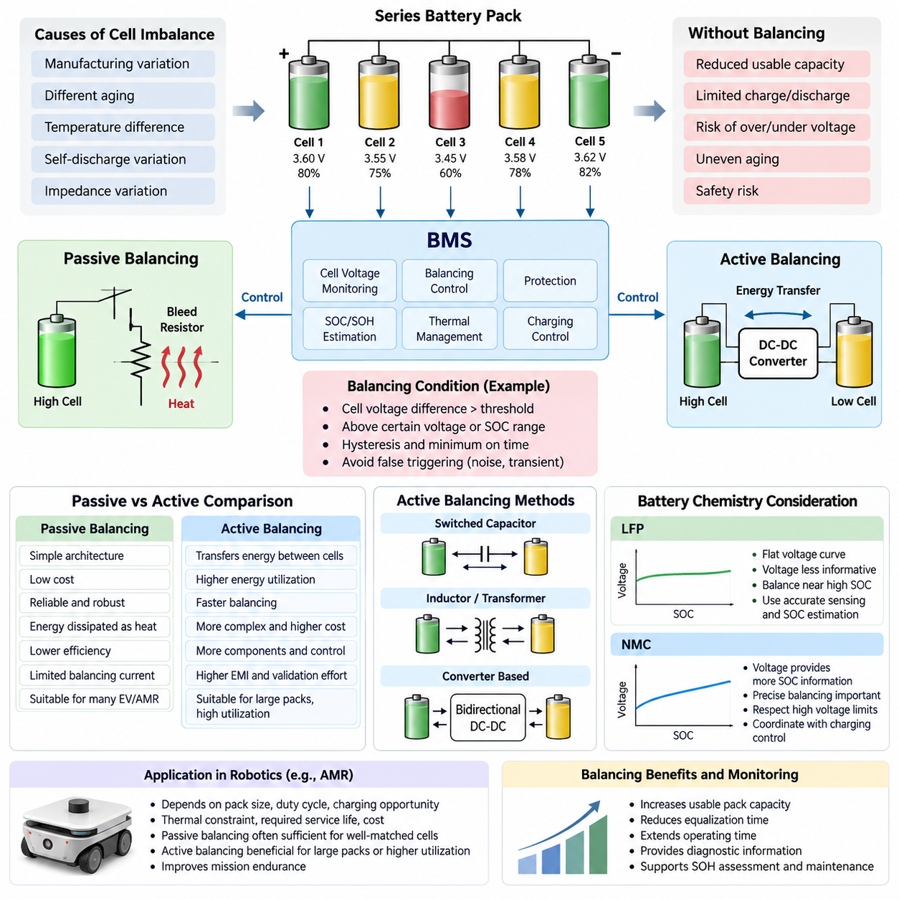
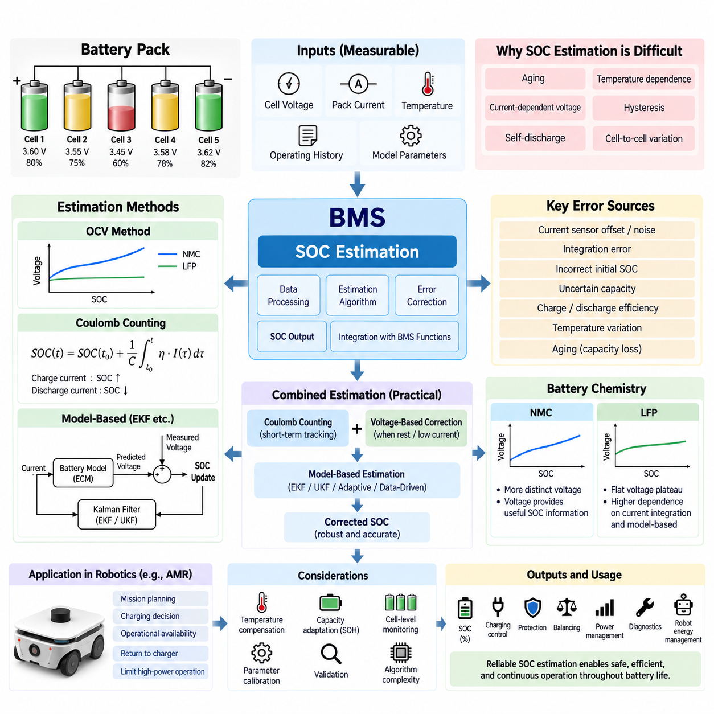
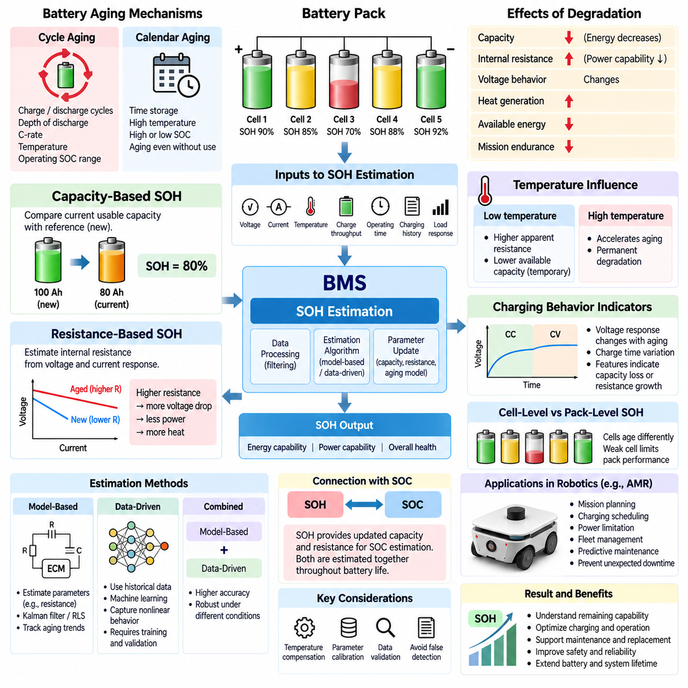
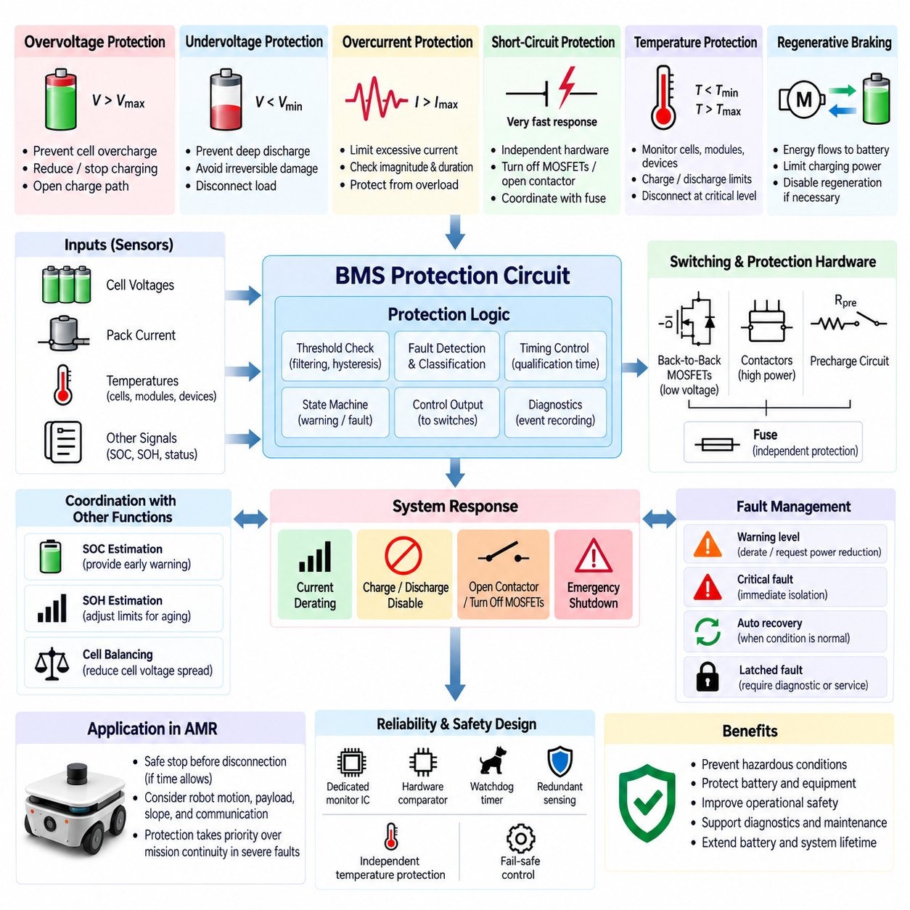
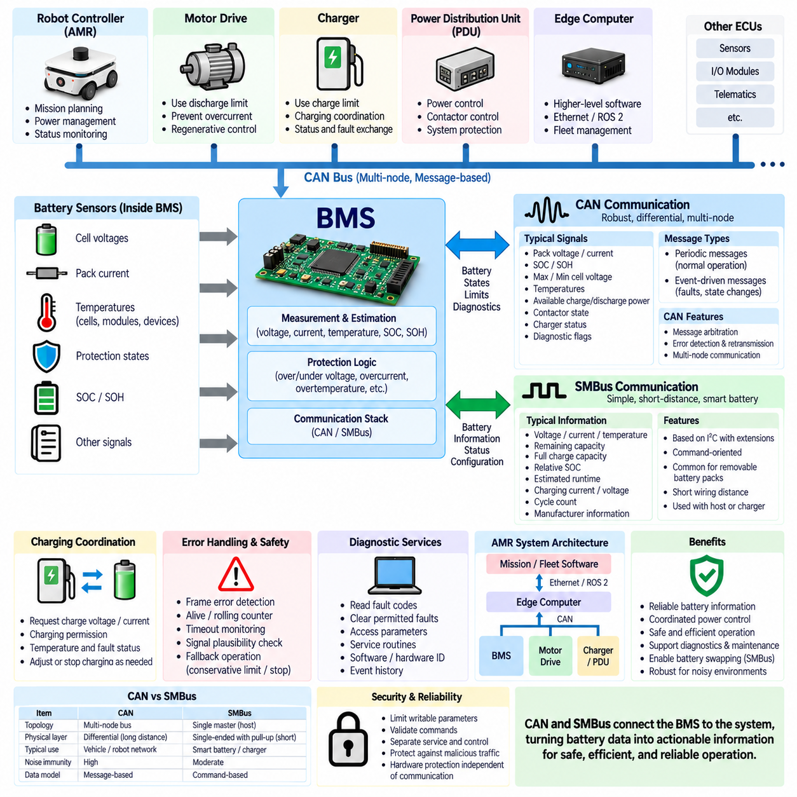

**Volume 11. Battery and Powertrain**


# Chapter 04. BMS Design

##  

## 04.01. Cell Balancing (Passive/Active)

{width="7.268055555555556in" height="7.268055555555556in"}

Cell balancing is a core function of a battery management system because cells connected in series rarely maintain exactly the same state of charge, capacity, internal resistance, and aging behavior. Small manufacturing variations and unequal thermal conditions gradually create voltage differences. Without balancing, the weakest or highest-voltage cell can determine the usable capacity and operating limits of the entire battery pack.

In a series-connected battery pack, the same charging and discharging current flows through every cell, but individual cell voltages do not necessarily change at identical rates. Differences in self-discharge, temperature, impedance, and usable capacity accumulate over repeated cycles. The BMS therefore monitors each cell voltage and applies balancing when the deviation exceeds predefined thresholds under suitable operating conditions.

Passive balancing reduces imbalance by removing energy from cells whose voltage or estimated state of charge is higher than that of neighboring cells. The most common implementation connects a resistor across each cell through a transistor or switching device controlled by the BMS. When balancing is activated, a small current bypasses the selected cell and converts excess electrical energy into heat until its voltage approaches the desired pack balance level.

The main advantage of passive balancing is architectural simplicity. Bleed resistors, switching devices, sensing circuits, and control logic can be implemented with relatively low component cost and modest circuit complexity. This makes passive balancing attractive for many industrial batteries, electric mobility systems, and AMRs where reliability, maintainability, predictable behavior, and economical BMS implementation are more important than recovering small amounts of balancing energy.

Passive balancing efficiency is inherently limited because the removed energy is dissipated rather than transferred to another cell. The balancing current is also constrained by resistor power rating, semiconductor temperature, PCB thermal design, and enclosure cooling capability. Increasing the current can shorten balancing time, but it increases heat generation according to electrical power dissipation and may create undesirable temperature gradients inside the BMS or battery module.

Balancing control must distinguish meaningful cell mismatch from normal voltage variation caused by current, temperature, and electrochemical dynamics. A BMS may enable passive balancing only above a specified cell voltage or state-of-charge region and when the difference between the highest and lowest cells exceeds a threshold. Hysteresis and minimum activation time are commonly used to prevent rapid switching caused by measurement noise or transient voltage recovery.

Active balancing transfers energy instead of intentionally dissipating it. Energy can be moved from a high-energy cell to a lower-energy cell, from individual cells to the complete pack, from the pack to selected cells, or between groups of cells. Depending on the architecture, active balancing circuits use capacitors, inductors, transformers, or bidirectional DC-DC converters to redistribute charge while preserving a larger portion of the stored electrical energy.

Switched-capacitor balancing periodically connects capacitors between cells so that charge moves according to voltage differences. Inductor-based and transformer-based circuits provide more controllable energy transfer and can support higher balancing power. Converter-based architectures offer even greater flexibility because energy flow can be actively regulated, although they require additional switching devices, magnetic components, sensing, gate control, and sophisticated protection mechanisms.

Active balancing can improve usable pack capacity when cell mismatch is significant because energy from stronger cells can support weaker cells instead of being discarded as heat. Higher balancing currents can also reduce equalization time, which becomes increasingly valuable in large-capacity battery packs. These benefits can extend effective operating time and reduce the degree to which a single mismatched cell restricts the charge or discharge capability of the complete system.

The additional capability of active balancing introduces engineering tradeoffs. Component count, PCB area, control complexity, electromagnetic interference, diagnostic requirements, conversion losses, and cost generally increase compared with passive systems. Fault analysis must also consider unintended energy transfer, failed switching devices, isolation problems, and thermal stress. Consequently, active balancing is justified when its improvements in energy utilization and balancing speed outweigh the added hardware and validation burden.

Battery chemistry strongly affects balancing strategy because the relationship between cell voltage and state of charge is chemistry dependent. LFP cells exhibit a particularly flat voltage curve over a broad SOC range, making voltage-only comparison less informative during much of normal operation. Balancing is therefore often concentrated near the upper charging region, while accurate sensing, temperature compensation, coulomb counting, and appropriate SOC estimation help prevent unnecessary balancing decisions.

For NMC batteries, cell voltage generally provides stronger SOC information across much of the operating range, but precise balancing remains important because high-voltage operation must respect strict cell limits. The BMS must coordinate balancing with charging control so that no individual cell exceeds its permitted voltage while the pack approaches full charge. Balancing logic must therefore operate as part of the broader protection, SOC estimation, thermal management, and charging strategy.

For robotic systems such as AMRs, the appropriate balancing architecture depends on pack capacity, duty cycle, charging opportunities, thermal constraints, required service life, and acceptable cost. Passive balancing is often sufficient when cells are well matched and periodic full charging is available. Active balancing becomes more attractive for large packs, demanding utilization targets, persistent imbalance, or applications where maximizing usable energy directly improves mission endurance.

A practical BMS should evaluate balancing performance over the battery lifetime rather than treating equal cell voltage as the only objective. Cell-voltage spread, balancing current, balancing duration, temperature rise, SOC deviation, capacity mismatch, and historical balancing activity provide useful diagnostic information. Persistent imbalance can indicate cell degradation or thermal asymmetry, allowing balancing data to contribute to state-of-health assessment and maintenance decisions.

Ultimately, cell balancing does not restore lost cell capacity or repair a degraded battery. Its purpose is to manage unavoidable differences so that series-connected cells operate within safe limits and the available pack energy can be used effectively. Passive balancing emphasizes simplicity and robustness, while active balancing emphasizes energy redistribution and higher balancing capability. Selecting between them requires a system-level evaluation of safety, efficiency, cost, thermal design, reliability, and mission requirements.

셀 밸런싱(Cell Balancing)은 직렬로 연결된 셀(Cell)들이 정확히 동일한 충전 상태(State of Charge, SOC), 용량(Capacity), 내부 저항(Internal Resistance), 열화 특성(Aging Behavior)을 유지하기 어렵기 때문에 배터리 관리 시스템(Battery Management System, BMS)의 핵심 기능이 된다. 제조 편차와 불균일한 열 조건으로 작은 전압 차이가 누적되며, 밸런싱이 없으면 가장 약하거나 전압이 높은 셀이 전체 배터리 팩(Battery Pack)의 사용 가능 용량과 운전 한계를 결정하게 된다.

직렬 연결된 배터리 팩(Battery Pack)에서는 모든 셀에 동일한 충·방전 전류가 흐르지만 개별 셀 전압이 반드시 같은 속도로 변화하는 것은 아니다. 자기 방전(Self-Discharge), 온도(Temperature), 임피던스(Impedance), 사용 가능 용량(Usable Capacity)의 차이는 반복적인 사이클을 통해 누적된다. 따라서 BMS는 각 셀 전압을 감시하고 적절한 운전 조건에서 편차가 사전에 정의된 임계값(Threshold)을 초과하면 밸런싱을 수행한다.

수동 밸런싱(Passive Balancing)은 전압 또는 추정 충전 상태(SOC)가 인접 셀보다 높은 셀에서 에너지를 제거하여 불균형을 감소시킨다. 가장 일반적인 구현 방식은 BMS가 제어하는 트랜지스터(Transistor) 또는 스위칭 소자(Switching Device)를 통해 각 셀에 저항(Resistor)을 병렬로 연결하는 것이다. 밸런싱이 활성화되면 작은 전류가 선택된 셀을 우회하여 흐르고, 초과 전기 에너지를 열로 변환하면서 해당 셀의 전압을 목표 밸런스 수준에 가깝게 낮춘다.

수동 밸런싱(Passive Balancing)의 주요 장점은 구조적 단순성(Architectural Simplicity)이다. 방전 저항(Bleed Resistor), 스위칭 소자, 센싱 회로(Sensing Circuit), 제어 로직(Control Logic)을 비교적 낮은 부품 비용과 제한된 회로 복잡도로 구현할 수 있다. 따라서 소량의 밸런싱 에너지를 회수하는 것보다 신뢰성(Reliability), 유지보수성(Maintainability), 예측 가능한 동작, 경제적인 BMS 구현이 중요한 산업용 배터리, 전기 모빌리티(Electric Mobility), 자율이동로봇(Autonomous Mobile Robot, AMR)에 적합하다.

수동 밸런싱의 효율(Efficiency)은 제거되는 에너지를 다른 셀로 전달하지 않고 소모하기 때문에 본질적으로 제한된다. 밸런싱 전류(Balancing Current)는 저항의 정격 전력(Power Rating), 반도체 온도, 인쇄회로기판(Printed Circuit Board, PCB)의 열 설계, 인클로저(Enclosure)의 냉각 능력에 의해 제한된다. 전류를 증가시키면 밸런싱 시간을 단축할 수 있지만 전력 소모에 따라 발열이 증가하며 BMS 또는 배터리 모듈 내부에 바람직하지 않은 온도 구배(Temperature Gradient)를 발생시킬 수 있다.

밸런싱 제어(Balancing Control)는 의미 있는 셀 불균형과 전류, 온도, 전기화학적 동특성(Electrochemical Dynamics)에 의해 발생하는 정상적인 전압 변화를 구분해야 한다. BMS는 지정된 셀 전압 또는 충전 상태 영역 이상에서 최고 셀과 최저 셀 사이의 차이가 임계값을 초과할 때만 수동 밸런싱을 활성화할 수 있다. 측정 노이즈(Measurement Noise)나 일시적인 전압 회복으로 인한 빈번한 스위칭을 방지하기 위해 히스테리시스(Hysteresis)와 최소 활성화 시간(Minimum Activation Time)이 일반적으로 사용된다.

능동 밸런싱(Active Balancing)은 에너지를 의도적으로 소모하는 대신 셀 사이에서 전달한다. 에너지는 높은 에너지를 가진 셀에서 낮은 에너지를 가진 셀로, 개별 셀에서 전체 팩으로, 전체 팩에서 특정 셀로 또는 셀 그룹 사이에서 이동할 수 있다. 구조에 따라 능동 밸런싱 회로는 커패시터(Capacitor), 인덕터(Inductor), 변압기(Transformer), 양방향 DC-DC 컨버터(Bidirectional DC-DC Converter)를 사용하여 저장된 전기 에너지의 상당 부분을 보존하면서 전하를 재분배한다.

스위치드 커패시터 밸런싱(Switched-Capacitor Balancing)은 커패시터를 셀 사이에 주기적으로 연결하여 전압 차이에 따라 전하가 이동하도록 한다. 인덕터 기반(Inductor-Based) 및 변압기 기반(Transformer-Based) 회로는 보다 제어 가능한 에너지 전달과 높은 밸런싱 전력을 제공할 수 있다. 컨버터 기반 구조(Converter-Based Architecture)는 에너지 흐름을 능동적으로 조절할 수 있어 더욱 높은 유연성을 제공하지만 추가적인 스위칭 소자, 자기 소자(Magnetic Component), 센싱, 게이트 제어(Gate Control), 정교한 보호 메커니즘(Protection Mechanism)이 필요하다.

능동 밸런싱은 강한 셀의 에너지를 열로 버리지 않고 약한 셀을 지원하는 데 활용할 수 있기 때문에 셀 불균형이 큰 경우 배터리 팩의 사용 가능 용량(Usable Pack Capacity)을 향상시킬 수 있다. 높은 밸런싱 전류는 균등화 시간(Equalization Time)도 단축할 수 있으며, 이러한 특성은 대용량 배터리 팩에서 더욱 중요해진다. 결과적으로 유효 운전 시간을 연장하고 하나의 불균형한 셀이 전체 시스템의 충전 또는 방전 능력을 제한하는 정도를 줄일 수 있다.

능동 밸런싱의 추가적인 기능은 여러 엔지니어링 트레이드오프(Engineering Tradeoff)를 발생시킨다. 수동 시스템과 비교하면 일반적으로 부품 수, PCB 면적, 제어 복잡도, 전자기 간섭(Electromagnetic Interference, EMI), 진단 요구사항(Diagnostic Requirements), 변환 손실(Conversion Loss), 비용이 증가한다. 고장 분석(Fault Analysis)에서도 의도하지 않은 에너지 전달, 스위칭 소자 고장, 절연 문제(Isolation Problem), 열 스트레스(Thermal Stress)를 고려해야 한다. 따라서 에너지 활용도와 밸런싱 속도의 개선 효과가 추가 하드웨어 및 검증 부담보다 클 때 능동 밸런싱을 적용하는 것이 적절하다.

배터리 화학계(Battery Chemistry)는 셀 전압과 충전 상태의 관계가 화학계마다 다르기 때문에 밸런싱 전략에 큰 영향을 준다. 리튬인산철(Lithium Iron Phosphate, LFP) 셀은 넓은 SOC 영역에서 특히 평탄한 전압 곡선(Flat Voltage Curve)을 가지므로 정상 운전 영역의 상당 부분에서 전압만을 이용한 비교는 제한적인 정보를 제공한다. 따라서 밸런싱은 주로 높은 충전 영역에서 수행되며, 정확한 센싱, 온도 보상(Temperature Compensation), 쿨롱 카운팅(Coulomb Counting), 적절한 SOC 추정을 통해 불필요한 밸런싱 판단을 방지할 수 있다.

니켈망간코발트(Nickel Manganese Cobalt, NMC) 배터리는 일반적으로 운전 범위의 상당 부분에서 셀 전압이 SOC에 대해 더 많은 정보를 제공하지만 높은 전압 영역에서는 엄격한 셀 한계를 준수해야 하므로 정밀한 밸런싱이 여전히 중요하다. BMS는 배터리 팩이 완전 충전에 접근하는 동안 어떤 개별 셀도 허용 전압을 초과하지 않도록 밸런싱과 충전 제어(Charging Control)를 조정해야 한다. 따라서 밸런싱 로직은 보호(Protection), SOC 추정, 열 관리(Thermal Management), 충전 전략(Charging Strategy)을 포함하는 전체 BMS 기능의 일부로 동작해야 한다.

자율이동로봇(AMR)과 같은 로봇 시스템에서 적절한 밸런싱 구조는 배터리 팩 용량, 듀티 사이클(Duty Cycle), 충전 기회(Charging Opportunity), 열적 제약(Thermal Constraint), 요구 수명(Service Life), 허용 비용에 따라 결정된다. 셀 특성이 잘 일치하고 주기적인 완전 충전이 가능한 경우 수동 밸런싱으로 충분한 경우가 많다. 대용량 팩, 높은 에너지 활용 목표, 지속적인 셀 불균형 또는 사용 가능 에너지 극대화가 임무 지속시간(Mission Endurance)을 직접적으로 향상시키는 응용에서는 능동 밸런싱이 더욱 매력적인 선택이 된다.

실용적인 BMS는 단순히 셀 전압을 동일하게 만드는 것만을 목표로 하지 않고 배터리 전체 수명 동안의 밸런싱 성능을 평가해야 한다. 셀 전압 편차(Cell-Voltage Spread), 밸런싱 전류, 밸런싱 지속시간, 온도 상승(Temperature Rise), SOC 편차, 용량 불일치(Capacity Mismatch), 과거 밸런싱 활동 기록은 유용한 진단 정보를 제공한다. 지속적인 불균형은 셀 열화(Cell Degradation) 또는 열적 비대칭(Thermal Asymmetry)을 나타낼 수 있으므로 밸런싱 데이터는 건강 상태(State of Health, SOH) 평가와 유지보수 판단에도 활용될 수 있다.

궁극적으로 셀 밸런싱(Cell Balancing)은 손실된 셀 용량을 복원하거나 열화된 배터리를 수리하는 기술이 아니다. 그 목적은 직렬 연결된 셀 사이에서 불가피하게 발생하는 차이를 관리하여 모든 셀이 안전한 한계 내에서 동작하고 배터리 팩의 가용 에너지를 효과적으로 사용할 수 있도록 하는 것이다. 수동 밸런싱은 단순성과 견고성(Robustness)을 중시하고, 능동 밸런싱은 에너지 재분배(Energy Redistribution)와 높은 밸런싱 능력을 중시한다. 두 방식의 선택은 안전성, 효율, 비용, 열 설계, 신뢰성, 임무 요구사항(Mission Requirements)을 포함하는 시스템 수준의 평가를 통해 이루어져야 한다.

##  

## 04.02. SOC Estimation Algorithm

{width="7.268055555555556in" height="7.268055555555556in"}

State of Charge (SOC) represents the amount of usable electrical charge remaining in a battery relative to its available capacity and is one of the most important quantities estimated by a Battery Management System (BMS). Unlike voltage or current, SOC cannot normally be measured directly by a sensor. The BMS must therefore estimate it from measurable variables such as cell voltage, pack current, temperature, operating history, and battery model parameters.

SOC is commonly expressed as a percentage, where 100% represents a fully charged condition and 0% represents the defined lower usable charge limit. Although this definition appears simple, practical estimation is complicated by battery aging, temperature dependence, current-dependent voltage behavior, hysteresis, self-discharge, and differences among individual cells. Consequently, SOC should be regarded as an estimated internal battery state rather than a directly observable physical quantity.

One of the simplest estimation approaches is the Open Circuit Voltage (OCV) method. After a battery has remained at rest long enough for transient electrochemical effects to decay, its terminal voltage can be compared with a predefined OCV-SOC relationship. This technique can provide an absolute SOC reference, but it is difficult to apply continuously because robotic and mobility batteries frequently operate under load and may not remain at rest for sufficient time.

The usefulness of OCV-based estimation depends strongly on battery chemistry. NMC cells generally exhibit a more distinguishable voltage change across their SOC range, allowing voltage to provide meaningful state information. LFP cells have a much flatter voltage plateau through a large portion of their operating range, so small voltage measurement errors can correspond to substantial SOC uncertainty. Accurate LFP SOC estimation therefore requires greater dependence on current integration and model-based correction.

Coulomb counting estimates SOC by integrating battery current over time. Charging current increases the estimated stored charge while discharge current decreases it, with the calculation referenced to the estimated usable battery capacity. This method responds well during dynamic operation and is widely used in BMS implementations because current is continuously measurable while a robot, vehicle, or other electrical system is operating.

The principal weakness of coulomb counting is accumulated error. Current sensor offset, measurement noise, integration error, inaccurate initial SOC, uncertain capacity, and charging or discharging efficiency can gradually cause the calculated SOC to drift away from the actual battery state. Even a small persistent current measurement bias can become significant over long operating periods. Coulomb counting therefore requires periodic correction or synchronization using additional battery information.

A practical SOC estimator commonly combines coulomb counting with voltage-based correction. Current integration provides short-term tracking during operation, while OCV information can correct accumulated drift when the battery enters suitable low-current or rest conditions. The BMS may recognize these conditions automatically and gradually adjust the estimated SOC rather than applying an abrupt correction that could produce unrealistic changes in the reported battery state.

Model-based SOC estimation improves accuracy by representing the battery through an electrical or electrochemical model. Equivalent Circuit Models (ECMs) commonly describe the battery using an OCV source together with resistive and capacitive elements that reproduce internal resistance and transient polarization behavior. Measured current is applied to the model, and the predicted terminal voltage is compared with actual voltage to determine whether the internal SOC estimate requires correction.

The Extended Kalman Filter (EKF) is widely associated with model-based battery state estimation. It predicts the battery state using a mathematical model and then corrects that prediction using the difference between predicted and measured voltage. By repeatedly performing prediction and correction, the EKF can combine current, voltage, model parameters, and measurement uncertainty while reducing sensitivity to noise and accumulated coulomb-counting error.

Other estimation approaches can include the Unscented Kalman Filter (UKF), adaptive observers, particle filters, and data-driven algorithms. These methods may better represent nonlinear battery behavior or uncertain operating conditions, but they can require additional computation, parameter identification, training data, or calibration effort. Algorithm complexity should therefore be selected according to required SOC accuracy, available processing resources, battery characteristics, and system safety requirements.

Temperature must be incorporated into SOC estimation because battery voltage, internal resistance, charge acceptance, and available capacity vary with temperature. A battery operating at low temperature can temporarily deliver less usable energy even when substantial chemical charge remains. The BMS should therefore distinguish electrochemical SOC from immediately available energy and use temperature-dependent parameters or compensation maps when predicting practical operating capability.

Battery aging creates another major source of SOC estimation error. Coulomb counting based on the nominal capacity of a new battery becomes inaccurate as usable capacity decreases with cycle aging and calendar aging. SOC estimation should therefore interact with State of Health (SOH) estimation so that the capacity used by the SOC algorithm reflects the actual condition of the battery. Capacity adaptation allows the SOC scale to remain meaningful throughout battery life.

Cell-level behavior is also important because a series battery pack does not operate as a perfectly uniform energy reservoir. Individual cells can have different capacities, resistances, temperatures, and SOC values. Pack-level SOC may describe the average battery condition, but the lowest-SOC cell can determine the practical discharge limit while the highest-SOC cell can determine the charging limit. The BMS must therefore coordinate SOC estimation with cell-voltage monitoring and balancing functions.

For an AMR, SOC estimation directly influences mission planning, charging decisions, and operational availability. The robot may use SOC to determine whether sufficient energy remains to complete a mission, return to a charging station, perform opportunity charging, or temporarily restrict high-power operation. An inaccurate optimistic SOC estimate can cause mission interruption, whereas an excessively conservative estimate reduces usable operating time and fleet productivity.

Dynamic robotic loads make SOC estimation particularly challenging because acceleration, steering, payload movement, computing equipment, sensors, and auxiliary systems can produce rapidly changing battery currents. Regenerative braking can additionally reverse power flow and return energy to the battery. The estimator must correctly integrate bidirectional current while accounting for voltage transients and avoiding false SOC corrections caused by short-duration load or regenerative events.

A robust BMS therefore treats SOC estimation as a continuously corrected state-estimation process rather than a single calculation. Current integration, voltage information, temperature compensation, battery models, capacity adaptation, cell monitoring, and operating-history data can be combined according to system requirements. The resulting SOC estimate becomes a fundamental input to charging control, protection, balancing, power management, diagnostics, and robot-level energy management.

Ultimately, no SOC estimation algorithm can remain accurate without appropriate sensing, battery characterization, parameter calibration, and validation. Current sensor accuracy, cell-voltage measurement resolution, temperature sensing, OCV-SOC characterization, capacity identification, and model parameters directly affect estimation quality. Effective SOC estimation therefore requires coordinated design of battery hardware, BMS electronics, estimation software, calibration procedures, and system-level validation throughout the battery operating life.

충전 상태(State of Charge, SOC)는 배터리의 사용 가능한 용량 대비 현재 남아 있는 사용 가능 전하량을 나타내며, 배터리 관리 시스템(Battery Management System, BMS)이 추정하는 가장 중요한 상태량 중 하나이다. 전압이나 전류와 달리 SOC는 일반적으로 센서를 통해 직접 측정할 수 없다. 따라서 BMS는 셀 전압(Cell Voltage), 팩 전류(Pack Current), 온도(Temperature), 운전 이력(Operating History), 배터리 모델 파라미터(Battery Model Parameter)와 같이 측정 가능한 변수를 이용하여 SOC를 추정해야 한다.

SOC는 일반적으로 백분율(Percentage)로 표현되며, 100%는 완전히 충전된 상태를, 0%는 정의된 사용 가능 충전량의 하한을 의미한다. 이러한 정의는 단순해 보이지만 실제 추정 과정은 배터리 열화(Battery Aging), 온도 의존성(Temperature Dependence), 전류에 따른 전압 거동, 히스테리시스(Hysteresis), 자기 방전(Self-Discharge), 개별 셀 사이의 차이로 인해 복잡해진다. 따라서 SOC는 직접 관측할 수 있는 물리량이라기보다 추정된 배터리 내부 상태(Estimated Internal Battery State)로 이해해야 한다.

가장 간단한 추정 방법 중 하나는 개방 회로 전압(Open Circuit Voltage, OCV) 방식이다. 배터리가 충분한 시간 동안 휴지 상태를 유지하여 과도적인 전기화학적 효과가 감소한 후 단자 전압(Terminal Voltage)을 미리 정의된 OCV-SOC 관계와 비교할 수 있다. 이 방법은 절대적인 SOC 기준을 제공할 수 있지만, 로봇 및 모빌리티 배터리는 부하 상태에서 빈번하게 동작하며 충분한 휴지 시간을 확보하기 어려우므로 연속적으로 적용하기에는 한계가 있다.

OCV 기반 추정의 유용성은 배터리 화학계(Battery Chemistry)에 크게 좌우된다. 니켈망간코발트(Nickel Manganese Cobalt, NMC) 셀은 일반적으로 SOC 범위에 따라 비교적 명확한 전압 변화를 나타내므로 전압으로부터 의미 있는 상태 정보를 얻을 수 있다. 리튬인산철(Lithium Iron Phosphate, LFP) 셀은 운전 범위의 상당 부분에서 훨씬 평탄한 전압 구간을 가지므로 작은 전압 측정 오차가 큰 SOC 불확실성으로 이어질 수 있다. 따라서 정확한 LFP SOC 추정에서는 전류 적분(Current Integration)과 모델 기반 보정(Model-Based Correction)에 대한 의존도가 높아진다.

쿨롱 카운팅(Coulomb Counting)은 시간에 따라 배터리 전류를 적분하여 SOC를 추정한다. 충전 전류는 추정된 저장 전하량을 증가시키고 방전 전류는 이를 감소시키며, 계산은 추정된 사용 가능 배터리 용량을 기준으로 수행된다. 이 방법은 동적 운전 중의 상태 변화에 효과적으로 대응할 수 있으며 로봇, 차량 또는 기타 전기 시스템이 동작하는 동안 전류를 지속적으로 측정할 수 있기 때문에 BMS에서 널리 사용된다.

쿨롱 카운팅의 주요 약점은 누적 오차(Accumulated Error)이다. 전류 센서 오프셋(Current Sensor Offset), 측정 노이즈(Measurement Noise), 적분 오차(Integration Error), 부정확한 초기 SOC, 불확실한 용량, 충·방전 효율 등의 영향으로 계산된 SOC가 실제 배터리 상태에서 점차 벗어날 수 있다. 작은 전류 측정 편향(Current Measurement Bias)도 장시간 지속되면 상당한 오차를 발생시킬 수 있다. 따라서 쿨롱 카운팅은 추가적인 배터리 정보를 이용한 주기적인 보정 또는 동기화(Synchronization)가 필요하다.

실용적인 SOC 추정기(SOC Estimator)는 일반적으로 쿨롱 카운팅과 전압 기반 보정(Voltage-Based Correction)을 결합한다. 전류 적분은 운전 중 단기적인 SOC 변화를 추적하고, 배터리가 적절한 저전류 또는 휴지 조건에 진입하면 OCV 정보를 이용하여 누적된 드리프트(Drift)를 보정할 수 있다. BMS는 이러한 조건을 자동으로 인식하고 보고되는 배터리 상태가 비현실적으로 급변하지 않도록 SOC 추정값을 점진적으로 조정할 수 있다.

모델 기반 SOC 추정(Model-Based SOC Estimation)은 전기적 또는 전기화학적 모델(Electrochemical Model)을 이용하여 배터리를 표현함으로써 정확도를 향상시킨다. 등가 회로 모델(Equivalent Circuit Model, ECM)은 일반적으로 OCV 전압원과 내부 저항 및 과도 분극 거동(Transient Polarization Behavior)을 나타내는 저항성·용량성 소자를 사용한다. 측정된 전류를 모델에 입력하고 예측된 단자 전압과 실제 전압을 비교하여 내부 SOC 추정값에 보정이 필요한지를 판단한다.

확장 칼만 필터(Extended Kalman Filter, EKF)는 모델 기반 배터리 상태 추정에 널리 사용되는 방법이다. 수학적 모델(Mathematical Model)을 이용하여 배터리 상태를 예측한 후 예측 전압과 측정 전압 사이의 차이를 이용하여 해당 예측값을 보정한다. 이러한 예측(Prediction)과 보정(Correction)을 반복함으로써 EKF는 전류, 전압, 모델 파라미터, 측정 불확실성(Measurement Uncertainty)을 통합하고 노이즈 및 누적된 쿨롱 카운팅 오차의 영향을 감소시킬 수 있다.

다른 추정 방법으로는 무향 칼만 필터(Unscented Kalman Filter, UKF), 적응형 관측기(Adaptive Observer), 파티클 필터(Particle Filter), 데이터 기반 알고리즘(Data-Driven Algorithm) 등이 있다. 이러한 방법은 비선형 배터리 거동이나 불확실한 운전 조건을 더욱 효과적으로 표현할 수 있지만 추가적인 연산 능력, 파라미터 식별(Parameter Identification), 학습 데이터(Training Data), 캘리브레이션(Calibration)이 필요할 수 있다. 따라서 알고리즘 복잡도는 요구되는 SOC 정확도, 사용 가능한 연산 자원, 배터리 특성, 시스템 안전 요구사항에 따라 결정해야 한다.

온도(Temperature)는 배터리 전압, 내부 저항(Internal Resistance), 충전 수용성(Charge Acceptance), 사용 가능 용량이 온도에 따라 변화하기 때문에 SOC 추정에 반드시 반영되어야 한다. 저온에서 동작하는 배터리는 상당한 화학적 전하가 남아 있더라도 일시적으로 제공할 수 있는 사용 가능 에너지가 감소할 수 있다. 따라서 BMS는 전기화학적 SOC와 즉시 사용할 수 있는 에너지를 구분하고 실제 운전 능력을 예측할 때 온도 의존 파라미터 또는 보상 맵(Compensation Map)을 사용해야 한다.

배터리 열화(Battery Aging)는 SOC 추정 오차를 발생시키는 또 다른 주요 원인이다. 새 배터리의 공칭 용량(Nominal Capacity)을 기준으로 수행되는 쿨롱 카운팅은 사이클 열화(Cycle Aging)와 캘린더 열화(Calendar Aging)에 의해 사용 가능 용량이 감소하면 부정확해진다. 따라서 SOC 추정은 건강 상태(State of Health, SOH) 추정과 연계되어 SOC 알고리즘에서 사용하는 용량이 실제 배터리 상태를 반영하도록 해야 한다. 용량 적응(Capacity Adaptation)을 적용하면 배터리 수명 전체에 걸쳐 SOC 척도의 의미를 유지할 수 있다.

셀 수준 거동(Cell-Level Behavior)도 중요하다. 직렬 연결된 배터리 팩은 완전히 균일한 하나의 에너지 저장 장치처럼 동작하지 않으며 개별 셀마다 용량, 저항, 온도, SOC가 다를 수 있다. 팩 수준 SOC(Pack-Level SOC)는 평균적인 배터리 상태를 나타낼 수 있지만 실제 방전 한계는 가장 낮은 SOC를 가진 셀이 결정하고 충전 한계는 가장 높은 SOC를 가진 셀이 결정할 수 있다. 따라서 BMS는 SOC 추정을 셀 전압 모니터링(Cell-Voltage Monitoring) 및 셀 밸런싱(Cell Balancing) 기능과 연계해야 한다.

자율이동로봇(Autonomous Mobile Robot, AMR)에서 SOC 추정은 임무 계획(Mission Planning), 충전 판단(Charging Decision), 운용 가용성(Operational Availability)에 직접적인 영향을 미친다. 로봇은 SOC를 이용하여 남아 있는 에너지로 임무를 완료할 수 있는지, 충전소로 복귀해야 하는지, 기회 충전(Opportunity Charging)을 수행해야 하는지 또는 일시적으로 고출력 운전을 제한해야 하는지를 판단할 수 있다. 지나치게 낙관적인 SOC 추정은 임무 중단을 초래할 수 있고, 지나치게 보수적인 추정은 사용 가능한 운전 시간과 플릿 생산성(Fleet Productivity)을 감소시킨다.

동적인 로봇 부하(Dynamic Robotic Load)는 SOC 추정을 특히 어렵게 만든다. 가속, 조향, 페이로드 이동, 컴퓨팅 장비, 센서, 보조 시스템은 빠르게 변화하는 배터리 전류를 발생시킬 수 있다. 회생 제동(Regenerative Braking)은 전력 흐름을 반전시켜 에너지를 배터리로 다시 전달할 수도 있다. 따라서 추정기는 양방향 전류(Bidirectional Current)를 정확하게 적분하면서 전압 과도 현상(Voltage Transient)을 고려하고 짧은 부하 변화 또는 회생 이벤트로 인한 잘못된 SOC 보정을 방지해야 한다.

강건한 BMS는 SOC 추정을 단일 계산이 아니라 지속적으로 보정되는 상태 추정 과정(Continuously Corrected State-Estimation Process)으로 취급한다. 시스템 요구사항에 따라 전류 적분, 전압 정보, 온도 보상, 배터리 모델, 용량 적응, 셀 모니터링, 운전 이력 데이터를 결합할 수 있다. 이렇게 생성된 SOC 추정값은 충전 제어(Charging Control), 보호(Protection), 밸런싱(Balancing), 전력 관리(Power Management), 진단(Diagnostics), 로봇 수준 에너지 관리(Robot-Level Energy Management)의 핵심 입력으로 사용된다.

궁극적으로 적절한 센싱(Sensing), 배터리 특성화(Battery Characterization), 파라미터 캘리브레이션(Parameter Calibration), 검증(Validation) 없이는 어떠한 SOC 추정 알고리즘도 정확도를 지속적으로 유지할 수 없다. 전류 센서 정확도, 셀 전압 측정 분해능(Cell-Voltage Measurement Resolution), 온도 센싱, OCV-SOC 특성화, 용량 식별(Capacity Identification), 모델 파라미터는 추정 품질에 직접적인 영향을 미친다. 따라서 효과적인 SOC 추정은 배터리 하드웨어, BMS 전자회로, 추정 소프트웨어, 캘리브레이션 절차, 시스템 수준 검증(System-Level Validation)을 배터리 전체 운용 수명에 걸쳐 통합적으로 설계해야 한다.

##  

## 04.03. SOH Estimation Algorithm

{width="7.268055555555556in" height="7.268055555555556in"}

State of Health (SOH) describes the condition of a battery relative to an appropriate reference state, typically the performance available when the battery was new. Unlike State of Charge (SOC), which changes continuously during normal charging and discharging, SOH evolves slowly as the battery ages. A Battery Management System (BMS) estimates SOH to determine how much useful capability has been lost and how reliably the battery can continue operating.

SOH cannot normally be measured directly by a single sensor because battery degradation appears through several interacting characteristics. Capacity decreases, internal resistance increases, power capability changes, and electrochemical behavior gradually deviates from the initial condition. The BMS must therefore infer SOH from measurable quantities such as voltage, current, temperature, charge throughput, operating time, charging history, and responses to controlled or naturally occurring load conditions.

Capacity-based SOH is one of the most intuitive definitions. It compares the battery\'s currently available capacity with a reference capacity, commonly the usable capacity measured or estimated when the battery was new. If a battery originally provided 100 Ah but can now deliver only 80 Ah under equivalent conditions, its capacity-based SOH is approximately 80%. This representation directly indicates the reduction in available energy storage capability.

Accurate capacity estimation requires observing sufficient charge or discharge operation between recognizable SOC reference points. The BMS can integrate measured current through coulomb counting and determine how much charge was transferred across a known SOC interval. Partial cycles complicate this process because robots and vehicles frequently use opportunity charging and may rarely complete full charge-discharge cycles. Capacity estimation must therefore accumulate useful information over multiple operating events.

Resistance-based SOH provides another important indication of degradation. As cells age, their internal resistance generally increases because of electrochemical and structural changes. The BMS can estimate resistance by observing the relationship between changes in terminal voltage and current during suitable load transitions. Increasing resistance causes greater voltage drop during discharge, greater voltage rise during charging, additional heat generation, and reduced ability to deliver high power.

Capacity loss and resistance increase describe different aspects of battery health and should not automatically be treated as equivalent. A battery may retain substantial energy capacity while its power capability has deteriorated because resistance has increased. Conversely, capacity may decline while resistance remains acceptable for moderate loads. A robust SOH estimator can therefore maintain separate indicators for energy capability, power capability, and overall battery usability.

Battery aging is commonly divided into cycle aging and calendar aging. Cycle aging results from repeated charging and discharging and depends on factors such as charge throughput, depth of discharge, C-rate, temperature, and operating SOC range. Calendar aging occurs even when the battery is not actively cycled and is influenced strongly by storage time, temperature, and SOC. Practical SOH estimation should account for both mechanisms because robotic batteries experience combinations of active operation and idle storage.

Temperature has a major influence on both degradation and SOH measurement. Low temperature can temporarily increase apparent resistance and reduce available capacity without representing permanent degradation, while sustained high temperature can accelerate irreversible aging. An estimator must therefore distinguish reversible temperature-dependent performance changes from long-term health deterioration. Temperature compensation and measurements obtained under comparable operating conditions improve the consistency of SOH evaluation.

Historical operating data provides valuable information for estimating gradual battery degradation. The BMS can record accumulated ampere-hour throughput, energy throughput, equivalent full cycles, time spent at high or low SOC, maximum and minimum temperatures, high-current events, charging behavior, and balancing activity. These variables form a battery usage history that can support empirical aging models and help explain why batteries with the same chronological age exhibit different health conditions.

Model-based SOH estimation uses mathematical representations of battery behavior to identify parameters that change with aging. An Equivalent Circuit Model (ECM), for example, can estimate internal resistance and polarization-related parameters from measured current and voltage. Parameter trends observed over long periods can then be associated with degradation. Recursive estimation methods can continuously update these parameters while the battery operates instead of requiring dedicated laboratory measurements.

Kalman-filter-based techniques, adaptive observers, Recursive Least Squares (RLS), and related estimation methods can be used to track aging-sensitive parameters. These algorithms compare predicted battery behavior with measured responses and progressively update internal estimates. Their effectiveness depends on model accuracy, sufficient excitation in the operating data, measurement quality, and appropriate parameter initialization. Poorly observable operating conditions can make some health parameters difficult to identify reliably.

Data-driven SOH estimation provides another approach by learning relationships between measurable battery behavior and degradation. Machine-learning models can use features derived from voltage curves, current profiles, temperature, charging time, resistance, and historical usage. Such methods can capture complex nonlinear relationships, but their accuracy depends strongly on representative training data and validation across cell production variation, operating environments, aging paths, and battery chemistries.

Charging behavior can provide useful health indicators because aging changes the voltage response and the time required for different portions of the charging process. Features extracted from constant-current and constant-voltage charging stages may correlate with capacity loss or resistance growth. This approach can be attractive when robots return regularly to controlled charging stations because charging events provide repeatable operating conditions from which health information can be extracted.

Cell-level SOH monitoring is important in series-connected battery packs because cells do not necessarily age uniformly. Differences in temperature, manufacturing characteristics, current distribution, and balancing history can cause one cell to degrade faster than others. A pack-level average can conceal this weak cell even though it may determine the practical charge, discharge, and power limits. The BMS should therefore monitor cell-level indicators and identify abnormal divergence.

SOH estimation and SOC estimation are closely connected. SOC calculations require an estimate of usable battery capacity, but that capacity decreases as SOH deteriorates. If the BMS continues using the original nominal capacity, SOC calculated through coulomb counting can become increasingly inaccurate. Updated SOH information should therefore adapt the capacity and resistance parameters used by the SOC estimator, creating coordinated state estimation throughout battery life.

For an Autonomous Mobile Robot (AMR), SOH affects more than maintenance scheduling. Reduced capacity shortens mission endurance, while increased resistance can limit acceleration, climbing capability, payload handling, and peak power delivery. Fleet management can use SOH information to assign demanding missions to healthier batteries, schedule charging appropriately, predict replacement requirements, and prevent unexpected loss of availability during operational tasks.

A practical BMS should evaluate SOH as a long-term trend rather than reacting strongly to individual measurements. Temporary temperature changes, unusual loads, incomplete charging, sensor noise, and voltage relaxation can distort short-term indicators. Filtering, confidence evaluation, parameter plausibility checks, and historical comparison help prevent false degradation detection. Significant SOH changes should normally be supported by repeated evidence collected across suitable operating conditions.

Ultimately, SOH estimation combines sensing, battery characterization, aging models, parameter identification, historical data, and continuous validation. Capacity retention and resistance growth remain fundamental health indicators, but reliable estimation requires interpreting them within temperature, SOC, usage, and cell-level context. A well-designed BMS converts these observations into actionable health information for SOC correction, power limitation, diagnostics, predictive maintenance, mission planning, and safe battery replacement.

건강 상태(State of Health, SOH)는 일반적으로 배터리가 새것이었을 때 제공할 수 있었던 성능을 기준으로 현재 배터리의 상태를 나타낸다. 정상적인 충전과 방전 과정에서 지속적으로 변화하는 충전 상태(State of Charge, SOC)와 달리 SOH는 배터리가 열화됨에 따라 장기간에 걸쳐 서서히 변화한다. 배터리 관리 시스템(Battery Management System, BMS)은 SOH를 추정하여 유용한 성능이 얼마나 감소했는지와 배터리가 얼마나 신뢰성 있게 계속 동작할 수 있는지를 판단한다.

SOH는 배터리 열화(Battery Degradation)가 여러 상호작용하는 특성을 통해 나타나기 때문에 일반적으로 하나의 센서로 직접 측정할 수 없다. 용량(Capacity)은 감소하고 내부 저항(Internal Resistance)은 증가하며 출력 성능(Power Capability)이 변화하고 전기화학적 거동(Electrochemical Behavior)은 초기 상태에서 점차 벗어난다. 따라서 BMS는 전압, 전류, 온도, 누적 충·방전량(Charge Throughput), 운전 시간, 충전 이력, 제어되거나 자연적으로 발생하는 부하 조건에 대한 응답과 같은 측정 가능한 정보를 이용하여 SOH를 추론해야 한다.

용량 기반 SOH(Capacity-Based SOH)는 가장 직관적인 정의 중 하나이다. 현재 사용 가능한 배터리 용량을 일반적으로 새 배터리에서 측정하거나 추정한 사용 가능 용량인 기준 용량(Reference Capacity)과 비교한다. 배터리가 처음에는 100 Ah를 제공했지만 동일한 조건에서 현재 80 Ah만 제공할 수 있다면 용량 기반 SOH는 약 80%이다. 이러한 표현은 사용 가능한 에너지 저장 능력(Energy Storage Capability)의 감소를 직접적으로 나타낸다.

정확한 용량 추정(Capacity Estimation)을 위해서는 식별 가능한 SOC 기준점 사이에서 충분한 충전 또는 방전 동작을 관찰해야 한다. BMS는 쿨롱 카운팅(Coulomb Counting)을 통해 측정된 전류를 적분하고 알려진 SOC 구간에서 얼마나 많은 전하가 이동했는지를 계산할 수 있다. 로봇과 차량은 기회 충전(Opportunity Charging)을 빈번하게 사용하고 완전한 충·방전 사이클을 거의 수행하지 않을 수 있기 때문에 부분 사이클(Partial Cycle)은 이러한 과정을 복잡하게 만든다. 따라서 용량 추정은 여러 운전 이벤트에 걸쳐 유용한 정보를 누적해야 한다.

저항 기반 SOH(Resistance-Based SOH)는 배터리 열화를 나타내는 또 다른 중요한 지표이다. 셀이 노화되면 전기화학적·구조적 변화로 인해 일반적으로 내부 저항이 증가한다. BMS는 적절한 부하 변화가 발생할 때 단자 전압(Terminal Voltage) 변화와 전류 변화 사이의 관계를 관찰하여 저항을 추정할 수 있다. 저항 증가는 방전 중 더 큰 전압 강하, 충전 중 더 큰 전압 상승, 추가적인 발열, 고출력 공급 능력의 감소를 발생시킨다.

용량 감소(Capacity Loss)와 저항 증가(Resistance Increase)는 서로 다른 배터리 건강 특성을 나타내므로 자동적으로 동일한 것으로 취급해서는 안 된다. 배터리가 상당한 에너지 용량을 유지하면서도 내부 저항 증가로 인해 출력 성능이 저하될 수 있다. 반대로 용량이 감소하더라도 중간 수준의 부하에서는 저항 특성이 허용 가능한 수준일 수 있다. 따라서 강건한 SOH 추정기(SOH Estimator)는 에너지 성능(Energy Capability), 출력 성능(Power Capability), 전체 배터리 사용성(Battery Usability)에 대한 지표를 별도로 관리할 수 있다.

배터리 노화(Battery Aging)는 일반적으로 사이클 노화(Cycle Aging)와 캘린더 노화(Calendar Aging)로 구분된다. 사이클 노화는 반복적인 충전과 방전으로 발생하며 누적 충·방전량, 방전 깊이(Depth of Discharge), C-레이트(C-Rate), 온도, 운전 SOC 범위 등의 영향을 받는다. 캘린더 노화는 배터리가 실제로 사이클링되지 않는 동안에도 발생하며 보관 시간, 온도, SOC의 영향을 크게 받는다. 실제 SOH 추정에서는 로봇 배터리가 능동 운전과 유휴 보관을 함께 경험하므로 두 가지 열화 메커니즘을 모두 고려해야 한다.

온도(Temperature)는 배터리 열화와 SOH 측정 모두에 큰 영향을 미친다. 저온은 영구적인 열화를 의미하지 않더라도 일시적으로 겉보기 저항(Apparent Resistance)을 증가시키고 사용 가능 용량을 감소시킬 수 있으며, 지속적인 고온은 비가역적 노화(Irreversible Aging)를 가속할 수 있다. 따라서 추정기는 가역적인 온도 의존 성능 변화와 장기적인 건강 상태 저하를 구분해야 한다. 온도 보상(Temperature Compensation)과 유사한 운전 조건에서 획득한 측정값을 이용하면 SOH 평가의 일관성을 향상시킬 수 있다.

과거 운전 데이터(Historical Operating Data)는 점진적인 배터리 열화를 추정하는 데 유용한 정보를 제공한다. BMS는 누적 암페어시 처리량(Ampere-Hour Throughput), 에너지 처리량(Energy Throughput), 등가 완전 사이클(Equivalent Full Cycle), 높은 또는 낮은 SOC에서의 체류 시간, 최고·최저 온도, 고전류 이벤트, 충전 거동, 밸런싱 활동(Balancing Activity)을 기록할 수 있다. 이러한 변수들은 배터리 사용 이력(Battery Usage History)을 구성하여 경험적 노화 모델(Empirical Aging Model)을 지원하고 동일한 사용 기간의 배터리들이 서로 다른 건강 상태를 나타내는 이유를 설명하는 데 활용될 수 있다.

모델 기반 SOH 추정(Model-Based SOH Estimation)은 배터리 거동의 수학적 표현을 이용하여 노화에 따라 변화하는 파라미터를 식별한다. 예를 들어 등가 회로 모델(Equivalent Circuit Model, ECM)은 측정된 전류와 전압으로부터 내부 저항과 분극 관련 파라미터(Polarization-Related Parameter)를 추정할 수 있다. 장기간 관찰된 파라미터 변화 추세를 열화와 연관시킬 수 있으며, 재귀적 추정 방법(Recursive Estimation Method)을 이용하면 별도의 실험실 측정 없이 배터리가 동작하는 동안 이러한 파라미터를 지속적으로 갱신할 수 있다.

칼만 필터 기반 기법(Kalman-Filter-Based Technique), 적응형 관측기(Adaptive Observer), 재귀 최소제곱법(Recursive Least Squares, RLS) 및 관련 추정 방법을 사용하여 노화에 민감한 파라미터를 추적할 수 있다. 이러한 알고리즘은 예측된 배터리 거동과 실제 측정 응답을 비교하고 내부 추정값을 점진적으로 갱신한다. 효과적인 적용을 위해서는 모델 정확도, 운전 데이터의 충분한 여기(Excitation), 측정 품질, 적절한 파라미터 초기화(Parameter Initialization)가 필요하며 관측 가능성이 낮은 운전 조건에서는 일부 건강 상태 파라미터를 신뢰성 있게 식별하기 어려울 수 있다.

데이터 기반 SOH 추정(Data-Driven SOH Estimation)은 측정 가능한 배터리 거동과 열화 사이의 관계를 학습하는 또 다른 접근 방법이다. 머신러닝 모델(Machine-Learning Model)은 전압 곡선, 전류 프로파일, 온도, 충전 시간, 저항, 과거 사용 이력에서 추출한 특징(Feature)을 사용할 수 있다. 이러한 방법은 복잡한 비선형 관계를 표현할 수 있지만 정확도는 대표성 있는 학습 데이터와 셀 제조 편차, 운전 환경, 열화 경로, 배터리 화학계에 대한 충분한 검증에 크게 의존한다.

충전 거동(Charging Behavior)은 노화에 따라 전압 응답과 충전 과정의 각 구간에 필요한 시간이 변화하기 때문에 유용한 건강 상태 지표를 제공할 수 있다. 정전류(Constant Current, CC) 및 정전압(Constant Voltage, CV) 충전 단계에서 추출한 특징은 용량 감소 또는 저항 증가와 상관관계를 가질 수 있다. 로봇이 제어된 충전소로 정기적으로 복귀하는 경우 충전 이벤트가 반복 가능한 운전 조건을 제공하므로 이러한 방식으로 건강 상태 정보를 추출하는 것이 효과적일 수 있다.

직렬 연결된 배터리 팩에서는 셀들이 반드시 균일하게 노화하지 않기 때문에 셀 수준 SOH 모니터링(Cell-Level SOH Monitoring)이 중요하다. 온도, 제조 특성, 전류 분포, 밸런싱 이력의 차이로 인해 특정 셀이 다른 셀보다 빠르게 열화될 수 있다. 팩 수준 평균값(Pack-Level Average)은 이러한 취약 셀(Weak Cell)을 숨길 수 있지만 실제로는 해당 셀이 충전, 방전, 출력 한계를 결정할 수 있다. 따라서 BMS는 셀 수준 지표를 감시하고 비정상적인 편차를 식별해야 한다.

SOH 추정과 SOC 추정은 밀접하게 연결되어 있다. SOC 계산에는 사용 가능한 배터리 용량의 추정값이 필요하지만 SOH가 저하되면서 해당 용량도 감소한다. BMS가 계속 초기 공칭 용량(Nominal Capacity)을 사용하면 쿨롱 카운팅으로 계산된 SOC는 점점 부정확해질 수 있다. 따라서 갱신된 SOH 정보를 이용하여 SOC 추정기가 사용하는 용량 및 저항 파라미터를 조정함으로써 배터리 전체 수명 동안 두 상태 추정을 연계해야 한다.

자율이동로봇(Autonomous Mobile Robot, AMR)에서 SOH는 단순한 유지보수 일정(Maintenance Scheduling) 이상의 영향을 미친다. 용량 감소는 임무 지속시간(Mission Endurance)을 단축시키고, 저항 증가는 가속, 경사 주행, 페이로드 처리, 최대 출력 공급 능력을 제한할 수 있다. 플릿 관리(Fleet Management)는 SOH 정보를 이용하여 건강한 배터리를 가진 로봇에 더 높은 부하의 임무를 할당하고, 충전을 적절하게 계획하며, 교체 시기를 예측하고, 운용 임무 중 예상하지 못한 가용성 저하를 방지할 수 있다.

실용적인 BMS는 개별 측정값에 과도하게 반응하기보다 SOH를 장기적인 추세(Long-Term Trend)로 평가해야 한다. 일시적인 온도 변화, 비정상적인 부하, 불완전한 충전, 센서 노이즈, 전압 완화(Voltage Relaxation)는 단기적인 지표를 왜곡할 수 있다. 필터링(Filtering), 신뢰도 평가(Confidence Evaluation), 파라미터 타당성 검사(Parameter Plausibility Check), 과거 데이터와의 비교를 통해 잘못된 열화 판단을 방지할 수 있다. 의미 있는 SOH 변화는 일반적으로 적절한 운전 조건에서 반복적으로 수집된 증거에 의해 뒷받침되어야 한다.

궁극적으로 SOH 추정은 센싱(Sensing), 배터리 특성화(Battery Characterization), 노화 모델(Aging Model), 파라미터 식별(Parameter Identification), 과거 데이터, 지속적인 검증(Continuous Validation)을 통합하는 과정이다. 용량 유지율(Capacity Retention)과 저항 증가(Resistance Growth)는 핵심적인 건강 상태 지표이지만 신뢰성 있는 추정을 위해서는 온도, SOC, 사용 이력, 셀 수준 상태를 함께 해석해야 한다. 잘 설계된 BMS는 이러한 관측 정보를 SOC 보정, 출력 제한(Power Limitation), 진단(Diagnostics), 예측 유지보수(Predictive Maintenance), 임무 계획(Mission Planning), 안전한 배터리 교체를 위한 실행 가능한 건강 상태 정보(Actionable Health Information)로 변환한다.

##  

## 04.04. BMS Protection Circuit

{width="7.268055555555556in" height="7.268055555555556in"}

A BMS protection circuit is the hardware and control layer that prevents a battery from operating outside its safe electrical and thermal limits. While estimation functions such as SOC and SOH describe battery condition, protection functions must detect hazardous conditions and take deterministic action. The protection architecture therefore combines cell monitoring, current sensing, temperature sensing, fault logic, switching devices, and independent safety mechanisms.

Overvoltage protection prevents individual cells from exceeding their permitted upper voltage during charging or regenerative energy recovery. Because cells in a series pack can have different SOC and capacity, the highest-voltage cell may reach its limit before the overall pack appears fully charged. The BMS continuously compares each measured cell voltage with calibrated thresholds and can reduce charging current, disable charging, or open the charging path when necessary.

Undervoltage protection prevents excessive cell discharge that could cause irreversible degradation or unstable battery behavior. During high load, the weakest cell may reach the minimum allowable voltage before other cells, particularly when capacity imbalance or increased internal resistance exists. Protection logic typically includes voltage thresholds, filtering, and time delays so that temporary voltage sag can be distinguished from a sustained undervoltage condition requiring shutdown.

Overcurrent protection limits excessive current during charging and discharging. Abnormal current can result from an overloaded motor, stalled actuator, inverter fault, wiring fault, short circuit, or defective external equipment. The BMS measures current using a shunt resistor, Hall-effect sensor, or another current-sensing device and evaluates both current magnitude and duration because allowable current generally decreases as the duration of the overload increases.

Short-circuit protection must respond much faster than normal overload protection because fault current can rise rapidly and generate severe thermal and electrical stress. Hardware comparators or dedicated protection integrated circuits may therefore operate independently of the main BMS processor. Depending on pack voltage and architecture, the protection response can turn off power MOSFETs, command contactors to open, or rely on coordinated fuses as a final interruption mechanism.

Temperature protection prevents operation outside the allowable thermal range of the cells and power electronics. Temperature sensors are typically distributed across representative cells, modules, busbars, switching devices, and other thermally critical locations. The BMS can restrict charging or discharging as temperatures approach warning limits and disconnect the battery when critical thresholds are exceeded, reducing the risk of accelerated degradation or thermal failure.

Charging and discharging temperature limits are not necessarily identical. Lithium-ion cells may tolerate discharge at temperatures where charging should already be prohibited or significantly reduced. The protection strategy must therefore evaluate temperature together with operating direction and current demand. Temperature-dependent current limits can provide gradual derating before a hard shutdown threshold is reached, improving both battery availability and protection effectiveness.

The main battery current path can be controlled using back-to-back MOSFETs in lower-voltage systems or contactors in higher-power battery packs. Separate charge and discharge control allows the BMS to prohibit one direction of current while permitting the other. For example, discharge may remain available after a charging overvoltage fault, while charging may remain possible after a low-SOC discharge cutoff when conditions permit safe recovery.

Contactor-based battery systems require additional supervision because a contactor itself can fail. The BMS can monitor pack-side and load-side voltages to determine whether commanded contactor states match actual electrical behavior. A welded contactor may prevent isolation, while a contactor that fails to close can interrupt normal operation. Auxiliary contacts, voltage feedback, and diagnostic logic can therefore be combined to detect switching-path faults.

Precharge protection is important when a battery connects to equipment containing large DC-link capacitors, such as motor inverters and high-power converters. Direct connection can produce a large inrush current that damages contactors, connectors, or capacitors. A precharge resistor and controlled switching sequence gradually raise the load-side voltage before the main contactor closes, while the BMS verifies that voltage rises within an expected time window.

A fuse provides an independent protection layer for fault conditions that electronic control may be unable to interrupt safely. Unlike a software-controlled BMS function, the fuse operates from the thermal effect of excessive current and does not depend on processor execution or communication. Fuse selection must be coordinated with normal peak current, wiring capacity, contactor capability, semiconductor limits, and the expected short-circuit current of the battery pack.

Protection thresholds should not be implemented as single instantaneous values without considering measurement noise and normal transients. Practical BMS logic uses filtering, hysteresis, qualification time, warning thresholds, fault thresholds, and recovery thresholds. This structure prevents nuisance shutdown while ensuring that genuinely dangerous conditions are detected. Different faults can require different persistence times, ranging from milliseconds for severe overcurrent to much longer periods for thermal warnings.

Fault severity should also influence the required system response. A warning-level condition may trigger current derating or request the robot controller to reduce power, whereas a critical electrical fault may require immediate battery isolation. Some faults can automatically recover after voltage or temperature returns to an acceptable range, while serious faults may remain latched until a diagnostic procedure, service action, or controlled system restart confirms that operation is safe.

Protection must remain effective even when the main BMS software or communication interface fails. Safety-oriented designs therefore use layered mechanisms such as dedicated battery-monitor ICs, hardware comparators, watchdog timers, redundant measurements, independent temperature protection, fuses, and fail-safe contactor control. The objective is to avoid a single failure that could leave the battery connected while critical voltage, current, or temperature limits are violated.

Protection logic should coordinate closely with SOC estimation, SOH estimation, and cell balancing. SOC can provide advance warning that discharge or charge limits are approaching, while SOH can indicate that an aged battery requires reduced power limits because of capacity loss or increased resistance. Cell balancing reduces voltage divergence, but protection must always prioritize the most critical individual cell rather than relying only on average pack voltage or estimated pack SOC.

For an Autonomous Mobile Robot (AMR), abrupt battery disconnection can itself create an operational hazard. A robot may be moving, carrying a payload, operating on a slope, or communicating with a fleet controller when a battery fault develops. Where sufficient time remains, the BMS can request controlled power reduction or a safe stop before isolation. Severe short circuits or critical faults, however, require electrical protection to take priority over mission continuity.

Regenerative braking introduces another protection consideration because energy flows from the motor drive back toward the battery. If the battery is near full charge, cold, overheated, or unable to accept the requested regenerative current, cell voltage can rise rapidly. The BMS must communicate allowable charging power to the powertrain controller or disable regeneration when necessary, coordinating battery protection with inverter and braking control.

Diagnostic recording is essential for understanding protection events and improving serviceability. The BMS should preserve information such as fault type, affected cell or sensor, voltage, current, temperature, SOC, operating mode, timestamp, and protection action around significant events. Historical fault data can distinguish occasional operating transients from repeated abnormalities and can support troubleshooting, predictive maintenance, warranty analysis, and battery replacement decisions.

Ultimately, a BMS protection circuit is not a single cutoff device but a coordinated safety architecture surrounding the battery. Cell-voltage supervision, current protection, temperature monitoring, MOSFETs or contactors, precharge circuits, fuses, diagnostics, and fail-safe control work together to maintain safe operation. Effective design requires protection thresholds and hardware ratings to be validated against battery chemistry, pack configuration, powertrain behavior, wiring limits, thermal conditions, and the robot\'s complete operating envelope.

BMS 보호 회로(BMS Protection Circuit)는 배터리가 안전한 전기적·열적 한계를 벗어나 동작하는 것을 방지하는 하드웨어 및 제어 계층(Hardware and Control Layer)이다. 충전 상태(State of Charge, SOC)와 건강 상태(State of Health, SOH) 같은 추정 기능이 배터리 상태를 설명한다면, 보호 기능은 위험 상태를 감지하고 결정론적 동작(Deterministic Action)을 수행해야 한다. 따라서 보호 아키텍처(Protection Architecture)는 셀 모니터링(Cell Monitoring), 전류 센싱(Current Sensing), 온도 센싱(Temperature Sensing), 고장 로직(Fault Logic), 스위칭 소자(Switching Device), 독립적인 안전 메커니즘(Safety Mechanism)을 결합한다.

과전압 보호(Overvoltage Protection)는 충전 또는 회생 에너지 회수(Regenerative Energy Recovery) 중 개별 셀이 허용된 상한 전압을 초과하지 않도록 한다. 직렬 연결된 배터리 팩의 셀들은 서로 다른 SOC와 용량을 가질 수 있으므로 전체 팩이 완전히 충전된 것으로 판단되기 전에 가장 높은 전압의 셀이 먼저 한계에 도달할 수 있다. BMS는 각 셀의 측정 전압을 보정된 임계값(Calibrated Threshold)과 지속적으로 비교하고 필요할 경우 충전 전류를 감소시키거나 충전을 비활성화하거나 충전 경로를 차단한다.

저전압 보호(Undervoltage Protection)는 과도한 셀 방전으로 인해 비가역적인 열화(Irreversible Degradation) 또는 불안정한 배터리 거동이 발생하는 것을 방지한다. 높은 부하에서는 특히 용량 불균형(Capacity Imbalance)이나 내부 저항 증가가 존재할 경우 가장 약한 셀이 다른 셀보다 먼저 최소 허용 전압에 도달할 수 있다. 보호 로직은 일반적으로 전압 임계값, 필터링(Filtering), 시간 지연(Time Delay)을 사용하여 일시적인 전압 강하와 시스템 정지가 필요한 지속적인 저전압 상태를 구분한다.

과전류 보호(Overcurrent Protection)는 충전 및 방전 과정에서 발생하는 과도한 전류를 제한한다. 비정상적인 전류는 모터 과부하, 액추에이터 고착(Stalled Actuator), 인버터 고장(Inverter Fault), 배선 고장(Wiring Fault), 단락(Short Circuit), 외부 장비의 결함 등으로 발생할 수 있다. BMS는 션트 저항(Shunt Resistor), 홀 효과 센서(Hall-Effect Sensor) 또는 다른 전류 센싱 장치를 이용하여 전류를 측정하며, 일반적으로 과부하 지속시간이 길어질수록 허용 가능한 전류가 감소하므로 전류의 크기와 지속시간을 함께 평가한다.

단락 보호(Short-Circuit Protection)는 고장 전류가 매우 빠르게 증가하여 심각한 열적·전기적 스트레스를 발생시킬 수 있기 때문에 일반적인 과부하 보호보다 훨씬 빠르게 동작해야 한다. 따라서 하드웨어 비교기(Hardware Comparator) 또는 전용 보호 집적회로(Dedicated Protection Integrated Circuit)가 메인 BMS 프로세서와 독립적으로 동작할 수 있다. 배터리 팩의 전압과 아키텍처에 따라 전력 MOSFET(Power MOSFET)을 차단하거나 컨택터(Contactor)를 개방하도록 명령하며, 최종 차단 수단으로 협조 설계된 퓨즈(Fuse)를 사용할 수 있다.

온도 보호(Temperature Protection)는 셀과 전력 전자장치(Power Electronics)가 허용 가능한 온도 범위를 벗어나 동작하는 것을 방지한다. 온도 센서(Temperature Sensor)는 일반적으로 대표적인 셀, 모듈, 버스바(Busbar), 스위칭 소자 및 기타 열적으로 중요한 위치에 분산 배치된다. BMS는 온도가 경고 한계에 접근하면 충전 또는 방전을 제한하고 임계값을 초과하면 배터리를 차단함으로써 가속 열화 또는 열적 고장(Thermal Failure)의 위험을 줄인다.

충전과 방전의 온도 한계(Temperature Limit)는 반드시 동일하지 않다. 리튬이온 셀(Lithium-Ion Cell)은 특정 온도에서 방전은 가능하지만 충전은 이미 금지되거나 크게 제한되어야 할 수 있다. 따라서 보호 전략은 온도와 함께 전류 방향 및 요구 전류를 평가해야 한다. 온도 의존 전류 제한(Temperature-Dependent Current Limit)을 적용하면 강제 차단 임계값에 도달하기 전에 점진적인 디레이팅(Derating)을 수행하여 배터리 가용성과 보호 효과를 동시에 향상시킬 수 있다.

주 배터리 전류 경로(Main Battery Current Path)는 저전압 시스템에서 백투백 MOSFET(Back-to-Back MOSFET)을 사용하거나 고출력 배터리 팩에서 컨택터를 사용하여 제어할 수 있다. 충전과 방전 제어를 분리하면 BMS가 한 방향의 전류를 금지하면서 반대 방향의 전류는 허용할 수 있다. 예를 들어 충전 과전압 고장 이후에도 방전을 허용하거나, 저 SOC 방전 차단 이후 안전한 복구 조건이 충족되면 충전을 허용할 수 있다.

컨택터 기반 배터리 시스템(Contactor-Based Battery System)은 컨택터 자체가 고장날 수 있으므로 추가적인 감시가 필요하다. BMS는 팩 측 전압(Pack-Side Voltage)과 부하 측 전압(Load-Side Voltage)을 감시하여 명령된 컨택터 상태와 실제 전기적 동작이 일치하는지 판단할 수 있다. 용착된 컨택터(Welded Contactor)는 전기적 절연을 방해할 수 있고 닫히지 않는 컨택터는 정상 동작을 차단할 수 있다. 따라서 보조 접점(Auxiliary Contact), 전압 피드백(Voltage Feedback), 진단 로직(Diagnostic Logic)을 결합하여 스위칭 경로 고장을 검출할 수 있다.

프리차지 보호(Precharge Protection)는 배터리가 모터 인버터나 고출력 컨버터처럼 대용량 DC 링크 커패시터(DC-Link Capacitor)를 포함하는 장비에 연결될 때 중요하다. 직접 연결하면 큰 돌입 전류(Inrush Current)가 발생하여 컨택터, 커넥터 또는 커패시터가 손상될 수 있다. 프리차지 저항(Precharge Resistor)과 제어된 스위칭 시퀀스(Controlled Switching Sequence)는 메인 컨택터가 닫히기 전에 부하 측 전압을 점진적으로 상승시키며, BMS는 전압이 예상된 시간 범위 내에서 상승하는지를 확인한다.

퓨즈(Fuse)는 전자 제어 시스템이 안전하게 차단하지 못할 수 있는 고장 조건에 대해 독립적인 보호 계층(Independent Protection Layer)을 제공한다. 소프트웨어로 제어되는 BMS 기능과 달리 퓨즈는 과도한 전류에 의한 열적 효과로 동작하며 프로세서 실행이나 통신에 의존하지 않는다. 퓨즈 선정은 정상 피크 전류(Normal Peak Current), 배선 허용 용량, 컨택터 차단 능력, 반도체 한계, 배터리 팩의 예상 단락 전류와 협조되어야 한다.

보호 임계값(Protection Threshold)은 측정 노이즈와 정상적인 과도 현상을 고려하지 않은 하나의 순간적인 값으로 구현해서는 안 된다. 실제 BMS 보호 로직은 필터링, 히스테리시스(Hysteresis), 조건 확인 시간(Qualification Time), 경고 임계값(Warning Threshold), 고장 임계값(Fault Threshold), 복구 임계값(Recovery Threshold)을 사용한다. 이러한 구조는 불필요한 시스템 차단을 방지하면서 실제 위험 상태를 검출하며, 고장 유형에 따라 심각한 과전류의 수 밀리초에서 열적 경고의 훨씬 긴 시간까지 서로 다른 지속시간 조건을 적용할 수 있다.

고장의 심각도(Fault Severity) 역시 필요한 시스템 대응에 영향을 주어야 한다. 경고 수준의 상태에서는 전류 디레이팅(Current Derating)을 수행하거나 로봇 컨트롤러에 출력 감소를 요청할 수 있지만, 심각한 전기적 고장은 즉각적인 배터리 절연(Battery Isolation)을 요구할 수 있다. 일부 고장은 전압이나 온도가 허용 범위로 복귀하면 자동으로 복구할 수 있지만 심각한 고장은 진단 절차, 서비스 작업 또는 제어된 시스템 재시작을 통해 안전성이 확인될 때까지 래치 상태(Latched State)로 유지할 수 있다.

메인 BMS 소프트웨어 또는 통신 인터페이스가 고장난 경우에도 보호 기능은 유지되어야 한다. 따라서 안전 중심 설계(Safety-Oriented Design)는 전용 배터리 모니터 집적회로(Battery-Monitor IC), 하드웨어 비교기, 워치독 타이머(Watchdog Timer), 중복 측정(Redundant Measurement), 독립적인 온도 보호, 퓨즈, 페일세이프 컨택터 제어(Fail-Safe Contactor Control)와 같은 다중 계층 메커니즘을 사용한다. 목적은 단일 고장(Single Failure)으로 인해 중요한 전압, 전류 또는 온도 한계를 위반한 상태에서 배터리가 계속 연결되는 상황을 방지하는 것이다.

보호 로직은 SOC 추정, SOH 추정, 셀 밸런싱(Cell Balancing)과 긴밀하게 연계되어야 한다. SOC는 방전 또는 충전 한계에 접근하고 있다는 사전 경고를 제공할 수 있고, SOH는 용량 감소나 저항 증가로 인해 노화된 배터리에 더 낮은 출력 한계가 필요하다는 정보를 제공할 수 있다. 셀 밸런싱은 전압 편차를 감소시키지만 보호 기능은 평균 팩 전압이나 추정된 팩 SOC에만 의존하지 않고 항상 가장 위험한 개별 셀을 우선적으로 고려해야 한다.

자율이동로봇(Autonomous Mobile Robot, AMR)에서는 갑작스러운 배터리 차단 자체가 운용상의 위험을 발생시킬 수 있다. 배터리 고장이 발생하는 순간 로봇이 이동하거나 페이로드를 운반하거나 경사면에서 동작하거나 플릿 컨트롤러(Fleet Controller)와 통신하고 있을 수 있다. 충분한 시간이 허용되는 경우 BMS는 전기적 절연 전에 제어된 출력 감소 또는 안전 정지(Safe Stop)를 요청할 수 있다. 그러나 심각한 단락이나 임계 고장에서는 임무 연속성(Mission Continuity)보다 전기적 보호가 우선되어야 한다.

회생 제동(Regenerative Braking)은 에너지가 모터 드라이브에서 배터리 방향으로 다시 흐르기 때문에 추가적인 보호 고려사항을 발생시킨다. 배터리가 완전 충전에 가깝거나 저온 또는 과열 상태이거나 요구된 회생 전류를 수용할 수 없는 경우 셀 전압이 빠르게 상승할 수 있다. BMS는 허용 가능한 충전 전력(Allowable Charging Power)을 파워트레인 컨트롤러(Powertrain Controller)에 전달하거나 필요한 경우 회생 기능을 제한하여 배터리 보호를 인버터 및 제동 제어와 협조해야 한다.

진단 기록(Diagnostic Recording)은 보호 이벤트를 이해하고 정비성(Serviceability)을 향상시키는 데 필수적이다. BMS는 중요한 이벤트 발생 전후의 고장 유형, 영향을 받은 셀 또는 센서, 전압, 전류, 온도, SOC, 운전 모드, 타임스탬프(Timestamp), 보호 동작 등의 정보를 보존해야 한다. 과거 고장 데이터(Historical Fault Data)는 일시적인 운전 과도 현상과 반복되는 이상 상태를 구분하고 문제 해결, 예측 유지보수(Predictive Maintenance), 보증 분석(Warranty Analysis), 배터리 교체 판단을 지원할 수 있다.

궁극적으로 BMS 보호 회로(BMS Protection Circuit)는 하나의 단순한 차단 장치가 아니라 배터리를 둘러싼 통합 안전 아키텍처(Coordinated Safety Architecture)이다. 셀 전압 감시, 전류 보호, 온도 모니터링, MOSFET 또는 컨택터, 프리차지 회로, 퓨즈, 진단, 페일세이프 제어가 함께 동작하여 안전한 운전을 유지한다. 효과적인 설계를 위해서는 보호 임계값과 하드웨어 정격(Hardware Rating)을 배터리 화학계, 팩 구성, 파워트레인 거동, 배선 한계, 열적 조건, 로봇의 전체 운전 영역(Operating Envelope)에 대해 검증해야 한다.

##  

## 04.05. BMS CAN/SMBus Communication

{width="7.268055555555556in" height="7.268055555555556in"}

CAN communication is widely used in Battery Management Systems (BMS) that must exchange battery information with vehicle controllers, motor drives, chargers, power distribution units, and robot computers. The Controller Area Network (CAN) provides robust differential signaling, message arbitration, error detection, and multi-node communication. These characteristics make it well suited to electrically noisy mobile platforms such as Autonomous Mobile Robots (AMRs).

The BMS acts as an information gateway between the electrochemical battery and the rest of the electrical system. Internally, it measures cell voltages, pack current, temperatures, protection states, State of Charge (SOC), and State of Health (SOH). Through CAN, these internal states are converted into standardized messages that other controllers can use for power management, charging coordination, diagnostics, mission planning, and fault handling.

CAN communication is message-oriented rather than based on a dedicated connection between two devices. Each transmitted frame contains an identifier that represents message priority and usually indicates the meaning of the transmitted data. Multiple electronic control units can share the same CAN bus, and arbitration allows the highest-priority message to continue transmission without destructive collisions when several nodes attempt to communicate simultaneously.

A BMS CAN database typically defines signals such as pack voltage, pack current, SOC, SOH, maximum and minimum cell voltage, battery temperature, available charge power, available discharge power, contactor state, charger status, and diagnostic flags. Each signal requires a defined bit position, length, scaling factor, offset, physical unit, valid range, update period, and interpretation so that every connected controller processes the information consistently.

Periodic messages are commonly used for continuously changing battery states. Fast signals such as current, protection status, or allowable power may require relatively short transmission periods, while slowly changing information such as SOH or accumulated energy can be transmitted less frequently. Communication design must balance update latency against bus utilization so that important battery information remains timely without unnecessarily loading the network.

Event-driven CAN messages can complement periodic transmission when immediate notification of a significant state change is required. A critical overvoltage, undervoltage, overcurrent, overtemperature, insulation-related fault, or contactor transition may need to be communicated without waiting for a slower periodic message. However, safety-critical protection should not depend solely on successful CAN communication because the communication network itself can fail.

The BMS can transmit dynamic charge and discharge limits to other controllers. A motor controller or robot power manager can use the allowable discharge power to prevent excessive battery loading, while a charger or regenerative braking controller can use allowable charge current or power to avoid violating cell voltage and temperature limits. This creates coordinated power control in which the BMS communicates the battery\'s present operating envelope to the system.

CAN also supports charging coordination. During charging, the BMS can communicate requested voltage, requested current, SOC, battery temperature, charging permission, and fault status to a compatible charger. The charger can then regulate its output according to battery requirements while the BMS continuously supervises individual cells. If a protection limit is approached, the BMS can request reduced charging current or terminate charging according to the system architecture.

Communication integrity requires mechanisms for detecting missing, delayed, corrupted, or inconsistent information. CAN hardware already provides frame-level error detection, acknowledgment, retransmission, and fault confinement, but application-level protection may add alive counters, rolling counters, checksums, timeout monitoring, sequence validation, and signal plausibility checks. These mechanisms allow receiving controllers to distinguish valid battery information from stale or abnormal communication.

Timeout handling is particularly important because a controller must know what to do when expected BMS messages disappear. A robot controller should not continue assuming that previously reported power limits remain valid indefinitely. Depending on system risk, loss of communication may cause conservative power limitation, charging inhibition, controlled stopping, or transition to a defined safe state. The fallback behavior should be specified explicitly during system design.

Diagnostic communication over CAN allows service equipment or higher-level controllers to retrieve battery status, fault information, identification data, operating history, and selected measurements. Depending on the system, diagnostic protocols can support reading fault codes, clearing permitted faults, accessing parameter values, performing service routines, and obtaining software or hardware identification. Diagnostic access should remain separated from functions that could compromise battery protection.

SMBus, or System Management Bus, is another communication interface frequently associated with intelligent battery systems. It is derived from the I²C electrical concept but defines additional conventions for system management communication. SMBus is commonly used where a smart battery communicates with a host device or charger over a relatively short physical connection, making it particularly suitable for removable battery packs and compact embedded systems.

A Smart Battery System using SMBus can expose standardized battery information such as voltage, current, temperature, remaining capacity, full-charge capacity, relative SOC, estimated runtime, charging current, charging voltage, cycle count, and manufacturer information. This standardized command-oriented approach allows a host to query battery parameters without requiring a proprietary CAN message database for every basic battery measurement.

CAN and SMBus therefore serve overlapping but different system roles. CAN is particularly effective for distributed control networks containing multiple controllers over longer wiring distances and in environments with significant electrical noise. SMBus is better suited to local communication between a smart battery, host, and charger. A battery product may support one interface or both depending on whether it is designed as an integrated vehicle battery or a replaceable intelligent battery module.

The physical-layer requirements of the two interfaces are significantly different. CAN normally uses a differential pair with appropriate termination resistors, which provides strong noise immunity and supports robust communication across a distributed network. SMBus typically uses clock and data lines with pull-up resistors and is intended for shorter connections. Harness design, grounding, connector selection, electromagnetic compatibility, and bus topology must therefore match the selected interface.

In an AMR architecture, CAN can connect the BMS with the main robot controller, motor drives, charging controller, or power-management ECU. The edge computer does not necessarily need direct access to every raw battery measurement. Instead, a lower-level controller can receive deterministic battery information through CAN and provide selected energy states to higher-level software through Ethernet, ROS 2, or another system communication layer.

This separation supports a layered robot architecture. The BMS maintains fast local monitoring and protection, CAN distributes operational battery states and power limits among embedded controllers, and higher-level computing uses summarized battery information for mission and fleet decisions. Mission software can then estimate remaining operating time, schedule charging, select charging stations, or reassign tasks without becoming responsible for cell-level electrical protection.

SMBus can be useful when an AMR uses removable or modular smart batteries. A battery module can provide identification, capacity, SOC, temperature, cycle count, and charging requirements to the host immediately after connection. This supports battery swapping and module-level maintenance because the robot can identify the installed battery and determine its condition rather than assuming that every physically compatible pack has identical characteristics.

Communication design must also consider cybersecurity and unintended commands, particularly when battery data becomes accessible through gateways connected to Ethernet, wireless networks, or remote diagnostic systems. The BMS should limit writable parameters, validate commands, separate service functions from normal control, and ensure that communication faults or malicious higher-level traffic cannot override fundamental hardware protection mechanisms or unsafe operating limits.

Reliable BMS communication ultimately requires coordinated design of signals, timing, physical interfaces, diagnostics, fault responses, and system architecture. CAN provides robust distributed communication for battery integration with robot and powertrain controllers, while SMBus provides a compact smart-battery interface for local host and charger interaction. Both interfaces transform the BMS from an isolated protection device into an integrated source of battery state, capability, diagnostic, and energy-management information.

CAN 통신(CAN Communication)은 배터리 관리 시스템(Battery Management System, BMS)이 차량 컨트롤러, 모터 드라이브(Motor Drive), 충전기(Charger), 전력 분배 장치(Power Distribution Unit, PDU), 로봇 컴퓨터와 배터리 정보를 교환해야 하는 시스템에서 널리 사용된다. 컨트롤러 영역 네트워크(Controller Area Network, CAN)는 강건한 차동 신호(Differential Signaling), 메시지 중재(Message Arbitration), 오류 검출(Error Detection), 다중 노드 통신(Multi-Node Communication)을 제공한다. 이러한 특성으로 인해 자율이동로봇(Autonomous Mobile Robot, AMR)과 같이 전기적 노이즈가 많은 이동형 플랫폼에 적합하다.

BMS는 전기화학적 배터리(Electrochemical Battery)와 전체 전기 시스템 사이의 정보 게이트웨이(Information Gateway) 역할을 한다. 내부적으로 셀 전압(Cell Voltage), 팩 전류(Pack Current), 온도, 보호 상태(Protection State), 충전 상태(State of Charge, SOC), 건강 상태(State of Health, SOH)를 측정하거나 추정한다. CAN을 통해 이러한 내부 상태는 다른 컨트롤러가 전력 관리, 충전 협조, 진단, 임무 계획(Mission Planning), 고장 처리에 사용할 수 있는 표준화된 메시지(Standardized Message)로 변환된다.

CAN 통신은 두 장치 사이에 전용 연결을 설정하는 방식이 아니라 메시지 지향(Message-Oriented) 방식으로 동작한다. 각 전송 프레임(Frame)은 메시지 우선순위를 나타내고 일반적으로 전송 데이터의 의미를 식별하는 식별자(Identifier)를 포함한다. 여러 전자 제어 장치(Electronic Control Unit, ECU)가 동일한 CAN 버스(CAN Bus)를 공유할 수 있으며, 여러 노드가 동시에 통신을 시도하면 중재(Arbitration)를 통해 가장 높은 우선순위의 메시지가 충돌로 손상되지 않고 계속 전송된다.

BMS CAN 데이터베이스(CAN Database)는 일반적으로 팩 전압, 팩 전류, SOC, SOH, 최대·최소 셀 전압, 배터리 온도, 허용 충전 전력(Available Charge Power), 허용 방전 전력(Available Discharge Power), 컨택터 상태(Contactor State), 충전기 상태, 진단 플래그(Diagnostic Flag) 등의 신호를 정의한다. 연결된 모든 컨트롤러가 정보를 일관되게 처리할 수 있도록 각 신호에는 비트 위치(Bit Position), 길이, 스케일링 계수(Scaling Factor), 오프셋(Offset), 물리 단위, 유효 범위, 갱신 주기(Update Period), 해석 방법이 정의되어야 한다.

주기 메시지(Periodic Message)는 지속적으로 변화하는 배터리 상태를 전달하는 데 일반적으로 사용된다. 전류, 보호 상태 또는 허용 전력과 같이 빠르게 변화하는 신호는 비교적 짧은 전송 주기가 필요할 수 있지만, SOH 또는 누적 에너지와 같이 천천히 변화하는 정보는 더 낮은 빈도로 전송할 수 있다. 통신 설계에서는 중요한 배터리 정보를 적시에 제공하면서 네트워크에 불필요한 부하를 발생시키지 않도록 갱신 지연(Update Latency)과 버스 사용률(Bus Utilization)의 균형을 고려해야 한다.

이벤트 구동 CAN 메시지(Event-Driven CAN Message)는 중요한 상태 변화가 발생했을 때 즉각적인 통지가 필요한 경우 주기 전송을 보완할 수 있다. 심각한 과전압, 저전압, 과전류, 과온, 절연 관련 고장 또는 컨택터 상태 변화는 느린 주기 메시지를 기다리지 않고 전달되어야 할 수 있다. 그러나 통신 네트워크 자체도 고장날 수 있으므로 안전 중요 보호(Safety-Critical Protection)가 CAN 통신의 성공 여부에만 의존해서는 안 된다.

BMS는 동적인 충전 및 방전 한계(Dynamic Charge and Discharge Limit)를 다른 컨트롤러에 전송할 수 있다. 모터 컨트롤러 또는 로봇 전력 관리자(Robot Power Manager)는 허용 방전 전력을 이용하여 배터리의 과도한 부하를 방지할 수 있고, 충전기 또는 회생 제동 컨트롤러(Regenerative Braking Controller)는 허용 충전 전류나 전력을 이용하여 셀 전압과 온도 한계의 위반을 방지할 수 있다. 이를 통해 BMS가 현재 배터리의 운전 영역(Operating Envelope)을 시스템에 전달하는 협조 전력 제어(Coordinated Power Control)가 가능해진다.

CAN은 충전 협조(Charging Coordination)도 지원한다. 충전 중 BMS는 요구 전압(Requested Voltage), 요구 전류(Requested Current), SOC, 배터리 온도, 충전 허가(Charging Permission), 고장 상태를 호환되는 충전기에 전달할 수 있다. 충전기는 배터리 요구사항에 따라 출력을 조절하고 BMS는 개별 셀을 지속적으로 감시한다. 보호 한계에 접근하면 BMS는 시스템 아키텍처에 따라 충전 전류 감소를 요청하거나 충전을 종료할 수 있다.

통신 무결성(Communication Integrity)을 확보하려면 누락되거나 지연되거나 손상되거나 일관되지 않은 정보를 검출하는 메커니즘이 필요하다. CAN 하드웨어 자체가 프레임 수준의 오류 검출, 승인(Acknowledgment), 재전송(Retransmission), 고장 제한(Fault Confinement)을 제공하지만, 애플리케이션 수준에서는 생존 카운터(Alive Counter), 롤링 카운터(Rolling Counter), 체크섬(Checksum), 타임아웃 모니터링(Timeout Monitoring), 시퀀스 검증(Sequence Validation), 신호 타당성 검사(Signal Plausibility Check)를 추가할 수 있다. 이를 통해 수신 컨트롤러는 유효한 배터리 정보와 오래되거나 비정상적인 통신 데이터를 구분할 수 있다.

타임아웃 처리(Timeout Handling)는 예상된 BMS 메시지가 사라졌을 때 컨트롤러가 어떻게 동작해야 하는지를 결정하기 때문에 특히 중요하다. 로봇 컨트롤러는 이전에 전달받은 전력 한계가 무기한 유효하다고 가정해서는 안 된다. 시스템 위험도에 따라 통신 손실은 보수적인 출력 제한(Conservative Power Limitation), 충전 금지(Charging Inhibition), 제어된 정지(Controlled Stop), 또는 정의된 안전 상태(Safe State)로의 전환을 발생시킬 수 있다. 이러한 폴백 동작(Fallback Behavior)은 시스템 설계 단계에서 명확하게 정의해야 한다.

CAN을 통한 진단 통신(Diagnostic Communication)은 서비스 장비 또는 상위 컨트롤러가 배터리 상태, 고장 정보, 식별 데이터, 운전 이력, 선택된 측정값을 조회할 수 있도록 한다. 시스템에 따라 진단 프로토콜(Diagnostic Protocol)은 고장 코드 읽기, 허용된 고장 삭제, 파라미터 값 접근, 서비스 루틴(Service Routine) 수행, 소프트웨어 또는 하드웨어 식별 정보 조회를 지원할 수 있다. 진단 접근은 배터리 보호 기능을 손상시킬 수 있는 기능과 분리되어야 한다.

시스템 관리 버스(System Management Bus, SMBus)는 지능형 배터리 시스템(Intelligent Battery System)에서 자주 사용되는 또 다른 통신 인터페이스이다. SMBus는 I²C의 전기적 개념에서 파생되었지만 시스템 관리 통신을 위한 추가적인 규약을 정의한다. 비교적 짧은 물리적 연결을 통해 스마트 배터리(Smart Battery)가 호스트 장치 또는 충전기와 통신하는 환경에서 일반적으로 사용되므로 탈착식 배터리 팩(Removable Battery Pack)과 소형 임베디드 시스템(Compact Embedded System)에 특히 적합하다.

SMBus를 사용하는 스마트 배터리 시스템(Smart Battery System)은 전압, 전류, 온도, 잔여 용량(Remaining Capacity), 완전 충전 용량(Full-Charge Capacity), 상대 SOC(Relative SOC), 예상 운전시간(Estimated Runtime), 충전 전류, 충전 전압, 사이클 횟수(Cycle Count), 제조사 정보 등의 표준화된 배터리 정보를 제공할 수 있다. 이러한 표준화된 명령 지향 방식(Command-Oriented Approach)을 사용하면 호스트가 기본적인 배터리 측정값마다 독자적인 CAN 메시지 데이터베이스를 정의하지 않고도 배터리 파라미터를 조회할 수 있다.

따라서 CAN과 SMBus는 일부 기능이 중첩되지만 서로 다른 시스템 역할을 수행한다. CAN은 긴 배선 거리와 높은 전기적 노이즈 환경에서 여러 컨트롤러가 포함된 분산 제어 네트워크(Distributed Control Network)에 특히 효과적이다. SMBus는 스마트 배터리, 호스트, 충전기 사이의 로컬 통신(Local Communication)에 더욱 적합하다. 배터리 제품은 통합형 차량 배터리인지 교체 가능한 지능형 배터리 모듈인지에 따라 하나의 인터페이스 또는 두 인터페이스 모두를 지원할 수 있다.

두 인터페이스의 물리 계층 요구사항(Physical-Layer Requirement)은 상당히 다르다. CAN은 일반적으로 적절한 종단 저항(Termination Resistor)을 갖춘 차동 신호선(Differential Pair)을 사용하여 높은 노이즈 내성을 제공하고 분산 네트워크에서 강건한 통신을 지원한다. SMBus는 일반적으로 풀업 저항(Pull-Up Resistor)을 갖춘 클록 및 데이터 라인을 사용하며 짧은 연결을 대상으로 한다. 따라서 하네스 설계(Harness Design), 접지(Grounding), 커넥터 선정, 전자기 적합성(Electromagnetic Compatibility, EMC), 버스 토폴로지(Bus Topology)는 선택한 인터페이스에 맞게 설계되어야 한다.

AMR 아키텍처에서 CAN은 BMS를 메인 로봇 컨트롤러(Main Robot Controller), 모터 드라이브, 충전 컨트롤러 또는 전력 관리 ECU(Power-Management ECU)와 연결할 수 있다. 엣지 컴퓨터(Edge Computer)가 모든 원시 배터리 측정값(Raw Battery Measurement)에 직접 접근할 필요는 없다. 대신 하위 수준 컨트롤러가 CAN을 통해 결정론적인 배터리 정보를 수신하고 선택된 에너지 상태를 이더넷(Ethernet), ROS 2 또는 다른 시스템 통신 계층을 통해 상위 소프트웨어에 제공할 수 있다.

이러한 분리는 계층화된 로봇 아키텍처(Layered Robot Architecture)를 지원한다. BMS는 빠른 로컬 모니터링(Local Monitoring)과 보호를 담당하고, CAN은 임베디드 컨트롤러(Embedded Controller) 사이에서 운용 배터리 상태와 전력 한계를 전달하며, 상위 컴퓨팅 시스템은 요약된 배터리 정보를 임무 및 플릿 의사결정(Fleet Decision)에 사용한다. 이를 통해 임무 소프트웨어는 셀 수준의 전기적 보호를 직접 담당하지 않으면서 남은 운전시간을 추정하고 충전을 계획하며 충전소를 선택하거나 작업을 재할당할 수 있다.

AMR이 탈착식 또는 모듈형 스마트 배터리(Modular Smart Battery)를 사용하는 경우 SMBus가 유용할 수 있다. 배터리 모듈은 연결 직후 식별 정보, 용량, SOC, 온도, 사이클 횟수, 충전 요구사항을 호스트에 제공할 수 있다. 이를 통해 로봇은 물리적으로 호환되는 모든 팩이 동일한 특성을 가진다고 가정하지 않고 실제 장착된 배터리를 식별하고 상태를 판단할 수 있으므로 배터리 스와핑(Battery Swapping)과 모듈 수준 유지보수(Module-Level Maintenance)를 지원할 수 있다.

배터리 데이터가 이더넷, 무선 네트워크 또는 원격 진단 시스템에 연결된 게이트웨이(Gateway)를 통해 접근 가능해지는 경우 통신 설계에서는 사이버보안(Cybersecurity)과 의도하지 않은 명령도 고려해야 한다. BMS는 쓰기 가능한 파라미터(Writable Parameter)를 제한하고 명령을 검증하며 서비스 기능과 정상 제어 기능을 분리해야 한다. 또한 통신 고장이나 악의적인 상위 계층 트래픽이 기본적인 하드웨어 보호 메커니즘 또는 안전 운전 한계를 무효화하지 못하도록 해야 한다.

궁극적으로 신뢰성 있는 BMS 통신은 신호, 타이밍(Timing), 물리 인터페이스, 진단, 고장 대응, 시스템 아키텍처를 통합적으로 설계해야 한다. CAN은 배터리와 로봇 및 파워트레인 컨트롤러를 통합하기 위한 강건한 분산 통신을 제공하고, SMBus는 로컬 호스트와 충전기 연동을 위한 간결한 스마트 배터리 인터페이스를 제공한다. 두 인터페이스는 BMS를 독립적인 보호 장치에서 배터리 상태, 가용 성능(Capability), 진단 및 에너지 관리 정보를 제공하는 통합 시스템 구성요소(Integrated System Component)로 확장한다.
