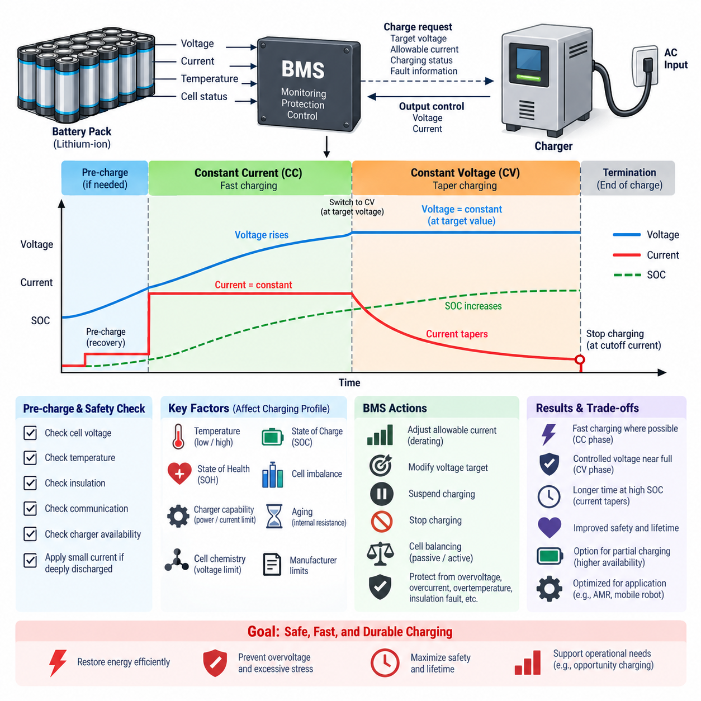
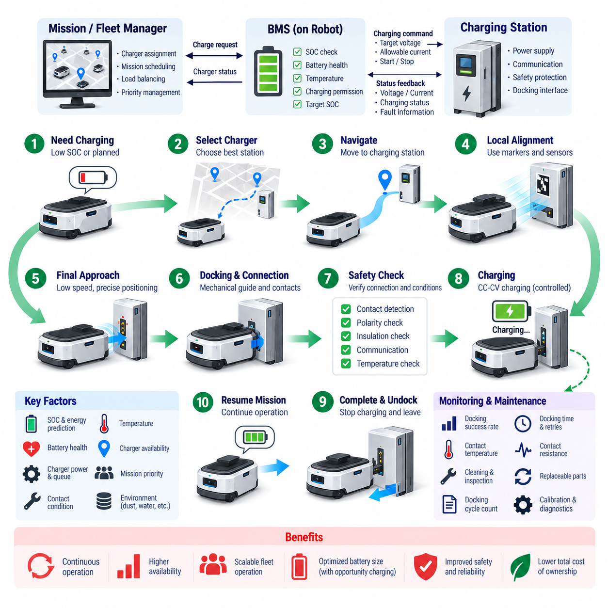
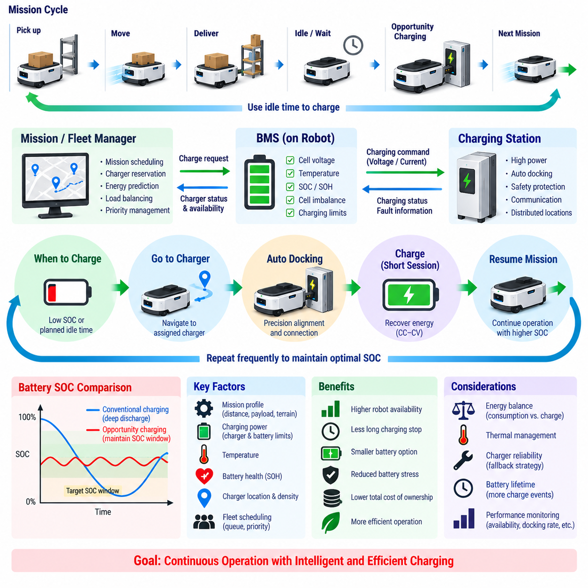
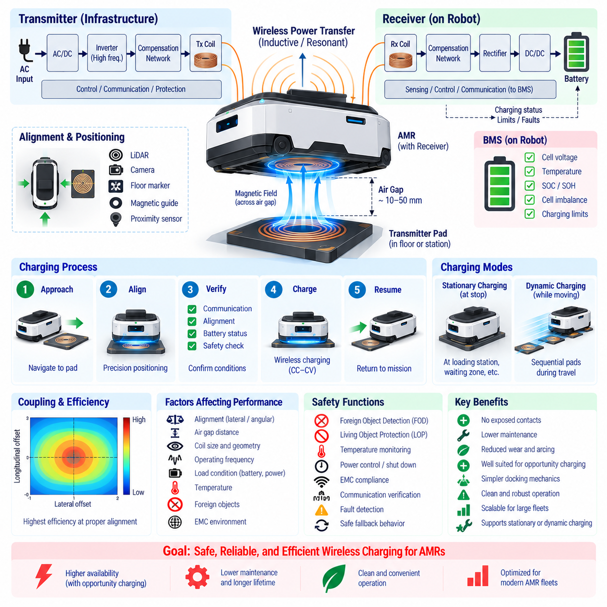
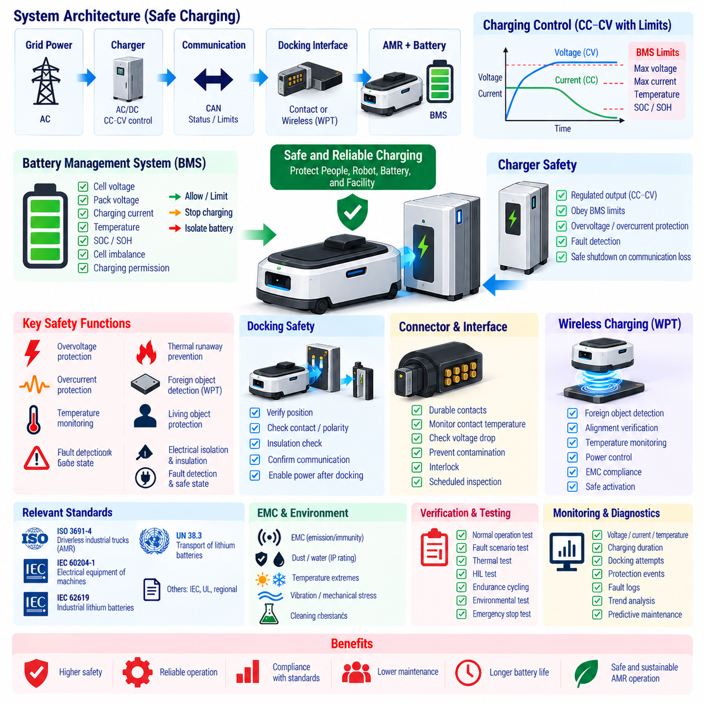

**Volume 11. Battery and Powertrain**


# Chapter 05. Charging System

##  

## 05.01. CC-CV Charging Profile

{width="7.268055555555556in" height="7.268055555555556in"}

Constant Current--Constant Voltage (CC--CV) charging is the dominant charging method for lithium-ion batteries because it provides a practical balance among charging speed, usable capacity, thermal behavior, and cell protection. The charging process is divided into two principal operating regions: a constant-current phase that restores most of the energy efficiently and a constant-voltage phase that completes charging while preventing the cell voltage from exceeding its allowable upper limit.

Before normal CC charging begins, the battery management system (BMS) evaluates whether the battery is in a valid condition for charging. Cell voltages, pack voltage, temperature, insulation status, communication health, and charger availability are typically checked. If a cell is deeply discharged below its normal operating range, the charger may first apply a small pre-charge or recovery current instead of immediately supplying the full charging current, reducing stress on a potentially degraded cell.

During the constant-current (CC) phase, the charger regulates current at a predefined value while the cell voltage gradually rises as the state of charge (SOC) increases. The selected current is commonly expressed as a C-rate relative to the rated cell capacity. A higher charging current can shorten charging time, but it also increases resistive heating, electrochemical polarization, and the possibility of lithium plating under unfavorable temperature or SOC conditions.

The CC current limit is therefore not necessarily a fixed value under every operating condition. A practical BMS may calculate the permitted charge current dynamically according to cell temperature, SOC, state of health (SOH), maximum cell voltage, pack imbalance, and manufacturer-defined limits. This process is often implemented through charge-current derating, allowing high current in favorable operating regions while progressively reducing the allowable current near thermal, voltage, or aging-related boundaries.

As charging proceeds, individual cell voltages increase toward the specified upper charging voltage. The transition from CC to CV operation occurs when the limiting cell or controlled battery voltage reaches the defined voltage target. For many lithium-ion chemistries, this upper voltage must be controlled accurately because even relatively small sustained overvoltage can accelerate electrolyte degradation, increase parasitic reactions, and reduce safety margins. The exact voltage threshold depends on the cell chemistry and manufacturer specification.

During the constant-voltage (CV) phase, the charger holds the charging voltage near the specified target rather than maintaining the previous current. Because the electrochemical driving potential decreases as the cell approaches full charge, the charging current naturally tapers downward. The CV phase therefore fills the remaining capacity more gradually while preventing voltage from continuing to rise beyond the permitted limit, making voltage regulation accuracy particularly important near high SOC.

The current-taper behavior provides useful information about the battery's approach to full charge. Charging is normally terminated when the current falls below a defined termination threshold, sometimes called the cutoff or end-of-charge current, while voltage and temperature remain within acceptable limits. Continuing CV charging indefinitely after the current has reached a sufficiently low level provides little additional usable energy and can unnecessarily increase the time spent at high SOC.

CC--CV charging should therefore be understood as a coordinated control process rather than simply two charger settings. The charger controls the electrical output, while the BMS continuously determines whether charging remains permissible. The BMS may request a lower current, reduce the voltage target, suspend charging, or open the charge path if cell voltage, temperature, current, insulation, or other monitored parameters violate allowable boundaries.

Cell imbalance becomes especially important near the CC-to-CV transition. In a series-connected battery pack, cells do not reach the upper voltage limit at exactly the same time because of differences in capacity, impedance, temperature, aging, and SOC. The highest-voltage cell may therefore reach its limit while other cells still have available charging capacity. Since pack charging must protect every individual cell, this limiting cell can determine when current reduction becomes necessary.

Cell balancing can help reduce this limitation by decreasing SOC differences among series-connected cells. Passive balancing typically dissipates a small amount of energy from higher-voltage cells through balancing resistors, whereas active balancing transfers energy between cells or modules. Balancing is often most relevant in the upper SOC region, where small SOC differences can produce significant voltage divergence and prematurely force the charger into current reduction or charge termination.

Temperature strongly influences the permissible CC--CV profile. At low temperature, lithium-ion diffusion and charge-transfer processes become slower, increasing polarization and lithium-plating risk if excessive charging current is applied. At high temperature, charging may accelerate undesirable chemical reactions and battery aging. A robust BMS therefore defines temperature-dependent charging regions and may derate current, modify voltage limits, or prohibit charging entirely outside the approved thermal operating window.

Battery aging also changes the appropriate charging behavior. As cells accumulate cycles and calendar exposure, internal resistance can increase and available capacity can decline. The same nominal charging current may consequently generate more heat and produce a faster voltage rise in an aged battery than in a new one. SOH-aware charging strategies can compensate by reducing allowable current or adjusting charging limits to preserve safety margins and extend remaining service life.

For large battery packs, charger power capability introduces another practical constraint. At lower pack voltage, the charger may be capable of supplying the requested CC value, but as battery voltage increases, its maximum power or current rating can become limiting. Consequently, the observed charging profile may contain power-limited or thermally derated regions in addition to ideal CC and CV behavior. Real charging curves should therefore be interpreted as controlled approximations of the theoretical CC--CV profile.

Charging control also requires reliable communication between the BMS and charger. In intelligent charging systems, the BMS can communicate requested voltage, allowable charging current, operating status, and fault information through interfaces such as CAN or other supported communication protocols. The charger then regulates its output within these commands, while independent hardware protections provide additional defense against communication failures, controller faults, or abnormal electrical conditions.

The charging profile has a direct relationship with charging time. Most energy is normally transferred during the relatively high-current CC region, whereas the final portion of charge can require disproportionate time because current progressively decreases during CV operation. This explains why reaching a moderately high SOC can be considerably faster than reaching a fully saturated state. Applications requiring high availability may therefore intentionally stop charging below maximum SOC to improve turnaround time and reduce high-SOC exposure.

For AMRs, mobile robots, and other continuously operated battery systems, CC--CV parameters should be integrated with mission scheduling rather than optimized only for maximum capacity. Opportunity charging, partial charging, automated docking, and fleet-level charger allocation may favor shorter charging sessions within a moderate SOC window. The BMS can still enforce the underlying CC--CV safety principles while supervisory software determines when charging should begin and what target SOC is operationally appropriate.

The resulting CC--CV charging profile is therefore a system-level interaction among cell chemistry, charger capability, BMS estimation, thermal conditions, balancing behavior, aging state, and operational requirements. Correct implementation restores energy rapidly where the battery can safely accept it, progressively limits electrical stress as full charge approaches, and terminates charging at a controlled endpoint. This coordinated behavior forms the foundation for safe, repeatable, and durable lithium-ion battery charging.

정전류--정전압(Constant Current--Constant Voltage, CC--CV) 충전은 충전 속도, 사용 가능 용량, 열적 거동(Thermal Behavior), 셀 보호(Cell Protection) 사이에서 실용적인 균형을 제공하기 때문에 리튬이온 배터리(Lithium-ion Battery)에서 가장 널리 사용되는 충전 방식이다. 충전 과정은 대부분의 에너지를 효율적으로 충전하는 정전류(Constant Current, CC) 단계와 셀 전압이 허용 가능한 상한값을 초과하지 않도록 하면서 충전을 완료하는 정전압(Constant Voltage, CV) 단계의 두 가지 주요 동작 영역으로 구분된다.

정상적인 정전류(CC) 충전을 시작하기 전에 배터리 관리 시스템(Battery Management System, BMS)은 배터리가 충전 가능한 정상 상태인지 평가한다. 일반적으로 셀 전압(Cell Voltage), 팩 전압(Pack Voltage), 온도(Temperature), 절연 상태(Insulation Status), 통신 상태(Communication Health), 충전기 가용성(Charger Availability) 등을 확인한다. 셀이 정상 동작 범위보다 심하게 방전된 경우에는 잠재적으로 열화된 셀에 가해지는 스트레스를 줄이기 위해 전체 충전 전류를 즉시 공급하지 않고 작은 예비 충전(Pre-charge) 또는 회복 전류(Recovery Current)를 먼저 적용할 수 있다.

정전류(Constant Current, CC) 단계에서 충전기는 미리 정의된 전류를 일정하게 제어하며, 충전 상태(State of Charge, SOC)가 증가함에 따라 셀 전압은 점진적으로 상승한다. 설정되는 전류는 일반적으로 셀의 정격 용량을 기준으로 한 C-레이트(C-rate)로 표현된다. 높은 충전 전류는 충전 시간을 단축할 수 있지만 저항성 발열(Resistive Heating), 전기화학적 분극(Electrochemical Polarization), 그리고 불리한 온도 또는 SOC 조건에서 리튬 도금(Lithium Plating)이 발생할 가능성을 증가시킨다.

따라서 정전류(CC) 전류 제한값은 모든 동작 조건에서 반드시 고정된 값일 필요는 없다. 실제 배터리 관리 시스템(BMS)은 셀 온도, 충전 상태(SOC), 건강 상태(State of Health, SOH), 최대 셀 전압(Maximum Cell Voltage), 팩 불균형(Pack Imbalance), 제조사가 정의한 제한값 등을 기반으로 허용 충전 전류(Allowable Charge Current)를 동적으로 계산할 수 있다. 이러한 과정은 충전 전류 디레이팅(Charge-current Derating)을 통해 구현되며, 유리한 동작 영역에서는 높은 전류를 허용하고 열, 전압 또는 열화와 관련된 한계에 접근할수록 허용 전류를 점진적으로 감소시킨다.

충전이 진행됨에 따라 개별 셀 전압은 규정된 상한 충전 전압(Upper Charging Voltage)을 향해 증가한다. 정전류(CC)에서 정전압(CV) 동작으로의 전환은 제한 셀(Limiting Cell) 또는 제어 대상 배터리 전압이 정의된 목표 전압에 도달할 때 발생한다. 많은 리튬이온 배터리 화학계(Lithium-ion Chemistry)에서는 비교적 작은 수준의 지속적인 과전압(Overvoltage)도 전해질 열화(Electrolyte Degradation), 부반응(Parasitic Reaction)을 가속하고 안전 여유(Safety Margin)를 감소시킬 수 있으므로 상한 전압을 정확하게 제어해야 한다. 정확한 전압 임계값은 셀 화학계(Cell Chemistry)와 제조사 사양에 따라 결정된다.

정전압(Constant Voltage, CV) 단계에서는 충전기가 이전의 충전 전류를 일정하게 유지하는 대신 충전 전압을 규정된 목표값 부근으로 유지한다. 셀이 완전 충전 상태에 접근할수록 전기화학적 구동 전위(Electrochemical Driving Potential)가 감소하기 때문에 충전 전류는 자연스럽게 점차 감소한다. 따라서 정전압(CV) 단계에서는 전압이 허용 한계를 넘어 계속 상승하지 않도록 하면서 남아 있는 용량을 보다 점진적으로 충전하며, 높은 충전 상태(SOC) 영역에서는 전압 제어 정확도(Voltage Regulation Accuracy)가 특히 중요해진다.

전류 감소(Current Taper) 거동은 배터리가 완전 충전 상태에 얼마나 접근했는지를 판단하는 데 유용한 정보를 제공한다. 일반적으로 전압과 온도가 허용 범위 내에 유지되는 상태에서 전류가 정의된 충전 종료 임계값(Termination Threshold), 즉 차단 전류(Cutoff Current) 또는 충전 종료 전류(End-of-Charge Current) 이하로 감소하면 충전을 종료한다. 전류가 충분히 낮은 수준에 도달한 이후에도 정전압(CV) 충전을 무기한 지속하면 추가적으로 확보되는 사용 가능 에너지는 매우 적은 반면, 높은 SOC 상태에 머무르는 시간만 불필요하게 증가할 수 있다.

따라서 정전류--정전압(CC--CV) 충전은 단순히 두 가지 충전기 설정값을 사용하는 방식이 아니라 상호 연계된 제어 과정(Coordinated Control Process)으로 이해해야 한다. 충전기(Charger)는 전기적 출력을 제어하고, 배터리 관리 시스템(BMS)은 충전이 계속 허용될 수 있는지를 지속적으로 판단한다. 셀 전압, 온도, 전류, 절연 또는 기타 감시 파라미터가 허용 경계를 벗어나면 BMS는 더 낮은 전류를 요청하거나 목표 전압을 낮추고, 충전을 일시 중지하거나 충전 경로(Charge Path)를 차단할 수 있다.

셀 불균형(Cell Imbalance)은 특히 정전류(CC)에서 정전압(CV)으로 전환되는 영역에서 중요해진다. 직렬 연결된 배터리 팩(Series-connected Battery Pack)에서는 용량, 임피던스(Impedance), 온도, 열화 정도, SOC의 차이로 인해 모든 셀이 정확히 동시에 상한 전압에 도달하지 않는다. 따라서 다른 셀에 아직 충전 가능한 용량이 남아 있더라도 가장 높은 전압의 셀이 먼저 한계에 도달할 수 있다. 팩 충전에서는 모든 개별 셀을 보호해야 하므로 이러한 제한 셀(Limiting Cell)이 전류 감소 시점을 결정할 수 있다.

셀 밸런싱(Cell Balancing)은 직렬 연결된 셀 사이의 SOC 차이를 감소시켜 이러한 제한을 완화할 수 있다. 수동 밸런싱(Passive Balancing)은 일반적으로 밸런싱 저항(Balancing Resistor)을 통해 높은 전압의 셀에서 소량의 에너지를 열로 소모하며, 능동 밸런싱(Active Balancing)은 셀 또는 모듈 사이에서 에너지를 전달한다. 밸런싱은 작은 SOC 차이가 큰 전압 편차(Voltage Divergence)를 발생시키고 충전기가 조기에 전류를 감소시키거나 충전을 종료하게 만들 수 있는 높은 SOC 영역에서 특히 중요하다.

온도(Temperature)는 허용 가능한 정전류--정전압(CC--CV) 충전 프로파일(Charging Profile)에 큰 영향을 미친다. 저온에서는 리튬이온 확산(Lithium-ion Diffusion)과 전하 전달(Charge Transfer) 과정이 느려지기 때문에 과도한 충전 전류가 공급되면 분극과 리튬 도금 위험이 증가한다. 고온에서는 충전이 바람직하지 않은 화학 반응과 배터리 열화를 가속할 수 있다. 따라서 견고한 BMS는 온도에 따른 충전 영역(Temperature-dependent Charging Region)을 정의하고, 허용된 열적 동작 범위를 벗어나면 전류를 디레이팅하거나 전압 제한값을 변경하고 필요한 경우 충전을 완전히 금지한다.

배터리 열화(Battery Aging) 역시 적절한 충전 동작을 변화시킨다. 셀이 충방전 사이클(Cycle)과 시간 경과에 따른 열화(Calendar Aging)를 누적하면 내부 저항(Internal Resistance)이 증가하고 사용 가능한 용량이 감소할 수 있다. 따라서 동일한 정격 충전 전류라도 노화된 배터리에서는 새로운 배터리보다 더 많은 열이 발생하고 전압이 더 빠르게 상승할 수 있다. 건강 상태(SOH)를 고려하는 충전 전략은 허용 전류를 감소시키거나 충전 제한값을 조정함으로써 안전 여유를 유지하고 남은 사용 수명(Remaining Service Life)을 연장할 수 있다.

대형 배터리 팩에서는 충전기 전력 용량(Charger Power Capability)이 또 다른 실질적인 제약 조건이 된다. 낮은 팩 전압에서는 충전기가 요구된 정전류(CC)를 공급할 수 있지만, 배터리 전압이 증가하면 충전기의 최대 전력 또는 최대 전류 정격이 제한 요소가 될 수 있다. 따라서 실제 충전 프로파일에는 이상적인 CC 및 CV 동작뿐만 아니라 전력 제한(Power-limited) 또는 열적 디레이팅(Thermal Derating) 영역이 포함될 수 있다. 실제 충전 곡선은 이론적인 CC--CV 프로파일을 제어 시스템이 현실적으로 구현한 형태로 이해해야 한다.

충전 제어(Charging Control)를 위해서는 배터리 관리 시스템(BMS)과 충전기 사이의 신뢰성 있는 통신도 필요하다. 지능형 충전 시스템(Intelligent Charging System)에서 BMS는 CAN 또는 기타 지원 통신 프로토콜(Communication Protocol)을 통해 요구 전압(Requested Voltage), 허용 충전 전류(Allowable Charging Current), 동작 상태(Operating Status), 고장 정보(Fault Information)를 전달할 수 있다. 충전기는 이러한 명령 범위 내에서 출력을 제어하며, 독립적인 하드웨어 보호 기능(Hardware Protection)은 통신 장애, 제어기 고장 또는 비정상적인 전기적 상태에 대한 추가적인 보호 계층을 제공한다.

충전 프로파일(Charging Profile)은 충전 시간(Charging Time)과 직접적인 관계를 가진다. 대부분의 에너지는 상대적으로 높은 전류가 유지되는 정전류(CC) 영역에서 전달되지만, 충전의 마지막 부분은 정전압(CV) 동작 중 전류가 점진적으로 감소하기 때문에 전체 충전 시간에서 상대적으로 큰 비중을 차지할 수 있다. 따라서 중간 이상의 높은 SOC까지 충전하는 시간은 완전 충전 상태까지 도달하는 시간보다 상당히 짧을 수 있다. 높은 가용성(Availability)이 필요한 시스템에서는 회전 시간을 단축하고 높은 SOC 노출을 줄이기 위해 의도적으로 최대 SOC보다 낮은 수준에서 충전을 종료할 수도 있다.

자율이동로봇(Autonomous Mobile Robot, AMR), 이동형 로봇(Mobile Robot), 그리고 지속적으로 운용되는 기타 배터리 시스템에서는 정전류--정전압(CC--CV) 파라미터를 단순히 최대 용량 확보만을 기준으로 최적화하기보다 임무 스케줄링(Mission Scheduling)과 통합해야 한다. 기회 충전(Opportunity Charging), 부분 충전(Partial Charging), 자동 도킹(Automated Docking), 플릿 수준 충전기 할당(Fleet-level Charger Allocation)에서는 적절한 SOC 범위 내에서 짧은 충전 세션을 반복하는 전략이 유리할 수 있다. BMS는 기본적인 CC--CV 안전 원칙을 계속 적용하면서 상위 관리 소프트웨어가 충전 시작 시점과 운영상 적절한 목표 SOC를 결정할 수 있다.

결과적으로 정전류--정전압(CC--CV) 충전 프로파일은 셀 화학계(Cell Chemistry), 충전기 성능(Charger Capability), BMS 상태 추정(BMS Estimation), 열적 조건(Thermal Condition), 밸런싱 거동(Balancing Behavior), 열화 상태(Aging State), 운영 요구사항(Operational Requirement)이 상호작용하여 형성되는 시스템 수준의 충전 과정이다. 올바르게 구현된 CC--CV 충전은 배터리가 안전하게 에너지를 수용할 수 있는 영역에서는 빠르게 에너지를 충전하고, 완전 충전에 접근할수록 전기적 스트레스를 점진적으로 제한하며, 정의된 종료 조건에서 충전을 안전하게 완료한다. 이러한 통합된 제어 거동은 안전하고 반복 가능하며 장기간 내구성을 확보할 수 있는 리튬이온 배터리 충전의 기본 토대를 형성한다.

##  

## 05.02. Auto Docking Charging

{width="7.268055555555556in" height="7.268055555555556in"}

Automatic docking charging enables an autonomous mobile robot (AMR) to restore battery energy without manual cable connection or operator intervention. The robot detects the need for charging, travels to a designated charging station, aligns with the docking interface, establishes an electrical connection, verifies charging conditions, and begins controlled charging. This capability supports continuous operation and is essential for scalable autonomous robot fleets.

The charging decision normally begins with the battery management system (BMS) and fleet or mission controller. State of charge (SOC), predicted energy consumption, remaining mission distance, charger availability, and operational priorities can all influence when docking is requested. Rather than waiting for a fixed low-SOC threshold, advanced systems can estimate whether sufficient energy remains to complete the current mission and safely reach an available charger.

Once charging is required, the robot must select an appropriate docking station and generate a route toward it. In a multi-robot fleet, charger assignment can consider distance, charger power, queue length, battery condition, mission priority, and expected charging duration. Fleet-level coordination prevents several robots from simultaneously targeting the same charger and allows charging resources to be treated as shared infrastructure within the overall mission scheduling system.

Navigation toward the charging station generally uses the same localization and path-planning functions employed during normal AMR operation. LiDAR, cameras, wheel odometry, inertial sensors, maps, and localization algorithms can guide the robot through the facility. As the AMR approaches the charger, however, ordinary navigation accuracy may no longer be sufficient because the electrical contacts typically require much tighter positional and angular alignment than normal waypoint navigation.

Docking therefore commonly uses a transition from global navigation to local precision alignment. The charging station may contain visual markers, reflective targets, geometric features, infrared emitters, magnetic references, or other localization aids that help the robot determine its relative pose. Cameras, LiDAR, proximity sensors, or dedicated docking sensors can then provide closed-loop corrections until lateral, longitudinal, and angular alignment errors fall within acceptable tolerances.

The final approach is normally performed at low speed to reduce collision energy and improve positioning accuracy. The motion controller progressively corrects steering and velocity while monitoring obstacles and docking references. Mechanical guides such as tapered rails, funnels, spring-loaded contacts, or compliant structures can compensate for small residual positioning errors. Combining software alignment with mechanical tolerance generally produces more reliable docking than depending on extremely precise navigation alone.

Contact-based charging requires a reliable electrical interface after physical docking. Spring-loaded pins, conductive plates, brushes, or similar contacts may carry the charging current, while separate signal contacts or communication links can confirm connection status. Contact geometry should tolerate repeated docking cycles, surface contamination, vibration, minor misalignment, and mechanical wear without creating excessive resistance or unstable electrical connections.

Electrical power should not normally be applied at full charging voltage and current merely because mechanical contact has occurred. The charger and BMS first verify conditions such as contact detection, polarity, pack voltage, insulation status, communication validity, battery temperature, and charging permission. A controlled handshake or pre-charge sequence can establish that the charging path is safe before the main charging circuit is enabled, reducing arcing and abnormal current transients.

After validation, the charging station and BMS coordinate the charging process according to the battery chemistry and permitted operating limits. For lithium-ion batteries, this typically involves a Constant Current--Constant Voltage (CC--CV) profile. The BMS continuously monitors cell voltages, pack current, temperature, SOC, and fault conditions while communicating allowable voltage and current limits to the charger. Charging power can be reduced dynamically when thermal or electrical limits are approached.

Docking contacts introduce additional electrical considerations that are less significant in manually connected charging systems. Contact resistance can generate localized heat according to current and resistance, particularly when conductive surfaces become oxidized, contaminated, worn, or incompletely engaged. Temperature sensing near the charging interface, contact-voltage monitoring, current plausibility checks, and periodic inspection can therefore help detect degradation before it develops into charging instability or thermal damage.

Charging stations also require protection against abnormal mechanical and environmental conditions. Foreign objects, water, dust, conductive debris, damaged contacts, or unintended human interaction can create hazards depending on voltage and installation environment. Protective covers, recessed electrodes, interlocks, isolation monitoring, current limiting, environmental sealing, and de-energized contacts before successful docking can be combined according to the required safety architecture.

A failed docking attempt should be treated as a recoverable operational event rather than immediately becoming a mission failure. If alignment or electrical validation is unsuccessful, the AMR can disengage, move to a defined retry position, reassess its pose, and attempt docking again. Retry count, remaining SOC, fault classification, and alternative charger availability should determine whether the robot continues retrying, selects another station, or requests operator assistance.

Undocking also requires controlled sequencing. When the target SOC or scheduled charging objective has been reached, charging current should first be reduced or terminated before the robot mechanically separates from the station. The charger confirms that the electrical path is safely de-energized, the BMS verifies readiness, and the robot releases any mechanical retention mechanism before reversing from the dock. This prevents disconnecting high charging current through exposed contacts.

Automatic docking is particularly valuable when opportunity charging is used. Instead of waiting for a deeply discharged battery, an AMR can recharge during idle periods, production breaks, loading delays, or naturally available mission gaps. Frequent partial charging can maintain the battery within a planned SOC operating window, reducing long charging interruptions and potentially allowing a smaller battery to support a given duty cycle when sufficient charging opportunities exist.

Fleet operation changes charging from an individual robot function into an energy-management problem. The fleet manager can predict future charger demand from robot SOC, mission schedules, energy consumption, and charger occupancy. Robots with urgent tasks may receive priority, while lower-priority units charge during idle periods. Effective scheduling minimizes charger congestion and prevents simultaneous low-energy conditions that could reduce the productive capacity of the entire fleet.

The number and power rating of charging stations should therefore be designed together with robot utilization and battery capacity. Installing too few chargers can create queues and reduce robot availability, whereas excessive charger capacity increases infrastructure cost without proportional operational benefit. Simulation or duty-cycle analysis can estimate charger utilization, expected queue time, energy demand, charging duration, and the minimum charging infrastructure required for the target fleet throughput.

Docking reliability is an important system-level performance indicator because even a highly efficient charger provides little benefit if physical connection frequently fails. Useful metrics include successful docking rate, first-attempt success rate, average docking time, number of retries, contact resistance, charging-start success rate, undocking success, and charger availability. Logging these values enables maintenance teams to identify mechanical wear, localization drift, contamination, or charging-interface degradation.

Maintenance requirements should be considered from the initial docking-station design. Repeated contact cycles can gradually wear conductive surfaces and mechanical guides, while accumulated dust can alter electrical resistance or sensor performance. Replaceable contact modules, accessible cleaning points, diagnostic measurements, alignment calibration procedures, and recorded docking-cycle counts simplify preventive maintenance and reduce unexpected charging failures during fleet operation.

Automatic docking charging ultimately combines navigation, precision localization, motion control, mechanical alignment, electrical connection, BMS supervision, charger control, safety protection, and fleet scheduling into one coordinated process. A well-designed system does more than automatically connect a battery to a power source; it manages robot energy as part of autonomous operation, enabling AMRs to maintain high availability with minimal human intervention and predictable charging behavior.

자동 도킹 충전(Automatic Docking Charging)은 자율이동로봇(Autonomous Mobile Robot, AMR)이 수동 케이블 연결이나 작업자의 개입 없이 배터리 에너지를 충전할 수 있도록 한다. 로봇은 충전 필요성을 감지하고 지정된 충전 스테이션(Charging Station)으로 이동한 후 도킹 인터페이스(Docking Interface)에 정렬하여 전기적 연결을 형성하고, 충전 조건을 검증한 다음 제어된 충전을 시작한다. 이러한 기능은 연속 운전을 지원하며 확장 가능한 자율 로봇 플릿(Robot Fleet)을 구성하는 데 필수적이다.

충전 결정은 일반적으로 배터리 관리 시스템(Battery Management System, BMS)과 플릿 또는 임무 제어기(Fleet or Mission Controller)에서 시작된다. 충전 상태(State of Charge, SOC), 예상 에너지 소비량(Predicted Energy Consumption), 남은 임무 거리, 충전기 가용성(Charger Availability), 운영 우선순위 등이 도킹 요청 시점을 결정하는 데 영향을 줄 수 있다. 고급 시스템에서는 고정된 저SOC 임계값까지 기다리는 대신 현재 임무를 완료하고 사용 가능한 충전기까지 안전하게 이동할 수 있는 충분한 에너지가 남아 있는지를 예측할 수 있다.

충전이 필요하다고 판단되면 로봇은 적절한 도킹 스테이션(Docking Station)을 선택하고 해당 위치까지의 경로를 생성해야 한다. 다중 로봇 플릿(Multi-robot Fleet)에서는 거리, 충전기 출력, 대기열 길이, 배터리 상태, 임무 우선순위, 예상 충전 시간 등을 고려하여 충전기를 할당할 수 있다. 플릿 수준 조정(Fleet-level Coordination)은 여러 로봇이 동시에 동일한 충전기를 목표로 하는 상황을 방지하고, 충전 자원을 전체 임무 스케줄링 시스템(Mission Scheduling System)의 공유 인프라로 활용할 수 있도록 한다.

충전 스테이션으로 이동하는 과정에서는 일반적으로 정상적인 AMR 운행에 사용되는 것과 동일한 위치 추정(Localization) 및 경로 계획(Path Planning) 기능이 사용된다. 라이다(LiDAR), 카메라(Camera), 휠 오도메트리(Wheel Odometry), 관성 센서(Inertial Sensor), 지도(Map), 위치 추정 알고리즘(Localization Algorithm) 등을 이용하여 시설 내부에서 로봇을 유도할 수 있다. 그러나 AMR이 충전기에 접근하면 전기 접점(Electrical Contact)에 일반적인 웨이포인트 주행보다 훨씬 높은 위치 및 각도 정렬 정확도가 필요하기 때문에 일반적인 주행 정확도만으로는 충분하지 않을 수 있다.

따라서 도킹(Docking) 과정에서는 일반적으로 전역 주행(Global Navigation)에서 국부 정밀 정렬(Local Precision Alignment)로 제어 방식이 전환된다. 충전 스테이션에는 로봇이 상대 자세(Relative Pose)를 판단할 수 있도록 시각 마커(Visual Marker), 반사 타깃(Reflective Target), 기하학적 특징(Geometric Feature), 적외선 방출기(Infrared Emitter), 자기 기준(Magnetic Reference) 등이 설치될 수 있다. 이후 카메라, LiDAR, 근접 센서(Proximity Sensor), 전용 도킹 센서(Docking Sensor)를 이용한 폐루프 보정(Closed-loop Correction)을 통해 횡방향, 종방향 및 각도 정렬 오차를 허용 범위까지 감소시킨다.

최종 접근(Final Approach)은 충돌 에너지를 줄이고 위치 정밀도를 높이기 위해 일반적으로 낮은 속도로 수행된다. 모션 제어기(Motion Controller)는 장애물과 도킹 기준을 감시하면서 조향과 속도를 점진적으로 보정한다. 테이퍼 가이드(Tapered Guide), 퍼널(Funnel), 스프링 접점(Spring-loaded Contact), 순응 구조(Compliant Structure)와 같은 기계적 가이드(Mechanical Guide)는 작은 잔여 위치 오차를 보상할 수 있다. 소프트웨어 정렬(Software Alignment)과 기계적 허용 오차(Mechanical Tolerance)를 결합하면 극도로 정밀한 주행에만 의존하는 것보다 일반적으로 높은 도킹 신뢰성을 확보할 수 있다.

접촉식 충전(Contact-based Charging)은 물리적인 도킹 이후 신뢰성 있는 전기적 인터페이스(Electrical Interface)를 필요로 한다. 스프링 핀(Spring-loaded Pin), 전도성 플레이트(Conductive Plate), 브러시(Brush) 또는 이와 유사한 접점이 충전 전류를 전달할 수 있으며, 별도의 신호 접점(Signal Contact)이나 통신 링크(Communication Link)를 통해 연결 상태를 확인할 수 있다. 접점 구조는 과도한 저항이나 불안정한 전기 연결을 발생시키지 않으면서 반복적인 도킹, 표면 오염, 진동, 미세한 정렬 오차 및 기계적 마모를 견딜 수 있어야 한다.

기계적인 접촉이 발생했다는 이유만으로 전체 충전 전압과 전류를 즉시 공급해서는 안 된다. 충전기(Charger)와 BMS는 먼저 접촉 감지(Contact Detection), 극성(Polarity), 팩 전압(Pack Voltage), 절연 상태(Insulation Status), 통신 유효성(Communication Validity), 배터리 온도, 충전 허가(Charging Permission) 등의 조건을 확인한다. 제어된 핸드셰이크(Handshake) 또는 예비 충전(Pre-charge) 절차를 통해 주 충전 회로(Main Charging Circuit)를 활성화하기 전에 충전 경로가 안전한지 확인함으로써 아크(Arcing)와 비정상적인 전류 과도현상(Current Transient)을 줄일 수 있다.

검증이 완료되면 충전 스테이션과 BMS는 배터리 화학계(Battery Chemistry) 및 허용 가능한 동작 한계에 따라 충전 과정을 조정한다. 리튬이온 배터리(Lithium-ion Battery)의 경우 일반적으로 정전류--정전압(Constant Current--Constant Voltage, CC--CV) 프로파일을 사용한다. BMS는 셀 전압, 팩 전류, 온도, SOC 및 고장 상태를 지속적으로 감시하면서 허용 전압과 전류 제한값을 충전기에 전달한다. 열적 또는 전기적 한계에 접근하면 충전 전력을 동적으로 감소시킬 수 있다.

도킹 접점(Docking Contact)은 수동 연결 충전 시스템에서는 상대적으로 중요도가 낮을 수 있는 추가적인 전기적 고려사항을 발생시킨다. 접촉 저항(Contact Resistance)은 전류와 저항에 따라 국부적인 열을 발생시킬 수 있으며, 특히 전도성 표면이 산화되거나 오염되고 마모되거나 완전히 접촉하지 않은 경우 문제가 커질 수 있다. 따라서 충전 인터페이스 주변의 온도 감지, 접점 전압(Contact Voltage) 감시, 전류 타당성 검사(Current Plausibility Check), 주기적 점검을 통해 충전 불안정이나 열적 손상으로 발전하기 전에 열화를 감지할 수 있다.

충전 스테이션은 비정상적인 기계적 및 환경적 조건에 대한 보호 기능도 필요하다. 이물질(Foreign Object), 물, 먼지, 전도성 잔해(Conductive Debris), 손상된 접점 또는 의도하지 않은 사람의 접촉은 전압과 설치 환경에 따라 위험을 발생시킬 수 있다. 보호 커버(Protective Cover), 매립형 전극(Recessed Electrode), 인터록(Interlock), 절연 감시(Isolation Monitoring), 전류 제한(Current Limiting), 환경 밀봉(Environmental Sealing), 그리고 성공적인 도킹 이전의 접점 비활성화(De-energized Contact)를 요구되는 안전 아키텍처(Safety Architecture)에 따라 조합할 수 있다.

도킹 실패(Failed Docking)는 즉시 임무 실패로 처리하기보다 복구 가능한 운영 이벤트(Recoverable Operational Event)로 처리해야 한다. 정렬 또는 전기적 검증에 실패하면 AMR은 도킹에서 이탈하고 정의된 재시도 위치(Retry Position)로 이동하여 자신의 자세를 다시 평가한 후 도킹을 재시도할 수 있다. 재시도 횟수, 남은 SOC, 고장 분류(Fault Classification), 대체 충전기 가용성에 따라 로봇이 도킹을 계속 재시도할지, 다른 충전 스테이션을 선택할지 또는 작업자 지원을 요청할지를 결정해야 한다.

도킹 해제(Undocking) 역시 제어된 순서로 수행되어야 한다. 목표 SOC 또는 계획된 충전 목표에 도달하면 로봇이 충전 스테이션에서 물리적으로 분리되기 전에 먼저 충전 전류를 감소시키거나 종료해야 한다. 충전기는 전기 경로가 안전하게 비활성화되었음을 확인하고, BMS는 출발 준비 상태를 검증하며, 로봇은 기계적 고정 장치(Mechanical Retention Mechanism)가 있는 경우 이를 해제한 후 도킹 스테이션에서 후진한다. 이를 통해 노출된 접점에서 높은 충전 전류가 흐르는 상태로 연결이 분리되는 것을 방지할 수 있다.

자동 도킹은 기회 충전(Opportunity Charging)을 사용하는 경우 특히 높은 가치를 제공한다. AMR은 배터리가 깊게 방전될 때까지 기다리는 대신 유휴 시간(Idle Period), 생산 휴식 시간, 적재 대기 시간 또는 임무 사이에 자연스럽게 발생하는 여유 시간에 충전할 수 있다. 빈번한 부분 충전(Partial Charging)을 통해 배터리를 계획된 SOC 동작 범위 내에서 유지하면 장시간 충전으로 인한 운행 중단을 줄일 수 있으며, 충분한 충전 기회가 제공되는 경우 특정 듀티 사이클(Duty Cycle)을 지원하기 위해 필요한 배터리 용량 자체를 줄일 수도 있다.

플릿 운영(Fleet Operation)에서는 충전이 개별 로봇의 기능에서 전체 에너지 관리(Energy Management) 문제로 확장된다. 플릿 관리자(Fleet Manager)는 로봇의 SOC, 임무 일정, 에너지 소비량 및 충전기 점유 상태를 기반으로 향후 충전 수요를 예측할 수 있다. 긴급한 임무를 수행하는 로봇에는 높은 우선순위를 부여하고 낮은 우선순위의 로봇은 유휴 시간에 충전할 수 있다. 효과적인 스케줄링은 충전기 혼잡을 최소화하고 여러 로봇이 동시에 저에너지 상태에 진입하여 전체 플릿의 생산 능력이 감소하는 것을 방지한다.

따라서 충전 스테이션의 수와 정격 출력(Power Rating)은 로봇 가동률(Robot Utilization) 및 배터리 용량과 함께 설계되어야 한다. 충전기가 너무 적으면 대기열이 발생하여 로봇 가용성이 감소할 수 있으며, 반대로 과도한 충전 용량은 운영상의 이점에 비해 인프라 비용을 증가시킨다. 시뮬레이션(Simulation) 또는 듀티 사이클 분석(Duty-cycle Analysis)을 통해 충전기 이용률, 예상 대기 시간, 에너지 수요, 충전 시간 및 목표 플릿 처리량(Fleet Throughput)에 필요한 최소 충전 인프라를 산정할 수 있다.

도킹 신뢰성(Docking Reliability)은 시스템 수준에서 중요한 성능 지표이다. 아무리 효율적인 충전기를 사용하더라도 물리적 연결이 반복적으로 실패하면 실질적인 이점을 얻기 어렵다. 유용한 지표에는 도킹 성공률(Docking Success Rate), 최초 시도 성공률(First-attempt Success Rate), 평균 도킹 시간(Average Docking Time), 재시도 횟수, 접촉 저항, 충전 시작 성공률(Charging-start Success Rate), 도킹 해제 성공률(Undocking Success), 충전기 가용성 등이 포함된다. 이러한 값을 기록하면 기계적 마모, 위치 추정 드리프트(Localization Drift), 오염 또는 충전 인터페이스 열화를 식별할 수 있다.

유지보수 요구사항(Maintenance Requirement)은 도킹 스테이션의 초기 설계 단계부터 고려해야 한다. 반복적인 접촉 사이클(Contact Cycle)은 전도성 표면과 기계적 가이드를 점진적으로 마모시킬 수 있으며, 축적된 먼지는 전기 저항이나 센서 성능을 변화시킬 수 있다. 교체 가능한 접점 모듈(Replaceable Contact Module), 접근하기 쉬운 청소 지점, 진단 측정(Diagnostic Measurement), 정렬 보정 절차(Alignment Calibration Procedure), 기록된 도킹 사이클 횟수 등을 활용하면 예방 정비(Preventive Maintenance)를 단순화하고 플릿 운영 중 예상하지 못한 충전 장애를 줄일 수 있다.

자동 도킹 충전(Automatic Docking Charging)은 궁극적으로 주행(Navigation), 정밀 위치 추정(Precision Localization), 모션 제어(Motion Control), 기계적 정렬(Mechanical Alignment), 전기적 연결(Electrical Connection), BMS 감독(BMS Supervision), 충전기 제어(Charger Control), 안전 보호(Safety Protection), 플릿 스케줄링(Fleet Scheduling)을 하나의 통합된 과정으로 결합한다. 잘 설계된 시스템은 단순히 배터리를 전원에 자동으로 연결하는 것을 넘어 로봇의 에너지를 자율 운영의 일부로 관리함으로써 최소한의 사람 개입으로 높은 AMR 가용성과 예측 가능한 충전 동작을 유지할 수 있도록 한다.

##  

## 05.03. Opportunity Charging Strategy

{width="7.268055555555556in" height="7.268055555555556in"}

Opportunity charging is an energy-management strategy in which an autonomous mobile robot (AMR) charges its battery during naturally occurring idle periods instead of waiting for the battery to reach a low state of charge (SOC). Short charging sessions can occur between missions, during loading or unloading, at production pauses, or while the robot waits for new tasks. The objective is to convert otherwise unused time into productive energy recovery.

Unlike conventional charging strategies that operate primarily between a low-SOC threshold and a high-SOC target, opportunity charging can maintain the battery within a narrower operating window. For example, the robot may repeatedly receive small amounts of energy whenever operational conditions permit. This reduces deep discharge events and can decrease the duration of dedicated charging stops, improving robot availability when the charging schedule is properly coordinated with mission demand.

The effectiveness of opportunity charging depends on the relationship between energy consumption and recoverable charging energy. During each operating cycle, the robot consumes energy while moving, carrying payloads, computing, sensing, and operating auxiliary devices. During available idle periods, the charger must recover enough energy to maintain a sustainable long-term energy balance. If average energy consumption continuously exceeds recoverable charging energy, SOC will gradually decline regardless of scheduling intelligence.

A useful strategy therefore begins with duty-cycle analysis. Mission duration, travel distance, payload, terrain, acceleration frequency, auxiliary loads, average propulsion power, idle time, and available charging duration should be evaluated together. Rather than sizing the battery only from maximum mission endurance, designers can calculate how much energy is consumed between charging opportunities and how much can realistically be restored during each available charging window.

Charging power is a critical design parameter because opportunity-charging windows may be relatively short. A higher-power charger can restore more energy during a brief stop, but the battery must be capable of accepting the corresponding charging current without exceeding voltage, temperature, or aging limits. The practical charging rate is therefore constrained by charger capability, battery chemistry, cell temperature, SOC, state of health (SOH), and battery management system (BMS) limits.

The BMS remains responsible for determining the electrically permissible charging envelope during every opportunity-charging event. It monitors cell voltage, temperature, current, SOC, SOH, and cell imbalance and communicates allowable charging limits to the charger. Even when the fleet controller identifies a valuable ten-minute charging window, the actual energy recovered may be lower than expected if the BMS derates current because of low temperature, high SOC, elevated temperature, or battery aging.

Opportunity charging is generally most efficient when the battery is maintained away from extreme SOC regions. Very high SOC can reduce charge acceptance because the charging process approaches the Constant Voltage (CV) region and current begins to taper. Extremely low SOC reduces operational reserve and increases the risk that unexpected delays will prevent the robot from reaching a charger. A moderate SOC operating band can therefore provide both useful charging power and sufficient mission reserve.

The target SOC window should be selected according to operational requirements rather than applying a universal value to every AMR. A high-utilization logistics robot may require a wider energy reserve than a robot operating near multiple chargers. Mission criticality, charger density, battery capacity, charging power, route uncertainty, payload variation, and expected queue time all influence the appropriate lower and upper SOC boundaries. These limits can also change dynamically during operation.

Predictive energy management can improve opportunity-charging decisions beyond simple threshold-based control. The fleet manager can estimate energy required for upcoming missions and compare it with current SOC, expected charger access, and future idle periods. A robot with sufficient reserve for several short missions may continue working, while another robot with an energy-intensive task scheduled later can be sent to charge even though its present SOC is relatively high.

Automatic docking charging is a key enabling technology because frequent short charging sessions would become impractical if human intervention were required. The AMR can autonomously navigate to a charger, perform precision docking, verify the electrical connection, initiate charging, and return to operation when the available charging window ends. Fast and reliable docking is particularly important because excessive docking time directly reduces the useful portion of a short charging opportunity.

Charging infrastructure can also be distributed around operational areas rather than concentrated in a single charging room. Chargers may be positioned near loading stations, waiting zones, production cells, elevators, transfer points, or other locations where robots naturally stop. This reduces nonproductive travel to charging stations and allows energy recovery to become part of the normal material-flow process. Charger placement should therefore be optimized together with route and facility design.

In multi-robot systems, opportunity charging becomes a fleet scheduling problem because chargers are shared resources. The fleet manager must determine which robot should charge, where it should charge, and for how long. Decisions can consider SOC, predicted energy demand, mission priority, charger distance, charging rate, queue length, and future workload. Poor scheduling can create charger congestion even when the total installed charging power appears sufficient.

Charger reservation can reduce uncertainty by assigning future charging windows before robots become energy constrained. A robot approaching a scheduled idle period can reserve a nearby charger, while another unit is directed elsewhere or delayed until capacity becomes available. Dynamic reservation can be updated as missions change, allowing the fleet to balance production throughput and energy demand rather than treating charging as an unexpected interruption to normal operations.

Opportunity charging can influence battery sizing. If reliable charging opportunities occur throughout the operating cycle, the battery does not necessarily need to store enough energy for an entire shift. A smaller battery can reduce robot mass, cost, charging energy, and structural requirements. However, excessive downsizing creates dependency on charging infrastructure and reduces resilience against charger failures, schedule disruptions, unusually demanding missions, or unexpected facility conditions.

Battery lifetime must also be considered because opportunity charging increases the number of charging events even though each event may involve only a small SOC change. Lithium-ion aging depends on more than simple cycle count; temperature, charging rate, average SOC, depth of discharge, and time spent near maximum voltage are also important. Maintaining a moderate SOC window and avoiding unnecessary high-SOC saturation can make frequent partial charging compatible with long battery service life.

Thermal management becomes important when frequent high-power charging is combined with intensive robot operation. Propulsion and computing loads can heat the battery during a mission, after which charging immediately introduces additional thermal load. The BMS may need to reduce charging current until temperature returns to a favorable range. Thermal design should therefore consider repeated drive--charge--drive cycles rather than evaluating driving and charging as isolated operating modes.

The strategy should include fallback behavior for abnormal conditions. If a planned charger is occupied, unavailable, or faulty, the robot must determine whether it has enough energy to continue its mission, wait, or travel to another station. Reserve SOC should account for such uncertainty. Fleet control can also temporarily reduce mission assignments, prioritize low-energy robots, or redirect charging resources when infrastructure availability falls below the expected level.

Performance should be evaluated using system-level indicators rather than charging efficiency alone. Important measures include robot availability, productive mission time, energy recovered per charging opportunity, average SOC, minimum SOC, charger utilization, queue time, docking success rate, charging duration, battery temperature, and mission interruptions caused by insufficient energy. These metrics reveal whether the strategy actually improves fleet productivity rather than merely increasing charging frequency.

Opportunity charging ultimately integrates battery characteristics, BMS control, automatic docking, charger placement, mission prediction, fleet scheduling, and operational energy demand. Its purpose is not simply to charge more frequently, but to place charging intelligently inside the natural rhythm of robot operation. When energy consumption and recovery are properly balanced, AMRs can maintain continuous availability with fewer long charging stops, controlled battery stress, and more efficient use of battery and charging infrastructure.

기회 충전(Opportunity Charging)은 자율이동로봇(Autonomous Mobile Robot, AMR)이 배터리의 충전 상태(State of Charge, SOC)가 낮은 수준까지 떨어질 때까지 기다리지 않고 자연스럽게 발생하는 유휴 시간(Idle Period)을 활용하여 배터리를 충전하는 에너지 관리(Energy Management) 전략이다. 짧은 충전은 임무 사이, 적재 또는 하역 중, 생산 휴지 시간, 새로운 작업을 기다리는 동안 수행될 수 있다. 목적은 사용되지 않는 시간을 생산적인 에너지 회복(Energy Recovery) 시간으로 전환하는 것이다.

주로 낮은 SOC 임계값과 높은 SOC 목표값 사이에서 동작하는 기존 충전 전략과 달리 기회 충전(Opportunity Charging)은 배터리를 보다 좁은 동작 범위 내에서 유지할 수 있다. 예를 들어 로봇은 운영 조건이 허용될 때마다 반복적으로 소량의 에너지를 충전할 수 있다. 이를 통해 심방전(Deep Discharge) 발생을 줄이고 별도의 장시간 충전 정지 시간을 감소시켜, 충전 일정이 임무 수요와 적절하게 조정되는 경우 로봇 가용성(Robot Availability)을 향상시킬 수 있다.

기회 충전의 효과는 에너지 소비(Energy Consumption)와 충전을 통해 회복할 수 있는 에너지 사이의 관계에 의해 결정된다. 각 운전 사이클에서 로봇은 이동, 페이로드(Payload) 운반, 컴퓨팅, 센싱 및 보조 장치(Auxiliary Device) 운용을 위해 에너지를 소비한다. 이용 가능한 유휴 시간에는 충전기가 장기적으로 지속 가능한 에너지 균형(Energy Balance)을 유지할 만큼 충분한 에너지를 회복해야 한다. 평균 에너지 소비가 회복 가능한 충전 에너지를 지속적으로 초과하면 스케줄링 지능과 관계없이 SOC는 점진적으로 감소한다.

따라서 유용한 전략은 듀티 사이클 분석(Duty-cycle Analysis)에서 시작한다. 임무 시간, 이동 거리, 페이로드, 지형(Terrain), 가속 빈도, 보조 부하, 평균 구동 전력, 유휴 시간 및 사용 가능한 충전 시간을 함께 평가해야 한다. 최대 임무 지속시간만을 기준으로 배터리를 선정하는 대신 충전 기회 사이에서 소비되는 에너지와 각각의 이용 가능한 충전 구간(Charging Window)에서 현실적으로 회복할 수 있는 에너지를 계산할 수 있다.

충전 전력(Charging Power)은 기회 충전 구간이 상대적으로 짧을 수 있기 때문에 중요한 설계 파라미터이다. 고출력 충전기는 짧은 정지 시간에도 더 많은 에너지를 회복할 수 있지만, 배터리는 전압, 온도 또는 열화 한계를 초과하지 않으면서 해당 충전 전류를 수용할 수 있어야 한다. 따라서 실제 충전 속도는 충전기 성능(Charger Capability), 배터리 화학계(Battery Chemistry), 셀 온도, SOC, 건강 상태(State of Health, SOH), 배터리 관리 시스템(Battery Management System, BMS)의 제한에 의해 결정된다.

BMS는 모든 기회 충전 과정에서 전기적으로 허용 가능한 충전 영역(Charging Envelope)을 결정하는 역할을 계속 담당한다. BMS는 셀 전압, 온도, 전류, SOC, SOH 및 셀 불균형(Cell Imbalance)을 감시하고 허용 가능한 충전 제한값을 충전기에 전달한다. 플릿 제어기(Fleet Controller)가 유용한 10분의 충전 구간을 확인했더라도 저온, 높은 SOC, 고온 또는 배터리 열화로 인해 BMS가 전류를 디레이팅(Derating)하면 실제 회복되는 에너지는 예상보다 적을 수 있다.

기회 충전은 일반적으로 배터리가 극단적인 SOC 영역을 벗어난 상태로 유지될 때 가장 효율적으로 활용할 수 있다. 매우 높은 SOC에서는 충전 과정이 정전압(Constant Voltage, CV) 영역에 접근하면서 전류가 감소하기 때문에 충전 수용 능력(Charge Acceptance)이 낮아질 수 있다. 지나치게 낮은 SOC는 운영 예비 에너지(Operational Reserve)를 감소시키고 예상하지 못한 지연으로 인해 로봇이 충전기까지 도달하지 못할 위험을 높인다. 따라서 중간 수준의 SOC 동작 범위는 유용한 충전 전력과 충분한 임무 예비 에너지를 동시에 제공할 수 있다.

목표 SOC 범위(Target SOC Window)는 모든 AMR에 동일한 값을 적용하기보다 운영 요구사항에 따라 설정해야 한다. 높은 가동률을 요구하는 물류 로봇은 여러 충전기 주변에서 운행하는 로봇보다 더 큰 에너지 예비량이 필요할 수 있다. 임무 중요도(Mission Criticality), 충전기 밀도, 배터리 용량, 충전 전력, 경로 불확실성(Route Uncertainty), 페이로드 변화, 예상 대기 시간이 적절한 SOC 하한 및 상한값에 영향을 미친다. 이러한 제한값은 운전 중 동적으로 변경될 수도 있다.

예측형 에너지 관리(Predictive Energy Management)는 단순한 임계값 기반 제어(Threshold-based Control)보다 기회 충전 결정을 향상시킬 수 있다. 플릿 관리자(Fleet Manager)는 향후 임무에 필요한 에너지를 예측하고 현재 SOC, 예상 충전기 접근 가능성, 향후 유휴 시간과 비교할 수 있다. 여러 개의 짧은 임무를 수행할 충분한 에너지가 있는 로봇은 작업을 계속할 수 있지만, 이후 에너지 소비가 큰 임무가 예정된 다른 로봇은 현재 SOC가 비교적 높더라도 미리 충전하도록 보낼 수 있다.

자동 도킹 충전(Automatic Docking Charging)은 빈번한 짧은 충전에 작업자의 개입이 필요하다면 기회 충전이 비현실적이 되기 때문에 핵심적인 기반 기술이다. AMR은 자율적으로 충전기까지 이동하고 정밀 도킹(Precision Docking)을 수행하며 전기 연결을 검증한 후 충전을 시작하고, 이용 가능한 충전 구간이 종료되면 다시 운행으로 복귀할 수 있다. 특히 과도한 도킹 시간이 짧은 충전 기회의 실제 유효 시간을 직접 감소시키므로 빠르고 신뢰성 높은 도킹이 중요하다.

충전 인프라(Charging Infrastructure)는 하나의 충전실에 집중하는 대신 운영 영역 전체에 분산 배치할 수도 있다. 충전기는 적재 스테이션, 대기 구역, 생산 셀(Production Cell), 엘리베이터, 이송 지점(Transfer Point) 또는 로봇이 자연스럽게 정지하는 다른 위치 주변에 설치할 수 있다. 이를 통해 충전을 위한 비생산적인 이동을 줄이고 에너지 회복을 정상적인 물류 흐름(Material Flow)의 일부로 만들 수 있다. 따라서 충전기 배치는 이동 경로 및 시설 설계와 함께 최적화되어야 한다.

다중 로봇 시스템(Multi-robot System)에서 기회 충전은 충전기를 공유 자원(Shared Resource)으로 사용하기 때문에 플릿 스케줄링(Fleet Scheduling) 문제로 확장된다. 플릿 관리자는 어떤 로봇이 어느 위치에서 얼마 동안 충전해야 하는지를 결정해야 한다. 이러한 결정에는 SOC, 예상 에너지 수요, 임무 우선순위, 충전기 거리, 충전 속도, 대기열 길이 및 향후 작업 부하(Future Workload)를 고려할 수 있다. 잘못된 스케줄링은 전체 설치 충전 전력이 충분한 경우에도 충전기 혼잡(Charger Congestion)을 발생시킬 수 있다.

충전기 예약(Charger Reservation)은 로봇이 에너지 부족 상태에 도달하기 전에 향후 충전 구간을 할당함으로써 불확실성을 감소시킬 수 있다. 예정된 유휴 시간에 접근하는 로봇은 가까운 충전기를 미리 예약할 수 있으며, 다른 로봇은 다른 충전기로 이동하거나 충전 용량이 확보될 때까지 대기하도록 할 수 있다. 동적 예약(Dynamic Reservation)은 임무 변화에 따라 갱신할 수 있으므로 플릿이 충전을 정상 운영의 예상하지 못한 중단으로 취급하는 대신 생산 처리량(Production Throughput)과 에너지 수요를 함께 균형화할 수 있다.

기회 충전은 배터리 용량 선정(Battery Sizing)에도 영향을 줄 수 있다. 운전 사이클 전체에서 신뢰성 높은 충전 기회가 지속적으로 제공된다면 배터리가 반드시 전체 근무 시간 동안 필요한 모든 에너지를 저장할 필요는 없다. 더 작은 배터리는 로봇 질량, 비용, 충전 에너지 및 구조적 요구사항을 감소시킬 수 있다. 그러나 지나친 배터리 소형화는 충전 인프라에 대한 의존성을 증가시키고 충전기 고장, 일정 변경, 비정상적으로 높은 에너지가 필요한 임무 또는 예상하지 못한 시설 조건에 대한 회복 탄력성(Resilience)을 감소시킨다.

배터리 수명(Battery Lifetime)도 고려해야 한다. 기회 충전은 각각의 충전 과정에서 SOC 변화가 작더라도 전체 충전 이벤트 횟수를 증가시키기 때문이다. 리튬이온 배터리(Lithium-ion Battery)의 열화는 단순한 사이클 횟수뿐만 아니라 온도, 충전 속도, 평균 SOC, 방전 깊이(Depth of Discharge), 최대 전압 부근에 머무르는 시간 등에 영향을 받는다. 적절한 중간 SOC 범위를 유지하고 불필요한 고SOC 포화(High-SOC Saturation)를 방지하면 빈번한 부분 충전(Partial Charging)과 긴 배터리 사용 수명을 양립시킬 수 있다.

빈번한 고출력 충전과 높은 로봇 가동률이 결합되면 열 관리(Thermal Management)가 중요해진다. 구동 및 컴퓨팅 부하는 임무 수행 중 배터리 온도를 상승시킬 수 있으며, 임무 직후 충전을 시작하면 추가적인 열 부하(Thermal Load)가 발생한다. BMS는 온도가 적절한 범위로 복귀할 때까지 충전 전류를 감소시켜야 할 수 있다. 따라서 열 설계는 주행과 충전을 독립적인 동작 모드로 평가하기보다 반복적인 주행--충전--주행(Drive--Charge--Drive) 사이클을 기준으로 고려해야 한다.

기회 충전 전략에는 비정상적인 조건에 대응하기 위한 대체 동작(Fallback Behavior)도 포함되어야 한다. 예정된 충전기가 점유되어 있거나 사용할 수 없거나 고장이 발생하면 로봇은 임무를 계속 수행하거나 대기하거나 다른 충전 스테이션으로 이동할 수 있는 충분한 에너지가 있는지를 판단해야 한다. 예비 SOC(Reserve SOC)는 이러한 불확실성을 고려해야 한다. 또한 충전 인프라 가용성이 예상 수준보다 낮아지면 플릿 제어 시스템은 임무 할당을 일시적으로 줄이거나 저에너지 로봇에 우선순위를 부여하고 충전 자원을 재배치할 수 있다.

성능은 충전 효율만으로 평가하기보다 시스템 수준 지표(System-level Indicator)를 이용하여 평가해야 한다. 주요 지표에는 로봇 가용성, 생산적인 임무 시간(Productive Mission Time), 충전 기회당 회복 에너지, 평균 SOC, 최소 SOC, 충전기 이용률(Charger Utilization), 대기 시간, 도킹 성공률(Docking Success Rate), 충전 시간, 배터리 온도, 에너지 부족으로 발생한 임무 중단 등이 포함된다. 이러한 지표를 통해 단순히 충전 빈도만 증가한 것이 아니라 실제로 플릿 생산성이 향상되었는지를 확인할 수 있다.

궁극적으로 기회 충전(Opportunity Charging)은 배터리 특성, BMS 제어, 자동 도킹(Automatic Docking), 충전기 배치, 임무 예측(Mission Prediction), 플릿 스케줄링 및 운영 에너지 수요를 하나의 시스템으로 통합한다. 목적은 단순히 더 자주 충전하는 것이 아니라 로봇 운영의 자연스러운 흐름 속에 충전을 지능적으로 배치하는 것이다. 에너지 소비와 회복이 적절하게 균형을 이루면 AMR은 장시간 충전 정지를 줄이면서 지속적인 가용성을 유지하고, 배터리 스트레스를 제어하며, 배터리와 충전 인프라를 더욱 효율적으로 활용할 수 있다.

##  

## 05.04. Wireless Charging (WPT)

{width="7.268055555555556in" height="7.268055555555556in"}

Wireless Power Transfer (WPT) enables an autonomous mobile robot (AMR) to receive charging energy without exposed conductive contacts or manually connected cables. A transmitter installed in the floor, charging pad, or docking station transfers electromagnetic energy across an air gap to a receiver mounted on the robot. The received energy is converted and regulated before being supplied to the battery through the battery management system (BMS).

For AMR charging, WPT is commonly implemented using inductive or resonant inductive coupling. An alternating current applied to the transmitter coil generates a time-varying magnetic field, which induces voltage in the receiver coil. Resonant compensation networks improve energy transfer across the physical gap by tuning the transmitter and receiver circuits to compatible operating frequencies, allowing useful power to be delivered without direct electrical contact.

The complete WPT system includes more than two coils. The infrastructure side typically contains an AC/DC conversion stage, high-frequency inverter, compensation network, transmitter coil, communication interface, and protection circuits. The robot side contains the receiver coil, compensation network, rectifier, DC/DC conversion stage, sensing circuits, and BMS interface. These elements jointly convert grid power into controlled DC charging power for the battery.

Coupling between the transmitter and receiver strongly influences charging performance. Maximum transfer efficiency is generally obtained when the coils have appropriate separation and good positional alignment. Lateral displacement, angular error, excessive vertical air gap, or differences in coil geometry reduce magnetic coupling and can lower delivered power. WPT docking therefore still requires positioning control, although it eliminates the need to physically mate electrical contacts.

Mechanical tolerance can be one of the important advantages of wireless charging. A contact-based dock may require conductive surfaces to meet within a limited physical region, while a properly designed WPT system can transfer energy over a defined alignment envelope. This can simplify docking mechanics and reduce sensitivity to contact wear. However, large misalignment still reduces efficiency and may cause additional heating, so positioning requirements cannot be eliminated completely.

An AMR can use LiDAR, cameras, floor markers, magnetic references, proximity sensors, or localization information to position its receiver above the charging transmitter. During the final approach, the robot may switch from normal navigation to precision alignment. The charging system can additionally estimate coupling quality or transferred power and provide feedback that helps the robot determine whether its final position is suitable for efficient charging.

Charging does not begin simply because the robot enters the transmitter area. The WPT controller and BMS first establish communication and verify that a valid receiver is present. Battery voltage, SOC, temperature, charging permission, requested power, alignment quality, and system fault status can be checked before significant power transfer begins. This controlled activation prevents unnecessary transmitter operation and supports safer automated charging.

Foreign Object Detection (FOD) is an important safety function in practical WPT systems. Metallic objects unintentionally placed within the active magnetic field can experience induced currents and potentially heat. The system may detect abnormal power loss, changes in electrical characteristics, temperature rise, or other indicators of an unintended object. If a hazardous condition is identified, transmitted power should be reduced or disabled before excessive heating occurs.

Living Object Protection (LOP) may also be considered depending on system power, geometry, frequency, and installation environment. The charging system should be designed so that people, animals, or unintended objects are not exposed to unacceptable electromagnetic or thermal conditions. Physical installation, shielding, detection functions, operating zones, power control, and compliance with applicable electromagnetic-field requirements contribute to the overall protection strategy.

Electromagnetic compatibility (EMC) is particularly important because WPT intentionally generates a high-frequency electromagnetic field while the AMR contains sensitive electronics and communication systems. Poorly controlled emissions can interfere with sensors, communication links, BMS measurements, navigation electronics, or nearby equipment. Coil design, shielding, filtering, grounding, cable routing, switching control, and system-level EMC validation are therefore essential design activities.

Efficiency should be evaluated across the entire power-conversion chain rather than only between the transmitter and receiver coils. Losses occur in AC/DC conversion, inverter switching, resonant components, magnetic structures, rectification, DC/DC conversion, wiring, and the battery charging process. Misalignment can further increase losses. Total grid-to-battery efficiency is therefore a more meaningful system metric than quoting the peak efficiency of the magnetic coupling stage alone.

Thermal management is closely related to efficiency. Power lost in semiconductor switches, coils, magnetic materials, compensation components, rectifiers, and converters becomes heat. The receiver is particularly important because it is installed on the mobile robot, where available cooling space may be limited. Temperature monitoring and power derating can prevent components or the battery from exceeding allowable limits during prolonged or high-power wireless charging.

The BMS continues to determine how much charging power the battery can safely accept. WPT changes the physical energy-transfer interface but does not replace lithium-ion charging requirements. The BMS monitors cell voltage, current, temperature, SOC, state of health (SOH), and imbalance and provides allowable charging limits. The wireless power electronics then regulate their output so that the battery follows the required charging profile, such as Constant Current--Constant Voltage (CC--CV).

Wireless charging is well suited to opportunity charging because it removes mechanical electrical-contact engagement from frequent charging events. Charging pads can be installed at locations where AMRs naturally stop, such as loading stations, transfer points, elevators, waiting zones, or work cells. The robot can recover energy during short pauses without connector wear, allowing charging to become more deeply integrated into the normal mission cycle.

Dynamic or quasi-dynamic WPT extends this concept by transferring energy while the robot is moving slowly or passing through an energized charging zone. Multiple transmitter segments can be activated sequentially as the robot moves above them. Although this can reduce stationary charging time, it substantially increases infrastructure complexity, control requirements, installation cost, electromagnetic design challenges, and coordination between robot position and transmitter activation.

Infrastructure design must therefore consider whether stationary wireless charging provides sufficient operational benefit before adopting dynamic WPT. Stationary pads are generally simpler to install, control, maintain, and protect. Dynamic charging may become attractive for high-utilization applications where robots have limited stationary time and predictable travel routes. The correct architecture depends on duty cycle, fleet size, required charging power, facility layout, and economic constraints.

WPT can reduce maintenance associated with exposed electrical contacts because there are no conductive charging surfaces that must repeatedly mate and separate. Contact oxidation, mechanical abrasion, spring-pin fatigue, contamination-related resistance, and electrical arcing can therefore be reduced or eliminated. However, wireless systems introduce different maintenance requirements involving coil integrity, thermal interfaces, power electronics, alignment calibration, shielding, and communication functions.

System monitoring should include transferred power, input and output voltage, current, efficiency, coil temperature, power-electronics temperature, alignment quality, communication status, charging duration, fault events, and FOD activations. Trends in these parameters can reveal degradation, misalignment, cooling problems, or abnormal losses. Fleet-level data can also identify charging pads that consistently perform worse than equivalent stations and require inspection.

Wireless charging architecture should include safe fallback behavior. If communication is lost, excessive temperature is detected, alignment becomes unacceptable, a foreign object is detected, or the BMS withdraws charging permission, power transfer should be reduced or stopped in a controlled manner. The robot can then reposition, retry charging, select another station, or return to service if sufficient SOC remains. Fault handling should be coordinated with fleet energy management.

For large AMR fleets, WPT stations become shared energy resources similar to contact-based chargers. Fleet management can assign charging pads based on SOC, predicted mission energy, distance, station power, occupancy, and charging priority. When wireless charging is combined with automatic positioning and opportunity charging, the charging process can become almost invisible to normal logistics operation, occurring automatically during otherwise unproductive waiting periods.

Wireless Power Transfer ultimately replaces the physical charging contact with a controlled electromagnetic energy link while preserving the need for accurate energy management, battery protection, thermal control, communication, and safety supervision. Properly engineered WPT can provide automated, low-maintenance, and highly repeatable charging for AMRs, particularly where frequent docking, contamination, connector wear, or opportunity charging make conventional conductive interfaces less attractive.

무선 전력 전송(Wireless Power Transfer, WPT)은 자율이동로봇(Autonomous Mobile Robot, AMR)이 노출된 전도성 접점(Conductive Contact)이나 수동으로 연결하는 케이블 없이 충전 에너지를 공급받을 수 있도록 한다. 바닥, 충전 패드(Charging Pad) 또는 도킹 스테이션(Docking Station)에 설치된 송신기(Transmitter)는 공극(Air Gap)을 통해 로봇에 장착된 수신기(Receiver)로 전자기 에너지를 전달한다. 수신된 에너지는 변환 및 제어된 후 배터리 관리 시스템(Battery Management System, BMS)을 통해 배터리에 공급된다.

AMR 충전용 WPT는 일반적으로 유도 결합(Inductive Coupling) 또는 공진 유도 결합(Resonant Inductive Coupling)을 이용하여 구현된다. 송신 코일(Transmitter Coil)에 교류 전류(Alternating Current)를 인가하면 시간에 따라 변화하는 자기장(Time-varying Magnetic Field)이 생성되고, 이 자기장이 수신 코일(Receiver Coil)에 전압을 유도한다. 공진 보상 네트워크(Resonant Compensation Network)는 송신부와 수신부 회로를 서로 호환되는 동작 주파수에 맞추어 조정함으로써 물리적인 간격을 두고도 유용한 전력을 직접적인 전기 접촉 없이 전달할 수 있도록 한다.

전체 WPT 시스템은 단순히 두 개의 코일만으로 구성되지 않는다. 인프라 측에는 일반적으로 교류/직류 변환(AC/DC Conversion) 단계, 고주파 인버터(High-frequency Inverter), 보상 네트워크(Compensation Network), 송신 코일, 통신 인터페이스(Communication Interface), 보호 회로(Protection Circuit)가 포함된다. 로봇 측에는 수신 코일, 보상 네트워크, 정류기(Rectifier), 직류/직류 변환(DC/DC Conversion) 단계, 센싱 회로(Sensing Circuit), BMS 인터페이스가 포함된다. 이러한 구성요소들이 함께 전력망의 전력을 배터리에 필요한 제어된 직류 충전 전력으로 변환한다.

송신기와 수신기 사이의 결합(Coupling)은 충전 성능에 큰 영향을 미친다. 일반적으로 코일 사이의 간격이 적절하고 위치 정렬이 양호할 때 최대 전력 전달 효율을 얻을 수 있다. 횡방향 위치 오차(Lateral Displacement), 각도 오차(Angular Error), 과도한 수직 공극(Vertical Air Gap), 코일 형상의 차이는 자기 결합(Magnetic Coupling)을 감소시키고 전달 가능한 전력을 낮출 수 있다. 따라서 WPT 도킹에서도 위치 제어(Positioning Control)가 필요하지만 전기 접점을 물리적으로 결합해야 할 필요는 제거된다.

기계적 허용 오차(Mechanical Tolerance)는 무선 충전의 중요한 장점 중 하나가 될 수 있다. 접촉식 도킹(Contact-based Docking)은 전도성 표면이 제한된 물리적 영역 내에서 서로 접촉해야 하지만, 적절하게 설계된 WPT 시스템은 정의된 정렬 허용 영역(Alignment Envelope) 내에서 에너지를 전달할 수 있다. 이를 통해 도킹 기구를 단순화하고 접점 마모에 대한 민감성을 낮출 수 있다. 그러나 큰 정렬 오차는 여전히 효율을 감소시키고 추가적인 발열을 발생시킬 수 있으므로 위치 정렬 요구사항 자체를 완전히 제거할 수는 없다.

AMR은 라이다(LiDAR), 카메라(Camera), 바닥 마커(Floor Marker), 자기 기준(Magnetic Reference), 근접 센서(Proximity Sensor) 또는 위치 추정 정보(Localization Information)를 이용하여 수신기를 충전 송신기 위에 정렬할 수 있다. 최종 접근(Final Approach) 과정에서는 일반 주행에서 정밀 정렬(Precision Alignment)로 전환할 수 있다. 또한 충전 시스템이 결합 품질(Coupling Quality)이나 전달 전력을 추정하여 피드백을 제공하면 로봇은 최종 위치가 효율적인 충전에 적합한지를 판단할 수 있다.

로봇이 송신 영역에 진입했다는 이유만으로 충전이 즉시 시작되는 것은 아니다. WPT 제어기(WPT Controller)와 BMS는 먼저 통신을 설정하고 유효한 수신기가 존재하는지 확인한다. 상당한 수준의 전력 전송을 시작하기 전에 배터리 전압, SOC, 온도, 충전 허가(Charging Permission), 요구 전력(Requested Power), 정렬 품질, 시스템 고장 상태(System Fault Status) 등을 확인할 수 있다. 이러한 제어된 활성화(Controlled Activation)는 불필요한 송신기 동작을 방지하고 보다 안전한 자동 충전을 지원한다.

이물질 감지(Foreign Object Detection, FOD)는 실제 WPT 시스템에서 중요한 안전 기능이다. 활성 자기장 내에 의도하지 않게 위치한 금속 물체에는 유도 전류(Induced Current)가 발생하여 온도가 상승할 가능성이 있다. 시스템은 비정상적인 전력 손실, 전기적 특성 변화, 온도 상승 또는 기타 지표를 이용하여 의도하지 않은 물체의 존재를 감지할 수 있다. 위험한 상태가 확인되면 과도한 발열이 발생하기 전에 송신 전력을 감소시키거나 차단해야 한다.

생체 보호(Living Object Protection, LOP) 역시 시스템 전력, 구조, 주파수 및 설치 환경에 따라 고려할 수 있다. 충전 시스템은 사람, 동물 또는 의도하지 않은 물체가 허용할 수 없는 전자기적 또는 열적 조건에 노출되지 않도록 설계되어야 한다. 물리적 설치 구조, 차폐(Shielding), 감지 기능, 동작 영역(Operating Zone), 전력 제어 및 관련 전자기장(Electromagnetic Field) 요구사항 준수는 전체적인 보호 전략에 기여한다.

전자기 적합성(Electromagnetic Compatibility, EMC)은 WPT가 의도적으로 고주파 전자기장(High-frequency Electromagnetic Field)을 생성하는 반면 AMR에는 민감한 전자장치와 통신 시스템이 탑재되어 있기 때문에 특히 중요하다. 적절히 제어되지 않은 방출(Emission)은 센서, 통신 링크, BMS 측정, 주행 전자장치 또는 주변 장비에 간섭을 일으킬 수 있다. 따라서 코일 설계, 차폐, 필터링(Filtering), 접지(Grounding), 케이블 배치, 스위칭 제어(Switching Control), 시스템 수준 EMC 검증은 필수적인 설계 활동이다.

효율(Efficiency)은 송신 코일과 수신 코일 사이에서만 평가하기보다 전체 전력 변환 체인(Power-conversion Chain)을 기준으로 평가해야 한다. 교류/직류 변환, 인버터 스위칭(Inverter Switching), 공진 부품(Resonant Component), 자기 구조(Magnetic Structure), 정류, 직류/직류 변환, 배선 및 배터리 충전 과정에서 각각 손실이 발생한다. 정렬 오차는 손실을 더욱 증가시킬 수 있다. 따라서 자기 결합 단계의 최대 효율만 제시하는 것보다 전력망에서 배터리까지의 전체 효율(Grid-to-battery Efficiency)이 더욱 의미 있는 시스템 지표이다.

열 관리(Thermal Management)는 효율과 밀접한 관계를 가진다. 반도체 스위치(Semiconductor Switch), 코일, 자기 재료(Magnetic Material), 보상 부품, 정류기 및 컨버터에서 손실되는 전력은 열로 변환된다. 특히 수신기는 사용 가능한 냉각 공간이 제한될 수 있는 이동 로봇 내부에 설치되므로 중요하다. 온도 감시(Temperature Monitoring)와 전력 디레이팅(Power Derating)을 적용하면 장시간 또는 고출력 무선 충전 중 구성요소나 배터리가 허용 온도 한계를 초과하는 것을 방지할 수 있다.

BMS는 배터리가 안전하게 수용할 수 있는 충전 전력의 크기를 계속 결정한다. WPT는 물리적인 에너지 전달 인터페이스를 변경하지만 리튬이온 배터리(Lithium-ion Battery)의 충전 요구사항을 대체하지 않는다. BMS는 셀 전압, 전류, 온도, SOC, 건강 상태(State of Health, SOH), 셀 불균형(Cell Imbalance)을 감시하고 허용 가능한 충전 제한값을 제공한다. 무선 전력 전자장치(Wireless Power Electronics)는 이에 따라 출력을 제어하여 배터리가 정전류--정전압(Constant Current--Constant Voltage, CC--CV)과 같은 요구 충전 프로파일을 따르도록 한다.

무선 충전(Wireless Charging)은 빈번한 충전 과정에서 기계적인 전기 접점 결합을 제거하기 때문에 기회 충전(Opportunity Charging)에 적합하다. 충전 패드는 적재 스테이션, 이송 지점(Transfer Point), 엘리베이터, 대기 구역 또는 작업 셀(Work Cell)과 같이 AMR이 자연스럽게 정지하는 위치에 설치할 수 있다. 로봇은 커넥터 마모(Connector Wear) 없이 짧은 정지 시간 동안 에너지를 회복할 수 있으므로 충전을 정상적인 임무 사이클(Mission Cycle)에 더욱 깊이 통합할 수 있다.

동적 또는 준동적 무선 전력 전송(Dynamic or Quasi-dynamic WPT)은 로봇이 저속으로 이동하거나 활성화된 충전 영역을 통과하는 동안 에너지를 전달함으로써 이러한 개념을 확장한다. 로봇이 여러 송신기 구간(Transmitter Segment) 위를 이동하면 각 구간을 순차적으로 활성화할 수 있다. 이를 통해 정지 충전 시간을 줄일 수 있지만 인프라 복잡성, 제어 요구사항, 설치 비용, 전자기 설계의 어려움 및 로봇 위치와 송신기 활성화 사이의 조정 요구가 크게 증가한다.

따라서 인프라 설계에서는 동적 WPT를 적용하기 전에 정지형 무선 충전(Stationary Wireless Charging)이 충분한 운영상의 이점을 제공하는지 검토해야 한다. 정지형 충전 패드는 일반적으로 설치, 제어, 유지보수 및 보호가 더욱 간단하다. 동적 충전(Dynamic Charging)은 로봇의 정지 시간이 제한적이고 이동 경로가 예측 가능한 높은 가동률의 응용 분야에서 유용할 수 있다. 적절한 아키텍처는 듀티 사이클(Duty Cycle), 플릿 규모(Fleet Size), 요구 충전 전력, 시설 배치 및 경제적 제약조건에 따라 결정된다.

WPT는 반복적으로 접촉하고 분리해야 하는 전도성 충전 표면이 없기 때문에 노출된 전기 접점과 관련된 유지보수를 감소시킬 수 있다. 따라서 접점 산화(Contact Oxidation), 기계적 마모(Mechanical Abrasion), 스프링 핀 피로(Spring-pin Fatigue), 오염으로 인한 저항 증가 및 전기적 아크(Electrical Arcing)를 감소시키거나 제거할 수 있다. 그러나 무선 시스템에서는 코일 건전성(Coil Integrity), 열 인터페이스(Thermal Interface), 전력 전자장치, 정렬 보정(Alignment Calibration), 차폐 및 통신 기능과 관련된 새로운 유지보수 요구사항이 발생한다.

시스템 모니터링(System Monitoring)에는 전달 전력, 입력 및 출력 전압, 전류, 효율, 코일 온도, 전력 전자장치 온도, 정렬 품질, 통신 상태, 충전 시간, 고장 이벤트(Fault Event), FOD 작동 횟수 등이 포함되어야 한다. 이러한 파라미터의 변화 추세를 분석하면 열화, 정렬 불량, 냉각 문제 또는 비정상적인 손실을 확인할 수 있다. 플릿 수준 데이터(Fleet-level Data)를 활용하면 동일한 충전 스테이션과 비교하여 지속적으로 낮은 성능을 보이는 충전 패드를 식별하고 점검할 수도 있다.

무선 충전 아키텍처에는 안전한 대체 동작(Safe Fallback Behavior)이 포함되어야 한다. 통신이 끊어지거나 과도한 온도가 감지되고, 정렬 상태가 허용 범위를 벗어나거나, 이물질이 감지되거나, BMS가 충전 허가를 취소하면 전력 전송을 제어된 방식으로 감소시키거나 중단해야 한다. 이후 로봇은 위치를 다시 조정하거나 충전을 재시도하고, 다른 충전 스테이션을 선택하거나 충분한 SOC가 남아 있다면 운행으로 복귀할 수 있다. 고장 처리는 플릿 에너지 관리(Fleet Energy Management)와 연계되어야 한다.

대규모 AMR 플릿에서 WPT 스테이션은 접촉식 충전기와 마찬가지로 공유 에너지 자원(Shared Energy Resource)이 된다. 플릿 관리 시스템은 SOC, 예상 임무 에너지, 거리, 충전 스테이션 출력, 점유 상태 및 충전 우선순위에 따라 충전 패드를 할당할 수 있다. 무선 충전이 자동 위치 정렬(Automatic Positioning) 및 기회 충전과 결합되면 충전 과정은 정상적인 물류 운영에서 거의 인식되지 않을 정도로 자연스럽게 통합될 수 있으며, 기존에는 생산성이 없던 대기 시간 동안 자동으로 수행될 수 있다.

궁극적으로 무선 전력 전송(Wireless Power Transfer)은 물리적인 충전 접점을 제어된 전자기 에너지 링크(Electromagnetic Energy Link)로 대체하면서도 정확한 에너지 관리, 배터리 보호, 열 제어, 통신 및 안전 감독의 필요성을 그대로 유지한다. 적절하게 설계된 WPT는 특히 빈번한 도킹, 오염, 커넥터 마모 또는 기회 충전으로 인해 기존 전도성 인터페이스(Conductive Interface)의 매력이 낮아지는 환경에서 AMR을 위한 자동화되고 유지보수 부담이 낮으며 높은 반복성을 갖는 충전 방식을 제공할 수 있다.

##  

## 05.05. Charging Safety and Standards

{width="7.268055555555556in" height="7.268055555555556in"}

Charging safety for autonomous mobile robots (AMRs) must be treated as a system-level engineering function rather than a feature of the battery or charger alone. Safe charging depends on coordinated behavior among the lithium-ion cells, battery management system (BMS), charger, electrical distribution, docking interface, thermal design, communication network, mechanical structure, and supervisory robot controller.

The BMS provides the primary battery-level supervision during charging. It continuously monitors individual cell voltage, pack voltage, charging current, temperature, state of charge (SOC), and relevant diagnostic conditions. Charging is permitted only when these parameters remain within defined limits. If an abnormal condition develops, the BMS can request current reduction, prohibit charging, or electrically isolate the battery depending on the severity of the event.

Overvoltage protection is particularly important because lithium-ion cells must remain below their specified upper voltage limit. The BMS evaluates individual cells rather than relying only on total pack voltage, since one weak or imbalanced cell may reach its maximum voltage before the rest of the pack. Charging current must be reduced or terminated before the limiting cell enters an unsafe region, even when the overall pack voltage still appears acceptable.

Overcurrent protection addresses excessive charging current caused by charger faults, incorrect commands, short circuits, control failures, or abnormal electrical connections. Software current limits can regulate normal operation, while independent hardware protection provides additional fault containment. Fuses, contactors, current sensors, protection circuits, and charger-side limits may be combined so that a single control failure does not result in uncontrolled battery current.

Temperature supervision is required throughout the charging process because lithium-ion charge acceptance varies strongly with temperature. Charging at excessively low temperature can increase lithium-plating risk, while charging at excessive temperature accelerates degradation and can reduce safety margins. Multiple temperature sensors may be distributed across cells, modules, contactors, charging connectors, and power electronics to detect both battery and interface-related thermal abnormalities.

Thermal runaway prevention requires more than detecting high average battery temperature. Localized cell defects, internal shorts, mechanical damage, manufacturing defects, or severe electrical abuse can initiate rapid self-heating. Battery design should combine cell-level protection, thermal propagation resistance, temperature monitoring, fault isolation, enclosure design, ventilation or pressure management, and emergency response measures appropriate to the battery chemistry and stored energy.

The charger must regulate its output within the voltage and current envelope permitted by the BMS. For lithium-ion systems, charging typically follows a Constant Current--Constant Voltage (CC--CV) profile, but the nominal profile is modified whenever temperature, SOC, cell imbalance, state of health (SOH), or charger conditions require derating. Charging control should therefore be based on real-time permissible limits rather than assuming a permanently fixed charging curve.

Communication between the BMS and charger is an important part of the safety architecture in intelligent charging systems. Interfaces such as CAN can exchange requested voltage, allowable current, charging status, battery conditions, and fault information. Communication loss, corrupted data, implausible commands, timeout conditions, or inconsistent states should place the charging system into a predefined safe state rather than allowing uncontrolled continuation of power transfer.

Automatic docking introduces additional hazards because electrical connection is established without direct human confirmation. The system should verify docking position, contact engagement, polarity, insulation condition, battery status, and communication before enabling significant charging power. High-current contacts should preferably remain de-energized until successful docking is confirmed, reducing electrical arcing, accidental contact, and damage caused by incomplete mechanical engagement.

Charging connectors and conductive docking contacts must withstand repeated mechanical cycles, contamination, oxidation, vibration, and alignment errors. Increased contact resistance can create localized heating even when battery current remains within its normal range. Contact temperature sensing, voltage-drop monitoring, current plausibility checks, protective covers, interlocks, and scheduled inspection can provide additional protection against interface degradation and progressive thermal damage.

Wireless Power Transfer (WPT) removes exposed charging contacts but introduces different safety considerations. Foreign Object Detection (FOD), temperature monitoring, alignment verification, power control, electromagnetic compatibility (EMC), and appropriate protection against unintended exposure become important. The transmitter should not deliver substantial power unless a valid receiver and acceptable operating conditions have been confirmed through controlled detection and communication.

Electrical isolation and insulation are important wherever charging equipment interfaces with higher-voltage power sources. Insulation monitoring, dielectric design, protective earth, isolation barriers, creepage and clearance distances, enclosure protection, and appropriate fault-disconnection mechanisms help prevent electric shock and unintended current paths. Requirements depend on system voltage, charger topology, installation environment, and applicable regional regulations.

Functional safety principles can improve charging-system robustness by considering how faults are detected, controlled, and transitioned to safe states. Safety-related functions should define their triggering conditions, diagnostic coverage, response time, fallback behavior, and independence where required. Examples include terminating charging after overvoltage detection, disabling power after communication loss, and preventing robot motion while an energized charging connection remains engaged.

Charging safety must also account for interactions with robot motion. An AMR should not normally drive away while substantial charging current is flowing through conductive contacts. Interlocks can prevent propulsion until charging has stopped and the electrical interface has been safely de-energized. Conversely, charging should not begin until the robot is mechanically stable at the intended charging position. These state transitions should be explicitly managed by the control architecture.

Applicable standards depend on robot type, battery configuration, charger design, installation region, and intended market. ISO 3691-4 addresses safety requirements for driverless industrial trucks and their systems, including mobile robot applications. IEC 60204-1 provides widely used requirements for electrical equipment of machines, while relevant battery and industrial standards may additionally govern cell safety, battery assemblies, charging equipment, EMC, and environmental protection.

For lithium-ion industrial battery systems, standards such as IEC 62619 provide requirements and tests related to the safety of secondary lithium cells and batteries used in industrial applications. Depending on product architecture and certification strategy, other IEC, ISO, UL, UN, or regional requirements may also apply. Standards should therefore be selected through a formal applicability analysis rather than assuming that one battery standard covers the complete AMR charging system.

Transport compliance is separate from normal operational charging safety. Lithium batteries transported commercially are commonly subject to the UN Manual of Tests and Criteria, including UN 38.3 testing requirements. Passing transportation tests does not demonstrate that an AMR charging system is safe for everyday operation, just as compliance with an operational robot standard does not automatically establish compliance with battery transportation regulations.

EMC compliance must be evaluated because chargers, DC/DC converters, switching power electronics, WPT systems, communication networks, and robot electronics can generate or receive electromagnetic disturbances. Conducted and radiated emissions, immunity, electrostatic discharge, electrical transients, grounding, and cable routing should be validated at the integrated-system level. Charging must not compromise navigation, safety sensing, BMS measurements, or communication reliability.

Environmental protection is also part of charging safety. Charging equipment may encounter dust, moisture, cleaning fluids, condensation, conductive debris, temperature extremes, or outdoor exposure depending on the application. Enclosure design, ingress protection, corrosion resistance, drainage, connector protection, and environmental qualification should reflect the actual installation environment rather than relying only on laboratory charging conditions.

Verification should include both normal operation and credible fault scenarios. Testing can cover overvoltage, overcurrent, sensor failure, communication loss, excessive temperature, charger malfunction, contact resistance, incorrect docking, insulation faults, foreign objects, power interruption, emergency stop, and recovery behavior. Hardware-in-the-loop testing, environmental testing, endurance cycling, and controlled fault injection can complement conventional functional tests.

Charging-related events should be logged for diagnostics and lifecycle management. Useful information includes maximum cell voltage, minimum and maximum temperature, charging current, charging duration, contact temperature, charger identity, docking attempts, protection activations, communication faults, and termination reasons. Trend analysis can identify deterioration before a failure becomes critical and can support preventive maintenance across a large AMR fleet.

A structured safety process should connect hazard analysis, requirements, architecture, implementation, verification, validation, and field monitoring. Safety mechanisms are most effective when their assumptions and responsibilities are clearly allocated among the battery, BMS, charger, docking station, robot controller, and fleet system. Traceability from identified charging hazards to implemented controls and verification evidence supports both engineering quality and certification activities.

Charging safety and standards ultimately provide the framework for delivering energy without creating unacceptable electrical, thermal, mechanical, electromagnetic, or operational risk. Compliance should not be treated as a final certification exercise after design completion. By incorporating protection mechanisms, applicable standards, fault handling, verification, and lifecycle monitoring from the beginning, an AMR charging system can achieve reliable operation while protecting people, equipment, batteries, and the surrounding facility.

자율이동로봇(Autonomous Mobile Robot, AMR)의 충전 안전(Charging Safety)은 배터리나 충전기만의 기능이 아니라 시스템 수준 엔지니어링(System-level Engineering) 기능으로 다루어야 한다. 안전한 충전은 리튬이온 셀(Lithium-ion Cell), 배터리 관리 시스템(Battery Management System, BMS), 충전기(Charger), 전력 분배(Electrical Distribution), 도킹 인터페이스(Docking Interface), 열 설계(Thermal Design), 통신 네트워크, 기계 구조 및 상위 로봇 제어기(Supervisory Robot Controller)의 협조된 동작에 의해 달성된다.

BMS는 충전 과정에서 배터리 수준의 핵심 감독 기능을 제공한다. 개별 셀 전압(Cell Voltage), 팩 전압(Pack Voltage), 충전 전류, 온도, 충전 상태(State of Charge, SOC) 및 관련 진단 상태를 지속적으로 감시한다. 이러한 파라미터가 정의된 한계 내에 있을 때만 충전을 허용한다. 비정상 상태가 발생하면 BMS는 상황의 심각도에 따라 전류 감소를 요청하거나 충전을 금지하고 배터리를 전기적으로 차단할 수 있다.

과전압 보호(Overvoltage Protection)는 리튬이온 셀이 규정된 상한 전압 이하에서 유지되어야 하기 때문에 특히 중요하다. BMS는 전체 팩 전압에만 의존하지 않고 개별 셀을 평가한다. 열화되거나 불균형한 셀 하나가 다른 셀보다 먼저 최대 전압에 도달할 수 있기 때문이다. 전체 팩 전압이 정상적으로 보이더라도 제한 셀(Limiting Cell)이 위험 영역에 진입하기 전에 충전 전류를 감소시키거나 충전을 종료해야 한다.

과전류 보호(Overcurrent Protection)는 충전기 고장, 잘못된 명령, 단락(Short Circuit), 제어 실패 또는 비정상적인 전기 연결로 발생하는 과도한 충전 전류에 대응한다. 소프트웨어 전류 제한(Software Current Limit)은 정상 운전에서 전류를 제어하고 독립적인 하드웨어 보호(Hardware Protection)는 추가적인 고장 억제 기능을 제공한다. 퓨즈(Fuse), 컨택터(Contactor), 전류 센서, 보호 회로 및 충전기 측 제한을 조합하여 단일 제어 실패가 배터리의 무제어 전류로 이어지지 않도록 할 수 있다.

리튬이온 배터리의 충전 수용 능력(Charge Acceptance)은 온도에 크게 영향을 받으므로 충전 과정 전체에서 온도 감시(Temperature Supervision)가 필요하다. 지나치게 낮은 온도에서 충전하면 리튬 도금(Lithium Plating) 위험이 증가하고, 과도한 고온 충전은 열화를 가속하여 안전 여유(Safety Margin)를 감소시킬 수 있다. 배터리와 인터페이스의 열적 이상을 모두 감지하기 위해 셀, 모듈, 컨택터, 충전 커넥터 및 전력 전자장치에 여러 온도 센서를 분산 배치할 수 있다.

열폭주(Thermal Runaway) 방지는 높은 평균 배터리 온도를 감지하는 것만으로는 충분하지 않다. 국부적인 셀 결함, 내부 단락(Internal Short), 기계적 손상, 제조 결함 또는 심각한 전기적 스트레스가 급격한 자기 발열(Self-heating)을 유발할 수 있다. 배터리 설계에서는 셀 수준 보호, 열 전파 저항(Thermal Propagation Resistance), 온도 감시, 고장 격리(Fault Isolation), 인클로저 설계(Enclosure Design), 환기 또는 압력 관리와 배터리 화학계 및 저장 에너지에 적합한 비상 대응 조치를 함께 적용해야 한다.

충전기는 BMS가 허용하는 전압 및 전류 영역 내에서 출력을 제어해야 한다. 리튬이온 시스템에서는 일반적으로 정전류--정전압(Constant Current--Constant Voltage, CC--CV) 프로파일을 사용하지만 온도, SOC, 셀 불균형(Cell Imbalance), 건강 상태(State of Health, SOH), 충전기 상태에 따라 디레이팅(Derating)이 필요한 경우 명목 충전 프로파일이 변경된다. 따라서 충전 제어는 영구적으로 고정된 충전 곡선을 가정하기보다 실시간 허용 제한값을 기반으로 수행되어야 한다.

지능형 충전 시스템(Intelligent Charging System)에서는 BMS와 충전기 사이의 통신이 안전 아키텍처(Safety Architecture)의 중요한 부분이다. CAN과 같은 인터페이스를 통해 요구 전압, 허용 전류, 충전 상태, 배터리 상태 및 고장 정보를 교환할 수 있다. 통신 손실, 손상된 데이터, 비현실적인 명령, 타임아웃(Timeout) 또는 상태 불일치가 발생하면 전력 전송을 무제어 상태로 지속하지 않고 충전 시스템을 미리 정의된 안전 상태(Safe State)로 전환해야 한다.

자동 도킹(Automatic Docking)은 사람의 직접적인 확인 없이 전기적 연결이 이루어지기 때문에 추가적인 위험을 발생시킨다. 시스템은 상당한 충전 전력을 활성화하기 전에 도킹 위치, 접점 체결(Contact Engagement), 극성(Polarity), 절연 상태, 배터리 상태 및 통신을 검증해야 한다. 고전류 접점은 성공적인 도킹이 확인될 때까지 비활성 상태(De-energized State)를 유지하는 것이 바람직하며, 이를 통해 전기적 아크(Electrical Arcing), 우발적인 접촉 및 불완전한 기계적 체결로 인한 손상을 줄일 수 있다.

충전 커넥터와 전도성 도킹 접점(Conductive Docking Contact)은 반복적인 기계적 사이클, 오염, 산화, 진동 및 정렬 오차를 견딜 수 있어야 한다. 접촉 저항(Contact Resistance)이 증가하면 배터리 전류가 정상 범위에 있더라도 국부적인 발열이 발생할 수 있다. 접점 온도 감지, 전압 강하(Voltage Drop) 감시, 전류 타당성 검사(Current Plausibility Check), 보호 커버, 인터록(Interlock), 정기 점검을 통해 인터페이스 열화와 점진적인 열 손상에 대한 추가 보호를 제공할 수 있다.

무선 전력 전송(Wireless Power Transfer, WPT)은 노출된 충전 접점을 제거하지만 다른 형태의 안전 고려사항을 발생시킨다. 이물질 감지(Foreign Object Detection, FOD), 온도 감시, 정렬 검증(Alignment Verification), 전력 제어, 전자기 적합성(Electromagnetic Compatibility, EMC), 의도하지 않은 노출에 대한 적절한 보호가 중요하다. 송신기(Transmitter)는 제어된 감지 및 통신을 통해 유효한 수신기와 허용 가능한 운전 조건이 확인되기 전까지 상당한 전력을 전달하지 않아야 한다.

충전 장비가 높은 전압의 전원과 연결되는 경우에는 전기적 절연(Electrical Isolation)과 절연 성능(Insulation)이 중요하다. 절연 감시(Insulation Monitoring), 유전체 설계(Dielectric Design), 보호 접지(Protective Earth), 절연 장벽(Isolation Barrier), 연면거리(Creepage Distance)와 공간거리(Clearance Distance), 인클로저 보호 및 적절한 고장 차단 메커니즘을 통해 감전과 의도하지 않은 전류 경로를 방지할 수 있다. 요구사항은 시스템 전압, 충전기 토폴로지(Charger Topology), 설치 환경 및 적용되는 지역 규정에 따라 달라진다.

기능 안전(Functional Safety) 원칙을 적용하면 고장이 어떻게 감지되고 제어되며 안전 상태로 전환되는지를 고려하여 충전 시스템의 견고성을 향상시킬 수 있다. 안전 관련 기능(Safety-related Function)은 작동 조건, 진단 범위(Diagnostic Coverage), 응답 시간, 대체 동작(Fallback Behavior), 필요한 경우 독립성을 정의해야 한다. 과전압 감지 후 충전 종료, 통신 손실 후 전력 차단, 전원이 공급된 충전 연결이 유지되는 동안 로봇 이동을 방지하는 기능 등이 대표적인 예이다.

충전 안전은 로봇의 움직임과 충전 상태 사이의 상호작용도 고려해야 한다. AMR은 전도성 접점을 통해 상당한 충전 전류가 흐르는 동안 이동해서는 안 된다. 인터록을 통해 충전이 종료되고 전기 인터페이스가 안전하게 비활성화될 때까지 구동을 방지할 수 있다. 반대로 로봇이 의도된 충전 위치에서 기계적으로 안정된 상태가 되기 전에는 충전을 시작해서는 안 된다. 이러한 상태 전환(State Transition)은 제어 아키텍처에서 명확하게 관리되어야 한다.

적용되는 표준(Applicable Standards)은 로봇 유형, 배터리 구성, 충전기 설계, 설치 지역 및 목표 시장에 따라 달라진다. ISO 3691-4는 이동 로봇 응용을 포함한 무인 산업용 트럭(Driverless Industrial Truck)과 관련 시스템의 안전 요구사항을 다룬다. IEC 60204-1은 기계류의 전기 장비(Electrical Equipment of Machines)에 널리 적용되는 요구사항을 제공하며, 관련 배터리 및 산업 표준이 셀 안전, 배터리 어셈블리, 충전 장비, EMC 및 환경 보호를 추가적으로 규정할 수 있다.

산업용 리튬이온 배터리 시스템에서는 IEC 62619와 같은 표준이 산업용 응용 분야에 사용되는 이차 리튬 셀 및 배터리(Secondary Lithium Cells and Batteries)의 안전과 관련된 요구사항 및 시험을 제공한다. 제품 아키텍처와 인증 전략(Certification Strategy)에 따라 다른 IEC, ISO, UL, UN 또는 지역별 요구사항이 추가로 적용될 수 있다. 따라서 하나의 배터리 표준이 전체 AMR 충전 시스템을 포괄한다고 가정하기보다 공식적인 적용성 분석(Applicability Analysis)을 통해 필요한 표준을 선정해야 한다.

운송 규정 준수(Transport Compliance)는 정상적인 운용 충전 안전과 별개의 영역이다. 상업적으로 운송되는 리튬 배터리는 일반적으로 UN 시험 및 기준 매뉴얼(UN Manual of Tests and Criteria)의 적용을 받으며, 여기에는 UN 38.3 시험 요구사항이 포함된다. 운송 시험을 통과했다는 사실이 AMR 충전 시스템의 일상적인 운용 안전을 입증하는 것은 아니며, 반대로 로봇 운용 안전 표준을 만족한다고 해서 배터리 운송 규정을 자동으로 충족하는 것도 아니다.

충전기, 직류/직류 컨버터(DC/DC Converter), 스위칭 전력 전자장치(Switching Power Electronics), WPT 시스템, 통신 네트워크 및 로봇 전자장치는 전자기 방해를 발생시키거나 영향을 받을 수 있으므로 EMC 적합성을 평가해야 한다. 전도 및 방사 방출(Conducted and Radiated Emissions), 내성(Immunity), 정전기 방전(Electrostatic Discharge), 전기적 과도현상(Electrical Transient), 접지 및 케이블 배치를 통합 시스템 수준에서 검증해야 한다. 충전으로 인해 주행, 안전 센싱, BMS 측정 또는 통신 신뢰성이 저하되어서는 안 된다.

환경 보호(Environmental Protection) 역시 충전 안전의 일부이다. 충전 장비는 적용 환경에 따라 먼지, 습기, 세척액, 결로(Condensation), 전도성 이물질, 극한 온도 또는 실외 환경에 노출될 수 있다. 인클로저 설계, 방진·방수 보호(Ingress Protection), 내식성(Corrosion Resistance), 배수, 커넥터 보호 및 환경 적합성 검증(Environmental Qualification)은 실험실의 충전 조건만을 기준으로 하지 않고 실제 설치 환경을 반영해야 한다.

검증(Verification)은 정상 운전뿐만 아니라 합리적으로 예상 가능한 고장 시나리오도 포함해야 한다. 시험에는 과전압, 과전류, 센서 고장, 통신 손실, 과도한 온도, 충전기 오동작, 접촉 저항 증가, 잘못된 도킹, 절연 고장, 이물질, 전원 차단, 비상 정지(Emergency Stop), 복구 동작 등이 포함될 수 있다. 하드웨어 인 더 루프 시험(Hardware-in-the-loop Testing), 환경 시험, 내구 사이클 시험(Endurance Cycling), 제어된 고장 주입(Controlled Fault Injection)을 기존 기능 시험과 함께 활용할 수 있다.

충전 관련 이벤트는 진단(Diagnostics)과 수명주기 관리(Lifecycle Management)를 위해 기록되어야 한다. 유용한 정보에는 최대 셀 전압, 최소 및 최대 온도, 충전 전류, 충전 시간, 접점 온도, 충전기 식별 정보, 도킹 시도 횟수, 보호 기능 작동, 통신 고장 및 충전 종료 원인이 포함된다. 이러한 데이터의 추세 분석(Trend Analysis)을 통해 고장이 심각해지기 전에 열화를 식별할 수 있으며, 대규모 AMR 플릿에서 예방 정비(Preventive Maintenance)를 지원할 수 있다.

체계적인 안전 프로세스(Structured Safety Process)는 위험 분석(Hazard Analysis), 요구사항, 아키텍처, 구현, 검증, 유효성 확인(Validation), 현장 모니터링(Field Monitoring)을 서로 연결해야 한다. 안전 메커니즘은 배터리, BMS, 충전기, 도킹 스테이션, 로봇 제어기 및 플릿 시스템 사이의 가정과 책임이 명확하게 할당될 때 가장 효과적으로 작동한다. 식별된 충전 위험에서 구현된 제어 기능 및 검증 증거(Verification Evidence)까지의 추적성(Traceability)은 엔지니어링 품질과 인증 활동을 모두 지원한다.

궁극적으로 충전 안전 및 표준(Charging Safety and Standards)은 허용할 수 없는 전기적, 열적, 기계적, 전자기적 또는 운영상 위험을 발생시키지 않으면서 에너지를 공급하기 위한 체계를 제공한다. 규정 준수(Compliance)는 설계 완료 이후 수행하는 최종 인증 작업으로만 취급해서는 안 된다. 초기 설계 단계부터 보호 메커니즘, 적용 표준, 고장 처리, 검증 및 수명주기 모니터링을 반영함으로써 AMR 충전 시스템은 사람, 장비, 배터리 및 주변 시설을 보호하면서 높은 신뢰성의 운전을 달성할 수 있다.
