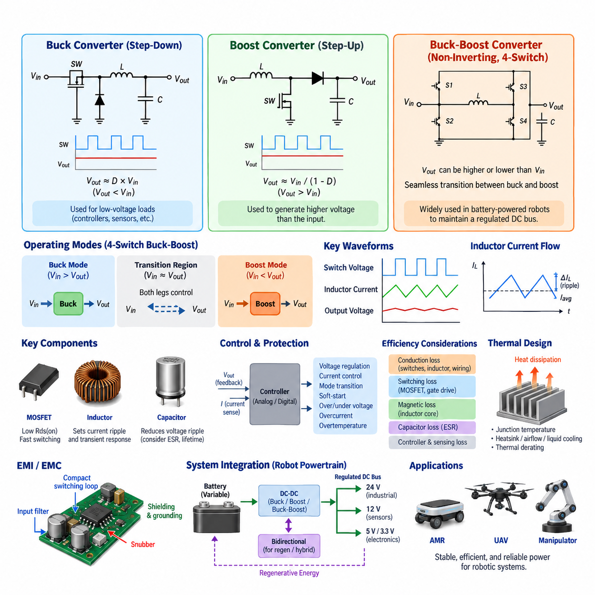
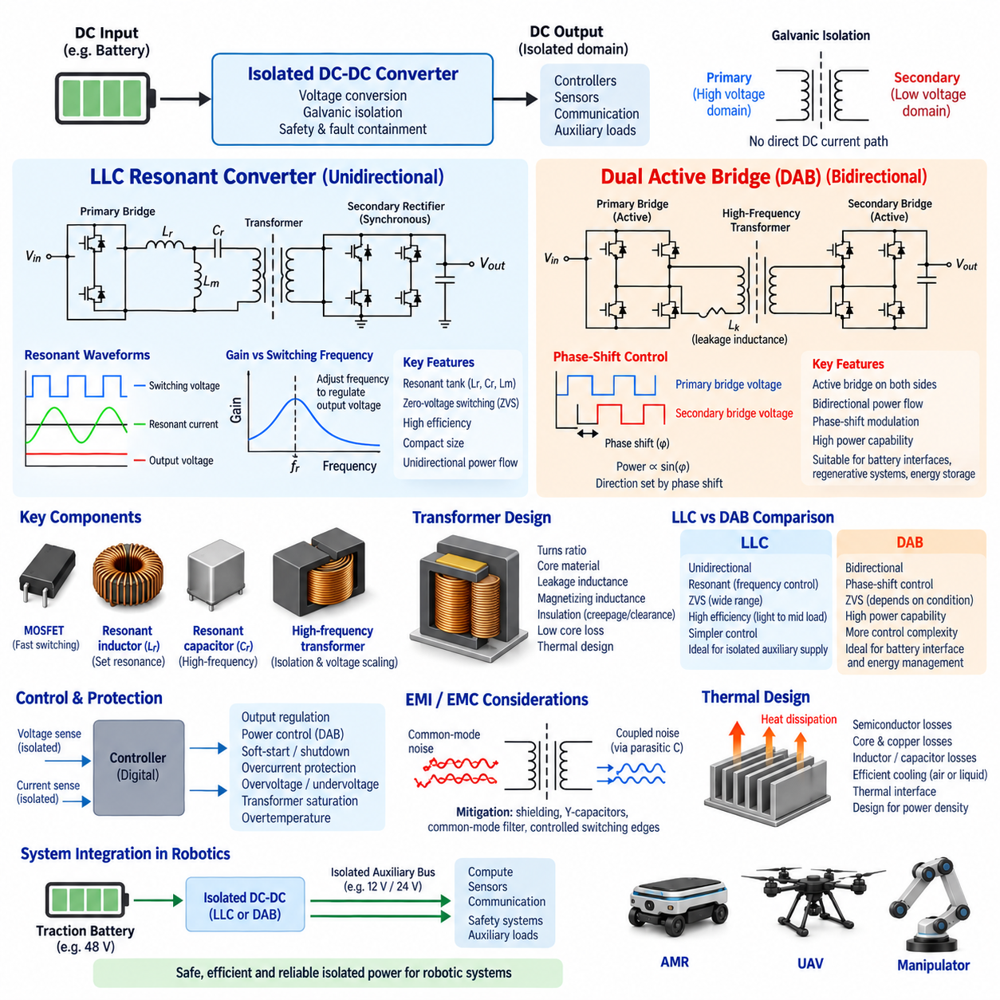
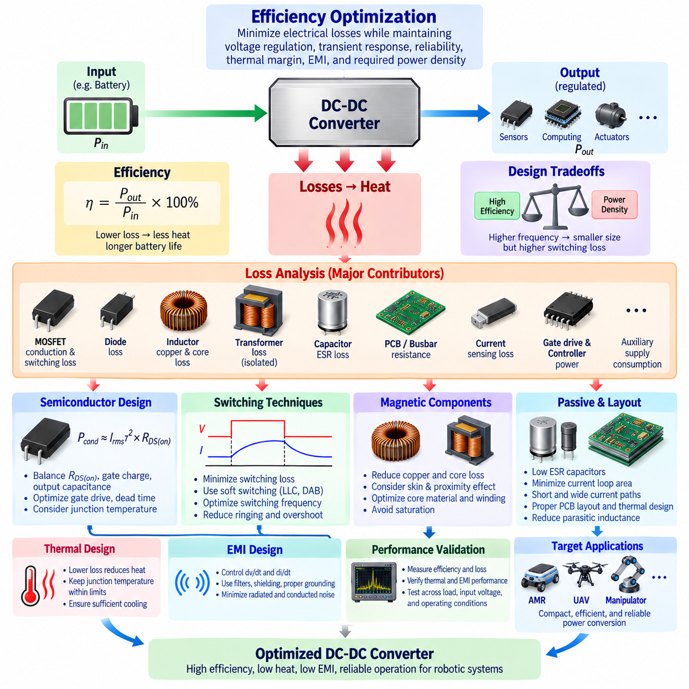
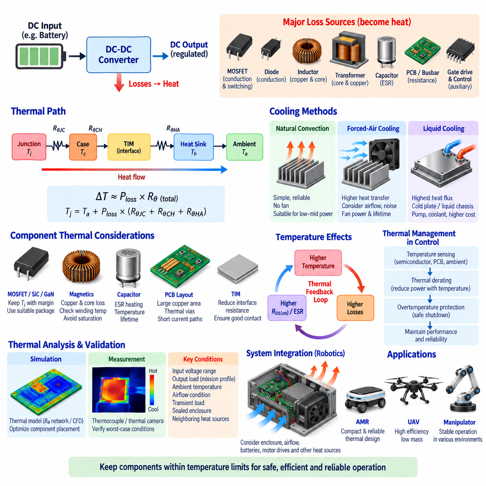
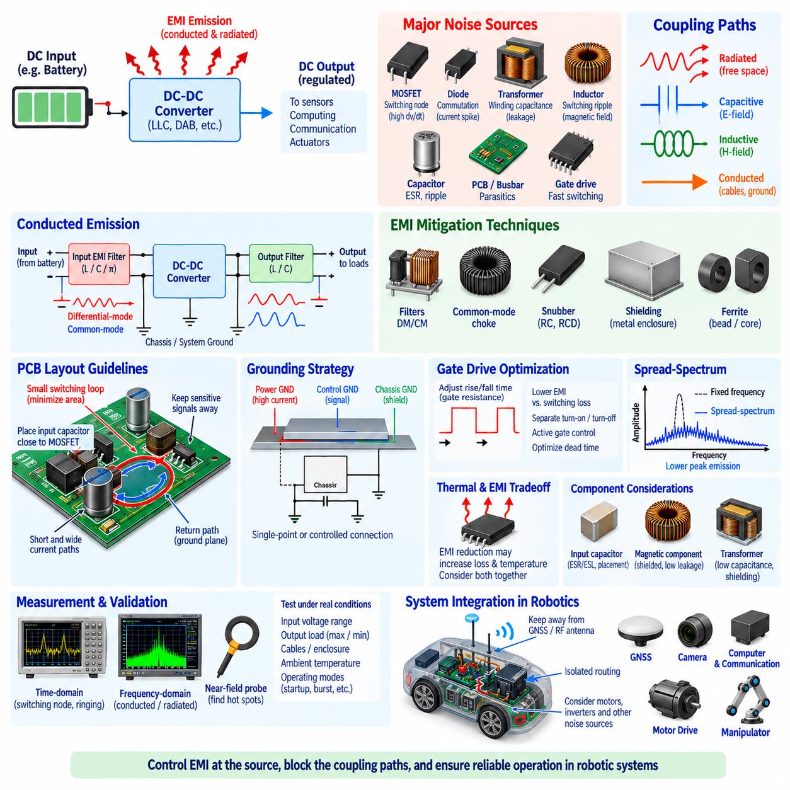

**Volume 11. Battery and Powertrain**


# Chapter 06. DC-DC Converter

##  

## 06.01. Buck/Boost/Buck-Boost Topology

{width="7.268055555555556in" height="7.268055555555556in"}

A buck converter is a non-isolated DC-DC topology designed to produce an output voltage lower than its input voltage. It regulates energy transfer by rapidly switching a semiconductor device and controlling the average voltage delivered through an inductor. In robotics power systems, buck conversion is commonly used when a battery bus must supply lower-voltage electronic loads such as controllers, sensors, communication modules, and embedded computers.

The basic buck topology consists of a controlled switching device, a freewheeling path, an inductor, an output capacitor, and the connected load. When the main switch is turned on, energy flows from the input source into the inductor and load. When the switch is turned off, the inductor maintains current through the freewheeling path. Repeated switching and filtering transform the pulsed switching waveform into a relatively stable DC output.

For an ideal buck converter operating in continuous conduction mode, the average output voltage is approximately proportional to the input voltage and duty ratio, expressed as Vout ≈ D × Vin. The duty ratio D represents the fraction of each switching period during which the main switch conducts. A feedback controller continuously adjusts this duty ratio to compensate for variations in battery voltage, load current, component tolerances, and operating conditions.

Modern synchronous buck converters replace the passive freewheeling diode with a controlled MOSFET. This substantially reduces conduction losses, particularly in low-voltage and high-current applications where diode forward-voltage loss would otherwise represent a significant percentage of transferred power. Precise dead-time control is required to prevent simultaneous conduction of the high-side and low-side switches, which could create destructive shoot-through current.

A boost converter performs the complementary function by generating an output voltage higher than its input voltage. During the switch-on interval, current increases through the inductor and electromagnetic energy is stored. When the switch turns off, the inductor releases this stored energy toward the output, adding its induced voltage to the input source. This process allows the converter to maintain a regulated output above the available source voltage.

For an ideal boost converter in continuous conduction mode, the relationship can be approximated as Vout ≈ Vin/(1-D). As the duty ratio increases, the theoretical voltage conversion ratio rises. Practical operation is limited by semiconductor ratings, inductor current, switching losses, control stability, thermal constraints, and parasitic resistance. Consequently, extreme duty ratios are generally avoided because current stress and efficiency degradation become increasingly severe.

Buck-boost conversion becomes important when the required output voltage can be either lower or higher than the instantaneous input voltage. Battery-powered robots are a typical example because battery terminal voltage changes with state of charge, load, temperature, chemistry, and transient current demand. A regulated DC bus may therefore require step-down operation at high battery voltage and step-up operation as the battery approaches its lower operating range.

The classical inverting buck-boost converter can provide both step-down and step-up conversion, but its output polarity is reversed relative to the input. Many robotic and automotive systems instead use non-inverting buck-boost architectures because they preserve common polarity and integrate more naturally into conventional DC power distribution. Four-switch synchronous buck-boost converters are particularly useful where efficiency, bidirectional capability, and wide voltage regulation are important.

A four-switch buck-boost stage can be understood as a buck switching leg and a boost switching leg connected through a common inductor. When the input voltage is sufficiently above the target output, the converter primarily behaves as a buck stage. When the input falls below the target, it transitions toward boost operation. Near the input-output crossover region, both switching legs may participate in controlling energy transfer and maintaining continuous regulation.

The transition between buck and boost regions is an important control challenge. Poor transition management can create output-voltage disturbances, increased ripple, circulating current, or sudden efficiency degradation. Advanced controllers therefore coordinate switch timing, duty ratios, current limits, and operating modes around the crossover point. Smooth transitions are particularly valuable for autonomous robots whose computing and sensing systems require uninterrupted, tightly regulated electrical power.

Inductor selection strongly influences all three converter classes. Inductance determines current ripple, transient response, peak current, magnetic size, and conduction loss. A smaller inductance can improve transient response and reduce physical size but generally increases ripple current. A larger inductance reduces ripple but may increase volume, resistance, and dynamic response time. Saturation current must remain safely above the maximum expected inductor current under abnormal transients.

Output capacitors complement the inductor by absorbing switching-frequency current and reducing output-voltage ripple. Their capacitance, equivalent series resistance, temperature characteristics, lifetime, and ripple-current capability must be considered together. Input capacitors are equally important because they provide a local high-frequency current path near the switching devices and prevent switching pulses from propagating excessively into the battery, wiring harness, or upstream power distribution system.

Switching frequency creates a fundamental engineering tradeoff. Increasing frequency allows smaller inductors and capacitors and can improve power density, but switching losses, gate-drive losses, magnetic core losses, and electromagnetic interference generally increase. Lower switching frequencies reduce some switching losses but require larger passive components. The optimum frequency therefore depends on power level, semiconductor technology, cooling capability, packaging constraints, efficiency targets, and EMC requirements.

MOSFETs are widely used in low- and medium-voltage robotic DC-DC converters because of their fast switching capability and relatively low conduction resistance. Silicon carbide and gallium nitride devices can provide advantages at higher voltage, frequency, temperature, or power-density requirements. Device selection must consider voltage margin, current rating, on-state resistance, switching energy, gate charge, thermal resistance, reverse conduction behavior, and short-circuit robustness.

Converter efficiency cannot be evaluated from semiconductor conduction loss alone. Total loss includes switching transitions, gate driving, inductor copper resistance, magnetic core loss, capacitor ESR, PCB and busbar resistance, sensing circuits, and controller consumption. Because robotic loads can vary dramatically between standby, computation, acceleration, manipulation, and peak actuator operation, efficiency should be evaluated across the complete expected operating envelope rather than only at rated power.

Control architecture typically combines voltage regulation with current monitoring and protection. Voltage-mode, current-mode, peak-current-mode, and average-current-mode strategies offer different dynamic characteristics. Digital control can additionally support programmable limits, telemetry, fault logging, operating-mode transitions, and communication with supervisory controllers. Regardless of implementation, loop bandwidth and compensation must provide adequate stability margin across expected input voltage and load conditions.

Transient response is especially important in robotics because electrical loads can change rapidly. Motor acceleration, steering actuators, manipulators, pumps, computing accelerators, and communication equipment may create abrupt power demands. The DC-DC converter must respond without allowing excessive bus droop or overshoot. Energy stored in inductors and capacitors provides immediate buffering while the control loop modifies switching behavior to establish the new steady-state operating point.

Protection functions normally include input undervoltage, output overvoltage, overcurrent, short-circuit protection, and overtemperature shutdown or derating. Soft-start limits inrush current during startup, while controlled shutdown can prevent undesirable bus transients. Reverse-current protection may also be necessary where multiple supplies or regenerative loads share a DC bus. Protection thresholds should coordinate with battery, BMS, fuse, PDU, wiring, and downstream load limits.

Thermal design directly determines sustainable converter power. Semiconductor junction temperature, inductor winding and core temperature, capacitor lifetime, PCB copper temperature, and connector heating must remain within acceptable limits. Heat spreading through copper planes, thermal vias, heat sinks, chassis interfaces, airflow, or liquid cooling may be required depending on power density. Thermal derating should account for worst-case ambient temperature and restricted cooling conditions.

Electromagnetic compatibility is another critical consequence of high-frequency switching. Rapid voltage and current transitions generate conducted and radiated emissions through parasitic capacitance, loop inductance, wiring, and common-mode paths. Compact switching loops, controlled gate slew rate, appropriate grounding, input and output filtering, shielding, snubbers, and careful PCB layout help prevent converter noise from degrading cameras, LiDAR, GNSS, IMUs, communication networks, or sensitive analog circuits.

In an AMR power architecture, a 48 V battery may feed multiple DC-DC stages that create regulated rails for 24 V industrial devices, 12 V sensors, and lower-voltage electronics. Buck conversion is appropriate when the battery remains above the required rail. A buck-boost converter becomes attractive when a tightly regulated intermediate bus must remain constant despite a battery voltage range that crosses the required output voltage during charge and discharge operation.

For UAV and mobile robotic platforms, converter mass and power density become particularly important. Every additional gram or cubic centimeter competes with battery capacity, payload, cooling equipment, and structural components. High-efficiency synchronous topologies can reduce both electrical loss and cooling mass. However, aggressive power-density optimization must not compromise transient capability, EMI performance, insulation, thermal margin, component lifetime, or fault containment.

Bidirectional buck-boost converters extend the topology by allowing controlled power flow in both directions. This is useful when energy must move between battery and DC bus during propulsion, regenerative braking, energy buffering, or hybrid power operation. Instead of treating the converter only as a voltage adapter, bidirectional control allows it to become an active energy-management interface capable of regulating current, voltage, and power flow between electrical domains.

The selected topology must ultimately be evaluated at system level rather than as an isolated converter circuit. Battery voltage range, BMS limits, peak and continuous load, regenerative energy, harness voltage drop, protection coordination, thermal environment, EMC constraints, efficiency, reliability, packaging, and service requirements all influence the design. Within the Battery and Powertrain structure, buck, boost, and buck-boost topology therefore forms the foundation for subsequent isolated conversion, efficiency, thermal, and EMI engineering.

벅 컨버터(Buck Converter)는 입력 전압보다 낮은 출력 전압을 생성하도록 설계된 비절연형 직류-직류 토폴로지(Non-Isolated DC-DC Topology)이다. 반도체 스위칭 소자(Semiconductor Switching Device)를 빠르게 온·오프하고 인덕터(Inductor)를 통해 전달되는 평균 전압을 제어하여 에너지 전달을 조절한다. 로봇 전력 시스템에서는 배터리 버스(Battery Bus)에서 제어기, 센서, 통신 모듈 및 임베디드 컴퓨터와 같은 저전압 전자 부하에 전력을 공급할 때 벅 변환(Buck Conversion)이 널리 사용된다.

기본적인 벅 토폴로지(Buck Topology)는 제어 스위칭 소자(Controlled Switching Device), 프리휠링 경로(Freewheeling Path), 인덕터(Inductor), 출력 커패시터(Output Capacitor), 그리고 연결된 부하(Load)로 구성된다. 메인 스위치(Main Switch)가 켜지면 입력 전원에서 인덕터와 부하로 에너지가 전달된다. 스위치가 꺼지면 인덕터는 프리휠링 경로를 통해 전류를 계속 유지한다. 이러한 반복적인 스위칭과 필터링을 통해 펄스 형태의 스위칭 파형이 비교적 안정적인 직류 출력으로 변환된다.

연속 전도 모드(Continuous Conduction Mode, CCM)에서 동작하는 이상적인 벅 컨버터의 평균 출력 전압은 입력 전압과 듀티비(Duty Ratio)에 비례하며, Vout ≈ D × Vin으로 표현할 수 있다. 듀티비 D는 각 스위칭 주기 동안 메인 스위치가 도통하는 시간의 비율을 의미한다. 피드백 제어기(Feedback Controller)는 배터리 전압, 부하 전류, 부품 공차 및 운전 조건의 변화에 대응하기 위해 이 듀티비를 지속적으로 조정한다.

현대적인 동기식 벅 컨버터(Synchronous Buck Converter)는 수동 프리휠링 다이오드(Passive Freewheeling Diode)를 제어 가능한 모스펫(MOSFET)으로 대체한다. 이를 통해 특히 다이오드의 순방향 전압 손실이 전체 전달 전력에서 큰 비중을 차지하는 저전압·대전류 환경에서 도통 손실(Conduction Loss)을 크게 줄일 수 있다. 동시에 상측 및 하측 스위치가 함께 도통하여 파괴적인 관통 전류(Shoot-Through Current)가 발생하지 않도록 정밀한 데드타임 제어(Dead-Time Control)가 필요하다.

부스트 컨버터(Boost Converter)는 입력 전압보다 높은 출력 전압을 생성하는 상보적인 기능을 수행한다. 스위치가 켜져 있는 동안 인덕터 전류가 증가하면서 전자기 에너지가 저장된다. 스위치가 꺼지면 인덕터는 저장된 에너지를 출력 측으로 방출하며, 이 과정에서 인덕터의 유도 전압이 입력 전압에 더해진다. 이를 통해 컨버터는 공급 가능한 입력 전압보다 높은 전압으로 출력을 안정적으로 유지할 수 있다.

연속 전도 모드에서 이상적인 부스트 컨버터의 관계는 Vout ≈ Vin/(1-D)로 근사할 수 있다. 듀티비가 증가할수록 이론적인 전압 변환비(Voltage Conversion Ratio)도 증가한다. 그러나 실제 동작은 반도체 정격, 인덕터 전류, 스위칭 손실, 제어 안정성, 열적 제약 및 기생 저항(Parasitic Resistance)에 의해 제한된다. 따라서 지나치게 높은 듀티비는 전류 스트레스(Current Stress)와 효율 저하가 급격하게 증가하기 때문에 일반적으로 피하는 것이 바람직하다.

벅-부스트 변환(Buck-Boost Conversion)은 요구되는 출력 전압이 순간적인 입력 전압보다 낮을 수도 있고 높을 수도 있는 경우 중요하다. 배터리 구동 로봇(Battery-Powered Robot)이 대표적인 사례로, 배터리 단자 전압은 충전 상태(State of Charge, SOC), 부하, 온도, 배터리 화학 특성 및 순간적인 전류 요구에 따라 변화한다. 따라서 안정화된 직류 버스(Regulated DC Bus)는 배터리 전압이 높을 때 강압 동작을 수행하고, 배터리가 낮은 동작 전압 영역에 접근하면 승압 동작을 수행해야 할 수 있다.

고전적인 반전형 벅-부스트 컨버터(Inverting Buck-Boost Converter)는 강압과 승압을 모두 수행할 수 있지만 출력 극성이 입력에 대해 반전된다. 많은 로봇 및 자동차 시스템에서는 동일한 극성을 유지하고 기존 직류 전력 분배 시스템과 보다 자연스럽게 통합할 수 있는 비반전형 벅-부스트 구조(Non-Inverting Buck-Boost Architecture)를 사용한다. 특히 4스위치 동기식 벅-부스트 컨버터(Four-Switch Synchronous Buck-Boost Converter)는 높은 효율, 양방향 전력 전달 및 넓은 전압 조정 범위가 요구되는 환경에서 유용하다.

4스위치 벅-부스트 스테이지(Four-Switch Buck-Boost Stage)는 공통 인덕터를 통해 연결된 벅 스위칭 레그(Buck Switching Leg)와 부스트 스위칭 레그(Boost Switching Leg)로 이해할 수 있다. 입력 전압이 목표 출력 전압보다 충분히 높으면 컨버터는 주로 벅 모드(Buck Mode)로 동작한다. 입력 전압이 목표값보다 낮아지면 부스트 모드(Boost Mode)로 전환된다. 입력과 출력 전압이 근접하는 전환 영역에서는 두 스위칭 레그가 함께 에너지 전달을 제어하면서 연속적인 전압 조정을 유지할 수 있다.

벅 영역과 부스트 영역 사이의 전환은 중요한 제어 과제이다. 전환 제어가 적절하지 않으면 출력 전압 변동, 리플(Ripple) 증가, 순환 전류(Circulating Current) 또는 갑작스러운 효율 저하가 발생할 수 있다. 따라서 고급 제어기는 전환 지점 주변에서 스위치 타이밍, 듀티비, 전류 제한 및 동작 모드를 조정한다. 이러한 부드러운 전환(Smooth Transition)은 컴퓨팅 및 센싱 시스템에 중단 없는 안정적인 전력이 필요한 자율 로봇(Autonomous Robot)에서 특히 중요하다.

인덕터 선정(Inductor Selection)은 세 가지 컨버터 유형 모두의 성능에 큰 영향을 미친다. 인덕턴스(Inductance)는 전류 리플, 과도 응답(Transient Response), 최대 전류, 자기 부품의 크기 및 도통 손실을 결정한다. 작은 인덕턴스는 과도 응답을 개선하고 물리적 크기를 줄일 수 있지만 일반적으로 리플 전류를 증가시킨다. 큰 인덕턴스는 리플을 감소시키지만 부피, 저항 및 동적 응답 시간을 증가시킬 수 있다. 포화 전류(Saturation Current)는 비정상적인 과도 상태에서 예상되는 최대 인덕터 전류보다 충분히 높아야 한다.

출력 커패시터(Output Capacitor)는 스위칭 주파수의 전류를 흡수하고 출력 전압 리플을 감소시킴으로써 인덕터의 기능을 보완한다. 커패시턴스(Capacitance), 등가 직렬 저항(Equivalent Series Resistance, ESR), 온도 특성, 수명 및 리플 전류 허용 능력을 종합적으로 고려해야 한다. 입력 커패시터(Input Capacitor) 역시 스위칭 소자 근처에 국부적인 고주파 전류 경로를 제공하고 스위칭 펄스가 배터리, 와이어 하네스(Wiring Harness), 상위 전력 분배 시스템으로 과도하게 전달되는 것을 방지하기 때문에 중요하다.

스위칭 주파수(Switching Frequency)는 기본적인 설계 절충 관계(Engineering Tradeoff)를 형성한다. 주파수를 높이면 더 작은 인덕터와 커패시터를 사용할 수 있어 전력 밀도(Power Density)를 향상시킬 수 있지만, 스위칭 손실, 게이트 구동 손실(Gate-Drive Loss), 자기 코어 손실(Magnetic Core Loss) 및 전자기 간섭(Electromagnetic Interference, EMI)은 일반적으로 증가한다. 반대로 낮은 스위칭 주파수는 일부 스위칭 손실을 감소시키지만 더 큰 수동 부품을 필요로 한다. 따라서 최적 주파수는 전력 수준, 반도체 기술, 냉각 성능, 패키징 제약, 효율 목표 및 전자파 적합성(EMC) 요구사항에 따라 결정된다.

모스펫(MOSFET)은 빠른 스위칭 능력과 비교적 낮은 도통 저항으로 인해 저전압 및 중전압 로봇용 직류-직류 컨버터에 널리 사용된다. 실리콘 카바이드(Silicon Carbide, SiC)와 질화갈륨(Gallium Nitride, GaN) 소자는 더 높은 전압, 주파수, 온도 또는 전력 밀도가 요구되는 환경에서 장점을 제공할 수 있다. 소자 선정 시에는 전압 마진, 전류 정격, 온상태 저항(On-State Resistance), 스위칭 에너지, 게이트 전하(Gate Charge), 열저항, 역방향 도통 특성 및 단락 회로 내성을 함께 고려해야 한다.

컨버터 효율(Converter Efficiency)은 반도체의 도통 손실만으로 평가할 수 없다. 전체 손실에는 스위칭 천이 손실, 게이트 구동 손실, 인덕터 동선 저항, 자기 코어 손실, 커패시터 ESR, 인쇄회로기판(PCB)과 버스바(Busbar)의 저항, 센싱 회로 및 제어기의 소비 전력이 포함된다. 로봇 부하는 대기, 연산, 가속, 조작 및 액추에이터 최대 출력 상태에 따라 크게 변화할 수 있으므로 효율은 정격 출력 한 지점이 아니라 예상되는 전체 운전 영역에서 평가해야 한다.

제어 아키텍처(Control Architecture)는 일반적으로 전압 조정 기능과 전류 감시 및 보호 기능을 결합한다. 전압 모드(Voltage Mode), 전류 모드(Current Mode), 피크 전류 모드(Peak-Current Mode), 평균 전류 모드(Average-Current Mode)는 서로 다른 동적 특성을 제공한다. 디지털 제어(Digital Control)를 적용하면 프로그래밍 가능한 제한값, 텔레메트리(Telemetry), 고장 기록, 운전 모드 전환 및 상위 제어기와의 통신 기능을 추가할 수 있다. 구현 방식과 관계없이 제어 루프 대역폭과 보상 설계는 예상되는 입력 전압 및 부하 조건 전반에서 충분한 안정성 여유를 제공해야 한다.

과도 응답(Transient Response)은 전기 부하가 빠르게 변할 수 있는 로봇 시스템에서 특히 중요하다. 모터 가속, 조향 액추에이터, 매니퓰레이터(Manipulator), 펌프, 컴퓨팅 가속기 및 통신 장비는 급격한 전력 요구를 발생시킬 수 있다. 직류-직류 컨버터는 과도한 버스 전압 강하(Bus Droop)나 오버슈트(Overshoot)를 발생시키지 않으면서 이에 대응해야 한다. 인덕터와 커패시터에 저장된 에너지는 즉각적인 버퍼링을 제공하고, 제어 루프는 스위칭 동작을 변경하여 새로운 정상 상태 운전점을 형성한다.

보호 기능(Protection Function)은 일반적으로 입력 저전압, 출력 과전압, 과전류, 단락 회로 보호 및 과열 차단 또는 디레이팅(Derating)을 포함한다. 소프트 스타트(Soft-Start)는 시동 과정에서 돌입 전류(Inrush Current)를 제한하며, 제어된 종료(Controlled Shutdown)는 불필요한 버스 과도 현상을 방지할 수 있다. 여러 전원이나 회생 부하가 하나의 직류 버스를 공유하는 경우 역전류 보호(Reverse-Current Protection)도 필요할 수 있다. 보호 임계값은 배터리, 배터리 관리 시스템(BMS), 퓨즈, 전력 분배 장치(PDU), 배선 및 하위 부하의 제한 조건과 상호 조정되어야 한다.

열 설계(Thermal Design)는 컨버터가 지속적으로 공급할 수 있는 전력을 직접 결정한다. 반도체 접합부 온도, 인덕터 권선 및 코어 온도, 커패시터 수명, PCB 구리층 온도 및 커넥터 발열은 허용 범위 내에서 유지되어야 한다. 전력 밀도에 따라 구리 평면, 열 비아(Thermal Via), 방열판(Heat Sink), 섀시 열전달 구조, 공랭 또는 수랭을 통한 열 확산이 필요할 수 있다. 열 디레이팅(Thermal Derating)은 최악 조건의 주변 온도와 냉각 성능이 제한되는 운전 환경까지 고려해야 한다.

전자파 적합성(Electromagnetic Compatibility, EMC)은 고주파 스위칭에서 발생하는 또 다른 핵심 설계 요소이다. 빠른 전압 및 전류 변화는 기생 커패시턴스, 루프 인덕턴스, 배선 및 공통 모드 경로(Common-Mode Path)를 통해 전도성 및 방사성 방출을 생성한다. 스위칭 루프 최소화, 게이트 슬루율(Gate Slew Rate) 제어, 적절한 접지, 입출력 필터링, 차폐, 스너버(Snubber) 및 신중한 PCB 레이아웃을 적용하면 컨버터 잡음이 카메라, 라이다(LiDAR), 위성항법시스템(GNSS), 관성측정장치(IMU), 통신 네트워크 또는 민감한 아날로그 회로의 성능을 저하시키는 것을 방지할 수 있다.

자율이동로봇(AMR) 전력 아키텍처에서는 48 V 배터리가 여러 직류-직류 변환 단계를 통해 24 V 산업용 장치, 12 V 센서 및 더 낮은 전압의 전자장치를 위한 안정화 전원 레일을 공급할 수 있다. 배터리 전압이 요구되는 전원 레일보다 항상 높다면 벅 변환이 적합하다. 반면 충·방전 과정에서 배터리 전압 범위가 요구 출력 전압의 위아래를 모두 통과하면서 일정한 중간 직류 버스를 유지해야 한다면 벅-부스트 컨버터가 효과적인 선택이 된다.

무인항공기(UAV) 및 이동형 로봇 플랫폼에서는 컨버터 질량과 전력 밀도가 특히 중요하다. 추가되는 모든 질량과 부피는 배터리 용량, 탑재량(Payload), 냉각 장치 및 구조 부품과 경쟁 관계를 형성한다. 고효율 동기식 토폴로지는 전기적 손실뿐만 아니라 냉각 시스템의 질량까지 줄일 수 있다. 그러나 공격적인 전력 밀도 최적화가 과도 응답 성능, EMI 성능, 절연, 열적 마진, 부품 수명 또는 고장 격리(Fault Containment)를 저하시켜서는 안 된다.

양방향 벅-부스트 컨버터(Bidirectional Buck-Boost Converter)는 양쪽 방향으로 제어된 전력 흐름을 가능하게 함으로써 기본 토폴로지를 확장한다. 이는 추진, 회생 제동(Regenerative Braking), 에너지 버퍼링(Energy Buffering) 또는 하이브리드 전력 운전 과정에서 배터리와 직류 버스 사이로 에너지를 양방향 전달해야 하는 경우 유용하다. 양방향 제어를 적용하면 컨버터는 단순한 전압 변환기를 넘어 서로 다른 전력 영역 사이에서 전류, 전압 및 전력 흐름을 능동적으로 조절하는 에너지 관리 인터페이스(Energy-Management Interface)로 기능할 수 있다.

최종적인 토폴로지 선정(Topology Selection)은 개별 컨버터 회로만이 아니라 전체 시스템 수준에서 평가되어야 한다. 배터리 전압 범위, BMS 제한, 최대 및 연속 부하, 회생 에너지, 하네스 전압 강하, 보호 협조(Protection Coordination), 열 환경, EMC 제약, 효율, 신뢰성, 패키징 및 정비 요구사항이 모두 설계에 영향을 미친다. 따라서 배터리 및 파워트레인(Battery and Powertrain) 구조에서 벅, 부스트 및 벅-부스트 토폴로지는 이후의 절연형 변환(Isolated Conversion), 효율 최적화, 열 설계 및 EMI 설계를 위한 기본 토대를 형성한다.

##  

## 06.02. Isolated DC-DC (LLC, DAB)

{width="7.268055555555556in" height="7.268055555555556in"}

An isolated DC-DC converter transfers electrical power between two DC domains while providing galvanic isolation between the input and output. Unlike non-isolated buck or boost stages, isolated converters use a high-frequency transformer as part of the energy-transfer path. This separation prevents direct DC current flow between domains while enabling voltage conversion, grounding separation, fault containment, and improved system-level safety.

Galvanic isolation becomes important when different electrical subsystems operate with incompatible ground references or when hazardous energy must be separated from low-voltage electronics. In robotic platforms, an isolated converter can separate a traction battery from control electronics, sensors, communication equipment, or auxiliary power networks. Isolation also helps control common-mode current paths and prevents some faults from propagating directly across power domains.

The transformer provides both isolation and voltage scaling. Its turns ratio establishes a fundamental relationship between primary-side and secondary-side voltage, while switching modulation determines the actual transferred power. Because the transformer operates at a much higher frequency than conventional line-frequency transformers, its magnetic components can be considerably smaller. Higher frequency therefore enables compact power conversion, although magnetic, switching, thermal, and EMI losses become increasingly important.

Isolation requirements influence transformer construction, PCB layout, connector selection, and mechanical packaging. Creepage distance, clearance distance, insulation materials, dielectric strength, pollution level, operating voltage, transient overvoltage, and environmental conditions must be considered together. Functional isolation may be sufficient for some internal power domains, whereas safety-related architectures can require reinforced or equivalent insulation strategies according to applicable system requirements.

The LLC resonant converter is a widely used isolated topology for efficient unidirectional power conversion. Its resonant network typically contains a resonant inductor Lr, resonant capacitor Cr, and the transformer magnetizing inductance Lm, which gives the topology its LLC designation. A switching bridge excites this resonant network, the transformer transfers energy across the isolation barrier, and the secondary stage rectifies and filters the resulting high-frequency waveform.

Unlike hard-switched converters, the LLC topology intentionally uses resonance to shape current and voltage waveforms. Switching frequency is normally adjusted relative to the resonant frequency to regulate output voltage and transferred power. The resonant tank changes its impedance with frequency, allowing the controller to modify conversion gain without relying exclusively on conventional pulse-width modulation. This behavior enables efficient operation across a useful range of input and load conditions.

One of the major advantages of LLC conversion is the possibility of zero-voltage switching (Zero-Voltage Switching, ZVS) for primary-side MOSFETs. Resonant current can charge and discharge device capacitances before the switching transition, allowing the MOSFET to turn on when its drain-to-source voltage is near zero. This substantially reduces switching loss and can permit higher switching frequencies while limiting semiconductor heating and electromagnetic emissions.

Secondary-side devices may also achieve favorable soft-switching conditions, including reduced-current switching depending on operating point and implementation. Synchronous rectification can replace conventional diodes with controlled MOSFETs to reduce secondary conduction losses, especially where output voltage is relatively low and current is high. Correct timing remains essential because inappropriate synchronous switching can increase circulating current, reverse current, and device stress.

LLC converter behavior depends strongly on resonant component ratios, transformer turns ratio, quality factor, load condition, and switching-frequency range. The designer must ensure that the required voltage gain is available across the complete input-voltage and output-load envelope. Excessively wide frequency operation can increase circulating energy or reduce efficiency, so transformer and resonant-tank parameters should be optimized together rather than designed as independent components.

The Dual Active Bridge (DAB) is another important isolated DC-DC topology, particularly when bidirectional power transfer is required. A conventional DAB consists of an active full bridge on each side of a high-frequency transformer. Both bridges generate controlled AC square-wave voltages, and power is transferred through transformer leakage inductance or an intentionally added series inductance according to the phase relationship between the two bridge waveforms.

In basic single-phase-shift control, the phase difference between the primary and secondary bridge switching waveforms determines the magnitude and direction of transferred power. When the relative phase changes sign, the direction of energy flow can also reverse without changing the fundamental hardware structure. This makes the DAB particularly attractive for battery interfaces, regenerative systems, energy storage, bidirectional charging, and DC microgrid architectures.

The transformer turns ratio in a DAB is generally selected so that the reflected voltages on both sides are reasonably matched around the primary operating region. Large voltage mismatch can increase circulating current and reactive power, causing unnecessary RMS current and conduction loss even when useful transferred power is relatively small. Selecting an appropriate turns ratio is therefore essential for achieving high efficiency over the intended battery and bus voltage ranges.

More advanced DAB modulation techniques extend basic phase-shift control. Dual-phase-shift, triple-phase-shift, and related modulation strategies introduce additional switching degrees of freedom that can reduce circulating current, extend soft-switching regions, or improve efficiency under light-load and wide-voltage-ratio conditions. The resulting control is more complex, but digital controllers can calculate switching patterns based on voltage ratio, requested power, current limits, and thermal conditions.

Soft switching is also a major design objective for DAB converters. Under appropriate voltage, load, inductance, and phase-shift conditions, bridge switches can achieve zero-voltage switching and substantially reduce transition losses. However, ZVS may not naturally occur across the entire operating envelope. Light load or strongly mismatched bridge voltages can reduce the available commutation current, requiring careful modulation design to balance switching loss against circulating-current loss.

LLC and DAB converters therefore address different system priorities despite sharing transformer-based high-frequency isolation. LLC is particularly attractive for highly efficient, compact, predominantly unidirectional conversion where a regulated output is required. DAB is especially attractive where bidirectional energy transfer, controllable power flow, and flexible interaction between two DC buses are fundamental requirements. The application determines which advantages are more important.

Semiconductor technology strongly affects both architectures. Silicon MOSFETs remain practical across many low- and medium-voltage applications, while silicon carbide (SiC) devices provide advantages at higher bus voltages and power levels. Gallium nitride (GaN) devices can enable very fast switching and high power density in suitable voltage ranges. Device choice must consider switching energy, conduction resistance, output capacitance, gate characteristics, thermal behavior, and short-circuit requirements.

Transformer design is often one of the most challenging aspects of isolated conversion. Core material, core geometry, turns ratio, winding arrangement, flux density, copper loss, skin effect, proximity effect, leakage inductance, magnetizing inductance, insulation, and thermal paths interact with converter performance. In LLC designs, magnetizing and leakage-related parameters influence resonance, while in DAB designs leakage inductance can intentionally become part of the power-transfer mechanism.

High-frequency magnetic design must also account for saturation and core loss. Excessive volt-seconds can drive the transformer core toward saturation, producing rapidly increasing magnetizing current and potentially damaging switching devices. At the same time, increasing switching frequency can raise hysteresis and eddy-current losses. Magnetic design therefore requires coordinated selection of core material, switching frequency, flux-density swing, winding structure, cooling, and operating margin.

Isolation does not automatically eliminate electromagnetic interference. Fast switching transitions generate common-mode displacement currents through transformer interwinding capacitance and other parasitic paths across the isolation barrier. These currents can couple noise into secondary electronics even though no conductive DC path exists. Winding arrangement, electrostatic shielding, Y-capacitor strategy, common-mode filtering, controlled switching edges, grounding, and PCB geometry therefore remain important EMC design considerations.

Control and protection must coordinate both sides of the isolation barrier. Depending on architecture, voltage and current feedback can cross the barrier through digital isolators, isolated amplifiers, transformers, or optically isolated interfaces. Protection normally addresses overcurrent, overvoltage, undervoltage, transformer saturation, overtemperature, short circuit, and abnormal switching conditions. Bidirectional DAB systems additionally require controlled management of power direction and reverse-energy events.

Startup and shutdown deserve particular attention because energy stored in resonant elements, transformers, capacitors, and connected DC buses can create significant transient currents. Pre-charge, soft-start, controlled frequency or phase ramping, discharge paths, and fault-state sequencing can prevent excessive stress. In multi-domain robotic architectures, the DC-DC converter should coordinate startup with the battery management system, power distribution unit, downstream controllers, and supervisory power manager.

Thermal performance ultimately limits continuous converter output. Semiconductor conduction and switching losses, transformer copper and core losses, resonant-inductor losses, capacitor ESR, busbar resistance, and PCB conduction losses all become heat. High conversion efficiency reduces cooling requirements, but compact converters can still exhibit high local heat flux. Thermal interfaces, heat spreaders, chassis conduction, airflow, or liquid cooling must therefore be designed according to the required power density.

For an AMR, an isolated LLC converter can provide a stable auxiliary DC rail from the main traction battery while maintaining electrical separation between propulsion and sensitive electronics. Such separation can be valuable for computing, perception, communication, or safety-related subsystems. Where power normally flows from the battery toward auxiliary loads, the LLC architecture offers an effective combination of high efficiency, isolation, and compact high-frequency conversion.

A DAB becomes more attractive when a robotic power architecture requires energy to flow in either direction between two DC domains. Examples include battery-to-DC-bus interfaces, regenerative energy routing, hybrid energy storage, supercapacitor integration, or systems containing multiple battery domains. The converter can then regulate not only voltage but also commanded power flow, allowing the supervisory energy-management system to actively distribute energy according to operating conditions.

In UAV and high-power mobile platforms, isolated conversion must balance safety, mass, efficiency, thermal performance, and power density. High-frequency transformers and soft-switching architectures can reduce magnetic and cooling mass, but insulation distance and dielectric requirements cannot simply be reduced for packaging convenience. Mechanical vibration, altitude, humidity, contamination, temperature variation, and cooling availability should also be incorporated into the converter design envelope.

The choice between LLC and DAB should therefore begin with the required power-flow architecture. A predominantly one-way isolated supply with high efficiency and tightly controlled output often favors LLC. A system requiring bidirectional transfer and active power exchange between battery and DC buses often favors DAB. Voltage range, power level, isolation requirement, switching technology, transformer design, cooling, EMI, control complexity, reliability, and cost must then be evaluated together.

Within the Battery and Powertrain architecture, isolated LLC and DAB converters extend basic DC-DC conversion into electrically separated and potentially bidirectional power domains. Their successful implementation depends not only on selecting a circuit topology but on coordinating semiconductor switching, resonant or leakage inductance, transformer design, control, protection, thermal management, and EMC. These principles provide the foundation for subsequent converter efficiency, thermal design, and EMI engineering.

절연형 직류-직류 컨버터(Isolated DC-DC Converter)는 입력과 출력 사이에 갈바닉 절연(Galvanic Isolation)을 제공하면서 두 직류 전력 영역 사이에서 전기 에너지를 전달한다. 비절연형 벅(Buck) 또는 부스트(Boost) 스테이지와 달리 절연형 컨버터는 에너지 전달 경로에 고주파 변압기(High-Frequency Transformer)를 사용한다. 이러한 분리는 전력 영역 사이의 직접적인 직류 전류 흐름을 차단하면서 전압 변환, 접지 분리, 고장 격리 및 시스템 수준의 안전성 향상을 가능하게 한다.

갈바닉 절연(Galvanic Isolation)은 서로 다른 전기 서브시스템이 호환되지 않는 접지 기준(Ground Reference)을 사용하거나 위험한 에너지를 저전압 전자장치로부터 분리해야 하는 경우 중요하다. 로봇 플랫폼에서는 절연형 컨버터를 이용하여 구동용 배터리(Traction Battery)를 제어 전자장치, 센서, 통신 장비 또는 보조 전력 네트워크로부터 분리할 수 있다. 절연은 또한 공통 모드 전류 경로(Common-Mode Current Path)를 제어하고 일부 고장이 전력 영역 사이로 직접 전파되는 것을 방지하는 데 도움이 된다.

변압기(Transformer)는 절연과 전압 변환을 동시에 제공한다. 권선비(Turns Ratio)는 1차 측과 2차 측 전압 사이의 기본적인 관계를 결정하며, 스위칭 변조(Switching Modulation)는 실제 전달되는 전력을 결정한다. 변압기는 기존의 상용 주파수 변압기보다 훨씬 높은 주파수에서 동작하므로 자기 부품(Magnetic Component)의 크기를 상당히 줄일 수 있다. 따라서 높은 주파수는 소형 전력 변환을 가능하게 하지만 자기 손실, 스위칭 손실, 열 손실 및 전자파 간섭(EMI)의 중요성도 증가시킨다.

절연 요구사항(Isolation Requirement)은 변압기 구조, 인쇄회로기판(PCB) 레이아웃, 커넥터 선정 및 기계적 패키징에 영향을 미친다. 연면거리(Creepage Distance), 공간거리(Clearance Distance), 절연 재료, 절연 내력(Dielectric Strength), 오염도, 동작 전압, 과도 과전압 및 환경 조건을 종합적으로 고려해야 한다. 일부 내부 전력 영역에서는 기능 절연(Functional Isolation)만으로 충분할 수 있지만, 안전 관련 아키텍처에서는 해당 시스템 요구사항에 따라 강화 절연(Reinforced Insulation) 또는 이에 상응하는 절연 전략이 필요할 수 있다.

LLC 공진형 컨버터(LLC Resonant Converter)는 효율적인 단방향 전력 변환을 위해 널리 사용되는 절연형 토폴로지이다. 공진 네트워크(Resonant Network)는 일반적으로 공진 인덕터(Resonant Inductor) Lr, 공진 커패시터(Resonant Capacitor) Cr, 그리고 변압기의 자화 인덕턴스(Magnetizing Inductance) Lm으로 구성되며, 이러한 구성에서 LLC라는 명칭이 유래한다. 스위칭 브리지(Switching Bridge)가 공진 네트워크를 구동하고, 변압기가 절연 장벽을 통해 에너지를 전달하며, 2차 측 스테이지가 생성된 고주파 파형을 정류하고 필터링한다.

하드 스위칭 컨버터(Hard-Switched Converter)와 달리 LLC 토폴로지는 공진(Resonance)을 의도적으로 이용하여 전류와 전압 파형을 형성한다. 출력 전압과 전달 전력을 조절하기 위해 일반적으로 공진 주파수(Resonant Frequency)를 기준으로 스위칭 주파수(Switching Frequency)를 조정한다. 공진 탱크(Resonant Tank)의 임피던스는 주파수에 따라 변화하므로 제어기는 기존의 펄스 폭 변조(Pulse-Width Modulation, PWM)에만 의존하지 않고 변환 이득을 조절할 수 있다. 이를 통해 다양한 입력 및 부하 조건에서 높은 효율을 달성할 수 있다.

LLC 변환의 주요 장점 중 하나는 1차 측 모스펫(MOSFET)에 영전압 스위칭(Zero-Voltage Switching, ZVS)을 적용할 수 있다는 점이다. 공진 전류는 스위칭 천이 전에 소자의 커패시턴스를 충·방전하여 드레인-소스 전압(Drain-to-Source Voltage)이 거의 0인 상태에서 MOSFET을 턴온할 수 있도록 한다. 이를 통해 스위칭 손실을 크게 줄일 수 있으며, 반도체 발열과 전자기 방출을 제한하면서 더 높은 스위칭 주파수를 사용할 수 있다.

2차 측 소자 역시 운전점과 구현 방식에 따라 전류가 감소된 상태에서의 스위칭을 포함하여 유리한 소프트 스위칭(Soft Switching) 조건을 달성할 수 있다. 특히 출력 전압이 비교적 낮고 전류가 높은 경우 기존 다이오드를 제어 가능한 MOSFET으로 대체하는 동기 정류(Synchronous Rectification)를 적용하면 2차 측 도통 손실을 줄일 수 있다. 그러나 부적절한 동기 스위칭은 순환 전류, 역전류 및 소자 스트레스를 증가시킬 수 있으므로 정확한 타이밍 제어가 중요하다.

LLC 컨버터의 동작은 공진 부품의 비율, 변압기 권선비, 품질 계수(Quality Factor), 부하 조건 및 스위칭 주파수 범위에 크게 영향을 받는다. 설계자는 전체 입력 전압 및 출력 부하 운전 영역에서 요구되는 전압 이득(Voltage Gain)을 확보해야 한다. 지나치게 넓은 주파수 범위에서 동작하면 순환 에너지(Circulating Energy)가 증가하거나 효율이 저하될 수 있으므로 변압기와 공진 탱크의 파라미터를 서로 독립적인 부품으로 설계하기보다는 통합적으로 최적화해야 한다.

듀얼 액티브 브리지(Dual Active Bridge, DAB)는 특히 양방향 전력 전달(Bidirectional Power Transfer)이 필요한 경우 중요한 또 하나의 절연형 직류-직류 토폴로지이다. 일반적인 DAB는 고주파 변압기의 양쪽에 각각 능동형 풀 브리지(Active Full Bridge)를 배치한다. 두 브리지는 제어된 교류 구형파 전압을 생성하며, 두 브리지 파형 사이의 위상 관계에 따라 변압기의 누설 인덕턴스(Leakage Inductance) 또는 의도적으로 추가된 직렬 인덕턴스를 통해 전력이 전달된다.

기본적인 단일 위상 천이 제어(Single-Phase-Shift Control)에서는 1차 측과 2차 측 브리지의 스위칭 파형 사이의 위상차가 전달 전력의 크기와 방향을 결정한다. 상대적인 위상차의 부호가 변경되면 기본적인 하드웨어 구조를 변경하지 않고도 에너지 흐름의 방향을 반전시킬 수 있다. 이러한 특성으로 인해 DAB는 배터리 인터페이스, 회생 시스템(Regenerative System), 에너지 저장 장치, 양방향 충전(Bidirectional Charging) 및 직류 마이크로그리드(DC Microgrid) 아키텍처에 특히 적합하다.

DAB의 변압기 권선비(Transformer Turns Ratio)는 일반적으로 주요 운전 영역에서 양쪽 브리지의 환산 전압(Reflected Voltage)이 적절하게 일치하도록 선정한다. 전압 불일치가 크면 유효 전달 전력이 비교적 작더라도 순환 전류와 무효 전력(Reactive Power)이 증가하여 불필요한 실효값 전류(RMS Current)와 도통 손실을 발생시킬 수 있다. 따라서 목표로 하는 배터리 및 버스 전압 범위에서 높은 효율을 달성하려면 적절한 권선비 선정이 중요하다.

보다 발전된 DAB 변조 기법은 기본 위상 천이 제어를 확장한다. 이중 위상 천이(Dual-Phase-Shift), 삼중 위상 천이(Triple-Phase-Shift) 및 관련 변조 전략은 추가적인 스위칭 자유도를 제공하여 순환 전류를 감소시키고 소프트 스위칭 영역을 확장하거나 경부하 및 넓은 전압비 조건에서 효율을 향상시킬 수 있다. 이에 따라 제어는 더욱 복잡해지지만 디지털 제어기(Digital Controller)는 전압비, 요구 전력, 전류 제한 및 열 상태를 기반으로 스위칭 패턴을 계산할 수 있다.

소프트 스위칭(Soft Switching)은 DAB 컨버터에서도 중요한 설계 목표이다. 적절한 전압, 부하, 인덕턴스 및 위상 천이 조건에서는 브리지 스위치가 영전압 스위칭(ZVS)을 달성하여 천이 손실을 크게 줄일 수 있다. 그러나 전체 운전 영역에서 ZVS가 자연스럽게 유지되는 것은 아니다. 경부하 또는 브리지 전압의 불일치가 큰 조건에서는 정류에 필요한 전류가 감소할 수 있으므로 스위칭 손실과 순환 전류 손실 사이의 균형을 고려한 세밀한 변조 설계가 필요하다.

따라서 LLC와 DAB 컨버터는 모두 변압기 기반의 고주파 절연을 사용하지만 서로 다른 시스템 요구사항에 적합하다. LLC는 안정화된 출력이 필요하고 전력 흐름이 주로 단방향인 환경에서 고효율과 소형화를 달성하는 데 특히 유리하다. DAB는 양방향 에너지 전달, 제어 가능한 전력 흐름 및 두 직류 버스 사이의 유연한 상호작용이 핵심 요구사항인 경우 특히 적합하다. 실제 적용에서는 어떤 특성이 더 중요한지에 따라 토폴로지를 선택해야 한다.

반도체 기술(Semiconductor Technology)은 두 아키텍처의 성능에 큰 영향을 미친다. 실리콘 모스펫(Silicon MOSFET)은 다양한 저전압 및 중전압 응용 분야에서 여전히 실용적이며, 실리콘 카바이드(Silicon Carbide, SiC) 소자는 더 높은 버스 전압과 전력 수준에서 장점을 제공한다. 질화갈륨(Gallium Nitride, GaN) 소자는 적절한 전압 범위에서 매우 빠른 스위칭과 높은 전력 밀도를 구현할 수 있다. 소자 선정 시에는 스위칭 에너지, 도통 저항, 출력 커패시턴스, 게이트 특성, 열 특성 및 단락 회로 요구사항을 고려해야 한다.

변압기 설계(Transformer Design)는 절연형 전력 변환에서 가장 어려운 설계 요소 중 하나이다. 코어 재료, 코어 형상, 권선비, 권선 배치, 자속 밀도(Flux Density), 동손(Copper Loss), 표피 효과(Skin Effect), 근접 효과(Proximity Effect), 누설 인덕턴스, 자화 인덕턴스, 절연 및 열전달 경로가 컨버터 성능과 상호작용한다. LLC 설계에서는 자화 및 누설 관련 파라미터가 공진에 영향을 미치며, DAB 설계에서는 누설 인덕턴스 자체가 의도적으로 전력 전달 메커니즘의 일부가 될 수 있다.

고주파 자기 설계(High-Frequency Magnetic Design)에서는 포화(Saturation)와 코어 손실(Core Loss)도 고려해야 한다. 과도한 볼트-초(Volt-Seconds)는 변압기 코어를 포화 상태로 이동시켜 자화 전류를 급격히 증가시키고 스위칭 소자를 손상시킬 수 있다. 동시에 스위칭 주파수가 증가하면 히스테리시스 손실(Hysteresis Loss)과 와전류 손실(Eddy-Current Loss)이 증가할 수 있다. 따라서 자기 설계에서는 코어 재료, 스위칭 주파수, 자속 밀도 변화폭, 권선 구조, 냉각 및 운전 마진을 함께 선정해야 한다.

절연이 전자파 간섭(Electromagnetic Interference, EMI)을 자동으로 제거하는 것은 아니다. 빠른 스위칭 천이는 변압기의 권선 간 커패시턴스(Interwinding Capacitance)와 절연 장벽을 가로지르는 다른 기생 경로를 통해 공통 모드 변위 전류(Common-Mode Displacement Current)를 발생시킨다. 직접적인 직류 도통 경로가 없더라도 이러한 전류는 2차 측 전자장치에 잡음을 결합시킬 수 있다. 따라서 권선 구조, 정전 차폐(Electrostatic Shielding), Y 커패시터 전략, 공통 모드 필터링, 스위칭 에지 제어, 접지 및 PCB 형상은 전자파 적합성(EMC) 설계에서 여전히 중요하다.

제어 및 보호(Control and Protection)는 절연 장벽 양쪽을 상호 조정해야 한다. 아키텍처에 따라 전압 및 전류 피드백은 디지털 아이솔레이터(Digital Isolator), 절연 증폭기(Isolated Amplifier), 변압기 또는 광절연 인터페이스를 통해 절연 장벽을 통과할 수 있다. 보호 기능은 일반적으로 과전류, 과전압, 저전압, 변압기 포화, 과열, 단락 회로 및 비정상적인 스위칭 조건을 처리한다. 양방향 DAB 시스템에서는 전력 방향과 역방향 에너지 이벤트도 제어된 방식으로 관리해야 한다.

시동 및 종료(Startup and Shutdown)는 공진 소자, 변압기, 커패시터 및 연결된 직류 버스에 저장된 에너지가 상당한 과도 전류를 발생시킬 수 있으므로 특별한 주의가 필요하다. 프리차지(Pre-Charge), 소프트 스타트(Soft-Start), 제어된 주파수 또는 위상 램핑, 방전 경로 및 고장 상태 시퀀싱을 적용하여 과도한 스트레스를 방지할 수 있다. 다중 전력 영역을 갖는 로봇 아키텍처에서는 직류-직류 컨버터의 시동 과정을 배터리 관리 시스템(BMS), 전력 분배 장치(PDU), 하위 제어기 및 상위 전력 관리 시스템과 조정해야 한다.

열 성능(Thermal Performance)은 궁극적으로 컨버터의 연속 출력 전력을 제한한다. 반도체의 도통 및 스위칭 손실, 변압기의 동손과 코어 손실, 공진 인덕터 손실, 커패시터의 등가 직렬 저항(ESR), 버스바 저항 및 PCB 도통 손실은 모두 열로 변환된다. 높은 변환 효율은 냉각 요구량을 감소시키지만 소형 컨버터에서는 여전히 높은 국부 열유속(Local Heat Flux)이 발생할 수 있다. 따라서 요구되는 전력 밀도에 따라 열 인터페이스, 히트 스프레더(Heat Spreader), 섀시 전도, 공랭 또는 수랭을 설계해야 한다.

자율이동로봇(Autonomous Mobile Robot, AMR)에서는 절연형 LLC 컨버터를 사용하여 주 구동 배터리(Main Traction Battery)로부터 안정적인 보조 직류 전원 레일을 공급하면서 추진 시스템과 민감한 전자장치 사이의 전기적 분리를 유지할 수 있다. 이러한 분리는 컴퓨팅, 인지(Perception), 통신 또는 안전 관련 서브시스템에 유용할 수 있다. 전력이 일반적으로 배터리에서 보조 부하 방향으로 흐르는 시스템에서는 LLC 아키텍처가 높은 효율, 절연 및 소형 고주파 변환을 효과적으로 결합할 수 있다.

로봇 전력 아키텍처에서 두 직류 영역 사이로 에너지가 양방향으로 흐를 필요가 있다면 DAB가 더욱 적합하다. 대표적인 사례로 배터리-직류 버스 인터페이스, 회생 에너지 전달(Regenerative Energy Routing), 하이브리드 에너지 저장(Hybrid Energy Storage), 슈퍼커패시터(Supercapacitor) 통합 또는 여러 배터리 영역을 포함하는 시스템이 있다. 이 경우 컨버터는 전압뿐 아니라 명령된 전력 흐름까지 조절할 수 있어 상위 에너지 관리 시스템(Supervisory Energy-Management System)이 운전 조건에 따라 에너지를 능동적으로 분배할 수 있다.

무인항공기(Unmanned Aerial Vehicle, UAV)와 고출력 이동형 플랫폼에서 절연형 전력 변환은 안전성, 질량, 효율, 열 성능 및 전력 밀도 사이의 균형을 확보해야 한다. 고주파 변압기와 소프트 스위칭 아키텍처는 자기 부품 및 냉각 시스템의 질량을 줄일 수 있지만, 패키징 편의를 위해 절연 거리와 절연 내력 요구사항을 단순히 축소해서는 안 된다. 기계적 진동, 고도, 습도, 오염, 온도 변화 및 냉각 가용성도 컨버터의 설계 운전 영역에 포함해야 한다.

따라서 LLC와 DAB 사이의 선택은 요구되는 전력 흐름 아키텍처(Power-Flow Architecture)에서 시작해야 한다. 주로 단방향으로 전력을 공급하면서 높은 효율과 정밀하게 제어된 출력을 요구하는 절연형 전원은 LLC가 유리한 경우가 많다. 배터리와 직류 버스 사이의 양방향 전력 전달 및 능동적인 전력 교환이 필요한 시스템에서는 DAB가 유리하다. 이후 전압 범위, 전력 수준, 절연 요구사항, 스위칭 기술, 변압기 설계, 냉각, EMI, 제어 복잡도, 신뢰성 및 비용을 종합적으로 평가해야 한다.

배터리 및 파워트레인 아키텍처(Battery and Powertrain Architecture)에서 절연형 LLC 및 DAB 컨버터는 기본적인 직류-직류 변환을 전기적으로 분리되고 필요에 따라 양방향 전력 전달이 가능한 전력 영역으로 확장한다. 성공적인 구현을 위해서는 단순한 회로 토폴로지 선택을 넘어 반도체 스위칭, 공진 또는 누설 인덕턴스, 변압기 설계, 제어, 보호, 열 관리 및 전자파 적합성(EMC)을 통합적으로 조정해야 한다. 이러한 원리는 이후의 컨버터 효율 최적화, 열 설계 및 전자파 간섭(EMI) 설계를 위한 기반을 제공한다.

##  

## 06.03. Efficiency Optimization

{width="7.268055555555556in" height="7.268055555555556in"}

Efficiency optimization in a DC-DC converter is the systematic reduction of electrical losses while maintaining voltage regulation, transient response, reliability, thermal margin, electromagnetic compatibility, and required power density. Within the DC-DC converter design flow, efficiency optimization connects topology selection with the subsequent thermal and EMI design activities, making it a system-level engineering task rather than a single component improvement.

Converter efficiency is defined as the ratio of useful output power to electrical input power, expressed as η = Pout/Pin × 100%. The difference between input and output power becomes converter loss. Even a small efficiency improvement can significantly reduce heat generation at high power. For example, reducing total loss from five percent to three percent can substantially decrease cooling requirements, component temperatures, and wasted battery energy.

Loss analysis should begin by constructing a complete power-loss budget. Important contributors include semiconductor conduction loss, semiconductor switching loss, gate-drive consumption, inductor copper and core losses, transformer losses in isolated converters, capacitor ESR loss, PCB and busbar resistance, current sensing loss, auxiliary supply consumption, and controller power. Optimization requires identifying which mechanisms dominate under each operating condition.

MOSFET conduction loss is primarily related to drain-to-source on-state resistance and RMS current. It can be approximated using the relationship Pcond ≈ Irms² × RDS(on), with appropriate consideration of duty cycle and switching configuration. Because RDS(on) normally increases with junction temperature, conduction loss and device heating interact. Low-resistance devices, appropriate paralleling, effective cooling, and minimized current paths can therefore improve overall efficiency.

Selecting a MOSFET solely for minimum RDS(on), however, does not necessarily produce the most efficient converter. Devices with very low conduction resistance may have greater gate charge and output capacitance, increasing switching and gate-drive losses. The optimum semiconductor therefore depends on switching frequency, voltage, current, topology, thermal environment, and operating duty. Device selection must balance conduction characteristics against dynamic switching behavior.

Switching loss occurs primarily during transitions when substantial voltage and current exist simultaneously across a semiconductor. Approximate switching energy depends on switching voltage, current, rise and fall times, switching frequency, and device capacitances. Increasing switching frequency usually raises switching loss, even though it enables smaller magnetic and capacitive components. Frequency selection is therefore one of the central tradeoffs between efficiency and power density.

Soft-switching techniques can significantly reduce transition losses. LLC resonant converters can achieve zero-voltage switching for primary switches over suitable operating regions, while Dual Active Bridge converters can also achieve favorable ZVS conditions through appropriate phase-shift operation. By controlling current and voltage relationships during commutation, soft switching reduces switching energy, semiconductor heating, and potentially high-frequency electromagnetic emissions.

Gate-drive optimization is another important consideration. Every switching transition requires energy to charge and discharge semiconductor gate capacitance. Excessive gate resistance produces slow transitions and higher switching loss, whereas extremely fast transitions can increase ringing, overshoot, EMI, and device stress. Gate-drive voltage, resistance, dead time, driver strength, and PCB loop inductance should therefore be optimized together instead of maximizing switching speed independently.

Dead-time optimization is particularly important in synchronous converters. Excessive dead time forces current through body diodes or other reverse-conduction paths, increasing conduction loss and reverse-recovery effects. Insufficient dead time can cause simultaneous conduction of complementary switches and potentially destructive shoot-through current. Adaptive dead-time control can improve efficiency by maintaining the shortest safe interval as voltage, current, temperature, and operating mode change.

Magnetic components can represent a substantial portion of converter loss. Inductor and transformer copper loss is approximately related to RMS current squared multiplied by effective winding resistance. At high frequency, skin effect and proximity effect increase AC resistance beyond the DC winding resistance. Winding geometry, conductor thickness, litz wire, foil structures, interleaving, and magnetic integration can therefore influence both efficiency and physical size.

Magnetic core loss depends on core material, switching frequency, flux-density swing, waveform shape, and temperature. Increasing frequency can reduce magnetic component dimensions but may sharply increase hysteresis and eddy-current losses. Core selection should therefore consider the actual excitation waveform rather than only nominal frequency. Maintaining appropriate flux-density margin also prevents saturation, excessive magnetizing current, and severe efficiency degradation.

Inductor ripple current creates another optimization tradeoff. Larger inductance generally reduces ripple and RMS current but may require a larger magnetic component with increased winding resistance. Smaller inductance can reduce component size and improve transient response but increases ripple, peak current, semiconductor stress, and capacitor RMS current. The optimum value minimizes total system loss while satisfying transient, saturation, packaging, and EMI constraints.

Capacitor losses are mainly associated with equivalent series resistance and ripple current. High RMS ripple can produce significant internal heating even when average current is low. Capacitor technology, capacitance, ESR, voltage rating, temperature capability, and placement should be selected according to the converter waveform. Parallel capacitor banks can reduce effective ESR and distribute ripple current, but additional components increase cost, area, and parasitic complexity.

PCB layout has a direct influence on electrical efficiency. Long or narrow high-current traces introduce resistive loss, while excessive switching-loop inductance creates voltage overshoot and ringing that can require slower switching or stronger snubbing. Wide copper areas, appropriate copper thickness, short current loops, optimized vias, low-inductance connections, and properly designed busbars reduce parasitic resistance and inductance while supporting thermal spreading.

Snubbers and clamp circuits illustrate the relationship between efficiency and reliability. A dissipative snubber consumes energy and therefore reduces measured conversion efficiency, but it can suppress ringing and limit semiconductor voltage stress. Eliminating the snubber without reducing the underlying parasitic energy may compromise reliability. Optimization should first reduce parasitic inductance through layout and packaging, then use only the damping required for robust operation.

Converter efficiency varies strongly with load. At high load, conduction and magnetic losses often dominate, while at light load fixed switching, gate-drive, controller, and auxiliary losses become proportionally more important. A converter optimized only at rated output may therefore perform poorly during standby or low-power operation. This is especially relevant to robots, whose power demand changes continuously according to mission state and actuator activity.

Light-load efficiency can be improved through operating-mode management. Pulse-frequency modulation, pulse skipping, burst operation, phase shedding, or reduced switching frequency can lower unnecessary switching activity when output demand is small. These methods must be implemented carefully because they can increase output ripple, acoustic noise, low-frequency spectral content, or transient delay. The optimum strategy depends on the sensitivity of connected electronic loads.

For multiphase converters, phase shedding can improve efficiency over a broad load range. Multiple phases provide low ripple and high current capability at heavy load, but operating every phase at light load creates unnecessary switching and gate-drive losses. Disabling selected phases allows the remaining stages to operate closer to their efficient region. Additional phases can then be activated smoothly as power demand increases.

Efficiency optimization should account for battery voltage variation rather than using a single nominal input voltage. In an AMR, battery voltage changes with state of charge, current, temperature, and cell characteristics. These changes modify converter duty ratio, RMS current, switching conditions, and loss distribution. Efficiency maps should therefore cover input voltage, output power, and temperature across the complete expected operating envelope.

Temperature is both a consequence and a cause of conversion loss. Higher semiconductor temperature increases MOSFET on-state resistance, while winding resistance also rises as copper temperature increases. This creates a feedback relationship in which loss generates heat and heat produces additional loss. Thermal design and electrical efficiency optimization must consequently be performed together using realistic component temperatures rather than room-temperature datasheet values alone.

Wide-bandgap semiconductors such as silicon carbide and gallium nitride can improve efficiency in appropriate applications. SiC devices are particularly useful for higher-voltage and higher-power converters, while GaN devices can enable very fast switching and high-frequency operation at suitable voltage levels. Their advantages are greatest when gate drive, layout, magnetics, thermal design, and EMI engineering are optimized for their switching characteristics.

Control algorithms can also optimize efficiency dynamically. A digital controller can select switching frequency, operating mode, phase count, dead time, or modulation strategy according to input voltage, output demand, temperature, and measured current. In a DAB converter, phase-shift strategy can be adjusted to reduce circulating current. In an LLC converter, frequency operation can be managed to remain near efficient resonant regions whenever system conditions permit.

Bidirectional converters require efficiency optimization in both directions of energy flow. Forward and reverse operation may produce different semiconductor conduction paths, switching conditions, RMS currents, and thermal distributions. A design optimized only for battery discharge may perform inefficiently during regenerative energy recovery. Bidirectional efficiency maps should therefore evaluate both power direction and magnitude across the relevant bus-voltage combinations.

System-level optimization extends beyond the converter itself. Increasing distribution voltage can reduce current and I²R losses in wiring, connectors, fuses, and busbars, but may require additional conversion stages or higher-voltage components. Conversely, minimizing the number of conversion stages can reduce cumulative conversion loss. The best architecture balances distribution efficiency, isolation requirements, load voltage needs, wiring mass, safety, and serviceability.

For AMRs and other battery-powered robots, converter efficiency directly affects operating time and thermal loading. Energy lost in conversion is unavailable for propulsion, perception, computing, communication, or manipulation. Lower converter loss can increase mission endurance while reducing fan power and cooling hardware. These benefits become particularly important in compact sealed robots where airflow is limited and internal temperature accumulation can constrain continuous operation.

UAV platforms impose even stronger relationships between efficiency and mass. Inefficient conversion generates heat that may require additional heat sinks, airflow paths, or structural thermal interfaces, increasing vehicle mass. Higher efficiency can therefore produce secondary benefits beyond recovered electrical energy. However, optimization must preserve sufficient voltage margin, insulation, transient capability, reliability, and environmental robustness rather than pursuing peak efficiency as an isolated objective.

Efficiency verification should use measurements over representative operating conditions rather than relying only on theoretical calculations. Accurate input and output voltage and current measurements allow direct determination of power loss, while thermal measurements help identify concentrated loss sources. Testing across load, input voltage, temperature, and operating modes produces an efficiency map that can reveal regions where topology, modulation, component selection, or cooling should be improved.

The final objective is not necessarily the highest possible peak efficiency but the lowest practical energy loss across the real mission profile. A robotic DC-DC converter should maintain high efficiency during the operating states where the system spends most of its time while preserving transient performance, thermal margin, EMC compliance, protection, and reliability. Efficiency optimization therefore becomes an integrated process linking electrical design, control, magnetics, packaging, and system operation.

직류-직류 컨버터(DC-DC Converter)의 효율 최적화(Efficiency Optimization)는 전압 조정(Voltage Regulation), 과도 응답(Transient Response), 신뢰성(Reliability), 열적 마진(Thermal Margin), 전자파 적합성(Electromagnetic Compatibility, EMC) 및 요구되는 전력 밀도(Power Density)를 유지하면서 전기적 손실을 체계적으로 줄이는 과정이다. 직류-직류 컨버터 설계 흐름에서 효율 최적화는 토폴로지 선정(Topology Selection)과 이후의 열 설계(Thermal Design) 및 전자파 간섭 설계(EMI Design)를 연결하므로 단일 부품 개선이 아니라 시스템 수준의 엔지니어링 과제이다.

컨버터 효율(Converter Efficiency)은 유효 출력 전력(Useful Output Power)과 입력 전력(Electrical Input Power)의 비율로 정의되며, η = Pout/Pin × 100%로 표현된다. 입력 전력과 출력 전력의 차이는 컨버터 손실(Converter Loss)이 된다. 고출력 시스템에서는 작은 효율 향상도 발열을 크게 줄일 수 있다. 예를 들어 전체 손실을 5%에서 3%로 줄이면 냉각 요구량, 부품 온도 및 불필요하게 소비되는 배터리 에너지를 상당히 감소시킬 수 있다.

손실 분석(Loss Analysis)은 전체 전력 손실 예산(Power-Loss Budget)을 구성하는 것에서 시작해야 한다. 주요 손실 요소에는 반도체 도통 손실(Semiconductor Conduction Loss), 반도체 스위칭 손실(Semiconductor Switching Loss), 게이트 구동 전력, 인덕터의 동손과 코어 손실, 절연형 컨버터의 변압기 손실, 커패시터 ESR 손실, PCB 및 버스바 저항, 전류 센싱 손실, 보조 전원 소비 및 제어기 소비 전력이 포함된다. 최적화를 위해서는 각 운전 조건에서 어떤 손실 메커니즘이 지배적인지 파악해야 한다.

모스펫(MOSFET)의 도통 손실은 주로 드레인-소스 온상태 저항(Drain-to-Source On-State Resistance)과 실효값 전류(RMS Current)에 의해 결정된다. 듀티비와 스위칭 구성을 적절히 고려하면 Pcond ≈ Irms² × RDS(on)의 관계로 근사할 수 있다. RDS(on)은 일반적으로 접합부 온도(Junction Temperature)가 증가하면 함께 증가하므로 도통 손실과 소자 발열은 상호 영향을 미친다. 따라서 낮은 저항의 소자, 적절한 병렬화, 효과적인 냉각 및 최소화된 전류 경로를 통해 전체 효율을 향상시킬 수 있다.

그러나 최소 RDS(on)만을 기준으로 MOSFET을 선정한다고 해서 반드시 가장 높은 효율을 갖는 컨버터가 만들어지는 것은 아니다. 매우 낮은 도통 저항을 가진 소자는 더 큰 게이트 전하(Gate Charge)와 출력 커패시턴스(Output Capacitance)를 가질 수 있으며, 이로 인해 스위칭 손실과 게이트 구동 손실이 증가할 수 있다. 따라서 최적의 반도체는 스위칭 주파수, 전압, 전류, 토폴로지, 열 환경 및 동작 듀티를 고려하여 선정해야 하며, 도통 특성과 동적 스위칭 특성 사이의 균형이 필요하다.

스위칭 손실(Switching Loss)은 주로 반도체 양단에 상당한 전압과 전류가 동시에 존재하는 스위칭 천이(Switching Transition) 과정에서 발생한다. 대략적인 스위칭 에너지는 스위칭 전압, 전류, 상승 및 하강 시간, 스위칭 주파수 및 소자의 커패시턴스에 영향을 받는다. 스위칭 주파수를 높이면 더 작은 자기 부품과 커패시터를 사용할 수 있지만 일반적으로 스위칭 손실이 증가한다. 따라서 주파수 선정은 효율과 전력 밀도 사이의 핵심적인 절충 관계(Tradeoff) 중 하나이다.

소프트 스위칭 기법(Soft-Switching Technique)은 천이 손실을 크게 줄일 수 있다. LLC 공진형 컨버터(LLC Resonant Converter)는 적절한 운전 영역에서 1차 측 스위치에 영전압 스위칭(Zero-Voltage Switching, ZVS)을 구현할 수 있으며, 듀얼 액티브 브리지(Dual Active Bridge, DAB) 컨버터 역시 적절한 위상 천이 동작을 통해 유리한 ZVS 조건을 달성할 수 있다. 정류 과정에서 전류와 전압의 관계를 제어함으로써 스위칭 에너지, 반도체 발열 및 잠재적인 고주파 전자기 방출을 감소시킬 수 있다.

게이트 구동 최적화(Gate-Drive Optimization) 역시 중요한 고려사항이다. 각각의 스위칭 천이에는 반도체의 게이트 커패시턴스를 충전하고 방전하기 위한 에너지가 필요하다. 과도한 게이트 저항(Gate Resistance)은 천이 속도를 늦추고 스위칭 손실을 증가시키는 반면, 지나치게 빠른 천이는 링잉(Ringing), 오버슈트(Overshoot), EMI 및 소자 스트레스를 증가시킬 수 있다. 따라서 게이트 구동 전압, 저항, 데드타임(Dead Time), 드라이버 구동 능력 및 PCB 루프 인덕턴스를 개별적으로 최대화하기보다 통합적으로 최적화해야 한다.

데드타임 최적화(Dead-Time Optimization)는 동기식 컨버터(Synchronous Converter)에서 특히 중요하다. 지나치게 긴 데드타임은 전류가 바디 다이오드(Body Diode) 또는 다른 역방향 도통 경로를 통과하게 하여 도통 손실과 역회복 효과(Reverse-Recovery Effect)를 증가시킨다. 반대로 데드타임이 부족하면 상보 스위치가 동시에 도통하여 파괴적인 관통 전류(Shoot-Through Current)가 발생할 수 있다. 적응형 데드타임 제어(Adaptive Dead-Time Control)는 전압, 전류, 온도 및 동작 모드 변화에 따라 가장 짧으면서도 안전한 간격을 유지함으로써 효율을 향상시킬 수 있다.

자기 부품(Magnetic Component)은 컨버터 전체 손실에서 상당한 비중을 차지할 수 있다. 인덕터와 변압기의 동손(Copper Loss)은 대략 실효값 전류의 제곱과 유효 권선 저항(Effective Winding Resistance)의 곱에 비례한다. 고주파에서는 표피 효과(Skin Effect)와 근접 효과(Proximity Effect)로 인해 교류 저항이 직류 권선 저항보다 증가한다. 따라서 권선 형상, 도체 두께, 리츠선(Litz Wire), 포일 구조(Foil Structure), 인터리빙(Interleaving) 및 자기 통합(Magnetic Integration)은 효율과 물리적 크기 모두에 영향을 줄 수 있다.

자기 코어 손실(Magnetic Core Loss)은 코어 재료, 스위칭 주파수, 자속 밀도 변화폭(Flux-Density Swing), 파형 형상 및 온도에 따라 달라진다. 주파수를 높이면 자기 부품의 크기를 줄일 수 있지만 히스테리시스 손실(Hysteresis Loss)과 와전류 손실(Eddy-Current Loss)이 급격하게 증가할 수 있다. 따라서 코어 선정은 공칭 주파수뿐 아니라 실제 여자 파형(Excitation Waveform)을 고려해야 한다. 적절한 자속 밀도 마진을 유지하면 포화(Saturation), 과도한 자화 전류 및 심각한 효율 저하도 방지할 수 있다.

인덕터 리플 전류(Inductor Ripple Current)는 또 다른 최적화 절충 관계를 형성한다. 큰 인덕턴스는 일반적으로 리플과 RMS 전류를 감소시키지만 더 큰 자기 부품과 증가된 권선 저항을 요구할 수 있다. 작은 인덕턴스는 부품 크기를 줄이고 과도 응답을 개선할 수 있지만 리플, 피크 전류, 반도체 스트레스 및 커패시터 RMS 전류를 증가시킨다. 최적값은 과도 응답, 포화, 패키징 및 EMI 제약을 만족하면서 전체 시스템 손실을 최소화하도록 결정해야 한다.

커패시터 손실(Capacitor Loss)은 주로 등가 직렬 저항(Equivalent Series Resistance, ESR)과 리플 전류(Ripple Current)에 의해 발생한다. 평균 전류가 낮더라도 높은 RMS 리플 전류는 상당한 내부 발열을 발생시킬 수 있다. 커패시터 기술, 정전용량, ESR, 전압 정격, 온도 성능 및 배치는 컨버터 파형에 맞추어 선정해야 한다. 병렬 커패시터 뱅크(Parallel Capacitor Bank)는 유효 ESR을 낮추고 리플 전류를 분산할 수 있지만 부품 수 증가로 비용, 면적 및 기생 성분의 복잡성이 증가한다.

인쇄회로기판 레이아웃(PCB Layout)은 전기적 효율에 직접적인 영향을 미친다. 길거나 좁은 대전류 패턴은 저항 손실을 증가시키며, 과도한 스위칭 루프 인덕턴스는 전압 오버슈트와 링잉을 발생시켜 더 느린 스위칭이나 강한 스너빙(Snubbing)을 필요로 할 수 있다. 넓은 구리 영역, 적절한 구리 두께, 짧은 전류 루프, 최적화된 비아(Via), 낮은 인덕턴스 연결 및 적절하게 설계된 버스바를 사용하면 기생 저항과 인덕턴스를 줄이는 동시에 열 확산을 지원할 수 있다.

스너버(Snubber)와 클램프 회로(Clamp Circuit)는 효율과 신뢰성 사이의 관계를 보여주는 대표적인 사례이다. 소산형 스너버(Dissipative Snubber)는 에너지를 소비하므로 측정되는 변환 효율을 감소시키지만 링잉을 억제하고 반도체의 전압 스트레스를 제한할 수 있다. 근본적인 기생 에너지를 줄이지 않은 상태에서 스너버만 제거하면 신뢰성이 저하될 수 있다. 따라서 먼저 레이아웃과 패키징을 통해 기생 인덕턴스를 줄이고, 이후 안정적인 동작에 필요한 최소한의 감쇠만 적용해야 한다.

컨버터 효율은 부하에 따라 크게 변화한다. 고부하에서는 도통 손실과 자기 손실이 지배적인 경우가 많지만, 경부하에서는 고정적인 스위칭 손실, 게이트 구동 손실, 제어기 및 보조 전원 손실의 상대적인 비중이 증가한다. 따라서 정격 출력에서만 최적화된 컨버터는 대기 상태나 저전력 운전에서 낮은 효율을 보일 수 있다. 이는 임무 상태와 액추에이터 동작에 따라 전력 요구가 지속적으로 변화하는 로봇에서 특히 중요하다.

경부하 효율(Light-Load Efficiency)은 운전 모드 관리(Operating-Mode Management)를 통해 향상시킬 수 있다. 펄스 주파수 변조(Pulse-Frequency Modulation), 펄스 스키핑(Pulse Skipping), 버스트 동작(Burst Operation), 페이즈 셰딩(Phase Shedding) 또는 스위칭 주파수 감소를 적용하면 출력 요구가 작을 때 불필요한 스위칭 동작을 줄일 수 있다. 그러나 이러한 방법은 출력 리플, 음향 소음, 저주파 스펙트럼 성분 또는 과도 응답 지연을 증가시킬 수 있으므로 연결된 전자 부하의 민감도를 고려하여 적용해야 한다.

다상 컨버터(Multiphase Converter)에서는 페이즈 셰딩(Phase Shedding)을 통해 넓은 부하 범위에서 효율을 개선할 수 있다. 여러 위상은 고부하에서 낮은 리플과 높은 전류 용량을 제공하지만, 경부하에서도 모든 위상을 동작시키면 불필요한 스위칭 및 게이트 구동 손실이 발생한다. 일부 위상을 비활성화하면 나머지 스테이지를 더 높은 효율 영역에서 동작시킬 수 있으며, 전력 요구가 증가하면 추가 위상을 부드럽게 활성화할 수 있다.

효율 최적화는 단일 공칭 입력 전압만 사용하는 것이 아니라 배터리 전압 변화(Battery Voltage Variation)를 고려해야 한다. 자율이동로봇(Autonomous Mobile Robot, AMR)에서는 배터리 전압이 충전 상태(State of Charge, SOC), 전류, 온도 및 셀 특성에 따라 변화한다. 이러한 변화는 컨버터의 듀티비, RMS 전류, 스위칭 조건 및 손실 분포를 변화시킨다. 따라서 효율 맵(Efficiency Map)은 예상되는 전체 운전 영역에서 입력 전압, 출력 전력 및 온도를 포함해야 한다.

온도는 변환 손실의 결과이면서 동시에 원인이기도 하다. 반도체 온도가 높아지면 MOSFET의 온상태 저항이 증가하며, 구리 온도가 상승하면 권선 저항 역시 증가한다. 따라서 손실이 열을 발생시키고 그 열이 다시 추가적인 손실을 발생시키는 피드백 관계가 형성된다. 결과적으로 열 설계와 전기적 효율 최적화는 상온의 데이터시트 값만이 아니라 실제 부품 온도를 사용하여 함께 수행해야 한다.

실리콘 카바이드(Silicon Carbide, SiC)와 질화갈륨(Gallium Nitride, GaN) 같은 와이드 밴드갭 반도체(Wide-Bandgap Semiconductor)는 적절한 응용 환경에서 효율을 향상시킬 수 있다. SiC 소자는 특히 고전압 및 고출력 컨버터에 유용하며, GaN 소자는 적절한 전압 영역에서 매우 빠른 스위칭과 고주파 동작을 가능하게 한다. 이러한 소자의 장점은 게이트 구동, 레이아웃, 자기 부품, 열 설계 및 EMI 설계를 해당 스위칭 특성에 맞추어 최적화할 때 가장 크게 나타난다.

제어 알고리즘(Control Algorithm)을 이용하여 효율을 동적으로 최적화할 수도 있다. 디지털 제어기(Digital Controller)는 입력 전압, 출력 요구량, 온도 및 측정 전류에 따라 스위칭 주파수, 운전 모드, 위상 수, 데드타임 또는 변조 전략을 선택할 수 있다. DAB 컨버터에서는 순환 전류를 감소시키도록 위상 천이 전략을 조정할 수 있으며, LLC 컨버터에서는 시스템 조건이 허용하는 범위에서 효율적인 공진 영역 근처에서 동작하도록 주파수를 관리할 수 있다.

양방향 컨버터(Bidirectional Converter)는 에너지 흐름의 양쪽 방향 모두에서 효율을 최적화해야 한다. 정방향과 역방향 운전에서는 반도체 도통 경로, 스위칭 조건, RMS 전류 및 열 분포가 서로 다르게 나타날 수 있다. 배터리 방전 방향에만 최적화된 설계는 회생 에너지 회수(Regenerative Energy Recovery) 과정에서 낮은 효율을 보일 수 있다. 따라서 양방향 효율 맵(Bidirectional Efficiency Map)은 관련된 버스 전압 조합 전체에서 전력 방향과 크기를 모두 평가해야 한다.

시스템 수준 최적화(System-Level Optimization)는 컨버터 자체를 넘어 확장된다. 배전 전압(Distribution Voltage)을 높이면 배선, 커넥터, 퓨즈 및 버스바의 전류와 I²R 손실을 줄일 수 있지만 추가적인 변환 단계나 더 높은 전압 정격의 부품이 필요할 수 있다. 반대로 전력 변환 단계의 수를 최소화하면 누적 변환 손실을 줄일 수 있다. 최적의 아키텍처는 배전 효율, 절연 요구사항, 부하 전압, 배선 질량, 안전성 및 정비성(Serviceability)을 종합적으로 고려해야 한다.

AMR 및 기타 배터리 구동 로봇(Battery-Powered Robot)에서 컨버터 효율은 운전 시간과 열 부하에 직접적인 영향을 미친다. 변환 과정에서 손실되는 에너지는 추진, 인지(Perception), 컴퓨팅, 통신 또는 조작에 사용할 수 없다. 컨버터 손실을 낮추면 임무 지속 시간(Mission Endurance)을 증가시키면서 팬 소비 전력과 냉각 하드웨어를 줄일 수 있다. 이러한 장점은 공기 흐름이 제한되고 내부 온도 축적이 연속 운전을 제한할 수 있는 소형 밀폐형 로봇에서 특히 중요하다.

무인항공기(Unmanned Aerial Vehicle, UAV) 플랫폼에서는 효율과 질량 사이의 관계가 더욱 중요하다. 비효율적인 전력 변환은 열을 발생시키고, 이를 처리하기 위해 추가적인 방열판, 공기 유로 또는 구조적 열 인터페이스가 필요해져 기체 질량이 증가할 수 있다. 따라서 높은 효율은 회수되는 전기 에너지 이상의 2차적인 이점을 제공한다. 그러나 최대 효율만을 독립적으로 추구해서는 안 되며 충분한 전압 마진, 절연, 과도 응답 성능, 신뢰성 및 환경 내구성을 유지해야 한다.

효율 검증(Efficiency Verification)은 이론적인 계산에만 의존하지 않고 대표적인 운전 조건에서 실제 측정을 통해 수행해야 한다. 정확한 입력 및 출력 전압과 전류를 측정하면 전력 손실을 직접 계산할 수 있으며, 열 측정(Thermal Measurement)을 통해 손실이 집중되는 위치를 파악할 수 있다. 부하, 입력 전압, 온도 및 운전 모드에 따른 시험으로 효율 맵을 구성하면 토폴로지, 변조 방식, 부품 선정 또는 냉각 설계를 개선해야 하는 영역을 식별할 수 있다.

최종 목표는 반드시 가능한 가장 높은 피크 효율(Peak Efficiency)을 달성하는 것이 아니라 실제 임무 프로파일(Mission Profile) 전체에서 현실적으로 가능한 최소 에너지 손실을 달성하는 것이다. 로봇용 직류-직류 컨버터는 시스템이 대부분의 시간을 보내는 운전 상태에서 높은 효율을 유지하면서 과도 응답 성능, 열적 마진, EMC 적합성, 보호 기능 및 신뢰성을 확보해야 한다. 따라서 효율 최적화는 전기 설계, 제어, 자기 부품, 패키징 및 시스템 운용을 연결하는 통합적인 엔지니어링 과정이 된다.

##  

## 06.04. Thermal Design

{width="7.268055555555556in" height="7.268055555555556in"}

Thermal design of a DC-DC converter ensures that heat generated by semiconductor, magnetic, capacitive, conductive, and control losses is transferred safely to the surrounding environment. Because excessive temperature accelerates component degradation and can cause protection trips or catastrophic failure, thermal engineering must be integrated with electrical design from the earliest stage rather than treated as a final packaging activity.

Every electrical loss inside the converter ultimately appears as heat. Major heat sources include MOSFET conduction and switching losses, diode losses, gate-drive consumption, inductor copper and core losses, transformer losses, capacitor ESR losses, PCB trace resistance, busbar resistance, and auxiliary circuitry. Accurate thermal design therefore begins with a realistic loss budget covering input voltage, output power, switching frequency, and operating mode.

Semiconductor junction temperature is one of the most important thermal limits. MOSFETs, SiC devices, GaN devices, diodes, and integrated power modules have specified maximum junction temperatures, but continuous operation should normally maintain sufficient margin below these limits. Repeated exposure to high junction temperature can accelerate package degradation, interconnection fatigue, parameter drift, and other temperature-dependent reliability mechanisms.

A simplified thermal path can be represented as junction-to-case, case-to-heat-sink, and heat-sink-to-ambient thermal resistances. The temperature rise can be estimated from dissipated power multiplied by the effective thermal resistance, expressed conceptually as ΔT ≈ Ploss × Rθ. Although this model is useful for preliminary sizing, practical converters often require multidimensional thermal analysis because several components interact through the PCB, enclosure, and cooling structure.

Junction-to-case thermal resistance describes heat movement from the semiconductor junction through its package toward an external thermal interface. Package selection strongly influences this path. Power packages with exposed thermal pads, large metal surfaces, or direct-bonded substrates can transfer heat more effectively than packages intended for low-power electronics. Electrical parasitics, mechanical assembly, insulation, and manufacturing capability must also be considered during package selection.

The printed circuit board can function as an important heat spreader rather than merely an electrical interconnection structure. Large copper areas distribute heat away from power devices, while thermal vias can transfer heat between PCB layers or toward a chassis interface. Copper thickness, layer count, via diameter, via density, solder coverage, and internal copper planes influence thermal performance and should be coordinated with high-current electrical routing requirements.

Thermal vias are especially useful beneath MOSFETs, power ICs, rectifiers, and other devices with exposed thermal pads. Multiple vias reduce effective thermal resistance by providing parallel conduction paths through the PCB. However, via geometry must remain compatible with soldering and manufacturing processes. Poorly designed via arrays can cause solder wicking, void formation, assembly defects, or reduced thermal contact beneath the package.

Heat sinks increase the surface area available for transferring heat from components to ambient air. Their performance depends on material conductivity, fin geometry, orientation, airflow, mounting pressure, and interface resistance. A large heat sink does not guarantee effective cooling if heat cannot efficiently reach it from the semiconductor. The complete path from junction through package, thermal interface material, heat sink, and ambient environment must therefore be evaluated.

Thermal interface materials reduce microscopic air gaps between mating surfaces such as a power module and chassis or a semiconductor and heat sink. Thermal pads, grease, phase-change materials, and electrically insulating interface sheets offer different combinations of conductivity, compliance, thickness, dielectric strength, and assembly convenience. Interface thickness and mounting pressure can significantly affect the resulting thermal resistance.

Natural convection can be sufficient for low- and moderate-power converters when adequate surface area and airflow paths are available. It offers advantages in reliability, acoustic noise, contamination resistance, and maintenance because no fan is required. However, natural convection depends strongly on enclosure orientation and ambient conditions, and its cooling capability can become inadequate for compact high-power converters or sealed robotic platforms.

Forced-air cooling increases convective heat transfer by moving air across heat sinks, PCB surfaces, and magnetic components. Fan selection must consider airflow, static pressure, acoustic noise, power consumption, dust exposure, lifetime, and failure behavior. In robotic systems, cooling airflow may be obstructed by internal packaging or filters, so thermal validation should use realistic assembled configurations rather than unrestricted laboratory airflow.

Liquid cooling can support substantially higher heat flux where air cooling becomes impractical. Cold plates or liquid-cooled chassis structures can remove heat directly from power semiconductor modules and other concentrated heat sources. This approach is relevant to high-power mobile platforms, but pumps, hoses, seals, coolant, connectors, monitoring, and leak management increase system complexity, mass, cost, and maintenance requirements.

Magnetic components require dedicated thermal consideration because their heat generation is distributed through both windings and cores. Copper loss heats the winding, while hysteresis and eddy-current mechanisms heat the magnetic core. Winding temperature can exceed the externally measured core or case temperature, particularly in compact transformers and inductors. Insulation class and maximum winding temperature therefore establish important design limits.

Transformer thermal design is particularly significant in isolated LLC and DAB converters. High-frequency operation can increase AC winding resistance through skin and proximity effects, while core loss depends on frequency and flux-density swing. Winding arrangement, conductor structure, core geometry, air circulation, potting material, and contact with thermally conductive surfaces determine how effectively this internally generated heat reaches the surrounding environment.

Capacitors are also temperature-sensitive components. Ripple current flowing through equivalent series resistance generates internal heat, while elevated ambient temperature accelerates aging, particularly in electrolytic technologies. Capacitor placement near hot MOSFETs, inductors, or heat sinks can therefore reduce expected lifetime even when capacitor electrical stress remains within rating. Thermal layout should protect lifetime-sensitive components from concentrated heat sources.

Temperature influences electrical efficiency as well as reliability. MOSFET RDS(on) generally increases with junction temperature, and copper winding resistance rises with conductor temperature. Consequently, higher temperature increases conduction loss, which creates additional heat and can further increase temperature. This electrothermal feedback means loss calculations should be iterated using expected operating temperatures rather than relying exclusively on room-temperature component parameters.

Thermal coupling between components can produce hot spots that are not predicted by individual component calculations. A MOSFET, inductor, transformer, and rectifier positioned closely together can heat the same PCB region and enclosure volume. Component spacing, airflow direction, copper distribution, and mechanical contact should therefore be designed using the combined heat map of the converter rather than independent maximum-temperature estimates.

Ambient temperature establishes the starting point for the entire thermal budget. A converter operating safely at room temperature may exceed component limits inside a sealed AMR exposed to summer conditions or near motors and batteries. Maximum internal ambient temperature should therefore be based on the actual installation environment, including solar loading, enclosure heating, restricted airflow, neighboring equipment, and mission duration where applicable.

Thermal derating reduces allowable converter power as temperature approaches defined limits. Instead of operating normally until an abrupt overtemperature shutdown occurs, the controller can progressively reduce current or output power according to measured temperature. This approach maintains thermal margin and may allow the robotic system to continue operating at reduced capability rather than immediately losing an essential power rail.

Temperature sensing should focus on locations that represent critical thermal conditions. Sensors may monitor semiconductor packages, heat sinks, PCB hot spots, inductors, transformers, connectors, or coolant. Because the actual semiconductor junction cannot usually be measured directly during normal operation, junction temperature may be estimated from case temperature, thermal models, electrical parameters, or integrated semiconductor sensing functions.

Overtemperature protection provides a final defense against abnormal thermal conditions. Protection thresholds should account for sensor location, thermal delay, measurement tolerance, maximum component ratings, and the time required to reduce power safely. A fast semiconductor temperature rise may occur before a remotely located PCB sensor responds, so protection architecture should distinguish between rapid local heating and slower enclosure-level temperature changes.

Transient thermal behavior is important because converter loads are rarely constant in robotic applications. Motors, manipulators, computing accelerators, sensors, and communication systems create time-varying demand. Thermal capacitance allows components to tolerate short power peaks that would be unacceptable continuously. Mission-based thermal analysis can therefore distinguish permissible transient overload from continuous thermal capability without unnecessarily oversizing the converter.

Thermal time constants vary substantially among semiconductor junctions, packages, PCB structures, magnetic components, heat sinks, and enclosures. Semiconductor junction temperature can respond quickly to changing power, while a large chassis may warm over many minutes. Dynamic thermal models help determine whether repeated acceleration, charging, manipulation, or regenerative events accumulate heat faster than the system can reject it.

Mechanical design and thermal design are closely connected. A metal robot chassis can serve as a large heat spreader when the converter is mounted through an appropriate thermal interface. This approach can eliminate or reduce dedicated heat sinks, but chassis temperature, user-accessible surface limits, vibration, mounting tolerances, corrosion, electrical isolation, and serviceability must be considered before using structural components as thermal paths.

Environmental protection can conflict with cooling requirements. Sealed enclosures improve resistance to dust and water but restrict convective airflow. Potting can improve environmental robustness and heat transfer in some regions while creating mechanical stress or trapping heat in others. The required ingress protection, vibration resistance, humidity tolerance, contamination resistance, and cooling architecture should therefore be developed as one integrated packaging strategy.

AMR converters frequently operate in enclosed compartments containing batteries, motor drives, computers, and communication equipment. Heat from these neighboring systems raises the converter inlet or local ambient temperature. The DC-DC converter thermal design should therefore be based on compartment-level energy balance and airflow rather than assuming external room temperature. Shared cooling resources must account for simultaneous peak operation of major heat-producing subsystems.

UAV applications impose stricter mass and cooling constraints. Large heat sinks directly reduce available payload, while airflow varies with vehicle speed, rotor flow, altitude, and operating condition. Efficient power conversion is therefore particularly valuable because every watt of avoided loss reduces both battery consumption and cooling demand. Thermal architecture must nevertheless maintain adequate component temperature during low-airflow conditions such as ground operation or hover.

Thermal simulation can support component placement, heat-sink sizing, airflow design, and enclosure optimization before hardware is finalized. Analytical thermal-resistance networks provide fast preliminary estimates, while detailed computational models can examine conduction, convection, and local hot spots. Simulation results should be correlated with prototype measurements because interface quality, airflow leakage, material properties, and manufacturing variation can differ from idealized assumptions.

Thermal validation should reproduce worst-case electrical and environmental conditions. Measurements can include thermocouples, embedded temperature sensors, thermal cameras, semiconductor telemetry, and coolant measurements where appropriate. Testing across input voltage, output load, ambient temperature, airflow, and operating modes verifies whether junction, magnetic, capacitor, connector, PCB, and enclosure temperatures remain within their specified limits.

The objective of DC-DC converter thermal design is not simply to prevent immediate overheating. A successful design maintains acceptable temperatures throughout the expected mission profile while supporting efficiency, lifetime, reliability, power density, EMC performance, and environmental robustness. Thermal engineering therefore forms a continuous link between converter loss optimization and physical integration, providing the foundation for reliable power conversion in AMRs, UAVs, manipulators, and other robotic systems.

직류-직류 컨버터(DC-DC Converter)의 열 설계(Thermal Design)는 반도체, 자기 부품, 커패시터, 도전 경로 및 제어 회로에서 발생하는 손실로 인한 열을 주변 환경으로 안전하게 전달하도록 설계하는 과정이다. 과도한 온도는 부품의 열화를 가속하고 보호 기능의 작동이나 치명적인 고장을 유발할 수 있으므로, 열 엔지니어링(Thermal Engineering)은 최종 패키징 단계가 아니라 초기 전기 설계 단계부터 통합되어야 한다.

컨버터 내부에서 발생하는 모든 전기적 손실은 궁극적으로 열로 변환된다. 주요 열원에는 모스펫(MOSFET)의 도통 및 스위칭 손실, 다이오드 손실, 게이트 구동 전력, 인덕터의 동손과 코어 손실, 변압기 손실, 커패시터 ESR 손실, PCB 패턴 저항, 버스바(Busbar) 저항 및 보조 회로 손실이 포함된다. 따라서 정확한 열 설계는 입력 전압, 출력 전력, 스위칭 주파수 및 운전 모드를 포함하는 현실적인 손실 예산(Loss Budget)에서 시작해야 한다.

반도체 접합부 온도(Semiconductor Junction Temperature)는 가장 중요한 열적 제한 요소 중 하나이다. MOSFET, 실리콘 카바이드(SiC) 소자, 질화갈륨(GaN) 소자, 다이오드 및 통합 전력 모듈(Integrated Power Module)에는 최대 접합부 온도가 규정되어 있지만, 연속 운전에서는 일반적으로 이 한계보다 충분한 마진을 유지해야 한다. 높은 접합부 온도에 반복적으로 노출되면 패키지 열화, 연결부 피로, 파라미터 변화 및 기타 온도 의존적 신뢰성 저하가 가속될 수 있다.

단순화된 열전달 경로(Thermal Path)는 접합부-케이스(Junction-to-Case), 케이스-방열판(Case-to-Heat-Sink), 방열판-주변 환경(Heat-Sink-to-Ambient)의 열저항으로 표현할 수 있다. 온도 상승은 개념적으로 ΔT ≈ Ploss × Rθ와 같이 소산 전력과 유효 열저항의 곱으로 추정할 수 있다. 이러한 모델은 초기 설계에 유용하지만 실제 컨버터에서는 여러 부품이 PCB, 인클로저(Enclosure), 냉각 구조를 통해 상호작용하므로 다차원적인 열 해석이 필요한 경우가 많다.

접합부-케이스 열저항(Junction-to-Case Thermal Resistance)은 반도체 접합부에서 패키지를 통과하여 외부 열 인터페이스까지 열이 이동하는 특성을 나타낸다. 패키지 선정은 이 열전달 경로에 큰 영향을 미친다. 노출형 열 패드(Exposed Thermal Pad), 넓은 금속 표면 또는 직접 접합 기판(Direct-Bonded Substrate)을 갖는 전력 패키지는 저전력 전자장치용 패키지보다 효과적으로 열을 전달할 수 있다. 패키지 선정에서는 전기적 기생 성분, 기계 조립, 절연 및 제조 능력도 함께 고려해야 한다.

인쇄회로기판(Printed Circuit Board, PCB)은 단순한 전기적 연결 구조가 아니라 중요한 열 확산기(Heat Spreader)로 기능할 수 있다. 넓은 구리 영역은 전력 소자에서 발생한 열을 분산시키며, 열 비아(Thermal Via)는 PCB 층 사이 또는 섀시 인터페이스 방향으로 열을 전달할 수 있다. 구리 두께, 층수, 비아 직경, 비아 밀도, 솔더 피복 및 내부 구리 평면은 열 성능에 영향을 미치므로 대전류 전기 배선 요구사항과 함께 설계해야 한다.

열 비아(Thermal Via)는 노출형 열 패드를 가진 MOSFET, 전력 집적회로(Power IC), 정류기(Rectifier) 및 기타 소자 아래에서 특히 효과적이다. 여러 개의 비아를 사용하면 PCB를 관통하는 병렬 열전도 경로를 형성하여 유효 열저항을 감소시킬 수 있다. 그러나 비아 형상은 솔더링과 제조 공정에 적합해야 한다. 잘못 설계된 비아 배열은 솔더 위킹(Solder Wicking), 보이드(Void) 형성, 조립 결함 또는 패키지 아래의 열 접촉 성능 저하를 유발할 수 있다.

방열판(Heat Sink)은 부품에서 주변 공기로 열을 전달할 수 있는 표면적을 증가시킨다. 성능은 재료의 열전도도, 핀 형상, 방향, 공기 흐름, 장착 압력 및 인터페이스 열저항에 따라 달라진다. 반도체에서 방열판으로 열이 효과적으로 전달되지 않는다면 큰 방열판을 사용해도 충분한 냉각 성능을 확보할 수 없다. 따라서 접합부에서 패키지, 열 인터페이스 재료, 방열판을 거쳐 주변 환경으로 이어지는 전체 열전달 경로를 평가해야 한다.

열 인터페이스 재료(Thermal Interface Material, TIM)는 전력 모듈과 섀시 또는 반도체와 방열판과 같이 서로 접촉하는 표면 사이의 미세한 공기층을 줄여준다. 열 패드(Thermal Pad), 그리스(Grease), 상변화 재료(Phase-Change Material) 및 전기 절연형 인터페이스 시트는 열전도도, 유연성, 두께, 절연 내력 및 조립 편의성 측면에서 서로 다른 특성을 제공한다. 인터페이스의 두께와 장착 압력은 최종적인 열저항에 상당한 영향을 줄 수 있다.

자연 대류(Natural Convection)는 충분한 표면적과 공기 흐름 경로가 확보된 저출력 및 중간 출력 컨버터에서 적절한 냉각 방법이 될 수 있다. 팬이 필요하지 않기 때문에 신뢰성, 소음, 오염 저항성 및 유지보수 측면에서 장점이 있다. 그러나 자연 대류 성능은 인클로저의 방향과 주변 환경에 크게 영향을 받으며, 소형 고출력 컨버터나 밀폐형 로봇 플랫폼에서는 냉각 능력이 부족할 수 있다.

강제 공랭(Forced-Air Cooling)은 방열판, PCB 표면 및 자기 부품 위로 공기를 이동시켜 대류 열전달을 증가시킨다. 팬 선정에서는 풍량, 정압(Static Pressure), 소음, 소비 전력, 먼지 노출, 수명 및 고장 시 동작을 고려해야 한다. 로봇 시스템에서는 내부 패키징이나 필터로 인해 냉각 공기 흐름이 방해받을 수 있으므로 열 검증은 제한이 없는 실험실 환경이 아니라 실제 조립 상태와 유사한 조건에서 수행해야 한다.

수랭(Liquid Cooling)은 공랭으로 처리하기 어려운 높은 열유속(Heat Flux)을 효과적으로 처리할 수 있다. 콜드 플레이트(Cold Plate) 또는 액체 냉각형 섀시 구조를 사용하면 전력 반도체 모듈과 기타 집중 열원에서 직접 열을 제거할 수 있다. 이러한 방식은 고출력 이동형 플랫폼에 적합하지만 펌프, 호스, 실링(Seal), 냉각수, 커넥터, 모니터링 및 누수 관리가 필요하여 시스템 복잡도, 질량, 비용 및 유지보수 요구가 증가한다.

자기 부품(Magnetic Component)은 권선과 코어 모두에서 열이 발생하기 때문에 별도의 열적 고려가 필요하다. 동손(Copper Loss)은 권선을 가열하며, 히스테리시스(Hysteresis) 및 와전류(Eddy Current) 메커니즘은 자기 코어를 가열한다. 특히 소형 변압기와 인덕터에서는 권선 온도가 외부에서 측정되는 코어 또는 케이스 온도보다 높을 수 있다. 따라서 절연 등급(Insulation Class)과 최대 권선 온도(Maximum Winding Temperature)가 중요한 설계 한계를 결정한다.

변압기 열 설계(Transformer Thermal Design)는 절연형 LLC 및 DAB 컨버터에서 특히 중요하다. 고주파 동작은 표피 효과(Skin Effect)와 근접 효과(Proximity Effect)를 통해 교류 권선 저항을 증가시킬 수 있으며, 코어 손실은 주파수와 자속 밀도 변화폭(Flux-Density Swing)에 따라 달라진다. 권선 배치, 도체 구조, 코어 형상, 공기 순환, 포팅 재료(Potting Material) 및 열전도성 표면과의 접촉 상태가 내부에서 발생한 열을 주변 환경으로 얼마나 효과적으로 전달할 수 있는지를 결정한다.

커패시터(Capacitor) 역시 온도에 민감한 부품이다. 등가 직렬 저항(Equivalent Series Resistance, ESR)을 통과하는 리플 전류(Ripple Current)는 내부 발열을 발생시키며, 높은 주변 온도는 특히 전해 커패시터(Electrolytic Capacitor)의 노화를 가속한다. 따라서 전기적 스트레스가 정격 범위 이내에 있더라도 고온의 MOSFET, 인덕터 또는 방열판 근처에 커패시터를 배치하면 예상 수명이 감소할 수 있다. 열 레이아웃은 수명에 민감한 부품을 집중 열원으로부터 보호해야 한다.

온도는 신뢰성뿐 아니라 전기적 효율(Electrical Efficiency)에도 영향을 미친다. MOSFET의 RDS(on)은 일반적으로 접합부 온도가 증가함에 따라 증가하며, 구리 권선의 저항 역시 도체 온도와 함께 상승한다. 따라서 높은 온도는 도통 손실을 증가시키고, 증가한 손실은 추가적인 열을 발생시켜 다시 온도를 높일 수 있다. 이러한 전기-열 피드백(Electrothermal Feedback)으로 인해 손실 계산은 상온의 부품 파라미터만 사용하는 것이 아니라 예상 운전 온도를 반영하여 반복적으로 수행해야 한다.

부품 사이의 열적 결합(Thermal Coupling)은 개별 부품 계산으로 예측하기 어려운 핫스폿(Hot Spot)을 발생시킬 수 있다. MOSFET, 인덕터, 변압기 및 정류기가 서로 가까이 배치되면 동일한 PCB 영역과 인클로저 내부 공간을 함께 가열할 수 있다. 따라서 부품 간격, 공기 흐름 방향, 구리 분포 및 기계적 접촉은 각 부품의 독립적인 최대 온도 계산이 아니라 컨버터 전체의 통합 열 지도(Heat Map)를 기준으로 설계해야 한다.

주변 온도(Ambient Temperature)는 전체 열 예산(Thermal Budget)의 시작점을 결정한다. 실온에서는 안전하게 동작하는 컨버터도 여름철 환경이나 모터 및 배터리 근처의 밀폐형 AMR 내부에서는 부품 온도 한계를 초과할 수 있다. 따라서 최대 내부 주변 온도는 실제 설치 환경을 기준으로 결정해야 하며, 필요한 경우 태양 복사열, 인클로저 자체 발열, 제한된 공기 흐름, 인접 장비 및 임무 지속 시간까지 고려해야 한다.

열 디레이팅(Thermal Derating)은 온도가 설정된 한계에 접근함에 따라 컨버터의 허용 출력을 감소시키는 방식이다. 과열 차단(Overtemperature Shutdown)이 갑자기 작동할 때까지 정상 출력으로 운전하는 대신, 제어기가 측정 온도에 따라 전류 또는 출력 전력을 점진적으로 감소시킬 수 있다. 이러한 방식은 열적 마진을 유지하면서 필수 전원 레일이 즉시 차단되는 대신 로봇 시스템이 제한된 성능으로 계속 운전할 수 있도록 한다.

온도 센싱(Temperature Sensing)은 핵심 열 상태를 대표할 수 있는 위치에 집중해야 한다. 센서는 반도체 패키지, 방열판, PCB 핫스폿, 인덕터, 변압기, 커넥터 또는 냉각수 온도를 감시할 수 있다. 일반적인 운전 중에는 실제 반도체 접합부 온도를 직접 측정하기 어렵기 때문에 케이스 온도, 열 모델(Thermal Model), 전기적 파라미터 또는 반도체에 통합된 센싱 기능을 이용하여 접합부 온도를 추정할 수 있다.

과열 보호(Overtemperature Protection)는 비정상적인 열 상태에 대한 최종적인 방어 수단을 제공한다. 보호 임계값은 센서 위치, 열 지연(Thermal Delay), 측정 오차, 최대 부품 정격 및 안전하게 출력을 감소시키는 데 필요한 시간을 고려해야 한다. 반도체 온도는 멀리 떨어진 PCB 온도 센서가 반응하기 전에 빠르게 상승할 수 있으므로 보호 아키텍처는 급격한 국부 발열과 비교적 느린 인클로저 수준의 온도 변화를 구분할 수 있어야 한다.

과도 열 거동(Transient Thermal Behavior)은 로봇 응용에서 컨버터 부하가 일정하지 않기 때문에 중요하다. 모터, 매니퓰레이터(Manipulator), 컴퓨팅 가속기, 센서 및 통신 시스템은 시간에 따라 변화하는 전력 요구를 발생시킨다. 열용량(Thermal Capacitance)은 부품이 연속적으로는 허용할 수 없는 짧은 시간의 전력 피크를 견딜 수 있도록 한다. 따라서 임무 기반 열 해석(Mission-Based Thermal Analysis)을 이용하면 컨버터를 불필요하게 대형화하지 않으면서 허용 가능한 순간 과부하와 연속 열 용량을 구분할 수 있다.

열 시정수(Thermal Time Constant)는 반도체 접합부, 패키지, PCB 구조, 자기 부품, 방열판 및 인클로저에 따라 크게 달라진다. 반도체 접합부 온도는 전력 변화에 빠르게 반응할 수 있는 반면, 대형 섀시는 수분에 걸쳐 서서히 가열될 수 있다. 동적 열 모델(Dynamic Thermal Model)을 이용하면 반복적인 가속, 충전, 조작 또는 회생 이벤트에서 시스템이 방출할 수 있는 속도보다 빠르게 열이 누적되는지를 판단할 수 있다.

기계 설계(Mechanical Design)와 열 설계는 밀접하게 연결되어 있다. 적절한 열 인터페이스를 통해 컨버터를 장착하면 금속 로봇 섀시를 대형 열 확산기로 사용할 수 있다. 이러한 방식은 전용 방열판을 제거하거나 축소할 수 있지만 구조물을 열전달 경로로 사용하기 전에 섀시 온도, 사용자가 접촉할 수 있는 표면의 온도 제한, 진동, 장착 공차, 부식, 전기 절연 및 정비성(Serviceability)을 고려해야 한다.

환경 보호(Environmental Protection)는 냉각 요구사항과 상충할 수 있다. 밀폐형 인클로저는 먼지와 물에 대한 내성을 향상시키지만 대류 공기 흐름을 제한한다. 포팅(Potting)은 일부 영역에서 환경 내구성과 열전달을 개선할 수 있지만 다른 영역에서는 기계적 응력을 발생시키거나 열을 내부에 가둘 수 있다. 따라서 요구되는 방진·방수 등급(Ingress Protection), 진동 내성, 습도 내성, 오염 저항성 및 냉각 아키텍처를 하나의 통합된 패키징 전략으로 개발해야 한다.

AMR 컨버터는 배터리, 모터 드라이브(Motor Drive), 컴퓨터 및 통신 장비가 함께 위치한 밀폐된 공간에서 동작하는 경우가 많다. 이러한 인접 시스템에서 발생하는 열은 컨버터 흡입 공기 또는 국부 주변 온도를 상승시킨다. 따라서 직류-직류 컨버터의 열 설계는 외부 실온을 가정하는 것이 아니라 구획 수준 에너지 균형(Compartment-Level Energy Balance)과 실제 공기 흐름을 기반으로 수행해야 한다. 공유 냉각 자원은 주요 발열 서브시스템이 동시에 최대 출력으로 동작하는 조건까지 고려해야 한다.

무인항공기(Unmanned Aerial Vehicle, UAV) 응용에서는 질량과 냉각에 더욱 엄격한 제약이 적용된다. 대형 방열판은 직접적으로 사용 가능한 탑재량(Payload)을 감소시키며, 공기 흐름은 비행 속도, 로터 유동(Rotor Flow), 고도 및 운전 조건에 따라 변화한다. 따라서 높은 전력 변환 효율은 손실되는 모든 와트(Watt)가 배터리 소비와 냉각 요구를 동시에 증가시키기 때문에 특히 중요하다. 그러나 지상 운전이나 호버링(Hovering)과 같이 공기 흐름이 낮은 조건에서도 충분한 부품 온도 마진을 유지해야 한다.

열 시뮬레이션(Thermal Simulation)은 하드웨어 설계가 확정되기 전에 부품 배치, 방열판 크기, 공기 흐름 및 인클로저를 최적화하는 데 활용할 수 있다. 열저항 네트워크(Thermal-Resistance Network)를 이용한 해석은 빠른 초기 추정을 제공하며, 상세 계산 모델은 열전도, 대류 및 국부적인 핫스폿을 분석할 수 있다. 인터페이스 품질, 공기 누설, 재료 특성 및 제조 편차는 이상적인 모델과 다를 수 있으므로 시뮬레이션 결과는 프로토타입 측정 결과와 상관관계를 확인해야 한다.

열 검증(Thermal Validation)은 최악 조건의 전기적 및 환경적 운전 상태를 재현하여 수행해야 한다. 필요에 따라 열전대(Thermocouple), 내장형 온도 센서, 열화상 카메라(Thermal Camera), 반도체 텔레메트리 및 냉각수 측정을 활용할 수 있다. 입력 전압, 출력 부하, 주변 온도, 공기 흐름 및 운전 모드에 따른 시험을 통해 접합부, 자기 부품, 커패시터, 커넥터, PCB 및 인클로저 온도가 각각의 규정 한계 내에 유지되는지 검증해야 한다.

직류-직류 컨버터 열 설계의 목적은 단순히 즉각적인 과열을 방지하는 것만이 아니다. 성공적인 설계는 예상되는 임무 프로파일(Mission Profile) 전체에서 적절한 온도를 유지하면서 효율, 수명, 신뢰성, 전력 밀도, EMC 성능 및 환경 내구성을 동시에 확보해야 한다. 따라서 열 엔지니어링은 컨버터 손실 최적화와 물리적 시스템 통합을 지속적으로 연결하며, AMR, UAV, 매니퓰레이터 및 기타 로봇 시스템에서 신뢰성 높은 전력 변환을 구현하기 위한 핵심 기반이 된다.

##  

## 06.05. DC-DC EMI Design

{width="7.268055555555556in" height="7.268055555555556in"}

Electromagnetic interference in a DC-DC converter originates primarily from rapid changes in voltage and current created by semiconductor switching. High dv/dt switching nodes generate electric-field coupling, while high di/dt current loops generate magnetic-field coupling. Without careful design, these disturbances can propagate through power cables, PCB structures, chassis, and free space into sensitive electronic systems.

EMI design should begin by identifying the converter's dominant noise sources and coupling paths rather than adding filters after hardware problems appear. MOSFET switching nodes, diode commutation, transformer windings, inductors, gate-drive loops, and parasitic resonances can all generate interference. The resulting noise reaches other circuits through conducted, capacitive, inductive, or radiated coupling mechanisms.

Conducted emissions travel through electrical connections such as battery cables, DC buses, grounding networks, and output wiring. Switching current drawn from the input capacitor can produce substantial differential-mode noise, while parasitic capacitance between switching structures and chassis or ground can generate common-mode current. These mechanisms require different mitigation techniques and should therefore be distinguished during measurement and analysis.

Differential-mode noise appears primarily between the positive and negative conductors of a power interface. It is strongly related to pulsed converter input current and switching ripple. Input capacitors placed close to the switching stage provide a local high-frequency current path, reducing the current transmitted into the upstream harness. Additional differential-mode inductors and capacitors can form LC or π filters when further attenuation is required.

Common-mode noise flows in the same direction through multiple conductors and returns through parasitic paths involving chassis, shielding, structural metal, or stray capacitance. High dv/dt switching nodes are major excitation sources. Common-mode chokes, controlled chassis coupling, shielding, optimized transformer construction, and carefully selected Y-capacitors can reduce these currents while maintaining required isolation and safety characteristics.

PCB layout is one of the most effective EMI-control techniques because electromagnetic behavior is strongly determined by current-loop geometry. High-frequency switching loops should be made as short and compact as possible. The input bypass capacitor, switching devices, rectification path, and associated return path should be positioned to minimize loop area, thereby reducing parasitic inductance, voltage overshoot, ringing, and magnetic radiation.

The switching-node copper area should generally be limited to what is electrically and thermally necessary. A large switching node can behave as a capacitive radiator and increase coupling into neighboring circuits or chassis structures. Sensitive analog traces, communication interfaces, feedback networks, and sensor signals should be routed away from high dv/dt regions. Layer arrangement should provide controlled return paths without unintentionally increasing parasitic coupling.

Grounding strategy requires careful separation of high-current switching returns from sensitive signal references. Power ground, control ground, chassis ground, and protective or functional grounding may serve different purposes depending on the architecture. Uncontrolled ground impedance can convert switching current into unwanted voltage disturbances. Intentional connection points and low-impedance return paths help prevent converter noise from contaminating measurement and communication circuits.

Input capacitors are critical for containing switching current locally. High-frequency ceramic capacitors should normally be positioned close to the switching devices, while larger bulk capacitors support lower-frequency energy demand and load transients. Capacitor effective series resistance, effective series inductance, voltage bias characteristics, ripple capability, and physical placement determine their actual filtering effectiveness at the frequencies of interest.

An input EMI filter can prevent converter-generated noise from propagating toward the battery or upstream power distribution unit. However, the filter cannot be designed independently of the converter input impedance. An improperly damped LC filter may interact with the converter control loop and create oscillation or instability. Passive damping, capacitor ESR, dedicated damping networks, or active damping techniques may therefore be necessary.

Output filtering reduces switching ripple and high-frequency noise delivered to downstream electronics. This is especially important when the converter supplies cameras, GNSS receivers, IMUs, communication modules, analog sensors, or precision measurement electronics. Filter design must provide sufficient attenuation without creating excessive voltage drop, transient response degradation, resonant peaking, or unwanted interaction with downstream input filters.

Gate-drive design directly influences the EMI spectrum. Faster MOSFET transitions reduce switching loss but increase dv/dt and di/dt, potentially producing stronger ringing and higher-frequency emissions. Increasing gate resistance can slow transitions and reduce EMI, but excessive resistance increases switching loss and device heating. Gate resistance, drive voltage, dead time, layout, and semiconductor characteristics must therefore be optimized as a combined system.

Separate turn-on and turn-off gate resistances can provide additional control over switching behavior. Designers may intentionally slow the transition most responsible for EMI while maintaining faster operation during another transition. Active gate drivers can dynamically control gate current or voltage slew rate according to operating conditions, allowing switching performance to be balanced against efficiency, overshoot, device stress, and electromagnetic emissions.

Parasitic inductance combined with semiconductor capacitance creates resonant ringing during switching transitions. This ringing can generate narrow-band emission peaks at frequencies much higher than the nominal switching frequency. Minimizing loop inductance is the preferred first solution. RC snubbers, RCD networks, active clamps, or other damping techniques can then suppress remaining oscillation, although dissipative suppression introduces additional power loss.

Magnetic components can both generate and suppress electromagnetic interference. Inductors carry high-frequency ripple current and can radiate magnetic fields if flux leakage is significant. Shielded inductors and appropriate core structures reduce external field coupling. Component orientation and distance from sensitive circuitry are also important because even a well-designed magnetic component can couple interference into nearby signal loops.

Transformer design is especially important in isolated LLC and DAB converters. Parasitic capacitance between primary and secondary windings provides a path for common-mode displacement current across the isolation barrier. Winding arrangement can reduce this capacitance, while electrostatic shields may redirect common-mode current toward a controlled reference. These measures must be balanced against leakage inductance, insulation, efficiency, and thermal requirements.

Shielding is most effective when it forms a controlled electromagnetic boundary with appropriate grounding. Metal enclosures, conductive covers, cable shields, and PCB-level shields can reduce electric-field and radiated coupling. Poorly terminated shields may provide little benefit or create unintended current paths. High-frequency shield connections should generally minimize impedance because long grounding leads can behave inductively and reduce shielding effectiveness.

Cable design becomes part of converter EMI engineering because DC power wiring can act as both a conducted-noise path and an antenna. Keeping positive and return conductors close together reduces loop area and magnetic radiation. Twisted pairs can further reduce coupling in suitable applications. Shielded cables may be required for particularly noisy or sensitive interfaces, but shield termination strategy must be coordinated with chassis and grounding architecture.

Connector pin assignment also influences EMI performance. High-current supply and return pins should be arranged to minimize current-loop area, and sensitive signals should not be placed unnecessarily close to noisy switching-related conductors. Multiple ground or return pins may reduce connection impedance. Connector shielding and chassis bonding become increasingly important where cables leave a metallic enclosure and can radiate internal converter noise.

Spread-spectrum modulation can distribute switching energy across a wider frequency range rather than concentrating it at discrete spectral peaks. This can reduce measured peak emissions in some systems, particularly where regulatory limits are evaluated with finite receiver bandwidth. However, spread spectrum does not eliminate total electromagnetic energy and should complement, rather than replace, good layout, filtering, grounding, and switching design.

Efficiency and EMI frequently create competing requirements. Very fast switching can reduce transition energy and enable smaller passive components, but it also increases high-frequency spectral content. Strong filtering or snubbing can reduce emissions while adding conduction or dissipation losses. The optimum design therefore minimizes noise at its physical source first and applies filtering or damping only where necessary to satisfy system-level requirements.

Thermal design and EMI design are similarly connected. Increasing gate resistance to reduce emissions can raise semiconductor switching loss and junction temperature. Adding a common-mode choke introduces winding loss and heat, while compact shielding may restrict airflow. EMI countermeasures should therefore be evaluated for their thermal impact, and thermal modifications should be checked for unintended changes in grounding, parasitic capacitance, and radiation paths.

EMI filters must be selected for realistic current and environmental conditions. Inductor saturation, common-mode choke heating, capacitor ripple current, DC bias, temperature, and component tolerances can change filter performance. A filter that provides adequate attenuation during low-power laboratory testing may behave differently at maximum converter current or elevated temperature. Worst-case operating conditions should therefore be included in validation.

Robotic systems create particularly demanding electromagnetic environments because DC-DC converters operate near motor drives, inverters, processors, Ethernet interfaces, CAN networks, cameras, LiDAR, radar, GNSS, and IMUs. These subsystems can both generate and receive interference. Converter EMI design must therefore consider the complete electrical architecture rather than treating regulatory emissions from the converter as the only acceptance criterion.

GNSS and other radio-frequency receivers can be especially sensitive because their desired signals may be extremely weak. Harmonics or broadband noise from switching converters can degrade receiver sensitivity even when basic converter operation appears normal. Physical separation, shielding, switching-frequency planning, cable routing, filtering, and clean power rails can help prevent converter noise from reducing localization or wireless communication performance.

Communication networks can also be affected through conducted and common-mode coupling. CAN, Ethernet, USB, and other high-speed interfaces rely on controlled signal integrity and common-mode behavior. Converter switching currents entering connector grounds or chassis structures can increase communication errors. Power and communication routing should therefore be coordinated, with appropriate filtering and reference-plane design at subsystem boundaries.

EMI verification should combine time-domain and frequency-domain measurements. Oscilloscope measurements can reveal switching-node ringing, voltage overshoot, ground bounce, and current-loop behavior, while spectrum measurements identify fundamental switching components, harmonics, and resonant peaks. Near-field probes are useful for locating PCB hot spots before expensive system-level testing and can guide layout or component modifications.

Conducted-emission testing evaluates disturbances appearing on power interfaces, while radiated-emission testing evaluates electromagnetic energy leaving the converter and associated wiring. Immunity testing is equally important because the converter must continue operating correctly when exposed to disturbances generated elsewhere in the robot. Robust power conversion therefore requires both low emissions and adequate immunity against external electromagnetic disturbances.

Pre-compliance testing during development can identify problems before final certification or system validation. Testing successive PCB revisions with representative cables, enclosure structures, loads, grounding, and operating modes provides more useful information than evaluating an isolated open-board converter alone. Worst-case switching states, maximum load, light-load burst modes, startup, shutdown, and regenerative conditions should be included where applicable.

Successful DC-DC EMI design is achieved through coordinated source reduction, coupling-path control, filtering, grounding, shielding, layout, and validation. EMI should not be treated as a final filter added after electrical design is complete. For AMRs, UAVs, manipulators, and other robotic platforms, integrating electromagnetic compatibility with efficiency, thermal design, isolation, protection, and packaging enables stable power conversion without degrading the sensors, communication networks, or computing systems that depend on it.

직류-직류 컨버터(DC-DC Converter)의 전자파 간섭(Electromagnetic Interference, EMI)은 주로 반도체 스위칭으로 발생하는 급격한 전압과 전류 변화에서 기인한다. 높은 전압 변화율(dv/dt)을 갖는 스위칭 노드는 전기장 결합(Electric-Field Coupling)을 발생시키며, 높은 전류 변화율(di/dt)을 갖는 전류 루프는 자기장 결합(Magnetic-Field Coupling)을 발생시킨다. 적절한 설계가 이루어지지 않으면 이러한 방해 성분은 전력 케이블, PCB 구조, 섀시 및 자유 공간을 통해 민감한 전자 시스템으로 전파될 수 있다.

EMI 설계(EMI Design)는 하드웨어 문제가 발생한 이후 필터를 추가하는 방식이 아니라 컨버터의 주요 잡음원(Noise Source)과 결합 경로(Coupling Path)를 식별하는 것에서 시작해야 한다. MOSFET 스위칭 노드, 다이오드 정류, 변압기 권선, 인덕터, 게이트 구동 루프 및 기생 공진(Parasitic Resonance)은 모두 간섭을 발생시킬 수 있다. 생성된 잡음은 전도성, 용량성, 유도성 또는 방사성 결합 메커니즘을 통해 다른 회로로 전달된다.

전도성 방출(Conducted Emission)은 배터리 케이블, 직류 버스, 접지 네트워크 및 출력 배선과 같은 전기적 연결을 통해 전달된다. 입력 커패시터에서 발생하는 스위칭 전류는 상당한 차동 모드 잡음(Differential-Mode Noise)을 발생시킬 수 있으며, 스위칭 구조와 섀시 또는 접지 사이의 기생 커패시턴스는 공통 모드 전류(Common-Mode Current)를 생성할 수 있다. 두 메커니즘은 서로 다른 저감 방법을 요구하므로 측정 및 분석 과정에서 구분해야 한다.

차동 모드 잡음(Differential-Mode Noise)은 주로 전력 인터페이스의 양극과 음극 도체 사이에 나타난다. 이는 컨버터의 펄스 형태 입력 전류 및 스위칭 리플(Switching Ripple)과 밀접한 관련이 있다. 스위칭 스테이지 가까이에 배치된 입력 커패시터는 국부적인 고주파 전류 경로를 제공하여 상위 하네스로 전달되는 전류를 감소시킨다. 추가적인 감쇠가 필요한 경우 차동 모드 인덕터와 커패시터를 이용하여 LC 또는 파이 필터(π Filter)를 구성할 수 있다.

공통 모드 잡음(Common-Mode Noise)은 여러 도체를 동일한 방향으로 흐르고 섀시, 차폐 구조, 금속 구조물 또는 기생 커패시턴스와 관련된 경로를 통해 귀환한다. 높은 dv/dt를 갖는 스위칭 노드가 주요 발생원이다. 공통 모드 초크(Common-Mode Choke), 제어된 섀시 결합, 차폐(Shielding), 최적화된 변압기 구조 및 적절하게 선정된 Y 커패시터(Y-Capacitor)를 이용하면 요구되는 절연 및 안전 특성을 유지하면서 이러한 전류를 감소시킬 수 있다.

인쇄회로기판 레이아웃(PCB Layout)은 전자기적 특성이 전류 루프의 형상에 크게 좌우되기 때문에 가장 효과적인 EMI 제어 기법 중 하나이다. 고주파 스위칭 루프는 가능한 한 짧고 작게 구성해야 한다. 입력 바이패스 커패시터(Input Bypass Capacitor), 스위칭 소자, 정류 경로 및 관련 귀환 경로를 배치할 때 루프 면적을 최소화하면 기생 인덕턴스, 전압 오버슈트, 링잉(Ringing) 및 자기 방사를 감소시킬 수 있다.

스위칭 노드의 구리 영역은 일반적으로 전기적 및 열적으로 필요한 최소 범위로 제한해야 한다. 넓은 스위칭 노드는 용량성 방사체(Capacitive Radiator)처럼 동작하여 인접 회로나 섀시 구조로의 결합을 증가시킬 수 있다. 민감한 아날로그 배선, 통신 인터페이스, 피드백 네트워크 및 센서 신호는 높은 dv/dt 영역으로부터 떨어져 배선해야 한다. PCB 층 구성은 기생 결합을 불필요하게 증가시키지 않으면서 제어된 귀환 경로를 제공하도록 설계해야 한다.

접지 전략(Grounding Strategy)은 대전류 스위칭 귀환 경로와 민감한 신호 기준(Signal Reference)을 신중하게 분리해야 한다. 전력 접지(Power Ground), 제어 접지(Control Ground), 섀시 접지(Chassis Ground), 보호 또는 기능 접지(Protective or Functional Grounding)는 아키텍처에 따라 서로 다른 역할을 수행할 수 있다. 제어되지 않은 접지 임피던스는 스위칭 전류를 불필요한 전압 변동으로 변환할 수 있다. 의도적으로 설계된 접속 지점과 낮은 임피던스의 귀환 경로는 컨버터 잡음이 측정 및 통신 회로를 오염시키는 것을 방지한다.

입력 커패시터(Input Capacitor)는 스위칭 전류를 국부적으로 제한하는 데 핵심적인 역할을 한다. 고주파 세라믹 커패시터(High-Frequency Ceramic Capacitor)는 일반적으로 스위칭 소자 가까이에 배치해야 하며, 대용량 벌크 커패시터(Bulk Capacitor)는 저주파 에너지 요구와 부하 과도 상태를 지원한다. 커패시터의 등가 직렬 저항(ESR), 등가 직렬 인덕턴스(ESL), 전압 바이어스 특성, 리플 허용 능력 및 물리적 배치가 관심 주파수 영역에서 실제 필터링 성능을 결정한다.

입력 EMI 필터(Input EMI Filter)는 컨버터에서 발생한 잡음이 배터리 또는 상위 전력 분배 장치(Power Distribution Unit, PDU) 방향으로 전파되는 것을 방지할 수 있다. 그러나 필터는 컨버터의 입력 임피던스와 독립적으로 설계할 수 없다. 감쇠가 적절하지 않은 LC 필터는 컨버터 제어 루프와 상호작용하여 발진 또는 불안정을 발생시킬 수 있다. 따라서 수동 감쇠(Passive Damping), 커패시터 ESR, 전용 감쇠 네트워크 또는 능동 감쇠(Active Damping) 기법이 필요할 수 있다.

출력 필터링(Output Filtering)은 하위 전자장치로 전달되는 스위칭 리플과 고주파 잡음을 감소시킨다. 이는 컨버터가 카메라, 위성항법시스템(GNSS) 수신기, 관성측정장치(IMU), 통신 모듈, 아날로그 센서 또는 정밀 측정 전자장치에 전력을 공급할 때 특히 중요하다. 필터는 충분한 감쇠 성능을 제공하면서 과도한 전압 강하, 과도 응답 성능 저하, 공진 피킹(Resonant Peaking) 또는 하위 입력 필터와의 불필요한 상호작용을 발생시키지 않아야 한다.

게이트 구동 설계(Gate-Drive Design)는 EMI 스펙트럼에 직접적인 영향을 미친다. 빠른 MOSFET 천이는 스위칭 손실을 줄이지만 dv/dt와 di/dt를 증가시켜 더 강한 링잉과 고주파 방출을 발생시킬 수 있다. 게이트 저항을 증가시키면 천이를 느리게 하여 EMI를 감소시킬 수 있지만 과도한 저항은 스위칭 손실과 소자 발열을 증가시킨다. 따라서 게이트 저항, 구동 전압, 데드타임(Dead Time), 레이아웃 및 반도체 특성을 하나의 시스템으로 통합하여 최적화해야 한다.

턴온(Turn-On)과 턴오프(Turn-Off)에 서로 다른 게이트 저항을 사용하면 스위칭 동작을 더욱 세밀하게 제어할 수 있다. 설계자는 EMI에 가장 큰 영향을 주는 특정 천이를 의도적으로 느리게 하면서 다른 천이에서는 더 빠른 동작을 유지할 수 있다. 능동형 게이트 드라이버(Active Gate Driver)는 운전 조건에 따라 게이트 전류 또는 전압 슬루율(Voltage Slew Rate)을 동적으로 제어하여 스위칭 성능과 효율, 오버슈트, 소자 스트레스 및 전자기 방출 사이의 균형을 조절할 수 있다.

기생 인덕턴스(Parasitic Inductance)와 반도체 커패시턴스의 결합은 스위칭 천이 과정에서 공진 링잉(Resonant Ringing)을 발생시킨다. 이러한 링잉은 공칭 스위칭 주파수보다 훨씬 높은 주파수에서 협대역 방출 피크(Narrow-Band Emission Peak)를 생성할 수 있다. 우선적으로 루프 인덕턴스를 최소화해야 하며, 이후 남아 있는 진동은 RC 스너버(RC Snubber), RCD 네트워크, 능동 클램프(Active Clamp) 또는 기타 감쇠 기법으로 억제할 수 있다. 다만 소산형 억제 방식은 추가적인 전력 손실을 발생시킨다.

자기 부품(Magnetic Component)은 전자파 간섭을 발생시키는 동시에 억제하는 역할도 수행할 수 있다. 인덕터에는 고주파 리플 전류가 흐르며 자속 누설(Flux Leakage)이 크면 자기장을 방사할 수 있다. 차폐형 인덕터(Shielded Inductor)와 적절한 코어 구조는 외부 자기장 결합을 줄일 수 있다. 잘 설계된 자기 부품이라도 인접한 신호 루프에 간섭을 결합할 수 있으므로 부품의 방향과 민감한 회로와의 거리 역시 중요하다.

변압기 설계(Transformer Design)는 절연형 LLC 및 DAB 컨버터에서 특히 중요하다. 1차 측과 2차 측 권선 사이의 기생 커패시턴스(Parasitic Capacitance)는 절연 장벽을 가로지르는 공통 모드 변위 전류(Common-Mode Displacement Current)의 경로를 제공한다. 권선 배치를 통해 이러한 커패시턴스를 줄일 수 있으며, 정전 차폐(Electrostatic Shield)를 이용하면 공통 모드 전류를 제어된 기준점으로 유도할 수 있다. 이러한 방법은 누설 인덕턴스, 절연, 효율 및 열적 요구사항과 균형을 이루어야 한다.

차폐(Shielding)는 적절한 접지와 함께 제어된 전자기적 경계를 형성할 때 가장 효과적이다. 금속 인클로저, 전도성 커버, 케이블 차폐 및 PCB 수준의 차폐는 전기장 및 방사 결합을 감소시킬 수 있다. 부적절하게 종단된 차폐는 효과가 거의 없거나 의도하지 않은 전류 경로를 형성할 수 있다. 긴 접지선은 고주파에서 유도성 특성을 나타내어 차폐 효과를 감소시킬 수 있으므로 고주파 차폐 연결은 일반적으로 임피던스를 최소화해야 한다.

케이블 설계(Cable Design)는 직류 전력 배선이 전도성 잡음 경로이면서 동시에 안테나 역할을 할 수 있기 때문에 컨버터 EMI 엔지니어링의 일부가 된다. 양극과 귀환 도체를 서로 가깝게 배치하면 루프 면적과 자기 방사를 줄일 수 있다. 적절한 응용에서는 트위스트 페어(Twisted Pair)를 사용하여 결합을 추가로 감소시킬 수 있다. 특히 잡음이 크거나 민감한 인터페이스에는 차폐 케이블이 필요할 수 있지만 차폐 종단 방식은 섀시 및 접지 아키텍처와 함께 설계해야 한다.

커넥터 핀 배치(Connector Pin Assignment) 역시 EMI 성능에 영향을 미친다. 대전류 전원 및 귀환 핀은 전류 루프 면적을 최소화하도록 배치해야 하며, 민감한 신호를 잡음이 많은 스위칭 관련 도체 가까이에 불필요하게 배치해서는 안 된다. 여러 개의 접지 또는 귀환 핀을 사용하면 연결 임피던스를 낮출 수 있다. 케이블이 금속 인클로저 외부로 나가 내부 컨버터 잡음을 방사할 가능성이 있는 경우 커넥터 차폐와 섀시 본딩(Chassis Bonding)이 더욱 중요해진다.

확산 스펙트럼 변조(Spread-Spectrum Modulation)는 스위칭 에너지를 개별적인 주파수 피크에 집중시키는 대신 더 넓은 주파수 범위에 분산시킬 수 있다. 특히 규제 한계가 유한한 수신기 대역폭을 기준으로 평가되는 시스템에서는 측정되는 피크 방출을 감소시키는 데 도움이 될 수 있다. 그러나 확산 스펙트럼은 전체 전자기 에너지를 제거하는 것이 아니므로 우수한 레이아웃, 필터링, 접지 및 스위칭 설계를 대체하는 것이 아니라 보완해야 한다.

효율(Efficiency)과 EMI는 서로 상충되는 요구사항을 형성하는 경우가 많다. 매우 빠른 스위칭은 천이 에너지를 줄이고 더 작은 수동 부품을 사용할 수 있게 하지만 고주파 스펙트럼 성분을 증가시킨다. 강력한 필터링이나 스너빙은 방출을 줄이는 대신 도통 또는 소산 손실을 증가시킬 수 있다. 따라서 최적의 설계는 먼저 물리적인 잡음 발생원에서 간섭을 최소화하고, 이후 시스템 수준의 요구사항을 만족하는 데 필요한 범위에서만 필터링이나 감쇠를 적용하는 것이다.

열 설계(Thermal Design)와 EMI 설계 역시 밀접하게 연결되어 있다. 방출을 줄이기 위해 게이트 저항을 증가시키면 반도체의 스위칭 손실과 접합부 온도가 상승할 수 있다. 공통 모드 초크를 추가하면 권선 손실과 발열이 발생하며, 밀폐된 차폐 구조는 공기 흐름을 제한할 수 있다. 따라서 EMI 대책은 열적 영향을 함께 평가해야 하며, 열 설계 변경 역시 접지, 기생 커패시턴스 및 방사 경로에 예상하지 못한 변화를 발생시키는지 검토해야 한다.

EMI 필터는 실제 전류와 환경 조건을 기준으로 선정해야 한다. 인덕터 포화, 공통 모드 초크의 발열, 커패시터 리플 전류, 직류 바이어스(DC Bias), 온도 및 부품 공차는 필터 성능을 변화시킬 수 있다. 저출력의 실험실 시험에서 충분한 감쇠를 제공한 필터라도 최대 컨버터 전류 또는 높은 온도에서는 다른 특성을 보일 수 있다. 따라서 최악 조건의 운전 상태를 검증 과정에 포함해야 한다.

로봇 시스템은 직류-직류 컨버터가 모터 드라이브, 인버터, 프로세서, 이더넷(Ethernet) 인터페이스, CAN 네트워크, 카메라, 라이다(LiDAR), 레이더(Radar), GNSS 및 IMU와 가까운 위치에서 동작하기 때문에 특히 까다로운 전자기 환경을 형성한다. 이러한 서브시스템은 간섭을 발생시키는 동시에 간섭의 영향을 받을 수도 있다. 따라서 컨버터 EMI 설계에서는 컨버터 자체의 규제 방출만을 승인 기준으로 사용하는 것이 아니라 전체 전기 아키텍처를 고려해야 한다.

GNSS 및 기타 무선주파수 수신기(Radio-Frequency Receiver)는 수신하려는 신호 자체가 매우 약할 수 있기 때문에 특히 민감하다. 스위칭 컨버터에서 발생하는 고조파(Harmonic) 또는 광대역 잡음(Broadband Noise)은 컨버터 자체가 정상적으로 동작하는 상황에서도 수신 감도를 저하시킬 수 있다. 물리적 분리, 차폐, 스위칭 주파수 계획, 케이블 라우팅, 필터링 및 깨끗한 전원 레일을 통해 컨버터 잡음이 위치 추정 또는 무선 통신 성능을 저하시키는 것을 방지할 수 있다.

통신 네트워크(Communication Network) 역시 전도성 및 공통 모드 결합의 영향을 받을 수 있다. CAN, Ethernet, USB 및 기타 고속 인터페이스는 제어된 신호 무결성(Signal Integrity)과 공통 모드 특성에 의존한다. 컨버터의 스위칭 전류가 커넥터 접지나 섀시 구조로 유입되면 통신 오류가 증가할 수 있다. 따라서 전력 및 통신 배선은 상호 조정하여 설계해야 하며, 서브시스템 경계에는 적절한 필터링과 기준면(Reference Plane) 설계를 적용해야 한다.

EMI 검증(EMI Verification)은 시간 영역(Time Domain)과 주파수 영역(Frequency Domain)의 측정을 결합하여 수행해야 한다. 오실로스코프 측정은 스위칭 노드 링잉, 전압 오버슈트, 접지 바운스(Ground Bounce) 및 전류 루프 동작을 확인하는 데 사용할 수 있으며, 스펙트럼 측정은 기본 스위칭 성분, 고조파 및 공진 피크를 식별할 수 있다. 근접장 프로브(Near-Field Probe)는 비용이 높은 시스템 수준 시험 전에 PCB의 EMI 핫스폿을 찾는 데 유용하며 레이아웃이나 부품 변경 방향을 결정하는 데 도움을 준다.

전도 방출 시험(Conducted-Emission Testing)은 전력 인터페이스에 나타나는 방해 성분을 평가하며, 방사 방출 시험(Radiated-Emission Testing)은 컨버터와 관련 배선에서 외부로 방출되는 전자기 에너지를 평가한다. 내성 시험(Immunity Testing) 역시 중요하다. 컨버터는 로봇의 다른 장치에서 발생한 전자기 방해에 노출되더라도 정상적으로 동작해야 한다. 따라서 견고한 전력 변환 시스템은 낮은 방출뿐 아니라 외부 전자기 방해에 대한 충분한 내성을 확보해야 한다.

개발 과정의 사전 적합성 시험(Pre-Compliance Testing)은 최종 인증 또는 시스템 검증 이전에 문제를 식별하는 데 유용하다. 실제 케이블, 인클로저 구조, 부하, 접지 및 운전 모드를 적용하여 연속적인 PCB 설계 변경본을 시험하면 개방형 보드 상태의 컨버터만 평가하는 것보다 유용한 정보를 얻을 수 있다. 적용 가능한 경우 최악 조건의 스위칭 상태, 최대 부하, 경부하 버스트 모드(Burst Mode), 시동, 종료 및 회생 운전 조건을 포함해야 한다.

성공적인 직류-직류 컨버터 EMI 설계는 잡음원 저감(Source Reduction), 결합 경로 제어(Coupling-Path Control), 필터링, 접지, 차폐, 레이아웃 및 검증을 상호 연계하여 달성한다. EMI는 전기 설계가 완료된 이후 마지막 단계에서 필터 하나를 추가하여 해결하는 문제로 취급해서는 안 된다. AMR, UAV, 매니퓰레이터(Manipulator) 및 기타 로봇 플랫폼에서는 전자파 적합성(EMC)을 효율, 열 설계, 절연, 보호 및 패키징과 통합함으로써 센서, 통신 네트워크 및 컴퓨팅 시스템의 성능을 저하시키지 않는 안정적인 전력 변환 시스템을 구현할 수 있다.
