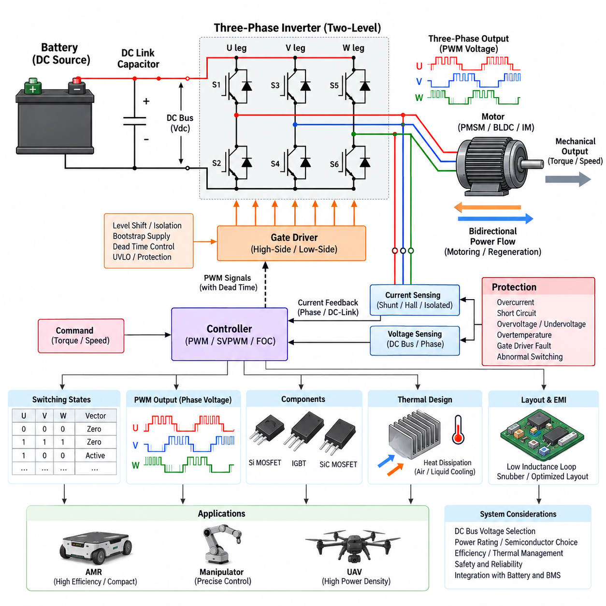
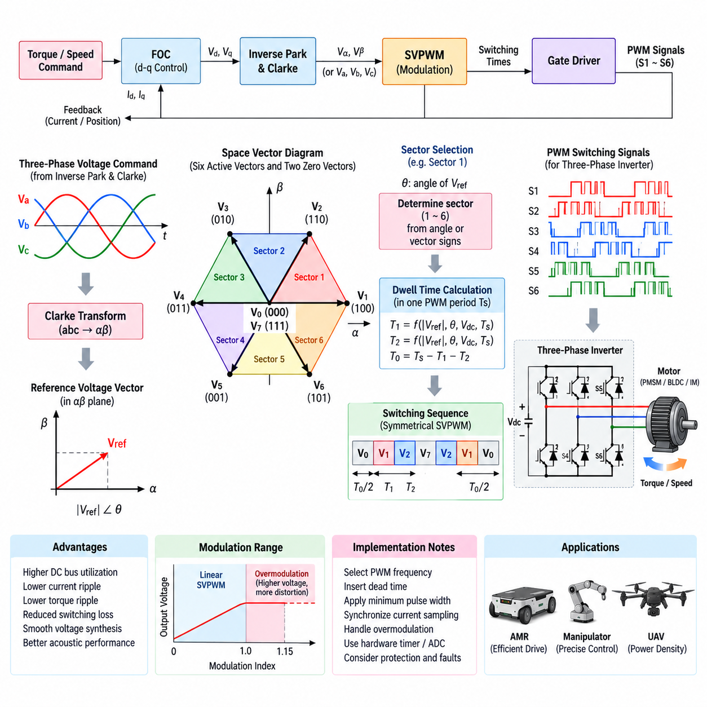
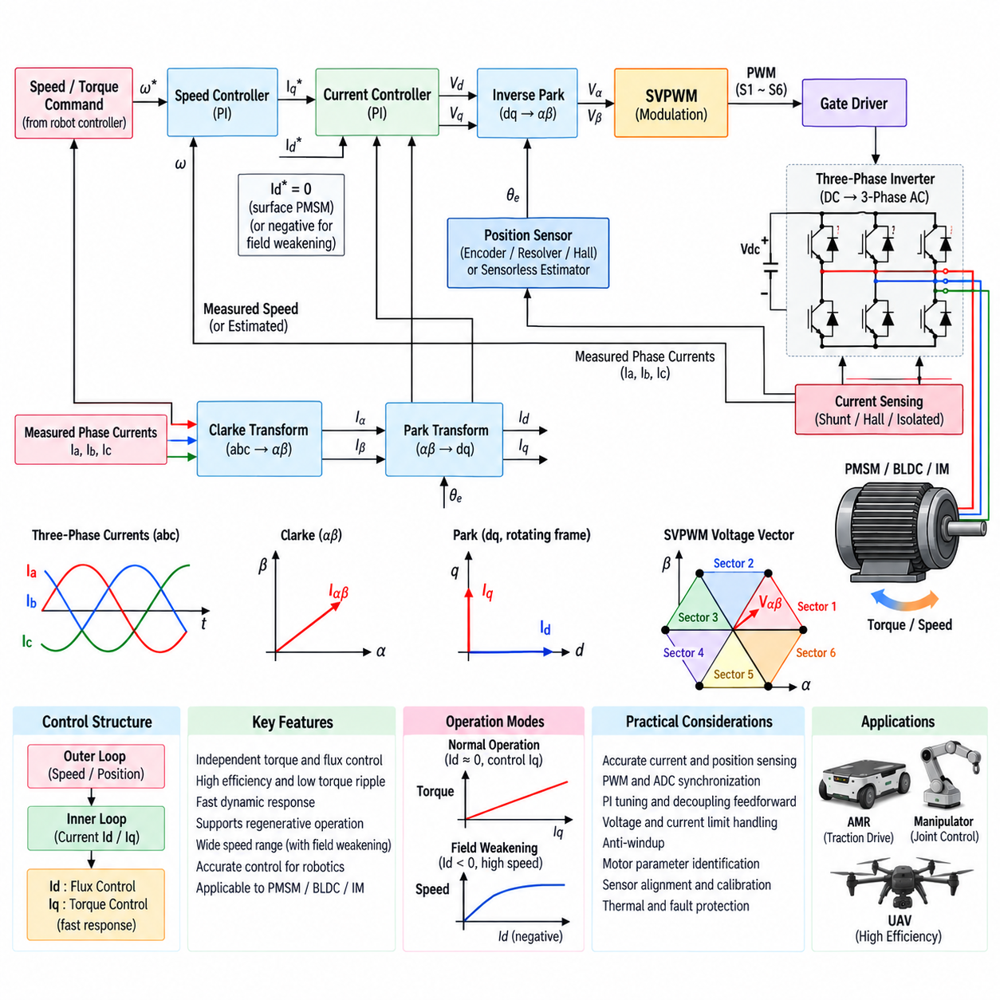
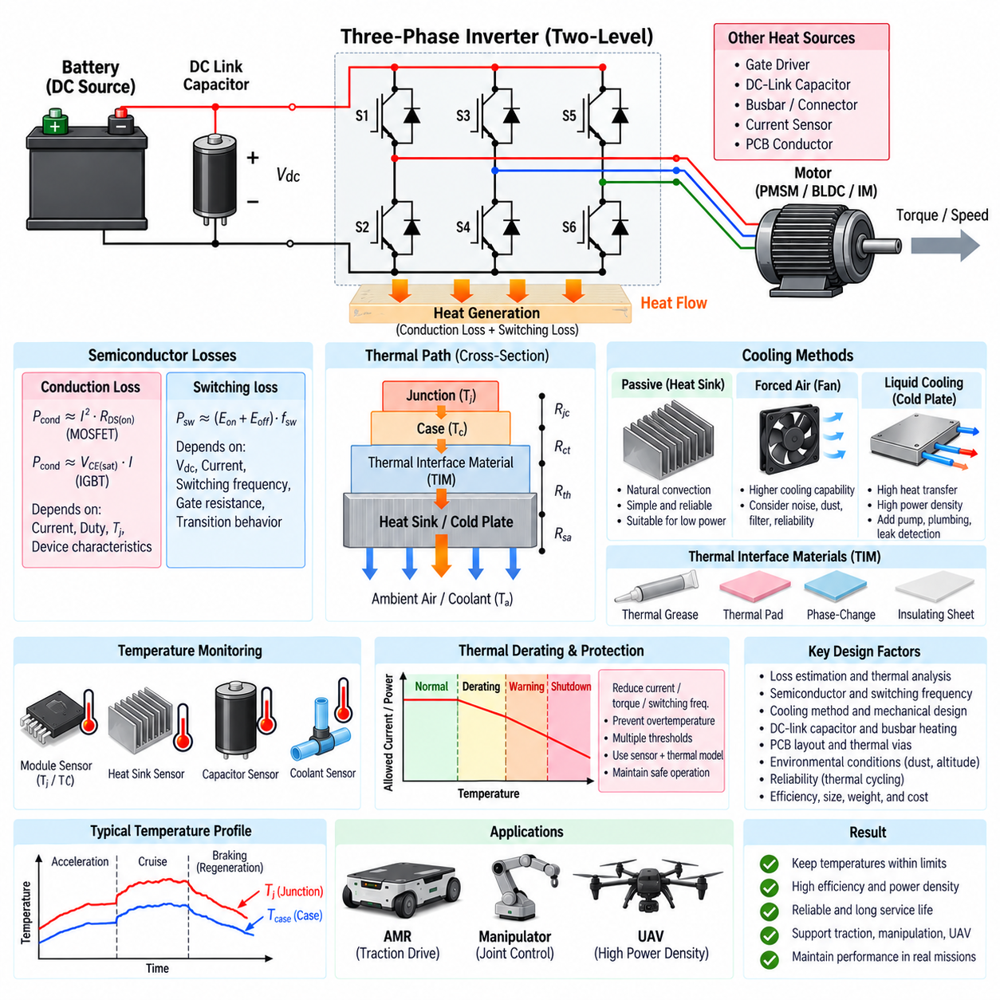
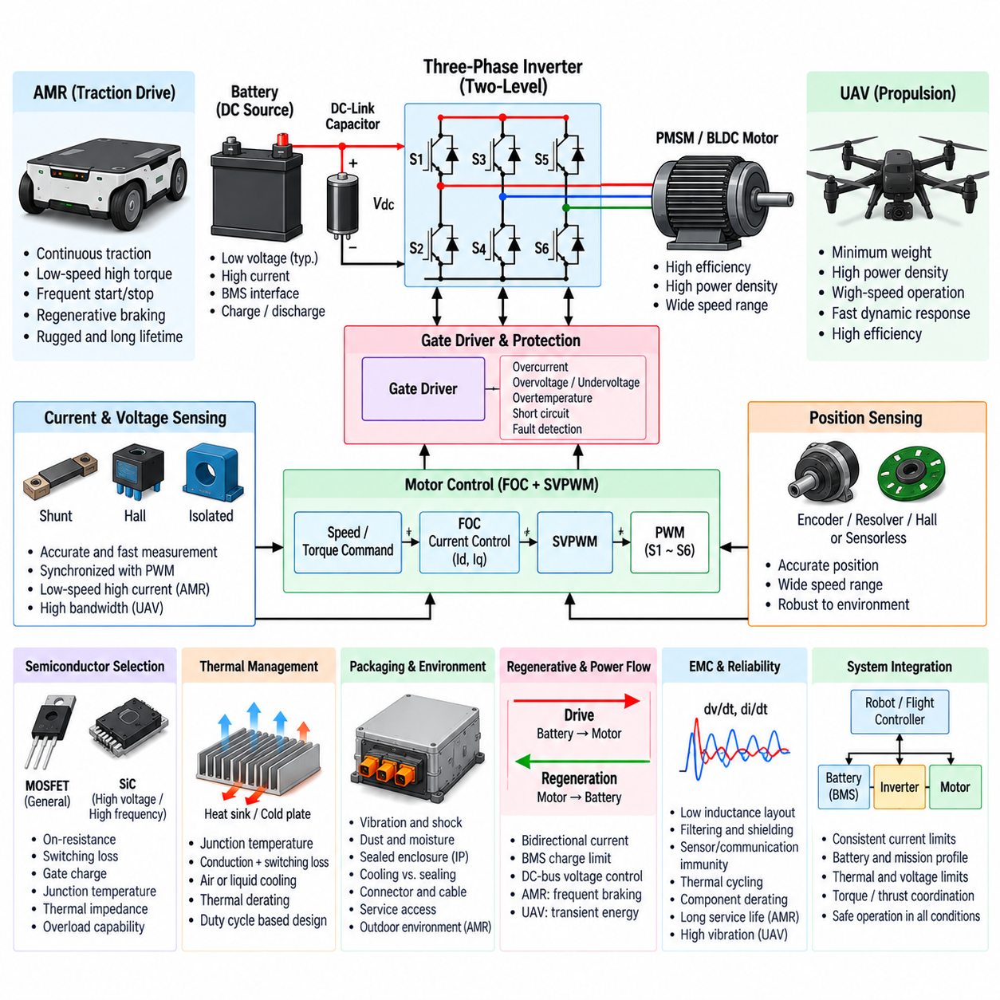

**Volume 11. Battery and Powertrain**


# Chapter 07. Inverter Design

##  

## 07.01. 3-Phase Inverter Topology

{width="7.268055555555556in" height="7.268055555555556in"}

A three-phase inverter is the core power-electronic interface that converts a DC energy source into controlled three-phase AC power for an electric motor. In robotic powertrains, the DC source is typically a battery or regulated DC bus, while the load is commonly a permanent-magnet synchronous motor (PMSM), brushless DC motor (BLDC), or induction motor. The inverter determines the instantaneous phase voltages and currents required to generate motor torque, speed, and direction.

The conventional topology is a two-level, three-phase voltage-source inverter composed of three switching legs. Each leg contains an upper and lower semiconductor switch connected between the positive and negative DC rails, with the midpoint forming one motor phase output. The three midpoints are connected to phases U, V, and W. Six controlled switching devices therefore form the basic bridge, allowing each phase terminal to be dynamically connected toward either side of the DC link.

Each inverter leg must be controlled so that its upper and lower switches are never intentionally turned on simultaneously. Such simultaneous conduction creates a low-impedance path directly across the DC bus, producing shoot-through current that can destroy semiconductor devices within microseconds. Gate-driver logic therefore introduces dead time between complementary switching transitions. Dead time improves switching safety but also distorts the commanded phase voltage, so precision motor drives often compensate for its electrical effects.

Power semiconductor selection strongly influences inverter efficiency, switching frequency, thermal performance, voltage capability, and cost. Silicon MOSFETs are widely used in low- and medium-voltage robotic systems because of their low conduction resistance and fast switching characteristics. IGBTs remain useful at higher voltages and powers, while silicon-carbide MOSFETs provide lower switching losses and higher temperature capability for demanding systems. Device voltage and current margins must accommodate transients as well as nominal operation.

Each switching device normally includes an intrinsic or parallel freewheeling path that permits motor current to continue flowing when the commanded semiconductor turns off. This function is essential because motor windings are inductive and their current cannot change instantaneously. Depending on switching state, current direction, and motor operating condition, energy circulates through transistors and diodes or returns toward the DC link. These bidirectional current paths also form the electrical foundation for regenerative operation.

A DC-link capacitor is placed close to the inverter bridge to stabilize the local DC bus and supply high-frequency switching current. The battery and upstream wiring cannot efficiently provide every rapid current pulse demanded by PWM operation because cable inductance and source impedance cause voltage variation. The capacitor reduces DC-bus ripple and switching-loop impedance while absorbing transient energy. Its capacitance, ripple-current rating, equivalent series resistance, temperature rating, and physical placement are therefore critical design parameters.

Three-phase output voltage is synthesized by rapidly switching the six semiconductor devices rather than generating sinusoidal voltages directly. Pulse-width modulation controls the average voltage applied to each motor phase during every switching interval. The resulting phase voltage contains switching-frequency components, but motor winding inductance filters much of this high-frequency content so that phase currents can approximate the desired waveforms. More advanced modulation and current-control methods are developed from this fundamental switching structure.

The bridge has eight possible switching combinations when each of the three legs is represented by one binary switching state. Six combinations produce active voltage vectors that apply nonzero line-to-line voltage to the motor, while two combinations produce zero vectors. By controlling the sequence and duration of these states, the inverter can synthesize a rotating voltage vector. This switching-state interpretation provides the fundamental hardware basis for space-vector pulse-width modulation and field-oriented motor control.

Motor operation is inherently bidirectional in energy terms. During motoring, electrical energy flows from the DC source through the inverter into the motor and becomes mechanical output. During deceleration, descending loads, or externally driven motion, the motor can behave as a generator. The inverter then provides controlled paths for electrical energy to return to the DC link. Battery acceptance limits, DC-bus overvoltage protection, and regenerative braking strategy must therefore be coordinated with inverter operation.

Current sensing is a fundamental part of practical inverter topology because closed-loop torque control depends on accurate phase-current information. Current can be measured using shunt resistors, Hall-effect sensors, magnetic sensors, or isolated current transducers. Designs may employ three phase sensors, two phase sensors with mathematical reconstruction, or DC-link sensing. Sensor topology affects cost, bandwidth, measurement accuracy, common-mode immunity, fault detection capability, and the control algorithm\'s ability to reconstruct currents during particular switching states.

The gate-driver stage provides the electrical interface between the controller and power switches. High-side devices require level-shifted or isolated drive circuitry because their source or emitter potential moves with the switching node. Bootstrap supplies are common in compact low-voltage designs, while isolated bias supplies are preferred where operating range or safety requirements demand greater independence. Gate resistance, drive voltage, propagation delay, isolation, Miller immunity, and undervoltage lockout directly influence reliable switching behavior.

Parasitic inductance in the commutation loop can generate substantial voltage overshoot whenever high current switches rapidly. Consequently, inverter topology cannot be treated only as a schematic arrangement; physical implementation is part of the electrical design. The DC-link capacitor, semiconductor bridge, busbars, and return paths should form compact low-inductance loops. Snubbers, optimized gate resistance, laminated bus structures, and controlled switching slew rates may be required to limit ringing, electromagnetic interference, and semiconductor voltage stress.

Protection functions are integrated around the three-phase bridge because power-stage faults can develop much faster than supervisory software can react. Typical protection mechanisms monitor overcurrent, short circuit, DC-bus overvoltage and undervoltage, semiconductor temperature, gate-driver supply status, and abnormal switching behavior. Hardware-level shutdown is commonly used for severe faults, while the motor controller manages slower diagnostic responses. Safe inverter design therefore combines semiconductor capability, sensing, gate-driver protection, and coordinated control.

Thermal design is closely coupled to topology because conduction and switching losses are concentrated in the six power devices. Conduction loss depends primarily on phase current and device characteristics, while switching loss depends on bus voltage, current, switching frequency, gate behavior, and transition time. Loss distribution varies with modulation and operating point. Heat spreading, thermal-interface materials, heat sinks, airflow, liquid cooling, and temperature sensing must keep junction temperatures within reliable limits under continuous and transient loads.

In battery-powered robots, inverter voltage class should be selected together with motor winding design, battery voltage, cable current, protection devices, and required mechanical power. A lower-voltage architecture simplifies insulation and personnel protection but requires higher current for a given power level. Higher DC-bus voltage reduces current and conductor losses but increases semiconductor voltage requirements, insulation demands, switching stress, and safety complexity. The inverter is therefore a system-level powertrain design choice rather than an isolated component.

For AMRs and other mobile robots, compactness, efficiency, low-speed torque quality, acoustic behavior, EMC, and fault tolerance are often as important as peak power. Repeated acceleration, braking, turning, and low-speed operation create operating profiles different from steady industrial drives. UAV propulsion introduces still stronger requirements for power density, mass, thermal performance, and fault consequences. The same fundamental six-switch three-phase bridge can support these platforms, but semiconductor technology, cooling, packaging, sensing, and protection must be optimized for the mission.

The three-phase inverter topology ultimately establishes the hardware foundation upon which modulation and motor-control algorithms operate. The DC link provides energy, the six-switch bridge creates controllable voltage vectors, gate drivers execute switching commands, current and voltage sensors provide feedback, and protection circuits constrain unsafe operation. Space-vector PWM, field-oriented control, thermal management, and platform-specific inverter design can therefore be understood as progressively higher layers built upon this basic three-phase power-conversion architecture.

3상 인버터(Three-Phase Inverter)는 직류 전원(DC Energy Source)을 제어 가능한 3상 교류 전력(Three-Phase AC Power)으로 변환하는 전동 파워트레인(Electric Powertrain)의 핵심 전력전자 인터페이스(Power-Electronic Interface)이다. 로봇 파워트레인(Robotic Powertrain)에서 직류 전원은 일반적으로 배터리(Battery) 또는 안정화된 직류 버스(DC Bus)이며, 부하는 주로 영구자석 동기전동기(PMSM), 브러시리스 직류전동기(BLDC), 유도전동기(Induction Motor)이다. 인버터는 모터 토크(Torque), 속도(Speed), 회전 방향(Direction)을 생성하는 데 필요한 순간적인 상전압(Phase Voltage)과 상전류(Phase Current)를 결정한다.

일반적인 토폴로지(Topology)는 3개의 스위칭 레그(Switching Leg)로 구성된 2레벨 3상 전압원 인버터(Two-Level Three-Phase Voltage-Source Inverter)이다. 각 레그는 직류 양극 및 음극 레일(DC Rail) 사이에 연결된 상측 및 하측 반도체 스위치(Semiconductor Switch)를 포함하며, 두 스위치의 중간점(Midpoint)이 하나의 모터 상 출력(Motor Phase Output)을 형성한다. 세 중간점은 U, V, W상에 연결된다. 따라서 기본 브리지(Bridge)는 6개의 제어 스위칭 소자로 구성되며 각 상 단자를 직류 링크(DC Link)의 양측에 동적으로 연결할 수 있다.

각 인버터 레그(Inverter Leg)는 상측 스위치와 하측 스위치가 동시에 의도적으로 켜지지 않도록 제어해야 한다. 두 스위치가 동시에 도통되면 직류 버스(DC Bus)를 직접 연결하는 낮은 임피던스 경로(Low-Impedance Path)가 형성되어 반도체 소자를 수 마이크로초 이내에 파괴할 수 있는 관통전류(Shoot-Through Current)가 발생한다. 따라서 게이트 드라이버 로직(Gate-Driver Logic)은 상보적인 스위칭 전환 사이에 데드타임(Dead Time)을 삽입한다. 데드타임은 스위칭 안전성을 향상시키지만 명령된 상전압을 왜곡하므로 정밀 모터 드라이브에서는 이러한 전기적 영향을 보상하기도 한다.

전력 반도체(Power Semiconductor)의 선택은 인버터 효율(Efficiency), 스위칭 주파수(Switching Frequency), 열 성능(Thermal Performance), 전압 처리 능력(Voltage Capability), 비용에 큰 영향을 미친다. 실리콘 MOSFET(Silicon MOSFET)은 낮은 도통 저항(Conduction Resistance)과 빠른 스위칭 특성 때문에 저전압 및 중전압 로봇 시스템에 널리 사용된다. IGBT는 높은 전압과 전력 영역에서 여전히 유용하며, 실리콘 카바이드 MOSFET(SiC MOSFET)은 높은 성능이 필요한 시스템에서 낮은 스위칭 손실과 우수한 고온 동작 능력을 제공한다. 소자의 전압 및 전류 마진(Margin)은 정상 운전뿐 아니라 과도현상(Transient)까지 고려해야 한다.

각 스위칭 소자는 일반적으로 모터 전류가 명령된 반도체 스위치의 턴오프 이후에도 계속 흐를 수 있도록 내부 또는 병렬 프리휠링 경로(Freewheeling Path)를 제공한다. 모터 권선(Motor Winding)은 유도성 부하(Inductive Load)이므로 전류가 순간적으로 변화할 수 없기 때문에 이러한 기능은 필수적이다. 스위칭 상태, 전류 방향, 모터 운전 조건에 따라 전류는 트랜지스터(Transistor)와 다이오드(Diode)를 통해 순환하거나 직류 링크로 반환된다. 이러한 양방향 전류 경로(Bidirectional Current Path)는 회생 운전(Regenerative Operation)의 전기적 기반이 된다.

직류 링크 커패시터(DC-Link Capacitor)는 로컬 직류 버스를 안정화하고 고주파 스위칭 전류(High-Frequency Switching Current)를 공급하기 위해 인버터 브리지 가까이에 배치된다. 케이블 인덕턴스(Cable Inductance)와 전원 임피던스(Source Impedance)가 전압 변동을 발생시키므로 배터리와 상위 배선만으로 PWM 동작에 필요한 빠른 전류 펄스를 효율적으로 공급하기 어렵다. 커패시터는 직류 버스 리플(DC-Bus Ripple)과 스위칭 루프 임피던스(Switching-Loop Impedance)를 감소시키고 과도 에너지를 흡수한다. 따라서 정전용량(Capacitance), 리플 전류 정격(Ripple-Current Rating), 등가직렬저항(ESR), 온도 정격, 물리적 배치가 중요한 설계 요소이다.

3상 출력전압(Three-Phase Output Voltage)은 정현파 전압을 직접 생성하는 대신 6개의 반도체 소자를 빠르게 스위칭하여 합성한다. 펄스폭변조(PWM)는 각 스위칭 주기 동안 모터 각 상에 인가되는 평균 전압(Average Voltage)을 제어한다. 생성된 상전압에는 스위칭 주파수 성분(Switching-Frequency Component)이 포함되지만 모터 권선의 인덕턴스(Winding Inductance)가 이러한 고주파 성분의 상당 부분을 필터링하여 상전류가 원하는 파형에 근접하도록 한다. 보다 발전된 변조 및 전류 제어 방식은 이러한 기본 스위칭 구조를 기반으로 구성된다.

3개의 레그를 각각 하나의 이진 스위칭 상태(Binary Switching State)로 표현하면 브리지에는 총 8개의 스위칭 조합(Switching Combination)이 존재한다. 이 가운데 6개는 모터에 0이 아닌 선간전압(Line-to-Line Voltage)을 인가하는 유효 전압 벡터(Active Voltage Vector)를 생성하며, 나머지 2개는 영벡터(Zero Vector)를 생성한다. 각 상태의 순서와 지속시간을 제어함으로써 인버터는 회전 전압 벡터(Rotating Voltage Vector)를 합성할 수 있다. 이러한 스위칭 상태 해석은 공간벡터 펄스폭변조(SVPWM)와 자속기준제어(FOC)의 기본적인 하드웨어 기반을 제공한다.

모터 운전은 에너지 관점에서 본질적으로 양방향(Bidirectional)이다. 구동 운전(Motoring)에서는 전기에너지가 직류 전원에서 인버터를 거쳐 모터로 전달되어 기계적 출력(Mechanical Output)으로 변환된다. 감속, 하강 부하(Descending Load), 외력에 의한 구동 상황에서는 모터가 발전기(Generator)처럼 동작할 수 있다. 이때 인버터는 전기에너지가 직류 링크로 반환될 수 있도록 제어된 경로를 제공한다. 따라서 배터리 충전 수용 한계(Battery Acceptance Limit), 직류 버스 과전압 보호(DC-Bus Overvoltage Protection), 회생제동 전략(Regenerative Braking Strategy)을 인버터 동작과 통합하여 설계해야 한다.

전류 센싱(Current Sensing)은 폐루프 토크 제어(Closed-Loop Torque Control)가 정확한 상전류 정보에 의존하기 때문에 실제 인버터 토폴로지의 핵심 요소이다. 전류는 션트 저항(Shunt Resistor), 홀 효과 센서(Hall-Effect Sensor), 자기 센서(Magnetic Sensor), 절연형 전류 변환기(Isolated Current Transducer) 등을 사용하여 측정할 수 있다. 설계에 따라 3개의 상전류 센서, 수학적 복원(Mathematical Reconstruction)을 사용하는 2개의 상전류 센서, 또는 직류 링크 전류 센싱(DC-Link Current Sensing)을 적용할 수 있다. 센서 토폴로지는 비용, 대역폭, 측정 정확도, 공통모드 내성(Common-Mode Immunity), 고장 검출 능력 및 특정 스위칭 상태에서의 전류 복원 능력에 영향을 준다.

게이트 드라이버 단계(Gate-Driver Stage)는 제어기(Controller)와 전력 스위치(Power Switch) 사이의 전기적 인터페이스를 제공한다. 상측 소자는 소스(Source) 또는 이미터(Emitter)의 전위가 스위칭 노드와 함께 변화하기 때문에 레벨 시프트(Level-Shift) 또는 절연된 구동 회로(Isolated Drive Circuit)를 필요로 한다. 부트스트랩 전원(Bootstrap Supply)은 소형 저전압 설계에서 일반적으로 사용되며, 넓은 동작 범위나 높은 안전 요구사항에서는 절연 바이어스 전원(Isolated Bias Supply)이 선호된다. 게이트 저항, 구동 전압, 전파 지연(Propagation Delay), 절연, 밀러 내성(Miller Immunity), 저전압 잠금(UVLO)은 안정적인 스위칭 동작에 직접적인 영향을 미친다.

정류 루프(Commutation Loop)의 기생 인덕턴스(Parasitic Inductance)는 큰 전류가 빠르게 스위칭될 때 상당한 전압 오버슈트(Voltage Overshoot)를 발생시킬 수 있다. 따라서 인버터 토폴로지는 단순한 회로도상의 구성으로만 취급할 수 없으며 물리적인 구현 자체가 전기 설계의 일부이다. 직류 링크 커패시터, 반도체 브리지, 버스바(Busbar), 귀환 경로(Return Path)는 작고 낮은 인덕턴스의 루프를 형성해야 한다. 링잉(Ringing), 전자파 간섭(EMI), 반도체 전압 스트레스를 제한하기 위해 스너버(Snubber), 최적화된 게이트 저항, 적층형 버스 구조(Laminated Bus Structure), 제어된 스위칭 슬루율(Slew Rate)을 적용할 수 있다.

전력단 고장(Power-Stage Fault)은 상위 소프트웨어가 대응할 수 있는 속도보다 훨씬 빠르게 발생할 수 있으므로 3상 브리지 주변에는 다양한 보호 기능(Protection Function)이 통합된다. 대표적인 보호 기능은 과전류(Overcurrent), 단락(Short Circuit), 직류 버스 과전압 및 저전압, 반도체 온도, 게이트 드라이버 전원 상태, 비정상적인 스위칭 동작 등을 감시한다. 심각한 고장에는 일반적으로 하드웨어 수준의 차단(Hardware-Level Shutdown)이 적용되며 모터 제어기는 상대적으로 느린 진단 대응을 관리한다. 따라서 안전한 인버터 설계는 반도체 성능, 센싱, 게이트 드라이버 보호, 제어 로직의 협조를 통해 구현된다.

열 설계(Thermal Design)는 도통 손실(Conduction Loss)과 스위칭 손실(Switching Loss)이 6개의 전력 소자에 집중되기 때문에 인버터 토폴로지와 밀접하게 연계된다. 도통 손실은 주로 상전류와 소자 특성에 의해 결정되고, 스위칭 손실은 버스 전압, 전류, 스위칭 주파수, 게이트 동작, 전환시간(Transition Time)에 의해 영향을 받는다. 손실 분포는 변조 방식과 운전점(Operating Point)에 따라서도 달라진다. 방열 구조, 열 인터페이스 재료(Thermal-Interface Material), 히트싱크(Heat Sink), 공랭(Air Cooling), 수랭(Liquid Cooling), 온도 센싱을 이용하여 연속 및 과도 부하에서 접합부 온도(Junction Temperature)를 신뢰성 한계 이내로 유지해야 한다.

배터리 기반 로봇에서는 인버터의 전압 등급(Voltage Class)을 모터 권선 설계, 배터리 전압, 케이블 전류, 보호 소자, 요구되는 기계적 출력과 함께 결정해야 한다. 저전압 아키텍처(Low-Voltage Architecture)는 절연과 작업자 보호를 단순화하지만 동일한 전력을 전달하기 위해 더 높은 전류가 필요하다. 높은 직류 버스 전압은 전류와 도체 손실(Conductor Loss)을 줄일 수 있지만 반도체의 전압 요구사항, 절연 요구조건, 스위칭 스트레스, 안전 복잡성을 증가시킨다. 따라서 인버터는 독립된 부품이 아니라 시스템 수준의 파워트레인 설계 요소이다.

자율이동로봇(AMR)과 기타 모바일 로봇에서는 최대 출력뿐 아니라 소형화(Compactness), 효율, 저속 토크 품질(Low-Speed Torque Quality), 소음 특성(Acoustic Behavior), 전자파 적합성(EMC), 고장 허용성(Fault Tolerance)도 중요하다. 반복적인 가속, 제동, 회전, 저속 운전은 정상 상태 중심의 산업용 드라이브와 다른 운전 프로파일을 형성한다. 무인항공기(UAV) 추진 시스템에서는 출력 밀도(Power Density), 중량, 열 성능, 고장 결과에 대해 더욱 엄격한 요구사항이 적용된다. 동일한 기본 6스위치 3상 브리지를 사용할 수 있지만 반도체 기술, 냉각, 패키징, 센싱, 보호 구조는 임무에 맞게 최적화되어야 한다.

궁극적으로 3상 인버터 토폴로지(Three-Phase Inverter Topology)는 변조 알고리즘(Modulation Algorithm)과 모터 제어 알고리즘(Motor-Control Algorithm)이 동작하는 하드웨어 기반을 형성한다. 직류 링크는 에너지를 제공하고, 6스위치 브리지는 제어 가능한 전압 벡터를 생성하며, 게이트 드라이버는 스위칭 명령을 실행한다. 전류 및 전압 센서는 피드백을 제공하고 보호 회로는 위험한 동작을 제한한다. 따라서 공간벡터 펄스폭변조(SVPWM), 자속기준제어(FOC), 열 관리(Thermal Management), 플랫폼별 인버터 설계는 모두 이러한 기본적인 3상 전력변환 아키텍처 위에 구축되는 상위 계층으로 이해할 수 있다.

##  

## 07.02. SVPWM Algorithm

{width="7.268055555555556in" height="7.268055555555556in"}

Space Vector Pulse Width Modulation (SVPWM) is a digital modulation technique used to control the switching states of a three-phase voltage-source inverter. Instead of treating the three motor phases as independent sinusoidal signals, SVPWM represents the inverter output as a single rotating voltage vector in a two-dimensional plane. This representation provides a systematic method for converting a commanded motor voltage into precise switching times for the six semiconductor devices.

In a conventional two-level three-phase inverter, each of the three switching legs can connect its phase output toward either the positive or negative DC rail. The resulting binary switching combinations create eight possible inverter states. Six states generate nonzero line-to-line voltages and are called active voltage vectors, while two states produce zero voltage vectors. SVPWM organizes these vectors geometrically so that the desired reference voltage can be synthesized from neighboring switching states.

The six active voltage vectors are separated by 60 electrical degrees and form a hexagonal structure in the stationary reference plane. This hexagon is divided into six sectors, with each sector bounded by two adjacent active vectors. The commanded reference vector rotates through these sectors according to the desired motor electrical frequency. At every PWM period, the algorithm determines which sector contains the reference vector and calculates how long the adjacent vectors must remain active.

SVPWM commonly begins with the desired three-phase voltage command generated by a higher-level motor-control algorithm. The phase quantities can be transformed into stationary orthogonal α and β components using a Clarke transformation. These two components define the magnitude and angular position of the reference voltage vector. Sector identification can then be performed from the vector angle, component signs, or equivalent computational logic optimized for real-time implementation.

Once the active sector is known, the reference vector is approximated during one switching period by applying the two adjacent active vectors for calculated durations. These durations are commonly represented as T1 and T2. The remaining portion of the switching period is assigned to the zero vectors and represented by T0. Ideally, T1 + T2 + T0 equals the complete PWM period, ensuring that the time-averaged inverter voltage corresponds to the requested reference vector.

The calculation of T1 and T2 depends on the reference-vector magnitude, its angular position within the current sector, the DC-link voltage, and the PWM period. As the vector approaches one boundary of a sector, the dwell time associated with the neighboring vector changes smoothly. When the reference passes into the next sector, the algorithm changes the active-vector pair while maintaining continuous voltage synthesis. This behavior enables smooth generation of rotating three-phase excitation.

Zero-vector time is important because it allows the requested average voltage to be synthesized while providing flexibility in the switching sequence. The two zero states correspond to all upper or all lower switching states being simultaneously selected according to the inverter\'s switching convention. In symmetrical SVPWM, the available zero-vector duration is usually distributed around the active-vector intervals. This produces a centered switching waveform and helps achieve consistent switching behavior over successive PWM cycles.

A typical symmetrical switching sequence progresses from a zero vector to the first active vector, then to the second active vector, and finally to the opposite zero vector before reversing the sequence. This ordering minimizes unnecessary switching transitions because only selected inverter legs change state between adjacent vectors. Reduced transition count lowers switching losses and simplifies waveform symmetry while maintaining the required average voltage vector during each modulation period.

One major advantage of SVPWM is improved utilization of the available DC-link voltage compared with conventional sinusoidal PWM. By coordinating all three inverter legs as a unified vector system, SVPWM can produce a larger fundamental output voltage before reaching the linear modulation boundary. This is especially useful in battery-powered robots because improved DC-bus utilization can extend the usable motor speed range without increasing battery voltage or changing the inverter hardware.

SVPWM is closely associated with field-oriented control (FOC), although the two perform different functions. FOC determines the voltage commands needed to regulate motor flux and torque, typically in a rotating d-q reference frame. These commands are transformed into stationary voltage components and passed to the modulation stage. SVPWM then converts the requested voltage vector into practical gate-switching commands. FOC therefore determines what voltage is required, while SVPWM determines how the inverter produces it.

The PWM switching frequency must be selected by balancing several competing requirements. A higher switching frequency generally improves current waveform quality, reduces low-frequency torque ripple, and can move audible components outside sensitive frequency ranges. However, every switching transition dissipates energy in the semiconductor devices. Increasing switching frequency therefore raises inverter switching losses and thermal load, requiring coordination among motor inductance, semiconductor technology, acoustic requirements, control bandwidth, and cooling capability.

Dead time must be inserted between complementary high-side and low-side switching commands to prevent shoot-through in each inverter leg. Although necessary for hardware protection, dead time changes the effective phase voltage and creates nonlinear distortion whose polarity depends partly on phase-current direction. At low motor speed, the resulting error can become significant relative to the commanded voltage. High-performance drives may therefore incorporate dead-time compensation using measured or estimated phase-current polarity.

SVPWM implementation must also consider minimum pulse width. Semiconductor switches and gate drivers require finite time to turn on and off reliably, and current-sensing circuits may need stable intervals for valid measurements. Extremely short calculated dwell times can therefore be physically impractical. Real motor controllers apply minimum pulse constraints, sampling-window management, or modified switching sequences so that theoretical voltage commands remain compatible with actual semiconductor, driver, sensing, and timing limitations.

Current measurement is often synchronized with the PWM sequence because switching transitions introduce electrical noise and some inverter states provide better sensing conditions than others. The controller may trigger analog-to-digital conversion at carefully selected points within the PWM cycle where phase currents are sufficiently stable. In systems using one or two current sensors rather than three independent phase sensors, the modulation sequence may also influence whether missing phase currents can be reconstructed accurately.

The transition from linear modulation toward overmodulation occurs when the requested voltage vector becomes too large to be synthesized using the available active and zero-vector times within one PWM period. As modulation depth increases, zero-vector duration decreases toward zero. Beyond the linear region, the controller must limit the reference or deliberately enter an overmodulation strategy. Such operation can increase available fundamental voltage but introduces greater waveform distortion and requires careful control of current and torque behavior.

Digital implementation requires precise timing because SVPWM normally executes at every PWM update period. The motor-control processor calculates voltage commands, identifies the sector, determines vector dwell times, applies timing constraints, and updates hardware timer compare registers before the next switching cycle. Modern microcontrollers, digital signal processors, and motor-control SoCs commonly provide complementary PWM generators, programmable dead time, synchronized ADC triggers, fault inputs, and timer hardware specifically designed to support this real-time process.

For AMRs, mobile manipulators, and other battery-powered robots, SVPWM contributes to efficient use of limited DC-bus voltage while supporting smooth torque production over a wide operating range. Low-speed maneuvering benefits from accurate current regulation and reduced torque ripple, while higher-speed operation benefits from improved voltage utilization. In UAV propulsion, efficient modulation can similarly contribute to power density and motor performance, although switching losses, electromagnetic interference, thermal limits, and fault response remain critical constraints.

SVPWM should therefore be understood as the modulation bridge between continuous motor-control commands and the discrete switching states available in a three-phase inverter. The reference voltage vector is located within one of six sectors, decomposed into adjacent active vectors and zero vectors, and translated into carefully timed semiconductor switching commands. Together with current sensing, dead-time management, protection, and FOC, this process enables efficient and precise control of three-phase motors used throughout robotic powertrains.

공간 벡터 펄스폭 변조(Space Vector Pulse Width Modulation, SVPWM)는 3상 전압원 인버터(Three-Phase Voltage-Source Inverter)의 스위칭 상태를 제어하는 디지털 변조 기법(Digital Modulation Technique)이다. SVPWM은 모터의 세 상을 서로 독립적인 정현파 신호로 취급하는 대신, 인버터 출력을 2차원 평면에서 하나의 회전 전압 벡터(Rotating Voltage Vector)로 표현한다. 이러한 표현 방식은 명령된 모터 전압을 6개 반도체 소자의 정밀한 스위칭 시간으로 변환하는 체계적인 방법을 제공한다.

일반적인 2레벨 3상 인버터(Two-Level Three-Phase Inverter)에서 세 개의 스위칭 레그(Switching Leg)는 각각 해당 상 출력을 직류 양극 또는 음극 레일(DC Rail)에 연결할 수 있다. 이에 따른 이진 스위칭 조합(Binary Switching Combination)은 총 8개의 인버터 상태를 생성한다. 이 가운데 6개 상태는 0이 아닌 선간전압(Line-to-Line Voltage)을 생성하며 유효 전압 벡터(Active Voltage Vector)라고 하고, 나머지 2개 상태는 영전압 벡터(Zero Voltage Vector)를 생성한다. SVPWM은 이러한 벡터를 기하학적으로 구성하여 인접한 스위칭 상태로 원하는 기준 전압(Reference Voltage)을 합성한다.

6개의 유효 전압 벡터(Active Voltage Vector)는 전기각 기준으로 60도씩 분리되어 정지 기준 평면(Stationary Reference Plane)에 육각형 구조를 형성한다. 이 육각형은 6개의 섹터(Sector)로 구분되며, 각 섹터는 서로 인접한 두 개의 유효 벡터를 경계로 한다. 명령된 기준 벡터(Reference Vector)는 원하는 모터 전기 주파수(Motor Electrical Frequency)에 따라 이 섹터들을 통과하며 회전한다. 알고리즘은 매 PWM 주기마다 기준 벡터가 위치한 섹터를 결정하고 인접 벡터를 얼마 동안 인가해야 하는지를 계산한다.

SVPWM은 일반적으로 상위 모터 제어 알고리즘(Motor-Control Algorithm)에서 생성된 원하는 3상 전압 명령으로부터 시작한다. 상전압 성분(Phase Quantity)은 클라크 변환(Clarke Transformation)을 사용하여 정지 좌표계의 직교 α 및 β 성분으로 변환할 수 있다. 이 두 성분은 기준 전압 벡터의 크기와 각도 위치를 정의한다. 이후 벡터 각도, 성분의 부호 또는 실시간 구현에 최적화된 동등한 계산 로직을 사용하여 섹터 판별(Sector Identification)을 수행할 수 있다.

유효 섹터가 결정되면 하나의 스위칭 주기 동안 인접한 두 개의 유효 벡터를 계산된 시간만큼 인가하여 기준 벡터를 근사한다. 이러한 지속시간(Dwell Time)은 일반적으로 T1과 T2로 표현된다. 스위칭 주기에서 남은 시간은 영벡터(Zero Vector)에 할당되며 T0로 표현된다. 이상적인 경우 T1 + T2 + T0는 전체 PWM 주기와 같으며, 이를 통해 시간 평균된 인버터 전압(Time-Averaged Inverter Voltage)이 요청된 기준 벡터와 일치하도록 한다.

T1과 T2의 계산은 기준 벡터의 크기, 현재 섹터 내부에서의 각도 위치, 직류 링크 전압(DC-Link Voltage), PWM 주기에 따라 결정된다. 벡터가 섹터의 한쪽 경계에 접근하면 인접 벡터에 할당되는 지속시간이 연속적으로 변화한다. 기준 벡터가 다음 섹터로 이동하면 알고리즘은 유효 벡터 쌍(Active-Vector Pair)을 변경하면서도 연속적인 전압 합성을 유지한다. 이러한 동작을 통해 부드럽게 회전하는 3상 여자(Three-Phase Excitation)를 생성할 수 있다.

영벡터 시간(Zero-Vector Time)은 요구되는 평균 전압을 합성하면서 스위칭 시퀀스(Switching Sequence)를 구성할 수 있는 유연성을 제공하기 때문에 중요하다. 두 개의 영 상태(Zero State)는 인버터의 스위칭 규칙에 따라 모든 상측 또는 모든 하측 스위칭 상태가 동시에 선택되는 경우에 해당한다. 대칭형 SVPWM(Symmetrical SVPWM)에서는 일반적으로 사용 가능한 영벡터 시간을 유효 벡터 구간의 전후로 분배한다. 이를 통해 중앙 정렬된 스위칭 파형(Centered Switching Waveform)을 생성하고 연속된 PWM 주기에서 일관된 스위칭 동작을 구현할 수 있다.

일반적인 대칭 스위칭 시퀀스(Symmetrical Switching Sequence)는 하나의 영벡터에서 첫 번째 유효 벡터로 이동하고, 두 번째 유효 벡터를 거쳐 반대쪽 영벡터에 도달한 후 다시 역순으로 진행한다. 이러한 순서는 인접한 벡터 사이에서 선택된 인버터 레그만 상태를 변경하도록 하여 불필요한 스위칭 전환을 최소화한다. 전환 횟수 감소는 스위칭 손실(Switching Loss)을 줄이고 파형 대칭성을 확보하면서 각 변조 주기에서 요구되는 평균 전압 벡터를 유지하도록 한다.

SVPWM의 주요 장점 가운데 하나는 일반적인 정현파 PWM(Sinusoidal PWM)에 비해 사용 가능한 직류 링크 전압(DC-Link Voltage)을 더욱 효과적으로 활용할 수 있다는 점이다. SVPWM은 세 개의 인버터 레그를 하나의 통합된 벡터 시스템(Unified Vector System)으로 조정함으로써 선형 변조 한계(Linear Modulation Boundary)에 도달하기 전에 더 큰 기본파 출력전압(Fundamental Output Voltage)을 생성할 수 있다. 이는 배터리 전압이나 인버터 하드웨어를 변경하지 않고도 사용 가능한 모터 속도 범위를 확대할 수 있기 때문에 배터리 기반 로봇에서 특히 유용하다.

SVPWM은 자속기준제어(Field-Oriented Control, FOC)와 밀접하게 연관되어 있지만 두 기법은 서로 다른 기능을 수행한다. FOC는 일반적으로 회전 d-q 기준 좌표계(Rotating d-q Reference Frame)에서 모터 자속과 토크를 제어하는 데 필요한 전압 명령을 결정한다. 이러한 명령은 정지 좌표계의 전압 성분으로 변환된 후 변조 단계(Modulation Stage)로 전달된다. SVPWM은 요청된 전압 벡터를 실제 게이트 스위칭 명령(Gate-Switching Command)으로 변환한다. 따라서 FOC가 필요한 전압을 결정한다면 SVPWM은 인버터가 그 전압을 어떻게 생성할 것인지를 결정한다.

PWM 스위칭 주파수(Switching Frequency)는 여러 상충되는 요구조건 사이의 균형을 고려하여 선정해야 한다. 높은 스위칭 주파수는 일반적으로 전류 파형 품질(Current Waveform Quality)을 향상시키고 저주파 토크 리플(Low-Frequency Torque Ripple)을 감소시키며, 가청 주파수 성분을 민감한 영역 밖으로 이동시킬 수 있다. 그러나 반도체 소자의 모든 스위칭 전환에는 에너지 손실이 발생한다. 따라서 스위칭 주파수가 높아지면 인버터 스위칭 손실과 열부하(Thermal Load)가 증가하므로 모터 인덕턴스, 반도체 기술, 소음 요구조건, 제어 대역폭(Control Bandwidth), 냉각 능력을 함께 고려해야 한다.

각 인버터 레그에서 상보적으로 동작하는 상측 및 하측 스위치 사이에는 관통전류(Shoot-Through)를 방지하기 위해 데드타임(Dead Time)을 삽입해야 한다. 데드타임은 하드웨어 보호를 위해 필수적이지만 실제 상전압(Effective Phase Voltage)을 변화시키고 상전류 방향에 따라 극성이 달라지는 비선형 왜곡(Nonlinear Distortion)을 발생시킨다. 저속 모터 운전에서는 이러한 오차가 명령 전압에 비해 상당히 커질 수 있다. 따라서 고성능 드라이브에서는 측정 또는 추정된 상전류 극성을 이용한 데드타임 보상(Dead-Time Compensation)을 적용할 수 있다.

SVPWM 구현에서는 최소 펄스폭(Minimum Pulse Width)도 고려해야 한다. 반도체 스위치와 게이트 드라이버(Gate Driver)는 안정적으로 턴온 및 턴오프하기 위해 유한한 시간이 필요하며, 전류 센싱 회로(Current-Sensing Circuit)도 유효한 측정을 위해 안정적인 시간 구간을 필요로 할 수 있다. 지나치게 짧게 계산된 지속시간은 실제 하드웨어에서 구현하기 어려울 수 있다. 따라서 실제 모터 제어기는 최소 펄스 제한, 샘플링 윈도 관리(Sampling-Window Management), 수정된 스위칭 시퀀스를 적용하여 이론적인 전압 명령이 반도체, 드라이버, 센싱 및 타이밍 제약조건과 호환되도록 한다.

스위칭 전환은 전기적 노이즈(Electrical Noise)를 발생시키고 일부 인버터 상태가 다른 상태보다 더 좋은 센싱 조건을 제공하기 때문에 전류 측정(Current Measurement)은 PWM 시퀀스와 동기화되는 경우가 많다. 제어기는 상전류가 충분히 안정되는 PWM 주기의 특정 시점에서 아날로그-디지털 변환(ADC)을 트리거할 수 있다. 세 개의 독립적인 상전류 센서 대신 하나 또는 두 개의 전류 센서를 사용하는 시스템에서는 변조 시퀀스가 누락된 상전류를 정확하게 복원할 수 있는지에도 영향을 줄 수 있다.

선형 변조(Linear Modulation)에서 과변조(Overmodulation)로의 전환은 요청된 전압 벡터가 너무 커져 하나의 PWM 주기 안에서 사용 가능한 유효 벡터와 영벡터 시간을 이용해 합성할 수 없을 때 발생한다. 변조 깊이(Modulation Depth)가 증가함에 따라 영벡터 지속시간은 점차 감소하여 0에 접근한다. 선형 영역을 벗어나면 제어기는 기준 벡터를 제한하거나 의도적으로 과변조 전략(Overmodulation Strategy)을 적용해야 한다. 이러한 동작은 사용 가능한 기본파 전압을 증가시킬 수 있지만 파형 왜곡을 증가시키므로 전류 및 토크 동작을 신중하게 제어해야 한다.

디지털 구현(Digital Implementation)에서는 SVPWM이 일반적으로 매 PWM 갱신 주기마다 실행되므로 정밀한 타이밍이 필요하다. 모터 제어 프로세서는 전압 명령을 계산하고, 섹터를 판별하며, 벡터 지속시간을 결정하고, 타이밍 제약조건을 적용한 후 다음 스위칭 주기가 시작되기 전에 하드웨어 타이머 비교 레지스터(Timer Compare Register)를 갱신한다. 현대의 마이크로컨트롤러(MCU), 디지털 신호 프로세서(DSP), 모터 제어 SoC는 이러한 실시간 처리를 지원하도록 상보 PWM 생성기, 프로그래머블 데드타임, 동기화된 ADC 트리거, 고장 입력(Fault Input), 전용 타이머 하드웨어를 제공하는 경우가 많다.

자율이동로봇(AMR), 모바일 매니퓰레이터(Mobile Manipulator), 기타 배터리 기반 로봇에서 SVPWM은 제한된 직류 버스 전압을 효율적으로 사용하면서 넓은 운전 범위에서 부드러운 토크 생성을 지원한다. 저속 기동에서는 정밀한 전류 제어와 감소된 토크 리플의 이점을 얻을 수 있으며, 고속 운전에서는 향상된 전압 활용률의 이점을 얻을 수 있다. 무인항공기(UAV) 추진 시스템에서도 효율적인 변조는 출력 밀도와 모터 성능 향상에 기여할 수 있지만 스위칭 손실, 전자파 간섭(EMI), 열 한계, 고장 대응은 여전히 중요한 설계 제약조건이다.

따라서 SVPWM은 연속적인 모터 제어 명령(Continuous Motor-Control Command)과 3상 인버터에서 실제 사용할 수 있는 이산적인 스위칭 상태(Discrete Switching State)를 연결하는 변조 인터페이스(Modulation Bridge)로 이해할 수 있다. 기준 전압 벡터는 6개의 섹터 가운데 하나에 위치하고, 인접한 유효 벡터와 영벡터로 분해된 후 정밀하게 시간 제어된 반도체 스위칭 명령으로 변환된다. 이러한 과정은 전류 센싱, 데드타임 관리, 보호 기능, 자속기준제어(FOC)와 결합되어 로봇 파워트레인(Robotic Powertrain)에 사용되는 3상 모터를 효율적이고 정밀하게 제어할 수 있도록 한다.

##  

## 07.03. FOC (Field Oriented Control)

{width="7.268055555555556in" height="7.268055555555556in"}

Field-Oriented Control (FOC), also called vector control, is a high-performance motor-control method that regulates torque and magnetic flux as approximately independent quantities. It is widely applied to permanent-magnet synchronous motors (PMSM), brushless motors, and AC drives used in robotic powertrains. Instead of directly controlling three rapidly varying phase currents, FOC transforms them into a rotating coordinate system aligned with the motor magnetic field.

The fundamental objective of FOC is to make an AC motor behave from the controller\'s perspective like a separately controlled DC motor. Three-phase stator currents create a rotating magnetic field whose relationship to the rotor determines electromagnetic torque. FOC mathematically decomposes this current vector into a direct-axis component, Id, associated primarily with magnetic flux, and a quadrature-axis component, Iq, associated primarily with torque production.

FOC begins with accurate knowledge of the motor phase currents and rotor electrical position. Phase currents are normally measured using shunt resistors, Hall-effect sensors, or isolated current sensors integrated with the inverter. Rotor position may be obtained from an encoder, resolver, Hall sensors, or a sensorless estimator. Precise synchronization between current sampling, rotor position acquisition, PWM generation, and control computation is essential for stable high-bandwidth operation.

The measured three-phase currents Ia, Ib, and Ic are first converted from the three-phase stationary system into two orthogonal stationary components using the Clarke transformation. These components are conventionally designated Iα and Iβ. Because the three balanced phase currents contain redundant information, this transformation provides a compact two-dimensional representation of the stator current vector without losing the information required for electromagnetic control.

The Park transformation then rotates the stationary α-β current vector into the d-q coordinate system using the measured or estimated rotor electrical angle. In this rotating frame, sinusoidally varying phase currents become approximately constant quantities during steady operating conditions. This is one of the key advantages of FOC because conventional proportional-integral controllers can regulate Id and Iq efficiently without directly tracking rapidly varying sinusoidal waveforms.

For a surface-mounted PMSM, the d-axis is typically aligned with the rotor permanent-magnet flux. Under normal operation, the controller may command Id close to zero while regulating Iq according to the requested torque. This produces torque efficiently without intentionally increasing the magnetic flux. Motor types with significant saliency, such as interior permanent-magnet machines, may use nonzero Id to exploit reluctance torque and improve efficiency through more advanced operating strategies.

The torque command normally originates from a higher-level speed, velocity, traction, or motion controller. A speed controller compares commanded speed with measured motor speed and generates an Iq reference representing the torque-producing current required to reduce the error. The current-control loop operates much faster than the outer speed loop, allowing motor torque to respond rapidly while the mechanical system changes on a slower timescale.

Independent current controllers compare the measured Id and Iq values with their corresponding references. The resulting errors are processed, commonly by proportional-integral controllers, to calculate commanded d-axis and q-axis voltages Vd and Vq. Controller gains must account for motor resistance, inductance, control-loop frequency, inverter delay, and desired bandwidth. Poor tuning can cause sluggish torque response, current oscillation, excessive overshoot, or instability.

Motor cross-coupling must also be considered because the d-axis and q-axis electrical dynamics are not perfectly independent in the physical machine. Rotor speed produces back electromotive force and coupling terms that influence the required axis voltages. Practical FOC implementations often add feedforward decoupling terms based on electrical speed, motor inductances, current, and permanent-magnet flux. This improves dynamic response and allows the PI regulators to operate on a more nearly decoupled system.

After Vd and Vq have been calculated, the inverse Park transformation rotates the commanded voltage vector back into the stationary α-β reference frame. The resulting Vα and Vβ values represent the stator voltage vector that the inverter must generate. These continuous voltage commands cannot be applied directly by the semiconductor bridge, so they are transferred to a modulation algorithm such as Space Vector Pulse Width Modulation (SVPWM).

SVPWM converts the requested α-β voltage vector into switching times for the six semiconductor devices of the three-phase inverter. The modulation stage identifies the relevant space-vector sector, calculates active-vector and zero-vector dwell times, and generates complementary PWM signals with appropriate dead time. FOC and SVPWM therefore form complementary layers: FOC determines the electromagnetic voltage requirement, while SVPWM translates that requirement into realizable inverter switching actions.

The complete FOC signal path forms a closed control loop. Motor currents are measured, transformed into the d-q frame, compared with reference currents, converted into voltage commands, transformed back to the stationary frame, modulated into inverter switching signals, and applied to the motor. The resulting electromagnetic behavior changes the measured currents and rotor motion, closing the loop. This process repeats at high frequency, commonly thousands or tens of thousands of times per second.

Current-loop performance depends strongly on PWM and ADC synchronization. Measurements taken close to switching transitions may contain substantial noise caused by semiconductor commutation, parasitic capacitance, ground movement, and electromagnetic interference. Motor controllers therefore trigger current sampling at carefully selected positions within the PWM period. The sampling strategy must also accommodate minimum pulse widths and current-reconstruction limitations associated with the selected inverter sensing topology.

FOC must operate within physical voltage and current limits. When the requested Vd and Vq vector exceeds the voltage available from the DC bus, the controller must limit or rescale the voltage command before modulation. Similarly, current references must respect semiconductor, motor, battery, connector, and thermal limits. Saturation management and PI anti-windup are important because uncontrolled integrator accumulation during voltage limitation can degrade transient response after the system leaves saturation.

At higher motor speeds, the back electromotive force can approach the maximum voltage that the inverter can generate from the available DC bus. Field-weakening control extends the operating speed range by commanding negative d-axis current to reduce the effective air-gap flux and therefore the required stator voltage. This allows operation beyond the normal base-speed region, although available torque decreases and additional current produces greater electrical and thermal loading.

FOC also supports regenerative operation naturally because commanded Iq can change sign. During positive torque operation, electrical power normally flows from the battery through the inverter to the motor. During regenerative braking, the electromagnetic torque opposes mechanical motion and energy can flow from the motor through the inverter toward the DC link. Battery charging limits, DC-bus voltage, BMS restrictions, and mechanical braking requirements must therefore be coordinated with the torque controller.

Accurate motor parameters improve FOC performance. Stator resistance, d-axis and q-axis inductance, permanent-magnet flux linkage, pole-pair count, rotor inertia, and sensor alignment affect control calculations and tuning. These parameters can vary with temperature, magnetic saturation, manufacturing tolerance, and operating condition. Advanced drives may use parameter identification, adaptive estimation, lookup tables, or online compensation to preserve torque accuracy and dynamic performance across the operating envelope.

Rotor-angle accuracy is particularly important because an angular error rotates the assumed d-q frame away from the actual rotor flux. The commanded flux-producing and torque-producing components then become incorrectly coupled, reducing torque efficiency and potentially increasing current. Encoder offset calibration, electrical-zero alignment, sensor latency compensation, and reliable sensorless estimation are therefore important parts of practical FOC commissioning and motor-drive calibration.

In AMRs and mobile manipulators, FOC provides smooth low-speed motion, accurate torque regulation, efficient acceleration, controlled regenerative braking, and reduced torque ripple. These characteristics are valuable for traction wheels, steering actuators, joints, and precision manipulators. UAV propulsion similarly benefits from rapid torque response and high efficiency, although high rotational speed, power density, thermal constraints, sensorless operation, and fault response place additional demands on the control implementation.

FOC can ultimately be understood as the control layer that connects robot-level torque and speed commands to the electromagnetic behavior of a three-phase motor. Clarke and Park transformations establish a convenient rotating coordinate system, d-q current regulators independently manage flux and torque, inverse transformations recover the required stator voltage vector, and SVPWM converts that vector into inverter switching commands. Together, these functions form the core of modern high-performance robotic motor drives.

자속기준제어(Field-Oriented Control, FOC)는 벡터 제어(Vector Control)라고도 하며, 토크(Torque)와 자속(Magnetic Flux)을 거의 독립적인 물리량으로 조절하는 고성능 모터 제어 방식이다. 영구자석 동기전동기(Permanent-Magnet Synchronous Motor, PMSM), 브러시리스 모터(Brushless Motor), 로봇 파워트레인(Robotic Powertrain)에 사용되는 교류 드라이브(AC Drive)에 널리 적용된다. FOC는 빠르게 변화하는 3상 전류를 직접 제어하는 대신 이를 모터 자기장과 정렬된 회전 좌표계(Rotating Coordinate System)로 변환하여 제어한다.

FOC의 기본 목적은 제어기 관점에서 교류 모터(AC Motor)가 독립적으로 제어되는 직류 모터(DC Motor)처럼 동작하도록 만드는 것이다. 3상 고정자 전류(Three-Phase Stator Current)는 회전자(Rotor)와의 상대적인 관계에 따라 전자기 토크(Electromagnetic Torque)를 발생시키는 회전 자기장(Rotating Magnetic Field)을 생성한다. FOC는 이 전류 벡터를 주로 자속과 관련된 직축 성분(Direct-Axis Component) Id와 주로 토크 발생과 관련된 직교축 성분(Quadrature-Axis Component) Iq로 수학적으로 분해한다.

FOC는 모터 상전류(Motor Phase Current)와 회전자 전기각(Rotor Electrical Position)에 대한 정확한 정보에서 시작한다. 상전류는 일반적으로 인버터(Inverter)에 통합된 션트 저항(Shunt Resistor), 홀 효과 센서(Hall-Effect Sensor), 절연형 전류 센서(Isolated Current Sensor)를 이용하여 측정한다. 회전자 위치는 엔코더(Encoder), 리졸버(Resolver), 홀 센서(Hall Sensor), 센서리스 추정기(Sensorless Estimator)를 통해 얻을 수 있다. 안정적인 고대역폭 동작을 위해서는 전류 샘플링, 회전자 위치 취득, PWM 생성, 제어 연산 사이의 정밀한 동기화가 필수적이다.

측정된 3상 전류 Ia, Ib, Ic는 먼저 클라크 변환(Clarke Transformation)을 이용하여 3상 정지 좌표계(Three-Phase Stationary System)에서 서로 직교하는 두 개의 정지 성분으로 변환된다. 이러한 성분은 일반적으로 Iα와 Iβ로 표현된다. 평형 상태의 3상 전류(Balanced Three-Phase Current)는 중복된 정보를 포함하므로, 이 변환을 통해 전자기 제어에 필요한 정보를 잃지 않으면서 고정자 전류 벡터(Stator Current Vector)를 간결한 2차원 형태로 표현할 수 있다.

이후 파크 변환(Park Transformation)은 측정 또는 추정된 회전자 전기각을 사용하여 정지 α-β 전류 벡터를 d-q 좌표계(d-q Coordinate System)로 회전시킨다. 이 회전 좌표계에서는 정상 운전 조건에서 정현파 형태로 변화하는 상전류가 거의 일정한 값으로 변환된다. 이는 FOC의 핵심적인 장점 가운데 하나로, 일반적인 비례적분 제어기(Proportional-Integral Controller, PI Controller)가 빠르게 변화하는 정현파를 직접 추종하지 않고도 Id와 Iq를 효과적으로 제어할 수 있도록 한다.

표면부착형 영구자석 동기전동기(Surface-Mounted PMSM)에서는 일반적으로 d축(d-Axis)을 회전자 영구자석 자속(Rotor Permanent-Magnet Flux)에 정렬한다. 정상 운전에서는 Iq를 요구 토크에 따라 조절하면서 Id를 0에 가깝게 명령할 수 있다. 이를 통해 의도적으로 자속을 증가시키지 않으면서 효율적으로 토크를 발생시킨다. 매입형 영구자석 전동기(Interior Permanent-Magnet Machine)와 같이 돌극성(Saliency)이 큰 모터에서는 0이 아닌 Id를 사용하여 릴럭턴스 토크(Reluctance Torque)를 활용하고 보다 발전된 운전 전략을 통해 효율을 향상시킬 수 있다.

토크 명령(Torque Command)은 일반적으로 상위 수준의 속도, 주행, 견인 또는 모션 제어기(Motion Controller)에서 생성된다. 속도 제어기(Speed Controller)는 명령 속도와 측정된 모터 속도를 비교하여 오차를 줄이는 데 필요한 토크 발생 전류를 나타내는 Iq 기준값(Iq Reference)을 생성한다. 전류 제어 루프(Current-Control Loop)는 외부 속도 루프(Outer Speed Loop)보다 훨씬 빠르게 동작하므로 기계 시스템이 상대적으로 느린 시간 규모에서 변화하는 동안 모터 토크는 빠르게 응답할 수 있다.

독립적인 전류 제어기(Current Controller)는 측정된 Id 및 Iq 값을 각각의 기준값과 비교한다. 발생한 오차는 일반적으로 비례적분 제어기(PI Controller)를 통해 처리되어 d축 및 q축 명령 전압인 Vd와 Vq를 계산한다. 제어기 게인(Controller Gain)은 모터 저항, 인덕턴스(Inductance), 제어 루프 주파수, 인버터 지연(Inverter Delay), 목표 대역폭을 고려하여 설정해야 한다. 부적절한 튜닝(Tuning)은 느린 토크 응답, 전류 진동, 과도한 오버슈트(Overshoot), 불안정성을 발생시킬 수 있다.

실제 모터에서는 d축과 q축의 전기적 동특성(Electrical Dynamics)이 완전히 독립적이지 않으므로 모터의 상호결합(Cross-Coupling)도 고려해야 한다. 회전자 속도는 역기전력(Back Electromotive Force)과 축간 결합항(Coupling Term)을 발생시켜 필요한 축전압에 영향을 준다. 실제 FOC에서는 전기적 속도, 모터 인덕턴스, 전류, 영구자석 자속을 기반으로 한 피드포워드 디커플링(Feedforward Decoupling) 항을 추가하는 경우가 많다. 이를 통해 동적 응답을 개선하고 PI 제어기가 더욱 독립적으로 분리된 시스템을 제어하도록 할 수 있다.

Vd와 Vq가 계산되면 역 파크 변환(Inverse Park Transformation)을 이용하여 명령 전압 벡터를 다시 정지 α-β 기준 좌표계로 회전시킨다. 결과로 얻어지는 Vα와 Vβ는 인버터가 생성해야 하는 고정자 전압 벡터(Stator Voltage Vector)를 나타낸다. 이러한 연속적인 전압 명령은 반도체 브리지(Semiconductor Bridge)에 직접 적용할 수 없으므로 공간 벡터 펄스폭 변조(Space Vector Pulse Width Modulation, SVPWM)와 같은 변조 알고리즘(Modulation Algorithm)으로 전달된다.

SVPWM은 요구된 α-β 전압 벡터를 3상 인버터의 6개 반도체 소자에 대한 스위칭 시간(Switching Time)으로 변환한다. 변조 단계에서는 해당 공간 벡터 섹터(Space-Vector Sector)를 판별하고 유효 벡터(Active Vector)와 영벡터(Zero Vector)의 지속시간(Dwell Time)을 계산한 뒤 적절한 데드타임(Dead Time)이 적용된 상보형 PWM 신호를 생성한다. 따라서 FOC와 SVPWM은 상호 보완적인 계층으로 동작하며, FOC는 필요한 전자기적 전압을 결정하고 SVPWM은 이를 실제 구현 가능한 인버터 스위칭 동작으로 변환한다.

전체 FOC 신호 경로(Signal Path)는 폐루프 제어 시스템(Closed Control Loop)을 형성한다. 모터 전류를 측정하고 d-q 좌표계로 변환한 뒤 기준 전류와 비교하여 전압 명령을 생성하고, 이를 다시 정지 좌표계로 변환한 다음 인버터 스위칭 신호로 변조하여 모터에 인가한다. 그 결과 발생한 전자기적 동작은 측정되는 전류와 회전자 운동을 변화시키며 제어 루프를 완성한다. 이러한 과정은 일반적으로 초당 수천 회에서 수만 회에 이르는 높은 주파수로 반복된다.

전류 루프 성능(Current-Loop Performance)은 PWM과 아날로그-디지털 변환기(Analog-to-Digital Converter, ADC)의 동기화에 크게 의존한다. 스위칭 전환에 가까운 시점에서 측정된 신호에는 반도체 정류(Commutation), 기생 커패시턴스(Parasitic Capacitance), 접지 전위 변동, 전자파 간섭(Electromagnetic Interference, EMI)으로 인한 상당한 노이즈가 포함될 수 있다. 따라서 모터 제어기는 PWM 주기 내부에서 신중하게 선택된 시점에 전류 샘플링을 트리거한다. 샘플링 전략은 최소 펄스폭과 인버터 전류 센싱 토폴로지에 따른 전류 복원 제한도 고려해야 한다.

FOC는 물리적인 전압 및 전류 한계(Voltage and Current Limits) 내에서 동작해야 한다. 요청된 Vd와 Vq 벡터가 직류 버스(DC Bus)에서 사용할 수 있는 전압을 초과하면 제어기는 변조 전에 전압 명령을 제한하거나 재조정해야 한다. 마찬가지로 전류 기준값도 반도체, 모터, 배터리, 커넥터, 열적 한계(Thermal Limit)를 준수해야 한다. 전압 제한 중 적분기에 값이 과도하게 누적되면 포화 상태를 벗어난 이후 과도 응답이 악화될 수 있으므로 포화 관리(Saturation Management)와 PI 안티와인드업(PI Anti-Windup)이 중요하다.

모터 속도가 높아지면 역기전력이 인버터가 사용 가능한 직류 버스에서 생성할 수 있는 최대 전압에 접근할 수 있다. 약계자 제어(Field-Weakening Control)는 음의 d축 전류(Negative d-Axis Current)를 명령하여 유효 공극 자속(Effective Air-Gap Flux)을 감소시키고 필요한 고정자 전압을 낮춤으로써 운전 속도 범위를 확장한다. 이를 통해 일반적인 기본 속도(Base Speed) 영역을 넘어 운전할 수 있지만 사용 가능한 토크는 감소하며 추가적인 전류로 인해 전기적 및 열적 부하가 증가한다.

FOC는 명령된 Iq의 부호를 변경할 수 있기 때문에 자연스럽게 회생 운전(Regenerative Operation)을 지원한다. 양의 토크 운전에서는 일반적으로 전력이 배터리에서 인버터를 거쳐 모터로 흐른다. 회생제동(Regenerative Braking)에서는 전자기 토크가 기계적 운동에 반대 방향으로 작용하며 에너지가 모터에서 인버터를 거쳐 직류 링크로 전달될 수 있다. 따라서 배터리 충전 한계, 직류 버스 전압, 배터리 관리 시스템(Battery Management System, BMS)의 제한조건, 기계식 제동 요구사항을 토크 제어기와 함께 조정해야 한다.

정확한 모터 파라미터(Motor Parameter)는 FOC 성능을 향상시킨다. 고정자 저항(Stator Resistance), d축 및 q축 인덕턴스, 영구자석 쇄교자속(Permanent-Magnet Flux Linkage), 극쌍수(Pole-Pair Count), 회전자 관성(Rotor Inertia), 센서 정렬 상태가 제어 계산과 튜닝에 영향을 미친다. 이러한 파라미터는 온도, 자기 포화(Magnetic Saturation), 제조 공차(Manufacturing Tolerance), 운전 조건에 따라 변화할 수 있다. 고급 드라이브에서는 전체 운전 영역에서 토크 정확도와 동적 성능을 유지하기 위해 파라미터 식별(Parameter Identification), 적응형 추정(Adaptive Estimation), 룩업 테이블(Lookup Table), 온라인 보상(Online Compensation)을 사용할 수 있다.

회전자 각도 정확도(Rotor-Angle Accuracy)는 특히 중요하다. 각도 오차가 발생하면 제어기가 가정한 d-q 좌표계가 실제 회전자 자속으로부터 벗어나게 된다. 이에 따라 명령된 자속 발생 성분과 토크 발생 성분이 잘못 결합되어 토크 효율이 감소하고 전류가 증가할 수 있다. 따라서 엔코더 오프셋 보정(Encoder Offset Calibration), 전기적 영점 정렬(Electrical-Zero Alignment), 센서 지연 보상(Sensor Latency Compensation), 신뢰성 높은 센서리스 추정은 실제 FOC 시운전 및 모터 드라이브 캘리브레이션(Motor-Drive Calibration)의 중요한 부분이다.

자율이동로봇(Autonomous Mobile Robot, AMR)과 모바일 매니퓰레이터(Mobile Manipulator)에서 FOC는 부드러운 저속 운동, 정확한 토크 제어, 효율적인 가속, 제어된 회생제동, 감소된 토크 리플(Torque Ripple)을 제공한다. 이러한 특성은 구동 휠(Traction Wheel), 조향 액추에이터(Steering Actuator), 관절(Joint), 정밀 매니퓰레이터에 유용하다. 무인항공기(Unmanned Aerial Vehicle, UAV) 추진 시스템에서도 빠른 토크 응답과 높은 효율의 이점을 얻을 수 있지만 높은 회전속도, 출력 밀도, 열적 제약, 센서리스 운전, 고장 대응은 제어 구현에 추가적인 요구조건을 부과한다.

궁극적으로 FOC는 로봇 수준의 토크 및 속도 명령을 3상 모터의 전자기적 동작(Electromagnetic Behavior)에 연결하는 제어 계층(Control Layer)으로 이해할 수 있다. 클라크 변환과 파크 변환은 제어에 적합한 회전 좌표계를 구성하고, d-q 전류 제어기는 자속과 토크를 독립적으로 관리하며, 역변환(Inverse Transformation)은 필요한 고정자 전압 벡터를 복원한다. 이후 SVPWM이 이 벡터를 인버터 스위칭 명령으로 변환한다. 이러한 기능들이 결합되어 현대의 고성능 로봇 모터 드라이브(High-Performance Robotic Motor Drive)의 핵심 제어 구조를 형성한다.

##  

## 07.04. Inverter Thermal Management

{width="7.268055555555556in" height="7.268055555555556in"}

Thermal management is a fundamental part of inverter design because every power-conversion process generates losses that ultimately become heat. In a three-phase inverter, the dominant heat sources are normally the six power semiconductor switches, although gate drivers, DC-link capacitors, busbars, current sensors, and PCB conductors also dissipate energy. Effective thermal design keeps component temperatures within safe operating limits while preserving efficiency, reliability, power density, and service life.

Semiconductor losses are generally divided into conduction losses and switching losses. Conduction loss occurs while a MOSFET, IGBT, or SiC device carries motor phase current and depends on current magnitude, duty cycle, junction temperature, and device characteristics. Switching loss occurs during turn-on and turn-off transitions when voltage and current temporarily coexist across the semiconductor. The total inverter heat load therefore varies strongly with torque, motor speed, DC-bus voltage, PWM frequency, and modulation strategy.

For MOSFET-based inverters, conduction loss is strongly influenced by drain-to-source on-resistance, commonly represented as RDS(on). Because this resistance normally increases with junction temperature, rising temperature can increase conduction loss and create additional heating. IGBT conduction behavior is more commonly characterized by collector-emitter saturation voltage. SiC MOSFETs can reduce switching losses significantly, particularly at higher bus voltages and switching frequencies, but their fast transitions introduce demanding packaging, gate-drive, and EMI considerations.

Switching losses depend on semiconductor switching energy, phase current, DC-link voltage, switching frequency, gate resistance, and actual voltage and current transition behavior. Increasing PWM frequency can improve current waveform quality, reduce torque ripple, and support higher control bandwidth, but it also increases the number of switching events per second. Thermal design must therefore be coordinated with modulation and control requirements rather than treating switching frequency as an independent software parameter.

The semiconductor junction temperature is the most important internal thermal quantity because excessive junction temperature accelerates degradation and may cause immediate device failure. Junction temperature cannot usually be measured directly during normal operation, so it is estimated from case or module temperature, dissipated power, and the thermal impedance between the semiconductor junction and its surroundings. Transient thermal impedance is particularly important when evaluating short acceleration, braking, stall, or overload events.

Heat generated at the semiconductor junction must pass through a sequence of thermal interfaces before reaching the surrounding environment. A simplified thermal path can be represented as junction-to-case, case-to-thermal-interface material, thermal-interface material to heat sink or cold plate, and finally heat sink to ambient air or coolant. Each section introduces thermal resistance, and the resulting temperature rise can be approximated from dissipated power multiplied by the effective thermal resistance along the heat-flow path.

Thermal-interface materials are used to reduce the contact resistance between semiconductor packages or power modules and cooling structures. Even apparently flat surfaces contain microscopic gaps that trap air and increase thermal resistance. Thermal grease, pads, phase-change materials, and electrically insulating thermal sheets can fill these gaps. Material selection must balance thermal conductivity, electrical isolation, thickness, mechanical compliance, assembly pressure, aging behavior, manufacturability, and serviceability.

Passive cooling may be sufficient for low-power inverter applications where losses are modest and adequate surface area is available. Heat sinks increase the effective area for transferring heat from semiconductor devices to the surrounding air through conduction and natural convection. Their effectiveness depends on fin geometry, orientation, enclosure temperature, airflow obstruction, mounting configuration, and thermal contact quality. Passive systems are mechanically simple and reliable but can become large when high continuous power must be dissipated.

Forced-air cooling improves heat transfer by moving air across the heat sink or inverter enclosure using fans or system airflow. It can provide significantly higher cooling capability than natural convection without the complexity of liquid cooling. However, fan reliability, dust accumulation, acoustic noise, filter maintenance, airflow blockage, and environmental sealing must be considered. Mobile robots operating in warehouses, outdoor environments, or industrial facilities may encounter contamination that progressively reduces cooling performance.

Liquid cooling is appropriate when inverter power density or continuous thermal load exceeds practical air-cooling capability. A cold plate can be placed directly beneath power modules or semiconductor mounting surfaces, creating a short thermal path from the heat source to the coolant. Coolant channels, flow rate, inlet temperature, pressure drop, pump capacity, sealing, corrosion compatibility, and leak detection become important system parameters. Liquid cooling provides high heat-transfer capability but adds mass, cost, plumbing, and failure modes.

The DC-link capacitor also requires thermal consideration because ripple current flowing through its equivalent series resistance generates internal heat. Capacitor lifetime can decrease rapidly as operating temperature rises, making capacitor temperature a major inverter reliability concern. Placement close to the semiconductor bridge reduces electrical loop inductance, but proximity to hot power devices can increase thermal exposure. Electrical optimization and thermal isolation must therefore be balanced when designing the DC-link assembly.

Busbars, connectors, PCB copper, terminals, and cable interfaces generate resistive losses proportional to current squared. These losses can become significant in low-voltage, high-current robotic powertrains where several hundred amperes may occur during acceleration or transient loading. Localized resistance at joints or connectors can create thermal hot spots even when average inverter temperature appears acceptable. Proper conductor sizing, contact resistance control, fastening torque, plating, and thermal inspection are therefore important.

Thermal sensors provide the feedback required for protection and temperature-dependent control. Sensors may be integrated into semiconductor modules or placed near MOSFETs, heat sinks, capacitors, inductors, connectors, and cooling-fluid paths. Because measured temperature may lag the actual semiconductor junction temperature, controllers often combine sensor measurements with thermal models. The resulting estimate can support faster protection and more accurate use of the available transient power capability.

Thermal derating reduces inverter output when temperature approaches a defined operating limit. Instead of waiting for an overtemperature shutdown, the controller can progressively reduce allowable phase current, torque, switching frequency, or power. This approach maintains operation at reduced performance while preventing thermal damage. Multiple thresholds may distinguish normal operation, warning, derating, and emergency shutdown, allowing the robot supervisory controller to respond appropriately to decreasing powertrain capability.

Worst-case thermal analysis must consider operating profiles rather than only rated motor power. An AMR may repeatedly accelerate a heavy payload, climb ramps, execute low-speed turns, stop, and regenerate energy during braking. Low motor speed can be especially demanding because high torque may require high phase current while vehicle airflow remains limited. Thermal validation should therefore reproduce realistic duty cycles, environmental temperatures, payload conditions, and repeated transient events.

Regenerative braking also influences inverter thermal behavior. During regeneration, current still flows through semiconductor switches and freewheeling paths, producing conduction and switching losses even though net energy flows from the motor toward the battery. If the battery cannot accept all regenerative energy, DC-bus voltage may rise and braking strategy may need modification. Thermal management, regenerative control, battery limits, and inverter protection must consequently operate as a coordinated powertrain system.

PCB layout and mechanical packaging strongly affect both thermal and electrical performance. Wide copper areas, thermal vias, copper planes, direct-bonded substrates, busbars, and heat spreaders can reduce local thermal resistance and distribute heat more uniformly. At the same time, high-current switching loops must remain short to control parasitic inductance and EMI. A successful inverter layout therefore jointly optimizes heat flow, electrical resistance, switching-loop geometry, insulation, and mechanical robustness.

Thermal cycling is an important reliability mechanism because inverter components repeatedly expand and contract as power changes. Differences in thermal expansion between semiconductor dies, solder layers, substrates, bond wires, copper structures, and enclosure materials create mechanical stress. Repeated junction-temperature swings can degrade solder joints, interconnections, and package interfaces. Reliability assessment must therefore consider not only maximum temperature but also temperature swing magnitude, cycling frequency, and accumulated operating life.

For AMRs and mobile manipulators, thermal management must balance continuous torque capability, enclosure size, environmental sealing, acoustic limits, energy consumption, and maintenance requirements. Compact fanless cooling can improve reliability in dusty environments, while higher-power traction or manipulator systems may require forced air or liquid cooling. Thermal design also affects battery runtime because energy consumed by fans, pumps, and inverter losses ultimately reduces the energy available for robotic operation.

UAV inverter thermal management imposes different constraints because mass and aerodynamic performance are critical. Large heat sinks or liquid-cooling hardware may be unacceptable, so designers rely heavily on high-efficiency semiconductors, optimized switching frequency, lightweight thermal spreading, and available propeller or flight airflow. The thermal system must also tolerate changing altitude, ambient temperature, flight speed, and mission power while maintaining sufficient fault margin for propulsion safety.

Inverter thermal management is therefore a system-level engineering discipline connecting semiconductor selection, PWM operation, mechanical packaging, cooling technology, sensing, protection, and robot mission profiles. Losses must first be understood and converted into realistic temperature predictions, then removed through controlled thermal paths. Temperature monitoring and derating close the operational loop, enabling the inverter to deliver required torque and power without exceeding the thermal limits that determine performance, reliability, and lifetime.

열 관리(Thermal Management)는 모든 전력 변환 과정에서 궁극적으로 열로 변환되는 손실이 발생하기 때문에 인버터 설계(Inverter Design)의 기본적인 부분이다. 3상 인버터(Three-Phase Inverter)에서 주요 발열원은 일반적으로 6개의 전력 반도체 스위치(Power Semiconductor Switch)이지만, 게이트 드라이버(Gate Driver), 직류 링크 커패시터(DC-Link Capacitor), 버스바(Busbar), 전류 센서(Current Sensor), 인쇄회로기판 도체(PCB Conductor)에서도 에너지가 소모된다. 효과적인 열 설계는 부품 온도를 안전한 동작 한계 내로 유지하면서 효율, 신뢰성, 출력 밀도(Power Density), 수명을 확보한다.

반도체 손실(Semiconductor Loss)은 일반적으로 도통 손실(Conduction Loss)과 스위칭 손실(Switching Loss)로 구분된다. 도통 손실은 MOSFET, IGBT 또는 SiC 소자가 모터 상전류를 전달하는 동안 발생하며 전류 크기, 듀티 사이클(Duty Cycle), 접합부 온도(Junction Temperature), 소자 특성에 따라 달라진다. 스위칭 손실은 턴온(Turn-On) 및 턴오프(Turn-Off) 과정에서 반도체 양단에 전압과 전류가 일시적으로 동시에 존재할 때 발생한다. 따라서 전체 인버터 열부하는 토크, 모터 속도, 직류 버스 전압, PWM 주파수, 변조 전략(Modulation Strategy)에 크게 좌우된다.

MOSFET 기반 인버터에서는 도통 손실이 일반적으로 RDS(on)으로 표현되는 드레인-소스 온저항(Drain-to-Source On-Resistance)의 영향을 크게 받는다. 이 저항은 일반적으로 접합부 온도가 상승하면 증가하므로 온도 상승이 도통 손실을 증가시키고 추가적인 발열을 발생시킬 수 있다. IGBT의 도통 특성은 일반적으로 컬렉터-이미터 포화전압(Collector-Emitter Saturation Voltage)으로 표현된다. SiC MOSFET은 특히 높은 버스 전압과 스위칭 주파수에서 스위칭 손실을 크게 줄일 수 있지만 빠른 스위칭 전환으로 인해 패키징, 게이트 구동, 전자파 간섭(EMI)에 대한 높은 설계 요구가 발생한다.

스위칭 손실은 반도체의 스위칭 에너지(Switching Energy), 상전류, 직류 링크 전압, 스위칭 주파수, 게이트 저항(Gate Resistance), 실제 전압 및 전류의 전환 특성에 따라 달라진다. PWM 주파수를 높이면 전류 파형 품질을 향상시키고 토크 리플(Torque Ripple)을 감소시키며 더 높은 제어 대역폭(Control Bandwidth)을 지원할 수 있지만 초당 스위칭 횟수도 증가한다. 따라서 열 설계는 스위칭 주파수를 독립적인 소프트웨어 파라미터로 취급하지 않고 변조 및 제어 요구조건과 함께 조정해야 한다.

반도체 접합부 온도(Semiconductor Junction Temperature)는 과도하게 상승할 경우 열화를 가속하거나 즉각적인 소자 고장을 발생시킬 수 있기 때문에 가장 중요한 내부 열적 물리량이다. 정상 운전 중에는 접합부 온도를 직접 측정하기 어려우므로 일반적으로 케이스 또는 모듈 온도, 소모 전력, 반도체 접합부와 주변 환경 사이의 열 임피던스(Thermal Impedance)를 이용하여 추정한다. 과도 열 임피던스(Transient Thermal Impedance)는 짧은 가속, 제동, 스톨(Stall), 과부하 상황을 평가할 때 특히 중요하다.

반도체 접합부에서 발생한 열은 주변 환경에 도달하기 전에 일련의 열 인터페이스(Thermal Interface)를 통과해야 한다. 단순화된 열전달 경로(Thermal Path)는 접합부에서 케이스, 케이스에서 열 인터페이스 재료(Thermal-Interface Material), 열 인터페이스 재료에서 히트싱크(Heat Sink) 또는 콜드 플레이트(Cold Plate), 최종적으로 히트싱크에서 주변 공기 또는 냉각수(Coolant)로 표현할 수 있다. 각 구간에는 열저항(Thermal Resistance)이 존재하며, 온도 상승은 대략 소모 전력과 열전달 경로의 유효 열저항을 곱하여 계산할 수 있다.

열 인터페이스 재료(Thermal-Interface Material)는 반도체 패키지 또는 전력 모듈(Power Module)과 냉각 구조 사이의 접촉 열저항(Contact Thermal Resistance)을 줄이기 위해 사용된다. 외관상 평평한 표면에도 미세한 틈이 존재하며 여기에 공기가 갇히면 열저항이 증가한다. 열전도 그리스(Thermal Grease), 열 패드(Thermal Pad), 상변화 재료(Phase-Change Material), 전기 절연형 열전도 시트 등을 사용하여 이러한 틈을 채울 수 있다. 재료 선택에서는 열전도도, 전기 절연, 두께, 기계적 유연성, 조립 압력, 노화 특성, 제조성, 정비성을 균형 있게 고려해야 한다.

수동 냉각(Passive Cooling)은 손실이 비교적 작고 충분한 방열 면적을 확보할 수 있는 저전력 인버터에 적합할 수 있다. 히트싱크는 전도(Conduction)와 자연대류(Natural Convection)를 통해 반도체에서 주변 공기로 열을 전달할 수 있는 유효 표면적을 증가시킨다. 냉각 성능은 핀 형상(Fin Geometry), 방향, 인클로저 온도(Enclosure Temperature), 공기 흐름 방해, 장착 구조, 열접촉 품질에 따라 달라진다. 수동 냉각 시스템은 기계적으로 단순하고 신뢰성이 높지만 높은 연속 출력을 방열해야 하는 경우 크기가 증가할 수 있다.

강제 공랭(Forced-Air Cooling)은 팬(Fan) 또는 시스템 공기 흐름을 이용하여 히트싱크나 인버터 인클로저를 통과하는 공기를 이동시켜 열전달을 향상시킨다. 액체 냉각(Liquid Cooling)의 복잡성을 추가하지 않으면서 자연대류보다 훨씬 높은 냉각 성능을 제공할 수 있다. 그러나 팬 신뢰성, 먼지 축적, 소음, 필터 유지보수, 공기 흐름 차단, 환경 밀폐(Environmental Sealing)를 고려해야 한다. 창고, 실외 또는 산업 시설에서 동작하는 모바일 로봇은 오염물질에 노출되어 시간이 지남에 따라 냉각 성능이 저하될 수 있다.

액체 냉각(Liquid Cooling)은 인버터의 출력 밀도 또는 연속 열부하가 현실적인 공랭 능력을 초과하는 경우 적합하다. 콜드 플레이트(Cold Plate)를 전력 모듈 또는 반도체 장착면 바로 아래에 배치하여 열원에서 냉각수까지 짧은 열전달 경로를 구성할 수 있다. 냉각수 채널(Coolant Channel), 유량(Flow Rate), 입구 온도(Inlet Temperature), 압력 강하(Pressure Drop), 펌프 용량, 밀봉, 부식 호환성(Corrosion Compatibility), 누수 감지가 중요한 시스템 파라미터가 된다. 액체 냉각은 높은 열전달 능력을 제공하지만 질량, 비용, 배관 및 추가적인 고장 모드를 증가시킨다.

직류 링크 커패시터(DC-Link Capacitor)도 등가직렬저항(Equivalent Series Resistance, ESR)을 통과하는 리플 전류(Ripple Current)가 내부 발열을 발생시키므로 열적으로 고려해야 한다. 커패시터 수명은 운전 온도가 상승함에 따라 빠르게 감소할 수 있으므로 커패시터 온도는 인버터 신뢰성의 주요 요소이다. 반도체 브리지 가까이에 배치하면 전기적인 루프 인덕턴스를 줄일 수 있지만 뜨거운 전력 소자와 가까워지면서 열 노출은 증가할 수 있다. 따라서 직류 링크 어셈블리(DC-Link Assembly)를 설계할 때 전기적 최적화와 열적 격리 사이의 균형이 필요하다.

버스바(Busbar), 커넥터(Connector), PCB 구리 도체, 단자(Terminal), 케이블 인터페이스에서는 전류의 제곱에 비례하는 저항성 손실(Resistive Loss)이 발생한다. 이러한 손실은 가속이나 과도 부하에서 수백 암페어의 전류가 흐를 수 있는 저전압 고전류 로봇 파워트레인에서 중요해질 수 있다. 접합부나 커넥터의 국부적인 저항은 인버터 평균 온도가 정상으로 보이더라도 열적 핫스폿(Thermal Hot Spot)을 발생시킬 수 있다. 따라서 적절한 도체 크기, 접촉저항 관리, 체결 토크(Fastening Torque), 도금(Plating), 열 검사가 중요하다.

열 센서(Thermal Sensor)는 보호 기능과 온도 기반 제어에 필요한 피드백을 제공한다. 센서는 반도체 모듈 내부에 통합되거나 MOSFET, 히트싱크, 커패시터, 인덕터, 커넥터, 냉각 유체 경로 근처에 배치될 수 있다. 측정 온도는 실제 반도체 접합부 온도보다 늦게 변화할 수 있기 때문에 제어기는 센서 측정값과 열 모델(Thermal Model)을 결합하는 경우가 많다. 이렇게 얻어진 추정값은 더 빠른 보호와 사용 가능한 과도 출력 능력(Transient Power Capability)의 보다 정확한 활용을 지원할 수 있다.

열 디레이팅(Thermal Derating)은 온도가 정의된 동작 한계에 접근하면 인버터 출력을 감소시키는 방식이다. 과온 차단(Overtemperature Shutdown)이 발생할 때까지 기다리는 대신 제어기는 허용 가능한 상전류, 토크, 스위칭 주파수 또는 출력을 점진적으로 감소시킬 수 있다. 이를 통해 열적 손상을 방지하면서 감소된 성능으로 운전을 계속할 수 있다. 여러 온도 임계값(Temperature Threshold)을 사용하여 정상 운전, 경고, 디레이팅, 비상 차단을 구분하면 로봇의 상위 제어기가 감소하는 파워트레인 성능에 적절하게 대응할 수 있다.

최악 조건 열 해석(Worst-Case Thermal Analysis)은 단순히 모터 정격 출력만 고려하는 것이 아니라 실제 운전 프로파일(Operating Profile)을 고려해야 한다. 자율이동로봇(AMR)은 무거운 화물을 탑재한 상태에서 반복적으로 가속하고, 경사로를 오르며, 저속 회전을 수행하고, 정지한 후 제동 과정에서 에너지를 회생할 수 있다. 저속에서는 높은 토크를 위해 큰 상전류가 필요한 반면 차량의 공기 흐름은 제한될 수 있으므로 특히 열적으로 가혹할 수 있다. 따라서 열 검증은 실제 듀티 사이클(Duty Cycle), 주변 온도, 페이로드 조건, 반복적인 과도 운전을 재현해야 한다.

회생제동(Regenerative Braking) 역시 인버터의 열적 거동에 영향을 준다. 회생 중에는 순 에너지가 모터에서 배터리 방향으로 흐르더라도 전류가 반도체 스위치와 프리휠링 경로(Freewheeling Path)를 통과하므로 도통 손실과 스위칭 손실이 계속 발생한다. 배터리가 모든 회생 에너지를 수용하지 못하면 직류 버스 전압이 상승하고 제동 전략을 변경해야 할 수 있다. 따라서 열 관리, 회생 제어, 배터리 한계, 인버터 보호는 서로 조정된 하나의 파워트레인 시스템으로 동작해야 한다.

PCB 레이아웃(PCB Layout)과 기계적 패키징(Mechanical Packaging)은 열적 성능과 전기적 성능 모두에 큰 영향을 준다. 넓은 구리 영역, 열 비아(Thermal Via), 구리 평면(Copper Plane), 직접 접합 기판(Direct-Bonded Substrate), 버스바, 히트 스프레더(Heat Spreader)를 이용하여 국부 열저항을 감소시키고 열을 더욱 균일하게 분산할 수 있다. 동시에 기생 인덕턴스와 EMI를 억제하려면 고전류 스위칭 루프를 짧게 유지해야 한다. 따라서 성공적인 인버터 레이아웃은 열 흐름, 전기 저항, 스위칭 루프 형상, 절연, 기계적 견고성을 함께 최적화해야 한다.

열 사이클링(Thermal Cycling)은 인버터의 전력 변화에 따라 부품이 반복적으로 팽창하고 수축하기 때문에 중요한 신뢰성 메커니즘이다. 반도체 다이(Semiconductor Die), 솔더층(Solder Layer), 기판, 본드 와이어(Bond Wire), 구리 구조물, 인클로저 재료 사이의 열팽창 차이는 기계적 응력을 발생시킨다. 반복적인 접합부 온도 변화는 솔더 접합부, 인터커넥션(Interconnection), 패키지 인터페이스를 열화시킬 수 있다. 따라서 신뢰성 평가에서는 최대 온도뿐 아니라 온도 변화폭, 사이클링 빈도, 누적 운전 수명도 고려해야 한다.

자율이동로봇(AMR)과 모바일 매니퓰레이터(Mobile Manipulator)에서 열 관리는 연속 토크 능력, 인클로저 크기, 환경 밀폐, 소음 제한, 에너지 소비, 유지보수 요구사항 사이의 균형을 맞춰야 한다. 먼지가 많은 환경에서는 소형 팬리스 냉각(Fanless Cooling)이 신뢰성을 향상시킬 수 있으며, 더 높은 출력을 요구하는 구동 또는 매니퓰레이터 시스템에서는 강제 공랭이나 액체 냉각이 필요할 수 있다. 팬, 펌프, 인버터 손실에 소비되는 에너지는 로봇 운전에 사용할 수 있는 에너지를 감소시키므로 열 설계는 배터리 운용시간에도 영향을 준다.

무인항공기(UAV)의 인버터 열 관리는 질량과 공기역학적 성능(Aerodynamic Performance)이 매우 중요하기 때문에 다른 제약조건을 가진다. 대형 히트싱크나 액체 냉각 하드웨어를 적용하기 어려울 수 있으므로 고효율 반도체, 최적화된 스위칭 주파수, 경량 열 확산 구조(Lightweight Thermal Spreading), 프로펠러 또는 비행으로 발생하는 공기 흐름을 적극적으로 활용한다. 열 시스템은 추진 안전성을 위한 충분한 고장 마진을 유지하면서 고도, 주변 온도, 비행 속도, 임무 출력의 변화에도 대응해야 한다.

따라서 인버터 열 관리(Inverter Thermal Management)는 반도체 선정, PWM 동작, 기계적 패키징, 냉각 기술, 센싱, 보호 기능, 로봇 임무 프로파일을 연결하는 시스템 수준의 엔지니어링 분야로 이해할 수 있다. 먼저 손실을 파악하여 현실적인 온도 상승으로 변환하고, 설계된 열전달 경로를 통해 발생한 열을 효과적으로 제거해야 한다. 온도 모니터링(Temperature Monitoring)과 디레이팅은 운전 제어 루프를 완성하며, 이를 통해 인버터는 성능, 신뢰성, 수명을 결정하는 열적 한계를 초과하지 않으면서 요구되는 토크와 출력을 지속적으로 제공할 수 있다.

##  

## 07.05. Inverter for AMR/UAV

{width="7.268055555555556in" height="7.268055555555556in"}

Inverters for autonomous mobile robots (AMRs) and unmanned aerial vehicles (UAVs) share the same fundamental purpose of converting battery DC power into controlled three-phase AC power for electric motors, but their design priorities differ substantially. AMRs emphasize continuous traction, low-speed torque, regenerative operation, ruggedness, and long service life, whereas UAV propulsion places stronger emphasis on minimum mass, exceptional power density, rapid dynamic response, and high efficiency.

The conventional two-level three-phase voltage-source inverter remains a practical foundation for both platforms. Six semiconductor switches arranged as three half-bridge legs generate controlled phase voltages for PMSM or BLDC motors. The topology is combined with a DC-link capacitor, gate drivers, current and voltage sensing, protection circuitry, and a real-time motor controller. SVPWM and field-oriented control can then regulate motor torque efficiently across the required operating envelope.

Battery voltage strongly influences inverter and powertrain architecture. AMRs commonly favor relatively low-voltage battery systems because they simplify insulation, service procedures, connectors, and personnel safety, but substantial traction power at low voltage requires high current. UAV systems may adopt higher bus voltages to reduce conductor current and cable mass for a given propulsion power. The voltage class must therefore be selected together with battery configuration, motor winding design, semiconductor rating, insulation, and protection requirements.

AMR traction produces a demanding combination of high starting torque, repeated acceleration, low-speed operation, turning, ramp climbing, braking, and occasional stall-like loading. These conditions can produce large phase currents even when average vehicle speed is low. The inverter must therefore provide adequate continuous and peak current capability while maintaining accurate low-speed torque control. Thermal design should reflect the actual mission duty cycle rather than relying only on nominal motor power.

UAV propulsion presents a different operating profile in which motors can remain at relatively high rotational speed for extended periods while responding rapidly to thrust commands. The inverter must provide fast and stable current control without adding excessive mass to the aircraft. Semiconductor switching losses, conduction losses, cooling structure, PCB copper, capacitors, and connectors all contribute to propulsion-system mass and efficiency. Small improvements in inverter efficiency can therefore influence both flight endurance and thermal margin.

MOSFET technology is widely applicable to battery-powered robotic inverters, while SiC devices become increasingly attractive as voltage, switching frequency, and power density rise. Semiconductor selection should consider more than nominal voltage and current ratings. On-resistance, switching energy, reverse-conduction behavior, gate charge, junction-temperature capability, short-term overload requirements, package thermal impedance, and switching transient characteristics collectively determine whether a device is appropriate for a particular AMR or UAV mission.

AMR inverter packaging must tolerate vibration, mechanical shock, dust, moisture, cable movement, and potentially large temperature variations. Outdoor robots may additionally experience rain, contamination, solar heating, and restricted airflow inside sealed electrical enclosures. Environmental protection can conflict with cooling because sealing the enclosure reduces natural air exchange. The mechanical and thermal architecture must therefore coordinate ingress protection, heat transfer, connector placement, service access, and electromagnetic compatibility.

UAV inverter packaging is dominated by weight, volume, airflow, and structural integration. Propeller-generated or flight-induced airflow can provide valuable cooling and reduce the need for heavy heat sinks, but cooling capability varies with flight condition. Hover, climb, forward flight, altitude, ambient temperature, and rotor configuration can create different thermal environments. The inverter must remain within safe junction-temperature limits during the most demanding propulsion condition rather than assuming constant cooling airflow.

Current sensing is essential for high-performance torque control and protection in both platforms. AMR drives may prioritize robust measurement accuracy at low speed and high torque, while UAV drives require rapid measurement compatible with high electrical frequencies and fast control loops. Shunt resistors, Hall-effect sensors, and isolated current sensors can be selected according to voltage, current, bandwidth, isolation, efficiency, packaging, and cost. Sampling should be synchronized with PWM to minimize switching-related measurement errors.

Field-oriented control provides a useful control framework because it separates motor current into flux-producing and torque-producing components. In AMRs, this supports smooth starting, precise wheel torque, low-speed maneuvering, traction control, and efficient regenerative braking. In UAVs, rapid torque response allows propulsion controllers to change thrust quickly in response to flight-control commands. Accurate rotor-position information or reliable sensorless estimation is necessary to maintain efficient vector control over the intended speed range.

SVPWM complements FOC by translating requested motor voltage vectors into switching commands for the three-phase bridge. Improved utilization of the available DC-link voltage is beneficial when battery voltage decreases with state of charge or high motor speed approaches the inverter voltage limit. Switching frequency must nevertheless be selected carefully because higher frequency can improve current quality and control performance while increasing semiconductor switching loss, thermal load, and electromagnetic interference.

Regenerative braking is particularly valuable for AMRs because frequent deceleration can return part of the vehicle\'s kinetic or potential energy to the battery. The inverter must support bidirectional current flow while coordinating regenerative torque with battery charge acceptance, BMS limits, and DC-bus voltage protection. If the battery cannot accept the requested regenerative power, the controller must reduce electrical braking or coordinate with another braking mechanism to prevent excessive DC-link voltage.

Conventional multirotor UAV propulsion does not normally use regenerative braking as a primary energy-recovery mechanism, but bidirectional electrical behavior can still appear during rapid motor deceleration or externally driven propeller conditions. The inverter must safely manage transient energy and DC-bus voltage even when useful energy recovery is not a design objective. Propulsion control should prioritize stable thrust response and electrical protection rather than assuming that all generated energy can be returned to the battery.

Protection architecture must react faster than high-level robot or flight software when severe electrical faults occur. Hardware protection commonly addresses overcurrent, short circuit, DC-bus overvoltage and undervoltage, gate-driver faults, and excessive semiconductor temperature. AMRs may transition to controlled stopping or reduced-power operation after recoverable faults, while UAV propulsion requires careful consideration of whether immediate shutdown, degraded thrust, or fault-tolerant operation creates the safer system-level response.

Thermal derating provides an important intermediate response between normal operation and emergency shutdown. An AMR can often reduce acceleration, maximum speed, payload performance, or available torque while continuing its mission or moving to a safe location. UAV derating is more constrained because propulsion power may be directly required to maintain flight. Thermal limits must therefore be coordinated with vehicle-level control so that reduced inverter capability does not unexpectedly compromise mobility or flight stability.

Electromagnetic compatibility is another major design concern because inverter switching produces high dv/dt and di/dt transients. AMRs frequently contain cameras, LiDAR, radar, GNSS, IMUs, Ethernet networks, CAN interfaces, and high-performance computers near traction electronics. UAVs similarly integrate navigation sensors, flight controllers, GNSS, radios, and communication links within a compact structure. Low-inductance switching loops, controlled gate transitions, filtering, grounding, shielding, and careful cable routing are therefore essential.

Reliability requirements also reflect the platform mission. AMR inverters may accumulate thousands of operating hours with frequent thermal cycling caused by repeated acceleration and stopping. UAV propulsion inverters can experience severe vibration, rapid thermal changes, high power density, and potentially critical consequences from propulsion failure. Component derating, thermal-cycle durability, connector integrity, solder reliability, fault diagnostics, and environmental validation must therefore be included in the design rather than evaluated only after prototype integration.

System integration requires coordination among the battery, BMS, inverter, motor, mechanical drivetrain or propeller, cooling system, and supervisory controller. Current limits must be consistent across the complete energy path, while voltage limits must accommodate normal battery variation and regenerative or switching transients. Torque and power commands should also reflect battery state, thermal conditions, motor capability, and mission requirements. The inverter consequently acts as both a power converter and a tightly integrated actuator interface.

An effective AMR or UAV inverter is therefore not defined simply by maximum electrical power. It must deliver the required torque or thrust throughout realistic operating conditions while remaining within semiconductor, battery, thermal, mechanical, and electromagnetic limits. The same three-phase bridge, SVPWM, and FOC principles can serve both applications, but AMRs favor rugged continuous traction and regenerative capability, whereas UAVs demand extreme power density and mass efficiency. Platform-specific optimization transforms the common inverter architecture into a reliable robotic propulsion system.

자율이동로봇(Autonomous Mobile Robot, AMR)과 무인항공기(Unmanned Aerial Vehicle, UAV)용 인버터는 배터리의 직류 전력(DC Power)을 전기 모터를 위한 제어 가능한 3상 교류 전력(Three-Phase AC Power)으로 변환한다는 동일한 기본 목적을 가지지만, 설계 우선순위는 상당히 다르다. AMR은 연속적인 견인 구동(Continuous Traction), 저속 토크(Low-Speed Torque), 회생 운전(Regenerative Operation), 견고성, 긴 사용 수명을 중시하는 반면 UAV 추진 시스템은 최소 중량, 높은 출력 밀도(Power Density), 빠른 동적 응답(Dynamic Response), 높은 효율을 더욱 중요하게 고려한다.

일반적인 2레벨 3상 전압원 인버터(Two-Level Three-Phase Voltage-Source Inverter)는 두 플랫폼 모두에서 실용적인 기본 구조로 사용된다. 세 개의 하프 브리지 레그(Half-Bridge Leg)에 배치된 6개의 반도체 스위치가 PMSM 또는 BLDC 모터의 제어된 상전압을 생성한다. 이 토폴로지는 직류 링크 커패시터(DC-Link Capacitor), 게이트 드라이버(Gate Driver), 전류 및 전압 센싱, 보호 회로, 실시간 모터 제어기와 결합된다. 이후 공간 벡터 펄스폭 변조(SVPWM)와 자속기준제어(FOC)를 이용하여 요구되는 운전 영역에서 모터 토크를 효율적으로 제어할 수 있다.

배터리 전압(Battery Voltage)은 인버터와 파워트레인 아키텍처(Powertrain Architecture)에 큰 영향을 준다. AMR은 절연, 정비 절차, 커넥터, 작업자 안전을 단순화하기 위해 비교적 낮은 전압의 배터리 시스템을 선호하지만, 저전압에서 높은 견인 출력을 얻으려면 큰 전류가 필요하다. UAV 시스템은 동일한 추진 출력에서 도체 전류와 케이블 중량을 줄이기 위해 더 높은 버스 전압을 사용할 수 있다. 따라서 전압 등급은 배터리 구성, 모터 권선 설계, 반도체 정격, 절연, 보호 요구사항과 함께 선정해야 한다.

AMR의 견인 구동(Traction Drive)은 높은 시동 토크, 반복적인 가속, 저속 운전, 회전, 경사로 주행, 제동, 때때로 발생하는 스톨(Stall)과 유사한 부하가 결합된 가혹한 운전 조건을 가진다. 이러한 조건에서는 평균 차량 속도가 낮더라도 큰 상전류(Phase Current)가 발생할 수 있다. 따라서 인버터는 충분한 연속 및 피크 전류 능력을 제공하면서 정확한 저속 토크 제어를 유지해야 한다. 열 설계(Thermal Design)는 단순한 모터 정격 출력이 아니라 실제 임무 듀티 사이클(Mission Duty Cycle)을 반영해야 한다.

UAV 추진 시스템은 모터가 비교적 높은 회전속도에서 장시간 동작하면서 추력 명령(Thrust Command)에 빠르게 대응해야 하는 다른 형태의 운전 프로파일을 가진다. 인버터는 항공기에 과도한 질량을 추가하지 않으면서 빠르고 안정적인 전류 제어를 제공해야 한다. 반도체 스위칭 손실, 도통 손실, 냉각 구조, PCB 구리 도체, 커패시터, 커넥터는 모두 추진 시스템의 중량과 효율에 영향을 준다. 따라서 인버터 효율의 작은 개선도 비행 지속시간(Flight Endurance)과 열적 여유(Thermal Margin)에 영향을 줄 수 있다.

MOSFET 기술은 배터리 기반 로봇 인버터에 폭넓게 적용되며, 전압, 스위칭 주파수, 출력 밀도가 증가할수록 실리콘 카바이드(Silicon Carbide, SiC) 소자의 장점이 커진다. 반도체 선정에서는 단순한 정격 전압과 전류 이상의 요소를 고려해야 한다. 온저항(On-Resistance), 스위칭 에너지(Switching Energy), 역방향 도통 특성(Reverse-Conduction Behavior), 게이트 전하(Gate Charge), 접합부 온도 허용 능력, 단기 과부하 요구조건, 패키지 열 임피던스(Package Thermal Impedance), 스위칭 과도 특성이 특정 AMR 또는 UAV 임무에 적합한 소자인지를 종합적으로 결정한다.

AMR 인버터 패키징(Inverter Packaging)은 진동, 기계적 충격, 먼지, 습기, 케이블 움직임, 큰 온도 변화에 견딜 수 있어야 한다. 실외 로봇은 추가적으로 비, 오염물질, 태양 복사열(Solar Heating), 밀폐된 전장 인클로저 내부의 제한된 공기 흐름에 노출될 수 있다. 환경 보호(Environmental Protection)를 위해 인클로저를 밀폐하면 자연적인 공기 교환이 감소하여 냉각 성능과 상충할 수 있다. 따라서 기계 및 열 아키텍처는 방진·방수(Ingress Protection), 열전달, 커넥터 배치, 정비 접근성, 전자파 적합성(EMC)을 함께 고려해야 한다.

UAV 인버터 패키징은 중량, 부피, 공기 흐름, 기체 구조와의 통합이 핵심적인 설계 요소이다. 프로펠러에서 발생하거나 비행에 의해 형성되는 공기 흐름을 냉각에 활용하면 무거운 히트싱크(Heat Sink)의 필요성을 줄일 수 있지만 냉각 능력은 비행 조건에 따라 달라진다. 호버링(Hover), 상승, 전진 비행, 고도, 주변 온도, 로터 구성은 서로 다른 열 환경을 형성할 수 있다. 따라서 인버터는 일정한 냉각 공기 흐름을 가정하는 대신 가장 가혹한 추진 조건에서도 안전한 접합부 온도 한계를 유지해야 한다.

전류 센싱(Current Sensing)은 두 플랫폼 모두에서 고성능 토크 제어와 보호를 위해 필수적이다. AMR 드라이브는 저속 및 고토크 조건에서 강건한 측정 정확도를 중시할 수 있으며, UAV 드라이브는 높은 전기 주파수와 빠른 제어 루프에 대응하는 신속한 측정을 요구한다. 션트 저항(Shunt Resistor), 홀 효과 센서(Hall-Effect Sensor), 절연형 전류 센서(Isolated Current Sensor)는 전압, 전류, 대역폭, 절연, 효율, 패키징, 비용에 따라 선정할 수 있다. 스위칭에 따른 측정 오차를 최소화하기 위해 샘플링은 PWM과 동기화되어야 한다.

자속기준제어(Field-Oriented Control, FOC)는 모터 전류를 자속 발생 성분과 토크 발생 성분으로 분리하기 때문에 효과적인 제어 구조를 제공한다. AMR에서는 부드러운 출발, 정밀한 휠 토크, 저속 기동, 트랙션 제어(Traction Control), 효율적인 회생제동을 지원한다. UAV에서는 빠른 토크 응답을 통해 추진 제어기가 비행 제어 명령에 따라 추력을 신속하게 변경할 수 있다. 요구되는 속도 범위 전체에서 효율적인 벡터 제어(Vector Control)를 유지하려면 정확한 회전자 위치 정보 또는 신뢰성 높은 센서리스 추정(Sensorless Estimation)이 필요하다.

공간 벡터 펄스폭 변조(Space Vector Pulse Width Modulation, SVPWM)는 요구되는 모터 전압 벡터를 3상 브리지의 스위칭 명령으로 변환하여 FOC를 보완한다. 직류 링크 전압의 향상된 활용은 배터리의 충전상태(State of Charge, SOC)가 낮아지면서 전압이 감소하거나 높은 모터 속도에서 인버터 전압 한계에 접근하는 경우 특히 유용하다. 그러나 높은 스위칭 주파수는 전류 품질과 제어 성능을 향상시키는 동시에 반도체 스위칭 손실, 열부하, 전자파 간섭을 증가시키므로 신중하게 선정해야 한다.

회생제동(Regenerative Braking)은 빈번한 감속 과정에서 차량의 운동에너지 또는 위치에너지 일부를 배터리로 반환할 수 있기 때문에 AMR에서 특히 유용하다. 인버터는 양방향 전류 흐름(Bidirectional Current Flow)을 지원하면서 회생 토크를 배터리 충전 수용 능력, 배터리 관리 시스템(Battery Management System, BMS)의 제한조건, 직류 버스 전압 보호와 조정해야 한다. 배터리가 요구된 회생 전력을 수용하지 못하면 과도한 직류 링크 전압을 방지하기 위해 전기적 제동을 줄이거나 다른 제동 메커니즘과 협조해야 한다.

일반적인 멀티로터 UAV(Multirotor UAV) 추진 시스템에서는 회생제동을 주요 에너지 회수 수단으로 사용하지 않지만, 빠른 모터 감속 또는 외부 힘에 의해 프로펠러가 구동되는 조건에서는 양방향 전기적 동작이 발생할 수 있다. 유용한 에너지 회수가 설계 목표가 아니더라도 인버터는 과도 에너지와 직류 버스 전압을 안전하게 관리해야 한다. 추진 제어는 발생한 모든 에너지가 배터리로 반환될 수 있다고 가정하기보다는 안정적인 추력 응답과 전기적 보호를 우선해야 한다.

보호 아키텍처(Protection Architecture)는 심각한 전기적 고장이 발생했을 때 상위 로봇 또는 비행 소프트웨어보다 빠르게 대응해야 한다. 하드웨어 보호는 일반적으로 과전류(Overcurrent), 단락(Short Circuit), 직류 버스 과전압 및 저전압, 게이트 드라이버 고장, 과도한 반도체 온도에 대응한다. AMR은 복구 가능한 고장 이후 제어된 정지 또는 저출력 운전으로 전환할 수 있지만, UAV 추진 시스템에서는 즉각적인 차단, 감소된 추력(Degraded Thrust), 고장 허용 운전(Fault-Tolerant Operation) 가운데 어떤 방식이 시스템 수준에서 더 안전한지를 신중하게 판단해야 한다.

열 디레이팅(Thermal Derating)은 정상 운전과 비상 차단 사이에서 중요한 중간 대응 방법을 제공한다. AMR은 가속도, 최고 속도, 페이로드 성능 또는 사용 가능한 토크를 감소시키면서 임무를 계속하거나 안전한 위치로 이동할 수 있다. UAV의 디레이팅은 추진 출력 자체가 비행 유지에 직접 필요할 수 있기 때문에 적용에 더 큰 제약이 따른다. 따라서 감소된 인버터 성능이 예상하지 못한 이동성 또는 비행 안정성 저하로 이어지지 않도록 열 한계를 차량 수준의 제어와 연계해야 한다.

전자파 적합성(Electromagnetic Compatibility, EMC) 역시 인버터 스위칭 과정에서 높은 전압 변화율(dv/dt)과 전류 변화율(di/dt)의 과도현상이 발생하기 때문에 중요한 설계 요소이다. AMR에는 견인 전장장치 가까이에 카메라, 라이다(LiDAR), 레이더(Radar), 위성항법시스템(GNSS), 관성측정장치(IMU), 이더넷(Ethernet), CAN 인터페이스, 고성능 컴퓨터가 배치되는 경우가 많다. UAV 역시 좁은 구조 안에 항법 센서, 비행 제어기, GNSS, 무선장치, 통신 링크를 통합한다. 따라서 낮은 인덕턴스의 스위칭 루프, 제어된 게이트 전환, 필터링, 접지, 차폐, 적절한 케이블 라우팅이 필수적이다.

신뢰성 요구사항(Reliability Requirement) 역시 플랫폼 임무 특성에 따라 달라진다. AMR 인버터는 반복적인 가속과 정지로 인한 열 사이클링(Thermal Cycling)을 경험하면서 수천 시간의 운전시간을 누적할 수 있다. UAV 추진 인버터는 심한 진동, 급격한 온도 변화, 높은 출력 밀도에 노출되며 추진 시스템 고장이 치명적인 결과를 발생시킬 수 있다. 따라서 부품 디레이팅(Component Derating), 열 사이클 내구성, 커넥터 무결성, 솔더 신뢰성(Solder Reliability), 고장 진단, 환경 검증을 프로토타입 통합 이후가 아니라 설계 단계부터 고려해야 한다.

시스템 통합(System Integration)에서는 배터리, BMS, 인버터, 모터, 기계식 구동계(Mechanical Drivetrain) 또는 프로펠러, 냉각 시스템, 상위 제어기(Supervisory Controller) 사이의 협조가 필요하다. 전체 에너지 전달 경로에서 전류 제한값이 서로 일치해야 하며, 전압 제한은 정상적인 배터리 전압 변화뿐 아니라 회생 및 스위칭 과도현상까지 수용해야 한다. 토크와 출력 명령 역시 배터리 상태, 열 조건, 모터 성능, 임무 요구사항을 반영해야 한다. 따라서 인버터는 단순한 전력 변환기뿐 아니라 긴밀하게 통합된 액추에이터 인터페이스(Actuator Interface)의 역할을 수행한다.

효과적인 AMR 또는 UAV 인버터는 단순히 최대 전력만으로 정의되지 않는다. 실제 운전 조건 전체에서 요구되는 토크 또는 추력을 제공하면서 반도체, 배터리, 열적, 기계적, 전자기적 한계 내에서 동작해야 한다. 동일한 3상 브리지(Three-Phase Bridge), SVPWM, FOC 원리를 두 응용 분야에 모두 적용할 수 있지만, AMR은 견고한 연속 견인 성능과 회생 능력을 중시하고 UAV는 극도의 출력 밀도와 중량 효율(Mass Efficiency)을 요구한다. 이러한 플랫폼별 최적화를 통해 공통 인버터 아키텍처는 신뢰성 높은 로봇 추진 시스템(Robotic Propulsion System)으로 완성된다.
