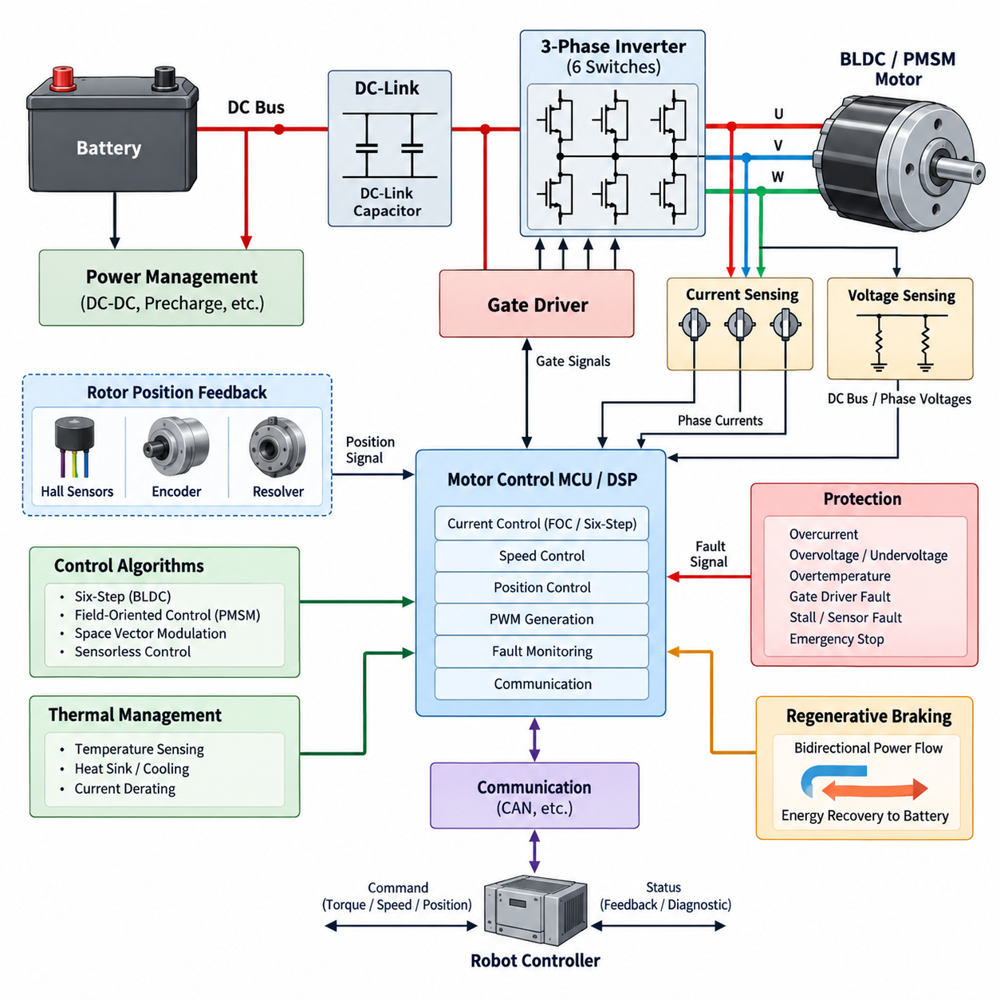
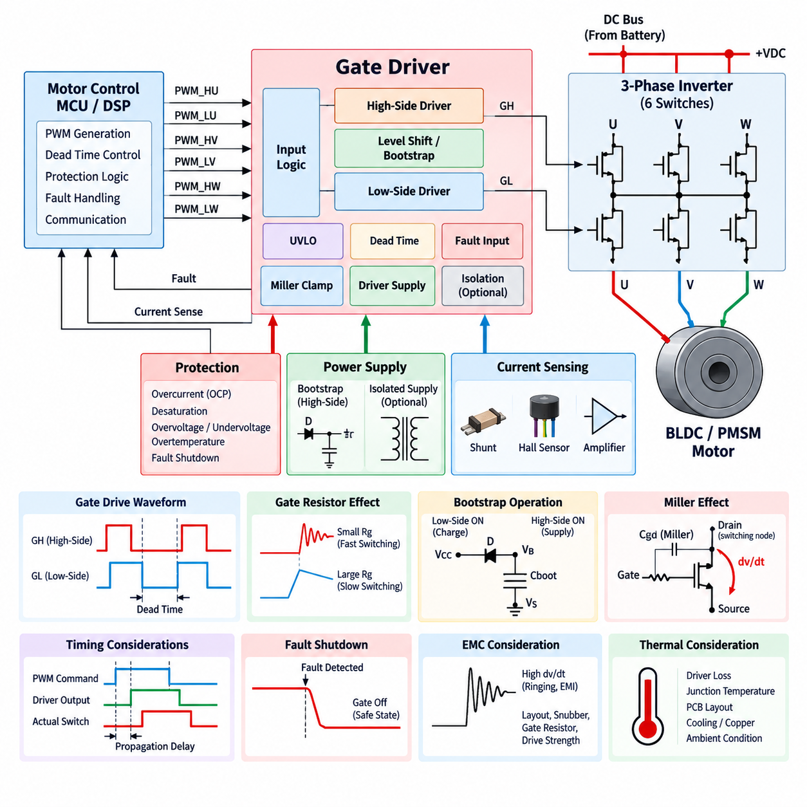
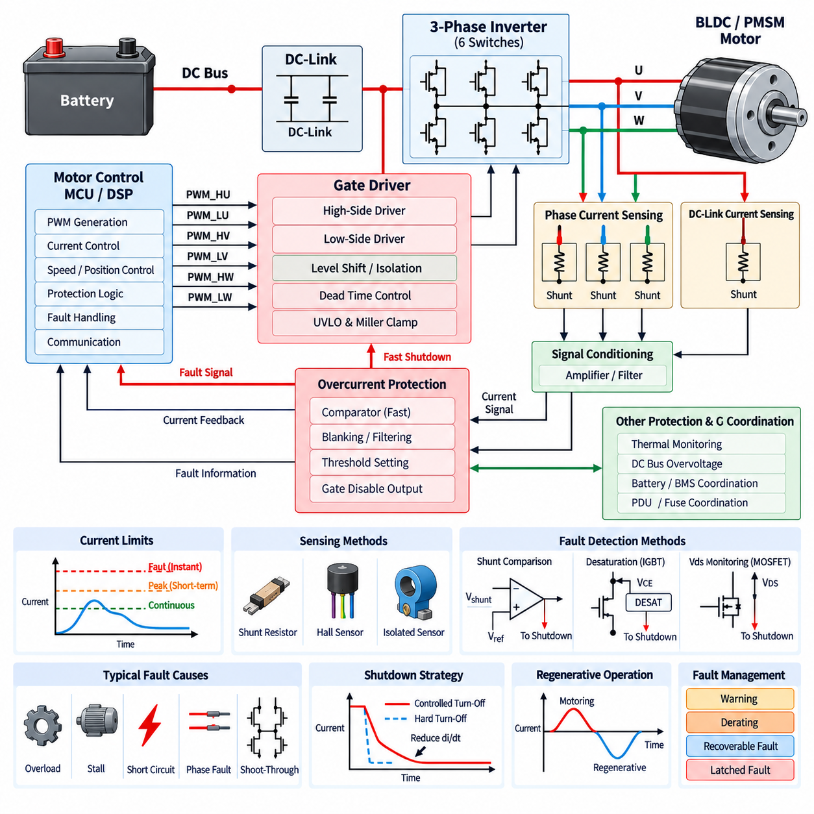
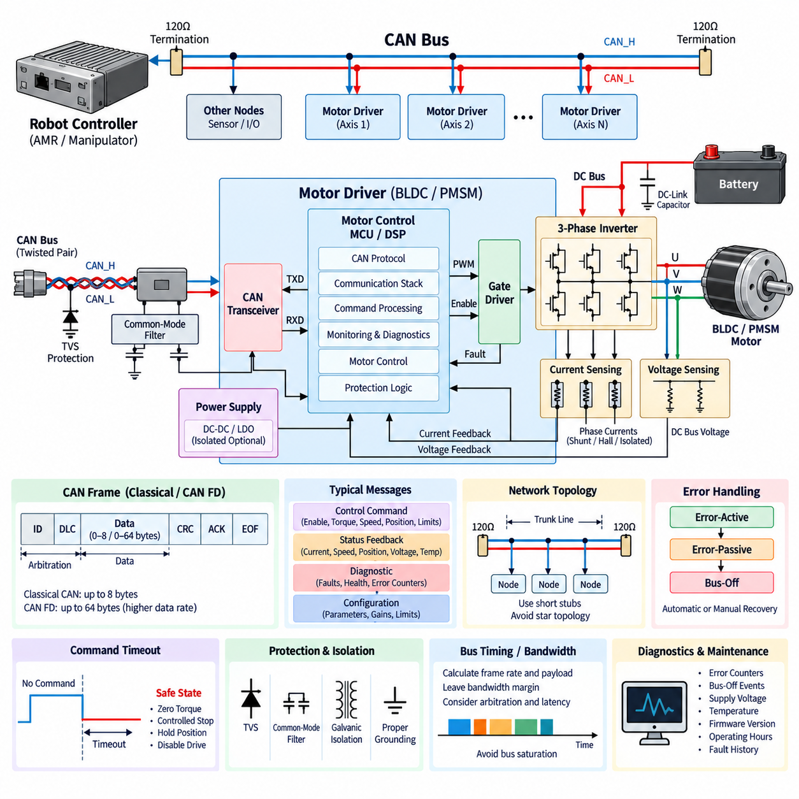
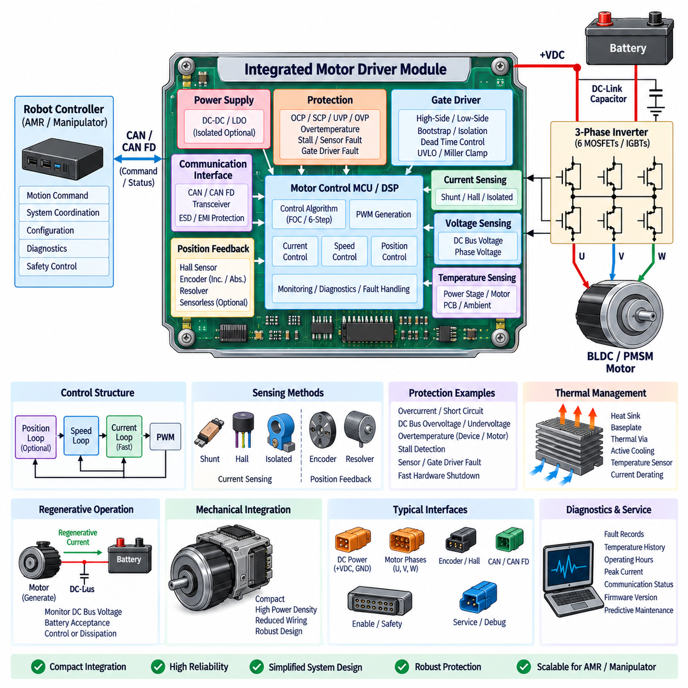

**Volume 11. Battery and Powertrain**

# Chapter 08. Motor Driver

## 08.01. BLDC/PMSM Driver Architecture

{width="7.268055555555556in" height="7.268055555555556in"}

A BLDC or PMSM motor driver forms the electrical and control interface between a DC power source and a three-phase permanent-magnet motor. Its architecture combines a DC-link stage, three-phase power inverter, gate-driver circuitry, current and voltage sensing, rotor-position feedback, digital control processor, protection functions, and communication interfaces. Together these elements convert battery energy into accurately regulated phase currents that produce the torque and speed commanded by the robot controller.

Although brushless DC motors and permanent-magnet synchronous motors share similar electromagnetic construction, their traditional control approaches differ. BLDC drives are commonly associated with trapezoidal back electromotive force and six-step electronic commutation, whereas PMSM drives normally use sinusoidal phase currents and continuous vector control. Modern robotic drives increasingly use field-oriented control for both motor types because smooth torque, low acoustic noise, efficient operation, and precise low-speed behavior are more important than maintaining a strict distinction between the two categories.

The power path normally begins with a battery or regulated DC bus connected to a DC-link capacitor network. The capacitor supplies high-frequency switching current locally and reduces voltage ripple seen by the upstream power system. A three-phase bridge containing six MOSFETs, IGBTs, or other power semiconductor devices then synthesizes the motor phase voltages. Low-voltage AMRs commonly favor MOSFET-based bridges because their low conduction resistance and fast switching characteristics can provide high efficiency at typical 24 V, 48 V, or similar battery-system voltages.

Each inverter phase contains a high-side and low-side switching device arranged as a half bridge. Three half bridges generate the U, V, and W motor outputs, while pulse-width modulation controls their effective phase voltages. The controller must prevent simultaneous conduction of the upper and lower devices in the same leg because this condition creates a destructive DC-bus short circuit known as shoot-through. Dead-time insertion, gate interlocking, undervoltage lockout, and rapid hardware shutdown therefore belong to the fundamental architecture rather than being optional control-software features.

Gate drivers translate low-power PWM commands from the controller into the voltage and current levels required to switch the inverter transistors rapidly and predictably. High-side devices require level shifting, bootstrap supplies, isolated bias supplies, or other floating-drive techniques depending on bus voltage and semiconductor technology. Gate resistance, switching speed, propagation delay, Miller behavior, and driver current capability directly influence switching loss, electromagnetic interference, voltage overshoot, and the reliability of the complete motor-drive system.

Accurate current measurement is central to torque control and protection. A driver may use three phase-current sensors, two phase sensors with mathematical reconstruction, or DC-link and low-side shunt arrangements selected according to cost, accuracy, bandwidth, and PWM strategy. Hall-effect or isolated current sensors are useful where galvanic isolation or low insertion loss is required. The analog measurement chain must preserve sufficient bandwidth and signal integrity because current errors propagate directly into torque-control errors and can destabilize high-performance current loops.

Rotor-position information determines when and how the phase currents should be applied. Simple BLDC systems can use three Hall sensors for six electrical commutation sectors, while precision PMSM drives frequently employ incremental encoders, absolute encoders, or resolvers. Sensorless architectures estimate rotor position from back-EMF, flux observers, or model-based algorithms. Sensorless operation can reduce wiring and hardware cost, but startup and very-low-speed operation are more difficult because the electrical information available for reliable position estimation becomes limited.

The digital controller coordinates current sampling, rotor-position acquisition, PWM generation, speed regulation, torque commands, fault supervision, and external communication. A microcontroller or motor-control processor typically contains synchronized ADCs, high-resolution PWM timers, capture interfaces, communication peripherals, and mathematical acceleration suitable for real-time control. Precise synchronization between PWM edges and ADC sampling is especially important because switching transients can corrupt current measurements if samples are acquired at electrically noisy points in the switching cycle.

A basic BLDC architecture can determine commutation states from Hall-sensor transitions and energize two motor phases while leaving the third phase inactive. Torque is adjusted primarily through PWM duty ratio. This six-step approach is computationally simple and can be robust for pumps, fans, wheels, and cost-sensitive actuators. Its disadvantages include torque ripple, switching-related acoustic components, and less refined low-speed motion. Robotics applications requiring smooth trajectory execution often justify more sophisticated sinusoidal or field-oriented current regulation.

PMSM-oriented architectures commonly transform measured three-phase currents into rotating reference-frame quantities. Field-oriented control regulates the direct-axis and quadrature-axis currents independently, allowing magnetic flux and torque-producing current to be managed in a manner analogous to separately controlled variables. The resulting voltage commands are transformed back into three-phase references and applied through PWM, frequently using space-vector modulation. This architecture enables smooth torque production, fast dynamic response, efficient operation, and accurate servo-like behavior over a wide operating range.

Motor control is normally organized as nested loops with different bandwidths. The inner current loop reacts rapidly to electrical dynamics and regulates torque-producing current, while a slower speed loop generates the torque request required to follow the desired velocity. Position-controlled actuators can add another outer loop that generates speed or torque commands. Separating these dynamic layers simplifies tuning and prevents slow mechanical objectives from interfering directly with the high-bandwidth electrical control needed to maintain stable phase-current regulation.

Protection circuitry must operate independently enough to remain effective when software execution becomes abnormal. Excessive phase current, DC-bus overvoltage, undervoltage, semiconductor overtemperature, motor overtemperature, gate-driver faults, stalled-rotor conditions, position-sensor failures, and communication loss can require controlled derating or immediate shutdown. Fast short-circuit protection is particularly important because power semiconductors may be damaged before a normal firmware control loop can respond. Hardware comparators and gate-disable paths therefore complement software diagnostics.

Thermal behavior strongly influences the continuous capability of a motor driver. Conduction loss in the switching devices, switching loss during PWM transitions, gate-drive loss, capacitor heating, copper loss, and PCB resistance all contribute to temperature rise. A driver designed only around short-duration peak current can overheat during sustained robot motion. Temperature sensing near critical semiconductor junctions, thermal-interface design, heat spreading, airflow or chassis conduction, and temperature-dependent current derating must therefore be coordinated with the expected mission duty cycle.

The driver also interacts dynamically with the battery and DC power network. During acceleration, high motor torque can produce substantial DC-bus current and voltage drop, while deceleration can reverse power flow and return mechanical energy through the inverter to the DC link. The architecture must consequently tolerate bidirectional energy flow even when the primary operating objective is motoring. Battery acceptance limits, DC-link overvoltage control, regenerative braking policy, and protection coordination become especially important when the battery is fully charged or temporarily unable to absorb regenerative power.

Communication connects the local motor-control loops to higher-level robotic control. CAN or similar deterministic industrial interfaces commonly carry torque, velocity, position, enable, operating-mode, diagnostic, temperature, voltage, and fault information. The motor driver should maintain fast electrical regulation locally rather than depending on a remote computer for PWM-level decisions. This separation allows the robot controller to command motion objectives at a practical network rate while the embedded motor controller executes current regulation and protection at much higher deterministic frequencies.

For mobile robots, multiple motor drivers must operate as coordinated components of a larger powertrain rather than isolated electronic modules. Wheel-speed consistency, torque limits, regenerative behavior, emergency-stop response, communication timeout handling, and power-bus loading affect vehicle-level motion. Differential-drive and multi-wheel AMRs can experience substantial traction differences between motors, so independent current regulation combined with coordinated vehicle control provides better controllability than attempting to force identical electrical commands onto every propulsion motor.

The architecture becomes more demanding for robotic joints, quadrupeds, humanoids, and other high-dynamic actuators. These systems require high torque bandwidth, low current-measurement latency, accurate rotor position, compact packaging, and rapid bidirectional torque transitions. Motor, inverter, encoder, controller, and thermal structure may therefore be integrated into a single actuator module. Such integration reduces harness length and parasitic impedance but increases thermal density and makes serviceability, electromagnetic compatibility, connector design, and fault containment more challenging.

A practical BLDC/PMSM driver is therefore best understood as a tightly coupled power-electronic and real-time control system. Semiconductor selection establishes electrical capability, sensing determines what the controller can observe, algorithms determine how accurately torque can be produced, and protection determines whether abnormal energy can be safely contained. Successful robotic implementation requires these functions to be designed together so that efficiency, dynamic response, thermal margin, electromagnetic compatibility, safety, diagnostics, and system-level controllability remain balanced across the complete operating envelope.

## 08.02. Gate Driver Design

{width="7.268055555555556in" height="7.268055555555556in"}

A gate driver is the interface between a low-power motor-control processor and the high-power semiconductor switches of a three-phase inverter. The controller generates PWM commands according to the selected motor-control algorithm, while the gate driver converts these logic-level signals into controlled gate voltages and currents. Its design strongly influences switching speed, inverter efficiency, electromagnetic interference, thermal performance, fault response, and the reliability of the complete BLDC or PMSM drive.

In a conventional three-phase inverter, six power switches are arranged as three half bridges, with one high-side and one low-side device assigned to each motor phase. The gate-driver architecture must therefore control six switching devices while maintaining precise timing relationships among them. Depending on the implementation, a single three-phase gate-driver IC, three half-bridge drivers, or separate isolated drivers may be used. The appropriate structure depends on DC-bus voltage, power level, isolation requirements, packaging, and safety objectives.

MOSFETs are widely used in low-voltage robotic motor drives because they can provide low conduction loss and high switching frequency. A MOSFET is controlled primarily by the voltage between its gate and source terminals, but its gate behaves as a nonlinear capacitive load during switching. The driver must rapidly source current to charge the gate and sink current to discharge it. Insufficient drive current increases transition time and switching loss, while excessively aggressive switching can increase voltage overshoot, ringing, and electromagnetic interference.

The required gate-drive current is closely related to gate charge, switching frequency, and the desired switching transition time. A device with large total gate charge may require substantial peak driver current even though the average gate-drive power remains relatively small. Driver selection should therefore consider source and sink peak-current ratings rather than only logic compatibility. The gate-driver output stage must also remain stable while repeatedly charging and discharging the semiconductor gate under rapidly changing inverter voltage and current conditions.

Gate resistance provides an important means of shaping switching behavior. Increasing resistance reduces gate current and slows voltage and current transitions, which can decrease ringing and electromagnetic emissions but increases switching loss. Reducing resistance produces faster transitions and potentially higher efficiency, but it can amplify parasitic effects. Separate turn-on and turn-off resistors can provide additional flexibility, allowing the designer to independently optimize switching loss, overshoot, immunity to false turn-on, and short-circuit response.

The high-side switch creates a particular gate-drive challenge because its source terminal moves between the negative and positive regions of the DC bus as the inverter commutates. The gate voltage must remain sufficiently above this moving source potential to turn the device on. Bootstrap circuits are commonly used in low- and medium-voltage motor drives because they provide a simple floating high-side supply using a diode and capacitor. Their operating limits must nevertheless be evaluated carefully when long high-side duty cycles or near-continuous conduction are required.

A bootstrap capacitor is charged when the switching node is sufficiently low and subsequently supplies the high-side gate-driver circuit when the high-side transistor turns on. Its capacitance must be large enough to support gate charge, driver quiescent current, leakage, and other losses without excessive voltage droop. If the bootstrap voltage falls below the driver\'s operating threshold, reliable switching can no longer be guaranteed. PWM strategy, minimum low-side conduction time, switching frequency, and startup behavior must therefore be considered together with bootstrap sizing.

Applications requiring stronger isolation, higher bus voltage, unusual duty cycles, or enhanced fault containment may use isolated gate drivers and isolated bias power supplies. Galvanic isolation separates the control domain from the switching power domain and can improve safety and common-mode transient immunity. However, isolation introduces propagation delay, channel-to-channel timing variation, additional power supplies, cost, and packaging complexity. Isolation should therefore be selected according to actual electrical and safety requirements rather than added without system-level justification.

Dead time is inserted between turning one transistor off and turning the complementary transistor in the same half bridge on. Without sufficient dead time, finite switching delays can cause both devices to conduct simultaneously, creating shoot-through across the DC link. Excessive dead time, however, distorts the effective phase voltage and can degrade current control, especially at low speed and low modulation levels. Gate-driver timing must therefore balance shoot-through prevention against waveform accuracy and torque-control performance.

Propagation delay and delay matching are particularly important in precision motor drives. The controller assumes that PWM commands are translated into physical switching events with predictable timing, but gate drivers, isolation stages, power devices, and PCB parasitics introduce delays. Unequal delays between phases or between high-side and low-side channels can create voltage asymmetry and current distortion. Driver specifications should consequently include propagation delay, pulse-width distortion, channel matching, and temperature dependence as well as basic electrical ratings.

Fast switching produces high dv/dt at inverter switching nodes. Through the MOSFET\'s gate-drain capacitance, commonly associated with the Miller effect, this voltage transition can inject current into the gate of a transistor that is intended to remain off. If the resulting gate voltage exceeds the threshold, parasitic turn-on may occur and create cross-conduction. Strong gate pull-down capability, optimized gate resistance, Miller clamps, negative gate bias where appropriate, and careful PCB layout can improve immunity against this mechanism.

Undervoltage lockout is another fundamental gate-driver function. A power transistor should not be commanded into normal operation when the available gate-drive voltage is too low to establish the intended low-loss conduction state. The undervoltage lockout circuit disables the driver until its supply exceeds a defined threshold and normally introduces hysteresis to prevent repetitive switching near that boundary. Separate monitoring of high-side and low-side supplies may be required, particularly in floating or isolated gate-drive architectures.

The gate driver can also provide a fast hardware path for inverter protection. Overcurrent or short-circuit information from current sensors, shunts, comparators, or semiconductor monitoring circuits can be routed directly to the driver enable or shutdown circuitry. This avoids relying exclusively on firmware response time. More advanced devices may provide fault reporting, desaturation or drain-source monitoring, configurable shutdown behavior, and controlled turn-off functions that reduce damaging voltage overshoot during severe current faults.

Fault shutdown behavior requires careful design because simply removing all gate commands is not always electrically neutral. Motor current cannot change instantaneously because of winding inductance, and stored energy continues to circulate through transistor body diodes or other freewheeling paths after switching is disabled. The driver and inverter must therefore provide predictable current-decay paths. Depending on the fault and application, the system may use coast, active short-circuit, controlled braking, or other defined safe-state strategies rather than a single universal shutdown response.

PCB layout is effectively part of the gate-driver circuit. The high-current gate loop between driver output, gate resistor, transistor gate, and source return should be short and have low parasitic inductance. Power-current paths should not share sensitive gate-return conductors where voltage drops can disturb switching behavior. Kelvin source connections, compact driver placement, local decoupling capacitors, appropriate ground referencing, and controlled separation between switching nodes and logic signals can substantially improve switching stability.

Driver-supply decoupling must be placed close to the gate-driver power pins because gate currents contain fast transient components. Bulk capacitance located elsewhere on the PCB cannot replace a low-inductance local bypass path. High-side floating supplies and isolated bias supplies likewise require suitable local energy storage. Poor decoupling can cause supply bounce, false undervoltage events, timing errors, and increased electromagnetic emissions even when the nominal supply voltage and average current capability appear adequate.

Electromagnetic compatibility creates a tradeoff between electrical efficiency and switching aggressiveness. Faster switching reduces the time spent in high-loss transition regions but increases high-frequency spectral content and sensitivity to parasitic inductance and capacitance. The gate driver provides one of the most effective control points for managing this tradeoff. Gate resistance, drive strength, switching frequency, PCB geometry, snubber networks, DC-link placement, and common-mode current paths should therefore be optimized as one coordinated inverter design problem.

Thermal design also extends into the gate-driver architecture. Although the power switches usually dominate inverter dissipation, driver losses increase with gate charge, switching frequency, number of devices, and gate-drive voltage. Integrated driver ICs may also be exposed to heat conducted from nearby MOSFETs and PCB copper. Junction-temperature estimation, package thermal resistance, component spacing, copper spreading, airflow or chassis conduction, and ambient operating conditions should be considered when defining continuous motor-drive capability.

In robotic systems, gate-driver design must ultimately support predictable motion rather than merely successful transistor switching. Accurate timing contributes to smooth phase-current control, robust fault handling protects motors and batteries, and controlled switching limits EMI that could disturb encoders, communication networks, cameras, LiDAR, or other sensitive electronics. A well-designed gate-driver stage therefore connects semiconductor-level switching physics with current control, thermal management, protection, EMC, and system-level reliability throughout the BLDC/PMSM powertrain.

## 08.03. Overcurrent Protection

{width="7.268055555555556in" height="7.268055555555556in"}

Overcurrent protection in a BLDC or PMSM motor driver prevents excessive electrical current from damaging the inverter, motor windings, battery, connectors, and power-distribution system. Abnormal current may result from mechanical overload, stalled rotation, phase-to-phase faults, short circuits, incorrect commutation, control instability, or semiconductor failure. Because destructive current can rise much faster than normal software can respond, effective protection combines sensing, hardware shutdown, firmware supervision, and coordinated recovery.

The protection architecture begins by defining multiple current limits rather than treating every overcurrent event identically. A motor drive normally has continuous-current capability determined by thermal conditions, a higher short-duration peak-current capability for acceleration or transient torque, and an absolute fault threshold that requires immediate intervention. Separating these limits allows the powertrain to deliver useful peak performance while preventing temporary overloads from developing into semiconductor, winding, or wiring damage.

Current can be measured directly in each motor phase using shunt resistors, Hall-effect sensors, magnetic sensors, or isolated current transducers. Three-phase sensing provides detailed information for both motor control and protection, while two-sensor architectures can reconstruct the missing phase current under appropriate switching conditions. The measurement method must provide sufficient bandwidth, dynamic range, accuracy, and common-mode immunity to distinguish legitimate high torque from a rapidly developing electrical fault.

Low-side shunt sensing is attractive because the measurement circuitry can remain close to the controller ground reference. However, measurable current is available only during particular inverter switching states, and switching noise can contaminate the signal. Inline phase-current sensing provides more direct observation of motor current but exposes the amplifier to rapidly changing common-mode voltage. DC-link sensing offers a compact alternative, although interpreting individual phase faults from a single bus-current measurement can be more difficult.

A current-shunt protection path typically converts the voltage across a low-value resistor into a signal that can be evaluated by an amplifier and comparator. The shunt resistance must be large enough to generate a reliable measurement signal but small enough to avoid excessive power dissipation and voltage loss. Kelvin connections are important because PCB and terminal resistance can otherwise introduce measurement errors. Shunt power rating must also account for peak current, transient energy, temperature rise, and repetitive overload conditions.

Hardware comparators provide a fast response when measured current exceeds a critical threshold. Unlike firmware protection, which depends on ADC sampling, interrupt latency, software execution, and PWM update timing, a comparator can directly command the gate driver to disable switching. This fast path is especially important for short circuits and severe inverter faults. The comparator threshold, propagation delay, hysteresis, filtering, and connection to the gate-disable logic must be designed as part of the power stage rather than as an independent diagnostic feature.

Overcurrent detection requires careful filtering because motor inverters naturally generate switching spikes. If the protection circuit responds to every brief transient, nuisance trips can make the drive unusable. If filtering is too aggressive, a real short circuit may remain undetected long enough to damage the semiconductor. Short blanking intervals, analog filtering, digital qualification, or gate-driver integrated deglitch functions can reject predictable switching disturbances while preserving rapid response to sustained or dangerously increasing current.

MOSFET-based drivers can also estimate abnormal current by monitoring drain-to-source voltage while a device is conducting. Because the on-state voltage is related to current through the effective drain-source resistance, excessive voltage may indicate overload or short circuit. This approach reduces the need for an additional high-current sensor in some protection paths, but MOSFET resistance changes significantly with temperature. Threshold selection must therefore consider device tolerance, junction temperature, gate-drive voltage, and expected operating current.

Higher-voltage power stages using IGBTs or suitable power devices often employ desaturation detection. The protection circuit monitors whether the conducting semiconductor develops an abnormally high voltage, indicating that it is leaving the expected low-loss conduction region under excessive current. Desaturation protection can provide a fast local fault indication without waiting for the main control processor. Blanking time is normally required after turn-on so that normal switching transients are not incorrectly interpreted as a fault.

When severe overcurrent is detected, the safest response is not necessarily an instantaneous uncontrolled gate turn-off. Motor winding and wiring inductance store energy proportional to current, and abruptly interrupting a large current can produce substantial voltage overshoot. The protection architecture may therefore use controlled or soft turn-off to reduce di/dt while still removing the fault rapidly. Clamp networks, snubbers, DC-link capacitors, semiconductor avalanche capability, and freewheeling paths must work together with the shutdown strategy.

Shoot-through is a particularly destructive overcurrent condition in which the high-side and low-side devices of the same inverter leg conduct simultaneously. The resulting current flows directly across the DC bus and may rise independently of motor impedance. Dead-time generation, complementary PWM interlocking, gate-driver undervoltage lockout, strong turn-off capability, and immunity to Miller-induced false turn-on form the first protection layer. Hardware overcurrent shutdown provides an additional defense if preventive measures fail.

Motor stall represents a different class of overcurrent condition. A mechanically blocked rotor may draw high torque-producing current for an extended period without generating the motion expected by the controller. The current may remain below the instantaneous short-circuit threshold while still overheating the motor and inverter. Stall protection therefore combines current magnitude with rotor speed, position change, commanded torque, and elapsed time. This illustrates why fast hardware protection and slower software supervision must coexist within the same architecture.

Thermal current limiting complements instantaneous overcurrent protection. Semiconductor junctions, PCB copper, connectors, cables, and motor windings have thermal time constants that permit temporary peak current but restrict sustained loading. The controller can estimate or measure temperature and progressively reduce allowable torque as thermal limits are approached. Such current derating maintains useful operation instead of immediately shutting down the robot whenever a long-duration load exceeds the continuous rating but remains below the catastrophic fault threshold.

The motor driver\'s protection limits must also coordinate with battery and power-distribution protection. A local inverter fault may be detected by the motor driver within microseconds, while a battery management system, fuse, circuit breaker, or electronic PDU operates on a different current threshold and time scale. Protection coordination should ensure that the device closest to the fault responds first whenever practical. This prevents a single wheel-drive fault from unnecessarily disconnecting the complete robot battery while retaining upstream protection for catastrophic failures.

Regenerative operation requires bidirectional interpretation of current. During braking, current legitimately flows from the motor through the inverter toward the DC link and battery, so a protection system designed only around positive motoring current may react incorrectly. The driver must distinguish normal regenerative current from excessive reverse current while also monitoring DC-bus voltage and battery charging limits. A fully charged or disconnected battery can convert otherwise normal regenerative braking into a dangerous DC-link overvoltage condition.

Fault classification improves recovery behavior. A brief overload caused by acceleration or an obstacle may justify temporary current limiting, whereas a repeated stall can require controlled shutdown and diagnostic reporting. A phase short, shoot-through event, or suspected semiconductor failure should normally latch the inverter into a disabled state until a defined reset procedure occurs. Separating warning, derating, recoverable fault, and latched fault states prevents inappropriate automatic restart after potentially destructive electrical failures.

After an overcurrent trip, the controller should capture diagnostic information before it is lost. Useful data includes measured phase currents, DC-link current and voltage, rotor speed and position, PWM duty cycles, temperature, operating mode, commanded torque, fault source, and timestamp. This information allows engineers to distinguish mechanical overload from wiring faults, sensor errors, gate-driver problems, or control instability. Persistent fault records also support predictive maintenance and fleet-level reliability analysis for robotic systems.

PCB layout strongly affects the reliability of overcurrent detection. High-current paths should be compact, shunt Kelvin traces should be separated from power-current conductors, and comparator inputs should be protected from switching-node coupling. Ground bounce can create false measurements if sensitive analog circuits share return paths with gate-driver or power-stage currents. Local decoupling, controlled grounding, short protection paths, and appropriate separation between analog sensing and high-dv/dt nodes improve both measurement integrity and trip consistency.

Verification must include more than testing a nominal current threshold. Protection should be evaluated across battery voltage, semiconductor temperature, motor speed, load torque, switching frequency, sensor tolerance, and expected environmental conditions. Tests should examine overload, locked rotor, phase faults, DC-bus faults, sensor failure, regenerative current, repeated fault cycling, and recovery behavior. Response time and peak fault energy are often more meaningful than the current threshold alone because semiconductor survival depends on both magnitude and duration.

For robotic powertrains, overcurrent protection ultimately connects semiconductor survival with system-level safety and availability. Fast hardware shutdown protects the inverter against destructive faults, current regulation limits normal torque, thermal derating protects sustained operation, and software diagnostics determine appropriate recovery. Coordinating these layers with the motor, battery, BMS, PDU, communication system, and robot safety controller creates a protection architecture that can deliver high transient performance while containing electrical faults before they propagate through the robot.

## 08.04. Motor Driver CAN Interface

{width="7.268055555555556in" height="7.268055555555556in"}

A motor driver CAN interface provides the communication link between an embedded BLDC or PMSM drive and the higher-level robot controller, vehicle controller, safety controller, or distributed motion system. The motor driver retains responsibility for fast current regulation, PWM generation, commutation, and local protection, while CAN transports commands, operating states, diagnostic information, and configuration data. This separation preserves deterministic local motor control while enabling coordinated system-level operation.

The interface architecture normally consists of a CAN-capable microcontroller, CAN protocol controller, physical-layer transceiver, protection components, connector, and firmware communication stack. Many modern motor-control MCUs integrate the protocol controller, leaving an external transceiver to translate logic-level transmit and receive signals into differential CAN bus voltages. The communication circuitry must coexist with a noisy inverter environment containing high phase currents, rapid switching transitions, and significant common-mode disturbances.

CAN uses differential signaling through CAN_H and CAN_L conductors, providing strong immunity to common-mode electrical noise compared with single-ended communication. This characteristic is particularly valuable near motor inverters, where high dv/dt and di/dt can couple interference into nearby wiring. Twisted-pair routing, controlled impedance, suitable cable selection, and separation from motor phase conductors help preserve signal integrity. Shielding may be added when the electromagnetic environment or cable length requires additional protection.

Bus termination is essential for reliable CAN communication. A conventional linear CAN network places approximately 120-ohm termination at each physical end of the main bus, producing an effective differential termination near 60 ohms. Termination suppresses reflections caused by signal propagation along the cable. Incorrect placement, excessive termination, long unterminated branches, or star-connected wiring can distort signal edges and reduce communication margin, particularly as bit rate and network length increase.

The motor driver should usually connect to the main CAN trunk through a short stub rather than becoming the center of an uncontrolled star topology. Stub length becomes increasingly important at higher communication speeds because propagation delay and reflections consume part of the available bit timing margin. Robot electrical architecture should therefore define trunk routing, node locations, termination positions, connector pin assignments, cable characteristics, grounding, and shielding as system-level requirements rather than leaving them to individual motor-driver modules.

Classical CAN supports payloads of up to eight data bytes per frame and is adequate for many motor-control networks carrying compact torque, velocity, status, and diagnostic signals. CAN FD extends the payload to as much as 64 bytes and permits a higher bit rate during the data phase. This can reduce communication overhead when transferring richer diagnostics, configuration parameters, calibration values, or synchronized state information while retaining the arbitration behavior and robustness associated with CAN.

Motor commands commonly include enable state, operating mode, torque request, velocity target, position target, acceleration or deceleration limits, and current limits. The exact command set depends on whether the drive operates as a torque actuator, velocity-controlled wheel drive, or position-controlled servo. The network should transmit high-level references rather than individual PWM switching commands because current-loop execution and gate timing require much faster and more deterministic processing than a shared CAN network can normally provide.

Feedback messages allow the robot controller to observe motor-driver behavior. Typical information includes measured or estimated torque, phase or DC current, motor speed, rotor position, DC-bus voltage, inverter temperature, motor temperature, operating state, fault status, and communication health. Reporting rates should reflect the dynamics of each signal. Fast motion-state information may require frequent transmission, while temperatures, accumulated operating hours, and slowly changing diagnostic parameters can be communicated at substantially lower rates.

Message identifiers establish both message meaning and CAN arbitration priority. Because numerically lower CAN identifiers receive higher arbitration priority, safety-critical or time-sensitive messages should be assigned identifiers that allow them to win arbitration over less urgent traffic. Emergency commands, drive-disable messages, critical fault reports, and high-rate control references should therefore be considered separately from configuration, maintenance, and background diagnostic traffic. Identifier allocation must be coordinated across the entire robot network.

Communication scheduling is necessary because a CAN bus has finite bandwidth. If every motor driver transmits high-rate feedback independently without a network budget, bus utilization can approach saturation and increase latency for important messages. Designers should calculate expected frame rates, payload sizes, arbitration overhead, retransmissions, and worst-case traffic. Sufficient bandwidth margin should remain for fault bursts and diagnostic activity instead of designing the network to operate continuously near its theoretical maximum capacity.

Command freshness is as important as command content. A motor driver should monitor the arrival time of periodic control messages and detect when commands become stale because of cable faults, controller failure, network congestion, or software problems. A communication watchdog can transition the drive into a defined safe state after a configurable timeout. Depending on the application, this state may involve zero torque, controlled deceleration, holding behavior, drive disable, or another system-defined response coordinated with the robot safety architecture.

Sequence counters and message timing information can strengthen communication supervision. A rolling counter allows the receiver to detect duplicated, missing, or unexpectedly reordered command updates, while timestamps or age information help determine whether data remains valid for control. Application-level checks are valuable even though CAN already contains robust frame-level error detection because a syntactically valid frame can still contain stale, incorrectly sequenced, or logically inconsistent information generated by higher-level software.

CAN provides several mechanisms for detecting communication errors, including cyclic redundancy checking, bit monitoring, frame-format checks, acknowledgment checking, and bit stuffing validation. Nodes maintain transmit and receive error counters and can progress through error-active, error-passive, and bus-off states when faults persist. A motor-driver design should define how these states affect actuator behavior, how bus-off recovery is handled, and whether automatic reconnection is acceptable after a severe communication disturbance.

Application-layer diagnostic reporting should distinguish communication faults from motor and power-stage faults. A CAN timeout is fundamentally different from overcurrent, gate-driver failure, encoder loss, DC-bus overvoltage, or motor overtemperature. The driver should encode faults consistently so the robot controller can determine whether motion can continue with reduced capability, whether one actuator must be isolated, or whether the complete platform should stop. Fault severity, persistence, recovery policy, and diagnostic history should therefore accompany basic fault codes.

The physical CAN interface requires protection against electrical transients generated within the robot. Transient-voltage suppressors, appropriate common-mode filtering, controlled grounding, and protected transceiver devices can improve immunity to electrostatic discharge and switching disturbances. Protection components must be selected carefully because excessive capacitance can degrade CAN signal edges. The transceiver supply and MCU interface should also include suitable local decoupling so inverter switching currents do not disturb communication electronics through shared supply impedance.

Galvanically isolated CAN may be appropriate when motor drivers operate across different ground domains, when long cables create significant ground-potential differences, or when system safety and fault containment require electrical separation. Isolation can prevent large ground currents from flowing through communication wiring and can improve common-mode robustness. However, isolated transceivers and isolated power supplies increase cost, propagation delay, board area, and thermal load, so isolation should be based on the actual grounding architecture and environmental requirements.

Grounding strategy remains important even with differential signaling. CAN transceivers have a limited common-mode voltage range, and excessive ground difference between nodes can exceed that capability. A dedicated reference conductor, controlled chassis bonding, isolation, or combinations of these techniques may be necessary depending on robot size and power distribution. Motor phase cables and inverter switching currents should not share uncontrolled return paths with communication circuitry because common impedance can convert power-stage disturbances into network noise.

Parameter configuration can also be carried over CAN. Current limits, speed limits, control gains, motor parameters, encoder settings, thermal thresholds, and communication options may be accessible through defined service messages. Safety-relevant parameters should not be modified accidentally during normal operation. Access control, operating-state restrictions, parameter range checking, nonvolatile storage validation, version management, and explicit save procedures help prevent configuration errors from becoming unexpected motion or protection failures.

For multi-axis robots and AMRs, CAN enables distributed motor control in which each driver executes its own high-speed local loops while a central controller coordinates motion. A differential-drive AMR can command left and right wheel velocities or torques, while manipulators can distribute joint references to several servo drives. This architecture reduces centralized real-time processing requirements, but coordinated motion depends on predictable communication latency, consistent update periods, synchronized state interpretation, and well-defined behavior when individual nodes fail.

Network diagnostics are especially valuable during commissioning and field maintenance. The system can monitor error counters, bus-off events, command timeouts, supply voltage, temperature, reset reason, firmware version, operating hours, and accumulated fault history. Capturing these parameters together with motor operating conditions helps distinguish a defective motor driver from harness damage, termination errors, EMI problems, overloaded network traffic, or higher-level controller faults. Such observability becomes increasingly important as robot fleets grow.

A robust motor-driver CAN interface is therefore not simply a connector added to the inverter PCB. It is a coordinated communication architecture spanning the MCU, transceiver, physical bus, message definitions, timing, diagnostics, protection, grounding, and system safety behavior. When these elements are engineered together, CAN allows BLDC and PMSM drives to preserve fast local motor control while participating reliably in distributed AMR, mobile-manipulator, and other robotic powertrain architectures.

## 08.05. Integrated Motor Driver Module

{width="7.268055555555556in" height="7.268055555555556in"}

An integrated motor driver module combines the major electrical and control functions required to operate a BLDC or PMSM motor within a compact, coordinated assembly. Instead of implementing the inverter, gate driver, controller, sensing, protection, communication, and thermal interfaces as loosely connected subsystems, the module integrates them into a defined motor-drive platform. This approach reduces wiring complexity, shortens critical electrical paths, and simplifies integration into robotic powertrains.

The power stage normally contains a three-phase inverter formed by six MOSFETs, IGBTs, or other suitable power semiconductor devices. Three half bridges generate the U, V, and W phase outputs required by the motor, while a DC-link capacitor network supplies high-frequency switching current locally. Semiconductor technology is selected according to DC-bus voltage, continuous and peak current, switching frequency, efficiency targets, thermal constraints, and the expected regenerative operating conditions of the actuator.

Gate-driver circuitry is integrated close to the power switches to minimize parasitic inductance in the gate-current loops. The driver converts PWM logic signals into the voltage and current required to turn the semiconductor devices on and off predictably. High-side drive, bootstrap or isolated bias supplies, dead-time management, undervoltage lockout, Miller-effect mitigation, and rapid gate shutdown can be incorporated within the module. Close physical integration improves switching control but increases the importance of careful PCB layout and thermal separation.

Current and voltage sensing provide the feedback required for both motor control and protection. Phase-current sensing may use shunt resistors, Hall-effect sensors, magnetic sensors, or isolated transducers, while DC-link voltage measurement allows the controller to monitor battery conditions and regenerative energy flow. Integrated modules can reduce sensing-loop length and improve synchronization between ADC sampling and PWM operation, although switching noise must still be controlled through grounding, filtering, Kelvin connections, and appropriate analog layout.

Rotor-position feedback is another major interface within the module. BLDC applications may use Hall sensors for sector-based commutation, while higher-performance PMSM and servo applications can employ incremental encoders, absolute encoders, or resolvers. Sensorless estimation may also be implemented when hardware reduction is desirable. The integrated controller must provide appropriate electrical interfaces, signal conditioning, timing capture, and diagnostics so that rotor-position information remains reliable across speed, temperature, vibration, and electromagnetic disturbances.

A motor-control MCU or DSP forms the computational center of the integrated module. It acquires current, voltage, temperature, and position information, executes the selected control algorithms, and generates synchronized PWM signals for the inverter. Depending on the application, the software may implement six-step commutation, sinusoidal control, field-oriented control, space-vector modulation, current regulation, speed regulation, and position control. Fast local execution prevents high-bandwidth motor control from depending on an external robot computer or communication network.

The control structure is commonly organized into nested loops. A high-bandwidth current loop regulates torque-producing current, a slower speed loop controls rotational velocity, and an optional outer position loop manages actuator position. Integrating the sensing, computation, and switching hardware within one module can reduce latency and timing uncertainty between these loops. This is particularly valuable in robotic joints and traction systems where rapid torque response, smooth low-speed operation, and predictable dynamic behavior are required.

Protection functions are fundamental to the integrated architecture because a compact module contains high energy density within a small physical volume. Overcurrent, short circuit, shoot-through, DC-bus overvoltage, undervoltage, semiconductor overtemperature, motor overtemperature, rotor stall, sensor failure, and gate-driver faults should be monitored. Critical faults require fast hardware protection paths that can disable the inverter independently of normal software execution, while firmware provides slower supervision, fault classification, logging, and recovery management.

Protection behavior should distinguish between operating limits and destructive faults. Temporary high current during acceleration may be permitted within the module\'s peak-current capability, while sustained overload can trigger progressive torque derating. A severe short circuit or suspected semiconductor failure normally requires immediate shutdown and a latched fault state. This layered strategy allows the module to deliver high transient motor performance without treating every overload as a catastrophic event or allowing dangerous electrical conditions to persist.

Thermal integration often determines the continuous performance of the module. Power-semiconductor conduction and switching losses, gate-driver losses, current-sensor dissipation, PCB copper losses, and controller electronics all contribute to heat generation. Heat must be transferred through copper planes, thermal vias, heat spreaders, baseplates, heat sinks, chassis interfaces, or active cooling where necessary. Temperature sensors positioned near critical components provide feedback for thermal protection and current derating before junction limits are exceeded.

Compact integration creates a strong relationship between electrical layout and thermal design. Locating power devices close together reduces commutation-loop inductance but concentrates heat, while increasing spacing may improve thermal distribution at the expense of larger electrical loops. The designer must therefore optimize switching geometry, DC-link capacitor placement, gate-driver location, current sensing, copper thickness, heat-flow paths, and mechanical packaging simultaneously. Electrical, thermal, and mechanical architecture cannot be treated as independent design activities.

Electromagnetic compatibility is another major advantage and challenge of integration. Shorter gate loops, current paths, and sensor connections can reduce radiated and conducted interference, but high dv/dt switching nodes remain close to sensitive analog and digital circuits. Functional partitioning of the PCB, controlled return paths, local decoupling, filtering, shielding where appropriate, and separation of noisy and sensitive nodes are essential. Switching speed and gate resistance may also be tuned to balance inverter efficiency against EMI performance.

Communication interfaces allow the integrated motor driver to operate as a distributed actuator node within the robot. CAN or CAN FD can carry enable commands, torque references, velocity targets, position targets, current limits, configuration data, and diagnostic information. The module can return measured current, speed, position, voltage, temperature, operating state, and fault information. High-speed current and PWM control remain local, while the network communicates higher-level motion objectives at a rate appropriate for system coordination.

Communication supervision should be integrated with actuator safety behavior. If periodic commands disappear because of a network fault or controller failure, a communication watchdog can identify stale commands and transition the module into a predefined state. Depending on the application, the response may be zero torque, controlled deceleration, holding torque, coast, or complete inverter disable. Sequence counters, message validity checks, timeout monitoring, and fault reporting help ensure that communication failures do not create uncontrolled actuator motion.

Regenerative operation must also be considered at module level. During deceleration or externally driven motion, the BLDC or PMSM can operate as a generator and return energy through the inverter to the DC link. The integrated driver therefore needs to monitor current direction, DC-bus voltage, battery acceptance conditions, and applicable torque limits. If the upstream battery or BMS cannot accept regenerative energy, the module or system-level power architecture must prevent excessive DC-link voltage through coordinated control or alternative energy-management measures.

Mechanical integration can extend the motor driver from a PCB assembly into a complete actuator module. In wheel drives, robotic joints, quadrupeds, humanoids, and mobile manipulators, the inverter and controller may be mounted directly to or inside the motor housing. This minimizes motor-phase cable length and can reduce external harness complexity. However, motor-generated heat, vibration, shock, contamination, connector loads, and service requirements then become direct constraints on the electronics and enclosure design.

Connector architecture becomes especially important when functions are consolidated into a single module. Typical interfaces include DC power, three motor phases when the motor is external, encoder or Hall signals, CAN communication, safety or enable signals, and possibly service or programming connections. Current rating, contact resistance, environmental sealing, vibration resistance, keying, shielding, and maintainability should match the application. Integrated modules reduce connector count only when their interface boundaries are deliberately defined.

Diagnostics and serviceability should be designed into the module from the beginning. The controller can record overcurrent events, bus-voltage excursions, temperature history, communication faults, sensor failures, operating hours, peak current, firmware version, and reset causes. Such information supports commissioning, field troubleshooting, predictive maintenance, and fleet-level reliability analysis. A replaceable integrated module with standardized power, communication, and mechanical interfaces can also simplify robot maintenance compared with troubleshooting several distributed motor-drive boards.

Functional partitioning remains important even within a highly integrated product. Hardware protection should remain capable of disabling the power stage when firmware becomes unresponsive, and safety-related enable paths may require independence from normal communication. Sensitive measurement circuits should remain electrically separated from noisy switching regions, while control software should distinguish normal regulation, degraded operation, recoverable faults, and latched faults. Integration should reduce unnecessary interfaces without eliminating useful fault-containment boundaries.

For AMRs, an integrated motor driver can form a standardized wheel-drive node containing local torque control, sensing, diagnostics, and communication. For manipulators and legged robots, the same concept can evolve into an integrated joint actuator combining motor, transmission, encoder, inverter, controller, and thermal structure. Standardized modules make it easier to scale a robot across different numbers of axes while allowing the central computer to concentrate on trajectory generation, perception, planning, and coordinated motion rather than semiconductor-level control.

The integrated motor driver module is therefore a system-level building block that unifies power conversion, motor control, sensing, protection, communication, thermal management, EMC, diagnostics, and mechanical packaging. Its value comes not simply from placing components closer together, but from designing their electrical, timing, thermal, and safety interactions as one coordinated architecture. Proper integration can deliver compact size, high power density, reduced harness complexity, predictable torque response, improved reliability, and scalable deployment across modern robotic powertrains.
