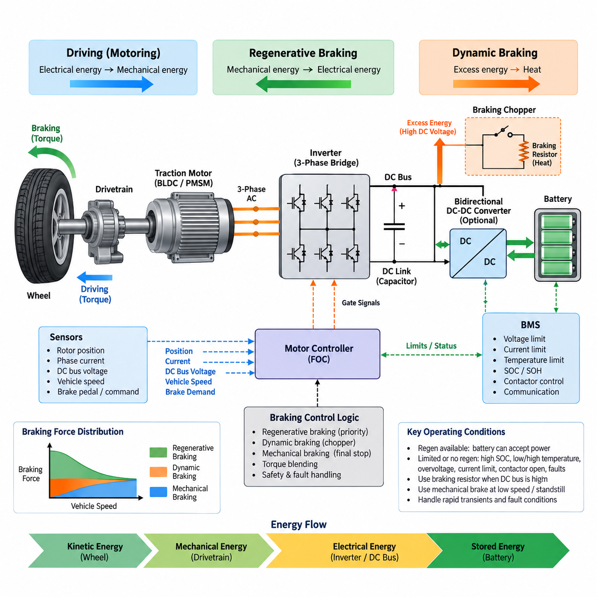
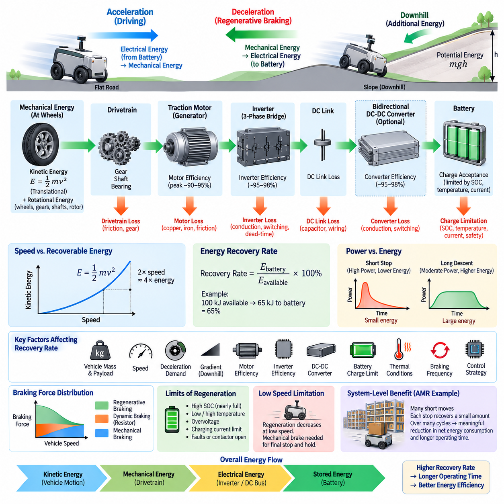
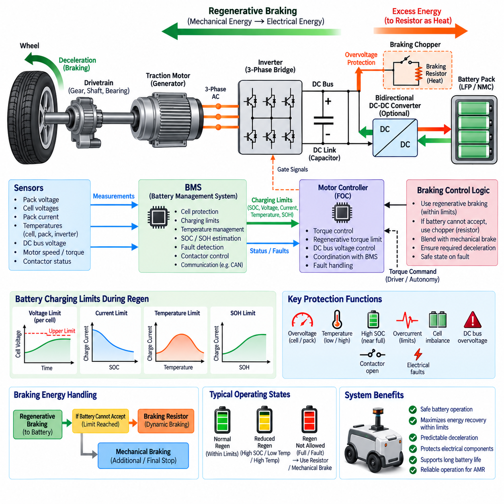
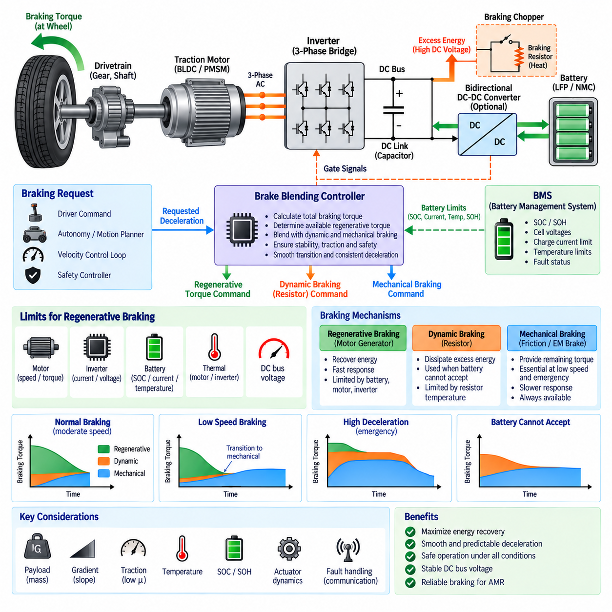
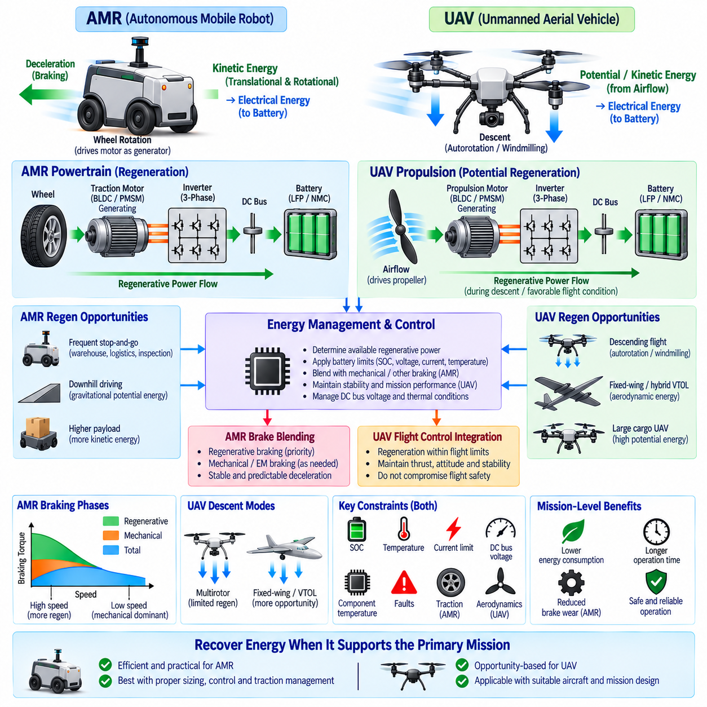

**Volume 11. Battery and Powertrain**

# Chapter 09. Regenerative Braking

## 09.01. Regenerative Braking Topology

{width="7.268055555555556in" height="7.268055555555556in"}

Regenerative braking converts the kinetic energy of a moving robot or electric vehicle back into electrical energy during deceleration. Instead of operating only as a torque-producing actuator, the traction motor changes into a generator when commanded torque opposes rotational motion. The generated electrical power flows through the motor drive toward the DC power system, reducing the energy that must be dissipated by mechanical friction brakes.

The basic regenerative topology is closely related to the bidirectional behavior of a three-phase inverter and a BLDC or PMSM traction motor. During propulsion, electrical energy flows from the battery through the DC link and inverter into the motor. During regeneration, the direction of real power reverses: mechanical energy at the motor shaft is converted into three-phase electrical energy, processed by the inverter, and returned through the DC link toward the battery.

A conventional three-phase bridge contains six controlled semiconductor switches with associated freewheeling paths. Although its physical arrangement may remain unchanged between motoring and braking, the switching strategy determines the direction of electromagnetic torque and power flow. Regenerative operation therefore does not normally require a completely separate traction converter, provided that the inverter, gate drivers, DC-link components, and control system support bidirectional energy transfer.

Regeneration begins when the controller requests negative torque while the rotor is still rotating. Field-oriented control can establish a torque-producing current component whose polarity generates electromagnetic torque opposite to the direction of motion. The motor consequently extracts mechanical energy from the drivetrain. Rotor position, phase current, DC-link voltage, requested deceleration, and allowable battery charging power must be evaluated continuously while this operating state is maintained.

The DC link forms the central electrical interface between the inverter and the energy-storage system. Energy generated by the motor initially raises or supports the DC-link voltage, after which it must be transferred to a load capable of accepting that energy. In a battery-powered robot, the battery is normally the primary destination. DC-link capacitors absorb fast transient differences between generated power and the slower response of the battery and supervisory control system.

Direct battery-connected architectures are attractive because the regenerative current can flow from the inverter DC bus toward the battery without an additional high-power conversion stage. This arrangement minimizes component count, conduction loss, cost, and packaging volume. However, useful regeneration is possible only when the generated DC-bus conditions are compatible with battery voltage, BMS limits, contactor states, wiring capacity, and the permissible charging current of the cells.

A topology incorporating a bidirectional DC-DC converter between the traction DC link and battery provides greater control over regenerative energy transfer. The converter can regulate battery charging current independently of the instantaneous inverter-side voltage and can accommodate powertrains whose motor bus and battery operate over different voltage ranges. This flexibility is particularly valuable when the battery voltage changes substantially with state of charge or when several DC buses coexist.

The price of an intermediate bidirectional converter is additional semiconductor loss, magnetic components, control complexity, thermal load, mass, and cost. Consequently, its inclusion should be justified at system level rather than treated as an automatic requirement. A compact AMR with a relatively narrow battery-voltage range may favor direct regeneration, whereas a more complex powertrain can benefit from controlled DC-link and battery-side voltage decoupling.

Regenerative capability cannot be determined by the inverter alone because the battery may temporarily be unable to accept the generated power. High state of charge, low or high cell temperature, excessive cell voltage, charging-current restrictions, communication faults, or an open battery contactor can reduce or completely prohibit regeneration. The BMS therefore supplies operating limits that the motor controller must translate into an allowable negative-torque or regenerative-power boundary.

When the battery cannot absorb all generated energy, the topology requires another method of controlling the DC-link voltage. A braking chopper can connect a braking resistor across the DC bus when voltage exceeds a defined threshold. Excess electrical energy is then converted into heat instead of being returned to the battery. This dynamic-braking path sacrifices energy recovery but provides an important means of maintaining controlled deceleration and preventing damaging DC-bus overvoltage.

A practical powertrain can therefore combine regenerative braking, resistor-based dynamic braking, and mechanical braking. Regeneration is preferred while the battery and electrical system can accept energy. A braking resistor can handle electrical energy that exceeds the allowable charging capability, while friction or electromechanical brakes provide the remaining stopping torque and stationary holding capability. These paths form complementary layers rather than mutually exclusive braking technologies.

Low-speed behavior is another important limitation of regenerative topology. As rotational speed decreases, the available generated voltage and recoverable electrical power generally decline, making regeneration progressively less effective near zero speed. The vehicle or robot must consequently transition to another braking mechanism for final stopping and holding. This characteristic is especially important for AMRs that perform frequent precise stops, docking maneuvers, and operation on inclined surfaces.

The topology must also accommodate rapid transient events. An AMR can change from acceleration to braking within milliseconds, causing the inverter power direction and DC-link current to reverse quickly. DC-link capacitance, current sensing, voltage sensing, gate control, contactor behavior, and protection thresholds must therefore be coordinated. Excessive control delay can allow the bus voltage to rise before regenerative current is reduced or an alternative dissipation path becomes active.

Energy flow during regeneration can be represented conceptually as wheel motion transferring torque through the drivetrain to the motor, followed by electrical conversion through the inverter, stabilization at the DC link, and transfer toward the battery. The reverse relationship with normal propulsion is fundamental to electric powertrain design. This bidirectional structure enables the same motor and inverter hardware to participate in both vehicle acceleration and controlled recovery of kinetic energy.

The regenerative current path also affects conductor, connector, fuse, contactor, and PDU design. Components selected only from maximum propulsion current may overlook reverse-current capability, transient heating, interruption behavior, or measurement direction. Current sensors should distinguish positive and negative power flow, while protection logic must avoid interpreting legitimate regeneration as an abnormal reverse-current condition. Electrical architecture therefore has to be explicitly designed for bidirectional operation.

Fault handling is especially important because regenerative braking couples motion control directly to the battery and high-power DC network. Loss of BMS communication, inverter faults, DC-link overvoltage, current-sensor failure, isolation faults, or unexpected contactor opening can suddenly remove the normal energy-recovery path. The braking architecture must detect such conditions rapidly, reduce regenerative torque safely, and transfer the required deceleration to available dynamic or mechanical braking mechanisms.

For mobile robots, regenerative topology should ultimately be treated as a system-level energy and braking architecture rather than merely an inverter feature. The motor, inverter, DC link, battery, BMS, optional bidirectional converter, braking resistor, mechanical brake, sensors, and supervisory controller must cooperate under changing speed and battery conditions. Correct integration enables efficient energy recovery while preserving predictable stopping performance, electrical protection, and powertrain reliability.

## 09.02. Energy Recovery Rate

{width="7.268055555555556in" height="7.268055555555556in"}

Energy recovery rate describes how effectively a regenerative braking system converts the kinetic and potential energy available during deceleration into electrical energy that can be stored and reused. It is not determined only by motor efficiency. The complete energy path includes the drivetrain, traction motor, inverter, DC link, optional DC-DC converter, battery, and control system, with losses occurring at every conversion stage.

The theoretical energy available for recovery begins with the mechanical energy of the moving platform. For translational motion, kinetic energy is proportional to vehicle mass and to the square of velocity, expressed as E = 1/2 mv². Rotating wheels, gears, shafts, and motor rotors also contain rotational kinetic energy. On a descending slope, gravitational potential energy can additionally become available for regenerative conversion.

Because kinetic energy increases with the square of velocity, vehicle speed strongly influences the amount of recoverable energy. Doubling speed produces approximately four times the translational kinetic energy when mass remains constant. Consequently, a high-speed deceleration event may provide substantially more recoverable energy than a low-speed stop, although the inverter and battery must also tolerate the corresponding increase in regenerative power.

The energy recovery rate can be expressed as the ratio between electrical energy successfully returned to the storage system and the mechanical energy theoretically available during braking. If 100 kJ of mechanical energy becomes available and 65 kJ reaches the battery, the effective recovery ratio is 65 percent. This system-level value includes conversion losses and energy that could not be recovered because of operating or safety limitations.

Motor-generator efficiency is one of the first factors affecting recovery. During regeneration, the traction motor converts shaft power into electrical power while experiencing copper loss, magnetic loss, mechanical friction, and other speed-dependent losses. The efficiency map therefore changes with motor speed and torque. Regenerative operation near an efficient region can recover considerably more energy than operation at very low speed or unfavorable torque conditions.

The inverter introduces another conversion stage. Semiconductor conduction losses, switching losses, dead-time effects, gate-drive consumption, and DC-link losses reduce the electrical energy transferred from the motor to the DC bus. High inverter efficiency is therefore important for useful regeneration, but efficiency must be evaluated over the actual regenerative speed and torque range rather than from a single peak-efficiency specification.

If a bidirectional DC-DC converter is installed between the DC link and battery, its efficiency further influences the recovered energy. The converter may improve overall utilization by maintaining controlled battery charging across a wider voltage range, but it also introduces switching and conduction losses. The design tradeoff is therefore between additional conversion loss and the ability to capture energy that might otherwise be unavailable because of voltage mismatch or charging restrictions.

Battery charge acceptance frequently becomes the dominant practical limit. The battery management system may restrict regenerative current according to state of charge, cell voltage, temperature, state of health, and pack operating conditions. A nearly full battery can accept little regenerative energy even when substantial mechanical energy is available. Similarly, cold cells may require severe charging-current reduction to avoid degradation or unsafe operating conditions.

Regenerative power and regenerative energy should be distinguished carefully. Power represents the instantaneous rate of energy conversion, while energy represents the accumulated amount recovered throughout a braking event. A short, aggressive stop may produce high regenerative power but relatively limited total energy. A long downhill descent may involve moderate power yet recover much greater energy because generation continues over an extended period.

Deceleration demand also affects recovery rate. If the requested braking torque remains within the regenerative capability of the motor, inverter, and battery, a large portion of braking can be performed electrically. During emergency or high-deceleration braking, the required torque may exceed the regenerative limit. Mechanical braking must then provide the difference, and the portion of kinetic energy converted into frictional heat cannot be recovered.

At low vehicle speed, regenerative effectiveness normally decreases because motor-generated voltage and available electrical power become small. Regeneration therefore cannot recover all kinetic energy down to zero speed. Mechanical or electromechanical brakes eventually complete the stopping process and hold the vehicle stationary. For an AMR performing many low-speed movements, this limitation can significantly reduce the practical recovery ratio compared with theoretical calculations.

Braking frequency strongly influences the accumulated energy benefit in mobile robotics. An AMR operating in a warehouse or factory may repeatedly accelerate, travel a short distance, decelerate, stop, and accelerate again. Each individual braking event may recover only a small amount of energy, but thousands of repeated cycles can produce a meaningful reduction in net battery consumption and can improve operating time between charging events.

Vehicle mass and payload also influence the recoverable-energy opportunity. A heavily loaded AMR contains more kinetic energy than the same platform traveling at identical speed without payload. This increases potential regeneration during deceleration, but it also raises braking torque and power requirements. The regenerative system must therefore be sized according to realistic combinations of gross mass, maximum speed, gradient, duty cycle, and allowable stopping distance.

Road or floor gradient introduces another important energy source. During downhill travel, gravitational potential energy continuously enters the drivetrain. Regenerative braking can convert part of this energy into battery charge while simultaneously controlling vehicle speed. On long descents, however, the limiting factor may shift from available kinetic energy to continuous regenerative power, battery charge acceptance, inverter temperature, or motor thermal capability.

Thermal conditions can gradually reduce recovery performance during repeated braking. Motor winding temperature, inverter junction temperature, DC-DC converter temperature, battery temperature, and braking-resistor temperature can all impose derating limits. A system that achieves high recovery during a single laboratory stop may therefore perform differently during sustained field operation. Energy-recovery evaluation should include repeated cycles and thermal steady-state conditions.

Control strategy determines how closely practical recovery approaches the hardware limit. The supervisory controller can calculate allowable regenerative torque from driver or autonomy braking demand, motor capability, DC-bus voltage, battery charging limits, and system temperature. Regeneration is normally prioritized within these boundaries, while dynamic or mechanical braking supplies the remaining torque required to satisfy the commanded deceleration safely and predictably.

Measurement of recovery rate requires consistent energy boundaries. Mechanical energy at the wheels, electrical energy at the inverter DC terminals, and energy actually stored in the battery represent different measurement points and therefore produce different efficiency values. Current, voltage, speed, torque, and time should be sampled with sufficient accuracy so that instantaneous power can be integrated over the complete braking event without confusing intermediate conversion efficiency with total recovery.

For practical AMR evaluation, recovered energy should also be compared with total mission energy rather than examining braking events alone. Propulsion, steering, computing, sensors, communication equipment, cooling, and auxiliary electronics continue consuming power during operation. A high regenerative conversion efficiency does not automatically imply an equally large extension of mission duration because only the portion of mission energy associated with recoverable mechanical motion can be returned.

Energy recovery rate is therefore a system-level performance characteristic linking vehicle dynamics, motor-generator efficiency, power electronics, battery charge acceptance, thermal limits, and braking control. Maximizing it requires more than increasing regenerative torque. The system must capture available mechanical energy efficiently while respecting DC-bus stability, battery protection, stopping requirements, component ratings, and predictable transitions to alternative braking mechanisms.

## 09.03. Battery Protection During Regen

{width="7.268055555555556in" height="7.268055555555556in"}

Battery protection during regenerative braking is essential because the traction system temporarily changes the battery from an energy source into an energy sink. Mechanical energy recovered by the motor is converted into electrical power and returned through the inverter and DC link. This reverse power flow must remain within the battery pack's allowable voltage, current, temperature, and cell-level operating limits throughout every braking event.

The battery management system, or BMS, is the primary supervisory element responsible for determining whether regenerative charging is permitted. It continuously evaluates pack voltage, individual cell voltages, current, temperature, state of charge, and fault status. These measurements are converted into charging limits that can be communicated to the motor controller so regenerative torque never assumes unlimited battery charge acceptance.

Cell overvoltage is one of the most important risks during regeneration. Even when the average pack voltage appears acceptable, a cell with higher state of charge or lower available capacity may reach its upper voltage limit earlier than neighboring cells. The BMS must therefore supervise individual cell voltages rather than relying only on total pack voltage, because the weakest or most highly charged cell can determine the allowable regenerative current.

High state of charge significantly reduces the amount of regenerative energy that a battery can safely accept. When the battery approaches full charge, only a small energy margin remains before cell voltage reaches its upper limit. The control system should progressively reduce allowable regenerative power as SOC increases instead of waiting for a hard overvoltage trip. This creates a controlled transition from energy recovery to alternative braking methods.

Battery temperature also determines safe regenerative charging capability. Lithium-based cells generally accept charge differently across their operating temperature range, and charging at very low temperature can accelerate undesirable electrochemical effects and degradation. At elevated temperature, additional charging losses may increase thermal stress. The BMS therefore applies temperature-dependent regenerative current limits based on the validated characteristics of the selected cell chemistry.

LFP and NMC batteries require protection strategies adapted to their electrochemical characteristics. LFP is widely valued for thermal stability and cycle durability, but its relatively flat voltage-versus-SOC characteristic can complicate accurate SOC interpretation. NMC offers high energy and power density but requires careful management of voltage and thermal conditions. In both cases, regenerative charging limits should originate from validated cell and pack operating data.

Regenerative current can rise rapidly when a moving robot performs strong deceleration. The motor controller may command substantial negative torque within milliseconds, while the resulting electrical power immediately appears on the DC link. Battery protection therefore requires fast coordination among current sensing, DC-link voltage monitoring, inverter control, and BMS limits. Slow communication alone should not be the only defense against damaging transient conditions.

The allowable charging current should normally be represented as a dynamic limit rather than a single fixed value. It may change according to SOC, cell temperature, pack temperature, cell voltage spread, state of health, and recent operating history. The motor controller can convert the BMS-provided charging-current or charging-power limit into a maximum regenerative torque that varies continuously as battery conditions change.

DC-link overvoltage provides another critical indication that regenerated energy is not being absorbed quickly enough. When mechanical generation exceeds the power accepted by the battery and other loads, energy accumulates in the DC-link capacitor and raises bus voltage. The inverter controller must monitor this voltage rapidly and reduce regenerative torque before the voltage exceeds semiconductor, capacitor, converter, connector, or insulation ratings.

A braking chopper and braking resistor can provide a secondary protection path when the battery cannot accept all regenerated energy. If DC-bus voltage approaches a defined threshold, the chopper connects the resistor so excess electrical energy is dissipated as heat. This allows braking torque to continue without forcing excessive charging current into the battery, although resistor temperature and continuous energy-dissipation capability must also be protected.

Mechanical braking remains necessary because battery protection must take priority over maximizing energy recovery. When regenerative power is restricted by high SOC, temperature, voltage, current, communication faults, or other battery conditions, the braking controller must reduce electrical regeneration and increase mechanical braking accordingly. The commanded vehicle deceleration should remain predictable even when the available regenerative contribution changes suddenly.

Contactor state is particularly important during regenerative operation. If the main battery contactor opens while substantial regenerative power is flowing, the normal energy path to the battery disappears almost instantly. The remaining energy can produce a rapid DC-link voltage rise. Regenerative torque should therefore be disabled or transferred to another controlled dissipation path whenever contactor status indicates that the battery is disconnected or about to be isolated.

Protection coordination should distinguish normal regenerative reverse current from abnormal electrical faults. Current sensors, protection algorithms, contactors, fuses, and power distribution devices must support the intended bidirectional power flow. A protection system designed under the assumption that current always flows from battery to inverter could incorrectly interpret legitimate regenerative current as a fault or fail to detect abnormal conditions in the reverse direction.

Communication between the BMS and motor controller is another important safety interface. The BMS can provide maximum charging current, maximum charging power, SOC, temperature status, voltage limits, and fault information through interfaces such as CAN. The motor controller should validate message freshness and plausibility. Missing, delayed, corrupted, or implausible limit information should cause regeneration to move toward a predefined safe state rather than continue using stale limits.

Cell imbalance can further restrict regenerative charging even when pack SOC is not especially high. A cell that reaches its upper voltage threshold earlier than the rest of the pack can force the BMS to reduce charging current for the entire battery. Cell balancing helps preserve usable charging headroom, but balancing circuits are generally not a substitute for controlling high regenerative power. Regeneration must still respect instantaneous cell-voltage limits.

State of health influences regenerative protection as the battery ages. Increased internal resistance can produce greater voltage rise and heat generation for the same charging current, while reduced capacity can cause SOC and cell voltage to change more rapidly. A regenerative strategy calibrated only for a new battery may therefore become inappropriate later in life. BMS limits should adapt to estimated battery condition and verified aging characteristics.

Fault handling should use layered protection rather than relying on a single threshold. Normal control can progressively derate regenerative torque as the battery approaches operating limits, while faster inverter-level protection can respond to excessive DC-bus voltage or current. The BMS can initiate stronger protective actions for cell-level violations, and mechanical braking can preserve required deceleration when electrical regeneration becomes unavailable.

For AMRs, repeated stop-and-go operation makes these protection mechanisms especially important. Frequent short braking events can repeatedly inject charging pulses into the battery, creating conditions different from steady external charging. Evaluation should therefore consider peak regenerative current, pulse duration, repetition frequency, battery temperature, SOC range, payload, speed, and mission duty cycle rather than validating the battery only with conventional charger profiles.

Battery protection during regeneration is ultimately a coordinated powertrain function involving the battery cells, BMS, contactors, DC link, inverter, motor controller, braking resistor, sensors, and mechanical braking system. Effective protection dynamically maximizes recoverable energy inside safe operating boundaries while ensuring that battery limitations never compromise stopping performance, electrical integrity, thermal safety, or long-term battery durability.

## 09.04. Brake Blending Control

{width="7.268055555555556in" height="7.268055555555556in"}

Brake blending control coordinates regenerative braking with dynamic and mechanical braking so that the total requested deceleration is delivered smoothly and safely. Regenerative braking is normally prioritized because it recovers kinetic energy, but its available torque changes continuously with motor speed, battery condition, inverter capability, and thermal limits. Blending control compensates for these variations without changing the expected braking response.

The fundamental control objective is to convert a requested deceleration or braking command into a total braking torque demand and then distribute that demand among available braking mechanisms. If regenerative braking can provide the entire requested torque, mechanical braking can remain minimal. When regenerative capability is insufficient, the controller supplies the remaining torque through friction, electromechanical, or other braking devices while maintaining the same overall deceleration target.

A typical control structure begins with a braking request generated by a driver, autonomous motion planner, safety controller, or velocity-control loop. Vehicle mass, wheel radius, speed, acceleration, gradient, and drivetrain characteristics can be used to estimate the required wheel braking force. This force is converted into motor and mechanical brake torque commands while respecting actuator response, traction, stability, and stopping-distance requirements.

The maximum regenerative contribution is constrained by several independent limits. The motor has speed- and torque-dependent generating capability, the inverter has current and voltage limits, and the battery has allowable charging-current and charging-power limits. DC-link voltage and component temperatures introduce additional restrictions. Brake blending therefore calculates the usable regenerative torque from the most restrictive active limit rather than from braking demand alone.

Battery management system information is especially important for determining the regenerative portion. High state of charge, low or high temperature, cell overvoltage risk, reduced state of health, or charging-current restrictions can sharply reduce the energy that the battery can accept. The brake controller must respond by decreasing regenerative torque and increasing the alternative braking contribution without producing an unexpected reduction in total braking force.

At moderate speed and normal battery conditions, regenerative braking can often provide a large fraction of routine deceleration. This operating region offers the greatest opportunity for energy recovery because sufficient motor-generated voltage is available and braking demand may remain within electrical limits. The blending controller can prioritize regenerative torque while keeping mechanical braking prepared to supplement it whenever the available electrical braking capability changes.

At low speed, regenerative torque becomes progressively less effective as motor-generated voltage and recoverable power decrease. A smooth transition to mechanical braking is therefore required as the robot approaches zero speed. Poorly coordinated transfer can produce a noticeable change in deceleration, stopping-distance error, or low-speed oscillation. Blending algorithms commonly reduce regenerative contribution gradually while increasing mechanical braking to preserve continuous total braking torque.

High-deceleration events create the opposite problem. The requested braking torque may exceed the maximum regenerative capability even when the battery can accept substantial charging power. Regeneration should then operate within its safe limit while mechanical braking provides the additional torque. Emergency braking must prioritize stopping performance and safety over energy recovery, so regenerative optimization must never delay or reduce the required braking response.

Dynamic braking can provide another blending path when regenerative electrical torque is available but the battery cannot accept the generated energy. A braking chopper and resistor can dissipate excess DC-link energy as heat while allowing electrical braking to continue. The controller may therefore distribute braking among battery regeneration, resistor-based dynamic braking, and mechanical braking according to battery limits, DC-bus voltage, thermal capacity, and demanded deceleration.

Torque blending must account for differences in actuator dynamics. Motor torque can generally change rapidly through inverter current control, while mechanical brakes may exhibit slower response caused by actuator motion, pressure buildup, clearance, or compliance. If regenerative torque is removed before mechanical torque develops, a temporary braking-force deficit can occur. Conversely, excessive overlap can create an unwanted deceleration peak, making transition timing an important calibration parameter.

Feedforward and feedback control can be combined to improve blending accuracy. Feedforward logic estimates the torque required from the requested deceleration and known vehicle parameters, while feedback uses measured wheel speed, vehicle speed, acceleration, motor torque, or other signals to correct errors. This combination helps compensate for payload changes, gradients, drivetrain losses, tire conditions, and variations in mechanical brake behavior during real operation.

For autonomous mobile robots, payload variation can be substantial relative to the empty vehicle mass. The same commanded deceleration therefore requires different braking force depending on the transported load. A blending controller that incorporates estimated or measured gross mass can distribute braking torque more accurately. Without mass compensation, a fixed torque command may produce inconsistent stopping distance between unloaded and fully loaded operating conditions.

Wheel traction also limits usable regenerative braking. Excessive negative motor torque on a low-friction surface can cause wheel slip or loss of directional stability, particularly during aggressive deceleration or operation on wet, dusty, icy, or uneven terrain. Wheel-speed information, inertial measurements, and traction estimates can be used to reduce commanded braking torque. Energy recovery becomes secondary whenever tire-ground adhesion limits safe braking force.

The transition between propulsion and braking should also be carefully managed. Rapid reversal from positive motor torque to strong negative torque can produce drivetrain shock, current transients, and uncomfortable or unstable vehicle motion. Torque-rate limiting, filtering, deadband management, and jerk control can shape the transition. For precision AMRs, controlled jerk is especially important because payload stability and localization accuracy can be affected by abrupt longitudinal motion.

Fault conditions require predefined degradation strategies. Loss of BMS communication, inverter faults, excessive DC-link voltage, motor temperature limits, contactor opening, or sensor failures may reduce or eliminate regenerative braking. The blending controller should recognize the remaining braking capability and transfer torque demand to mechanical or other available braking systems. A failure in the energy-recovery path must not become a failure to achieve the required deceleration.

Mechanical brake condition should also be considered because frequent regenerative operation can reduce normal friction-brake usage. Although this can extend pad or lining life, long periods of limited mechanical operation may influence surface condition, actuator readiness, or braking consistency. Periodic brake exercise or diagnostic routines can be incorporated where appropriate so the mechanical braking system remains available when regeneration is limited or emergency stopping is required.

Calibration of brake blending requires more than selecting a fixed regenerative percentage. Engineers must characterize regenerative torque capability across motor speed, battery SOC, temperature, DC-bus voltage, payload, gradient, and braking demand. Transition thresholds, torque ramps, actuator delays, low-speed handover, fault responses, and mechanical brake compensation should be validated over representative operating conditions rather than optimized for a single nominal test case.

Performance evaluation should examine total stopping distance, deceleration tracking, jerk, regenerative energy, DC-link stability, battery current, wheel slip, and transition quality. Repeated stop-and-go cycles are particularly relevant for AMRs because the controller may switch between propulsion and braking thousands of times during a mission. Thermal accumulation and changing SOC can gradually alter regenerative capability, requiring blending behavior to remain consistent throughout the duty cycle.

Brake blending control is therefore the coordination layer that converts changing electrical and mechanical braking capabilities into predictable vehicle deceleration. By continuously balancing regenerative torque, dynamic dissipation, and mechanical braking, the system can maximize energy recovery without violating battery, inverter, motor, traction, or thermal limits. Effective blending provides smooth stopping, stable DC-bus behavior, fault tolerance, and reliable braking performance for robotic powertrains.

## 09.05. Regen for AMR and UAV

{width="7.268055555555556in" height="7.268055555555556in"}

Regenerative braking for autonomous mobile robots and unmanned aerial vehicles must be designed around fundamentally different motion and energy characteristics. An AMR can recover translational and rotational kinetic energy directly through its driven wheels during deceleration, while a UAV primarily exchanges energy through rotating propellers and aerodynamic forces. The same bidirectional motor-drive principles apply, but practical recovery opportunities differ greatly.

For an AMR, regenerative braking is naturally integrated into the traction drivetrain. When the robot decelerates, wheel rotation drives the BLDC or PMSM traction motor into generating operation. Electrical energy flows through the three-phase inverter and DC link toward the battery. Because the wheels maintain a direct mechanical relationship with ground motion, commanded negative motor torque simultaneously produces vehicle braking and recoverable electrical power.

AMRs frequently operate with repetitive acceleration, cruising, deceleration, and stopping cycles. Warehouse transport, factory logistics, inspection, patrol, and outdoor delivery missions can contain hundreds or thousands of braking events. Although each event may recover only modest energy, their accumulated contribution can reduce net propulsion consumption, decrease battery depth of discharge, and potentially extend operating intervals between charging events.

Payload strongly affects AMR regeneration because kinetic energy increases with total moving mass. A heavily loaded robot traveling at the same velocity as an unloaded robot contains more energy that can theoretically be recovered during braking. However, higher mass also increases required braking torque and peak regenerative power. Motor, inverter, battery, drivetrain, and mechanical brakes must therefore be sized for the maximum expected gross vehicle condition.

Outdoor AMRs can gain additional regenerative opportunities from terrain gradients. During downhill travel, gravitational potential energy continuously drives the vehicle and can be converted into electrical energy while regenerative torque controls speed. Long descents may create more demanding conditions than individual stops because regeneration can persist for extended periods, making battery charge acceptance, inverter temperature, motor temperature, and DC-bus regulation important continuous-power constraints.

At very low speed, AMR regenerative capability decreases as motor-generated voltage and available electrical power fall. Mechanical or electromechanical braking is therefore required for the final stop, stationary holding, emergency braking, and situations where the battery cannot accept energy. Brake blending control should progressively transfer torque between regenerative and mechanical braking so stopping distance and deceleration remain predictable under changing operating conditions.

Traction conditions further constrain regeneration in AMRs. Excessive negative wheel torque can cause slip on wet, dusty, icy, loose, or uneven surfaces. The control system should therefore coordinate regenerative torque with wheel-speed sensing, vehicle-speed estimation, inertial measurements, and available friction. Recovering maximum energy is secondary to preserving directional stability, controllability, and the required stopping performance of the mobile platform.

UAV regeneration presents a different engineering problem because there is normally no wheel-ground interface that can continuously drive the propulsion motor during braking. During ordinary powered flight, the propellers consume electrical energy to generate aerodynamic thrust. Recovering energy requires an aerodynamic condition in which airflow drives a propeller or rotor strongly enough for the associated motor to operate as a generator and return useful electrical power to the DC system.

Descending flight provides one possible opportunity for UAV energy recovery. If the aerodynamic and rotor operating conditions permit windmilling or autorotative behavior, airflow through the rotor can provide mechanical power to the motor-generator. The inverter must support bidirectional operation and the flight controller must regulate rotor speed, generated torque, thrust, and vehicle stability simultaneously. Recoverable energy therefore depends strongly on aircraft and propulsion architecture.

Regeneration should not be assumed to be beneficial for every multirotor UAV. Conventional multirotors generally require substantial powered rotor thrust even while descending because the propulsion system remains responsible for attitude control and flight stability. Forcing a rotor into aggressive generating operation can alter thrust and aerodynamic behavior. The energy recovered may consequently be small compared with the energy required to maintain controlled flight.

Fixed-wing or hybrid VTOL configurations can offer different opportunities because aerodynamic lift can support the aircraft while selected propulsion devices experience favorable airflow. During descent, deceleration, or specific flight phases, a propeller designed for bidirectional power conversion may operate as an airborne turbine. Whether this provides a net mission benefit depends on propeller geometry, flight speed, drag, motor efficiency, inverter efficiency, and the additional mass of required hardware.

Large cargo UAVs require especially careful consideration because propulsion power can be very high. Even a short generating event may produce substantial electrical power that must be accepted by the DC bus and battery. Battery SOC, cell voltage, temperature, charging-current capability, contactor state, and thermal conditions must therefore constrain regenerative commands. Excess generated power can otherwise cause rapid DC-link overvoltage or excessive battery charging current.

Hybrid UAV powertrains introduce additional energy-management possibilities. A battery, generator, engine-driven power source, multiple propulsion inverters, and DC distribution network may share a common electrical architecture. Regenerated energy could potentially support onboard electrical loads, recharge the battery, or reduce generator output. Supervisory energy management must determine the appropriate destination while maintaining DC-bus stability and respecting the operating limits of every connected power source.

The control objective also differs between ground and airborne platforms. In an AMR, negative traction torque is directly associated with longitudinal deceleration, making regenerative braking a natural component of motion control. In a UAV, motor torque primarily determines rotor speed and thrust, which directly influence lift, attitude, and stability. Regenerative operation must therefore remain subordinate to flight-control authority and cannot be optimized independently as an energy-recovery function.

Failure handling reflects this difference. Loss of AMR regeneration can normally be compensated by mechanical braking if sufficient independent braking capability exists. In a UAV, an inappropriate transition between motoring and generating states can directly affect thrust production. Flight-critical propulsion control must therefore preserve required rotor thrust and stability before attempting energy recovery, and regenerative operation should be inhibited whenever it conflicts with safe flight-control requirements.

Battery protection remains common to both applications. The BMS should provide dynamic charging limits based on SOC, individual cell voltage, current, temperature, SOH, and fault conditions. The motor controller or supervisory power controller converts these limits into allowable regenerative power. When the battery cannot accept energy, regeneration must be reduced, redirected to another load or storage path, or dissipated through an appropriately designed electrical mechanism.

Efficiency should be evaluated at mission level rather than from the motor-generator alone. AMR benefits depend on vehicle mass, speed profile, braking frequency, gradients, auxiliary loads, and mechanical braking requirements. UAV benefits additionally depend on aerodynamic penalties, rotor behavior, flight trajectory, propulsion architecture, and added converter or control hardware. A high electrical conversion efficiency does not guarantee a meaningful improvement in total mission endurance.

For AMRs, regenerative braking is therefore a practical and generally valuable extension of an already bidirectional electric traction system. It can recover part of the energy otherwise dissipated during repeated stopping and downhill travel while reducing mechanical brake usage. Its effectiveness is maximized through appropriate motor sizing, inverter control, battery charge acceptance, traction management, brake blending, and mission-specific calibration.

For UAVs, regeneration should instead be treated as an architecture-dependent opportunity rather than a universally applicable braking feature. It is most credible when aerodynamic energy can naturally drive a rotor or propeller without compromising required thrust or stability. Hybrid and specialized aircraft configurations may provide useful operating regions, but the achievable benefit must be demonstrated through propulsion, aerodynamic, battery, and mission-level analysis.

The overall design principle is to recover energy only when doing so supports rather than compromises the primary motion objective. AMRs prioritize stable deceleration and stopping, while UAVs prioritize thrust, attitude, and flight safety. In both platforms, coordinated control among motors, inverters, DC buses, batteries, BMS functions, thermal systems, and supervisory controllers allows regenerative energy to be captured within safe electrical and dynamic operating boundaries.
