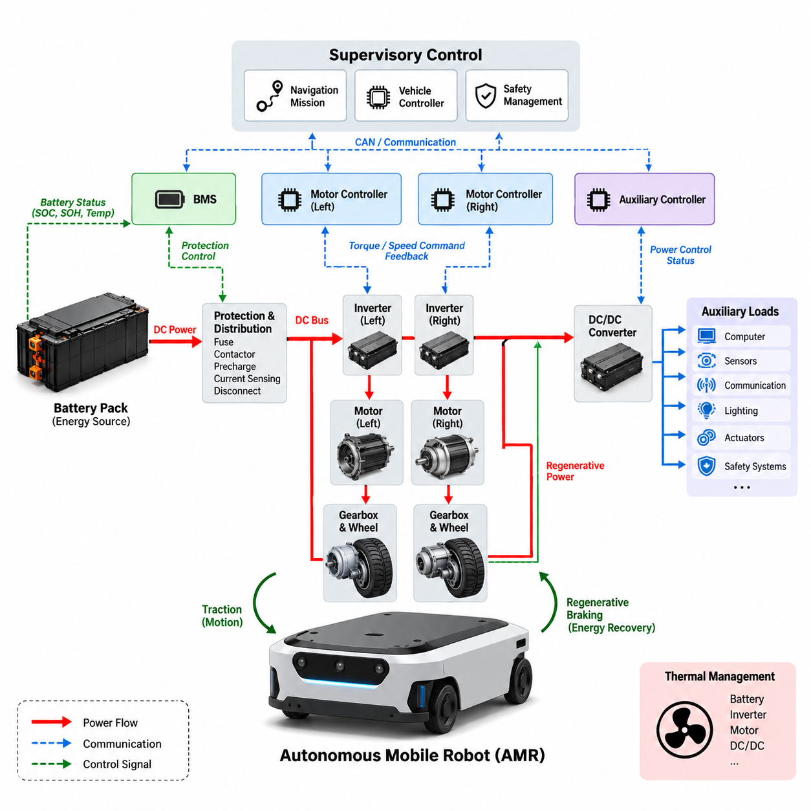
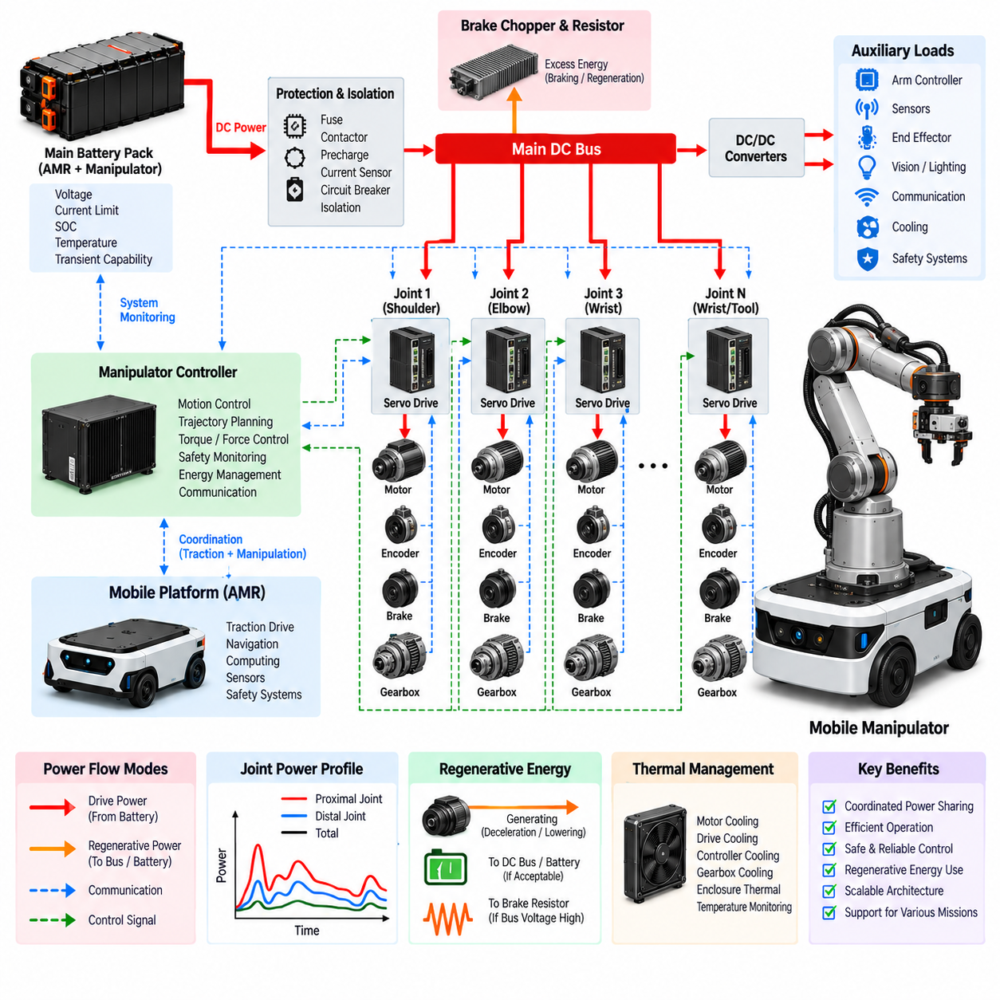
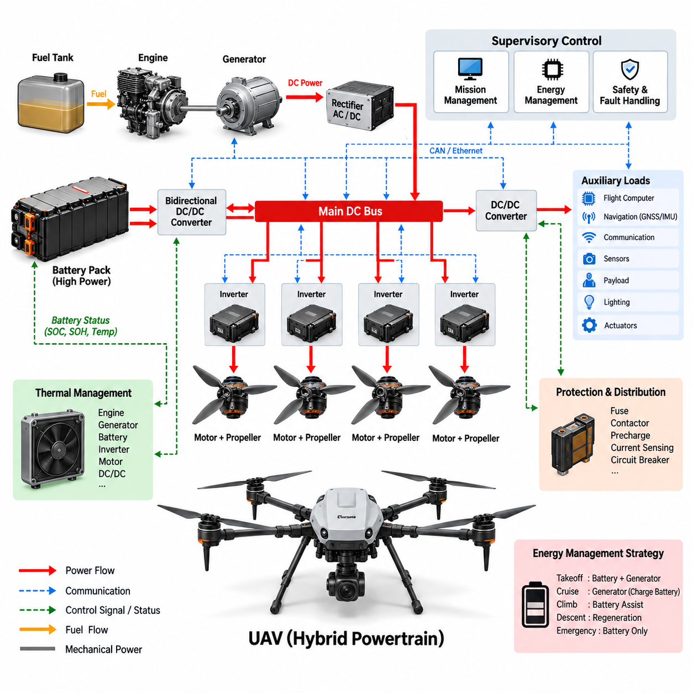
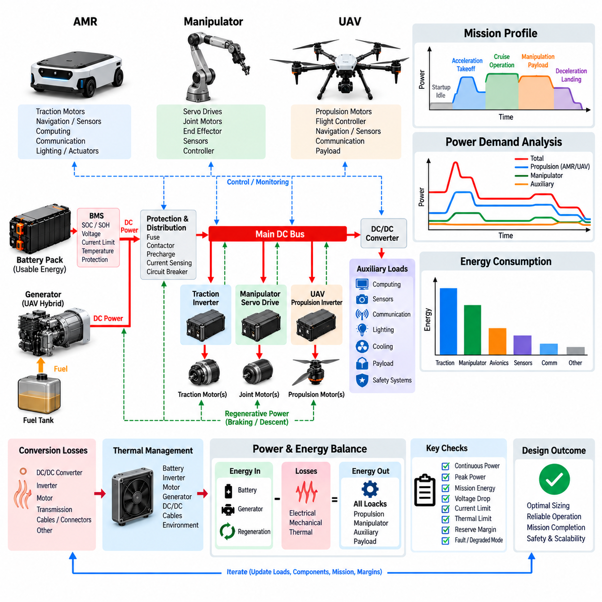
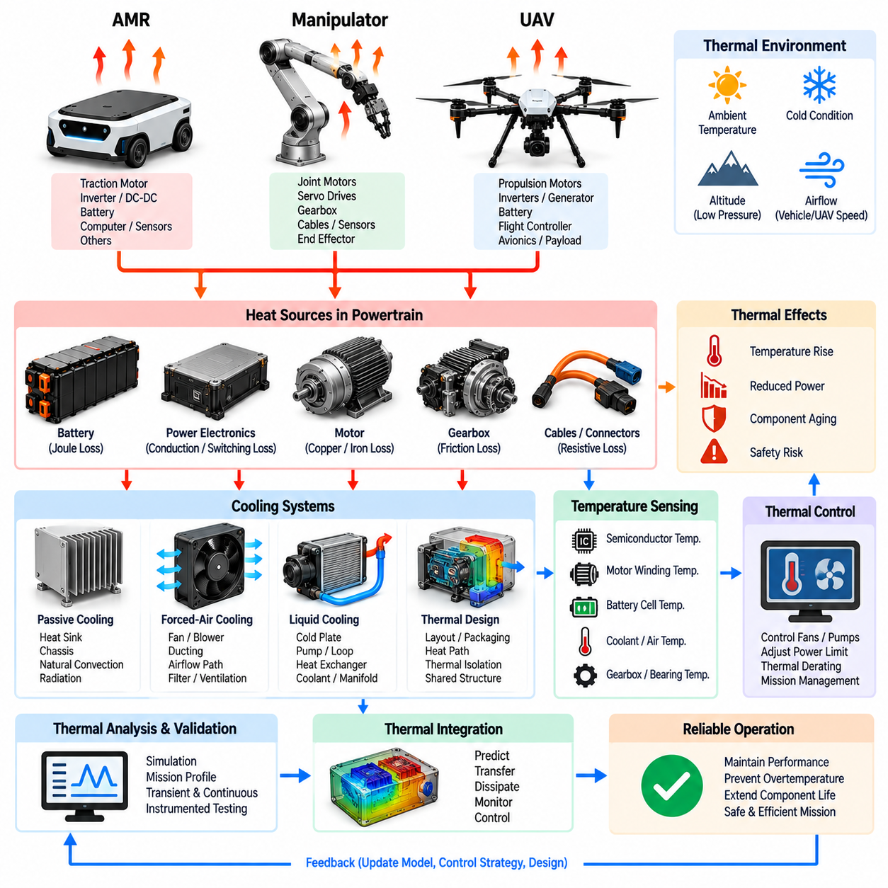

**Volume 11. Battery and Powertrain**

# Chapter 10. Robot Powertrain Integration

## 10.01. AMR Powertrain Architecture

{width="7.268055555555556in" height="7.268055555555556in"}

An autonomous mobile robot powertrain is the integrated energy and motion system that converts stored electrical energy into controlled wheel torque while maintaining stable power for computing, sensing, communication, and safety functions. In the structure of this volume, AMR powertrain architecture represents the system-level integration of the battery, BMS, protection devices, DC/DC conversion, inverter, motor driver, traction motor, braking functions, and supervisory control.

The battery pack forms the primary energy source and establishes the main DC bus from which propulsion and auxiliary loads are supplied. Battery chemistry, nominal voltage, usable capacity, discharge capability, internal resistance, and thermal characteristics determine the available operating envelope. The BMS continuously evaluates cell voltage, pack current, temperature, SOC, and protection conditions so that the powertrain operates within allowable electrical and thermal limits.

Power leaving the battery normally passes through a protected distribution path containing fuses, contactors, precharge circuitry, current sensing, and disconnect elements. These components isolate faults and control connection of the high-current traction bus. Precharge is particularly important because inverter DC-link capacitors can otherwise create severe inrush current when the main contactor closes, potentially damaging contacts, connectors, capacitors, or upstream protection devices.

The traction branch converts DC-bus energy into mechanical motion through the inverter, motor driver, and electric motor. For BLDC or PMSM propulsion, the inverter generates controlled three-phase voltages and currents according to the requested wheel torque and speed. Field-oriented control and PWM-based modulation allow the controller to regulate motor flux and torque efficiently over a wide operating range while maintaining smooth low-speed behavior required for precise AMR maneuvering.

Mechanical power reaches the ground through the motor, reduction gearbox, axle or wheel hub, bearings, wheels, and tires. The selected gear ratio converts motor speed into the wheel torque required for acceleration, payload transport, slope climbing, obstacle traversal, and controlled low-speed motion. Architecture therefore cannot be optimized by motor power alone; motor torque-speed characteristics, gearbox efficiency, wheel radius, vehicle mass, rolling resistance, and maximum gradient must be evaluated together.

Differential-drive AMRs commonly employ independent left and right traction channels, allowing vehicle translation and yaw to be generated through coordinated wheel-speed or wheel-torque control. Each channel may contain a dedicated inverter and motor, while both channels share the battery and main DC bus. This arrangement simplifies mechanical steering but makes electrical synchronization, encoder feedback, traction control, current limiting, and communication latency important contributors to vehicle-level motion quality.

The auxiliary power architecture operates alongside the traction system. DC/DC converters derive regulated voltage rails for controllers, computers, LiDAR, cameras, radar, GNSS, communication devices, lighting, actuators, and safety electronics. Separating sensitive electronic loads from rapidly changing motor loads reduces disturbances caused by switching currents and acceleration transients, while appropriate grounding, filtering, isolation, and distribution improve EMC performance and system availability.

Powertrain control is hierarchical rather than concentrated in a single controller. A vehicle controller interprets navigation and motion commands and generates propulsion requests, while motor controllers execute fast current, torque, and speed loops. The BMS independently enforces battery limits, and safety controllers can override normal propulsion when hazardous conditions occur. CAN or similar deterministic interfaces exchange torque commands, speed feedback, temperatures, fault states, SOC, and operating permissions among these subsystems.

Regenerative braking reverses the normal power flow when the traction motors operate as generators during deceleration or downhill motion. Mechanical kinetic energy is converted into electrical energy through the motor and inverter and returned to the DC bus. The amount that can be recovered depends on vehicle speed, demanded deceleration, conversion efficiency, battery SOC, battery temperature, and permitted charging current, making regeneration a coordinated battery-powertrain function rather than only a motor-control feature.

When the battery cannot accept the requested regenerative power, the control architecture must reduce electrical regeneration and provide another means of achieving the required deceleration. This condition can occur at high SOC, low temperature, battery protection limits, or fault states. Brake blending coordinates regenerative torque with mechanical or electrically dissipative braking so that vehicle deceleration remains predictable even when the allowable energy-recovery level changes dynamically.

Transient behavior is especially important because AMR power demand is strongly time varying. Starting from rest, rapid acceleration, pivot turns, obstacle crossing, slope climbing, and emergency maneuvers can produce current peaks far above average cruising demand. The battery, conductors, connectors, contactors, inverter, DC-link capacitor, and motor must therefore tolerate short-duration peak loads without excessive voltage sag, thermal stress, nuisance protection trips, or degradation of computing and sensor supplies.

Thermal architecture links every major powertrain component. Battery losses, semiconductor switching and conduction losses, motor copper and iron losses, gearbox friction, and DC/DC conversion losses ultimately become heat. Component placement, enclosure design, heat sinks, airflow, conductive paths, temperature sensing, and software derating must be coordinated so that sustained operation remains possible under the intended payload, ambient temperature, speed profile, gradient, and mission duration.

Energy efficiency should be evaluated across the complete conversion chain rather than as isolated component efficiencies. Battery resistance, cable losses, contact resistance, inverter efficiency, motor efficiency, gearbox efficiency, tire deformation, and auxiliary consumption all influence energy delivered per mission. A highly efficient motor alone cannot compensate for poor gearing, excessive vehicle resistance, inefficient conversion, or unnecessary auxiliary consumption, so mission-level energy modeling is essential during architecture development.

Fault containment is another defining characteristic of a robust AMR powertrain. Overcurrent, short circuit, inverter failure, motor overtemperature, encoder loss, communication timeout, battery undervoltage, contactor welding, insulation problems, or unexpected wheel behavior must transition the robot toward a controlled state. Protection should distinguish faults requiring immediate torque removal from degradations that permit reduced-speed operation, enabling both safety and practical system availability.

Powertrain diagnostics should preserve information across the energy and motion chain so that a vehicle-level fault can be traced to its physical origin. Logged battery current, DC-bus voltage, inverter current, motor temperature, wheel speed, torque request, controller state, and fault timestamps provide valuable correlation data. Consistent time synchronization and diagnostic interfaces make it possible to distinguish electrical limitations from mechanical resistance, control instability, communication problems, or battery degradation.

Packaging strongly affects electrical performance and maintainability. High-current paths should be short and appropriately sized, switching power electronics should be positioned with consideration for EMI and thermal rejection, and service disconnects should remain accessible. Connectors and harnesses must tolerate vibration, contamination, repeated maintenance, and expected current levels while avoiding routing that couples inverter switching noise into low-level sensor or communication circuits.

Modularity can improve scalability across different AMR variants. A common battery and protected DC-bus architecture may support multiple motor ratings, payload classes, wheel configurations, or auxiliary computing packages if interfaces and operating limits are defined correctly. Modular traction units combining inverter, motor, encoder, gearbox, and local diagnostics can simplify assembly and service, while standardized electrical and communication interfaces reduce redesign when the platform evolves.

Powertrain sizing should ultimately be driven by the mission profile. Vehicle mass, payload, maximum velocity, acceleration, gradient, rolling resistance, duty cycle, operating hours, charging opportunities, environmental temperature, and auxiliary power establish the required torque, peak electrical power, continuous power, and battery energy. These values must then be checked against component thermal limits and battery discharge capability rather than relying only on nominal component ratings.

Charging architecture is also part of AMR powertrain integration because fleet productivity depends on how energy is replenished between missions. Manual charging, automatic docking, and opportunity charging impose different requirements on BMS communication, contactor sequencing, charger interfaces, thermal supervision, and mission scheduling. The architecture should prevent propulsion during unsafe charging states while allowing automated systems to coordinate charging availability with SOC and operational demand.

At system level, an effective AMR powertrain therefore forms a closed energy-management chain: stored battery energy is protected and distributed, converted into controlled traction torque, partially recovered during braking, and continuously supervised according to electrical, thermal, mechanical, and safety constraints. This integration establishes the foundation for the subsequent robot powertrain topics of manipulator power architecture, UAV hybrid powertrains, power-budget analysis, and thermal integration identified in the volume structure.

## 10.02. Manipulator Power Architecture

{width="7.268055555555556in" height="7.268055555555556in"}

A manipulator power architecture defines how electrical energy is distributed, converted, controlled, and protected across the joints, actuators, end effectors, sensors, and controllers of a robotic arm. Within an integrated mobile manipulator, it must also coordinate with the mobile platform powertrain so that traction and manipulation can operate simultaneously without destabilizing the shared battery or DC bus. The architecture therefore connects energy storage, power distribution, servo drives, motors, braking circuits, auxiliary converters, and supervisory control into one coordinated system.

The primary power source may be a dedicated manipulator battery or, more commonly in a mobile manipulator, the main battery pack shared with the AMR platform. A protected DC bus distributes this energy toward the manipulator subsystem while maintaining appropriate voltage and current limits. Battery voltage, allowable discharge current, SOC, temperature, and transient capability determine how much electrical power can be assigned to the arm without compromising vehicle propulsion, computing equipment, sensors, or safety systems.

Before power reaches the manipulator drives, it normally passes through protection and isolation devices such as fuses, contactors, circuit breakers, current sensors, and precharge circuits. These devices provide controlled energization and fault isolation between the common power source and the robotic arm. Precharge becomes important when multiple servo drives contain substantial DC-link capacitance because simultaneous connection can create large inrush currents that stress connectors, contactors, wiring, and the battery protection system.

A multi-axis manipulator typically contains several servo axes corresponding to shoulder, elbow, wrist, and other articulated joints. Each axis combines a servo drive, electric motor, position sensor, mechanical transmission, and joint mechanism. The servo drive converts DC-bus power into controlled motor phase currents according to torque, velocity, and position commands. Coordinated operation of these axes generates the precise joint trajectories required for reaching, lifting, inspection, assembly, handling, or tool operation.

Permanent-magnet synchronous motors and brushless motors are widely suited to manipulator joints because they provide high torque density, controllability, and efficiency. Field-oriented control regulates motor current so that commanded joint torque can be produced accurately across dynamic operating conditions. Encoders or other position sensors provide feedback for nested current, velocity, and position loops, while higher-level motion control synchronizes individual axes to achieve the desired end-effector position, orientation, velocity, and force behavior.

Joint power requirements vary substantially across the manipulator. Large proximal joints near the base generally experience greater gravitational and inertial loads because they support downstream links, actuators, tooling, and payload. Smaller wrist joints may require lower continuous power but demand rapid dynamic response. Consequently, applying identical motor and drive ratings to every joint is usually inefficient; each axis should be sized according to torque-speed requirements, payload, link inertia, duty cycle, acceleration, and thermal conditions.

Mechanical transmission strongly influences electrical power architecture. Harmonic drives, planetary gearboxes, cycloidal reducers, belts, or other reduction mechanisms convert high-speed motor output into the torque required at each joint. Gear ratio affects motor operating speed, required current, reflected inertia, efficiency, and backdrivability. Powertrain selection must therefore consider the motor, inverter, gearbox, joint structure, and expected motion profile as a combined electromechanical system rather than as independently selected components.

Manipulator operation creates highly dynamic power demand because several joints may accelerate, decelerate, hold payloads, or reverse direction simultaneously. Peak electrical power can become much larger than the average mission consumption during rapid arm extension, payload lifting, emergency stopping, or synchronized multi-axis motion. The battery, DC bus, protection devices, cables, connectors, and servo drives must tolerate these transient peaks without excessive voltage drop, nuisance shutdown, or interference with other robot subsystems.

Regenerative energy is also significant in robotic manipulators. When a joint decelerates or a gravitational load drives a motor backward, the servo motor can operate as a generator and return energy to the common DC bus. Other accelerating joints may immediately consume part of this regenerated energy, improving system efficiency. If the returned energy exceeds instantaneous system demand and the battery cannot accept it, the architecture requires controlled energy management to prevent excessive DC-bus voltage.

A braking resistor and brake chopper can provide an alternative energy path when regenerative power cannot be absorbed by the battery or other loads. The brake chopper monitors DC-bus voltage and connects the resistor when voltage exceeds a defined threshold, converting excess electrical energy into heat. This function is particularly important during emergency stops, rapid downward payload motion, or simultaneous deceleration of several joints, where regenerated energy can rise faster than the normal energy-storage system can absorb it.

Many manipulator joints also employ electrically released holding brakes. These brakes are different from regenerative braking because their primary purpose is to prevent uncontrolled joint movement when motor torque is unavailable. Vertical or gravity-loaded axes may require the brake to engage during power loss, emergency stop, controller shutdown, or detected drive failure. Brake power, release sequencing, diagnostic feedback, and safe engagement timing must therefore be integrated with servo control and the robot safety architecture.

Auxiliary power conversion supplies lower-voltage loads that should not be connected directly to the main servo DC bus. DC/DC converters can provide regulated rails for joint encoders, force-torque sensors, cameras, proximity sensors, tool electronics, communication devices, safety circuits, and local controllers. Separating these loads from high-current servo switching reduces electrical disturbance and allows each voltage domain to receive appropriate filtering, grounding, isolation, protection, and power-quality management.

The end effector introduces another important power domain because different missions may require grippers, vacuum pumps, electric screwdrivers, inspection sensors, welding tools, cameras, or specialized actuators. Tool power should be treated as a controlled interface with defined voltage, current, peak power, grounding, communication, and protection requirements. A standardized end-effector power interface simplifies tool replacement while preventing an attached device from exceeding the electrical capability of the manipulator or destabilizing the shared supply.

Power sequencing is essential when the manipulator transitions between off, standby, enabled, operational, fault, and emergency states. Control electronics may need to become operational before servo power is enabled, while position feedback and safety status must be validated before holding brakes are released. During shutdown, torque removal, brake engagement, servo isolation, and auxiliary power removal should occur in a controlled sequence that prevents uncontrolled motion and preserves diagnostic information.

Communication links connect power management with motion control. The manipulator controller exchanges position, velocity, torque, current, temperature, voltage, fault, and operating-state information with individual servo drives through deterministic industrial or robotic networks. The BMS and vehicle controller provide information about available battery power and system operating limits. This allows the motion planner or supervisory controller to modify acceleration, payload motion, or simultaneous axis operation when electrical or thermal margins become limited.

Thermal management must consider the cumulative losses of motors, servo drives, braking resistors, DC/DC converters, cables, and mechanical transmissions. Manipulator joints can be difficult to cool because actuators are often enclosed within compact rotating structures with limited airflow. Temperature sensors, conductive heat paths, heat sinks, enclosure design, duty-cycle limits, and software derating are therefore required to prevent local overheating while preserving useful torque and motion performance.

Harness design becomes particularly challenging because power and communication lines must pass through moving joints. Repeated bending, torsion, vibration, and limited routing space can degrade conductors and connectors over the robot lifetime. High-current motor cables should be separated from sensitive encoder and communication wiring where practical, while shielding, grounding, strain relief, bend radius, flexible cable selection, and connector retention must account for the manipulator\'s full range of motion and expected cycle life.

Fault management should prevent a failure in one joint or tool from propagating through the entire robot. Overcurrent, short circuit, motor overtemperature, encoder failure, communication loss, brake malfunction, DC-bus overvoltage, or insulation faults require defined responses. Depending on severity, the architecture may disable one axis, restrict manipulator motion, command a controlled stop, engage holding brakes, isolate servo power, or request complete vehicle shutdown through the higher-level safety system.

For a mobile manipulator, coordinated power budgeting between locomotion and manipulation is especially important. Driving uphill while lifting a heavy payload can create simultaneous traction and arm power peaks, whereas stationary manipulation may allow more battery power to be allocated to the arm. Supervisory energy management can dynamically assign power limits according to SOC, temperature, mission priority, traction demand, manipulator demand, and auxiliary consumption, preventing independent subsystems from competing unpredictably for the same electrical source.

An effective manipulator power architecture therefore forms an integrated electromechanical energy network extending from the battery and protected DC bus through servo drives and motors to individual joints and the end effector. Regeneration, braking, auxiliary conversion, thermal management, diagnostics, safety, communication, and power budgeting must operate together. This system-level integration enables precise manipulation while maintaining electrical stability, predictable fault behavior, energy efficiency, and safe coordination with the larger mobile robotic platform.

## 10.03. UAV Hybrid Powertrain

{width="7.268055555555556in" height="7.268055555555556in"}

A UAV hybrid powertrain combines two or more energy sources so that the aircraft can achieve flight endurance, peak-power capability, redundancy, and mission flexibility beyond what a single source can normally provide. Within the robot powertrain integration structure, the hybrid system connects energy storage, generation, power conversion, propulsion motors, distribution, thermal management, and supervisory control into a coordinated electrical architecture suitable for demanding unmanned aerial vehicle missions.

The fundamental challenge is that UAV propulsion requires both high specific energy and high specific power. Hover, vertical takeoff, rapid climb, maneuvering, and disturbance rejection can demand very high instantaneous power, while long-range cruise requires efficient energy delivery over extended periods. A hybrid architecture separates these requirements by assigning sustained energy production to one source and transient power support to another, allowing each component to operate closer to its efficient region.

A common configuration combines a fuel-powered engine-generator with a rechargeable battery pack. The engine drives an electrical generator that supplies the main DC bus during sustained operation, while the battery absorbs short-term differences between generated power and propulsion demand. This series-hybrid arrangement electrically decouples the mechanical engine from the propellers or rotors, allowing distributed electric propulsion motors to be controlled independently without complex mechanical transmissions.

The battery remains essential even when an onboard generator supplies most mission energy. During vertical takeoff or rapid climb, propulsion demand may exceed generator capability, and the battery provides additional peak power through the shared DC bus. During lower-demand cruise, generator output can support propulsion while replenishing the battery. The battery therefore operates as an energy buffer that smooths power fluctuations and reduces the need to size the generator for the absolute propulsion peak.

The generator should generally be sized around sustained mission power rather than maximum instantaneous demand. Oversizing it increases aircraft mass, fuel consumption, cooling requirements, and structural burden, while undersizing it causes excessive battery depletion during normal flight. Proper sizing requires analysis of hover power, cruise power, climb duration, payload, aerodynamic efficiency, propulsion efficiency, environmental conditions, reserve requirements, and expected mission duration as a complete operating profile.

The main DC bus forms the electrical backbone of the hybrid powertrain. Generator output, battery energy, propulsion inverters, DC/DC converters, auxiliary loads, protection devices, and power-management controllers interact through this bus. Bus voltage must remain within a controlled range despite rapid propulsion changes, source transitions, converter operation, or faults. Appropriate capacitance and power-electronic regulation help suppress transients that could otherwise destabilize motor drives or avionics.

A bidirectional DC/DC converter can provide controlled coupling between the battery and the propulsion DC bus. Instead of allowing battery current to follow bus conditions passively, the converter regulates charge and discharge power according to commands from the energy-management controller. This enables controlled peak-power assistance, battery charging, DC-bus stabilization, current limiting, and electrical isolation between voltage domains when battery voltage varies significantly across its operating SOC range.

Each propulsion motor is typically supplied through an inverter that converts DC-bus energy into controlled multiphase motor current. BLDC or PMSM machines are attractive for electric UAV propulsion because of their high efficiency and power density. Motor controllers regulate torque and rotational speed according to commands from the flight-control system, while fast electrical control allows multiple propulsion units to respond independently to attitude, altitude, trajectory, and stability requirements.

Distributed electric propulsion creates a close relationship between power architecture and flight control. A multirotor or distributed-lift UAV may contain many propulsion channels, each consisting of an inverter, motor, propeller or rotor, sensing, and protection functions. The power distribution system must support simultaneous high-current operation while preventing a fault in one channel from collapsing the entire propulsion bus. Electrical segmentation and selective isolation can therefore contribute directly to aircraft survivability.

Hybrid energy management determines how generator power and battery power are shared throughout the mission. During takeoff, both sources may supply propulsion simultaneously. During efficient cruise, the generator can provide most of the required power while maintaining battery SOC near a target range. During descent or low-demand operation, available generator capacity may recharge the battery. The controller continuously balances efficiency, battery condition, thermal limits, fuel availability, and future mission requirements.

Battery SOC alone is insufficient for hybrid power management. The controller must also consider battery SOH, temperature, allowable discharge current, allowable charging current, cell-voltage limits, and predicted power capability. A battery with adequate stored energy may still be unable to deliver a required takeoff burst if it is cold or degraded. Consequently, mission planning should evaluate both remaining energy and available instantaneous power before committing the aircraft to critical flight phases.

Source transitions must be managed without interrupting propulsion. Engine startup, generator synchronization, battery connection, converter activation, generator shutdown, or fault isolation can produce voltage and current disturbances if sequencing is poorly controlled. The hybrid controller therefore coordinates contactors, precharge circuits, converters, generator controls, and propulsion loads so that the DC bus remains stable while the system moves between operating states.

Fault tolerance is particularly important because loss of propulsion power in flight has more severe consequences than a comparable interruption in a ground robot. Generator failure should not automatically cause immediate propulsion loss if the battery retains sufficient emergency energy. Likewise, a battery fault may permit restricted generator-powered flight depending on the architecture. Redundant power paths, isolated propulsion groups, independent protection, and degraded operating modes can provide additional opportunities for controlled landing.

Protection coordination must distinguish between local faults and system-level emergencies. Short circuits, inverter failures, motor overcurrent, battery faults, generator overtemperature, DC-bus overvoltage, converter malfunction, insulation degradation, or communication loss require different responses. Selective protection should disconnect the affected branch whenever possible while preserving healthy propulsion channels, avionics, flight control, navigation, and communication systems required to maintain aircraft control.

Auxiliary power must also be integrated because avionics and mission equipment depend on the propulsion energy system. Isolated or non-isolated DC/DC converters can create regulated low-voltage rails for flight computers, GNSS, IMUs, communication equipment, navigation sensors, payload electronics, lighting, and actuators. These supplies should tolerate propulsion transients and switching noise so that high-power motor activity does not degrade sensor accuracy, communication reliability, or flight-control computation.

Electromagnetic compatibility becomes challenging as propulsion power increases. High-current inverters, switching converters, generator rectifiers, long cables, and rapidly changing motor currents can generate conducted and radiated interference. Cable routing, shielding, grounding, filtering, common-mode control, enclosure design, and physical separation should therefore be considered together with the power architecture, particularly around GNSS receivers, radios, inertial sensors, and other noise-sensitive avionics.

Thermal integration is inseparable from hybrid powertrain design because the engine-generator, battery, inverter, motor, DC/DC converter, and braking or protection devices all generate heat. Cooling equipment itself adds mass and consumes power, so thermal design must balance heat rejection against aircraft weight and aerodynamic penalties. Component placement can exploit airflow while temperature monitoring and software derating prevent sustained operation beyond allowable thermal limits.

Mass distribution is as important as total mass. Batteries, generators, fuel tanks, power electronics, and propulsion units must be positioned with consideration for the aircraft center of gravity and its movement as fuel is consumed. Electrical cable length and conductor mass also increase when major power components are widely separated. Power architecture and mechanical packaging must therefore be developed together rather than treating electrical equipment placement as a late-stage packaging activity.

Power budgeting must cover every mission phase, including startup, takeoff, hover, climb, cruise, payload operation, descent, landing, reserve, and emergency operation. Average mission energy determines fuel and battery capacity, while peak electrical power determines converter, battery, inverter, motor, connector, and conductor ratings. These two requirements should be evaluated separately because a system with sufficient total energy can still fail if it cannot deliver the instantaneous power required for safe flight.

An effective UAV hybrid powertrain therefore behaves as a coordinated energy network rather than as a generator simply connected to a battery. Energy generation, storage, conversion, propulsion, distribution, protection, thermal control, diagnostics, and flight supervision must continuously exchange information and adapt to mission conditions. Proper integration allows the UAV to exploit fuel-based energy density and battery-based power responsiveness while maintaining stable electrical power for propulsion and critical onboard systems.

At the robot powertrain integration level, this architecture extends the principles used for AMRs and manipulators into a flight-critical environment where weight, power density, redundancy, and fault response become dominant constraints. The resulting hybrid system provides the basis for subsequent power-budget analysis and thermal integration, where mission energy, peak loads, conversion losses, component sizing, and heat generation can be evaluated across the complete robotic power system.

## 10.04. Power Budget Analysis

{width="7.268055555555556in" height="7.268055555555556in"}

Power budget analysis establishes whether a robotic system can supply sufficient electrical power and energy across every operating condition without exceeding battery, converter, conductor, protection, or thermal limits. Within robot powertrain integration, it connects component-level electrical characteristics with mission-level behavior. The analysis must distinguish continuous consumption, transient peaks, stored energy, conversion losses, regenerative power, reserve capacity, and degraded operating conditions rather than relying on a single nominal power value.

The first step is to define every significant electrical load and the power path that supplies it. Propulsion motors, manipulator actuators, computers, sensors, communication equipment, lighting, cooling devices, safety controllers, payload electronics, pumps, and auxiliary actuators may operate simultaneously or according to different duty cycles. Each load should be characterized by voltage, nominal current, peak current, average power, maximum power, startup behavior, operating duration, and allowable interruption.

Continuous power represents the electrical demand that the system must sustain without exceeding component thermal limits. For an AMR, this may include average traction power together with computing, perception, communication, and cooling loads. For a manipulator, continuously energized servo drives and holding loads must be considered. For a UAV, cruise propulsion and avionics can dominate. Continuous ratings of batteries, converters, inverters, connectors, conductors, and cooling systems must exceed the corresponding sustained demand with appropriate engineering margin.

Peak power analysis addresses short-duration events that can be substantially more demanding than normal operation. AMR acceleration, pivot turning, obstacle traversal, manipulator payload lifting, simultaneous joint acceleration, UAV takeoff, rapid climb, and emergency maneuvering can produce large current peaks. The power architecture must deliver these peaks without excessive DC-bus voltage sag, converter current limiting, protection trips, connector overheating, or unintended reset of sensitive computing and control electronics.

Peak loads should not simply be added together unless they can realistically occur simultaneously. A useful power budget therefore includes operating scenarios and coincidence factors that represent actual system behavior. Propulsion acceleration and manipulator lifting may overlap on a mobile manipulator, while some auxiliary equipment may remain inactive during those events. Scenario-based analysis prevents both dangerous undersizing and unnecessary oversizing caused by assuming that every component continuously consumes its maximum rated power.

Mission energy differs from instantaneous power and must be calculated separately. Energy consumption is determined by integrating power over time across the mission profile. A robot may have adequate peak-power capability but insufficient battery energy to complete its required operating period. Conversely, a large battery may contain sufficient total energy but still be unable to provide a short high-current event because of cell resistance, BMS limits, temperature, SOC, or converter restrictions.

The mission profile should divide operation into representative phases such as startup, idle, acceleration, cruise, manipulation, payload operation, climbing, braking, charging, and shutdown. UAV analysis additionally includes takeoff, hover, climb, cruise, descent, landing, and reserve flight. The duration and expected power of each phase establish mission energy consumption, while the maximum overlapping loads within each phase determine the electrical peak requirements imposed on the distribution system.

Battery usable energy is lower than nominal stored energy. SOC operating limits, battery aging, temperature, discharge-rate effects, internal resistance, BMS restrictions, and required reserve capacity reduce the energy available to the mission. A power budget should therefore use a defined usable SOC window rather than assuming that the full nameplate capacity can be consumed. This distinction becomes increasingly important when reliable return-to-base, emergency operation, or long battery life is required.

Conversion losses must be propagated through the complete power path. Battery output power is greater than mechanical output because energy is lost in conductors, connectors, contactors, DC/DC converters, inverters, motors, and mechanical transmissions. Auxiliary rails also experience conversion losses between the main DC bus and low-voltage electronics. Calculating only load-side power underestimates battery demand, so each conversion stage should be represented by an appropriate efficiency under the relevant operating condition.

Efficiency is not constant across the entire operating range. Motors and inverters may operate efficiently near their preferred torque-speed region but less efficiently at very low load or extreme current. DC/DC converters also exhibit load-dependent efficiency, while battery losses increase approximately with the square of current through internal resistance. Consequently, realistic power analysis should consider operating-point efficiency rather than applying one idealized efficiency value to every mission condition.

Regenerative energy introduces bidirectional power flow into the budget. During AMR deceleration, manipulator joint lowering, or other back-driven motion, motors can return energy to the DC bus. This recovered energy may reduce net mission consumption if the battery or another load can accept it. However, regeneration should not automatically be counted as guaranteed energy savings because recovery depends on speed, control strategy, conversion efficiency, battery SOC, temperature, and allowable charging power.

The DC bus must be analyzed as both an energy distribution node and a dynamic electrical system. Rapid changes in motor demand can cause voltage sag, while regenerative events can cause voltage rise. Bus capacitance provides short-term buffering, but sustained imbalance must be handled by the battery, generator, bidirectional converter, or braking circuit. Minimum and maximum bus-voltage limits should therefore be checked for worst-case motoring, regeneration, source transition, and fault scenarios.

Current budget analysis is necessary because components are often constrained by current rather than power alone. At lower battery voltage, the same power requires higher current, increasing conductor loss and voltage drop. Battery discharge near its lower SOC limit can therefore represent a severe condition for cables, connectors, contactors, fuses, and semiconductor devices. Maximum expected current should be evaluated using the minimum credible operating voltage rather than nominal voltage alone.

Voltage-drop analysis connects the power budget with harness design. Resistance in cables, connectors, fuses, contactors, and distribution paths produces voltage loss proportional to current. During high-power transients, accumulated voltage drop can reduce the voltage available to an inverter or converter even when battery voltage remains within specification. Critical loads should therefore be evaluated at their actual terminals under worst-case current, temperature, cable length, and connection resistance.

Thermal budgeting is directly coupled to electrical budgeting because most electrical losses become heat. Conduction losses in wiring and semiconductors, switching losses in converters and inverters, battery internal losses, motor losses, and mechanical friction increase cooling requirements. A component may satisfy instantaneous electrical ratings but still exceed its temperature limit during sustained operation. Continuous power capability must therefore be verified against realistic cooling conditions and ambient temperature.

Power margin is required because calculated mission values cannot represent every manufacturing variation, environmental condition, aging mechanism, or unexpected operating event. Engineering margin can accommodate increased friction, reduced battery capability, additional payload electronics, sensor upgrades, converter degradation, and temperature effects. Margin should be deliberately assigned and documented rather than hidden by arbitrary oversizing, allowing designers to understand where electrical capacity remains available for future system growth.

Reserve energy is particularly important for autonomous systems. An AMR may require enough energy to leave an operating area and reach a charger, while a UAV requires energy for diversion, landing, or emergency operation. Reserve should therefore be treated as unavailable for routine mission planning. Energy-management software can establish warning, return, restricted-operation, and critical thresholds so that the system progressively reduces mission capability before reaching an unsafe energy state.

Load prioritization allows a robot to remain controllable when available power becomes limited. Flight control, safety controllers, braking systems, essential communication, and localization may require higher priority than payload processing, lighting, nonessential sensors, or high-performance computing. A hierarchical load-shedding strategy can disable or reduce lower-priority functions while preserving essential control. This converts the power budget from a static spreadsheet into an operational energy-management policy.

For hybrid systems, the budget must separately describe energy generation, battery contribution, and load demand. A UAV generator may cover sustained cruise power while the battery supplies takeoff and climb peaks. If generator output exceeds propulsion demand, the surplus can recharge the battery, subject to charging limits. The analysis must track this energy balance over time to ensure that battery SOC remains adequate for later high-power phases and emergency requirements.

Power-budget verification should combine analytical calculations with measurement. Instrumented testing can record battery voltage, DC-bus voltage, branch current, inverter power, motor power, converter efficiency, auxiliary consumption, temperature, and SOC throughout representative missions. Comparing measured profiles with predicted values reveals incorrect assumptions, hidden loads, unexpected peaks, efficiency errors, and thermal constraints, enabling the analytical model to be refined before final design validation.

A mature power budget becomes a system-level engineering model linking electrical architecture, mission planning, thermal design, battery sizing, and control strategy. It should identify not only average and maximum consumption but also when power is required, how long it is required, which loads coincide, where losses occur, and what reserve remains. This enables AMRs, manipulators, and UAVs to be sized around realistic operating envelopes instead of isolated component ratings.

Ultimately, power budget analysis provides the quantitative foundation for robot powertrain integration. Battery capacity determines available mission energy, while battery and converter power capability constrain dynamic operation; distribution components determine safe current delivery, and conversion losses determine heat generation. By combining these relationships with mission profiles, regeneration, reserve policy, fault modes, and load prioritization, designers can establish a power architecture that remains efficient, thermally sustainable, scalable, and operationally robust.

## 10.05. Thermal Integration

{width="7.268055555555556in" height="7.268055555555556in"}

Thermal integration defines how heat generated throughout a robotic powertrain is predicted, transferred, dissipated, monitored, and controlled as part of the complete system architecture. In robot powertrain integration, thermal behavior cannot be treated as a secondary packaging issue because battery capability, semiconductor reliability, motor torque, converter efficiency, cable rating, and mission duration are all temperature dependent. Electrical, mechanical, thermal, and control design must therefore be developed as a coupled engineering problem.

Every conversion of energy produces losses that ultimately appear as heat. Battery internal resistance creates Joule heating, semiconductor conduction and switching generate inverter and converter losses, motor windings produce copper losses, magnetic materials produce iron losses, and gearboxes create frictional losses. Connectors, contactors, fuses, and cables also generate heat through electrical resistance. Thermal integration begins by identifying these distributed heat sources across the entire power path.

Heat generation varies strongly with operating condition rather than remaining constant at the nominal component rating. Motor current can increase sharply during acceleration, climbing, payload lifting, or UAV takeoff, causing copper losses to rise approximately with the square of current. Switching frequency and semiconductor current influence inverter heating, while battery temperature and internal resistance affect cell losses. Thermal analysis must therefore follow realistic mission profiles rather than assuming one steady operating point.

Transient and continuous thermal requirements should be distinguished. A motor or inverter may tolerate a high electrical load for several seconds because its thermal mass temporarily absorbs the generated heat, even though the same load cannot be maintained continuously. This creates short-term peak and long-term continuous operating envelopes. Accurate thermal integration uses component thermal capacity, heat-transfer resistance, duty cycle, and cooling performance to determine how long elevated power can safely be sustained.

The battery requires particularly careful thermal management because temperature affects power capability, charging acceptance, aging, efficiency, and safety. High temperature accelerates degradation and may reduce allowable current, while low temperature increases internal resistance and limits both discharge and regenerative charging. Temperature differences among cells can also produce uneven aging and SOC behavior. Pack design should therefore promote uniform thermal conditions rather than simply keeping the average battery temperature below a limit.

Power electronics concentrate substantial heat in relatively small volumes. Inverters, motor drivers, DC/DC converters, rectifiers, and bidirectional converters contain semiconductor switches whose junction temperatures can change rapidly under high current. Thermal paths from semiconductor junctions through packages, substrates, thermal-interface materials, heat sinks, enclosures, and coolant or ambient air must be designed so that junction temperatures remain within allowable limits during both transient and sustained operation.

Motor thermal behavior includes several interacting heat sources and paths. Copper loss heats the windings, iron loss heats the stator core, rotor losses may become important at high speed, and bearings introduce mechanical heating. Heat must then travel through the stator, housing, shaft, mounting structure, air, or coolant. Because winding temperature often limits continuous torque, motor thermal capability can become the actual powertrain constraint even when the inverter and battery still have sufficient electrical capacity.

Mechanical components also participate in the thermal network. Gearboxes, bearings, seals, brakes, and drivetrain interfaces generate frictional heat that varies with speed, torque, lubrication, preload, and environmental conditions. Excessive gearbox temperature can reduce lubricant life and change mechanical efficiency, while brake systems may experience concentrated heating during emergency or repeated stopping. These losses should be included when determining enclosure temperatures and neighboring component exposure.

Passive cooling uses conduction, natural convection, radiation, heat spreaders, heat sinks, chassis structures, and external surfaces without dedicated powered fluid circulation. It is attractive for robots because it reduces weight, noise, energy consumption, maintenance, and failure points. However, passive cooling capability depends strongly on component placement and available surface area, making early mechanical integration essential when continuous power density is too high for an isolated enclosure.

Forced-air cooling increases convective heat transfer using fans or blowers and is useful for enclosed computers, power electronics, and some motor systems. Airflow must be treated as an engineered path rather than simply adding a fan. Intake location, exhaust location, pressure drop, recirculation, dust filters, component spacing, and fan degradation influence actual cooling performance. Outdoor robots must additionally consider contamination, water ingress, dust accumulation, and operation at elevated ambient temperatures.

Liquid cooling provides higher heat-transfer capability for power-dense systems such as large propulsion motors, high-current inverters, high-performance batteries, or hybrid UAV generators. A cooling loop may contain cold plates, pumps, hoses, manifolds, heat exchangers, reservoirs, sensors, and control valves. Although liquid cooling improves heat rejection, it adds mass, power consumption, packaging complexity, leakage risk, maintenance requirements, and additional failure modes that must be justified by system-level thermal demand.

AMR thermal integration must account for low vehicle speed and limited natural airflow. Batteries, traction inverters, motors, DC/DC converters, computers, and sensors may operate for many hours inside compact or sealed structures. Repeated acceleration, slope climbing, heavy payloads, and high ambient temperature can gradually accumulate heat. Chassis conduction, controlled ventilation, localized heat sinks, and software derating can be combined to maintain continuous operation without unnecessarily complex cooling hardware.

Manipulator thermal design is complicated by compact joints and moving structures. Servo motors and drives may be embedded inside arm links where airflow is limited, while high-torque proximal joints can remain loaded for extended periods when supporting a payload against gravity. Heat conduction through joint housings and structural links can therefore become important. Thermal design must also prevent heat from damaging encoders, lubricants, cables, seals, or force-sensitive components located near the actuator.

UAV thermal integration introduces different constraints because every cooling component contributes to aircraft mass. Propulsion motors and inverters can benefit from strong external airflow during forward flight, while batteries, generators, and enclosed electronics may require dedicated thermal paths. Hovering, ground operation, high-altitude conditions, and hot environments can significantly change cooling capability. The architecture must therefore be validated across the complete flight envelope rather than assuming favorable cruise airflow.

Hybrid UAVs introduce additional heat sources from the engine, generator, rectifier, fuel system surroundings, and exhaust. These sources can expose batteries and electronics to elevated ambient temperatures if packaging is poorly arranged. Thermal isolation, airflow management, shielding, exhaust routing, and component separation become part of powertrain architecture. Waste heat from the generator system must be managed without creating excessive aerodynamic drag or adding cooling mass that eliminates the hybrid system\'s energy-density advantage.

Thermal interaction between components can be as important as each component\'s individual heat generation. Mounting an inverter beside a hot motor or placing a battery near an engine compartment can raise its inlet or enclosure temperature and reduce available power. Conversely, a robot chassis may serve as a shared heat spreader. System-level thermal models should therefore represent conduction and airflow between neighboring components instead of evaluating every device at an assumed independent ambient temperature.

Temperature sensing provides the feedback required for active thermal management. Sensors may monitor battery cells, module surfaces, semiconductor heat sinks, motor windings, housings, coolant, ambient air, and critical connectors. Measurements should represent the locations most closely related to actual component limits. A single enclosure temperature may not detect a semiconductor junction or winding hotspot, so sensor placement and thermal models must work together to estimate temperatures that cannot be measured directly.

Thermal control software converts temperature information into operating decisions. Fans, pumps, valves, and cooling devices can be controlled according to measured and predicted thermal states. When cooling capacity is insufficient, the controller can reduce motor torque, limit acceleration, restrict charging or regeneration, lower computing power, or modify mission behavior. Progressive thermal derating is generally preferable to an unexpected protective shutdown because it preserves controllability while preventing component damage.

Thermal protection should nevertheless remain independent from normal performance optimization where necessary. Hardware overtemperature protection in batteries, motor drives, converters, and other critical devices provides a final boundary if software control fails. Warning, derating, shutdown, and emergency thresholds can form a layered response. Appropriate hysteresis and recovery logic prevent repeated cycling between states while ensuring that operation is not restored until adequate thermal margin has returned.

Power-budget analysis and thermal integration are tightly connected because electrical losses determine heat generation and temperature determines allowable electrical power. Increasing current may initially satisfy a torque request but subsequently raise component temperature until thermal derating reduces available output. A realistic powertrain model should therefore calculate electrical demand, losses, temperature evolution, and resulting power limits together, especially for long-duration missions and repeated high-load operation.

Thermal validation combines simulation with instrumented testing under representative and worst-case conditions. Temperature, current, voltage, torque, speed, coolant flow, fan operation, ambient conditions, and mission state can be recorded simultaneously to correlate heat generation with system behavior. Tests should include sustained loads, repeated transients, hot environments, reduced cooling capability, and relevant fault conditions so that thermal margins and protection thresholds can be verified experimentally.

Ultimately, thermal integration establishes the sustainable performance envelope of the complete robotic powertrain. Effective design guides heat from batteries, converters, inverters, motors, mechanical transmissions, and auxiliary equipment toward suitable rejection paths while monitoring critical temperatures and adapting operation when necessary. By integrating thermal behavior with power budgeting, protection, packaging, diagnostics, and mission control, AMRs, manipulators, and UAVs can maintain reliable performance without excessive cooling mass or premature component degradation.
